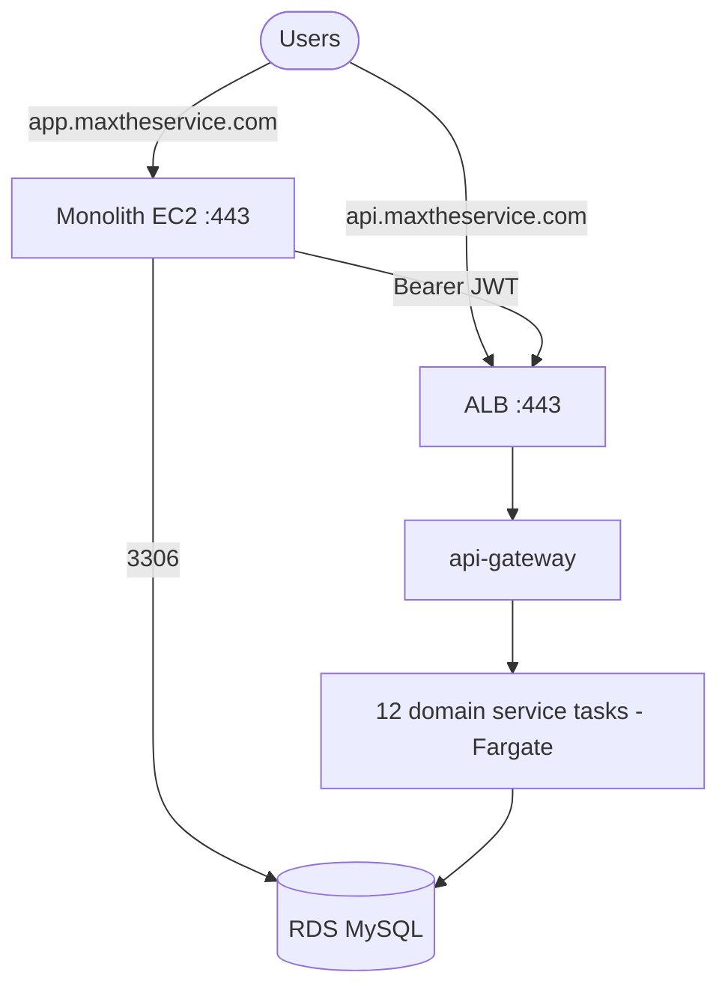

# MyPlus — Production Deployment Runbook (AWS)

**Single ordered checklist to take the current code live on AWS.** Microservices run on **ECS Fargate**
behind an **ALB** (`api.maxtheservice.com`); the **monolith** (Thymeleaf UI) runs on **EC2**
(`app.maxtheservice.com`); **RDS MySQL** holds `myplusdb` + `myplusdb_*`. Secrets live in **AWS Secrets
Manager**; CI/CD is **GitHub Actions + OIDC** (no static keys). All A1–A15 hardening is applied.

Detailed companions: `docs/cicd-aws-review.md` (bootstrap + findings), `docs/monolith-ec2-deployment.md`
(monolith), `docs/deploy-single-ec2.md` (cheap EC2-only fallback). **The operator runs every command
below** — Claude cannot execute AWS/terraform/DNS actions.

---

## Phase 0 — Pre-deploy gate (do FIRST; blocks go-live)

- [ ] **0.1 Decide the release line.** `chore/tech-debt-plan` is feature-complete but the pipeline only
      deploys from `master`/`main`/`security/prod-hardening`. master also diverged (a Dependabot SB
      4.1.0 bump you reverted on the branch). **Merge `chore/tech-debt-plan` → `master`** accepting the
      monolith stays on Spring Boot 3.5.0. (PR #14 — resolve so the branch is canonical, i.e. master ends
      on 3.5.0; or reconcile deliberately.)
- [ ] **0.2 Green build + tests.** `mvn clean install` (monolith) **and** `cd microservices && mvn clean
      install` must pass; `microservice-tests` CI green (needs Docker for Testcontainers). Run the headed
      Cypress smoke (`auth/signup.cy.js`, a business + education flow) against a local stack.
- [ ] **0.3 Tag the release** once green: `git tag -a v1.0.0 -m "first prod release" && git push --tags`.

## Phase 1 — Operator bootstrap (one-time per AWS account)

- [ ] **1.1** Create the Terraform state bucket: `aws s3 mb s3://myplus-terraform-state --region us-east-1`
      (enable versioning).
- [ ] **1.2** Create the **terraform-deploy** IAM role with GitHub OIDC trust (repo + branch), or plan to
      run the first `terraform apply` locally with admin creds. (See `cicd-aws-review.md` §Operator bootstrap.)
- [ ] **1.3** `cp infrastructure/terraform/terraform.tfvars.example terraform.tfvars` and fill:
      `account_id`, and strong secrets `db_password`, `jwt_secret` (`openssl rand -base64 48`),
      `internal_secret`. **Never commit it** (git-ignored).
- [ ] **1.4** Set GitHub repo **secrets**: `AWS_DEPLOY_ROLE_ARN`, `AWS_TERRAFORM_ROLE_ARN`,
      `AWS_ACCOUNT_ID`, `AWS_REGION`, `DB_PASSWORD`, `JWT_SECRET`, `INTERNAL_SECRET`.
- [ ] **1.5** Configure the GitHub **`production` Environment** with required reviewers (deploy gate, A12).

## Phase 2 — Provision infrastructure (Terraform)

- [ ] **2.1** Run `infra-deploy.yml` via **workflow_dispatch → action: `plan`**; review the plan.
      (Or locally: `cd infrastructure/terraform && terraform init && terraform plan`.)
- [ ] **2.2** Run **action: `apply`**. It creates VPC, RDS, ECS cluster, ALB, ECR repos, Secrets Manager,
      ACM cert, OIDC provider + build deploy role. **Apply pauses on ACM validation.**
- [ ] **2.3** At **Hostinger DNS**, add the `acm_validation_record` CNAME (Terraform output) → cert
      validates → apply completes.
- [ ] **2.4** Capture outputs: `github_deploy_role_arn`, `app_dns_cname` (ALB), RDS endpoint. Confirm
      `AWS_DEPLOY_ROLE_ARN` secret matches the build role.
- [ ] **2.5** Add the **`api.maxtheservice.com` → ALB** CNAME at Hostinger (`app_dns_cname`).

## Phase 3 — Deploy microservices (ECS Fargate)

- [ ] **3.1** Push/merge to **`master`** → `ci-cd.yml` runs: build → test gate → Trivy scan → ECR `:sha`
      → register task revision → `aws ecs update-service` → `wait services-stable`, per changed service.
- [ ] **3.2** First deploy builds only *changed* services (paths-filter). To force **all 13**, trigger a
      full run (touch each service or run the workflow with no path filter / re-run from the Actions tab).
- [ ] **3.3** Verify in ECS: eureka, config, gateway, auth, + 9 domain services are **RUNNING/stable**;
      check CloudWatch logs for startup errors (Flyway migrations apply per service on first boot).
- [ ] **3.4** Smoke the gateway: `curl https://api.maxtheservice.com/actuator/health` → `UP`.

## Phase 4 — Deploy the monolith (EC2)

Follow `docs/monolith-ec2-deployment.md`. Summary:
- [ ] **4.1** Place the monolith EC2 in a **public subnet** of the `myplus` VPC (Elastic IP); SG allows
      443 in, and is added to the RDS ingress (`var.monolith_security_group_id`, `monolith-ec2.tf`).
- [ ] **4.2** On the EC2, set prod config (git-ignored `.env.local`): `DB_HOST` (RDS endpoint),
      `DB_USER`/`DB_PASSWORD`, `JWT_SECRET` (same as services), gateway base URL
      `https://api.maxtheservice.com`, `MAIL_PASSWORD`, `RECAPTCHA_SECRET`, `SPRING_PROFILES_ACTIVE=prod`,
      `APP_SEED_ADMIN=false`, `APP_SEED_DEMO=false` (slice 32 — no seeded admin/demo in prod).
- [ ] **4.3** Build + run: `mvn clean package -DskipTests` → `java -jar target/myplus.jar` (behind nginx
      TLS, or the bundled 443). Confirm it reaches RDS `myplusdb` and the gateway.
- [ ] **4.4** Add **`app.maxtheservice.com` → EC2 Elastic IP** at Hostinger.

## Phase 5 — Go-live verification (smoke)

- [ ] **5.1** `https://app.maxtheservice.com/login` loads; `https://api.maxtheservice.com/actuator/health` UP.
- [ ] **5.2** **Signup** a real org (slice 32) → verification email arrives → verify → log in → dashboard
      scoped to the new tenant (`plan=TRIAL`). Unverified login is rejected.
- [ ] **5.3** One business + one education write flow succeeds end-to-end (gateway → service → RDS).
- [ ] **5.4** Provision a client via `POST /api/auth/admin/provision-tenant` (SUPER) if onboarding beaconrise.

## Phase 6 — Post-deploy hardening

- [ ] **6.1** **Rotate** `db_password`/`jwt_secret`/`internal_secret` in Secrets Manager (the tfvars seed
      values were just bootstrap); restart services to pick up.
- [ ] **6.2** Enable **Dependabot security updates** (repo Settings → Code security) — closes auto-fixable
      alerts via PRs (tech-debt #19 follow-up).
- [ ] **6.3** Flip cost→HA toggles for prod if desired: `use_fargate_spot=false`, `multi_az=true`,
      `enable_container_insights=true`, gateway/auth `desired_count=2` (see `cicd-aws-review.md` cost table).
- [ ] **6.4** Set CloudWatch alarms (ALB 5xx, ECS task health, RDS CPU/connections) + a backup-restore test.

---

### Rollback
- **Microservice:** `aws ecs update-service` to the previous task-definition revision (images are immutable
  `:sha`, so the prior revision is intact) → `wait services-stable`.
- **Monolith:** redeploy the previous jar/tag on the EC2.
- **Infra:** `terraform apply` the previous state (RDS has deletion protection + 7-day backups).

### Cost snapshot (us-east-1, 24/7)
Cost-optimized default ≈ **$200/mo** (Fargate Spot, single-AZ RDS); full HA ≈ **$430/mo**. EC2-only
fallback (`deploy-single-ec2.md`) ≈ **$60/mo** + DB — cheapest, no HA/rolling deploys.
