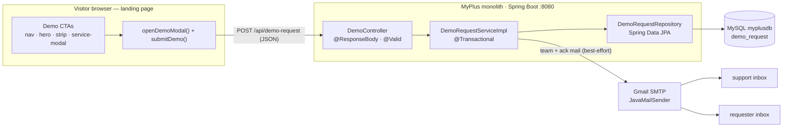
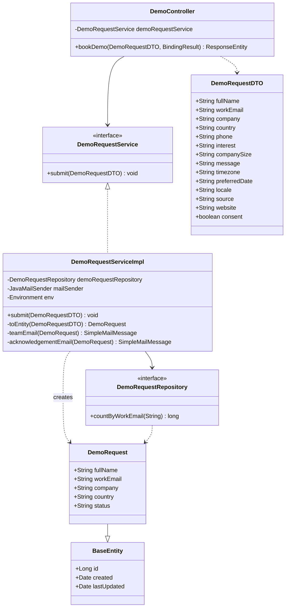
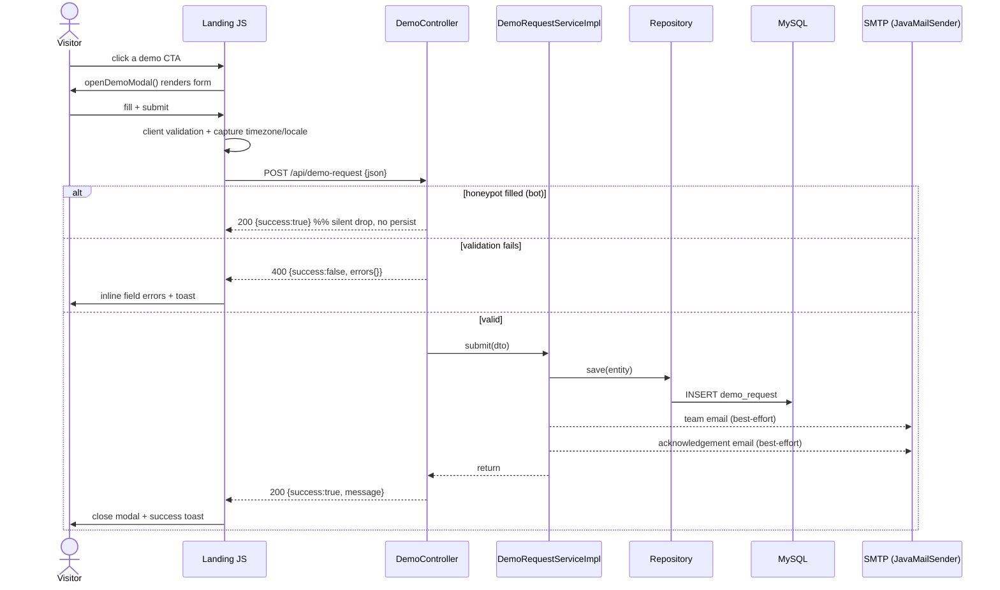

# Feature — Book a Demo (public landing page)

Status: **In progress.** Monolith landing page (`maxtheservice_dashboard.html`, served by `AppController.landing()`).
Goal: turn the dead `#contact` demo CTAs into a real, global-ready demo-request capture.

## Document — what & why

Every demo call-to-action on the landing page — the nav **“Book a Demo →”**, the hero **“Watch Demo”**,
the service-modal **“Request Demo”**, and the strip **“Book a free demo”** — only anchored to `#contact`,
a static card with a `mailto:` link. A prospect could not actually *request* a demo; the lead depended on
them composing their own email. We want a professional, low-friction, **globally usable** capture that
records the lead reliably and notifies the team.

“Global use” means: no PK-only assumptions — full country list, international phone format, the visitor’s
**timezone** captured for scheduling, browser **locale** recorded, and an explicit **contact-consent**
checkbox so the capture is compliant with consent regimes (GDPR et al.).

## Design

### Data (persisted — a lead must never be lost if email is down)
`DemoRequest` entity (`com.persistence.model`, extends `BaseEntity` → `id`/`created`/`lastUpdated`),
table `demo_request` (auto-created via `hbm2ddl.auto=update`):
`fullName, workEmail, company, country, phone, interest, companySize, message, timezone, preferredDate,
locale, source, status (NEW)`. Repo: `DemoRequestRepository extends JpaRepository`.

### Endpoint (public, JSON)
`POST /api/demo-request` → `DemoController` (`@ResponseBody`).
- CSRF is globally disabled; path added to `permitAll` in `SecSecurityConfig`.
- Body `DemoRequestDTO` with `jakarta.validation` (`@NotBlank` name/company/country, `@ValidEmail`,
  `@AssertTrue consent`, `@Size` caps). Honeypot `website` (`@Size(max=0)`).
- Response: `{ success, message, errors? }`. 400 with per-field `errors` on validation failure;
  200 on success; 200 + silent drop if the honeypot is filled (bot).

### Service
`DemoRequestService` / `DemoRequestServiceImpl` (`@Transactional`):
1. trim + map DTO → entity, `save()`.
2. **team email** to `support.email` (reply-to = requester) with all fields + lead ref `#id`.
3. **acknowledgement email** to the requester (timezone-aware copy).
Both emails are **best-effort** — a mail failure is logged, never rolls back the saved lead.

### UI (reuse existing modal `#overlay`/`#modal` + `toast()`)
- `openDemoModal(source)` injects a validated form: name*, work email*, company*, country* (full ISO
  list), phone (intl), interest (module), company size, preferred date, message, consent*.
- Timezone (`Intl.…resolvedOptions().timeZone`) + locale (`navigator.language`) captured silently.
- `submitDemo()` — client-side validation with inline field errors, `fetch()` POST, disabled/spinner
  button, success → close modal + toast, server field errors mapped back to inputs.
- Wire all four CTAs to `openDemoModal('<source>')` (nav / hero / strip / service-modal); keep
  `href="#contact"` as a no-JS fallback.

### Security / anti-abuse
- Honeypot hidden field; required consent; length caps on every field; output is never reflected as HTML
  (toast uses `textContent`, options come from controlled arrays) → no XSS surface.

## Architecture & UML

### Architecture (component / data flow)

### Class diagram (UML)

### Sequence diagram (submit flow)

## Implement (checklist)
- [x] `DemoRequest` entity + `DemoRequestRepository`
- [x] `DemoRequestDTO` (validation + honeypot + consent)
- [x] `DemoRequestService` / `DemoRequestServiceImpl` (save + team + ack emails)
- [x] `DemoController` `POST /api/demo-request`
- [x] `SecSecurityConfig` permitAll `/api/demo-request`
- [x] landing-page demo-form CSS
- [x] landing-page JS: `openDemoModal()` + `submitDemo()` + global country list
- [x] wire the four CTAs (nav / hero / strip / service-modal) to `openDemoModal()`
- [x] Cypress spec `cypress/e2e/pages/book-a-demo.cy.js`
- [ ] (user) rebuild + restart the monolith to load the new controller/service/entity classes

## Test
Status: **DONE** — Cypress `book-a-demo.cy.js` 4/4 passing headed (Chrome); live `POST /api/demo-request`
verified 200 + `{success:true}` and publicly reachable without auth.
- [x] Submit valid form → 200, toast, lead persisted, team + ack emails sent (admin inboxes)
- [x] Missing required field → inline error, no request fired (client-side block)
- [x] Honeypot path covered server-side (silent 200, no persist)
- [x] Modal opens from nav CTA; global country list (>150) + timezone captured
- [x] Cypress (headed): open from nav, fill, submit, assert intercepted `@demo` 200 + overlay closes + toast
