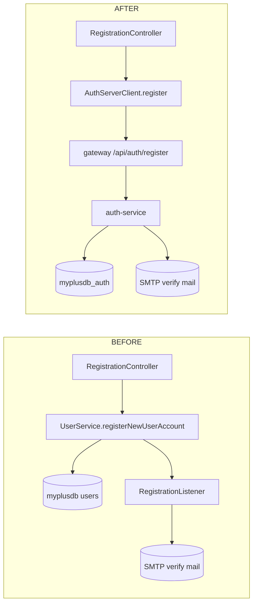
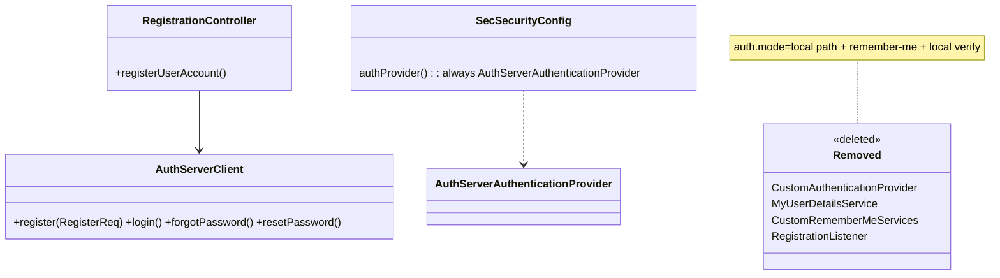
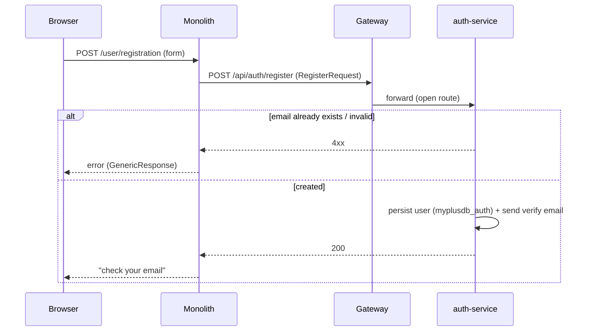

# Monolith auth/user-store decommission — design

**Status: DESIGN GATE — awaiting review. No code changes applied yet.**
Branch: `security/prod-hardening` (precedes the monolith part of P1 secret work).

## 1. Document — what & why

`auth.mode=server` is live: **login** is delegated to the auth-service and `myplusdb` is no longer the
identity source at login time. But `myplusdb` still performs **auth responsibilities** redundantly
with the auth-service:

- **Registration** writes new users into `myplusdb` (`UserService.registerNewUserAccount`) and sends
  its own verification email — duplicating auth-service `/api/auth/register` + `/api/auth/verify-email`.
- **Remember-me** resolves users from `myplusdb` via `MyUserDetailsService` → `UserRepository`.
- **Local-auth fallback** (`CustomAuthenticationProvider`, `MyUserDetailsService`, `auth.mode=local`)
  still exists.
- **`SetupDataLoader`** seeds users/roles/privileges into `myplusdb` on every boot.

Goal: **remove `myplusdb`'s authentication role** — the auth-service becomes the single identity
store. `myplusdb` is **retained** for the non-auth local domain (hospital/appointment/activity/
geolocation/demo-request), per the chosen scope.

> This is *not* full DB removal. It removes the **redundant user/auth store**, not the database.

### Coupling map (what touches the user store today)

| Consumer | Use | Disposition |
|----------|-----|-------------|
| `RegistrationController`, `RegistrationCaptchaController` | create users + verification email | **Delegate** to auth-service (D1) |
| `RegistrationListener` | sends verification email on `OnRegistrationCompleteEvent` | **Remove** (auth-service sends it) (D1) |
| `CustomAuthenticationProvider`, `MyUserDetailsService`, `LoginAttemptService` | `auth.mode=local` login | **Remove** — commit to server-only (D3) |
| `CustomRememberMeServices` → `MyUserDetailsService` | remember-me cookie → user | **Decision R** (D2) |
| `SetupDataLoader` | seed users/roles/privileges into `myplusdb` | **Remove user/role/privilege seeding** (D5) |
| `AppointmentDashboardController` | injects `UserRepository`; casts principal to `User` | **Decision A** (D4) |
| `UserService`/`IUserService` (`extends UserRepository`) | user CRUD | **Reduce** to the no-DB pieces still needed (D6) |
| `com.persistence.model.User` | **security principal** built by `AuthServerAuthenticationProvider` | **Keep as POJO principal**; drop JPA persistence (D6) |

## 2. Design

### Decisions forced by the couplings
- **Decision R — remember-me.** Options: (R1) **disable remember-me** (simplest; it's a convenience,
  and server-mode already keeps a server-side `TokenStore`); (R2) re-issue a session from the stored
  refresh token instead of a DB lookup. **Recommend R1 now**, R2 later if persistent login is wanted.
- **Decision A — appointment users.** The appointment module reads `myplusdb` users. Options:
  (A1) **leave a thin read-only `users` view in `myplusdb`** populated for appointment only — rejected
  (keeps the dup store); (A2) appointment uses the **logged-in principal** only (no user list) where
  possible, and fetches any user list it needs from the auth-service; (A3) **scope appointment out**
  of this decommission and let it keep its `UserRepository` against `myplusdb` for now.
  **Recommend A3 now** (smallest blast radius — appointment is legacy/local and already staying on
  `myplusdb`), with A2 as the clean follow-up. *This means the `User` JPA mapping stays until
  appointment is migrated, so D6 is partial.*

### Phased changes
- **D1 — Registration delegation.** `AuthServerClient.register(...)` → `POST /api/auth/register`
  (`RegisterRequest`). `RegistrationController`/`RegistrationCaptchaController` call it; remove
  `OnRegistrationCompleteEvent`/`RegistrationListener` and the monolith verification-token path.
  `/registrationConfirm` → redirect to the auth-service verify flow (or auth-service emails the link).
- **D2 — Remember-me (Decision R1).** Drop `.rememberMe(...)` from `SecSecurityConfig` (and
  `CustomRememberMeServices`).
- **D3 — Remove local-auth fallback.** Delete `CustomAuthenticationProvider`, `MyUserDetailsService`,
  the `authMode` branch; `authProvider()` always returns `AuthServerAuthenticationProvider`. Remove the
  `userDetailsService` bean dependency (only remember-me + local provider used it).
- **D5 — `SetupDataLoader`.** Remove user/role/privilege seeding (auth-service owns it). Keep any
  non-auth seeding if present.
- **D6 — Repos/entities (partial, per Decision A3).** Remove `UserService.registerNewUserAccount`,
  verification-token methods, and the seeding-only repos. **Keep** `User`/`Role`/`Privilege` JPA +
  `UserRepository` while `AppointmentDashboardController` still needs them; tracked as the residual to
  remove when appointment is migrated (A2).

### What stays on `myplusdb` (unchanged)
Hospital/appointment/patient/doctor, activity, geolocation, type/service, demo-request, customer.

### Endpoint delegation contract
| Monolith action | Was (myplusdb) | Now (auth-service) |
|-----------------|----------------|--------------------|
| Register | `UserService.registerNewUserAccount` + local verify email | `POST /api/auth/register` (`RegisterRequest`) |
| Verify email | `/registrationConfirm` + `VerificationToken` | auth-service `/api/auth/verify-email` |
| Login | (already) `AuthServerAuthenticationProvider` | unchanged |
| Reset/forget pw | (already) `PasswordResetFacade` → auth-service | unchanged |

## 3. Architecture & UML

### Registration flow — before / after



### Class changes



### Sequence — register (delegated)



## 4. Implement — checklist

- [ ] **D1** `AuthServerClient.register`; `RegistrationController` + captcha controller delegate
- [ ] **D1** remove `RegistrationListener` / `OnRegistrationCompleteEvent` / monolith verify-token path
- [ ] **D2** remove remember-me (`SecSecurityConfig`, `CustomRememberMeServices`)
- [ ] **D3** delete `CustomAuthenticationProvider`, `MyUserDetailsService`, `authMode` branch
- [ ] **D5** strip user/role/privilege seeding from `SetupDataLoader`
- [ ] **D6** trim `UserService`/`IUserService`; keep `User`/repos only for appointment (Decision A3)
- [ ] Residual tracked: migrate `AppointmentDashboardController` off `UserRepository` (A2) → then drop `User` JPA + `myplusdb` auth tables
- [ ] Docs ticked; runbook follow-up #5 updated

## 5. Test

- **Registration** (Cypress `auth/registration.cy.js`): submitting the form creates the user in
  `myplusdb_auth` (not `myplusdb`) and triggers the verify email; duplicate email → error.
- **Login** still works (server mode) for a registered + verified user.
- **Remember-me removed:** no `remember-me` cookie issued; session-only login still works; logout clears.
- **No new rows in `myplusdb.user_account`** after a registration.
- **Local domain intact:** appointment/hospital/activity screens still load (Decision A3 keeps their
  `User` access working).
- **Boot:** monolith starts with seeding removed; no `auth.mode=local` code path remains.
```
