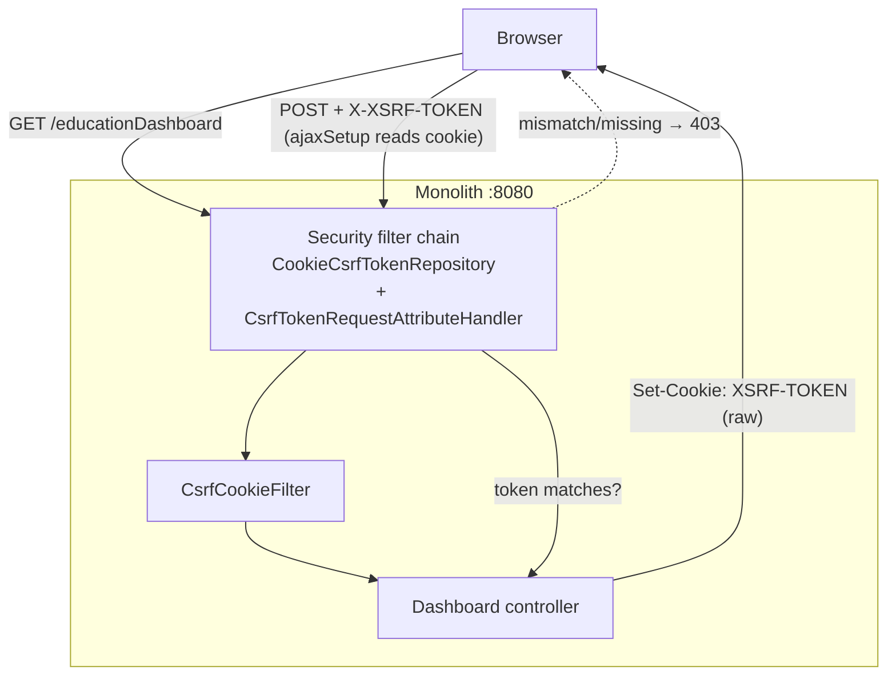
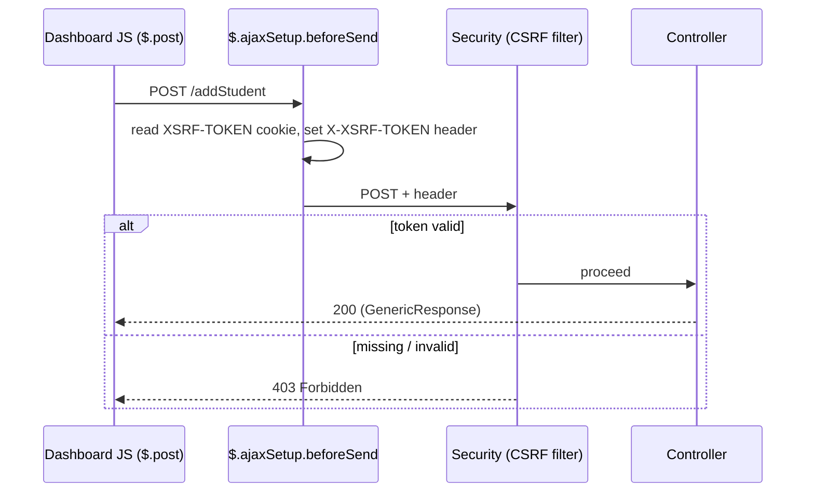
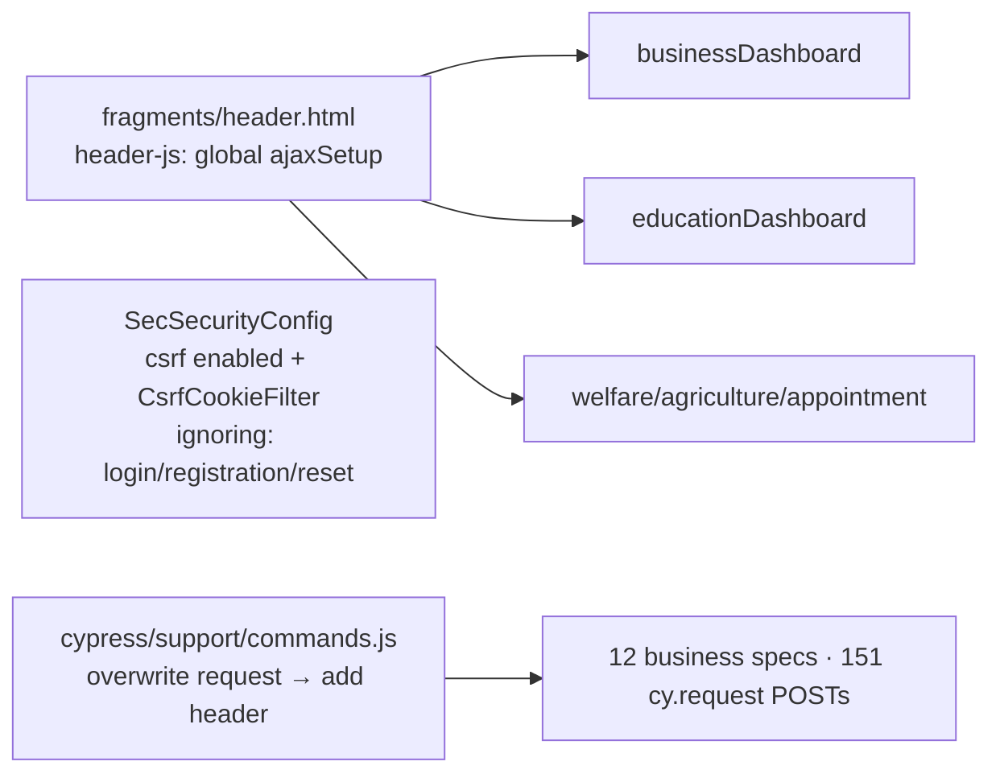

# Monolith CSRF re-enable (P5 / F12) — design

**Status: DESIGN GATE — awaiting review. No code changes applied yet.**
Branch: `security/prod-hardening`.

## 1. Document — what & why

The monolith disables CSRF (`SecSecurityConfig.csrf(disable)`) but is **session + cookie based** with
server-rendered Thymeleaf forms and ~190 jQuery AJAX calls. That leaves every authenticated
state-changing endpoint open to cross-site request forgery (a logged-in user's browser tricked into
POSTing to a dashboard action). Re-enable CSRF without breaking the AJAX-heavy UI or the Cypress suite.

(The stateless JWT microservices don't need CSRF — they take a Bearer token, not a cookie. This is
monolith-only.)

## 2. Design

### Token delivery — cookie + header (Spring Security 6 recipe)
- `CookieCsrfTokenRepository.withHttpOnlyFalse()` → token in a JS-readable `XSRF-TOKEN` cookie.
- `CsrfTokenRequestAttributeHandler` (NOT the XOR/BREACH handler) so the cookie value is the **raw**
  token the client echoes back — required for the cookie-read-by-JS pattern in SS6.
- A tiny `CsrfCookieFilter` (after the auth filter) that calls `csrfToken.getToken()` on each request so
  SS6's *deferred* token is actually materialized into the response cookie.

### Surfaces & how each gets the token
| Surface | Mechanism | Change |
|---------|-----------|--------|
| jQuery AJAX on dashboards (~190) | global `$.ajaxSetup` `beforeSend` adds `X-XSRF-TOKEN` from the cookie for non-GET | **one** snippet in `fragments/header.html` `header-js` (every dashboard includes it) |
| Thymeleaf `th:action` POST forms (e.g. logout) | Spring-Security dialect auto-injects `<input name="_csrf">` | none (dialect already present) |
| Cypress `cy.request` POST/PUT/DELETE (151) | `Cypress.Commands.overwrite('request')` injects `X-XSRF-TOKEN` from the `XSRF-TOKEN` cookie for non-GET | **one** override in `cypress/support/commands.js` |
| Cypress UI-driven tests (click/submit) | go through the browser → `ajaxSetup` handles it | none |
| `login` form | `formLogin` + the login page's `_csrf` hidden field | verify `login.html` has it (dialect form) |

### Decision X — public / pre-login POST endpoints
`login`, `user/registration`, `user/resetPassword`, `user/savePassword`, `registrationCaptcha` are
`permitAll` and rendered by standalone pages that **do not** include `header-js` (no `ajaxSetup`).
Options: (a) **exempt** them via `csrf.ignoringRequestMatchers(...)`, or (b) plumb a token into each
page. **Recommend (a) exempt** — they're pre-session and the reset ones are already credentialed by
the auth-service token; CSRF's real value is protecting the **authenticated** dashboard actions.
(Login CSRF is low-value and Spring still protects the post-login session.) Net: CSRF **on** for all
authenticated endpoints, **off** for the handful of public auth endpoints.

### What stays the same
GET endpoints are CSRF-exempt by default (read-only). No controller signatures change. No per-page or
per-AJAX edits beyond the two central snippets.

## 3. Architecture & UML

### CSRF token flow

### Sequence — an authenticated AJAX POST

### Component — where the two snippets live

## 4. Implement — checklist

- [ ] `SecSecurityConfig`: enable CSRF (CookieCsrfTokenRepository.withHttpOnlyFalse + AttributeHandler);
      `ignoringRequestMatchers` for the public auth endpoints (Decision X); register `CsrfCookieFilter`
- [ ] `CsrfCookieFilter` (materialize the deferred token cookie)
- [ ] `fragments/header.html` `header-js`: global `$.ajaxSetup` sending `X-XSRF-TOKEN` for non-GET
- [ ] Verify `login.html` carries the `_csrf` field (formLogin)
- [ ] `cypress/support/commands.js`: `Cypress.Commands.overwrite('request')` to inject the header
- [ ] Run the **full Cypress suite headed** (business + education + auth + pages) — all green
- [ ] Manual smoke: a dashboard create/delete works; a POST without the token → 403
- [ ] Docs ticked; findings F12 → resolved; runbook note

## 5. Test

- **Cypress (headed, chrome):** the 15 specs pass — especially the business specs (151 `cy.request`
  POSTs now carrying the token via the overwrite) and the education UI flows (browser `ajaxSetup`).
- **Negative:** `curl -X POST http://localhost:8080/<auth-endpoint-action>` with a valid session cookie
  but **no** `X-XSRF-TOKEN` → `403`; with the token → `200`.
- **Public endpoints unaffected:** login, registration, forget/reset password still work (exempted).
- **Logout** (Thymeleaf form) still works (auto `_csrf`).
