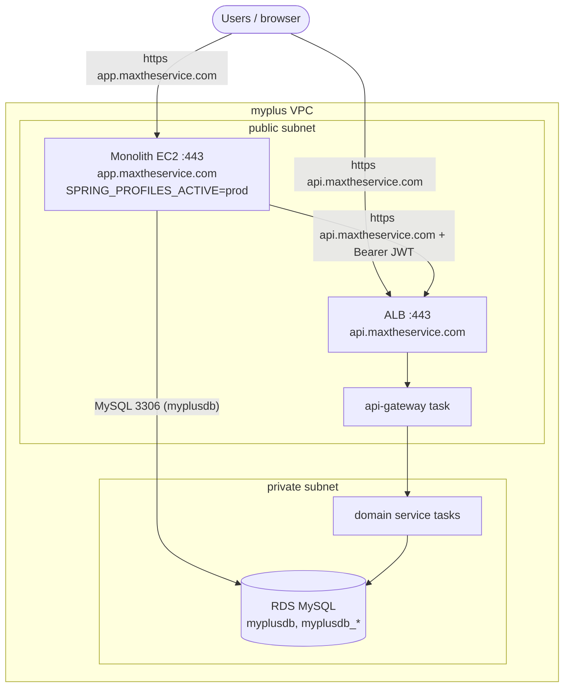

# Monolith on EC2 — deployment & networking

The microservices run on ECS Fargate (Terraform); the **monolith (myplus, Thymeleaf UI) stays on your
existing EC2**. This doc is the documented step to place that EC2 in the `myplus` VPC so it can reach
the gateway (ALB) and the RDS `myplusdb`, and the prod config it needs.

## Topology



The monolith is a **gateway client**: it logs users in via the auth-service and calls services through
the public gateway with `Authorization: Bearer`. It does **not** need `INTERNAL_SECRET` (the gateway
stamps that). It still needs direct MySQL access to `myplusdb` (until that's decommissioned).

## Steps

### 1. Put the EC2 in the VPC
Launch (or move) the monolith EC2 into a **public subnet** of the `myplus` VPC (`aws_subnet.public`)
with a public IP / Elastic IP. (Keeping it in another VPC needs peering — simpler to run it here.)

### 2. Security groups
- **Monolith EC2 SG** — inbound `443` (and `80`→`443`) from the internet; outbound all. Create it
  (console or TF) and note its id.
- **RDS access** — set the Terraform var so RDS accepts MySQL from the monolith:
  ```hcl
  # terraform.tfvars
  monolith_security_group_id = "sg-0123456789abcdef0"
  ```
  (Adds `aws_security_group_rule.rds_ingress_monolith` → RDS:3306 from that SG. See `monolith-ec2.tf`.)
- The monolith reaches the gateway over the **public** ALB (`api.maxtheservice.com:443`) — no extra SG
  rule needed (ALB SG already allows 443 from the internet).

### 3. Monolith prod config (env on the EC2)
Run with the `prod` profile and these (mirror `.env.local`, but from the instance env / SSM):
```
SPRING_PROFILES_ACTIVE=prod
DB_USER=root
DB_PASSWORD=<from Secrets Manager myplus/prod/db_password>
# point persistence.properties at RDS:
SPRING_DATASOURCE_URL / jdbc.url -> jdbc:mysql://<rds-endpoint>:3306/myplusdb?useSSL=true&requireSSL=true
MAIL_PASSWORD=<...>
RECAPTCHA_SECRET=<...>
# gateway / auth endpoints -> the public API host:
auth.server.url=https://api.maxtheservice.com
gateway.url=https://api.maxtheservice.com
auth.mode=server
```
> The monolith's `application-prod.properties` already turns on caching, validate/ddl, DevTools off,
> actuator lockdown (P3). It loads secrets from env when `.env.local` is absent.

### 4. TLS + DNS for the monolith
The monolith serves the UI directly, so give it its own hostname:
- **`app.maxtheservice.com`** → the EC2 (or an ALB in front of it). Add the CNAME/A record at
  **Hostinger**.
- TLS: either an ACM cert on a dedicated ALB for the EC2, or nginx + Let's Encrypt on the instance.
- Users use **`app.maxtheservice.com`** (UI); the monolith calls **`api.maxtheservice.com`** (services).

### 5. Run it
Build the monolith jar/image and run on the EC2 (systemd `java -jar`, or Docker). On boot it connects
to RDS `myplusdb` and delegates auth/data to `api.maxtheservice.com`.

## Notes / follow-ups
- `myplusdb` is shared by the monolith and business-service today; the monolith's `myplusdb` usage is
  slated for decommission (then the EC2 only needs the gateway, not RDS).
- For zero-downtime monolith deploys later, front the EC2 with its own ALB + target group (or migrate
  it to ECS as a 14th service).
