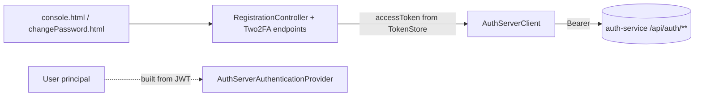

# P4 — auth residual removal (User → POJO, drop Role/Privilege/VerificationToken JPA)

**Status: DESIGN — decisions made, ready to implement.**
Branch: `feature/monolith-myplusdb-removal`. Umbrella: `docs/monolith-myplusdb-removal.md` (P4).
Follows P3 (appointment-service migration, commits `6c11bc0`/`029ecd1`).

## 1. Document — what & why
The monolith no longer authenticates against `myplusdb` ([[project-monolith-auth-decommission]]); the
`user_account` table is **empty** and every remaining DB call against `User`/`VerificationToken` is dead
or broken. Goal: remove the last auth-residual JPA so only the datasource teardown (P5) remains. The
`User` principal stays — but as a **plain POJO** built from the JWT login response (already the case in
`AuthServerAuthenticationProvider`), with **no JPA**.

## 2. Findings (mapping)
- `User` is already a POJO principal (does **not** implement `UserDetails`); it only carries JPA
  annotations + a write-only `roles` collection (set to an empty list, never read — authorities come
  from privileges in the JWT).
- Principal-only consumers (fine once `User` is a POJO): `AuthServerAuthenticationProvider`,
  `MyAspect`, `MyCustomLoginAuthenticationSuccessHandler`, `MySimpleUrlAuthenticationSuccessHandler`,
  `GatewayClient`, `RequestUtil.getCurrentUser/loadUserProperties`.
- Dead: `RequestUtil.getRequestUser()` (no callers), `RestApiController` (all commented),
  `ServiceRepository`/`TypeRepository` (commented bodies), `UserService.getUsersIdFromSessionRegistry`
  (no callers after the appointment deletion), most `IUserService` JpaRepository overrides.
- **Live UI features that still hit the empty DB** → must delegate to auth-service:
  - `/user/updatePassword` (logged-in change password) — used by `changePassword.html`.
  - `/user/update/2fa` (2FA toggle) — used by `console.html`.

auth-service already exposes the replacements (it owns the identity store):
| monolith (today, DB) | auth-service |
|---|---|
| `/user/updatePassword` | `PUT /api/auth/users/me/password` (Bearer) |
| `/user/update/2fa` enable | `POST /api/auth/2fa/setup` → `{qrUrl}` |
| (new) verify step | `POST /api/auth/2fa/verify` `{code}` → `{verified}` |
| `/user/update/2fa` disable | `DELETE /api/auth/2fa/disable` |

## 3. Decisions (made)
- **D1 — 2FA:** delegate **and add the verify step** (setup → scan QR → enter code → verify). The
  monolith toggle becomes a proper setup/verify/disable flow against auth-service, not the old one-shot.
- **D2 — change password:** delegate to `PUT /api/auth/users/me/password` (Bearer from `TokenStore`).
- **D3 — bonus cleanup:** also delete the unrelated dead entities `Service`, `Type`, `Company` and the
  dead `ServiceRepository`/`TypeRepository` in the same P4 commit (zero references).

## 4. Architecture

No `myplusdb` in the path. `User` is constructed in-memory; nothing reads/writes `user_account`.

## 5. Implement — checklist
- [ ] `User` → POJO: strip `@Entity/@Table/@Id/@Column/@GeneratedValue/@ManyToMany/@JoinTable/@Fetch`
      + JPA imports; remove the `roles` field, its getter/setter, and the `roles` part of `toString()`.
- [ ] `AuthServerAuthenticationProvider`: remove `principal.setRoles(...)` and the `Role` import.
- [ ] `AuthServerClient`: add `changePassword(token, oldPwd, newPwd)` (PUT `/api/auth/users/me/password`),
      `setup2fa(token)` (POST `/api/auth/2fa/setup` → qrUrl), `verify2fa(token, code)`,
      `disable2fa(token)`.
- [ ] `RegistrationController`:
      - `/user/updatePassword` → `authServerClient.changePassword(...)` (token from `TokenStore`),
        translate auth-service 4xx → `InvalidOldPasswordException`/message.
      - replace `/user/update/2fa` with `/user/2fa/setup` (returns qrUrl), `/user/2fa/verify` (`{code}`
        → verified), `/user/2fa/disable`.
- [ ] `console.html`: setup → render QR → code input + Verify button → verify → success; disable path.
- [ ] `UserService`/`IUserService`: stop extending `UserRepository`; keep only
      `getUsersFromSessionRegistry()`; delete the password/2FA/JpaRepository methods and the
      `UserRepository`/`VerificationTokenRepository` autowires.
- [ ] `RequestUtil`: delete dead `getRequestUser()`, drop the `IUserService` autowire (keep `User` import).
- [ ] **Delete** entities `Role`, `Privilege`, `VerificationToken`, `Service`, `Type`, `Company`;
      repos `User/Role/Privilege/VerificationToken` in **both** `com.persistence.dao` and
      `com.persistence.Repo`; dead `ServiceRepository`/`TypeRepository`.
- [ ] Monolith compiles (user runs the build).

## 6. Test
- Monolith compiles; boots with the principal built from JWT (login still works).
- Change-password (logged in) round-trips through auth-service; wrong old password → error message.
- 2FA: enable shows QR, entering the authenticator code verifies; disable clears it — all via auth-service.
- Regression: business/education/welfare/agriculture proxies + org switcher unaffected.
- After P4, the only `myplusdb` coupling left is the datasource itself → **P5**.

## Open implementation notes (verify when building)
- auth-service `/2fa/setup` returns `qrUrl` — confirm whether it's a chart-image URL (use as ``,
  like the old flow) or an `otpauth://` URI (UI needs a QR renderer).
- `ChangePasswordRequest` field names in auth-service (`oldPassword`/`currentPassword`?) — match them.
- `/api/auth/2fa/**` + `/api/auth/users/me/password` use `@AuthenticationPrincipal`; auth-service
  authenticates the Bearer itself (gateway leaves `/api/auth/**` open) — pass the `TokenStore` access token.
