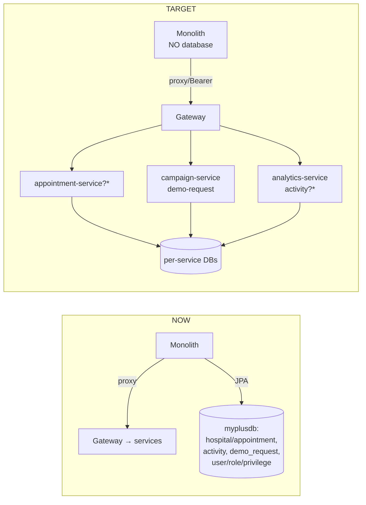
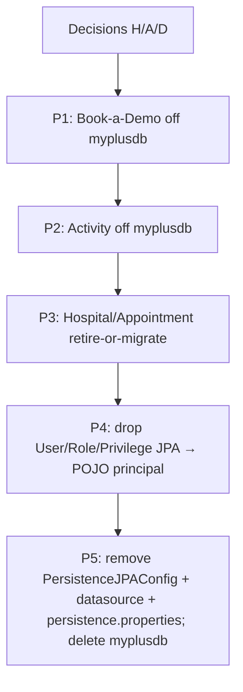

# Monolith `myplusdb` removal — design

**Status: APPROVED — decisions made. Implementing phase by phase.**
Branch: `feature/monolith-myplusdb-removal`.

**Decisions:** H = **migrate** to a new `appointment-service` · A = **forward** to `analytics-service`
· D = **fold** into `campaign-service`. Order: P1 (demo→campaign) → P2 (activity→analytics) →
P3 (appointment-service, its own slice design) → P4 (User POJO) → P5 (kill datasource).

## 1. Document — goal & why

After the auth-store decommission ([[project_monolith_auth_decommission]] / `docs/monolith-auth-decommission.md`),
the monolith no longer authenticates against `myplusdb`, but a few **local-domain** features still
persist there. Goal: remove **all** remaining `myplusdb` usage so the monolith has **no database** —
then the EC2/compose `mysql` only serves the microservices, and the monolith is a pure UI + gateway
client.

> Business/education/welfare/agriculture controllers already **proxy** to their microservices
> (GatewayClient) — they don't touch `myplusdb` and are **out of scope**.

## 2. The remaining `myplusdb` footprint

| Module | Persists (entities/repos + service) | Routes | Recommendation |
|--------|-------------------------------------|--------|----------------|
| **Hospital / Appointment** | `Hospital, Doctor, Appointment, Patient, GeoLocation` + `Hospital/Doctor/Appointment/GeoLocation Service`, `AppointmentDashboardController` (also reads `User`) | `/registerHospital`, `/appointment`, `/appointmentReq`, `/appointmentDashboard`, `/loadAppointments`, `/loadDoctorsByHospital`, `/loadDoctorDetails`, `/registerDoctor`, `/loadStatesByCountry`, `/loadCitiesByState` | **DECISION H** — retire or migrate to a new `appointment-service` |
| **Activity log** | `Activity` + `ActivityService` | cross-cutting (AOP logging of actions) | **DECISION A** — drop, or move to `analytics-service` |
| **Book-a-Demo** | `DemoRequest` + `DemoRequestService`, `DemoController` `/api/demo-request` | public lead capture | **DECISION D** — move to a microservice (e.g. `campaign-service`) or a tiny store |
| **Residual auth** | `User, Role, Privilege, VerificationToken` + `UserService`/repos | kept only because `AppointmentDashboardController` reads `User` | Remove once H is done; `User` stays as a **POJO principal** (built from the JWT), no JPA |

(Also verify on implement: `Customer`, `Type`, `Service` entities — appear unused now; delete with their module.)

## 3. Decisions you make (gate)

- **DECISION H — Hospital/Appointment.** Is this feature still used in production?
  - **Retire** (recommended if unused): delete the controllers, services, entities, repos, templates,
    and the routes from `SecSecurityConfig`. Smallest, fastest, removes the biggest `myplusdb` chunk.
  - **Migrate**: build an org-scoped `appointment-service` microservice (entities → its own DB, JWT,
    monolith proxies via GatewayClient). Sizable (its own slice: design → service → UI → Cypress).
- **DECISION A — Activity log.** Drop entirely (recommended if it's only legacy audit), or forward to
  `analytics-service` (a `POST /api/analytics/activity` the AOP aspect calls).
- **DECISION D — Book-a-Demo.** It's a small public lead form. Fold the persistence into an existing
  service (campaign-service is the marketing-adjacent home) with a `POST /api/campaign/demo-request`,
  or keep a minimal store. Monolith keeps just the form + proxy.

## 4. Architecture

### Current vs target

`*` only if you choose *migrate* (H) / *forward* (A); otherwise those features are **retired**.

### Removal sequence (after decisions)

## 5. Phased plan (each phase = its own commit, compiles, verified)

- **P1 — Book-a-Demo (D): ✅ DONE.** `DemoRequest` entity/repo/`DemoLeadService`/`DemoLeadController`
  (`POST /api/campaign/public/demo-request`, public) added to campaign-service + Flyway `V2__demo_request.sql`;
  gateway drops `StripPrefix` on the campaign route + opens `/api/campaign/public/`; monolith `DemoController`
  validates then proxies via the gateway; monolith `DemoRequest` entity/repo/service removed (DTO kept).
- **P2 — Activity (A): ✅ DONE — REMOVED (not forwarded).** Discovered activity logging was already
  **disabled** — `ActivityInterceptor.preHandle` just `return true` (whole body commented out), nothing
  wrote to `activity`, and no UI used it. So forwarding to analytics-service would be building unused
  code; instead deleted `Activity` entity/repo, `ActivityService`(+Impl), `ActivityInterceptor`, and
  unwired it from `MvcConfig`. (If activity tracking is wanted later, it's a fresh feature.)
- **P3 — Hospital/Appointment (H): ✅ DONE — MIGRATED.** New org-scoped, JWT `appointment-service`
  (port 8091, `myplusdb_appointment`; P3a scaffold + P3b-1 enrich to legacy booking behaviour). Monolith
  `Hospital/Doctor/Appointment/AppointmentDashboard` controllers are now thin proxies over
  `AppointmentRestClient` (P3b); `AppointmentDashboardController` no longer reads `User`. Deleted the dead
  monolith JPA island: `Hospital/HospitalPK/Doctor/Appointment/Patient/Geolocation` entities, repos (both
  `Repo/` and `dao/`), `Appointment/Doctor/Hospital/GeoLocation` services (+interfaces), `AppointmentValidater`.
  `AppUtil` country list is now static. This removed `Hospital/Doctor/Appointment/Patient/GeoLocation` from
  `myplusdb` and unblocked the `User` residual.
- **P4 — Auth residual: ✅ DONE.** `User` is now a plain in-memory POJO principal (JPA stripped, dead
  `roles` collection removed). Logged-in change-password and 2FA delegated to auth-service
  (`PUT /api/auth/users/me/password`; `/2fa/setup|verify|disable` with a real QR→verify flow in
  `console.html`); new `AuthServerClient` methods. `UserService`/`IUserService` slimmed to
  `getUsersFromSessionRegistry()`. Deleted `Role`/`Privilege`/`VerificationToken` (+ unused
  `Service`/`Type`/`Company`) entities and the `User/Role/Privilege/VerificationToken` repos in both
  `dao/` and `Repo/`. The monolith now has **zero Spring Data repositories and no real JPA entities**.
  Design `docs/monolith-myplusdb-removal-P4.md`; commits `6a0a517` (design), `a6e14cd` (impl).
- **P5 — Kill the datasource: ✅ DONE & VERIFIED (commit `9ca6a24`).** `Application` excludes
  `DataSourceAutoConfiguration`/`HibernateJpaAutoConfiguration`/`DataSourceTransactionManagerAutoConfiguration`;
  deleted `PersistenceJPAConfig` + `persistence.properties`; dropped `JDBC_URL`/`DB_*`/`DDL_AUTO` env and the
  `mysql` dependency from the compose monolith. **The monolith boots with no DataSource** (verified: up on
  8080, login + proxied modules work). Inert JPA deps + stray `@Entity` DTOs (`BaseEntity`/`DiscountDTO`/
  `CustomerHistoryDTO`) remain harmless on the classpath (optional dep cleanup later).

> **✅ myplusdb removal COMPLETE (P1–P5).** The monolith is a pure UI + gateway client with no database;
> identity is the in-memory `User` principal built from the JWT. All domain data lives in the microservices.

## 6. Test (per phase)
- Monolith **compiles** after each phase (`mvn -o compile`).
- The affected feature works or is cleanly gone (e.g. after P3-retire, `/appointment*` → 404 and no UI
  link; after migrate, the proxied flow works).
- **P5 acceptance:** monolith **boots with no datasource** (no `myplusdb` connection in logs), login +
  all proxied modules (business/education/welfare/agriculture) still work, and `docker compose`'s
  monolith needs no `JDBC_URL`/`DB_*`.
- Cypress: existing auth/business/education specs still green; add coverage if a feature is migrated.

---
**I need your DECISIONS H / A / D before P-work.** Default recommendation: **retire Hospital/Appointment
and Activity** (if they're legacy/unused) and **fold Book-a-Demo into campaign-service** — that's the
fastest path to a DB-less monolith.
