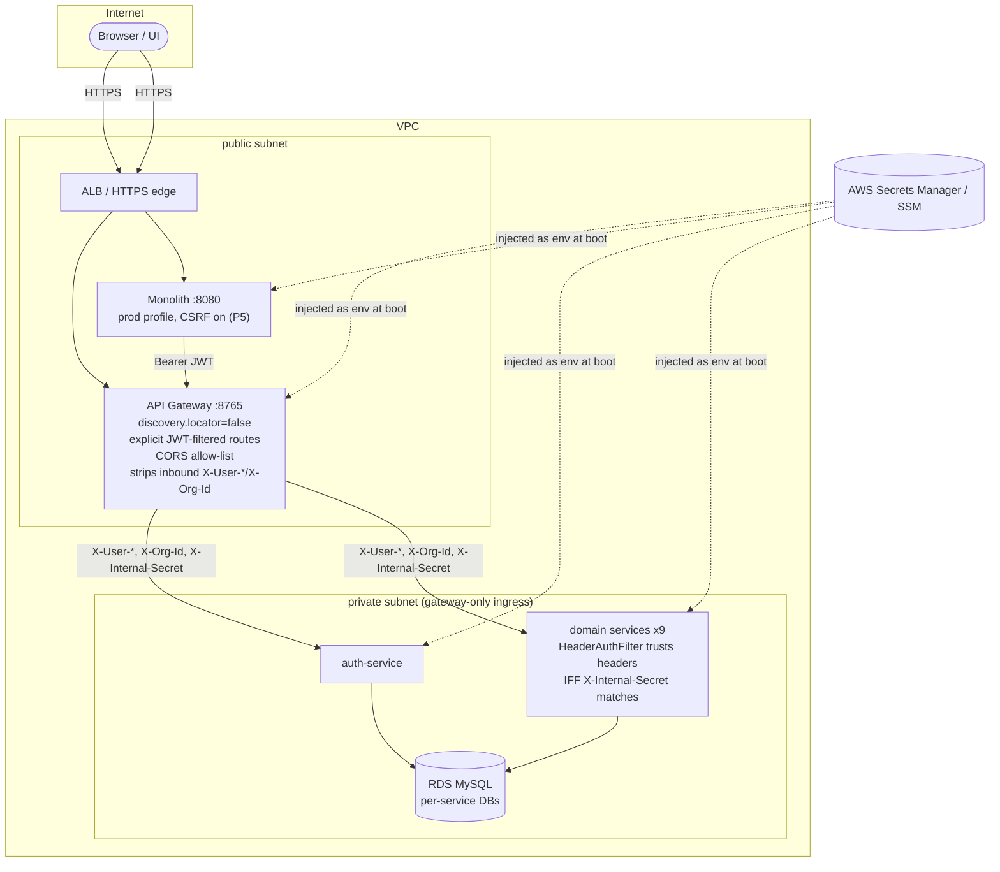
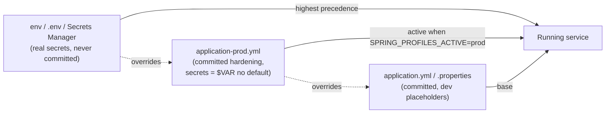
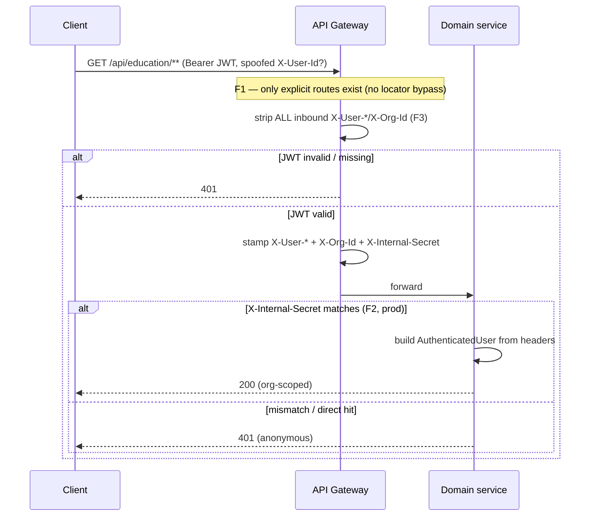

# Production hardening & secret externalization — design

**Status: DESIGN GATE — awaiting review. No code changes applied yet.**
Branch: `security/prod-hardening`.

## 1. Document — what & why

Before CI/CD + AWS, close the security gaps from the full-stack review (this doc) and the
microservices DFD review ([`microservices/docs/security/DFD-and-findings.md`](../microservices/docs/security/DFD-and-findings.md)).
The driving problems:

- **Real secrets are committed** to the repo (DB password, JWT signing key, Gmail app password,
  reCAPTCHA secret, config/eureka basic-auth) — they are public on GitHub and must leave the repo
  **and be rotated**.
- **Auth-bypass paths** exist by default (gateway discovery-locator routes that skip the JWT filter;
  identity-header trust with no enforcement; CORS `*` + credentials).
- **Prod-unsafe runtime defaults**: `ddl-auto: update`, SQL/bind logging at TRACE, actuator
  over-exposed, DevTools on, no upload limits, CSRF disabled on the session-based monolith.

Goal: a repo with **no real secrets**, a **hardened `prod` Spring profile**, and gateway/data/
observability fixes — leaving the running local-dev workflow intact (dev profile unchanged where
possible) and feeding directly into the AWS deployment design.

Secret **rotation** and **private networking** are operational actions owned by the user; this design
provides the wiring and documents the steps (see the runbook update).

## 2. Design

Work is grouped into phases. **P1–P3 are this branch**; **P4–P5 are dedicated follow-up phases**
(higher app-risk, separately verified).

### P1 — Secret externalization (Critical: F5, F8)
- Replace every committed real secret default with **no default** (`${VAR}`) in the `prod` profile,
  and a clearly-fake **dev placeholder** in the default profile where dev needs a value.
- Add gitignored `.env` (real values, local only) + committed **`.env.example`** (placeholders) at
  repo root and `microservices/`. Wire `docker-compose.yml` (already uses `${VAR}`) and
  `start-all.ps1` to load `.env`.
- Untrack `microservices/logs/*` and gitignore them (F16).
- Secrets inventory (each → env var): `DB_PASSWORD`, `JWT_SECRET`, `INTERNAL_SECRET`, `MAIL_PASSWORD`,
  `RECAPTCHA_SECRET`, `CONFIG_SERVER_PASSWORD`, `EUREKA_PASSWORD`.

### P2 — Gateway hardening (Critical/High: F1, F3, F4)
- **F1** disable `spring.cloud.gateway.discovery.locator.enabled` (→ `false`) so only the explicit,
  JWT-filtered routes exist. (Alt considered: apply the filter as a `default-filter` — rejected as
  more error-prone than removing the locator.)
- **F3** strip **all** inbound `X-User-*` and `X-Org-Id` headers at the top of `JwtAuthenticationFilter`
  before stamping, so a client value can never survive as a duplicate.
- **F4** CORS: replace `allowedOriginPatterns: "*"` with `${CORS_ALLOWED_ORIGINS}` (explicit
  allow-list); keep `allowCredentials: true` only with the list.

### P3 — Prod profile: data, observability, actuator, app hardening (High/Med: F9–F14, F15)
Delivered mainly via **one shared file** — `config-server/configs/application-prod.yml` (covers every
config-client service at once) — plus gateway and monolith prod profiles.
- **F9** `ddl-auto: ${DDL_AUTO:validate}` (prod), `show-sql: false`. Real schema management moves to
  Flyway in **P4**; `validate` is correct only once baselines exist, so prod boots with
  `DDL_AUTO=update` for the first release, then flips to `validate`.
- **F10** actuator: prod exposes only `health,info`; `health.show-details: never`; remove the gateway
  `gateway` actuator endpoint from public exposure; auth-service stops `permitAll("/actuator/**")`
  (mgmt on a separate, non-public port / secured).
- **F11** logging: `org.hibernate.SQL`, `org.hibernate.orm.jdbc.bind`, `org.hibernate.tool.schema`,
  `org.springframework.web` → `WARN`; `com.myplus` → `INFO` in prod.
- **F13** multipart limits (`spring.servlet.multipart.max-file-size/max-request-size`) on the
  CSV-import services + monolith.
- **F12 (DevTools)** monolith: `spring.devtools.*` off in prod; `devtools` dep scoped `optional`.
- **F15** seeded default/weak users gated behind a `seed-demo-users` flag, **off** in prod; default
  admin password required via env, not the committed `Admin@2025!`.

### P4 — Flyway + `ddl-auto: validate` (High: F9) — **dedicated phase**
Baseline-migrate each service DB (`mvn flyway:baseline` against the `update`-created schema), commit
`V1__baseline.sql` per service, then set prod `ddl-auto: validate`. Tracked in
[`microservices/docs/migrations.md`](../microservices/docs/migrations.md).

### P5 — Re-enable CSRF on the monolith (High: F12) — **dedicated phase**
Session + remember-me + server-rendered forms → CSRF-exposed. Enabling needs the Thymeleaf/JS CSRF
token wired into every `$.post/$.ajax` call (dashboards) **and** the Cypress suite. Own slice with its
own design doc + headed Cypress re-run.

### Out of scope here (tracked, not this branch)
- **F2 / INTERNAL_SECRET enforcement + private subnets** — activated in the AWS deploy step (wiring
  exists; see runbook §6).
- **F17** dependency-CVE upgrades — handled by the CI dependency-scan gate.

### Config contract (profile behaviour)

| Setting | dev (default profile) | prod profile |
|--------|------------------------|--------------|
| DB / JWT / mail / reCAPTCHA secret | fake placeholder or `${VAR:dev-only}` | `${VAR}` — **no default**, fail-fast if unset |
| `ddl-auto` | `update` | `${DDL_AUTO:validate}` |
| SQL/bind logging | `DEBUG`/`TRACE` | `WARN` |
| actuator exposure | `health,info,metrics,prometheus,gateway` | `health,info`; details `never` |
| gateway CORS | localhost list | `${CORS_ALLOWED_ORIGINS}` |
| `discovery.locator` | `false` (fix applies to all) | `false` |
| DevTools (monolith) | on | off |
| demo/seed users | on | off |

## 3. Architecture & UML

### Deployment / data-flow (target prod topology)



### Configuration sources & precedence



### Sequence — request auth path after P1–P3 fixes



## 4. Implement — checklist (mirrors §2)

- [x] **P1** `.gitignore`: `.env.local`, `microservices/logs/`; logs untracked
- [x] **P1** `.env.example` (root + `microservices/`) with every secret var as placeholder
- [x] **P1** remove real secret defaults from committed configs (monolith + all services + compose); `.env.local` injection
- [x] **P1** `start-all.ps1` loads `.env.local`; monolith loads it via `spring.config.import`
- [x] **P2** gateway `discovery.locator.enabled: false` (F1)
- [x] **P2** `JwtAuthenticationFilter` strips all inbound `X-User-*`/`X-Org-Id` (F3)
- [x] **P2** gateway CORS → `${CORS_ALLOWED_ORIGINS}` allow-list (F4)
- [x] **P3** `config-server/configs/application-prod.yml` (ddl-auto, logging, actuator, jwt/db/secret no-default, F2 internal-secret)
- [x] **P3** gateway + monolith `*-prod` profiles (actuator, devtools off, caching on)
- [x] **P3** multipart limits (F13); admin seed gated + password via env (F15)
- [ ] **P4** (separate) Flyway baselines per DB → prod `ddl-auto: validate`
- [ ] **P5** (separate) monolith CSRF + token wiring + Cypress
- [ ] Docs: this file ticked; findings doc extended; runbook updated

## 5. Test

- **Local dev unaffected:** default profile still boots with placeholders/`.env`; `npm run`
  Cypress suite + the education demo still pass (no behaviour change in dev).
- **No secrets in repo:** `git grep -nE 'Technology@2025|cablbimiovkcqqxy|UNC333er|6Lfa'` returns
  nothing tracked.
- **F1:** with locator off, `GET /education-service/api/education/**` (the auto-route form) no longer
  resolves; only `/api/education/**` (JWT-filtered) does.
- **F3:** a request to the gateway carrying a forged `X-User-Id` reaches the service with the
  gateway's value, never the client's.
- **F4:** a cross-origin preflight from a non-allow-listed origin is rejected.
- **Prod profile:** boot one service with `SPRING_PROFILES_ACTIVE=prod` and the env set → `ddl-auto`
  validate/update per `DDL_AUTO`, actuator shows only `health,info`, no SQL in logs; missing
  `JWT_SECRET` fails fast.
- **P4/P5** have their own test sections in their phase docs.
```
