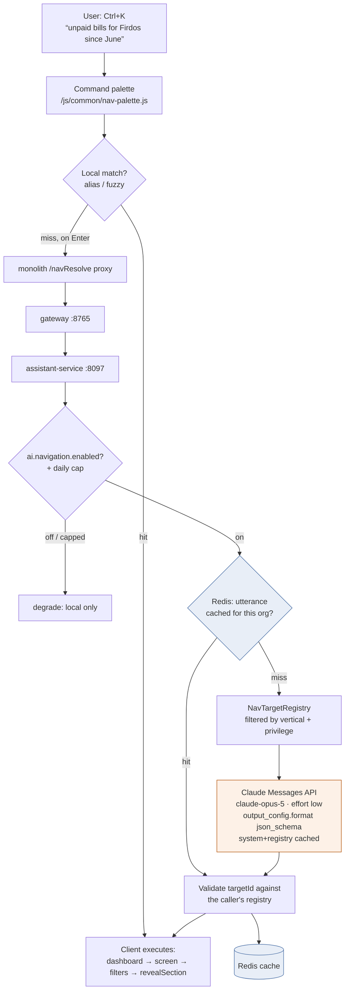
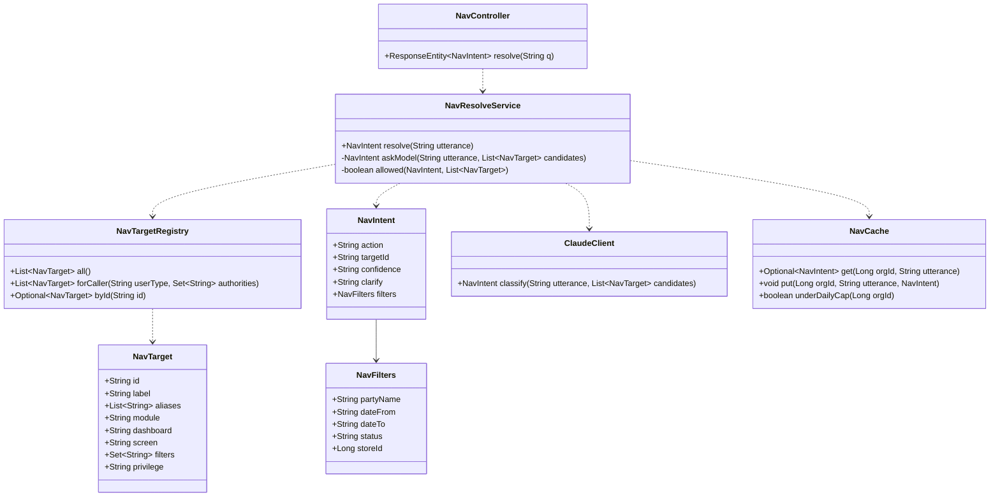
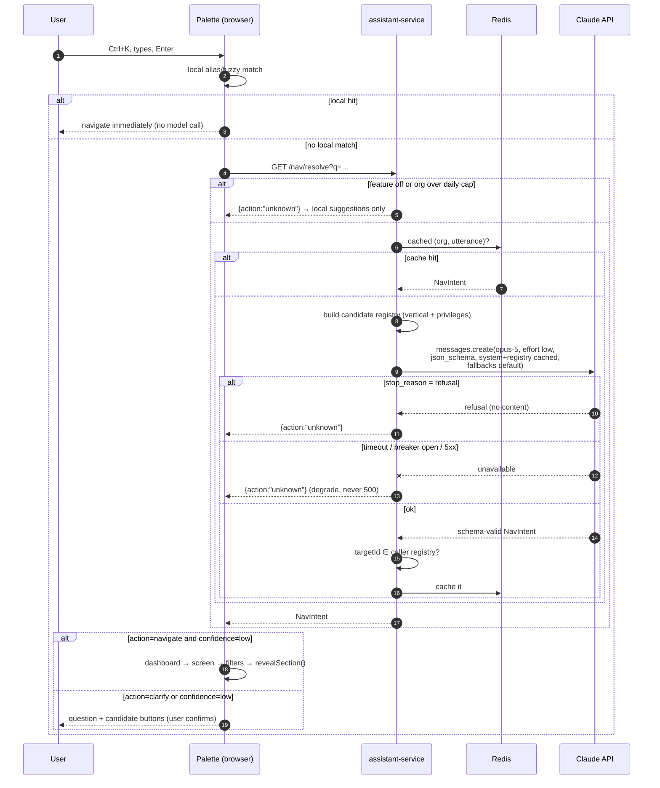

# AI navigation — natural-language jump (design)

**Status:** DESIGN — awaiting sign-off. Follows the rule-based [focus flow](../../src/main/resources/static/js/common/focus-flow.js)
(scroll + focus on section switch / modal open / validation failure), which stays as-is. This slice adds the one
navigation problem rules genuinely can't solve: the user says where they want to go **in words**.

---

## 1. Document — what and why

The platform now spans ~12 services and several dozen screens across five verticals. Finding "the vendor aging
report filtered to Firdos" means knowing which dashboard owns it, which nav group it sits under, and then filtering
by hand. New staff can't, and owners with several modules shouldn't have to.

> **Ctrl+K** → *"unpaid bills for Firdos since June"* → lands on the Purchases screen, vendor filter set to Firdos,
> date-from 01-06-2026, status UNPAID, cursor in the grid.

**Why AI is the right tool here, when it wasn't for focus.** Focus is deterministic — the next empty required field,
the field that just failed — so rules win on latency, cost and predictability, and a wrong guess is actively harmful
(it moves the cursor mid-typing). Navigation *from a sentence* is the opposite: the input is language, the mapping is
one-to-many, and a wrong guess is benign — the user sees the wrong screen and retypes. That asymmetry is the whole
justification for this slice.

**Non-goals.** It does not answer questions about the data ("what were sales last week?" — that's the analytics
dashboard, not navigation), does not perform actions (never "void invoice 1042"; it can only *take you to* the void
button), and never invents a destination — every result is validated against a server-side registry.

---

## 2. Design

### 2.1 Two-stage resolution — rules first, model second

The palette resolves locally before it ever calls a model. This is not premature optimisation: most palette input is
a screen name or a synonym of one, and a local hit is instant, free and works offline.

| Stage | Handles | Cost | Latency |
|---|---|---|---|
| **1. Local matcher** (browser) | exact / alias / prefix / fuzzy match on the target registry — "purchases", "aging", "add customer" | 0 | <5ms |
| **2. Model resolver** (assistant-service → Claude) | anything with intent, entities or dates — "unpaid bills for Firdos since June" | 1 call | ~1s |
| **3. Utterance cache** (Redis, per org) | a phrase this org already resolved | 0 | <10ms |

Stage 2 fires only on a stage-1 miss, and its result is cached under `(orgId, normalised utterance)` so the second
person to ask the same thing pays nothing. Redis is already in the stack (the demo write-counters use it).

### 2.2 The target registry — the only source of destinations

A **code-defined** list, same pattern as `common-settings`' catalog. Each entry is what the model may choose from and
what the client knows how to execute:

```java
record NavTarget(
    String id,            // "business.purchases"    — stable, enum-ish
    String label,         // "Purchases"
    List<String> aliases, // "bills", "vendor bills", "purchase register"
    String module,        // business | education | welfare | agriculture | pharma
    String dashboard,     // "/businessDashboard"
    String screen,        // "purchaseDiv"  → the .formDiv the client shows
    Set<String> filters,  // which of the named filters below this screen accepts
    String privilege      // required authority, or null
) {}
```

**The registry is filtered per caller before it reaches the model** — by vertical (`userType`) and by privilege. A
cashier's palette cannot resolve to the Finance page, because the Finance target was never in the candidate list, and
the server re-checks on execution. That also keeps the prompt small.

### 2.3 Model contract — structured output, closed enums

`POST /api/assistant/nav/resolve` → assistant-service → Claude Messages API with
`output_config.format` (`json_schema`), so the reply is schema-validated rather than parsed out of prose:

```json
{
  "type": "object",
  "additionalProperties": false,
  "required": ["action", "targetId", "confidence"],
  "properties": {
    "action":     { "enum": ["navigate", "clarify", "unknown"] },
    "targetId":   { "enum": ["business.purchases", "business.customers", "..."] },
    "confidence": { "enum": ["high", "medium", "low"] },
    "clarify":    { "type": "string" },
    "filters": {
      "type": "object",
      "additionalProperties": false,
      "properties": {
        "partyName": { "type": "string" },
        "dateFrom":  { "type": "string" },
        "dateTo":    { "type": "string" },
        "status":    { "type": "string" },
        "storeId":   { "type": "integer" }
      }
    }
  }
}
```

Two deliberate constraints:

- **`targetId` is an `enum` built from the caller's filtered registry**, not a free string. The model physically
  cannot name a screen the caller may not see. (Belt and braces: the service still validates the returned id against
  the same list before replying, because a schema is not an authorisation check.)
- **`filters` is a fixed, named set with `additionalProperties: false`.** Structured outputs reject open maps and
  numeric/length constraints, so "any filter the screen supports" is not expressible — each filter is declared
  explicitly, and adding one is a registry + schema change. That is a feature: it bounds what a sentence can set.

Dates come back as `dd-MM-yyyy` — the same wire format the whole app already parses (see
[`project date-picker contract`](party-contact-view-design.md) siblings and `AppUtil` on both sides), so the client
can drop them straight into the existing filter inputs.

### 2.4 Model, effort and thinking

| Choice | Value | Why |
|---|---|---|
| Model | **`claude-opus-5`** | The platform default. It is a small, cheap call — one short JSON reply — so there is no reason to reach for a weaker model, and this one follows a closed enum reliably. **If you'd rather trade a little accuracy for cost/latency, `claude-haiku-4-5` also supports structured outputs — that's your call, not mine to make silently.** |
| `output_config.effort` | **`low`** | Classification into a closed enum needs no deliberation. Low effort is the cost/latency lever. |
| `thinking` | **left on (adaptive, the Opus 5 default)** | Disabling it is *possible* at low effort but carries two documented failure modes — the model can emit a tool call as visible text, and can leak `<thinking>` tags into the response. Low effort already gets the saving without either risk. |
| `max_tokens` | **1024**, non-streaming | The reply is a small JSON object. Well under the streaming threshold. |
| `fallbacks` | **`"default"`** (beta `server-side-fallback-2026-07-01`) | Opus 5 safety classifiers can decline a request; a customer name or product could trip one. With this, the API re-runs on the recommended fallback in the same call instead of us returning an error. |
| Refusals | `stop_reason == "refusal"` checked **before** reading `content` | Otherwise a refusal crashes on `content[0]`. On refusal the palette degrades to "couldn't understand that — try a screen name", i.e. stage 1. |

### 2.5 Prompt caching — where the money is

Caching is a **prefix match**: `tools` → `system` → `messages`, and any byte change invalidates everything after it.
So the prompt is laid out stable-first:

```
system[0]  = instructions + the caller's target registry   ← cache_control: ephemeral
messages[0] = the user's utterance + today's date          ← volatile, after the breakpoint
```

- The registry for one (vertical, privilege-set) combination is **identical across users and requests**, so it caches
  once and is read at ~0.1× thereafter. Opus 5's minimum cacheable prefix is **512 tokens** — a real registry clears
  that comfortably.
- **Today's date goes in the user turn, never the system prompt.** Interpolating it into the prefix would invalidate
  the cache every single day — the classic silent invalidator.
- The registry is serialised deterministically (sorted by id). An unsorted map would produce a different prefix per
  JVM run and silently cache nothing.

### 2.6 Guard rails

| Concern | Mitigation |
|---|---|
| **Prompt injection** | The utterance is untrusted input and stays in the user turn. It cannot widen the `targetId` enum, and the server re-validates the result against the caller's registry. Worst case: the wrong screen opens. |
| **Cost runaway** | Per-org daily call cap (Redis counter, same shape as the demo cap) + `ai.navigation.enabled` as a **`common-settings` toggle**, so an owner can switch the feature off per tenant and a runaway tenant can be capped without a deploy. |
| **Privacy** | Utterances can contain customer names. They are logged **only** for cache/telemetry, org-scoped, with the raw text behind a second toggle (`ai.navigation.logUtterances`, default **off**). No utterance goes to audit-service. |
| **Availability** | Soft dependency, exactly like party-service: the palette falls back to stage-1 matching when assistant-service or the API is unreachable. 2s connect / 8s read timeout + the same lightweight circuit breaker the party bridges use. |
| **Never acts** | The contract has no action verb — `action` is `navigate` / `clarify` / `unknown`. Destructive intent ("void 1042") resolves to the *screen*, and the existing `uiConfirm` gate still stands in front of the button. |

### 2.7 UI contract

A **command palette**, not another dashboard screen: `Ctrl+K` (⌘K on Mac) from anywhere, or a search affordance in
the topbar. Styled in the language of the shared dialogs (`confirm-dialog.js`, `party-contact.js`).

- Stage-1 matches render as you type, keyboard-selectable — this is the common path and it never calls a model.
- Enter with no local match sends the utterance (a **submit**, never per-keystroke — that would be one API call per
  character).
- On `navigate`: switch dashboard if needed, show the target `.formDiv`, apply the filters to that screen's existing
  inputs, then hand off to `revealSection()` — the rule-based focus flow already built.
- On `clarify` (ambiguous) the palette shows the model's question plus the candidate targets as buttons; on `unknown`,
  a plain "no match" with the local suggestions.
- Confidence `low` never auto-navigates — it renders as a suggestion the user confirms. A wrong jump is cheap but not
  free.

---

## 3. Architecture & UML

### Architecture (flowchart)



### Class diagram



### Sequence — the model path, with every failure branch



---

## 4. Implement

**A1 — assistant-service skeleton** (new service, port **8097**, `myplusdb_assistant` only if telemetry is enabled)
- [ ] Scaffold from the party-service template: pom, bootstrap/application yml, `SecurityConfig` (HeaderAuthFilter,
      stateless), gateway route `/api/assistant/**`, start-all/stop-all, docker-compose
- [ ] `ANTHROPIC_API_KEY` read from the git-ignored `.env.local` via `${ANTHROPIC_API_KEY}` — same pattern as
      `DB_PASSWORD` / `MAIL_PASSWORD`; **never** in a config file or a prompt
- [ ] Official **Anthropic Java SDK** (`com.anthropic.*`) as the client. *Exact builder syntax for
      `output_config.format` / `effort` / `fallbacks` is to be confirmed against the Java SDK reference at
      implementation time — this doc pins the wire contract, not guessed Java method names.*

**A2 — registry + resolver**
- [ ] `NavTarget` + `NavTargetRegistry` (code-defined; `forCaller` filters by `userType` and authorities)
- [ ] `NavResolveService`: local-miss → cache → model → **validate `targetId` against the caller's registry**
- [ ] `ClaudeClient`: `claude-opus-5`, `effort: low`, thinking left on, `max_tokens 1024`, `output_config.format`
      json_schema with the caller-scoped `targetId` enum, `fallbacks: "default"`,
      **`cache_control: ephemeral` on the last system block**, utterance + today's date in the user turn
- [ ] `stop_reason == "refusal"` handled before touching `content`; timeout 2s/8s + circuit breaker
- [ ] `NavCache` (Redis): `(org, normalised utterance)` → intent, plus the per-org daily call counter
- [ ] `ai.navigation.enabled` + `ai.navigation.logUtterances` as **common-settings** entries (owner-toggleable,
      default on / off respectively)

**A3 — UI**
- [ ] `/js/common/nav-palette.js` — Ctrl+K palette, local matcher, submit-only model call, execute + `revealSection()`
- [ ] `/css/nav-palette.css` in the shared dialog language; monolith `/navResolve` proxy

**A4 — gate**
- [ ] `cypress/e2e/platform/ai-navigation.cy.js`

---

## 5. Test

| # | Case | Expect |
|---|---|---|
| 1 | Local: "purchases" | navigates with **zero** calls to `/navResolve` (asserted via `cy.intercept`) |
| 2 | Model: "unpaid bills for Firdos since June" | lands on Purchases, vendor filter Firdos, `dateFrom` = `01-06-2026` |
| 3 | Repeat case 2 verbatim | served from cache — no second upstream call (assert via service metric/log) |
| 4 | Ambiguous: "reports" | `action: clarify`, palette shows candidate buttons, nothing navigates |
| 5 | Nonsense: "asdfgh" | `action: unknown`, no navigation, local suggestions shown |
| 6 | **Cashier** asks for "finance reports" | never resolves to the Finance target (not in their registry) — and a hand-forged `targetId` for it is rejected server-side |
| 7 | `ai.navigation.enabled` = false | `/navResolve` returns `unknown` without calling the API; local matching still works |
| 8 | assistant-service stopped | palette still resolves local matches; no error dialog, no 500 |
| 9 | Destructive phrasing: "void invoice 1042" | navigates to the invoice screen only; **no void is performed** |

**Manual:** watch the service log for a first-call `cache_creation_input_tokens` followed by
`cache_read_input_tokens` on the second — that confirms the prefix is actually caching. If reads stay at zero, a
silent invalidator has crept into the system prompt (a date, a per-user string, an unsorted registry).

---

## 6. Open for sign-off

1. **Model choice.** Design says `claude-opus-5` (platform default, most reliable on the closed enum).
   `claude-haiku-4-5` also supports structured outputs and would be cheaper and faster per call — say the word if
   you'd rather start there.
2. **Telemetry.** Do you want resolved utterances persisted (org-scoped, toggle-gated) so the local matcher can be
   improved from real phrasing? Default in this design: **no persistence**, Redis cache only.
3. **Scope of stage 1.** Worth extending the local matcher with per-user frequency ordering (the cheap "learned field
   order" idea from the focus discussion), or keep it a pure alias match for now?
