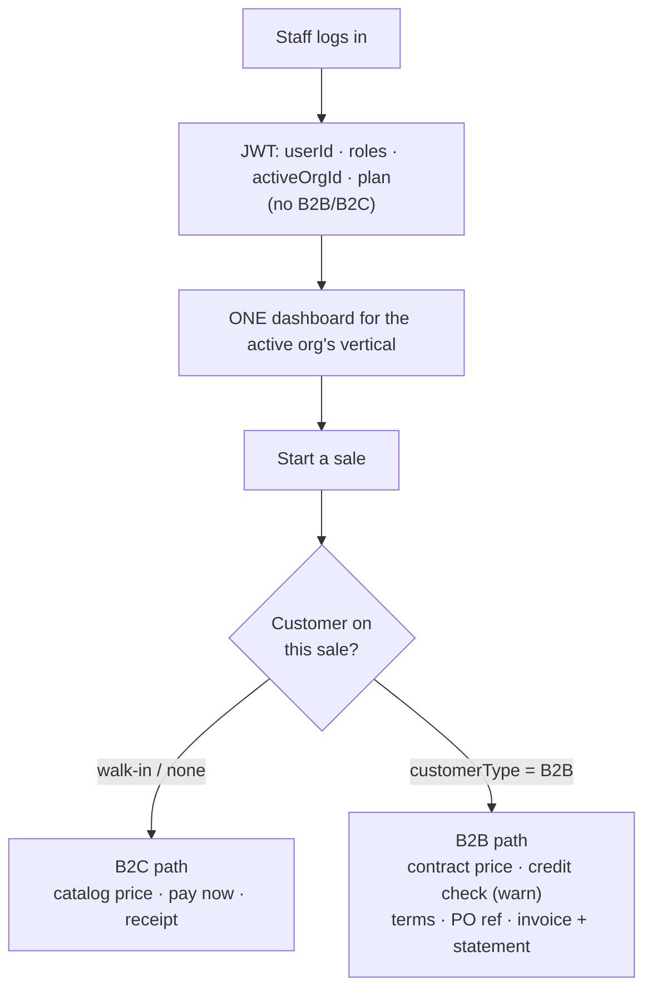

# B2B + B2C — what exists today, and how to start both

**Status:** IN DELIVERY — **Phases 0, 0.5, 1 and 2 DONE & Cypress-green** (0/0.5 on 2026-08-01, 1 and 2 on 2026-08-02); **Phase 2 (B2B pricing) backend DONE & Cypress-green; Phase 3 IN PROGRESS — 3a (batch/expiry) + 3b-1 (INVOICE vs RECEIPT) + 3b-2 (batch traceability) + 3c (CRN-/DBN- return documents) + 3d (statement CSV) + 3e-1 (report filters + export + shared filter rail) green; only **3e-2** (group-by) remains, plus candidate **3f** (statements omit credit notes; invoices are retro-edited).**
Per-phase state is tracked in the Delivery phases section below; the slice doc for each shipped phase is linked there. Analysis sections 1-3b remain as written unless a finding contradicts them.
**Companion to:** [`oms-b2b-b2c-implementation-plan.md`](oms-b2b-b2c-implementation-plan.md) (gap analysis),
[`oms-program-plan.md`](oms-program-plan.md) (tracker), [`customer-requirements-plan.md`](customer-requirements-plan.md)
(the 12 customer requirements).
**Every claim below was checked against the code.**

---

## 1. Answering the question directly

> *"What is right now implemented? B2C?"*

**B2C is largely built. B2B is roughly half-built — not zero.** The common assumption ("we have B2C, B2B
is greenfield") is wrong, and acting on it would mean rebuilding things that already work.

### Scorecard

| Capability | B2C | B2B | Evidence |
|---|---|---|---|
| Public storefront, cart, guest checkout | ✅ | – | `PublicCheckoutController`, `/store` |
| Coupons, shipping quote, order tracking | ✅ | – | `/quote`, `/order/track`, `/orders` |
| Counter sale (POS), receipt, tax, tenders | ✅ | ✅ | `SagaSellService`, `receipt.js` |
| Returns + refunds (saga-aware, stock restored) | ✅ | ✅ | `saleReturn` → `inventoryClient.returnStock` |
| **Sell on credit** (dues, due date, balance) | – | ✅ | `Customer.dueAmount`, `dueDate`, `creditBalance` |
| **Customer / vendor statements** | – | ✅ | `/customerStatement`, `/vendorStatement` |
| **Ageing reports** | – | ✅ | `/customerAging`, `/vendorAging` |
| Payments, allocation, receipts, GL | ✅ | ✅ | finance-service `/payments`, `/journal`, `/pnl` |
| Multi-location stock, FEFO batches | ✅ | ✅ | inventory-service |
| **Contract / tiered price lists** | – | ❌ **0** | no `PriceList`/`ContractPrice`/`TieredPrice` class exists |
| **Credit limit** (a cap, not just a balance) | – | ❌ **0** | `Customer` has `dueAmount` but no limit |
| **Payment terms** (Net 30/60) | – | ❌ ~0 | free-text `paymentTerms` on inventory `Supplier` only — not on customers, not enforced |
| **Quote → approval → order** | – | ❌ **0** | no `SalesQuote`, no approval state |
| **Customer PO number** | – | ❌ **0** | absent |
| **Account hierarchy** (company → branch → contact) | – | ❌ **0** | absent |

**So:** B2B *transacting* works today — you can sell on account, track dues, issue statements and age
receivables. What's missing is the B2B **commercial layer**: agreed prices, credit control, and an
approval-bearing order.

### Two things worth correcting before they mislead

1. **`marketplace /quote` is not a B2B quote.** It is a live cart-totals breakdown (shipping + coupon).
   Reusing that name for B2B sales quotes would be confusing — the B2B one should be `SalesQuote`.
2. **`Customer.customerType` exists, commented out:**
   ```java
   // private CustomerType customerType;
   ```
   Someone started this and backed it out. That is exactly where the B2B/B2C flag belongs — see §3.

---

## 2. Vertical use cases (you asked to keep these for every module)

B2B/B2C is **not a POS concept**. Every vertical has both sides, which is precisely why the commercial
layer must be shared rather than built inside business-service.

| Vertical | B2C — individual | B2B — organisation |
|---|---|---|
| **Retail / POS** | Walk-in pays cash/card | Trade customer on account: agreed price list, credit limit, monthly statement |
| **Pharmacy** | Patient buys OTC / collects a prescription | Supplying clinics, hospitals, other pharmacies on account; institutional rates; controlled-substance paperwork per order |
| **E-commerce** | Guest checkout ✅ built | Registered trade buyer: logs in, sees *their* prices, submits a PO number, pays on terms |
| **Education** | Parent pays a child's fees | Corporate sponsorship, NGO/government-funded seats, one invoice to an employer for many students |
| **Welfare** | Individual donor | Corporate donor / grant funder: pledge schedule, restricted funds, funder reporting |
| **Agriculture** | Own-farm income & expense | Selling produce to buyers/mandis on account, against a contracted rate |
| **Appointments** | Patient books and pays | Employer health packages, insurance panel, corporate billing per visit |

**The pattern is identical every time:** an *organisation* buys, at an *agreed price*, on *credit*, against
a *reference* (PO / grant / policy number), and is *invoiced and statemented* rather than given a receipt.

**Architectural consequence — the reason this matters:** if the B2B layer is built inside
business-service, education, welfare and appointment cannot use it, and each will grow its own. The OMS
plan already reached this conclusion; this table is the justification:

| Capability | Home | Serves |
|---|---|---|
| Account hierarchy, roles, credit limit/terms | **party-service** | every vertical |
| Price lists / contract & tiered pricing | **catalog-service** + `commerce-pricing` lib | every commerce vertical |
| Credit check, invoicing, statements, ageing | **finance-service** | every vertical |
| Quote → approval → order | the order owner (business / marketplace) | commerce verticals first |

Exactly **one** new service (`logistics-service`) is justified across the whole programme, and it is not
needed for B2B commercials.

---

## 3. How to start both — the channel flag

Do **not** fork the sell screen, and do not deploy separately. B2B/B2C is a **property of the customer**,
resolved at order time:

```
Customer.customerType = B2C (default) | B2B
```

Uncomment `CustomerType`, give it a Flyway migration defaulting every existing row to **B2C**, and let it
drive:

| At order time | B2C | B2B |
|---|---|---|
| Price | catalog price | contract → tier → catalog (fallback) |
| Payment | due now | terms (Net 30/60) |
| Credit | n/a | limit checked → **warn** (your decision) |
| Reference | none | PO number (optionally mandatory) |
| Document | receipt | invoice + periodic statement |
| Discount | manual | rule-driven |

Everything degrades to today's behaviour when `customerType = B2C`, so **nothing changes for an existing
shop until it creates a B2B customer**. That is what makes this safe to ship incrementally.

This mirrors how PHARMA/BUSINESS/MARKETPLACE already white-label one dashboard from `userType` — same
technique, different axis.

---

## 3b. Identity — how the platform knows B2B from B2C

> *"How will maxtheservice.com treat/identify the logged-in user as B2B or B2C, or wanting both?"*

**The logged-in back-office user is neither.** That is the answer, and it matters: B2B/B2C describes **who
they are selling to**, not who they are. A pharmacy serves a walk-in patient at 10am (B2C) and invoices a
clinic at 11am (B2B) — same person, same screen, same login. Tagging the *user* as one or the other would
force a mode switch that the real business day does not have.

"May want to use both" is therefore **the default**, and it needs no special handling.

### Three distinct identities — do not conflate them

| Layer | Who | Carried by | B2B/B2C? |
|---|---|---|---|
| **Subscriber** | maxtheservice's customer (the shop) | `Organization` — `plan`, `trialEndsAt`, `entryCap`, `type` | This is *our* commercial relationship with them. Unrelated to the axis below |
| **Operator** | the logged-in staff member | `User` + JWT — `userId`, `roles`, `privileges`, `activeOrgId` | **Neither.** They serve both kinds of buyer |
| **Buyer** | the shop's customer | `Customer.customerType` | ✅ **This is the B2B/B2C axis** |

The JWT today carries `userId · email · roles · privileges · activeOrgId · plan · trialEndsAt · entryCap ·
demo · locations` — and **no B2B/B2C claim**. That is correct and should stay that way. Putting a
B2B/B2C flag on the token would bind a *seller* to a *buyer's* attribute.

### So how is it resolved?

**Per transaction, from the customer on the invoice.** The cashier picks (or creates) the customer; that
customer's `customerType` decides price source, credit check, terms, and whether the document is a receipt
or an invoice. Nothing to switch, nothing to remember. A shop with no B2B customers never sees a B2B
control.



### The one exception — storefront shoppers

Marketplace has a **separate** account system (`PublicCustomerController` `/register`, `/login`,
`CustomerAccountService`) scoped to an `organizationId`. That account is the *tenant's customer*, not a
maxtheservice user — and **there** the logged-in identity genuinely is B2B or B2C:

| Storefront visitor | Sees |
|---|---|
| Guest (not logged in) | Catalog price, pay now — today's behaviour |
| Logged-in **B2C** shopper | Same, plus order history |
| Logged-in **B2B** buyer | *Their* contract price, credit terms, PO field, invoices |

So the same `Customer.customerType` field serves both the counter and the storefront. One concept, two
surfaces — no second model.

### What this means for the build

- **No B2B/B2C claim in the JWT**, no B2B/B2C user flag, no mode toggle in the UI.
- One field — `Customer.customerType` — drives everything, resolved at order time.
- A tenant "uses both" by simply having both kinds of customer. Nothing to configure.
- The only per-tenant switch needed is whether the B2B *controls* are visible at all
  (`pos.b2b.enabled`), so a pure walk-in shop's screen stays uncluttered.

---

## 4. Plan — start both, in one sequence

Both channels progress together: each phase either completes B2C or adds the B2B counterpart, and every
phase ships behind defaults that preserve today's behaviour.

### Phase 0 — Foundation + quick wins — ✅ **DONE, Cypress-green 2026-08-01**
Slice doc: `slices/b2b-P0-customer-type.md` · gate: `cypress/e2e/business/b2b-customer-type.cy.js`
- ✅ `CustomerType` + `Customer.customerType` + business-service **V29** (additive nullable, backfill, index, `information_schema`-guarded)
- ✅ **#3** whole-invoice margin check — `pos.sale.marginPolicy` (`off|warn|block`, default **warn**), enforced before any stock reservation
- ✅ **#8** vendor dues on the purchase screen, via `data-due` on the vendor options (no extra round trip)
- ✅ **#13** promo footer — `pos.receipt.showPromo`, **off** by default
- ✅ i18n ×6 bundles · `MarginPolicyTest` + `CustomerTypeTest` on `mvn test`
- ✅ OMS Phase 0 marked — **G2 already done** (`saleReturn` restores inventory via the saga)

**Two deviations from this plan, deliberate:**
1. **Four types, not a two-value B2C/B2B enum.** `WALK_IN`/`VIP` = B2C, `RETAILER`/`WHOLESALE` = B2B, with the
   channel **derived** (`CustomerType.channel()`). A shopkeeper sets *how they serve a customer*, not an
   abstract channel; a separate channel column could disagree with the type and nothing would arbitrate.
   Existing rows backfill to `WALK_IN`, which is the same "everything is B2C today" the plan intended.
2. **Receipt-vs-invoice by `customerType` moved to Phase 3**, with the rest of the document work. Nothing in
   Phase 0 reads the channel yet — Phase 0 only establishes it.

*Delivered:* the flag everything else keys off, plus three visible wins. Nothing behaves differently unless
an owner changes a setting.

**Carried forward (not blockers):** D2 migration test (Testcontainers V29 replay) still unticked;
`company.cy.js` reads `res.body.data`, which `GenericResponse` does not have (lists land in `collection`), so
its vendor test silently skips and its cleanup never finds its company — pre-existing, awaiting the user's call.

### Phase 0.5 — one login reaches every module — ✅ **DONE, Cypress-green 2026-08-01**
Slice doc: `slices/b2b-P05-org-type-routing.md` · gate: `cypress/e2e/business/org-type-routing.cy.js`
- Route on the **active org's** type, not `User.userType`, so one account reaches every module it belongs to
- `activeOrgType` JWT claim (from the existing `Organization.type`) · `OrgView.type` · one shared `ModuleRouter`
- **No schema change, no migration** — the column already exists and is populated; NULL falls back to `userType`
- Also fixed: the type→dashboard map was duplicated in `AppController` and `determineTargetUrl` and
  **already disagreed** on `APPOINTMENT` (one `ModuleRouter` now)
- Also fixed: **six** sites resolved the location module from a *person's* `userType` while holding the org
  — the design named two, implementation found four more (`createOrgUser`, `assignLocations`,
  `listOrgUsers`, `myLocations`). Half-fixing would have been worse than none: `myLocations` feeds the store
  switcher while `addLocationClaims` mints the token, so a split offers a store the token then refuses
- Fixture `multi.module@myplus.com` seeded into both a commerce org and a school (no live customer runs two
  modules, so the two-org hop had to be seeded)

### Phase 1 — B2B accounts & credit — ✅ **DONE, Cypress-green 2026-08-02** *(= OMS B4, customer req #9)*
Slice doc: `slices/b2b-P1-credit-limit.md` · gate: `cypress/e2e/business/credit-limit.cy.js`
- Credit limit + payment terms on the customer (party-service owns the account; finance owns the balance)
- Credit check at order validation → **warn** (configurable `off | warn | block`)
- Inline on the sell screen, beside the dues block that already exists

*Delivers:* controlled credit selling. Statements and ageing already exist and light up immediately.

### Phase 2 — B2B pricing — ✅ **backend DONE, Cypress-green 2026-08-02** *(= OMS B1, customer req #10)*
Outstanding (UI only): the sell screen's live price-reason hint, and the Price Rules management screen.
Slice doc: `slices/b2b-P2-pricing.md` · gate: `cypress/e2e/business/pricing.cy.js`
- Price lists: customer-specific and volume tiers, in catalog + a `commerce-pricing` library
- Resolution order **base → contract → tier → promotion**, cached off the sell hot path
- Covers customer-wise *and* product-wise discount in one model rather than two

### Phase 3 — Documents & reports — 🟡 **IN PROGRESS — 3a/3b-1/3b-2/3c/3d/3e-1 green; only 3e-2 left**
Slice doc: `slices/b2b-P3-documents-reports.md` (five sub-slices, each separately gated) *(customer reqs #1, #4, #5, #6, #2; + receipt-vs-invoice, moved from Phase 0)*
- **F1** batch/expiry captured on purchase → **#2**, then **#4** receipt lines
- Return series `CRN-`/`DBN-` → **#1**
- Statement/invoice PDF+CSV download → **#5** (`jspdf` already vendored)
- **F2** filterable report engine → **#6**

*Serves both channels* — a B2C shop wants the same reports.

### Phase 4 — B2B ordering
- `SalesQuote` → approval → order · customer PO number · account hierarchy (company → branch → contact)
- The first genuinely new *workflow*; everything before it extends existing paths

### Phase 5 — B2C completion
- Real PSP adapter (sandbox today) · promotions/bundles · BOPIS / ship-from-store on multi-location stock

### Phase 6 — Shared
- **#7** stock cap + expiry config + daily digest e-mail · **#11** supplier targets & bonuses
- `logistics-service` (shipping, pick/pack, partial shipments) if fulfilment is in scope

**Order rationale:** credit before pricing (a credit limit is useless without knowing what they owe, and
that already works); documents before workflow (customers feel invoices and reports immediately); B2C
completion after B2B because the B2C path already sells.

---

## 5. Per-vertical rollout

The commercial layer lands once, then each vertical opts in — no per-vertical rebuild:

| Vertical | Opts in at | What it gains |
|---|---|---|
| Retail / POS | Phase 1 | Trade accounts — the reference implementation |
| Pharmacy | Phase 1 | Institutional supply; reuses POS entirely (it already shares the sell path) |
| E-commerce | Phase 2 | Logged-in trade buyer sees their contract price |
| Education | Phase 3 | Corporate/NGO sponsor invoiced for many students |
| Welfare | Phase 4 | Corporate donors, pledge schedules, funder reporting |
| Appointments | Phase 4 | Employer/insurance billing |
| Agriculture | Phase 4 | Contracted produce sales on account |

Pharmacy is nearly free (it shares business-service's sell path). Education, welfare and appointments need
their own *screens* but reuse the same party/pricing/finance capabilities.

---

## 5b. Architecture & standards binding

**Shared libraries, not new dependencies** — full analysis in
[`b2b-shared-library-review.md`](b2b-shared-library-review.md). Summary:

| Need | Verdict |
|---|---|
| Credit limit (#9) | **existing `common-credit` lib** (not a new one — it already is "shared rules, local data") — **check stays local**, no finance call on the sell path |
| Pricing/discount (#10) | new lib `commerce-pricing` + tables on catalog — resolved **once per sale** |
| Reports (#6) | new lib `commerce-reporting` (SPI per service) |
| Documents (#1/4/5/13) | new lib `commerce-documents` (numbering + render + promo) |
| Alerts (#7) | **reuse** `common-notify` — scheduler lives in inventory-service |
| Config (all) | **reuse** `common-settings` |
| Shipping | the one justified new **service** — `logistics-service` |

**Four libraries, one service, zero new hot-path dependencies.** The sell path keeps exactly the four
calls it makes today.

**Patterns applied (named, per standing guidance):** DIP / Ports-&-Adapters for every library (the
`common-credit` `CreditStore` shape) · transactional outbox for cross-service atomicity · saga for stock ·
strategy/policy object via `common-settings` · anti-corruption layer via `commerce-contracts`.

**Standards this work is bound by** (`SAAS-BUILD-STANDARDS.md`):

| | |
|---|---|
| **D1/D2** | Every schema change is Flyway, and migrations must run in `mvn test` on an empty DB |
| **D3** | Index every scoped column |
| **D7** | Migrations idempotent + re-runnable (`information_schema` guards) |
| **D9** | A field rename touches seven places — prefer additive |
| **C1** | *"A toggle that changes nothing is worse than no toggle"* — wire the behaviour in the same slice |
| **C2** | Gate-test **both** halves: the key is in the catalog with the right default **and** the behaviour changes |
| **C3** | Safety flags default ON and fail ON |

---

## 6. What I need before starting

**Q1 — Confirm Phase 0 scope.** `CustomerType` + the three quick wins. Small and reversible; it is the
foundation the rest keys off.

**Q2 — Which vertical drives Phase 1?** Retail/POS is the natural reference. If a real customer is waiting
on pharmacy institutional supply, that changes the acceptance criteria (not the design).

**Q3 — Is `logistics-service` in scope at all?** It is the one genuinely new service in the programme.
If B2B here means "invoice and deliver yourself", we can defer it indefinitely.

**Q4 — B2B on the storefront (Phase 2) — portal or POS-entered?** Does a trade buyer log into the
storefront and self-serve, or does your customer's staff enter B2B orders at the counter? Different UI,
same backend.

---

## 7. Risks

- **Do not build credit limit or price lists inside business-service.** They belong to party/finance and
  catalog respectively, or education/welfare/appointments will each grow their own and the platform
  fragments. This is the single biggest architectural risk in the programme.
- **Two `quote` concepts** — cart-totals (built) vs sales quote (Phase 4). Name the new one `SalesQuote`
  from the start.
- **Price resolution is on the sell hot path.** Contract pricing must be cached and resolved off the
  critical path, per the performance standard, or every sale pays for a pricing lookup.
- **`party_id` bridging is best-effort**, so an account hierarchy built on it needs a backfill and a
  reconciliation view before it can be trusted for credit decisions.
- **Historical profit is incomplete** (`costPrice` null for legacy sells) — surface the gap in reports
  rather than letting it skew margins.
