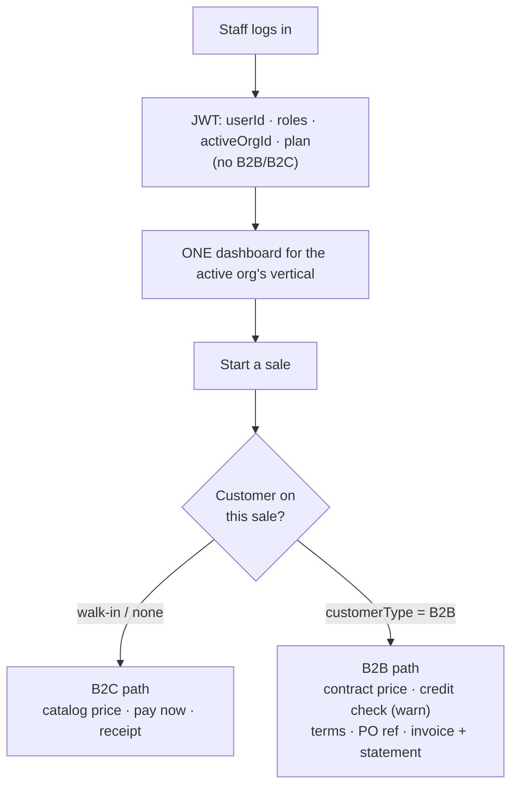

# B2B + B2C — what exists today, and how to start both

**Status:** IN DELIVERY — **Phases 0, 0.5, 1, 2 and 3 DONE & Cypress-green** (0/0.5 2026-08-01 · 1, 2 2026-08-02 · 3 across 2026-08-03/04, all 7 sub-slices gated · **P2-UI 2026-08-04**, which finished #10 end-to-end and fixed a defect that meant contract prices were never actually charged). **10 of the 12 customer requirements are shipped** (#1,#2,#3,#4,#5,#6,#8,#9,#10,#13). **Phase 3 (3a–3f) is COMPLETE and gated** (3f, credit notes on statements, green 2026-08-04).

> **✅ Phase 3g CLOSED 2026-08-05 — Phase 3 is done and Phase 4 is now the active phase.** 3g was opened off a
> real customer invoice showing that a trade sale still printed an 80mm till slip with the word INVOICE on it.
> All five sub-slices shipped, `V35` applied, and **`receipt-trade-invoice.cy.js` + `document-designer.cy.js`
> are green** — the renderer and the designer are both proven end-to-end. Decisions D-1/D-2/D-3/D-5 are settled
> by what shipped; **D-4 (trade-discount GL treatment) is carried into Phase 4** as the one open question.
>
> Scope note: this plan tracks **phases**, not the test suite. Per-sub-slice gate coverage lives in the slice
> docs. Two items parked there rather than here: the three 3g specs that were never written (of which
> **`document-template-crud` matters — it is the only one covering a tenancy boundary**), and
> **[slice 106](slices/106-cypress-suite-health.md)**, the full-suite health pass.

**ACTIVE: Phase 4 — B2B ordering** (quote → approval → order, customer PO, account hierarchy) — the first
genuinely NEW workflow; everything so far extended existing paths. **Start with the account hierarchy**
(company → branch → contact): it is a Phase 4 deliverable *and* a prerequisite for the portal-vs-counter
question, so it is built first regardless of how that is answered (§6). Remaining unscheduled: reqs **#7**
(stock cap + expiry digest) and **#11** (supplier targets) in Phase 6.
Per-phase state is tracked in the Delivery phases section below; the slice doc for each shipped phase is linked there. Analysis sections 1-3b remain as written unless a finding contradicts them.
**Companion to:** [`oms-b2b-b2c-implementation-plan.md`](oms-b2b-b2c-implementation-plan.md) (gap analysis),
[`oms-program-plan.md`](oms-program-plan.md) (tracker), [`customer-requirements-plan.md`](customer-requirements-plan.md)
(the 12 customer requirements).
**Every claim below was checked against the code.**

---

## 1. Answering the question directly

> *"What is right now implemented? B2C?"*

**B2C is largely built. B2B is roughly half-built — not zero.** The common assumption ("we have B2C, B2B
is greenfield") is wrong, and acting on it would mean rebuilding things that already work.

### Scorecard

| Capability | B2C | B2B | Evidence |
|---|---|---|---|
| Public storefront, cart, guest checkout | ✅ | – | `PublicCheckoutController`, `/store` |
| Coupons, shipping quote, order tracking | ✅ | – | `/quote`, `/order/track`, `/orders` |
| Counter sale (POS), receipt, tax, tenders | ✅ | ✅ | `SagaSellService`, `receipt.js` |
| Returns + refunds (saga-aware, stock restored) | ✅ | ✅ | `saleReturn` → `inventoryClient.returnStock` |
| **Sell on credit** (dues, due date, balance) | – | ✅ | `Customer.dueAmount`, `dueDate`, `creditBalance` |
| **Customer / vendor statements** | – | ✅ | `/customerStatement`, `/vendorStatement` |
| **Ageing reports** | – | ✅ | `/customerAging`, `/vendorAging` |
| Payments, allocation, receipts, GL | ✅ | ✅ | finance-service `/payments`, `/journal`, `/pnl` |
| Multi-location stock, FEFO batches | ✅ | ✅ | inventory-service |
| **Contract / tiered price lists** | – | ✅ **DELIVERED** *(was ❌ 0)* | Phase 2 + P2-UI — `commerce-pricing` lib, `price_rule` (catalog V7), authored + charged |
| **Credit limit** (a cap, not just a balance) | – | ✅ **DELIVERED** *(was ❌ 0)* | Phase 1 — `Customer.creditLimit` + `Vender.creditLimit` (V30), warn = take confirmation |
| **Payment terms** (Net 30/60) | – | 🟡 **CAPTURED, not yet enforced** *(was ❌ ~0)* | Phase 1 — `Customer.paymentTermsDays` (V30). **Due-date-derivation is still deferred** (needs `SagaSaleWriter`, which owns dueDate) |
| **Quote → approval → order** | – | ❌ **0** | no `SalesQuote`, no approval state — **Phase 4** |
| **Customer PO number** | – | ❌ **0** | absent — **Phase 4** |
| **Account hierarchy** (company → branch → contact) | – | ❌ **0** | absent — **Phase 4** |
| **Return documents** (credit/debit note) | ✅ | ✅ | Phase 3c — `CRN-`/`DBN-` series; 3f put them on the statement |
| **Statements that reconcile** | – | ✅ | Phase 3d/3f — CSV download; issued value + credit notes, no retro-edit |
| **Filterable, exportable reports** | ✅ | ✅ | Phase 3e — `SaleReportFilter` + shared filter rail + CSV |

**So (as originally written):** B2B *transacting* works today — you can sell on account, track dues, issue
statements and age receivables. What's missing is the B2B **commercial layer**: agreed prices, credit
control, and an approval-bearing order.

> **Scorecard refreshed 2026-08-04 after Phases 0–3.** Of the three gaps named above, **two are now closed** —
> agreed prices (Phase 2 + P2-UI) and credit control (Phase 1). **The approval-bearing order is the one that
> remains**, and it is exactly Phase 4. The rest of §1–§3b is left as originally written because the
> *analysis* still holds; only this table is restated, since a scorecard that still reads ❌ against shipped,
> gated work would misdirect the next planning decision.

### Two things worth correcting before they mislead

1. **`marketplace /quote` is not a B2B quote.** It is a live cart-totals breakdown (shipping + coupon).
   Reusing that name for B2B sales quotes would be confusing — the B2B one should be `SalesQuote`.
2. **`Customer.customerType` exists, commented out:**
   ```java
   // private CustomerType customerType;
   ```
   Someone started this and backed it out. That is exactly where the B2B/B2C flag belongs — see §3.
   **✅ Resolved in Phase 0** (V29): the field is live, the channel is *derived* via `CustomerType.channel()`
   and never stored twice, and `orDefault` at save stops an edit silently demoting a trade account to
   walk-in. Four values only — `WALK_IN`, `RETAILER`, `WHOLESALE`, `VIP`; **there is no `RETAIL`**, a fiction
   that cost the P2-UI gate a red run.

---

## 2. Vertical use cases (you asked to keep these for every module)

B2B/B2C is **not a POS concept**. Every vertical has both sides, which is precisely why the commercial
layer must be shared rather than built inside business-service.

| Vertical | B2C — individual | B2B — organisation |
|---|---|---|
| **Retail / POS** | Walk-in pays cash/card | Trade customer on account: agreed price list, credit limit, monthly statement |
| **Pharmacy** | Patient buys OTC / collects a prescription | Supplying clinics, hospitals, other pharmacies on account; institutional rates; controlled-substance paperwork per order |
| **E-commerce** | Guest checkout ✅ built | Registered trade buyer: logs in, sees *their* prices, submits a PO number, pays on terms |
| **Education** | Parent pays a child's fees | Corporate sponsorship, NGO/government-funded seats, one invoice to an employer for many students |
| **Welfare** | Individual donor | Corporate donor / grant funder: pledge schedule, restricted funds, funder reporting |
| **Agriculture** | Own-farm income & expense | Selling produce to buyers/mandis on account, against a contracted rate |
| **Appointments** | Patient books and pays | Employer health packages, insurance panel, corporate billing per visit |

**The pattern is identical every time:** an *organisation* buys, at an *agreed price*, on *credit*, against
a *reference* (PO / grant / policy number), and is *invoiced and statemented* rather than given a receipt.

**Architectural consequence — the reason this matters:** if the B2B layer is built inside
business-service, education, welfare and appointment cannot use it, and each will grow its own. The OMS
plan already reached this conclusion; this table is the justification:

| Capability | Home | Serves |
|---|---|---|
| Account hierarchy, roles, credit limit/terms | **party-service** | every vertical |
| Price lists / contract & tiered pricing | **catalog-service** + `commerce-pricing` lib | every commerce vertical |
| Credit check, invoicing, statements, ageing | **finance-service** | every vertical |
| Quote → approval → order | the order owner (business / marketplace) | commerce verticals first |

Exactly **one** new service (`logistics-service`) is justified across the whole programme, and it is not
needed for B2B commercials.

---

## 3. How to start both — the channel flag

Do **not** fork the sell screen, and do not deploy separately. B2B/B2C is a **property of the customer**,
resolved at order time:

```
Customer.customerType = B2C (default) | B2B
```

Uncomment `CustomerType`, give it a Flyway migration defaulting every existing row to **B2C**, and let it
drive:

| At order time | B2C | B2B |
|---|---|---|
| Price | catalog price | contract → tier → catalog (fallback) |
| Payment | due now | terms (Net 30/60) |
| Credit | n/a | limit checked → **warn** (your decision) |
| Reference | none | PO number (optionally mandatory) |
| Document | receipt | invoice + periodic statement |
| Discount | manual | rule-driven |

Everything degrades to today's behaviour when `customerType = B2C`, so **nothing changes for an existing
shop until it creates a B2B customer**. That is what makes this safe to ship incrementally.

This mirrors how PHARMA/BUSINESS/MARKETPLACE already white-label one dashboard from `userType` — same
technique, different axis.

---

## 3b. Identity — how the platform knows B2B from B2C

> *"How will maxtheservice.com treat/identify the logged-in user as B2B or B2C, or wanting both?"*

**The logged-in back-office user is neither.** That is the answer, and it matters: B2B/B2C describes **who
they are selling to**, not who they are. A pharmacy serves a walk-in patient at 10am (B2C) and invoices a
clinic at 11am (B2B) — same person, same screen, same login. Tagging the *user* as one or the other would
force a mode switch that the real business day does not have.

"May want to use both" is therefore **the default**, and it needs no special handling.

### Three distinct identities — do not conflate them

| Layer | Who | Carried by | B2B/B2C? |
|---|---|---|---|
| **Subscriber** | maxtheservice's customer (the shop) | `Organization` — `plan`, `trialEndsAt`, `entryCap`, `type` | This is *our* commercial relationship with them. Unrelated to the axis below |
| **Operator** | the logged-in staff member | `User` + JWT — `userId`, `roles`, `privileges`, `activeOrgId` | **Neither.** They serve both kinds of buyer |
| **Buyer** | the shop's customer | `Customer.customerType` | ✅ **This is the B2B/B2C axis** |

The JWT today carries `userId · email · roles · privileges · activeOrgId · plan · trialEndsAt · entryCap ·
demo · locations` — and **no B2B/B2C claim**. That is correct and should stay that way. Putting a
B2B/B2C flag on the token would bind a *seller* to a *buyer's* attribute.

### So how is it resolved?

**Per transaction, from the customer on the invoice.** The cashier picks (or creates) the customer; that
customer's `customerType` decides price source, credit check, terms, and whether the document is a receipt
or an invoice. Nothing to switch, nothing to remember. A shop with no B2B customers never sees a B2B
control.



### The one exception — storefront shoppers

Marketplace has a **separate** account system (`PublicCustomerController` `/register`, `/login`,
`CustomerAccountService`) scoped to an `organizationId`. That account is the *tenant's customer*, not a
maxtheservice user — and **there** the logged-in identity genuinely is B2B or B2C:

| Storefront visitor | Sees |
|---|---|
| Guest (not logged in) | Catalog price, pay now — today's behaviour |
| Logged-in **B2C** shopper | Same, plus order history |
| Logged-in **B2B** buyer | *Their* contract price, credit terms, PO field, invoices |

So the same `Customer.customerType` field serves both the counter and the storefront. One concept, two
surfaces — no second model.

### What this means for the build

- **No B2B/B2C claim in the JWT**, no B2B/B2C user flag, no mode toggle in the UI.
- One field — `Customer.customerType` — drives everything, resolved at order time.
- A tenant "uses both" by simply having both kinds of customer. Nothing to configure.
- The only per-tenant switch needed is whether the B2B *controls* are visible at all
  (`pos.b2b.enabled`), so a pure walk-in shop's screen stays uncluttered.

---

## 4. Plan — start both, in one sequence

Both channels progress together: each phase either completes B2C or adds the B2B counterpart, and every
phase ships behind defaults that preserve today's behaviour.

### Phase 0 — Foundation + quick wins — ✅ **DONE, Cypress-green 2026-08-01**
Slice doc: `slices/b2b-P0-customer-type.md` · gate: `cypress/e2e/business/b2b-customer-type.cy.js`
- ✅ `CustomerType` + `Customer.customerType` + business-service **V29** (additive nullable, backfill, index, `information_schema`-guarded)
- ✅ **#3** whole-invoice margin check — `pos.sale.marginPolicy` (`off|warn|block`, default **warn**), enforced before any stock reservation
- ✅ **#8** vendor dues on the purchase screen, via `data-due` on the vendor options (no extra round trip)
- ✅ **#13** promo footer — `pos.receipt.showPromo`, **off** by default
- ✅ i18n ×6 bundles · `MarginPolicyTest` + `CustomerTypeTest` on `mvn test`
- ✅ OMS Phase 0 marked — **G2 already done** (`saleReturn` restores inventory via the saga)

**Two deviations from this plan, deliberate:**
1. **Four types, not a two-value B2C/B2B enum.** `WALK_IN`/`VIP` = B2C, `RETAILER`/`WHOLESALE` = B2B, with the
   channel **derived** (`CustomerType.channel()`). A shopkeeper sets *how they serve a customer*, not an
   abstract channel; a separate channel column could disagree with the type and nothing would arbitrate.
   Existing rows backfill to `WALK_IN`, which is the same "everything is B2C today" the plan intended.
2. **Receipt-vs-invoice by `customerType` moved to Phase 3**, with the rest of the document work. Nothing in
   Phase 0 reads the channel yet — Phase 0 only establishes it.

*Delivered:* the flag everything else keys off, plus three visible wins. Nothing behaves differently unless
an owner changes a setting.

**Carried forward (not blockers):** D2 migration test (Testcontainers V29 replay) still unticked;
`company.cy.js` reads `res.body.data`, which `GenericResponse` does not have (lists land in `collection`), so
its vendor test silently skips and its cleanup never finds its company — pre-existing, awaiting the user's call.

### Phase 0.5 — one login reaches every module — ✅ **DONE, Cypress-green 2026-08-01**
Slice doc: `slices/b2b-P05-org-type-routing.md` · gate: `cypress/e2e/business/org-type-routing.cy.js`
- Route on the **active org's** type, not `User.userType`, so one account reaches every module it belongs to
- `activeOrgType` JWT claim (from the existing `Organization.type`) · `OrgView.type` · one shared `ModuleRouter`
- **No schema change, no migration** — the column already exists and is populated; NULL falls back to `userType`
- Also fixed: the type→dashboard map was duplicated in `AppController` and `determineTargetUrl` and
  **already disagreed** on `APPOINTMENT` (one `ModuleRouter` now)
- Also fixed: **six** sites resolved the location module from a *person's* `userType` while holding the org
  — the design named two, implementation found four more (`createOrgUser`, `assignLocations`,
  `listOrgUsers`, `myLocations`). Half-fixing would have been worse than none: `myLocations` feeds the store
  switcher while `addLocationClaims` mints the token, so a split offers a store the token then refuses
- Fixture `multi.module@myplus.com` seeded into both a commerce org and a school (no live customer runs two
  modules, so the two-org hop had to be seeded)

### Phase 1 — B2B accounts & credit — ✅ **DONE, Cypress-green 2026-08-02** *(= OMS B4, customer req #9)*
Slice doc: `slices/b2b-P1-credit-limit.md` · gate: `cypress/e2e/business/credit-limit.cy.js`
- Credit limit + payment terms on the customer (party-service owns the account; finance owns the balance)
- Credit check at order validation → **warn** (configurable `off | warn | block`)
- Inline on the sell screen, beside the dues block that already exists

*Delivers:* controlled credit selling. Statements and ageing already exist and light up immediately.

### Phase 2 — B2B pricing — ✅ **DONE end-to-end, Cypress-green** *(backend 2026-08-02 · **P2-UI 2026-08-04**)* *(= OMS B1, customer req #10)*
**P2-UI closed both outstanding items (2026-08-04, 14 tests green across two gates).** The Price Rules screen (list/create/edit/delete, ordered by the resolver's own precedence and labelling which rule is overridden) means an owner can author a rule without an API client. And what was filed as “the sell screen's live price-reason hint” turned out to be a **defect**: the screen prefilled the rate box from the CATALOG price, and since the submitted rate wins server-side (so a cashier's override beats a rule), a matched contract price was computed, recorded as the line's reason — and never charged. The till now quotes and charges it; server precedence is untouched. See `slices/b2b-P2-pricing.md` §4–§7.

**The lesson that made this slice necessary:** deferring the only way a user reaches a feature violates the finish-one-domain-end-to-end rule, and **a note in a doc is not a plan** — the deferral WAS written down here, but nothing carried it into a numbered slice with a gate, so once Phase 2 went green the work became invisible.
Slice doc: `slices/b2b-P2-pricing.md` · gate: `cypress/e2e/business/pricing.cy.js`
- Price lists: customer-specific and volume tiers, in catalog + a `commerce-pricing` library
- Resolution order **base → contract → tier → promotion**, cached off the sell hot path
- Covers customer-wise *and* product-wise discount in one model rather than two

### Phase 3 — Documents & reports — ✅ **3a–3f COMPLETE (8 sub-slices Cypress-green, 2026-08-03/04)** · ⚠️ **re-opened as 3g below**
Slice docs: `slices/b2b-P3-documents-reports.md` + `slices/b2b-P3f-credit-notes-on-statements.md`, each sub-slice separately gated *(customer reqs #1, #4, #5, #6, #2; + receipt-vs-invoice, moved from Phase 0)*
- **3f** closed the last gap: a return used to rewrite the invoice header, so the statement contradicted the customer's own copy and the credit note appeared nowhere. Balances were right; the document trail was not.
- **F1** batch/expiry captured on purchase → **#2**, then **#4** receipt lines
- Return series `CRN-`/`DBN-` → **#1**
- Statement/invoice PDF+CSV download → **#5** (`jspdf` already vendored)
- **F2** filterable report engine → **#6**

*Serves both channels* — a B2C shop wants the same reports.

### Phase 3g — printable trade invoice + owner-designable documents — 🔨 **IN DELIVERY**

Doc: [`slices/b2b-P3g-trade-invoice-designer.md`](slices/b2b-P3g-trade-invoice-designer.md). Opened
2026-08-05 off a real pharma-distribution invoice supplied by the customer.

Phase 3b-1 made a trade sale print the *word* INVOICE; everything else stayed a 4-column 80mm till slip.
3g makes the layout **data** (a declarative Document Profile), so one renderer serves the thermal receipt,
the A4 trade invoice and any layout an owner designs. **Channel picks the layout, vertical picks the words.**

**All five sub-slices CODE COMPLETE and built** — 3g-1 renderer, 3g-2 `V35` + capture, 3g-3 `document_template`
+ validator + resolver, 3g-4 designer screen with live preview, 3g-5 the hardcoded per-client
`businessInvoicePrint.js` deleted. **`receipt-trade-invoice.cy.js` and `document-designer.cy.js` GREEN
(2026-08-05) → 3g-1 and 3g-4 gated.** Ships `V35`. Found and fixed a live defect:
the receipt computed line amounts as `totalAmount + taxAmount` and ignored `Sell.discount`, so a discounted
line printed more than the customer was charged and the lines did not sum to the printed total.

Decisions **D-1, D-2, D-3, D-5 are settled by what shipped** (both sides provisioned · bonus presentation-only ·
English-only amount-in-words · designer owner-only). **D-4 alone is open** — does `TRADE DISCOUNT` post as a
discount account or reduce revenue? It touches `common-subledger`, not just the print.

**Test-suite scope:** this plan tracks **phases**, not specs. Per-sub-slice gate coverage — including the three
3g specs that were never written (`invoice-trade-fields`, `document-template-crud`, `invoice-legacy-retire`) —
is recorded in [`slices/b2b-P3g-trade-invoice-designer.md`](slices/b2b-P3g-trade-invoice-designer.md) and does
not gate phase progression here. **`document-template-crud` is the one worth returning to**: it is the only
missing spec covering a tenancy boundary.

### Phase 4 — B2B ordering — 🔨 **ACTIVE**
- **4a — account hierarchy** (company → branch → contact) — ✅ **COMPLETE & GATED 2026-08-05, 8/8 green.**
  Credit semantics decided: **shared pool** (one company limit, branches draw on it). Doc:
  [`slices/b2b-P4a-account-hierarchy.md`](slices/b2b-P4a-account-hierarchy.md). Built first because §6 makes it
  a prerequisite for the portal question either way. Proposal: hierarchy on `Party` (reusable by Education
  sponsors / Welfare corporate donors), credit roll-up target **stamped** onto `Customer` so the sell path keeps
  a single local read.
- **4b — `SalesQuote` → approval → order · customer PO number** — ✅ **COMPLETE & GATED 2026-08-06, 6/6 green**
  (+ 15/15 unit, 27/27 regression). Doc:
  [`slices/b2b-P4b-sales-quote-to-order.md`](slices/b2b-P4b-sales-quote-to-order.md). Own `QTE-` series;
  internal approval gate separated from customer acceptance; expiry DERIVED (no job); converts through the SAME
  single revenue path (`SagaSellService.addSell`), so quotes inherit idempotency, FEFO, tax, COGS, period lock
  and the GL outbox; credit checked against 4a's shared pool at conversion. **D-4 implemented**: trade discount
  posts to **4200 Sales Discount** (contra-revenue) — it had been captured since 3g but never posted at all.
- The first genuinely new *workflow*; everything before it extends existing paths
- ✅ **D-4 SETTLED 2026-08-06 — trade discount posts to a CONTRA-REVENUE discount account**, not netted off
  revenue: gross revenue keeps matching the invoice face value and "discount given" becomes one account balance.
  Note this CHANGES behaviour — `trade_discount` (3g) is captured today but never posted, so it prints on the
  invoice and appears nowhere in the books. No back-posting of pre-4b sales.
- ✅ **§6 portal question SETTLED 2026-08-06 — counter-entered, no trade portal in Phase 4.** 4a was built
  neutral to this, so a portal later adds a front end rather than a rebuild.

### Phase 5 — B2C completion
- Real PSP adapter (sandbox today) · promotions/bundles · BOPIS / ship-from-store on multi-location stock

### Phase 6 — Shared
- **#7** stock cap + expiry config + daily digest e-mail · **#11** supplier targets & bonuses
- `logistics-service` (shipping, pick/pack, partial shipments) if fulfilment is in scope

**Order rationale:** credit before pricing (a credit limit is useless without knowing what they owe, and
that already works); documents before workflow (customers feel invoices and reports immediately); B2C
completion after B2B because the B2C path already sells.

---

## 5. Per-vertical rollout

The commercial layer lands once, then each vertical opts in — no per-vertical rebuild:

| Vertical | Opts in at | What it gains |
|---|---|---|
| Retail / POS | Phase 1 | Trade accounts — the reference implementation |
| Pharmacy | Phase 1 | Institutional supply; reuses POS entirely (it already shares the sell path) |
| E-commerce | Phase 2 | Logged-in trade buyer sees their contract price |
| Education | Phase 3 | Corporate/NGO sponsor invoiced for many students |
| Welfare | Phase 4 | Corporate donors, pledge schedules, funder reporting |
| Appointments | Phase 4 | Employer/insurance billing |
| Agriculture | Phase 4 | Contracted produce sales on account |

Pharmacy is nearly free (it shares business-service's sell path). Education, welfare and appointments need
their own *screens* but reuse the same party/pricing/finance capabilities.

---

## 5b. Architecture & standards binding

**Shared libraries, not new dependencies** — full analysis in
[`b2b-shared-library-review.md`](b2b-shared-library-review.md). Summary:

| Need | Planned verdict | **Delivered (2026-08-04)** |
|---|---|---|
| Credit limit (#9) | **existing `common-credit` lib** — check stays local, no finance call on the sell path | ✅ **as planned** — `CreditLimitPolicy`, pure, no SPI. The shared-library review's proposed *new* `commerce-credit-policy` was **not** minted: `common-credit` already was that library |
| Pricing/discount (#10) | new lib `commerce-pricing` + tables on catalog — resolved **once per sale** | ✅ **as planned** — `PriceResolver` (pure) + `price_rule` on catalog V7; **one quote per sale, never per line** (2 queries total) |
| Reports (#6) | new lib `commerce-reporting` (SPI per service) | ⚠️ **NOT built — see §5c** |
| Documents (#1/4/5/13) | new lib `commerce-documents` (numbering + render + promo) | ⚠️ **NOT built as a new lib — see §5c** |
| Alerts (#7) | **reuse** `common-notify` | ⬜ unscheduled (Phase 6) |
| Config (all) | **reuse** `common-settings` | ✅ **as planned** — every toggle this programme added |
| Shipping | the one justified new **service** — `logistics-service` | ⬜ deferred, correctly (see §6 Q3) |

**Planned: four libraries, one service. Delivered: one new library, three reuses, no new service** — and the
sell path still makes exactly the four calls it made before, which was the binding constraint.

## 5c. Where the architecture deviated from plan, and why

Recording this because a plan that quietly diverges from the code stops being a plan. Both deviations were
**decided at the slice**, not drifted into — but neither was written back here until now.

**`commerce-documents` was not created.** The document work split by concern instead:

| Piece | Landed in | Why there |
|---|---|---|
| `CRN-`/`DBN-` numbering, `isReturnDocument()` | **`commerce-domain`** (existing shared lib) | Numbering is a domain rule every vertical shares. Reuse-before-create: `commerce-domain` already held `InvoiceNumbers`, so a new library would have split one concept across two artifacts |
| `CsvWriter` (+ formula-injection neutralising) | `business-service/util` | **Single consumer today.** Library-by-default does not mean library-on-speculation |

**`commerce-reporting` (SPI per service) was not created.** Phase 3e shipped `SaleReportFilter` (Query Object)
plus the shared browser rail `/js/common/report-filters.js`. The *client* abstraction is shared — every future
report attaches to that rail — while the server side stayed local to its one consumer. An SPI with a single
implementor is indirection without a second implementation to justify it.

**The extraction trigger, so this is a decision and not an omission.** Extract `commerce-documents` /
`commerce-reporting` the moment a **second** module needs them — the first likely candidate is education fee
receipts and statements, which already share `common-subledger`. Two consumers is the bar; until then, moving
them earns nothing and costs a module boundary. Concretely: **the next vertical that needs a CSV export must
move `CsvWriter` into a shared library rather than copy it** — copying is how [[feedback_no_duplicate_functions_dry]]
gets violated at the library scale.

**Patterns actually applied** (each named, per standing guidance): Query Object (`SaleReportFilter`) ·
Adapter (`/customerStatement.csv` and `/saleReport.csv` over the *same* service method, so export and screen
cannot disagree) · Policy/Strategy via `common-settings` (margin, credit, receipt toggles) · Transactional
Outbox (`GlOutboxService`) · Saga (stock reserve/confirm/return) · Anti-corruption layer (`commerce-contracts`
shared on both sides so shapes cannot drift) · Specification-style precedence (`PriceResolver.bestRule`,
mirrored in the UI with a comment in each file pointing at the other).

**Patterns applied (named, per standing guidance):** DIP / Ports-&-Adapters for every library (the
`common-credit` `CreditStore` shape) · transactional outbox for cross-service atomicity · saga for stock ·
strategy/policy object via `common-settings` · anti-corruption layer via `commerce-contracts`.

**Standards this work is bound by** (`SAAS-BUILD-STANDARDS.md`):

| | |
|---|---|
| **D1/D2** | Every schema change is Flyway, and migrations must run in `mvn test` on an empty DB |
| **D3** | Index every scoped column |
| **D7** | Migrations idempotent + re-runnable (`information_schema` guards) |
| **D9** | A field rename touches seven places — prefer additive |
| **C1** | *"A toggle that changes nothing is worse than no toggle"* — wire the behaviour in the same slice |
| **C2** | Gate-test **both** halves: the key is in the catalog with the right default **and** the behaviour changes |
| **C3** | Safety flags default ON and fail ON |

**Two gate rules this programme added the hard way** (both now belong in `SAAS-BUILD-STANDARDS.md §1.6`):

| | |
|---|---|
| **G1 — `mvn test` is half the gate.** | Cypress cannot see a test that never *compiled*. `SagaSellServiceTest` stubbed a 5-arg `writePending` after it grew a 6th param, so business-service's unit suite did not compile from `0e268b8b` until 2026-08-03 — across Phases 0–2, all of which were "green". `-DskipTests` does not satisfy this. |
| **G2 — a single-spec gate cannot see the suite.** | Every slice this month passed as `--spec <one file>`. A full-suite run on 2026-08-04 surfaced ~22 failures from **four** kinds of accumulated rot (a changed contract, deleted features, drifted assertions, shared state) — none caused by the slice being verified, none visible to any per-slice gate. **Run the owning module's whole suite before calling a phase done.** Tracked as [slice 106](slices/106-cypress-suite-health.md). |

**Also proven by C2's own logic:** a filter test that counts options but never *selects* one and checks rows
come back will pass against a filter matching nothing — how the 3e-1 channel filter shipped offering a
`RETAIL` customer type that does not exist. **Assert the effect, not the affordance.**

---

## 6. What I need before starting — **all four resolved by delivery**

**Q1 — Confirm Phase 0 scope.** ✅ **Answered and shipped.** `CustomerType` + the three quick wins landed as
Phase 0 (V29, green 2026-08-01) and everything since keys off it, as predicted.

**Q2 — Which vertical drives Phase 1?** ✅ **Retail/POS**, as proposed. Confirmed 2026-08-01 that **no live
customer runs two modules**, so the reference implementation had no competing acceptance criteria. Phase 1
(credit limit) is the one a real customer actually asked for.

**Q3 — Is `logistics-service` in scope at all?** ✅ **Deferred, and the deferral held.** Phases 0–3 shipped
without it — B2B here means "invoice and deliver yourself". Still the only genuinely new *service* in the
programme; revisit only if fulfilment enters scope (Phase 6).

**Q4 — B2B on the storefront — portal or POS-entered?** ✅ **POS-entered, de facto.** Everything through
Phase 3 is counter-operated; contract pricing reaches the till, not a trade portal. **This question returns
for Phase 4**: a quote → approval → order workflow is where a trade buyer would plausibly self-serve, and it
is the first phase whose *UI shape* depends on the answer rather than just its surface.

### The open question Phase 4 must answer first

**Does the trade buyer log in, or does your staff enter their order?** Same backend either way — but a
self-serve portal needs an authenticated B2B identity (which storefront accounts already provide, slice 61)
plus an approval chain tied to the **account hierarchy**, whereas counter-entered orders need neither. The
account hierarchy (company → branch → contact) is a Phase 4 deliverable *and* a prerequisite for the portal
reading, so **it should be built first regardless** — the answer changes only what sits on top of it.

---

## 7. Risks

- ✅ **HELD — Do not build credit limit or price lists inside business-service.** Credit rules live in
  `common-credit`, price rules in `commerce-pricing` + catalog. Neither leaked into business-service. This was
  called the single biggest architectural risk in the programme and it did not materialise.
- ⚠️ **NEW RISK, from delivery — reporting and document helpers ARE currently business-service-local**
  (`CsvWriter`, `SaleReportFilter`). Defensible at one consumer (§5c), but this is precisely the shape the
  risk above warns about, one level down. **The trigger is written into §5c: the second consumer moves it to a
  library, it does not get copied.**
- **Two `quote` concepts** — cart-totals (built) vs sales quote (Phase 4). Name the new one `SalesQuote`
  from the start.
- **Price resolution is on the sell hot path.** Contract pricing must be cached and resolved off the
  critical path, per the performance standard, or every sale pays for a pricing lookup.
- **`party_id` bridging is best-effort**, so an account hierarchy built on it needs a backfill and a
  reconciliation view before it can be trusted for credit decisions.
- **Historical profit is incomplete** (`costPrice` null for legacy sells) — surface the gap in reports
  rather than letting it skew margins.
