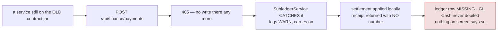

# Block the risky action, not the whole interface (BLK-1)

> **Block the risky action, not the whole user interface. Protect the backend with idempotency and
> concurrency controls, not only with disabled buttons.**
> — the ruling this slice implements

**Status:** **BLK-0 GATED GREEN 7/7, headed (2026-09-14)** — as built in §8.5; gate
`cypress/e2e/security/finance-ledger-write-guard.cy.js`; manual walk `manual-test-blk0-ledger-guard.md` (not yet
walked). Case 1 first went red with a 500: the refusal worked, but common-web's catch-all flattened it —
fixed in `GlobalExceptionHandler` (framework statuses kept: 405 + `Allow: GET`), `GlobalExceptionHandlerTest` 5/5.
**BLK-1 GATED GREEN 9/9, headed, solo (2026-09-14 10:06–10:11)** — reads stop blocking (§4.3.1); gate
`cypress/e2e/business/non-blocking-ui.cy.js`. **Regressions GREEN 41/41** (headed, solo, one process, 14 min):
`save-without-reload` 5/5 · `sale-nonblocking-load` 5/5 · `sell.cy.js` 31/31. Manual walk (Test Book §16) not
yet done. ⚠ Two earlier runs were INVALID: a second Cypress run overlapped as
the same owner and `maximumSessions(1)` expired each other's session (37 s request stalls; per-endpoint curl
<0.45 s). Case 7 was also hardened — it now records both indicators inside the page at the write's
`ajaxComplete`, because asserting after `cy.wait` depended on command-queue latency.
**BLK-3 BUILT (10:47 monolith), gate run 1 = 6/7** — skeleton rows while a grid loads, never "no records" before
the answer (§4.3.2); gate `cypress/e2e/business/grid-loading.cy.js`. Case 5's failure was the spec's own opener
(fixed); the end-to-end review added cases 7–11 and a small polish that needs the next monolith rebuild. Full
re-run pending. **BLK-4 coded 2026-09-14, NOT built/gated** — slice doc `slices/blk-4-product-optimistic-lock.md` (by the BLK-4
session); needs catalog-service (V17) + monolith rebuilt before its gate `product-concurrent-edit.cy.js`.
BLK-5 … BLK-9: design, awaiting consent.
**Every number below is measured in this repo, not estimated.**

---

## 1. Why this is not a UI ticket

The obvious reading is "make the spinner less annoying". That is the smaller half. The sentence has two
clauses and **the second is where defects live**: if the backend is guarded only by a disabled button, the
button is load-bearing — and a retry, a reload, a flaky connection or a second tab walks straight past it.

### 1.1 ⚠ CORRECTION — an earlier draft of this document was WRONG about payments

**An earlier revision led with: "`POST /payments` has NO idempotency key — a retried payment creates a
duplicate credit." That claim is FALSE and is retracted.**

I audited `finance-service`'s `PaymentController` and drew a conclusion without tracing **who calls it** —
the exact failure RULE 0 exists to prevent. The user-facing path is a different endpoint and it is properly
guarded, on both sides of the ledger:

| | AR (`receivePayment`) | AP (`payVendor`) |
|---|---|---|
| client sends a key | ✅ `idempotencyKey: window.rcvIdemKey` | ✅ `idempotencyKey: window.pvIdemKey` |
| client submit-lock | ✅ `window._rcvBusy` | ✅ `window._pvBusy` |
| server de-duplicates | ✅ `idempotencyService.find(org, "receivePayment", key)` → **replays the prior result** | ✅ same, keyed `"payVendor"` |

A double-click, a retry, or a reload-and-resubmit returns the **same receipt**, not a second one. The browser
never posts to `/api/finance/payments` at all: it posts to the monolith, which calls business-service, which
de-duplicates and only then calls finance through `FinanceClient`.

**Conclusion: there is no duplicate-payment defect. The money path does exactly what §0c asks.**

### 1.2 What IS true, after tracing it properly

`/api/finance/**` **is** routed through the gateway (`api-gateway/application.yml`, `Path=/api/finance/**`),
and `PaymentController` has:

- ❌ no `@PreAuthorize` — at class or method level, while its sibling `GlController` gates every write with
  `ADMIN_PRIVILEGE`
- ❌ no audit trail — `common-audit` is **not a dependency of finance-service at all**
- ❌ no `@Version` on `Payment` / `PaymentAllocation`

So an authenticated user of **any** role who knows the path can `POST /api/finance/payments` directly and
write rows into the ledger — bypassing AR/AP allocation, bypassing the idempotency that protects the real
screens, and **leaving no audit record of who did it**.

Tenant scoping still holds (the service scopes by org), so this is not cross-tenant. It is an
**authorisation-and-audit gap on a publicly-routed internal endpoint** — a smaller and narrower finding than
the one I first published, and a real one.

⭐ It is also exactly what the decision tree's question 5 is for: *irreversible or security-sensitive →
require confirmation, permission check, audit trail, and server-side concurrency control.* Three of those
four are missing here. **Question 5 found what questions 1–4 could not**, because the problem is not what the
screen does — it is what the API allows when no screen is involved.

## 2. What blocks today, measured

`ajax-overlay.js` hooks jQuery's global lifecycle, so every request raises a full-viewport
`z-index: 99999` blocker after 220ms unless it opts out.

| | |
|---|---|
| AJAX call sites | **344** (187 `$.get`/`getJSON`, 81 `$.post`, 76 `$.ajax`) |
| Sites that opt out (`nonBlocking: true`) | **2** |

So ~342 requests freeze the entire application, and the large majority are **reads** — filling a grid, a
dropdown, a stock cell.

### 2.1 The usual justification does not hold here

"It prevents double-submit" is the defence, and in this codebase it is already false. `submit-once.js` does
that job in three layers, and its own header rejects the overlay explicitly:

> *Deliberately NOT here: any re-introduction of a blocking overlay on writes. That would "fix" this by
> making every save feel slower, which is the trade-off PERF-13 already rejected on purpose.*

That file exists because a shop registered **148 products from one held Enter key** — and the overlay would
not have stopped it, because writes were already non-blocking. What stopped it was auto-repeat suppression,
in-flight coalescing and a server-enforced key. **Idempotency is the protection; the spinner never was.**

### 2.2 The cost is real and already being paid

Four red gate runs in one session were the overlay covering a control (`catalog-product` needed **three**
distinct waits before it could touch one field). A test that cannot click a button because a spinner is over
it is a faithful proxy for a cashier who cannot either.

It also cancels work already done: PS-1 cut the Product screen from 474 KB to 24 KB so it opens instantly,
and a 220ms overlay then freezes the page while a 45ms read completes.

---

## 3. What the backend actually guarantees today

| Protection | Present | **Absent** |
|---|---|---|
| Idempotency key | business (**incl. receivePayment + payVendor**), catalog, inventory, marketplace; finance GL-consumption | stock adjustment; most ordinary writes (lower stakes) |
| `@Version` | Customer, InstallmentPlan, Order, SalesQuote, Shipment | **Product**, Payment, PaymentAllocation, JournalEntry, Vender, Company |
| `@PreAuthorize` | 8 services incl. finance `GlController` | ❌ **finance `PaymentController`** — publicly routed |
| Audit trail | 8 services via `common-audit` | ❌ **finance-service** (not even a dependency) |

Read the gap along the risk axis rather than the count: **the entities with optimistic locking are mostly
documents; the ones without are mostly money.** And note where the real hole turned out to be — not in the
screens, which are well guarded, but in an internal endpoint that is routed publicly and assumed private.

---

## 4. Design

### 4.0 The decision tree — the governing rule

The table in 4.1 enumerates today's screens. **This tree decides the ones nobody has listed yet**, which is
why it outranks the table: a new screen gets an answer without anyone editing a document.

```
Is this a read / search / filter?
  → DO NOT block the app. Local loading, skeletons, debounce, cancellation, caching.

Is this a normal record edit?
  → Disable only Save, for that form. Optimistic locking / version check.

Can this create duplicate money, inventory, or final documents?
  → Lock only the submit / cart / payment controls. Idempotency key + atomic server transaction.

Will this take more than 2–3 seconds?
  → Asynchronous job. 202 + job id. Show status, notify on completion.

Is it irreversible or security-sensitive?
  → Confirmation + permission check + audit trail + server-side concurrency control.
```

⭐ **Question 5 is the one that earns its place.** Questions 1–4 ask what a SCREEN should do; question 5 asks
what the API allows when there is no screen at all. That is what found §1.2 — an unauthorised, unaudited
write path into the ledger that every screen-shaped question walks straight past.

#### 4.0.1 ⚠ Question 4's threshold, measured — and the answer is not where it looks

"More than 2–3 seconds" needs a list, so it was measured rather than assumed. Server time, this tenant
(1,830 products / 955 sales), warm:

| endpoint | server | raw | **gzipped** | rows |
|---|---|---|---|---|
| `getUserSell?q=-1` | 0.274s | 2,135,376 B | **114,873 B** | 955 |
| `getUserProduct?includeInactive=true` | 0.089s | 708,055 B | **40,101 B** | 1,830 |
| `getUserPurchase?q=-1` | 0.071s | 307,638 B | 16,266 B | 311 |
| dashboard stats / charts | 0.046s / 0.043s | 245 B / 2,072 B | — | — |

**Nothing crosses 2 seconds on the server — the slowest is 274ms.** And gzip is doing real work (≈18:1), so
transfer is not the gap either: the biggest payload in the app crosses the wire at 115 KB.

So the honest conclusion is the opposite of the obvious one: **question 4 currently applies to almost
nothing server-side, and to the CLIENT constantly.** What actually consumes seconds here is main-thread
work — `pdfmake` rendering, DataTables drawing thousands of rows, CSV parsing — none of which a `202 + job
id` addresses, because there is no server job to start.

That reorders the plan: **BLK-8 (Web Worker) matters more than any server-side async work**, and BLK-9
(CSV import) is the one genuine `202 + job id` candidate.

⚠ It also means the threshold cannot be *verified* from this box. A 274ms response on a warm local stack is
not a 274ms response for a shop on a slow link at 5pm. **Question 4 needs p95/p99 from production to be
applied honestly — which is the Prometheus work, still outstanding.** Until then it is a rule for new work,
not an audit of existing work.

### 4.1 The behaviour contract, per situation

**This table is the specification.** It supersedes the three-tier sketch this document opened with, which
was too coarse to build against — "tier M" does not tell anyone what to render.

Each row is checked against the code as it stands today.

| Situation | What the user should experience | Backend protection | Today |
|---|---|---|---|
| Search products | Keep typing; loading shown **in the results only** | Debounce **and cancel obsolete requests** | ◑ debounced + sequence-guarded (PS-1d); **nothing is cancelled** |
| Product page load | Table skeleton | Paged API; cache safe reference data | ◑ paged (PS-1); no skeleton; no ETag (PS-1e) |
| SKU availability check | "Checking…" beside the SKU field | Tenant-scoped indexed lookup | ◑ lookup shipped (PS-1b); **no "Checking…" affordance** |
| Save product | Disable **Save** only | Optimistic locking / version check | ❌ full-screen overlay; **Product has NO `@Version`** |
| Final POS sale | Lock cart + payment actions only | Idempotency key + atomic transaction | ✅ key shipped (SF-3); UI lock to confirm |
| Receive payment | Lock the payment submit only | Idempotency key + ledger transaction | ✅ both — key + submit-lock + server replay (§1.1). ~~❌ NEITHER~~ was the retracted claim. The real gap, a public ledger WRITE, is closed by BLK-0 (§8.5) |
| Stock adjustment | Lock the adjustment form only | Idempotency + reason/audit controls | ❌ no idempotency key |
| Permission change | Lock submit; **require confirmation** | Version check + audit log | ◑ audit exists; version check unverified |
| CSV import / export | Return the user to work quickly | **Background job + status page** | ❌ fully synchronous |
| PDF / report generation | Queued / running / completed status | Background worker + notification | ❌ synchronous **on the main thread** — see 4.1.3 |

✅ done · ◑ partly · ❌ not done

#### 4.1.1 "Cancel obsolete requests" has two traps, and both bite silently

Worth spelling out, because the naive implementation is worse than no cancellation:

1. ⚠ **An aborted XHR fires `.fail()`.** jQuery reports `statusText === 'abort'` through the same path as a
   real failure, so a search box that renders "could not load results" on every keystroke-cancelled request
   is *less* usable than one that never cancelled. **Every `.fail()` handler on a cancellable read must
   check for abort and return silently.**
2. ⚠ **Aborting does not stop the server.** The query still runs to completion; what is saved is the
   browser's connection slot (six per host on HTTP/1.1 — the real constraint on a page like the dashboard).
   Cancellation is a CLIENT-side concurrency fix, not a server load fix, and should not be sold as the
   latter.

PS-1d already ships the *correctness* half — a sequence guard, so a slow earlier response cannot repaint
over a newer one. Cancellation is the *efficiency* half and is still to do. **The sequence guard must stay
even after cancellation lands:** an abort that loses the race still delivers, and `success` can fire for a
request already superseded.

#### 4.1.2 "Save product" names a gap that was invisible

`Product` has **no `@Version`**. Optimistic locking here covers Customer, InstallmentPlan, Order, SalesQuote
and Shipment — documents — while Product, the single master the whole commerce core reads, has none. Two
staff editing one product still silently overwrite each other, exactly as Customer did before V62.

#### 4.1.3 ⚠ The PDF row needs a DIFFERENT answer from the one written

**PDF generation here is entirely CLIENT-side** (`pdfmake`, in `document-pdf.js`, `labels.js`,
`installment.js`, `catalog-products.js`, `business.js`). There is no server renderer to move to a worker
queue, so "background worker + notification" cannot mean a server job for this row as written.

What it must mean instead is a **Web Worker**, and the distinction is not pedantic — this codebase has
already lost a day to it. `window.print()` is **synchronous and blocking**: it halted the main thread so
completely that Cypress could not even time out (no error, no screenshot, the run simply never finished).
A large `pdfmake` render is the same shape without the dialog: the page is frozen, so no spinner can
animate and no cancel button can be clicked. **A blocking main thread is the one case a UI-side fix cannot
reach.**

So:

| | |
|---|---|
| **Client-side PDF** (today: all of them) | render in a **Web Worker**; main thread shows queued/running/done and stays interactive |
| **Server-side reports** (none today) | background job + status page, as written — correct if we ever add one |

CSV **import** is genuinely the server-job row: it is a synchronous POST today, and a job + status page is
new infrastructure (there is `@Async`/`@Scheduled` in 8 services, but no user-facing job-status model).
**It is the largest item here and should not ride along with the UI work.**

### 4.2 The rule that decides every case

> **A spinner must never cover a control the user could otherwise legitimately use.**

If the answer is "but they might click something else mid-save" — that is a backend problem wearing a UI
costume, and tier M's guards are the answer.

### 4.3 Inverting the default

Same flag, opposite polarity: blocking becomes opt-in (`blocking: true`) instead of opt-out. 2 call sites
change meaning instead of 342, and every *new* call site is safe by default rather than blocking by accident
— which is how all 344 got this way.

#### 4.3.1 As built (BLK-1, 2026-09-14) — reads stop blocking; writes do NOT yet

**The rule, in `ajax-overlay.js` and nowhere else** — no call site was edited:

| request | overlay | thin progress bar |
|---|---|---|
| a READ (`GET`/`HEAD`) — `$.get`, `$.getJSON`, a GET `$.ajax` | **never** | after 220 ms |
| a WRITE (`POST`/`PUT`/`PATCH`/`DELETE`) | as today — **yes** | — |
| a write marked `nonBlocking: true` (`callAjax`, `jsonPost`, PERF-13) | no, as today | after 220 ms |
| anything marked `blocking: true` | yes (opt-in, for a read that must) | — |
| a background read (`global: false`, `bgJson`, `bgGet`) | no | no — it is not the user's wait |

Measured over `static/js` + `templates` (grep, 2026-09-14): **214 `$.get`/`$.getJSON` sites plus the GET-typed
`$.ajax` sites stop freezing the app** — every freeze that was actually measured (the dashboard's ~970 ms,
grid and section loads). 97 `$.post` and ~68 write-typed `$.ajax` sites (a grep heuristic: a write type within
six lines of the call) keep today's behaviour. The decision is made from `settings.type` at runtime, so it is
right for call sites a grep would miss, including the 26 inline in templates.

**⚠ Why writes are NOT inverted here, although §4.3 said they would be.** §4.3 was written before §9.1
found six money/stock writes with no server-enforced key. `submit-once.js` covers the *identical* double-submit
(in-flight coalescing), but an operator who **changes the amount and presses Save again** while the first
request is in flight sends a *different* body, which coalescing does not catch. Removing the veil from those
writes would strip what guards them — the exact thing this document exists to stop (§0c). Writes lose the
overlay form by form in **BLK-2** (per-control lock + label), and only once **BLK-13 / BLK-5** have given each
one a server-enforced key.

⚠ **Corrected 2026-09-14 — the veil does NOT guard all six.** The first version of this paragraph said it
did. Verified in code (and first pointed out by the BLK-2 session): two of the six are submitted through
`main.js`'s generic `#add<Entity>` binder → `$.fn.callAjax`, which is `nonBlocking: true` (PERF-13), so they
get the progress bar, not the veil.

| write (§9.1) | submitted by | veil today | what else guards an edit-and-resubmit mid-flight |
|---|---|---|---|
| saleReturn | `$.ajax` POST, `business.js:4226` | ✅ | `#srSubmit` disabled in flight |
| purchaseReturn | `$.post`, `business.js:4468` | ✅ | nothing else |
| adjustProductStock | `$.ajax` POST, `catalog-products.js:734` · `stock-count.js:206` | ✅ | nothing else |
| postOpeningBalance | `$.post`, `business.js:5447` | ✅ | `#obPost` disabled in flight |
| addPurchase | generic binder → `callAjax` (`main.js:697–748`) | ❌ bar only | `submit-once` layer 2b disables the Purchase modal's Save |
| **addFc** | generic binder → `callAjax` (education dashboard loads `main.js` via `fragments/header`) | ❌ bar only | **nothing** — `#addFc` is not inside a `.crud-overlay`, so layer 2b never disables it |

**`addFc` is the gap:** a school fee has neither a server key nor any in-flight lock, so a clerk who edits the
amount and saves again while the first save is in flight records two collections. BLK-1 did not create this —
`callAjax` was `nonBlocking` before BLK-1 — and it does not change it. It is the first form BLK-2 should lock,
and BLK-13 still owes it a key.

#### 4.3.2 As built (BLK-3, 2026-09-14) — a loading grid looks loading, and never says "no records"

**What was true before, measured against the library this app serves (DataTables 1.10.19, `/js/jquery.dataTables.min.js`)**
— its draw picks the placeholder text as:

```
text = sZeroRecords
if (iDraw == 1 && dataSource == "ajax") text = sLoadingRecords      // "Loading..."
else if (sEmptyTable && recordsTotal == 0) text = sEmptyTable        // "No data available in table"
```

| finding | evidence | consequence |
|---|---|---|
| module grids opened on ONE English "Loading..." line | the rule above; no grid sets `language` (grep: 0) | the grid collapsed to one row, then jumped |
| a SECOND draw before the data arrives prints the empty text | `iDraw == 1` fails on draw 2; the `a.toggle-vis` handler redraws `datatable` (`business.js:96`) | **"No data available in table" over a grid still loading** |
| `business.js:2003` wrote `"No Data Found"` into `$(".dataTables_empty")[0]` | the selector is page-wide | the empty message could land in ANOTHER table; English only |
| the server-paged Product grid drew nothing before its first answer | `serverSide` draws only in the callback | an empty body under a floating "Processing…" |
| plain tables (tax codes, stores, team) emptied their body only INSIDE the callback | `business.js:743,1670`, `team.js:53` | a re-fetch showed the previous rows — or the previous "No stores yet" — as if current |

⚠ **Corrected claim.** §6 case 8 said a grid "renders 'no records' while loading" as a general fact. Traced, the
module grids' FIRST draw said "Loading..."; the empty text appeared only on a second mid-load draw. Real, narrower.

**The rule, in `/js/common/grid-loading.js` — no DataTables grid was edited:**

1. `oLanguage.sLoadingRecords` defaults to skeleton rows; `sEmptyTable` to `t('ui.js.noDataYet')` (all 6 locales).
2. `draw.dt`: while `settings.jqXHR` is in flight, a placeholder cell is a skeleton — whatever the draw counter says.
3. `preXhr.dt`: a grid showing no data rows (the Product grid's first load) gets skeleton rows in its body; a grid
   showing a page of data keeps it (a skeleton over rows being read would be worse than the processing box).
4. When the request SETTLES, a table still showing a skeleton gets the answer: the empty text on success, the
   translated failure message on error (`abort` ignored — superseded, not failed).

Step 4 attaches to `settings.jqXHR` rather than DataTables' `xhr` event **because the event never fires on these
grids**: DataTables raises it only from its own `success`, and all four module `loadDataTable()`s override
`ajax.success`. It also covers what the retired hack hid — `columns([0]).visible(false)` on an already-hidden
column does not redraw, so without step 4 an empty grid would have stayed a skeleton for ever.

**Plain tables:** `GridLoading.fill('#table')` before the fetch, colspan from the table's own header (so
`#tableTeam`, 6 columns on education and 7 on business, needs no per-dashboard number). Applied to
`loadTaxCodesAdmin`, `loadStores`, `loadTeamUsers`. `labels.js`, `stock-count.js` and the finance reports already
show their own "Loading…" and are unchanged.

**Styling:** `.grid-skeleton-row` shares the dashboard cards' shimmer rule (one "loading" animation, not two),
static under `prefers-reduced-motion`. A skeleton is ONE `<tr>` with ONE cell — the shape several existing specs
already treat as "a placeholder, not data" (`row-actions`, `sell-edit`, `purchase-batch-expiry`) — so none of
them can mistake it for a row.

**Gate:** `cypress/e2e/business/grid-loading.cy.js` — every loading case HOLDS the grid's own read open and asserts
inside that window, then waits on the read BY NAME and asserts the skeleton is gone and real rows are there.
0 build check · 1 ⭐⭐ Customer grid held → skeleton, one placeholder cell, height kept, then rows · 2 ⭐⭐ a column
toggle mid-load keeps the skeleton · 3 ⭐ empty answer → translated empty text in THIS grid, "No Data Found"
nowhere · 4 ⭐ failed read → failure text, not a skeleton for ever · 5 ⭐⭐ Product grid first load → skeleton,
then rows · 6 ⭐ Stores (plain) re-fetch → skeleton, never the previous answer · 7 ⭐⭐ Product SEARCH: after a
zero-result search the next search shows a skeleton, not the stale "No data yet" · 8 ⭐ Team (plain) · 9 ⭐ Tax
codes (plain) · 10 ⭐⭐ the education Students grid (a second dashboard, `owner.education@`) — held on EXACTLY
`getUserStudent`, not the `getUserStudents`/`getUserStudentMap` reads that share the prefix · 11 ⭐ the polish
below (screen-reader text + translated processing box).

**Run 1 (2026-09-14 13:15–13:20, headed, solo, 10:47 monolith): 6/7.** Cases 0–4 and 6 green. ⚠ Case 5 failed
before testing anything: it opened Products with `#registrationType.select('ProductDiv')`, and ProductDiv is not an
option there — the screen is function-navigated (`showProducts()`), which `dashboard-kpi-drill.cy.js:50` and
`pos-barcode-default.cy.js:101` already record. A wrong assumption in the SPEC, not a product defect; fixed with
the opener BLK-2's spec already uses. Cases 7–11 were added in the end-to-end review that followed.

**Polish from that review (code, needs a monolith rebuild; case 11 is red until then):**
- the skeleton's `role="status"` carried only an `aria-label` over no content, which screen readers do not
  reliably announce — it now contains real, visually hidden text (`.sr-only` "Loading…");
- `sProcessing` — the Product grid's floating "Processing..." box — was the last loading chrome still in English;
  it now defaults to `t('ui.js.loading')`;
- `.grid-skeleton` used `text-align: left`; now `start`, so it follows the reading direction (Arabic, Urdu).

**Not covered:** welfare and agriculture grids get the same behaviour through the shared hook but are not gated
(welfare and agriculture have no Cypress suite at all); tables that render their own loading text were not
touched. `sZeroRecords` ("No matching records found") is still untranslated — a DataTables-wide i18n gap, not a
loading state, so outside BLK-3.

#### 4.3.3 The dashboard freeze that blocked the BLK-2/3/4 gates — measured, fixed (2026-09-14)

**Symptom.** `waitForAppReady` beforeEach timeouts ("never went quiet", `cy.then()` 30 s) on the business
dashboard's first load: BLK-2 (13:21), BLK-3 run 2, BLK-4 case 6. Not the server — the dashboard's 11 reads fired
in parallel on one session return in **887 ms**.

**Measured, not reasoned** (Chrome, headed, solo):
- long tasks: **8.4 s @3.6 s · 5.8 s @12.1 s · 5.2 s @18.0 s · 13.2 s @23.3 s** — ~32.6 s of main-thread blocking;
- CPU profile (DevTools Protocol via `Cypress.automation('remote:debugger:protocol')`): **`searchable-selects.js:147-149`
  — its `ajaxComplete` hook refreshing EVERY `.selectpicker` (~48) after EVERY request — 39.8 s of 52.6 s**. Self time
  in jQuery `attr`/`getAttribute` (bootstrap-select's `reloadLi` re-reading every option). The pickers hold ~1,841
  products and ~1,614 customers, and the test data grows with every seeding spec, so it only got worse.
- cleared by the same profile: `grid-loading.js` (BLK-3) not in the top 30 app functions; `submit-once.js` (BLK-2) 24 ms.

⚠ **Two wrong attributions came first** — to a run overlap, then "predates BLK-2/3" from that overlapped run. Both
were retracted. The profile is what settled it.

**Fix** (`searchable-selects.js`; reviewed by the BLK-2 session, which caught a real hazard in the first draft):
- a per-select `MutationObserver` marks a picker **dirty** only when its OPTIONS change (childList, characterData,
  `value`/`disabled`/`label` attributes) — a count + first/last signature was rejected: it cannot see a relabelled
  middle option;
- `ajaxComplete` schedules **one coalesced pass** per tick, not one per request;
- the pass: dirty → `refresh`; selection-only change (code `.val()`) → `render` (the button, not the list); else nothing;
- unchanged: the busy guard (open picker → `data-ss-stale`, refreshed on close — now also for a code `.val()` made
  while open); an explicit `refreshSearchableSelect()` (the `global:false` loaders' path) stays **unconditional**;
- `markClean` drains the observer's queued records so a rebuild cannot re-dirty itself; the multi-select value key
  uses a separator built with `String.fromCharCode(1)` so it is visible in source (an invisible literal was read as
  "no separator" in review, and an edit really did drop it once);
- no `MutationObserver` → the old refresh-everything, coalesced to one pass.

Harness (fake jQuery + controllable observer): current file **fails 6 of 13** (11 completions → 44 refreshes);
fixed file **13/13**, fallback 6/6. ⚠ A harness cannot prove real bootstrap-select behaviour — the proof is
post-deploy: re-profile (the 39.8 s must be gone), `dashboard-no-freeze.cy.js`, `sell.cy.js`, `pos-keyboard`, and a
manual check that `#sellCustomerDD` fills after load and after a sale return.

**Gate:** `cypress/e2e/business/dashboard-no-freeze.cy.js` — 1 ⭐⭐ no main-thread block ≥ 3 s and < 8 s total on the
first load (before: 13.2 s / ~32.6 s) · 2 ⭐⭐ the customer and product pickers still FILL, widget included (a fix
that simply stopped refreshing would pass case 1) · 3 ⭐ a value set by CODE shows on the widget · 4 ⭐ a picker its
loader just rebuilt is not rebuilt again by the next request · 5 ⭐⭐ a picker on a hidden screen is not rebuilt at
load and still fills when its screen opens.

**⚠ The first fix went RED — 0/3 (deployed 15:00, run the same afternoon).** The re-profile looked like success
(39.8 s → 10.7 s) and the same run was green for BLK-3 (12/12) and BLK-1 (10/10); the gate was not. Every cause was
MEASURED by a diagnostic spec (wrapping `jQuery.fn.selectpicker` from `onBeforeLoad`, since `cy.intercept` never saw
the cached bootstrap-select script) before anything was changed:

| Case | Measured | Cause |
|---|---|---|
| 2, 3 | cold New Sale: `#sellCustomerDD` 1,615 options, **1 row for 33 s**, `data-ss-stale="1"`, focus on its button; a code `.val()` marked stale, never drawn | the busy guard counted focus on the CLOSED button as "in use". New Sale focuses it (customer-first), and the stale mark is consumed only by `hidden.bs.dropdown` — never, for a menu never opened. The focus clause came from de281058 (22 Aug), whose actual concern is focus INSIDE the menu |
| 1 | long tasks = single rebuilds: `#rfCustomer` 1,615 options **3,224 ms**, `#rfProduct` 1,857 **2,685 ms** — the Sale Detail Report rail, on a screen nobody opened; 8.2 s = several in one coalesced pass | one bootstrap-select **1.6.2** refresh costs seconds (rebuild every row, then `liHeight()` clones the whole menu into `<body>`); the pass rebuilt pickers nobody could see, all in one task |
| (4) | `#sellItemDD` still dirty right after `loadUserItems`' own `selectpicker('refresh')` → rebuilt again (2.9 s) | 45 direct `selectpicker('refresh')` calls outside this file never told the change tracking; 1.6.2 has no `refreshed.bs.select` event |

**Fix v2** (user's choice: all three), still `searchable-selects.js` only:
- **busy = menu open, or focus inside `.dropdown-menu`** (live search, a row). `reloadLi` rebuilds the rows and `render`
  rewrites the label; the button and its focus survive both, so they no longer block;
- **any rebuild counts:** `$.fn.selectpicker` is decorated — after `refresh` or construction the picker is marked clean,
  after `render`/`val` its selection is recorded. A bare `.selectpicker()` on an existing instance rebuilds nothing and
  is deliberately not marked clean. Behaviour of every call is unchanged;
- **rebuild what can be seen:** a dirty picker with no layout boxes gets its label only (`render(false)`, no rows), stays
  dirty, and is rebuilt when an `IntersectionObserver` sees it, when its menu is about to open (`show.bs.dropdown`,
  before anything is open or typed), or on any later pass that finds it shown;
- **one rebuild per task** — the rest go to the next task, so a keystroke can be answered between them.

Harness v2 (fake jQuery with a real decorated plugin, controllable MutationObserver + IntersectionObserver): new file
**31/31**, fallback 7/7; the first fix **fails 12**. Still only a harness — the proof is post-deploy: this gate (5 cases)
and the regressions that lean on the busy guard: `pos-keyboard`, `pos-checkout-chain`, `pos-enter-chain`,
`pos-shortcuts`, `sale-customer-first`, `picker-prefetch`, `sale-nonblocking-load`. Note the cost moves rather than
vanishes: opening the Sale Detail Report now pays its rail's one-time rebuild (~3 s each, one per task) when it is shown.
Upgrading off bootstrap-select 1.6.2 (2014) is the real cure, a separate slice.

**Also fixed with it — the stranded veil (`ajax-overlay.js`, BLK-1's own defect).** In jQuery 3.3.1 a success/error
handler that throws skips `ajaxComplete` and `--jQuery.active` (jquery-3.3.1.js:9244/9305/9311-9329), and the overlay's
sweep waited for `jQuery.active === 0` — so a veil or bar raised by that request stayed up for the session. Now each
request is tracked from `ajaxSend`, and the 3 s sweep releases any that FINISHED (readyState 4, or 0 after 1 s)
without completing. Harness: reproduced on the old file, fixed on the new; the 22 rule/counter checks unchanged.
Gate: `non-blocking-ui.cy.js` case 9 — a write whose success handler throws must not leave the veil up.

**The progress bar is the honest half of not blocking.** A read the user started — running a report,
opening a section — must not look like nothing happened, or they press again. A 3 px bar at the top of the
viewport, `pointer-events: none`, so it can never cover a control; static under `prefers-reduced-motion`.
It says "working", and shows no number, so it cannot show an optimistic value (§0b).

**What this does NOT change:** the sale's own button lock (SF-3), `submit-once.js`'s three layers, the money
forms' keys and submit-locks, and the Cypress helpers — `waitForAppReady` waits on `jQuery.active`, not on the
overlay, so nothing the specs rely on moved.

---

## 5. Slices

Ordered by consequence, not by convenience.

| id | Change | Row it satisfies | Size |
|---|---|---|---|
| **BLK-0** | ⭐ **IMPLEMENTED — see §8.5.** The ledger write moved to `/internal/**` (not `@PreAuthorize` — §8.1 says why that cannot work); the missing audit closed at the one producer that lacked it (education fees), not in finance; `@Version` on Payment/PaymentAllocation. **NOT** idempotency — the user path already has it | Q5: irreversible/security-sensitive | S |
| BLK-1 | **IMPLEMENTED, not yet gated — see §4.3.1.** READS never raise the overlay (a thin progress bar instead); writes keep it until BLK-2/BLK-13 give each a server key + a control-level lock. Deviation from "invert everything", and why, is recorded there | all | M |
| BLK-2 | **CODED 2026-09-14, not built, not gated — `slices/blk-2-busy-controls.md`.** Per-control busy state: disable + label the control that was clicked. One shared helper (`BusyControl`, submit-once.js layer 2c) replacing 7 hand-rolled disables; veil OFF only where a server key exists (product save, receive payment, pay vendor), KEPT on sale/purchase return, stock adjust, opening balance, voids, permission save. Closes `#addFc`'s no-lock gap. Gate `busy-controls.cy.js` (14 cases) | Save product, POS sale, stock adjustment, permission change | M |
| BLK-3 | **IMPLEMENTED; gate `grid-loading.cy.js` GREEN 12/12 headed (2026-09-14) — "gated" HELD until the picker follow-up in §4.3.3 (same build) is green. See §4.3.2.** Skeleton rows in every DataTables grid through one shared hook (no call-site edits) + 3 plain tables; a grid never renders "no records" while its read is in flight | Product page load, Search products | S |
| BLK-4 | **Coded 2026-09-14, NOT built/gated** — `@Version` on `Product` + catalog V17; save sends the version; slice doc `slices/blk-4-product-optimistic-lock.md`. Vender/Company still to come | Save product | S |
| BLK-5 | Idempotency key on stock adjustment + a required reason | Stock adjustment | S |
| BLK-6 | Cancel obsolete reads (with the two traps in 4.1.1 handled) + "Checking…" beside SKU | Search products, SKU check | S |
| BLK-7 | Confirm + verified version check on permission change | Permission change | S |
| **BLK-8** | PDF rendering into a **Web Worker**; queued/running/done status | PDF generation | **L** |
| **BLK-9** | CSV import as a background job + status page | CSV import/export | **L** |

⭐ **BLK-0 still ships first, but for a different reason than the one first given here.** It is not a
duplicate-money defect — §1.1 retracts that — it is an unauthorised, unaudited write path into the ledger.

⚠ **The ordering constraint I claimed is GONE with it.** The argument was that the overlay gives the
payment screen accidental protection which BLK-1 would remove. That was never true: the screen's guard is
a client key + submit-lock + server-side replay, none of which the overlay provides. **BLK-1 can proceed
independently.** Recorded because a false constraint quietly costs more than a missing one.

⚠ **BLK-8 and BLK-9 are not "the rest of the list".** Each is new infrastructure — a worker build step and
message protocol for one, a job model + status endpoint + polling UI for the other. They are sized L and
belong in their own plan; putting them in this table is scope-tracking, not a commitment to do them here.

### 5.1 What is deliberately NOT changing

- **The POS sale's idempotency key** (SF-3) already works and is gated. BLK-2 adds the UI lock only.
- **`submit-once.js`'s three layers.** They are the reason a held Enter no longer writes 148 products, and
  none of this replaces them.
- **The GL `ProcessedEvent` de-duplication.** It correctly guards event *consumption*; BLK-0 guards the
  operator write, which is a different door into the same room.

## 6. Gate

**As built: `cypress/e2e/security/finance-ledger-write-guard.cy.js`** (BLK-0) — every number READ BACK from
the ledger, the customer or the trail, never trusted from a response:
1. ⭐⭐ a token holder's direct `POST /api/finance/payments` — a VALID body — is refused, and no ledger row lands
2. ⭐⭐ the real payment screen reaches the ledger: a receipt NUMBER, exactly one ledger row under its reference
   (the business half of the deploy-trap detector, §8.5.2)
3. ⭐ a retry with one key is a replay returning the SAME receipt
4. ⭐ two submits with one key → ONE ledger row, and the due moves once
5. ⭐ the shop receipt's audit row names who took it (`RECEIPT`/`CUSTOMER`, actor email)
6. ⭐ a school fee's audit row names who took it (`RECEIPT`/`STUDENT`)
7. ⭐⭐ a school fee reaches the ledger (the education half of the detector)

Planned here and **not** in the gate: *two different payments of the same amount both record* — walked by
hand instead (manual case 4: reload, pay again, expect two); and *a stale `@Version` is refused* — cannot be
written until something edits a payment (§8.5.3). On `mvn test`: `InternalPaymentControllerTest` (finance),
`FeeReceiptAuditTest` (education).

**As built for BLK-1: `cypress/e2e/business/non-blocking-ui.cy.js`.** ⚠ Every case RECORDS the screen for the
whole request (both indicators + `elementFromPoint` at the viewport centre, every 25 ms, request held open
past the 220 ms show-delay) — a single `should('not.be.visible')` passes at t=0 on the OLD code too.
0. the served overlay is the BLK-1 build (catches a stale monolith), and the bar is `pointer-events: none`
1. ⭐⭐ a slow READ never raises the veil, never covers the centre of the screen, and shows the bar
2. ⭐⭐ a slow WRITE still raises the veil (its only guard until BLK-13 — §4.3.1)
3. ⭐ a PERF-13 `nonBlocking` write shows the bar, not the veil
4. ⭐ `blocking: true` opts a read into the veil
5. ⭐ a background read (`bgJson`) shows nothing
6. ⭐ a quick read flashes nothing
7. ⭐ a finished write lifts the veil while a read is still running (independent counters)
8. ⭐⭐ the real screen: opening Customers with its own read held open never veils the page
Plus, pre-browser: a Node harness ran the file against a fake jQuery — **22/22** rule and counter checks.

Still planned for **BLK-2..3** in the same spec:
5. during a grid load the nav and the search box are **operable** — no full-screen blocker, and the
   grid shows a skeleton rather than an empty state
6. during an ordinary save the submitting button is disabled and labelled; a sibling control is still
   usable, and the nav still works
7. during a MONEY write the form is blocked and shows pending; ⭐ the value on screen is never the
   optimistic one — STANDARDS §0b
8. a grid that is loading shows a loading state, never "no records found" ⭐ (an empty list read as fact is
   the same class of lie as a silent truncation — see PS-1/PS-2)

---

---

## 7. Open questions

1. **Installment plan creation** — it creates a receivable, which argues for the money treatment, but it is
   a long form where blocking is expensive. The contract table does not cover it. **Flagging, not deciding.**
2. **Permission change version check** — the table calls for one; PERM-1 ships the audit log but the version
   check is *unverified*. To confirm before BLK-7 is scoped, rather than assumed either way.
3. **Export** shares a row with import but is a different problem: export is client-side today (the
   `exportAll` + `pdfmake` path), so it is BLK-8's shape, not BLK-9's. Split them when those are planned.

---

## 8. BLK-0 — implementation plan (for review before any code)

### 8.1 The mechanism, and why the obvious one does not work

❌ **`@PreAuthorize` on finance's `PaymentController` cannot work as the fix.** Legitimate payments arrive
carrying the *end user's* privileges — `GatewayIdentityForwarding` forwards `X-User-Privileges` — so any
authority strong enough to stop an attacker also stops the cashier. And `/receivePayment` has **no**
`@PreAuthorize` today, so "who may take a payment" has never been decided; inventing an answer here would
change who can work, silently, as a side effect of a security fix.

❌ **Enforcing `X-Internal-Secret` cannot work either.** The gateway *strips* any client-supplied value and
then **stamps its own on every request it forwards**, browser requests included
(`JwtAuthenticationFilter`, lines 149–155 and 213–214). The header proves "came through the gateway", not
"came from a service".

✅ **Path separation is the mechanism, and it is already proven here.** `InternalSalesController` says it
outright — *"Reachable only inside the private network (the gateway does not route `/internal/**`)"* — and
that is verified: **no gateway route matches `/internal/**`**, while `/api/finance/**` does.

### 8.2 Steps

**BLK-0a — close the direct write path.** No behaviour change for any user.

1. New `InternalPaymentController` at `/internal/finance/payments` carrying **only the write**
   (`record`). Delete that method from the public `PaymentController`.
2. **Reads stay on `/api/finance`** (`GET /payments`, `/payments/summary`). They are tenant-scoped and
   `FinanceReportService` uses them; a read is not the exposure.
3. Mirror `InternalSalesController`'s **org check**: the org in the body must equal the AUTHENTICATED org,
   so a compromised in-network caller cannot book another tenant's money.
4. New `financeInternalClient` bean in `TradeClientsConfig` via the existing `proxy(builder, baseUrl, type)`
   helper — base `lb://finance-service/internal/finance`, same `GatewayIdentityForwarding.interceptor()`.
5. `common-subledger/SubledgerService` (the only caller of `recordPayment`) switches to it.

⚠ **Steps 1 and 5 must ship together.** Between them the payment flow is broken; gate case 2 is what proves
they landed as a pair.

**BLK-0b — make ledger writes attributable.**

6. Add `common-audit` to `finance-service` (it is **not currently a dependency at all**) and emit an audit
   event on the payment write: who, when, amount, party, receipt.

**BLK-0c — concurrency control on the ledger rows.**

7. `@Version` on `Payment` and `PaymentAllocation` + a Flyway migration.
   ⚠ **`NOT NULL DEFAULT 0`** — the V62 lesson: a NULL version makes Hibernate treat an existing row as
   TRANSIENT and INSERT it, duplicating every existing payment on its next edit. Under `ddl-auto=validate`
   the column must match the entity exactly or finance-service will not start.

**BLK-0d — NOT DOING WITHOUT A RULING.**

8. **Who may take a payment?** `/receivePayment` and `/payVendor` carry no `@PreAuthorize`, so today any
   authenticated user can. Adding a privilege changes who can do their job and needs seeding + granting.
   **This is a product decision, not a technical one** — raised, not assumed.

### 8.3 Honest severity

Exploiting today's gap needs **a valid JWT**, not just a browser session: the web app holds tokens
server-side (`TokenStore`, session-scoped) and the monolith proxies no route to `/payments`. So this is
reachable by any API client that can log in — a mobile app, a script, a user who extracts their token — and
not by an ordinary logged-in browser user. **Real, and narrower than "anyone can write to the ledger".**

### 8.4 Rollback

Steps 1–5 are a path move; reverting is the same commit inverted, with no data shape change. Step 7 adds a
column and is the only one with a migration — additive and defaulted, so a rollback leaves a harmless
unused column rather than a broken table.

### 8.5 As built (2026-09-14) — where it differs from 8.2, and why

```mermaid
sequenceDiagram
    participant B as Browser
    participant M as Monolith
    participant GW as Gateway
    participant BS as business-service
    participant FS as finance-service
    participant AU as audit-service
    B->>M: POST /receivePayment (idempotencyKey)
    M->>GW: proxied with the session's JWT
    GW->>BS: + X-Org-Id, X-User-*, X-Internal-Secret
    BS->>BS: idempotency find → REPLAY, or FIFO-allocate
    BS->>FS: POST /internal/finance/payments (identity forwarded; NOT via the gateway)
    FS-->>BS: receiptNo (payment + GL journal, one tx)
    BS->>BS: audit RECEIPT → outbox, same tx
    BS-->>AU: delivered after commit
    Note over GW,FS: API client → GW → POST /api/finance/payments → 405. No gateway route matches /internal/**.
```

| Step | Planned (8.2) | Built | Why |
|---|---|---|---|
| 3 | the org in the body must equal the authenticated org | **fail closed on a MISSING org**; no body comparison | `RecordPaymentRequest` has no organization field, so the body cannot name a tenant and the authenticated org is the only one in play. A missing one is refused rather than written as an unscoped NULL-org row, which the NULL-fallback leg of every scoped read would then surface |
| 4–5 | a second `financeInternalClient` bean; `SubledgerService` switches to it | **`FinanceClient`'s paths made ABSOLUTE**; both consuming configs (business `TradeClientsConfig`, education `FinanceClientConfig`) use the bare `http://finance-service` | one contract, one bean per service. A second bean would have made `common-subledger` choose between two clients of one interface |
| 6 | `common-audit` in finance + an event on the write | **not in finance — a `RECEIPT`/`STUDENT` event in education's `addFc`** | the ruling in 8.5.1 |
| 7 | `@Version` + V6 | as planned | but read 8.5.3 — it guards no present race |

#### 8.5.1 The 0b ruling — audit at the PRODUCER, not the ledger (owner, 2026-09-14)

Step 6 was written before the callers were counted. `recordPayment` has **one** caller (`SubledgerService.settle`),
and `settle` has **three**:

| caller | audited? |
|---|---|
| `CustomerService.receivePayment` | ✅ `RECEIPT` — `CustomerService.java:465` |
| `VenderService.payVendor` | ✅ `PAYMENT` — `VenderService.java:289` |
| education `addFc` → `FeeArrearsService.settle` | ❌ **nothing** |

So step 6 as written would have recorded every shop payment **twice** — once by business, once by finance —
under two source services, and a reader of the trail could not tell a duplicate event from a duplicate
payment. It would also have recorded *less*: finance sees a party id and an amount, while the producer knows
the customer, the clerk and why. And now that 0a has closed the direct door, the producers are the only way
in.

**Rule: the service that performs the business act records it.** The one producer that did not — education
fee receipts — now does (`FeeCollectionController.auditReceipt`):

| field | value | why |
|---|---|---|
| action / entityType | `RECEIPT` / `STUDENT` | the same shape as business's `RECEIPT` / `CUSTOMER`, so one trail filter on `action=RECEIPT` shows both verticals' receipts |
| entityRef | the fee collection id | it IS the `reference` the ledger stores for this receipt, so the audit row and the ledger row join on it |
| amount | the FULL tender | the audit answers "who took this money" — a surplus carried to credit was still handed over |
| details | `enrollNo=…, student=…, method=CASH\|CHEQUE` | finance's method vocabulary, so it reads like the ledger row beside it |
| when | **create only**, tender > 0 | an edit never moves money; the tender is settled only on create |

**Placed straight after the fee row is saved**, before the charge, the settlement and the credit — because
`addFc` is not transactional: placed after them, a throw in any of the three would leave a saved fee with no
audit row.

**Best-effort, deliberately** (`catch → appUtil.le`). By then the fee row exists; if a failed audit write made
`addFc` answer ERROR, the clerk would see a failure for money that WAS recorded, and the natural response is
to submit again — a duplicate real payment, which is worse than a missing audit row.

Pinned on `mvn test` by `FeeReceiptAuditTest` (shape, zero tender, missing student, failure swallowed and
logged) and live by gate case 6.

#### 8.5.2 ⚠ The deploy trap — a library and three services ship as ONE



`settle` is best-effort by design (a ledger hiccup must not refuse a customer's money), which is exactly what
makes a half-deployed BLK-0 **silent**. Build order: `mvn install` commerce-contracts and common-subledger,
then `clean package` finance, business and education, then restart all three.

The gate detects it for BOTH producers by reading the ledger, never the response:

- business — `finance-ledger-write-guard.cy.js` case 2: exactly one ledger row under the receipt's reference,
  and a receipt NUMBER (a swallowed failure returns none)
- education — case 7: exactly one `STUDENT` ledger receipt for a freshly collected fee. ⚠ The ledger holds
  the SETTLED amount, `min(tender, owed)` — a surplus goes to credit — so the case tenders exactly the due
- and from the GL side, `fees-to-gl.cy.js` case 2: Cash moves by the fee only through
  `settle → recordPayment → PaymentService.record → postPayment`

#### 8.5.3 What 0c does and does not do

`PaymentService.record` is the **only** writer of `payments` and it **only inserts** — traced: no update path,
no native SQL touching the table anywhere in the repo. So `@Version` is **forward** protection: the first
feature that edits, re-allocates or reverses a payment inherits a loud refusal instead of last-write-wins.
§6's case "a stale `@Version` is refused" **cannot be written** until such an edit path exists, and is
dropped from the gate rather than faked.

⚠ **V6's own SQL comment overstates**: it describes a re-allocation-vs-edit race that does not exist yet, and
says finance runs `ddl-auto=validate` (its `application.yml` says `update`; Flyway runs first, so harmless).
**It is deliberately NOT edited.** Flyway checksums every line including comments; editing a migration that
has run anywhere makes finance refuse to start. The correction lives here and in the entity javadoc.

#### 8.5.4 Found while tracing, NOT fixed here

`PaymentService.nextReceiptNo` numbers by `count + 1`, and `receipt_no` has **no unique index**. Two receipts
committing together in one org can therefore share a number. Structural, not observed live. Its natural fix
is the V45 `org_document_seq` allocator, which is a slice of its own.

---

## 9. End-to-end review against §0c — 2026-09-14

**Method.** Every write surface classified by the §4.0 tree; each money / stock / document write traced
browser → monolith proxy → service → remote calls → the constraint that arbitrates. Review only — no code
changed.

**Counts.** 348 write mappings across 16 services (222 `@Post/Put/Delete/PatchMapping` in 67 controller
files + 126 `RequestMethod.*` in 50). **21 money/stock/document writes traced one by one**; ordinary
master-data CRUD classified by category, not individually. Server-side idempotency is enforced at **12
operations in 5 services**, plus 2 event consumers (finance GL `event_key`, audit `event_key`).

### 9.1 Money / stock / document writes (question 3)

| # | Operation | Client sends key | Server dedupe + UNIQUE | Remote side effect deduped | Verdict |
|---|---|---|---|---|---|
| 1 | sale `addSell` | ✅ `main.js:592` | ✅ `uq_ch_org_idempotency` | ✅ reservation `uq_resv_org_idem` | ✅ |
| 2 | `receivePayment` | ✅ `business.js:4328`; proxy forwards all params | ✅ `uq_idem_org_op_key` | ❌ finance `record` has no key | ◑ sequential ✅ · concurrent ❌ (9.2) |
| 3 | `payVendor` | ✅ `business.js:4373` | ✅ | ❌ same | ◑ |
| 4 | `addPurchase` | ❌ **none sent** | ✅ but **inert** — blank key disables it | ❌ inventory `importStock` "not idempotent itself" | ❌ |
| 5 | `postOpeningBalance` | ❌ **none sent** (`business.js:5443`); the proxy allowlist carries it | ✅ but **inert** | GL `OPENING_AR` | ❌ — no one-per-party refusal either |
| 6 | product create | ✅ `FormKeys` | ✅ `uq_products_org_idempotency` | — | ✅ DUP-1, 8 racers gated |
| 7 | back-office order | ✅ `order-booking.js:337` | ✅ `uq_order_org_idem` | — | ✅ |
| 8 | storefront checkout | the `cartToken` IS the key (`OrderService.placePublic`) | ✅ | — | ✅ |
| 9 | quote → convert | quote number is the key | ✅ + `@Version` | — | ✅ |
| 10 | pharma dispense | key present | not re-traced here | — | — |
| 11 | `saleReturn` | ❌ | ❌ | — | ❌ the line is reduced, so a retry is *bounded*, not refused: a retried **partial** return is a second refund |
| 12 | `purchaseReturn` | ❌ | ❌ | — | ❌ same shape |
| 13 | `voidSell` | n/a | status guard ✅ sequential | — | ◑ no `@Version`/lock → two concurrent voids both reverse |
| 14 | `voidPurchase` | n/a | status guard ✅ | — | ◑ same |
| 15 | `updateSell` | n/a | ❌ `CustomerHistory` has no `@Version` | — | ❌ two edits both reverse the OLD posting → GL double reversal; lines last-write-wins |
| 16 | stock adjust (`adjustProductStock`, `stock-count.js`) | ❌ | ❌ | — | ❌ reason defaulted, not required (BLK-5 open) |
| 17 | stock add / transfer | ❌ | ❌ | — | ❌ (transfer writes a record and moves no level — outside this review) |
| 18 | education `addFc` | ❌ | ❌ | settles to finance | ❌ not transactional; `#FcDiv` is not a `crud-overlay`, so L2b cannot disable it; a retry = 2nd receipt + 2nd ledger row + GL |
| 19 | welfare `addDonation` | ❌ | ❌ | — | ❌ lower stakes (GL posting not verified) |
| 20 | agriculture income / expense | ❌ | ❌ | — | ❌ lower stakes |
| 21 | finance manual journal `/gl/journal` | ❌ | ❌ | — | ◑ ADMIN-gated, operator-only |

Same-tab double-clicks are covered on every row by `submit-once.js` L1 + L2 (generic saves post a
URL-encoded string, which L2 can coalesce). **What is NOT covered on the ❌ rows is the case §0c names: a
reload, a retry after a timeout, a second tab, an API client.**

### 9.2 ⭐ The concurrent-racer guarantee is false wherever the work crosses a service

`IdempotencyService`'s javadoc: *concurrent race → both do the work, the loser fails at commit and rolls
back (no double-apply)*. That holds only for rows inside business-service's own transaction.

`SubledgerService.settle` calls finance **synchronously, inside the business transaction, before
`record()`**. Finance commits its `Payment` + GL journal in its own transaction, and
`PaymentRecordRequest` carries **no key**. So two in-flight requests with one key produce **two ledger
receipts and one business receipt**. `addPurchase` → inventory `importStock` has the identical shape.

Covered today by `_rcvBusy` + L2 coalescing, i.e. one tab. Not covered: a second tab, a retry after the
proxy times out while the first request is still running, an API client. **Structural; not observed
live.** No gate fires concurrent racers at these three operations (only DUP-1 C-2 does, for product).

Fix shape: the DUP-1 pattern one hop further — pass the key through to finance, `UNIQUE(org, source, key)`
on `payments`, replay on violation.

### 9.3 ⭐ Question 5 — what the API allows with no screen (BLK-0's class, missed by BLK-0)

**A. `POST /api/finance/gl/post-event`** — gateway-routed (`Path=/api/finance/**`), **no `@PreAuthorize`**,
and de-duplicated only when the caller supplies an `eventKey`. Any token holder can post a fabricated
SALE/PURCHASE journal into the GL. Its javadoc relies on "the gateway INTERNAL_SECRET trust boundary" —
the exact argument §8.1 disproved (the gateway stamps its secret on every request it forwards).
⚠ **§1.2's "GlController gates every write with `ADMIN_PRIVILEGE`" is wrong — it gates 4 of 5.** Fix mirrors
BLK-0a (`FinanceClient`'s base is already a bare `http://finance-service`). Same deploy trap, worse
consequence: an old-contract outbox would dead-letter every GL event.

**B. `/api/inventory/**`** — gateway-routed, `anyRequest().authenticated()`, and **zero `@PreAuthorize` on
`StockController` (6 writes) and `ReservationController` (6 writes)**. A token holder can import stock (not
idempotent), `purchase-adjust`, add, adjust, confirm/return reservations, and sweep. Tenant-scoped.
business calls inventory directly (`TradeClientsConfig:33`), so import / purchase-adjust / reservations
can move to `/internal`. `/stock/adjust` has a real user path (monolith → gateway), so it needs a privilege
instead — **a ruling on who may adjust stock**, the same shape as BLK-0d.

### 9.4 Concurrency control along the risk axis

**Have `@Version` (7):** Customer, InstallmentPlan, SalesQuote, Order, Shipment, Payment, PaymentAllocation.

**Missing where it matters:**

- ⭐ **inventory — zero `@Version`, zero `@Lock`.** Every stock move — sale confirm
  (`ReservationService.confirm`), adjust / add / purchase-adjust (`applyStockDelta`) — is read-modify-write
  on `StockLevel` and `StockEntry`. Two tills confirming the same product together lose one decrement.
  Structural, not observed. Fix: an atomic `SET current_stock = current_stock + ?`, or `@Version` + retry.
- `CustomerHistory` (edit, void), `Purchase` (edit, return, void), `Product` (BLK-4), `FeeCollection`
  (edit), Vender, Company.
- auth — zero `@Version`: permission sets / assign (BLK-7).

### 9.5 A uniqueness constraint where a natural key exists

> **Status 2026-09-14 — being fixed as DOC-INT** (`slices/doc-int-numbers-and-bills.md`), coded, not yet built.
> ⚠ **Two claims in this review were wrong, found by tracing before fixing:** the "(vendor, bill no) UNIQUE"
> below would refuse every second line of a real bill (one bill = several `purchase` rows), so it became a
> confirm-guard on vendor + bill # + product + batch; and §9.6's "welfare.js:48 native `confirm()`" is inside a
> `/* … */` block — dead code; the live welfare delete already uses `uiConfirm`.

- ✅ Flyway UNIQUE: credit note, debit note, quote, plan, order, the idempotency tables, live serial,
  attendance, marks.
- ◑ `invoice_seq` — the UNIQUE exists only through `@Table` on `CustomerHistory` + `ddl-auto: update`. **No
  Flyway migration creates it.** Flipping business to `validate`, or a Flyway-only database, loses the
  arbiter V45/V63 rely on.
- ❌ finance `receipt_no` — `count + 1`, no UNIQUE (8.5.4).
- ❌ purchase bill — no UNIQUE on (vendor, bill no): one supplier bill can be entered twice.

### 9.6 Front end (questions 1, 2, 4)

- The overlay still blocks by default: 344 jQuery call sites (187 get / 81 post / 76 ajax) + 26 inline in
  templates. Opt-outs: 2 `nonBlocking` (`callAjax`, `jsonPost`) + 27 `global:false` (14 via
  `bgJson`/`bgGet`). **BLK-1 not started.**
- In-flight disable exists (L2b modal button, `#addSell`, `#srSubmit`, `#obPost`, `_rcvBusy`/`_pvBusy`),
  but no "Saving…" label anywhere. **BLK-2: coded 2026-09-14, not built/gated** — `slices/blk-2-busy-controls.md`.
- Skeleton rows: `dashboard-cards.js` only. ~~**BLK-3 not started.**~~ → BLK-3 implemented 2026-09-14 (§4.3.2).
  BLK-6/8/9 not started (not re-verified).
- `welfare.js:48` still raises a native `confirm()` for delete.

### 9.7 Gates that go green with the defect present

- `idempotency.cy.js` case 2 (addPurchase) injects its own key through `cy.request`; the purchase screen
  sends none. **Green, screen unprotected.** Any opening-balance case that passes a key has the same shape.
- No gate fires concurrent racers at `receivePayment` / `payVendor` / `addPurchase`.
- BLK-0 gate: the two broken cases are fixed in the spec (ledger read by reference; `findAudit`). Not run —
  BLK-0 is unbuilt.

### 9.8 Proposed slices, ordered by consequence — awaiting consent

| id | Change | Size |
|---|---|---|
| **BLK-10** | GL `post-event` → `/internal`; ships with every `FinanceClient` consumer (9.3 A) | S |
| **BLK-11** | inventory service-to-service writes → `/internal`; privilege **ruling** for `/stock/adjust` (9.3 B) | M |
| **BLK-12** | finance payment dedupe: key on `PaymentRecordRequest` + UNIQUE + replay; same for `importStock` (9.2) | M |
| **BLK-13** | client keys (`FormKeys`) on addPurchase, postOpeningBalance, saleReturn, purchaseReturn, addFc, adjustProductStock + server dedupe for the four with none (9.1) | M |
| **BLK-14** | atomic stock arithmetic in inventory (9.4) | M |
| BLK-4+ | `@Version` on CustomerHistory, Purchase, Product (9.4) | M |
| BLK-15 | Flyway UNIQUE for `invoice_seq`; `receipt_no` via the allocator; (vendor, bill no) (9.5) | S |

Each ships with a **concurrent-racer** gate case using `dedupe:false` (DUP-1 trap 2), or it can go green
with the fix missing.


---
