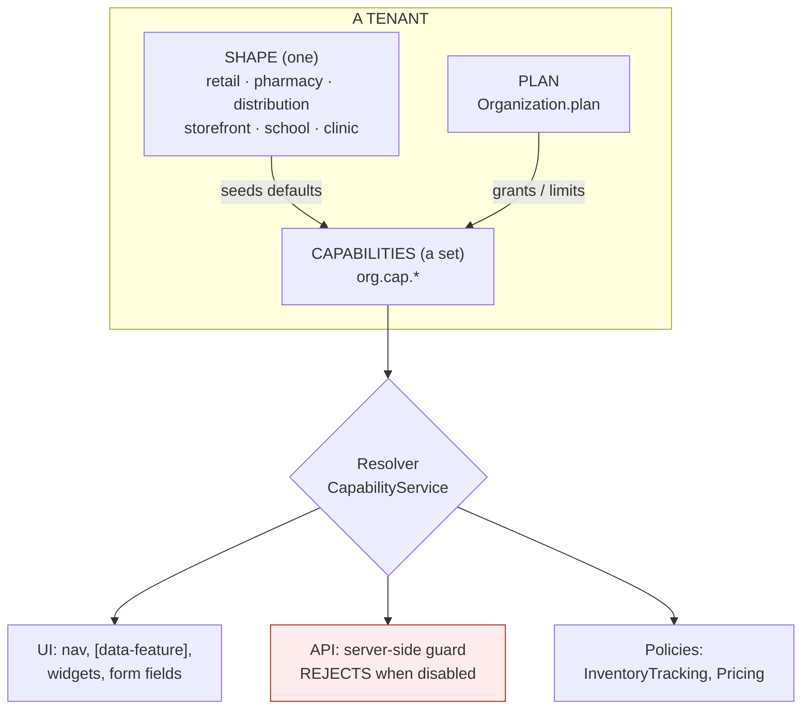

# Onboarding any business, part 2 — capabilities, entitlements and the assembled dashboard

**Status:** REVIEW + DESIGN — no code written. Awaiting consent per review → consent → design → implement → gate.
**Raised:** 2026‑08‑27, from the question *"Shahzad Mobile Shop, Farooq Veterinary & Medicos, Shafiq Medicine
Company and Zubair Traders all share one `businessDashboard.html` — how do we accommodate any business without
re‑architecting?"*
**Builds on:** [`vertical-profile-any-business-design.md`](vertical-profile-any-business-design.md) — which
already answers half of this and is **not superseded**. Read it first.
**Companion standards:** [`SAAS-BUILD-STANDARDS.md`](SAAS-BUILD-STANDARDS.md) ·
[`ARCHITECTURE-MULTITENANCY.md`](ARCHITECTURE-MULTITENANCY.md)

---

## 1. Verdict

**The proposed direction is right, and most of it is already half-built.** The correct move is not a new
architecture — it is to change the *source* of decisions the platform already makes, from hardcoded maps to
tenant data, and to add the one thing genuinely missing: **server-side enforcement**.

Three corrections to the proposal, argued in §4:

1. It **understates what exists** — `[data-feature]`, `POS_PRESETS`, `common-settings` and `sec:authorize` are
   all working today. The job is smaller than it looks, and therefore safer.
2. Its `OrganizationCapability` table **duplicates `org_setting`**, which already does per-tenant configuration
   with catalog defaults, a rendering screen and a bounded cache.
3. It puts **`data_endpoint` in a database table**. An endpoint URL in a row is not refactorable, not
   type-checked, and not greppable.

And one thing the proposal is entirely right about, which matters more than the rest:

> **UI hiding is not security.** Today it is *all* we have.

---

## 2. Verified state — read, not assumed (2026‑08‑27)

### 2a. What already exists

| Mechanism | Where | State |
|---|---|---|
| Per-tenant configuration store | `common-settings` → `org_setting` | ✅ catalog defaults + overrides, own Configuration screen, bounded Caffeine cache (PERF‑C1) |
| Show/hide by feature | `module-theme.js:115` — `el.style.display = features[f] ? '' : 'none'` on `[data-feature]` | ✅ **the mechanism exists**; its *source* is a hardcoded `VERTICALS` map |
| Preset × per-field override | `POS_PRESETS` + `posFieldsFor(preset, byKey, chosen)` | ✅ **shipped and gated** — driven by the tenant setting `pos.entry.preset` |
| Permission gating | `sec:authorize` — **28** on `businessDashboard.html` | ✅ the authorization axis works |
| Tenant entitlement | `Organization.plan` / `trial_ends_at` / `entry_cap`, carried in the JWT | ✅ a plan axis already exists |
| Two-axis model (shape × capability) | `vertical-profile-any-business-design.md` §3c | ✅ documented, and sharper than the proposal |

**`POS_PRESETS` is the proof of concept for this entire document.** It is a working, tenant-configurable,
preset-plus-override capability resolver — with an explicit rule that *a tenant's own saved switch beats the
preset*, so choosing a profile never destroys a deliberate decision. That rule is the hard part, and it is
already designed, shipped and gated.

### 2b. What does not exist

| Missing | Consequence today |
|---|---|
| `org.profile.*` settings | The vertical-profile design remains proposal only |
| **Server-side capability enforcement** | A hidden menu is the only control; the API answers anyone |
| Widget registry | `businessDashboard.html` is **3,536 lines / 31 `.formDiv` sections**, all shipped to every tenant |
| `ModuleRouter` keyed on shape | Still `Map.of` with **7** entries; an unknown type silently bounces every login to `/` |

---

## 3. Where I agree with the proposal

Recorded briefly, because agreement needs less argument than correction.

* **One codebase, no fork per client.** Non-negotiable.
* **Organization name must never be a product-rule switch.** `if (organizationId == 24)` is the failure mode
  this whole document exists to prevent.
* **Capabilities, not vertical names.** *Pharmacy* is not a mode; it is `batch + expiry + FEFO + Rx + loose`.
* **One product master with optional policies**, never `PharmacyProduct` / `MobileProduct`.
* **Server-side enforcement is mandatory.** Frontend hiding alone is not security.
* **Feature flags split by purpose** — release flags are temporary, entitlements are durable.
* **A feature-intake document before work begins.**

---

## 4. Where I would correct it

### 4a. Capabilities belong in `org_setting`, not a new table

The proposal defines `OrganizationCapability(organization_id, capability_code, enabled, source, …)`. That is
`org_setting` with different column names: per-tenant, keyed, defaulted from a catalog, already scoped, already
cached, already rendered on a screen the owner can use.

A second per-tenant configuration table means two places to look, two caches, two audit stories, and two
answers the day they disagree — which is the DRY rule this codebase already enforces elsewhere.

**Proposed instead:** capabilities *are* settings, under a reserved namespace.

```
org.cap.batchTracking      = true
org.cap.serialTracking     = false
org.cap.fieldSales         = true
```

`SettingEntry.bool` already carries label, help text, group and default. The Configuration screen renders them
with no new UI. `SettingsService` already answers `getBool` in nanoseconds from a bounded, tenant-keyed cache.

**What the proposal's `source` column is genuinely for** — distinguishing *the plan granted this*, *the profile
implied it*, and *an admin overrode it* — is worth keeping, and `org_setting` cannot express it today. That is
the one honest gap, and §6 proposes the minimum addition rather than a parallel table.

### 4b. The two axes must not be flattened into one capability list

The proposal's list puts `CORE_PRODUCTS` beside `IMEI_TRACKING`. Those are different kinds of thing:

| | Question | Granularity | Cost to add |
|---|---|---|---|
| **Bounded context** — `trade`, `scheduling`, `clinical`, `hr` | *Is this tenant in this business at all?* | tenant | a service/slice |
| **Behaviour policy** — batch, serial, loose, FEFO | *How does this tenant's inventory behave?* | tenant **and often product** | a setting + a policy object |

Conflating them produces the two failures the existing doc names: a fork per business type, or a monolith per
product. **`org.cap.*` is for the second kind.** The first kind is already answered by which services a tenant
is routed to, and by `Organization.plan`.

> **The sharpest test:** a mobile shop and a furniture showroom differ on words alone. A hospital differs on
> capability. No amount of relabelling a POS produces a hospital.

### 4c. Serial/batch policy is per PRODUCT, not only per tenant

The proposal's table implies `SERIAL_TRACKING` is a tenant switch. It cannot be only that:

* Shahzad Mobile Shop sells **handsets** (IMEI-tracked) *and* **cases and chargers** (not tracked).
* Zubair Traders has pesticides that need batch/expiry *and* tools that do not.

The proposal's own `ProductSerialPolicy` / `ProductComplianceProfile` get this right — but the capability table
then contradicts it. **The resolution is two-level, and it is the rule `posFieldsFor` already implements:**

```
tenant capability  =  may this tenant use serial tracking at all?   (org.cap.serialTracking)
product policy     =  does THIS product require it?                 (product.serialPolicy)
enforcement        =  capability AND product policy
```

A tenant without the capability cannot set the product policy. A tenant with it sets it per product.

### 4d. `data_endpoint` must not live in a database row

The proposal's `DashboardWidgetDefinition` carries `data_endpoint`. A URL in a table cannot be refactored by an
IDE, cannot be found by `grep`, is not type-checked, and silently 404s when the controller moves.

**Proposed instead:** the widget *code* is the contract. Endpoints stay in code, in a registry keyed by code —
the same shape `ImportSpecRegistry` already uses, whose javadoc names the exact failure this avoids
(*"a capability the UI cannot reach"*). What the database holds per tenant is only: enabled, position, size.

### 4e. Labels-as-tenant-data must not regress i18n

The proposal says *"terminology as data"*. The existing doc already identifies this as **the hard blocker**:
wording lives in **6 bundles × 2,066 keys**, and this session closed 17 gaps in them.

A per-tenant label override is right, but the layering must be explicit, or a tenant override will mask a
missing translation and the i18n gate will stop catching it:

```
1. i18n bundle          the language          ← must stay complete; the gate asserts this
2. tenant label override the terminology      ← "Item" → "Handset", per tenant
3. never the reverse — an override is NOT a substitute for a translation
```

---

## 5. Design

### 5a. The model



The red box is the half that does not exist today, and the half that makes the rest true.

### 5b. Resolution order — copied from `posFieldsFor`, because it is already proven

```
1. platform default        every capability starts in a known state
2. shape preset            what this KIND of business normally uses
3. plan entitlement        what the tenant has paid for  (may only RESTRICT)
4. tenant override         what this tenant explicitly chose  ← WINS
```

Step 4 winning is what makes a profile safe to offer at all. Without it, choosing "Pharmacy" would silently
destroy a deliberate choice, and the only safe advice would be *"never change the profile"* — which is not a
setting, it is a trap. `pos.entry.preset` already ships exactly this rule, including the subtlety that **a value
merely equal to the default is not a choice** — only an explicitly saved override counts.

### 5c. Server-side enforcement — the non-negotiable half

```java
// UI
<div data-capability="serialTracking"> … </div>

// API — the part that makes it real
@RequiresCapability("serialTracking")
public GenericResponse recordImei(...) { … }
```

Enforcement must sit where the existing tenant guard sits, so a disabled capability is refused with the same
shape as a cross-tenant read: **absent, not explained.** A capability check that leaks *"you don't have IMEI
tracking"* to another tenant's probe is an information disclosure.

### 5d. The dashboard becomes a shell

`businessDashboard.html` is 3,536 lines and 31 sections. It does not need rewriting — each `.formDiv` is
**already** a section boundary, and 28 already carry `sec:authorize`. The change is additive:

```html
<div id="SellDiv"     class="formDiv" sec:authorize="..." data-capability="pos">
<div id="BatchDiv"    class="formDiv" sec:authorize="..." data-capability="batchTracking">
<div id="TerritoryDiv" class="formDiv" sec:authorize="..." data-capability="fieldSales">
```

One attribute per section, resolved by the mechanism `module-theme.js` **already implements** for
`[data-feature]`. No section moves; no JavaScript is rewritten.

---

## 6. Migration that cannot break the current implementation

This is the user's explicit constraint, and it drives every choice below.

### 6a. The default is what is on screen today

> **Every capability defaults to ENABLED for every existing tenant.**

Day one after the first slice, every tenant sees exactly what they see now, because every capability resolves
true. Nothing is hidden until an owner turns it off or a shape preset is applied deliberately. **The first slice
changes the SOURCE of a decision, never the decision.**

That is the same discipline the `updated → dated` fix used this week: the change was made at the moment zero
rows would move, and identical output *was* the verification.

### 6b. Fail OPEN for visibility, fail CLOSED for money

| Capability governs | Unknown/missing resolves to | Why |
|---|---|---|
| A screen, a menu, a widget, a field | **ON** | A tenant losing a screen they used yesterday is a support call and a lost sale |
| A write that touches stock, ledger or tax | **OFF** | Silent posting through a capability nobody granted is worse than a refusal |

### 6c. Order of work — each slice independently valuable and reversible

| # | Slice | Why first | Breaks nothing because |
|---|---|---|---|
| **C1** | `CapabilityService` + `org.cap.*` catalog + **server guard**, all defaulting ON | The enforcement gap is the only *security* item here | Everything resolves ON; behaviour is identical |
| **C2** | `ModuleRouter` keys on shape; default becomes the commerce dashboard, not `/` | Fixes a **live silent bounce** — `Organization.type` is free text with no allow-list | A fixed fallback to a dashboard that exists beats a landing page |
| **C3** | `[data-capability]` on the 31 sections | Makes C1 visible with no new UI | Attribute-only; absent attribute = always shown |
| **C4** | Shape presets seed capability defaults | Onboarding becomes one question | Presets only seed; tenant overrides already win |
| **C5** | Widget registry for the dashboard grid | The largest change, and it needs C1–C4 under it | Existing tiles become widget definitions unchanged |
| **C6** | Per-product policies (batch/serial/loose) | Partly in flight already — see §7 | Extends `pack-and-loose`, does not replace it |

### 6d. Gates each slice must pass

Non-negotiable, from `ARCHITECTURE-MULTITENANCY.md` and this codebase's own history:

1. **Capability OFF → the API refuses**, not merely the menu hides. *(UI-only is the defect being fixed.)*
2. **Capability ON → identical behaviour to today.** A positive control, or "it is hidden" passes vacuously.
3. **Tenant A's capabilities never resolve for tenant B.**
4. **Default-ON verified against a real tenant**, not asserted.
5. **The trial balance is unchanged** wherever a capability touches money.

---

## 7. Work already in flight that this must not disturb

| In flight | Relationship |
|---|---|
| `pack-and-loose-selling-design.md` (U0/U2/U4 — `soldUnit`, `packSizeSnapshot` on `SagaLine`) | **This is C6 already starting.** It is the per-product policy model, built correctly. C6 should extend it, not redesign it. |
| Installments (INST‑1/2/3a/5a) | Already a capability in all but name — `pos.installment.enabled` gates it today. A ready-made first citizen of `org.cap.*`. |
| O7 distribution (D1–D6a) | `fieldSales` / `journeyPlanning` capabilities describe work that already exists and is gated only by role. |

**None of these needs to pause.** This design formalises the pattern they are already following.

---

## 8. What the four clients become

No code branches on any of these names.

| | Shape | Capabilities beyond core |
|---|---|---|
| **Shahzad Mobile Shop** | `retail` | `serialTracking` (IMEI), `warranty`, `installments` |
| **Farooq Veterinary & Medicos** | `pharmacy` | `batchTracking`, `expiryTracking`, `fefo`, `looseSelling`, `rxRequired` *(configurable — veterinary stock often is not Rx)* |
| **Shafiq Medicine Company** | `distribution` | `batchTracking`, `expiry`, `fefo`, `fieldSales`, `journeyPlanning`, `collections`, `dealerPricing` |
| **Zubair Traders** | `distribution` | `batchTracking`, `expiry`, `fieldSales`, `dealerPricing` — Rx **off**, loose **per product** |

Shafiq and Zubair share a shape and differ by capability. That is the model working.

---

## 9. Open questions — for decision before C1

1. **Is `plan` allowed to restrict capabilities today, or is it billing-only for now?** §5b step 3 assumes it may
   only *restrict*, never grant. Confirm.
2. **Who may toggle a capability** — owner only, or admin too? Compare `pos.entry.preset`, which is owner-gated.
3. **`source` tracking (plan vs profile vs override):** worth the extra column on `org_setting`, or is
   "explicitly saved by this tenant" (which the settings layer already distinguishes via `isDefault`) enough for
   the first cut?
4. **Shape list.** The existing doc proposes `retail · pharmacy · storefront · school · clinic · rental ·
   services`. Distribution is not on it and all four named clients need it. Add `distribution`?
5. **Does any capability need to be per-STORE**, not only per-tenant? Multi-location already exists; a
   distributor with a retail counter and a warehouse may want different answers.

---

## 10. Recommendation

Approve **C1 and C2** as the first slice. Together they are small, independently valuable, and close the only
two items on this list that are defects rather than improvements:

* **C1** closes the security gap — capabilities enforced on the server, not merely hidden.
* **C2** closes a live silent failure — a tenant whose `type` the router has never heard of is bounced to the
  landing page on every login, and `Organization.type` accepts any string.

Everything after that is improvement rather than repair, and can be scheduled by value.
