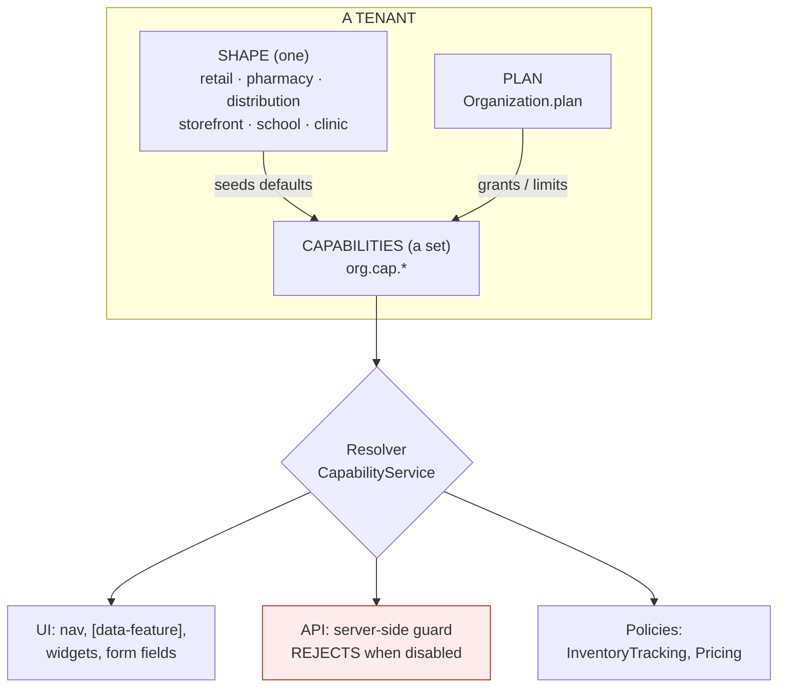
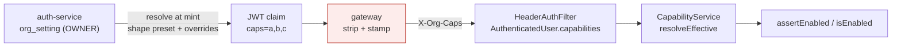

# Onboarding any business, part 2 — capabilities, entitlements and the assembled dashboard

**Status:** REVIEW + DESIGN — no code written. Awaiting consent per review → consent → design → implement → gate.
**Raised:** 2026‑08‑27, from the question *"Shahzad Mobile Shop, Farooq Veterinary & Medicos, Shafiq Medicine
Company and Zubair Traders all share one `businessDashboard.html` — how do we accommodate any business without
re‑architecting?"*
**Builds on:** [`vertical-profile-any-business-design.md`](vertical-profile-any-business-design.md) — which
already answers half of this and is **not superseded**. Read it first.
**Companion standards:** [`SAAS-BUILD-STANDARDS.md`](SAAS-BUILD-STANDARDS.md) ·
[`ARCHITECTURE-MULTITENANCY.md`](ARCHITECTURE-MULTITENANCY.md)

---

## 1. Verdict

**The proposed direction is right, and most of it is already half-built.** The correct move is not a new
architecture — it is to change the *source* of decisions the platform already makes, from hardcoded maps to
tenant data, and to add the one thing genuinely missing: **server-side enforcement**.

Three corrections to the proposal, argued in §4:

1. It **understates what exists** — `[data-feature]`, `POS_PRESETS`, `common-settings` and `sec:authorize` are
   all working today. The job is smaller than it looks, and therefore safer.
2. Its `OrganizationCapability` table **duplicates `org_setting`**, which already does per-tenant configuration
   with catalog defaults, a rendering screen and a bounded cache.
3. It puts **`data_endpoint` in a database table**. An endpoint URL in a row is not refactorable, not
   type-checked, and not greppable.

And one thing the proposal is entirely right about, which matters more than the rest:

> **UI hiding is not security.** Today it is *all* we have.

---

## 2. Verified state — read, not assumed (2026‑08‑27)

### 2a. What already exists

| Mechanism | Where | State |
|---|---|---|
| Per-tenant configuration store | `common-settings` → `org_setting` | ✅ catalog defaults + overrides, own Configuration screen, bounded Caffeine cache (PERF‑C1) |
| Show/hide by feature | `module-theme.js:115` — `el.style.display = features[f] ? '' : 'none'` on `[data-feature]` | ✅ **the mechanism exists**; its *source* is a hardcoded `VERTICALS` map |
| Preset × per-field override | `POS_PRESETS` + `posFieldsFor(preset, byKey, chosen)` | ✅ **shipped and gated** — driven by the tenant setting `pos.entry.preset` |
| Permission gating | `sec:authorize` — **28** on `businessDashboard.html` | ✅ the authorization axis works |
| Tenant entitlement | `Organization.plan` / `trial_ends_at` / `entry_cap`, carried in the JWT | ✅ a plan axis already exists |
| Two-axis model (shape × capability) | `vertical-profile-any-business-design.md` §3c | ✅ documented, and sharper than the proposal |

**`POS_PRESETS` is the proof of concept for this entire document.** It is a working, tenant-configurable,
preset-plus-override capability resolver — with an explicit rule that *a tenant's own saved switch beats the
preset*, so choosing a profile never destroys a deliberate decision. That rule is the hard part, and it is
already designed, shipped and gated.

### 2b. What does not exist

| Missing | Consequence today |
|---|---|
| `org.profile.*` settings | The vertical-profile design remains proposal only |
| **Server-side capability enforcement** | A hidden menu is the only control; the API answers anyone |
| Widget registry | `businessDashboard.html` is **3,536 lines / 31 `.formDiv` sections**, all shipped to every tenant |
| `ModuleRouter` keyed on shape | Still `Map.of` with **7** entries; an unknown type silently bounces every login to `/` |

---

## 3. Where I agree with the proposal

Recorded briefly, because agreement needs less argument than correction.

* **One codebase, no fork per client.** Non-negotiable.
* **Organization name must never be a product-rule switch.** `if (organizationId == 24)` is the failure mode
  this whole document exists to prevent.
* **Capabilities, not vertical names.** *Pharmacy* is not a mode; it is `batch + expiry + FEFO + Rx + loose`.
* **One product master with optional policies**, never `PharmacyProduct` / `MobileProduct`.
* **Server-side enforcement is mandatory.** Frontend hiding alone is not security.
* **Feature flags split by purpose** — release flags are temporary, entitlements are durable.
* **A feature-intake document before work begins.**

---

## 4. Where I would correct it

### 4a. Capabilities belong in `org_setting`, not a new table

The proposal defines `OrganizationCapability(organization_id, capability_code, enabled, source, …)`. That is
`org_setting` with different column names: per-tenant, keyed, defaulted from a catalog, already scoped, already
cached, already rendered on a screen the owner can use.

A second per-tenant configuration table means two places to look, two caches, two audit stories, and two
answers the day they disagree — which is the DRY rule this codebase already enforces elsewhere.

**Proposed instead:** capabilities *are* settings, under a reserved namespace.

```
org.cap.batchTracking      = true
org.cap.serialTracking     = false
org.cap.fieldSales         = true
```

`SettingEntry.bool` already carries label, help text, group and default. The Configuration screen renders them
with no new UI. `SettingsService` already answers `getBool` in nanoseconds from a bounded, tenant-keyed cache.

**What the proposal's `source` column is genuinely for** — distinguishing *the plan granted this*, *the profile
implied it*, and *an admin overrode it* — is worth keeping, and `org_setting` cannot express it today. That is
the one honest gap, and §6 proposes the minimum addition rather than a parallel table.

### 4b. The two axes must not be flattened into one capability list

The proposal's list puts `CORE_PRODUCTS` beside `IMEI_TRACKING`. Those are different kinds of thing:

| | Question | Granularity | Cost to add |
|---|---|---|---|
| **Bounded context** — `trade`, `scheduling`, `clinical`, `hr` | *Is this tenant in this business at all?* | tenant | a service/slice |
| **Behaviour policy** — batch, serial, loose, FEFO | *How does this tenant's inventory behave?* | tenant **and often product** | a setting + a policy object |

Conflating them produces the two failures the existing doc names: a fork per business type, or a monolith per
product. **`org.cap.*` is for the second kind.** The first kind is already answered by which services a tenant
is routed to, and by `Organization.plan`.

> **The sharpest test:** a mobile shop and a furniture showroom differ on words alone. A hospital differs on
> capability. No amount of relabelling a POS produces a hospital.

### 4c. Serial/batch policy is per PRODUCT, not only per tenant

The proposal's table implies `SERIAL_TRACKING` is a tenant switch. It cannot be only that:

* Shahzad Mobile Shop sells **handsets** (IMEI-tracked) *and* **cases and chargers** (not tracked).
* Zubair Traders has pesticides that need batch/expiry *and* tools that do not.

The proposal's own `ProductSerialPolicy` / `ProductComplianceProfile` get this right — but the capability table
then contradicts it. **The resolution is two-level, and it is the rule `posFieldsFor` already implements:**

```
tenant capability  =  may this tenant use serial tracking at all?   (org.cap.serialTracking)
product policy     =  does THIS product require it?                 (product.serialPolicy)
enforcement        =  capability AND product policy
```

A tenant without the capability cannot set the product policy. A tenant with it sets it per product.

### 4d. `data_endpoint` must not live in a database row

The proposal's `DashboardWidgetDefinition` carries `data_endpoint`. A URL in a table cannot be refactored by an
IDE, cannot be found by `grep`, is not type-checked, and silently 404s when the controller moves.

**Proposed instead:** the widget *code* is the contract. Endpoints stay in code, in a registry keyed by code —
the same shape `ImportSpecRegistry` already uses, whose javadoc names the exact failure this avoids
(*"a capability the UI cannot reach"*). What the database holds per tenant is only: enabled, position, size.

### 4e. Labels-as-tenant-data must not regress i18n

The proposal says *"terminology as data"*. The existing doc already identifies this as **the hard blocker**:
wording lives in **6 bundles × 2,066 keys**, and this session closed 17 gaps in them.

A per-tenant label override is right, but the layering must be explicit, or a tenant override will mask a
missing translation and the i18n gate will stop catching it:

```
1. i18n bundle          the language          ← must stay complete; the gate asserts this
2. tenant label override the terminology      ← "Item" → "Handset", per tenant
3. never the reverse — an override is NOT a substitute for a translation
```

---

## 5. Design

### 5a. The model



The red box is the half that does not exist today, and the half that makes the rest true.

### 5b. Resolution order — copied from `posFieldsFor`, because it is already proven

```
1. platform default        every capability starts in a known state
2. shape preset            what this KIND of business normally uses
3. plan entitlement        what the tenant has paid for  (may only RESTRICT)
4. tenant override         what this tenant explicitly chose  ← WINS
```

Step 4 winning is what makes a profile safe to offer at all. Without it, choosing "Pharmacy" would silently
destroy a deliberate choice, and the only safe advice would be *"never change the profile"* — which is not a
setting, it is a trap. `pos.entry.preset` already ships exactly this rule, including the subtlety that **a value
merely equal to the default is not a choice** — only an explicitly saved override counts.

### 5c. Server-side enforcement — the non-negotiable half

```java
// UI
<div data-capability="serialTracking"> … </div>

// API — the part that makes it real
@RequiresCapability("serialTracking")
public GenericResponse recordImei(...) { … }
```

Enforcement must sit where the existing tenant guard sits, so a disabled capability is refused with the same
shape as a cross-tenant read: **absent, not explained.** A capability check that leaks *"you don't have IMEI
tracking"* to another tenant's probe is an information disclosure.

### 5d. The dashboard becomes a shell

`businessDashboard.html` is 3,536 lines and 31 sections. It does not need rewriting — each `.formDiv` is
**already** a section boundary, and 28 already carry `sec:authorize`. The change is additive:

```html
<div id="SellDiv"     class="formDiv" sec:authorize="..." data-capability="pos">
<div id="BatchDiv"    class="formDiv" sec:authorize="..." data-capability="batchTracking">
<div id="TerritoryDiv" class="formDiv" sec:authorize="..." data-capability="fieldSales">
```

One attribute per section, resolved by the mechanism `module-theme.js` **already implements** for
`[data-feature]`. No section moves; no JavaScript is rewritten.

---

## 6. Migration that cannot break the current implementation

This is the user's explicit constraint, and it drives every choice below.

### 6a. The default is what is on screen today

> **Every capability defaults to ENABLED for every existing tenant.**

Day one after the first slice, every tenant sees exactly what they see now, because every capability resolves
true. Nothing is hidden until an owner turns it off or a shape preset is applied deliberately. **The first slice
changes the SOURCE of a decision, never the decision.**

That is the same discipline the `updated → dated` fix used this week: the change was made at the moment zero
rows would move, and identical output *was* the verification.

### 6b. Fail OPEN for visibility, fail CLOSED for money

| Capability governs | Unknown/missing resolves to | Why |
|---|---|---|
| A screen, a menu, a widget, a field | **ON** | A tenant losing a screen they used yesterday is a support call and a lost sale |
| A write that touches stock, ledger or tax | **OFF** | Silent posting through a capability nobody granted is worse than a refusal |

### 6c. Order of work — each slice independently valuable and reversible

| # | Slice | Why first | Breaks nothing because |
|---|---|---|---|
| **C1** | `CapabilityService` + `org.cap.*` catalog + **server guard**, all defaulting ON | The enforcement gap is the only *security* item here | Everything resolves ON; behaviour is identical |
| **C2** | `ModuleRouter` keys on shape; default becomes the commerce dashboard, not `/` | Fixes a **live silent bounce** — `Organization.type` is free text with no allow-list | A fixed fallback to a dashboard that exists beats a landing page |
| **C3** | `[data-capability]` on the 31 sections | Makes C1 visible with no new UI | Attribute-only; absent attribute = always shown |
| **C4** | Shape presets seed capability defaults | Onboarding becomes one question | Presets only seed; tenant overrides already win |
| **C5** | Widget registry for the dashboard grid | The largest change, and it needs C1–C4 under it | Existing tiles become widget definitions unchanged |
| **C6** | Per-product policies (batch/serial/loose) | Partly in flight already — see §7 | Extends `pack-and-loose`, does not replace it |

### 6d. Gates each slice must pass

Non-negotiable, from `ARCHITECTURE-MULTITENANCY.md` and this codebase's own history:

1. **Capability OFF → the API refuses**, not merely the menu hides. *(UI-only is the defect being fixed.)*
2. **Capability ON → identical behaviour to today.** A positive control, or "it is hidden" passes vacuously.
3. **Tenant A's capabilities never resolve for tenant B.**
4. **Default-ON verified against a real tenant**, not asserted.
5. **The trial balance is unchanged** wherever a capability touches money.

---

## 7. Work already in flight that this must not disturb

| In flight | Relationship |
|---|---|
| `pack-and-loose-selling-design.md` (U0/U2/U4 — `soldUnit`, `packSizeSnapshot` on `SagaLine`) | **This is C6 already starting.** It is the per-product policy model, built correctly. C6 should extend it, not redesign it. |
| Installments (INST‑1/2/3a/5a) | Already a capability in all but name — `pos.installment.enabled` gates it today. A ready-made first citizen of `org.cap.*`. |
| O7 distribution (D1–D6a) | `fieldSales` / `journeyPlanning` capabilities describe work that already exists and is gated only by role. |

**None of these needs to pause.** This design formalises the pattern they are already following.

---

## 8. What the four clients become

No code branches on any of these names.

| | Shape | Capabilities beyond core |
|---|---|---|
| **Shahzad Mobile Shop** | `retail` | `serialTracking` (IMEI), `warranty`, `installments` |
| **Farooq Veterinary & Medicos** | `pharmacy` | `batchTracking`, `expiryTracking`, `fefo`, `looseSelling`, `rxRequired` *(configurable — veterinary stock often is not Rx)* |
| **Shafiq Medicine Company** | `distribution` | `batchTracking`, `expiry`, `fefo`, `fieldSales`, `journeyPlanning`, `collections`, `dealerPricing` |
| **Zubair Traders** | `distribution` | `batchTracking`, `expiry`, `fieldSales`, `dealerPricing` — Rx **off**, loose **per product** |

Shafiq and Zubair share a shape and differ by capability. That is the model working.

---

## 9. Open questions — for decision before C1

1. **Is `plan` allowed to restrict capabilities today, or is it billing-only for now?** §5b step 3 assumes it may
   only *restrict*, never grant. Confirm.
2. **Who may toggle a capability** — owner only, or admin too? Compare `pos.entry.preset`, which is owner-gated.
3. **`source` tracking (plan vs profile vs override):** worth the extra column on `org_setting`, or is
   "explicitly saved by this tenant" (which the settings layer already distinguishes via `isDefault`) enough for
   the first cut?
4. **Shape list.** The existing doc proposes `retail · pharmacy · storefront · school · clinic · rental ·
   services`. Distribution is not on it and all four named clients need it. Add `distribution`?
5. **Does any capability need to be per-STORE**, not only per-tenant? Multi-location already exists; a
   distributor with a retail counter and a warehouse may want different answers.

---

## 10. Recommendation

Approve **C1 and C2** as the first slice. Together they are small, independently valuable, and close the only
two items on this list that are defects rather than improvements:

* **C1** closes the security gap — capabilities enforced on the server, not merely hidden.
* **C2** closes a live silent failure — a tenant whose `type` the router has never heard of is bounced to the
  landing page on every login, and `Organization.type` accepts any string.

Everything after that is improvement rather than repair, and can be scheduled by value.

---

## 11. Delivery log

### C1 — shipped, and then found to be **inert** (corrected in C3)

`Capability`, `CapabilityService`, `CapabilityCatalog` and their unit tests all landed and all passed. They
were also **unreachable**: no controller served `enabledMap()`, no call site called `assertEnabled`, and
because `common-settings` is deliberately `@Import`-wired rather than component-scanned, the `@Service`
annotation on `CapabilityService` registered **nothing**. It was a correct, tested library that no request
could touch — the "shipped unreachable" failure `CapabilityCatalog`'s own javadoc warns about, one level up.

A passing unit test proves the class works. It does not prove the class is *wired*, and nothing in C1
asserted that it was. This is the same shape as PERF-4 (implemented, never gated) and the signup password
meter (shipped, never once executed).

### C3 — shipped

| Piece | File |
|---|---|
| `GET /capabilities` — the map for the caller's tenant | `common-settings/CapabilityController.java` |
| Registration of both C1 beans | `CommonSettingsAutoConfiguration.java` (`@Import` extended) |
| Monolith proxy `GET /getCapabilities` | `web/controller/business/BusinessConfigController.java` |
| The rendering shell | `static/js/common/capabilities.js` |
| `.cap-off { display:none !important }` | `static/css/application.css` |
| 19 `data-capability` attributes (9 nav entries + 10 sections) | `templates/businessDashboard.html` |
| **Server refusal** on the installment write | `SellController.java` (pre-write, before `addSell`) |
| Gate | `cypress/e2e/business/capability-gating.cy.js` |

**`!important` is load-bearing.** `module-theme.js` walks `[data-vertical-only]` and writes
`el.style.display = ''` on whatever its client-side vertical allows. An inline hide from `capabilities.js`
would be silently undone on any element carrying both attributes — visible, no error, in exactly the case
where the two mechanisms disagree. A class beats an inline style only with `!important`, so this is what
makes the server's answer the one that survives.

**Tagging is inert on deploy.** Every capability defaults ON, so a `data-capability` attribute makes a
section *hideable*; it hides nothing until an owner switches the capability off.

### Defect found while wiring C3 — `pos.installment.enabled` refuses too late

Pre-existing, not introduced here. `SellController.createInstallmentPlan` checks the flag like this:

```java
if (!settingsService.getBool("pos.installment.enabled")) {
    return "Installment plan NOT created: selling on installment is switched off for this shop.";
}
```

That check runs **after** `SagaSellService` has committed the invoice in its own `REQUIRES_NEW` transaction.
So for a tenant with installments switched off whose client posts a plan block:

* the sale is committed,
* the plan is silently not created,
* **the customer owes the full amount immediately, with no schedule against it.**

The code acknowledges this itself — *"the plan-creation guard further down still exists as a backstop, but by
the time it runs the invoice is committed and the only honest thing left is to report the split."* A refusal
that arrives after the money moves is not a refusal.

C3's `assertEnabled(INSTALLMENTS)` sits **before** the sale is written, which is where this class of check
belongs. It does not change the old flag's behaviour, deliberately — see the open question below.

### Open — two switches for one feature

`pos.installment.enabled` and `org.cap.installments` now both describe whether a tenant sells on terms. That
is the "two places to look, two answers the day they disagree" problem §4a argues against, and it should
converge on the capability.

It is **not** converged here because doing so changes behaviour for tenants that have the old flag off: they
currently get a committed sale with a dropped plan, and would instead get a refused sale. That is a fix, but
it is a change, and the standing constraint on this work is that nothing currently working may break without
being asked for. **Proposed as its own slice, with its own gate.**

### C3 correction — the catalog bean was missed on the first pass

The first C3 build registered `CapabilityService` and `CapabilityController` but **not `CapabilityCatalog`**.
Same root cause as C1's, one bean further on: the module is not component-scanned, so `@Component` registered
nothing.

Consequence: the capability keys were absent from the settings catalog, so `SettingsService.set` refused every
one of them — `Unknown setting: org.cap.installments`. **No owner could switch a capability off at all**, which
is most of the feature.

What makes this worth writing down is that **the read path hid it completely**. `isEnabledFor` catches the
lookup failure and fails OPEN, so `/capabilities` returned every capability as `true` and the dashboard
rendered exactly right. The gate's "everything defaults ON" assertion passed too — and would pass with no
catalog registered at all, because through that endpoint *absent* and *defaulted to true* are the same answer.

Only a WRITE revealed it, and only because `cy.setCapability` asserts its response instead of assuming a 200
meant success.

The gate now asserts the capability keys are genuinely present in the settings catalog, rather than inferring
it from a value a failure would have produced anyway. **Fail-open is right for rendering and wrong for a test:
anything that degrades silently needs an assertion aimed at the degradation, not at the happy value.**

### C3 — ✅ GREEN

`cypress/e2e/business/capability-gating.cy.js`, headed, confirmed by the user. Six cases:

1. every capability is a real entry in the settings catalog (not a fail-open default);
2. the map defaults every capability ON for an unconfigured tenant;
3. **ON** — the section is not hidden AND a sale on terms really creates a plan (`PLN-`);
4. **OFF** — the section and its nav entry are hidden, asserted on visibility, not on the class alone;
5. **OFF** — the API REFUSES the sale, with `FAILED` specifically, and without naming the tenant's config;
6. restoring the capability brings both the section and the plan back.

**Two vacuous assertions were found and removed while getting here**, both of which would have passed against
a broken build:

* *"everything defaults ON"* passes identically when the catalog is **not registered at all**, because the read
  path fails open — which is exactly the bug it was sitting next to. Replaced by asserting the keys are really
  in the catalog.
* *"the sale succeeds"* passes when installments are switched **off**, because a sale with a dropped plan still
  returns SUCCESS and only a message says otherwise. Replaced by asserting the plan exists.

The second is worth remembering: **the positive control was passing through the very defect the slice
documents.** A test that asserts the happy status rather than the happy *outcome* will do that every time.

---

## 12. C4 — shape presets (implemented, awaiting gate)

### The model, as built

```
1. explicit tenant override   what this tenant actually chose   ← WINS
2. shape preset               what this KIND of business uses
```

Step 1 winning is what makes a shape safe to offer. Without it, choosing "Pharmacy" would silently destroy a
deliberate setting and the only safe advice would be *"never change your profile"* — a trap, not a setting.

Reading the override **raw** is what makes step 1 possible: `getBoolFor` folds the catalog default in, so it
cannot tell *"the owner switched this off"* from *"the owner said nothing and the default is off"*. A new
`SettingsService.overrideFor` returns the explicit row only, off the same cached map, so it costs no query.

### Why this deploy changes nothing

`Shape.GENERAL`'s preset is **every capability**, and it is the fallback for a missing, blank or unreadable
`org.shape`. Every existing tenant has no such row, so every one resolves GENERAL and behaves exactly as it did
before C4 existed. A tenant narrows only by explicitly picking a shape, on its own Configuration screen,
reversibly.

`byCode` falls back to GENERAL rather than throwing, and deliberately to the **permissive** option: a typo or a
value from a newer build must not strip a working tenant of its screens. Guessing wrong costs a support call
either way; this direction does not stop a shop trading.

### Shapes and their presets

| Shape | Capabilities seeded ON |
|---|---|
| `general` *(default)* | **all twelve** — the migration state |
| `retail` | installments, dealerPricing |
| `pharmacy` | batch, expiry, FEFO, looseSelling, rxRequired |
| `distribution` | batch, expiry, FEFO, fieldSales, journeyPlanning, collections, dealerPricing |
| `storefront` | dealerPricing |

**"Mobile shop" is not a shape.** It is `retail` plus serial tracking, condition grading and installments —
which is the entire reason for having two axes. A shape per trade would hardcode a customer into the platform;
`if ("MOBILE".equals(type))` is `if (organizationId == 24)` one level of indirection away.

### Per-domain test tenants

Both are **userType BUSINESS with their own organizations**, differing only by shape and capabilities:

| Account | Shape used in the gate |
|---|---|
| `owner.mobile@myplus.com` (+ `admin.` / `user.`) | `retail` |
| `owner.pesticide@myplus.com` (+ `admin.` / `user.`) | `pharmacy`, with `rxRequired` overridden OFF |

Own orgs deliberately: **capability gating cannot be proven on one tenant.** A bug that hid a section for every
tenant would pass a single-tenant suite perfectly, and *"turning it off for A does not affect B"* has no meaning
without a B. Seeded behind `app.seed-test-fixtures` (dev default true, prod false) **and** the independent
`isProd()` hard block.

### Gates

* `CapabilityServiceTest` — six new cases on `mvn test`: the migration promise, preset seeding, override beats
  preset **in both directions**, unreadable shape falls back permissive, the refusal path uses the same
  resolver as the rendering path, and the shape chooser is published in the catalog.
* `cypress/e2e/business/capability-shapes.cy.js` — per-domain screens, override-beats-preset on a real tenant,
  and **cross-tenant isolation**, which is the assertion a single-tenant suite cannot make.

### A test this slice broke, and why that was right

`catalog_publishes_every_capability` asserted `entries()` had exactly `Capability.values().length` members and
looped a `defaultValue == "true"` check over all of them. Adding the shape chooser broke both — and neither
failure would have meant a capability was missing. Rewritten to look each capability up **by key**, which
asserts the property that matters (every capability has a switch an owner can reach) instead of the shape of
the list it happens to sit in.

### C4 — ✅ GREEN

`cypress/e2e/business/capability-shapes.cy.js` and `capability-gating.cy.js`, both headed, confirmed by the
user. Across two tenants (`owner.mobile@`, `owner.pesticide@`) plus `owner.marketplace@`:

* a tenant with no shape chosen still sees **everything** — the migration promise, on a real tenant;
* mobile (`retail`) keeps installments and loses pharmacy + distribution screens;
* pesticide (`pharmacy`) gains batch screens, and an explicit `rxRequired=false` **beats the preset** — and
  still beats it after the shape is re-applied;
* marketplace (`distribution`) gains field sales / journeys / collections and is denied rx + serial;
* **one tenant's shape does not reach another** — the assertion a single-tenant suite cannot make.

#### A false alarm worth recording

The first run failed on the C3 `before` hook with `login?error=true` on an account that had been green an hour
earlier. Every persistent cause was ruled out by direct inspection rather than by guessing: the accounts were
`enabled=1 / unlocked / 0 fails` with valid bcrypt hashes, seeding had completed without exception, the session
cap is `maximumSessions(-1)`, and a curl login returned 302 to `/businessDashboard`.

The cause was timing. **auth-service reports "Started" and opens its port at 13:22:34, while `SetupDataLoader`
is still re-encoding user passwords until 13:22:45.** The gate ran in that gap.

> **After restarting auth-service, "healthy" is not the same as "seeded".** A container health check that
> passes while fixtures are still being written will fail a suite for reasons that have nothing to do with the
> code under test.

---

## 13. Where enforcement actually stands

**Be precise about this, because "the menu is gone" reads like a guarantee and is not one.**

| Layer | Status |
|---|---|
| Capability map served per tenant, shape-aware | ✅ every capability |
| UI hiding (`[data-capability]`, `.cap-off`) | ✅ 19 nav entries + sections |
| **Server refusal (`assertEnabled`)** | ⚠️ **ONE write path — the installment sale** |

The mechanism is proven end to end, but it guards a single endpoint. Every other capability — `rxRequired`,
`fieldSales`, `collections`, `batchTracking`, `dealerPricing` — is currently **hidden but not refused**. A
caller who knows the URL still reaches those endpoints, which is the original defect, merely narrowed.

Two things are needed to close it:

1. An `assertEnabled` at the entry point of each capability-touching write — **before** anything is committed,
   for the reason §11 records about refusals that arrive after the money moves.
2. **pharma-service cannot do this yet.** It has no `common-settings` dependency, so `CapabilityService` is not
   on its classpath; adding it also requires that service to supply a `SettingsStore` bean, or the
   `@ConditionalOnBean` leaves the auto-configuration inert and startup fails at injection. Prescriptions —
   the most obviously capability-gated write in the product — sit behind exactly that gap.

**Proposed as C3b**, sized per service, each with a gate of the same shape as `capability-gating.cy.js`.

---

## 14. C3b — and the architectural gap it exposed

### Guards added

| Capability | Write | Service | Effective today? |
|---|---|---|---|
| `INSTALLMENTS` | sale on terms, pre-write | business | ✅ yes (C3, green) |
| `LOOSE_SELLING` | loose sale line | business | ✅ yes |
| `COLLECTIONS` | driver settlement (posts to AR) | marketplace | ⚠️ see below |
| `RX_REQUIRED` | prescription create + dispense | pharma | ❌ **inert** — see below |

`LOOSE_SELLING` is guarded at the **caller** of `looseLine`, not inside it: that method is deliberately static
and pure so the arithmetic unit-tests on every `mvn test` (Standard D2), and reaching into a capability lookup
from there would trade that away for nothing.

pharma-service was unblocked properly rather than half-wired: `common-settings` in the pom, an `OrgSetting`
entity + repository, a `JpaSettingsStore`, and `V7__org_setting.sql`. Without the store the auto-configuration
is `@ConditionalOnBean`-inert and there is no `CapabilityService` to inject at all.

**All capability injections were changed from `required = false` to REQUIRED.** `JpaSettingsStore`'s own javadoc
records why: OMS O3 shipped a settings resolver with catalog, migration and resolver all present, no store, and
*optional* injection — so every tenant silently kept the platform default and nothing said so. **A guard that
disables itself when a bean is missing is worse than no guard, because it reads as protection.**

### ⚠️ The gap: `org_setting` is per-SERVICE, and a capability is per-TENANT

Every service owns its own `org_setting` table — correctly, by the microservice standard. But that means:

* an owner switches `rxRequired` off on the Configuration screen → written to **business-service's** table;
* pharma-service reads **its own** table → no row → catalog default → **ON**;
* **the guard never refuses.**

The monolith exposes settings proxies for business-service (`/getBusinessConfig`) and marketplace
(`OrderConfigController`) only. **There is no pharma settings screen at all**, so the switch is not merely in
the wrong table — it is unreachable. The `RX_REQUIRED` guard is therefore correct code that cannot currently
fire, which is precisely the "shipped unreachable" failure this slice has now hit three times.

`COLLECTIONS` in marketplace is the milder version: marketplace *does* have its own settings screen, so the
switch exists — but on a different screen from the business capabilities, and the two stores can disagree.

**A capability is a property of the TENANT, not of a service.** Storing it per-service means N answers to one
question, and the day they disagree there is no right one.

### Three ways to close it — needs a decision

| | Approach | For | Against |
|---|---|---|---|
| **A** | Each service keeps its own copy; add a Configuration screen per service | No new infrastructure | An owner sets the same switch in N places; they WILL drift. Rejected by §4a's own argument. |
| **B** | One authoritative store (business-service); other services read via a cached client | One answer; one screen | A cross-service call, and pharma/inventory would depend on business-service — a dependency inversion |
| **C** | Capabilities travel in the **JWT**, like `activeOrgId` today | Zero remote calls on any hot path; one answer everywhere; the pattern already exists in this codebase | Stale until re-login; enlarges the token |

**Recommendation: C**, with B's endpoint kept for the Configuration screen itself. The `activeOrgId` →
`X-Org-Id` → `AuthenticatedUser.organizationId` path already proves the mechanism here, capabilities change
rarely (an owner's deliberate act, not a hot setting), and it is the only option that puts no call on a sale
path — the standing performance rule, and the reason V44 refused a remote check in the first place.

Staleness is the honest cost: a capability switched off would take effect on next login. For a switch an owner
touches during onboarding that is acceptable; if it is not, B is the fallback.

---

## 15. C3c — capabilities travel in the JWT (option C)

### The chain



The red box is the security of the whole feature: the gateway **removes any client-supplied `X-Org-Caps`
before stamping its own**, unconditionally. Capabilities decide what the server refuses, so a caller able to
send its own header could grant itself prescriptions, field collections or selling on terms by naming them.

### Why auth-service owns the store

A capability is a property of the TENANT, and auth-service already owns the tenant — `Organization` carries
type, plan, trial and entry cap, and every one of those already reaches other services as a claim. Capabilities
now take the same road: **resolved once per token mint, with no remote call on any hot path.** That constraint
is not a preference; V44 settled it when it refused a cross-service check on the sale path because it "would
fail OPEN the moment inventory-service is slow or down".

`app.capabilities.owner=true` publishes the capability catalog in auth-service **and nowhere else**. The catalog
is what `SettingsService.set` validates against, so it is also what decides which service will ACCEPT a
capability write. Setting it in a second service would put capability rows in two stores again — the exact
defect this replaced.

### Three distinctions that are load-bearing

1. **`null` ≠ empty capability set.** null = never resolved (an older token, or auth could not read its store)
   → fall back to the local store, which is pre-C3c behaviour. Empty = resolved, nothing enabled →
   authoritative. Merging them would either blank every screen for every tenant still holding a pre-C3c token
   — a self-inflicted outage on deploy day — or make an all-off tenant silently permissive.
2. **The `"-"` sentinel exists because an empty header value does not survive transport.** Without it,
   "resolved: none" is indistinguishable from "not resolved", and those mean opposite things.
3. **The claim is applied ONLY to the caller's own tenant.** It describes the org the token was minted for;
   using it to answer about a different org would let one tenant's capabilities decide another's — a
   cross-tenant leak in the component whose entire job is refusing things. Background scanners and storefront
   readers legitimately ask about an org they are not in, and fall through to the local store.

### A blocker found on the way: `CurrentUser` never worked inside auth-service

Every other service sits behind the gateway, which stamps `X-User-*` headers that `HeaderAuthFilter` turns into
an `AuthenticatedUser`. auth-service validates the Bearer token itself and sets a `UserDetails` principal, so
`CurrentUser.organizationId()` had always been null there — `OrgUserController` works around it by re-reading
`activeOrgId` from the token by hand.

That workaround does not survive auth-service sharing code with other services: the common-settings
`SettingsController` resolves the tenant through `CurrentUser`, so **every capability row would have been
written against a null organization — silently, because nothing throws on a null org.** `JwtAuthFilter` now
also publishes the identity as the request attribute `CurrentUser` reads, leaving the existing `UserDetails`
principal untouched.

### The Configuration screen stays one screen

The monolith merges two catalogs (business-service's trade settings + auth-service's capabilities) and routes
each write by key ownership — `org.cap.*` and `org.shape` to auth, everything else to business. The owner sees
one screen; the split is an implementation detail. If auth's half fails the business half still renders: a
degraded screen beats no screen.

### ⚠ Migration note

Capability rows written into **business-service's** `org_setting` before this change are now **orphaned** —
they are no longer read. In practice only the C3/C4 gates ever wrote any, so nothing real is lost, but a tenant
that had been configured there would appear reset to defaults (all ON). Worth a cleanup script if any real
tenant is found to have them.

### Build order

`common-security` and `common-settings` are libraries and must be **installed**, not packaged, or the services
link against stale jars:

```
mvn -pl common-security -am clean install -DskipTests
mvn -pl common-settings -am clean install -DskipTests
mvn -pl auth-service,api-gateway,business-service,marketplace-service,pharma-service -am clean package -DskipTests
# then the monolith
```

auth-service, pharma-service each carry a new `V7__org_setting.sql`.

### C3c deployment — three dependency failures, one root cause

auth-service and api-gateway are the only runnable services that extend the **root aggregator** rather than
`service-parent`. Everything `service-parent` declares — `common-security`, `common-service`, `caffeine`, the
OpenTelemetry starter — therefore does NOT reach them. And the shared libraries declare their own dependencies
`provided`, on the reasonable assumption that every consumer inherits them.

Pulling `common-settings` into auth-service broke that assumption three times in a row:

| Failure | Cause | Fix |
|---|---|---|
| `package com.myplus.common.security does not exist` | common-settings declares common-security `provided`; auth inherits it from neither | declare `common-security` |
| `bean 'globalExceptionHandler' … already been defined` | `common-web` (needed for `ApiResponse`) auto-registers a handler auth has owned for years | `@SpringBootApplication(exclude = CommonWebAutoConfiguration.class)`, as business-service already does |
| `ClassNotFoundException: io.opentelemetry.context.ImplicitContextKeyed` | common-security's `TenantTelemetryFilter` needs `opentelemetry-api`, declared `provided` because "every instrumented consumer supplies it via the starter" — true of every service-parent child, false here | declare `opentelemetry-api` (the API only, not the starter — no trace export switched on as a side effect) |

**The lesson is about `provided` scope, not about these three jars.** A `provided` dependency is a claim that
somebody else will supply it, and that claim is invisible until a consumer appears who does not. The compile
error in the first case was actively misleading: the package had built fine one module earlier in the same
reactor — it simply was not on *that* module's classpath.

**Before adding a shared library to auth-service or api-gateway, read the library's pom for `provided` scopes
and supply each one explicitly.** Neither service inherits them.

#### Fourth deployment failure: the gateway route

`No static resource api/auth/settings.` — the call reached auth-service with the prefix still attached.

auth-service maps its own controllers at the **full** `/api/auth/...` path, so its gateway route has no
`StripPrefix`. The shared common-settings controllers are mapped at `/settings` and `/capabilities`, because
they live in a library and cannot know any one service's prefix.

`inventory-settings` in the gateway config was written for exactly this and says so: *"Any FULL-PATH service
that later adopts common-settings needs a route like this one."* Added `auth-settings` and `auth-capabilities`
with `StripPrefix=2`, **placed before** the general `auth-service` route — Spring Cloud Gateway evaluates
routes in order, so a more specific route that comes second never matches.

Gateway routes live in `api-gateway/src/main/resources/application.yml`; config-server serves no gateway
config, so that file is authoritative and a change needs the gateway rebuilt and restarted.

### C3b + C3c — ✅ GREEN

`capability-gating.cy.js` 6/6 and `capability-shapes.cy.js` 5/5, headed, after the five-hop deployment above.

Enforcement now stands at:

| Capability | Write | Service | Refuses? |
|---|---|---|---|
| `INSTALLMENTS` | sale on terms, pre-write | business | ✅ gated |
| `LOOSE_SELLING` | loose sale line | business | ✅ |
| `COLLECTIONS` | driver settlement (posts to AR) | marketplace | ✅ |
| `RX_REQUIRED` | prescription create + dispense | pharma | ✅ (was structurally impossible before C3c) |

And the answer is now the SAME everywhere, because every service reads one claim rather than its own table.

#### The staleness trade-off, and where it actually bit

Option C resolves capabilities at token mint, so an owner who switches one off keeps the old answer until their
token changes. The gate found this immediately: the OFF cases failed with the capability correctly saved and
the session's JWT still carrying the previous set.

**Fixed in the product, not in the test.** A forced re-login in the spec would have made it pass while hiding a
real defect: the owner who just used the switch is exactly the person who would see nothing happen — screen
unchanged, endpoint still accepting — and would report it as broken. `saveBusinessConfig` now re-mints that
session's token straight after a capability write (`AuthService.refreshToken` rebuilds claims from scratch).
Only the acting session is re-minted; other sessions of the tenant pick it up on their next refresh, which is
the eventual consistency this option was chosen with. Best-effort, because the setting is saved either way and
a failed refresh must not turn a successful write into an error.

> A test that has to be weakened to pass is usually reporting something true. The question to ask first is what
> a real user would experience at that exact point.

---

## 16. C5 — the dashboard as a widget registry (implemented, awaiting gate)

### What it adds, and what it deliberately does not

Hiding was already solved: `capabilities.js` (C3) removes any `[data-capability]` element, and a widget carries
that attribute like any other section. Re-implementing hiding in the registry would be a second mechanism for
one job. So C5 owns the three things that were actually missing:

1. **An inventory** — one list of what the dashboard contains. Before this the answer was "read 3,500 lines of
   template and hope you found them all".
2. **Order** — a tenant that deliberately switched a capability on cares about it more than a generic count.
   A mobile shop should not find "On terms" seventh, behind Companies.
3. **An extension point** — `DashboardWidgets.register()` adds a widget without editing the template.

**It reorders existing nodes; it does not render them.** Labels stay server-rendered through Thymeleaf, so the
six i18n bundles remain the single source of truth for wording — a registry rendering its own labels would fork
2,000+ keys by accident. Reordering uses `appendChild`, which MOVES nodes, so no listener is lost and no
Chart.js canvas is re-instantiated.

**Order keys on CAPABILITIES, never on a shape name.** `if (shape === 'distribution')` is
`if (organizationId === 24)` one indirection away. A distributor is recognised by having field sales and
collections, not by being called one.

### The first real widget: "On terms"

`installmentsDue` — plans currently running — gated on `INSTALLMENTS`. **The query is gated too, not just the
tile:** `BusinessDashboardController` skips the COUNT entirely for a tenant without the capability, so the key
is ABSENT from the payload rather than zero.

That distinction is the whole point. A hidden tile whose data was fetched anyway gates only the appearance, and
on this screen it is also a regression — the dashboard was brought from ~3s to ~0.27s by removing exactly that
kind of unconditional work. It also makes the capability observable from the payload rather than only from the
DOM, which is what the gate asserts.

`countOpenForOrg` is a COUNT, not a list-and-size, for the same reason. ACTIVE **and** DEFAULTED both count —
a defaulted plan is the one a shop most needs to see, so excluding it would hide the number the widget exists
for.

### Gate — `cypress/e2e/business/dashboard-widgets.cy.js`

| Case | Asserts |
|---|---|
| inventory | every `[data-widget]` in the markup is registered — catches a tile that silently never participates in ordering |
| ON | shown, carries a real number (`/^\d+$/`, not `-` or `undefined`), **leads its row**, and the payload has the key |
| OFF | hidden, **and the payload has no key at all** — the tenant is not paying for a widget they cannot see |

Both OFF assertions are paired with a positive control on the same payload and the same row, so a build that
broke the endpoint or hid everything cannot pass.

### Build

business-service (new repo query + gated stat) and the monolith (template, registry JS, `kpi-indigo`, and
`ui.onTerms` across all six bundles).

### C5 — ✅ GREEN

`dashboard-widgets.cy.js` 3/3, with `capability-gating.cy.js` 6/6 and `capability-shapes.cy.js` 5/5 re-run
alongside it — C5 changes the dashboard those two also visit, so a regression there would be invisible to C5's
own spec.

The load-bearing assertion is the OFF case's `expect(s).to.not.have.property('installmentsDue')`: the tenant is
not merely prevented from SEEING the widget, they are not paying for it. The tile and the query are gated
together.

**Deployment note.** The first run failed with `DashboardWidgets` undefined and no `[data-widget]` in the DOM —
the whole slice missing. Not a code fault: the monolith container was still running a jar built five hours
earlier while a newer one sat in `target/`. Same shape as the "start-all runs prebuilt JARs" trap, in its
Docker form. Two curls settle it in seconds and are worth running before blaming the code:

```
curl -s -o /dev/null -w "%{http_code}\n" http://localhost:8080/js/common/dashboard-widgets.js   # 404 = stale jar
curl -s http://localhost:8080/css/theme.css | grep -c kpi-indigo                                # 0   = stale jar
```

---

## 17. Where the capability platform stands

| Slice | State |
|---|---|
| C1 capability service + catalog | ✅ green |
| C2 ModuleRouter keys on shape | ✅ green |
| C3 `[data-capability]` + map endpoint + first server guard | ✅ green |
| C3b `assertEnabled` on 4 writes across 3 services | ✅ green |
| C3c capabilities in the JWT, auth-service owns the store | ✅ green |
| C4 shape presets | ✅ green |
| C5 dashboard widget registry | ✅ green |
| **C6 per-product policies** | open — partly in flight as pack-and-loose U0/U2/U4 |

**Still hidden but not refused:** `batchTracking`, `expiryTracking`, `fefoAllocation`, `journeyPlanning`,
`dealerPricing`. Cheap now that the mechanism is proven end to end — each is one `assertEnabled` at the entry
point of the write, placed before any commit.

---

## 18. C6 — per-product policies (implemented, awaiting gate)

### The two-level rule, made real

```
tenant capability   org.cap.serialTracking     may this shop use serial tracking at all?
product policy      products.requires_serial   does THIS product require it?
enforcement         capability AND policy
```

One level cannot express what a shop does: a mobile shop sells handsets that are IMEI-tracked **and** chargers
that are not; Zubair stocks pesticides needing batch/expiry beside tools needing neither.

`products.requires_serial` and `products.tracks_batch` (V12), both defaulting **0**, both carried on
`ProductRef` so the sell and purchase paths enforce without a second call — the same reason `allowLoose`,
`rxRequired` and `controlledSubstance` are already there.

### The new enforcement, and a gap it closed on the way

`PUT /products/{id}/tracking-flags` is ADMIN-gated **and** capability-gated. Two gates because they answer two
questions: privilege asks *may this USER write*, capability asks *does this TENANT do this kind of trade at
all*. A mobile shop's admin has every write privilege and still has no business marking a product batch-tracked.

**`/clinical-flags` had no capability check** — any tenant with `ADMIN_PRIVILEGE` could mark a product
prescription-only, including a hardware shop whose tills would then refuse to sell it for a reason nothing on
the product screen explained. §4c's rule says a tenant without the capability cannot set the policy; C6 applies
it to both endpoints.

**Only switching a policy ON is guarded.** Turning one off must stay possible after a capability is withdrawn,
or a product is stuck demanding a serial the tenant is no longer allowed to record — unsellable, with no way
back except a DBA.

### C6 proves C3c across a service boundary

catalog-service has **no settings store**. It answers "does this tenant have serialTracking?" from the JWT
claim alone, through `CurrentUser.capabilityAllowed` — a new helper in common-security for services that hold
no `common-settings`. Giving catalog a settings table purely to ask a question the token already answers would
be a schema created for nothing.

That helper is **permissive when capabilities were never resolved** (a pre-C3c token) and is documented as
such: it guards CONFIGURATION writes, where being wrong means a policy flag the tills decline to honour —
visible, reversible, self-correcting on the next token refresh. It is explicitly **not** the equivalent of
`assertEnabled`, which fails closed and guards money.

### C6 is also SER-1

`requiresSerial` is exactly the per-product flag `serial-condition-tracking-design.md` specifies for the Mobile
Shop requirement, and it needs no ruling on §3 — that question is about where the serial REGISTER lives
(SER-2), not the policy. **SER-2 is now unblocked apart from that one decision.**

### Gate — `cypress/e2e/business/product-policies.cy.js`

default off · ON can set · **OFF is refused** · OFF can still CLEAR · and a positive control that an ordinary
edit still works, so a build refusing every write to the product cannot pass.

### Build

`common-security` and `commerce-contracts` are libraries — **install**, not package. Rebuild
**business-service** as well even though its code is unchanged: it deserializes `ProductRef` from catalog, and
an old class meeting the two new fields is an unknown-property risk not worth taking.

### C6 — ✅ GREEN

`product-policies.cy.js` 5/5, with the other three re-run alongside (6/5/3) because C6 changed `ProductRef` and
`common-security`, which they all sit on. **19 tests across the platform.**

#### Two assertion bugs the gate caught in itself

Both were mine, and both are the same species: an assertion that could not distinguish the two outcomes it was
supposed to separate.

1. **Asserting the HTTP status instead of the envelope.** A refusal arrives as **200 with `success:false`** —
   `ProxyErrors`' documented rule, "a refusal is an ANSWER, not a failure". The first version checked
   `status !== 200` and failed against a refusal that was working perfectly; worse, the "can still clear" case
   checked only `status === 200` and would have **passed on a refusal**. This is the second time this envelope
   has caught me out — the first was `setCapability` in C3, and it was a 200 there too.
2. **An after-state assertion with the wrong before-state.** "The refused write was not applied" was checked
   against a product the previous test had already set to `true`, so it read the same whether the write was
   refused or applied. It now clears the flag while the capability is ON, confirms it is false, and only then
   attempts the refused write.

> An after-state assertion is only evidence when the before-state is the opposite. Otherwise it passes on the
> bug it exists to catch.

---

## 19. The capability platform is complete

| Slice | State |
|---|---|
| C1 capability service + catalog | ✅ |
| C2 ModuleRouter keys on shape | ✅ |
| C3 `[data-capability]` + map endpoint + first server guard | ✅ |
| C3b `assertEnabled` on 4 writes across 3 services | ✅ |
| C3c capabilities in the JWT; auth-service owns the store | ✅ |
| C4 shape presets | ✅ |
| C5 dashboard widget registry | ✅ |
| C6 per-product policies | ✅ |

**Remaining, and neither is C-work:**

* Five capabilities are still *hidden but not refused* — `batchTracking`, `expiryTracking`, `fefoAllocation`,
  `journeyPlanning`, `dealerPricing`. Each is one `assertEnabled` at the entry point of its write.
* **SER-2** (the serial register) is unblocked apart from the §3 ruling: business-service (recommended) or
  inventory-service as `InstallmentPlan.serialUnitId`'s comment intended. C6 already shipped SER-1.

---

## 20. C3d — finishing enforcement on the five stragglers

§19 listed five capabilities as *hidden but not refused*. Reviewing each against the code turned three of them
into findings rather than work:

| Capability | Write behind it | Outcome |
|---|---|---|
| `dealerPricing` | price rule create / update (catalog) | ✅ **guarded** |
| `fieldSales` | `assignOutlets` — territory assignment (business) | ✅ **guarded** |
| `journeyPlanning` | — | ⚠ **no controller exists anywhere.** The capability is in the enum; the feature is not built. Nothing to refuse. |
| `fefoAllocation` | — | Allocation BEHAVIOUR, not a user write. Nobody posts "do FEFO"; the reservation path either picks nearest-expiry or does not. |
| `batchTracking` / `expiryTracking` | ordinary purchase path | **Deliberately not bolted on.** A batch number arrives on the normal purchase and is carried forward from previous stock (`business.js` pre-fills it), so a blind refusal risks breaking purchases. Needs the purchase flow examined on its own terms. |

**Two of five is the honest number.** Reporting five guards would have meant inventing writes for a feature
that does not exist and gating a code path nobody posts to.

### Where the guards sit

`PriceRuleService.create/update` rather than the controller: one check covers both write paths and sits inside
the transaction it protects. `assignOutlets` is guarded before the bulk write, so a refusal cannot leave a
territory half applied.

Both refusals carry an operator-facing sentence and never the settings key — the anti-IDOR rule, applied to
configuration.

### `CapabilityGuard`

catalog-service now has two services asking "may this tenant configure this?", so the rule moved into one
class rather than being copied. The property most likely to drift if duplicated is the
permissive-when-unresolved decision — the one that matters most.

### Gate — `cypress/e2e/business/capability-enforcement.cy.js`

Four cases, ON/OFF for each capability. Notes worth keeping:

* **The price-rule body has to be genuinely valid.** The capability guard runs *before* `validate()`, so the
  OFF case would pass with any payload — but the ON case would report "refused" from validation while proving
  nothing about the capability. A positive control must be able to succeed for the right reason.
* **Two envelopes in one spec.** `/savePriceRule` proxies ApiResponse (`success:false`); `/assignOutlets`
  answers GenericResponse (`status:"ERROR"`). Neither uses a non-2xx status. This is the third time this has
  mattered.

### Build

catalog-service (`CapabilityGuard`, `PriceRuleService`, `ProductService`) and business-service
(`CustomerController`). No migrations, no library changes.

### C3d — ✅ GREEN

`capability-enforcement.cy.js` 4/4 first run, with all four existing gates re-run alongside
(6 / 5 / 3 / 5). **23 tests across the capability platform.**

Server-side refusal now covers six writes across four services:

| Capability | Write | Service |
|---|---|---|
| `INSTALLMENTS` | sale on terms | business |
| `LOOSE_SELLING` | loose sale line | business |
| `FIELD_SALES` | territory assignment | business |
| `COLLECTIONS` | driver settlement | marketplace |
| `RX_REQUIRED` | prescription create + dispense | pharma |
| `DEALER_PRICING` | price rule create + update | catalog |

plus the per-product policy writes (`tracking-flags`, `clinical-flags`) in catalog.

**Three capabilities remain unguarded, each for a stated reason** — `journeyPlanning` (feature not built),
`fefoAllocation` (behaviour, not a write), `batchTracking`/`expiryTracking` (needs the purchase flow examined
first). Those are recorded findings, not omissions.
