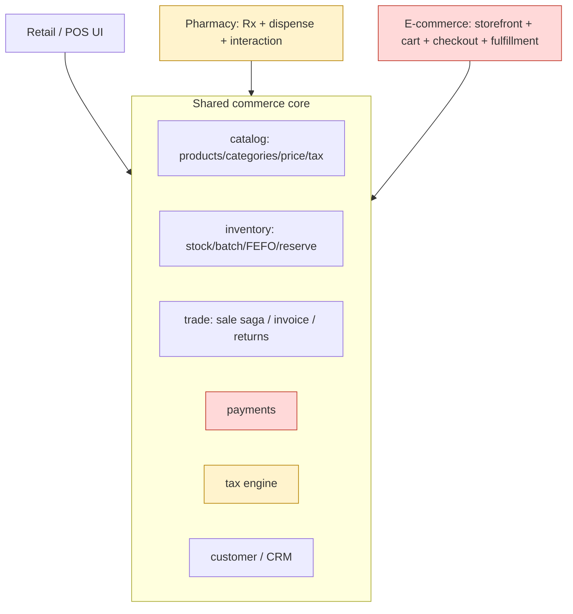

# Commerce Verticals Blueprint — Retail/POS · Pharmacy · E-commerce

The industry-standard **activity lifecycle** for each commerce vertical, mapped across **UI/UX → service/API → DB**,
with each step graded against what exists in the codebase today. This is the master reference that drives the
slice sequence — we close gaps **step by step** until each vertical is 100% to standard, top to bottom.

> Companion docs: `commerce-backend-audit.md` (backend gap list G1–G6), `slices/33-platform-decomposition.md`
> (bounded contexts), `slices/34-commerce-gap-g2-returns-inverse-saga.md` (returns).

## Legend

| Mark | Meaning |
|---|---|
| ✅ | Done & verified (or done, awaiting build) |
| 🟡 | Partial — exists but incomplete / not wired end-to-end |
| ⬜ | Missing — not built |
| 🔭 | Future/optional (nice-to-have, not blocking standard) |

Layers graded per step: **UI** (Thymeleaf/JS screen) · **API** (service endpoint + logic) · **DB** (entity/schema).

---

## 1. Current platform state (grounded in code)

| Bounded context | Service | State |
|---|---|---|
| Product master | `catalog-service` | ✅ Product + Category CRUD, pricing field, taxRate field |
| Stock / batches | `inventory-service` | ✅ StockLevel, StockEntry (batch/lot/expiry/warehouse/supplier/reserved), reservations (FEFO + G1 expiry exclusion), warehouse, supplier, alerts, adjustments, transfers |
| Trade (sell/purchase) | `business-service` | ✅ POS sale + sell↔stock **saga** (reserve/confirm/release + recovery relay), purchase, customer, vendor, company, invoicing (per-org seq), returns (G2 inverse saga) |
| Analytics | `analytics-service` | 🟡 dashboard/financial/report/sales endpoints exist |
| Pharmacy | `pharma-service` | ✅ rebased on catalog/inventory (slices 41–45): dispense, drug-interaction safety, alerts, FEFO batch/expiry on dispense, quarantine returns + register, insurance/co-pay split (P10–P12) |
| E-commerce | `marketplace-service` | 🟡 storefront browse/search, public orders, **stock-reserve saga** (same inventory saga as POS) + recovery relay, order tracking/timeline, customer accounts (slices 46–61). **Missing: cart, checkout, shipping, coupons** |
| Payments | `business-service` | 🟡 **offline tender done** — payment entity + method enum (cash/card/credit/wallet/insurance/refund), split + change, day-close (slices G5/P12). **Missing: online PSP + refunds** |
| Tax engine | `business-service` | ✅ per-product `taxRate` → line + invoice tax applied at sale (G3) |

**Architecture principle (decomposition, slice 33):** the three verticals **share one commerce core** —
catalog (products) + inventory (stock) + trade (sale saga) + pricing/tax/payment/customer/returns. Each vertical
adds only its *differentiating* layer on top. Pharmacy adds the clinical/Rx layer; e-commerce adds the
storefront/cart/checkout/fulfillment layer. We do **not** re-store products or stock per vertical.

---

## 2. Shared commerce core — standard checklist

These power all three verticals; closing them benefits everything. (G-codes map to `commerce-backend-audit.md`.)

| # | Capability | UI | API | DB | Notes |
|---|---|:--:|:--:|:--:|---|
| C1 | Product master (SKU/barcode/category/unit) | ✅ | ✅ | ✅ | catalog-service |
| C2 | Price management (sell/cost/MRP, price history) | 🟡 | 🟡 | 🟡 | G4 — price edit exists; **price history / tiers / promos** missing |
| C3 | **Tax engine** (per-product rate → line+invoice tax, tax-inclusive/exclusive, multi-tax) | ✅ | ✅ | ✅ | **G3 done** — per-product rate applied to line + invoice; multi-tax/inclusive-toggle later |
| C4 | Inventory: multi-batch, lot, expiry, warehouse, reorder | 🟡 | ✅ | ✅ | UI for batch/expiry/reorder thin |
| C5 | FEFO allocation + **no expired** | ✅ | ✅ | ✅ | **G1 done** |
| C6 | Stock receipt (purchase/GRN) → inventory | 🟡 | ✅ | ✅ | purchase exists; GRN/PO workflow thin |
| C7 | Atomic sale (saga reserve→confirm→release) | ✅ | ✅ | ✅ | slice 33 |
| C8 | Invoicing (per-org sequential, reprint, format) | 🟡 | ✅ | ✅ | numbering ✅; print/template basic |
| C9 | **Returns/refunds → inventory** (inverse saga) | ✅ | ✅ | ✅ | **G2 done** (UI dialog + inverse saga) |
| C10 | **Payments** (cash/card/credit/wallet/split, change, tender) | ✅ | ✅ | ✅ | **G5 done (offline)** — payment entity + method enum + split/change + insurance; **online PSP + refunds** missing |
| C11 | Customer / CRM (credit, due, ledger, loyalty) | 🟡 | 🟡 | 🟡 | paid/due ✅; **loyalty/points/statements** missing |
| C12 | Discounts/promotions (line, cart, coupon, BOGO) | 🟡 | 🟡 | 🟡 | line discount only |
| C13 | Multi-tenancy / org-scoping | ✅ | ✅ | ✅ | every read/write |
| C14 | Roles/privileges (cashier/manager/owner) | ✅ | ✅ | ✅ | privilege-based |
| C15 | Reporting/analytics (sales, margin, stock, tax) | 🟡 | 🟡 | 🟡 | analytics-service partial; tax/GST report missing |
| C16 | Audit trail (who/when on every money/stock event) | 🟡 | 🟡 | 🟡 | userId stamped; no dedicated audit log |
| C17 | Notifications (low-stock, expiry, receipts) | 🟡 | 🟡 | 🟡 | StockAlert + notification-service exist; not wired to dashboard |

---

## 3. Vertical A — Retail / POS

**Goal:** a complete brick-and-mortar point-of-sale: counter sale, payment, receipt, returns, day-close, reporting.

### Lifecycle

| Step | Activity | UI | API | DB | Std notes / gap |
|---|---|:--:|:--:|:--:|---|
| R1 | Onboard org / store / terminal / cashier | 🟡 | 🟡 | 🟡 | org+roles ✅; **store/terminal/register** entities missing |
| R2 | Catalog setup (products, categories, units, barcodes) | ✅ | ✅ | ✅ | barcode field present |
| R3 | Supplier + purchase/GRN → stock in | 🟡 | ✅ | ✅ | C6 — PO/GRN approval flow thin |
| R4 | Opening stock / stock-take / adjustments | 🟡 | ✅ | ✅ | adjust/transfer API ✅; cycle-count UI missing |
| R5 | **Counter sale**: scan/select → cart → qty/disc | 🟡 | ✅ | ✅ | sell screen exists; barcode-scan UX + cart polish needed |
| R6 | **Tax** applied to lines + totals | ✅ | ✅ | ✅ | **G3 done** |
| R7 | **Payment/tender** (cash/card/credit/split, change) | ✅ | ✅ | ✅ | **G5 done (offline)**; online PSP later |
| R8 | Finalize sale (saga) + **receipt print** | 🟡 | ✅ | ✅ | saga ✅; thermal/A4 receipt template basic |
| R9 | **Returns/refunds** (full/partial) → inventory | ✅ | ✅ | ✅ | **G2** |
| R10 | Hold/park & resume sale, void line/sale | ✅ | ✅ | ✅ | **park/hold + resume done** (parked_sale); void line/sale still thin |
| R11 | Customer attach (walk-in vs account, credit sale) | 🟡 | 🟡 | 🟡 | C11 |
| R12 | Discounts/coupons/loyalty at POS | 🟡 | 🟡 | 🟡 | C12 |
| R13 | **Cash drawer / shift open-close / X-Z report** | ✅ | ✅ | ✅ | **day-close done** — cashier_shift + cash_movement, open/close + report |
| R14 | Low-stock / near-expiry alerts on dashboard | 🟡 | 🟡 | 🟡 | C17 |
| R15 | Reports: sales, margin, tax, top items, stock value | 🟡 | 🟡 | 🟡 | C15 |

### POS standard gaps to add
- **Payments & tender (G5)**, **Tax (G3)** — blockers for a real receipt.
- **Store/terminal/cashier-shift model** + **cash drawer / X-Z day-close**.
- **Park/hold + void/void-line** with audit.
- **Receipt templates** (thermal 58/80mm + A4) and reprint.
- **Barcode-first** sell UX.

---

## 4. Vertical B — Pharmacy

**Goal:** retail POS **plus** the clinical/regulatory layer. Reuses catalog + inventory + trade; adds Rx,
dispensing, interaction checks, controlled-substance control. Today: clinical *entities exist but nothing is wired*,
and they **duplicate** Product/StockEntry — must be rebased to compose the core (decomposition Phase 7).

### Lifecycle

| Step | Activity | UI | API | DB | Std notes / gap |
|---|---|:--:|:--:|:--:|---|
| P0 | **Rebase pharma onto catalog/inventory** | ✅ | ✅ | ✅ | slice 41: Medicine/PharmacyStock **dropped**; pharma rebased onto the itemId bridge → uses the shared StockEntry. (Full Item→Product convergence parked: M2–M4.) |
| P1 | Medicine master (generic/brand/strength/form/schedule/`rxRequired`) | 🟡 | ✅ | ✅ | slice 44: reuses the Item screen (relabelled "Medicine") + `MedicineClinical` for rxRequired/controlled/schedule |
| P2 | Drug categories (hierarchical) + interactions DB | 🟡 | ✅ | ✅ | slice 44: `DrugInteraction` upsert via `findPairScoped`; categories deferred |
| P3 | Supplier + purchase (batch/expiry mandatory) → inventory | 🟡 | ✅ | ✅ | reuse C6 (expiry compulsory) |
| P4 | Patient + doctor/prescriber registry (license) | 🟡 | 🟡 | ✅ | slice 43: `Prescription` carries patient/doctor; no separate registry yet |
| P5 | **Prescription intake** (items, dosage, freq, duration, validity) | ✅ | ✅ | ✅ | slice 43 (Cypress prescription.cy.js) |
| P6 | **Dispense = sale + Rx ref + dispensed-by** (saga) | ✅ | ✅ | ✅ | slice 43: dispense **completes a normal `addSell`** (the SAME `SagaSellService` POS uses) + a `Dispensing` row linked to that invoice — stock decrements through the shared saga, not a parallel store (Cypress dispense.cy.js) |
| P7 | **Rx-required + controlled-substance enforcement** + log | ✅ | ✅ | ✅ | slice 44: `SafetyService` controlled-register + pre-dispense check (Cypress safety.cy.js) |
| P8 | **Drug-interaction check at dispense** (cart vs patient meds) | ✅ | ✅ | ✅ | slice 44: `DrugInteraction` + pharma.js warns before dispense |
| P9 | **FEFO + never dispense expired** | ✅ | ✅ | ✅ | **G1** already enforced in core |
| P10 | Batch + expiry shown on dispense screen | ✅ | ✅ | ✅ | slice 54: inventory `/stock/batches/{id}` (FEFO, G1-excluded) → `getStock.batches` → `#sellBatchInfo` on the sell/dispense screen |
| P11 | Returns → quarantine (`restockable=false`) not sellable | ✅ | ✅ | ✅ | slice 55: `StockEntry.restockable`; quarantine return → non-sellable entry, no on-hand bump; FEFO/availability exclude it; return dialog checkbox (pharma default) |
| P12 | Tax/payment/receipt (+ insurance/co-pay later) | 🟡 | ✅ | ✅ | reuse G3/G5 via the shared sale; insurance 🔭 |
| P13 | Near-expiry + low-stock pharmacy alerts | 🟡 | ✅ | ✅ | slice 45 (Cypress alerts.cy.js) |
| P14 | Regulatory reports (controlled-substance register) | 🟡 | ✅ | ✅ | slice 44: controlled-register list endpoint; jurisdictional reports 🔭 |

### Pharmacy standard gaps
- **P0 rebase DONE** (slice 41, itemId bridge) — dup stores dropped; pharma composes the shared core.
- **Dispense-as-saga-sale DONE** (slice 43): dispensing rides the shared `addSell` saga (reserve→confirm→relay→return),
  so stock parity with POS/storefront is **structural** — the on-hand decrement is proven by `saga-sell.cy.js`.
  Prerequisite: the dispensed item must be **catalog-migrated** (`ItemCatalogMap`) like any saga sale (parked M2–M4).
- **Safety/compliance DONE** (slice 44): rxRequired/controlled enforcement + register, interaction check,
  expired-block (✅, G1). Remaining: P10 batch/expiry on the dispense screen, P11 quarantine returns.

---

## 5. Vertical C — E-commerce (marketplace)

**Goal:** an online storefront on the same catalog/inventory/trade core. Currently greenfield (empty service).
Build the storefront/cart/checkout/fulfillment layer; **reserve uses the same saga**; payments via gateway.

### Lifecycle

| Step | Activity | UI | API | DB | Std notes |
|---|---|:--:|:--:|:--:|---|
| E1 | Storefront catalog (browse/search/filter/detail, images) | ✅ | ✅ | 🟡 | slice 47 grid + slice 60 **name search done**; media/filter later |
| E2 | Product media/SEO/attributes/variants | ⬜ | ⬜ | ⬜ | variants/options model |
| E3 | **Cart** (add/update/remove, persist guest+account) | ⬜ | ⬜ | ⬜ | next biggest e-comm gap |
| E4 | Customer accounts (register/login/addresses) | ✅ | ✅ | ✅ | slice 61: self-contained storefront accounts (BCrypt, session token); addresses + auth hardening later |
| E5 | **Checkout** (address, shipping method, tax, totals) | ⬜ | ⬜ | ⬜ | reuse C3 tax |
| E6 | **Online payment** (gateway: card/wallet/UPI, webhook) | ✅ | ✅ | ✅ | slice 48: sandbox PaymentGateway (COD/Card); PSP swap deferred |
| E7 | **Order placement** (stock reserve via saga) | ✅ | ✅ | ✅ | slice 49: guest checkout reserves→confirms via the SAME inventory saga POS uses; OUT_OF_STOCK blocks; decline/write-failure releases |
| E8 | Order management (status, fulfillment, picking) | ✅ | ✅ | ✅ | slice 46: back-office orders + fulfilment status (NEW→…→DELIVERED) |
| E9 | **Shipping/delivery** (carrier, tracking, slots) | ⬜ | ⬜ | ⬜ | |
| E10 | **Returns/RMA** → inventory (reuse G2 inverse saga) | ⬜ | 🟡 | 🟡 | extend C9 |
| E11 | Notifications (order confirm/ship/deliver email/SMS) | 🟡 | ✅ | ✅ | slice 57: order-status timeline + notification seam; templated email/SMS later |
| E12 | Reviews/ratings, wishlist | 🔭 | 🔭 | 🔭 | |
| E13 | Promotions/coupons/cart rules | ⬜ | ⬜ | ⬜ | shares C12 |
| E14 | Admin: catalog/orders/inventory/customers | ⬜ | ⬜ | ⬜ | reuse core admin |
| E15 | Multi-channel inventory sync (POS↔online) | 🟡 | ✅ | ✅ | same inventory-service = single source ✅ |

### E-commerce standard gaps
Storefront, search, public orders, the stock-reserve saga, order tracking/timeline, and customer accounts are done
(slices 46–61). Remaining net-new, in priority order: **cart (E3), checkout (E5), real PSP + refunds (E6 swap),
shipping (E9), returns/RMA (E10), coupons (E13), variants/media (E2)**. Inventory is already shared, so POS and
online never oversell against each other.

---

## 6. Cross-cutting (all verticals)

| Area | Status | Standard gap |
|---|:--:|---|
| Payments (offline tender + online PSP + refunds) | 🟡 | **offline tender done (G5)**; online PSP + money-side refunds remain |
| Tax engine (multi-rate, inclusive/exclusive, reports) | 🟡 | **G3 base done**; multi-rate / inclusive toggle / tax reports later |
| Returns/refunds ledger (money side, not just stock) | 🟡 | G2 restores stock; refund money/record missing |
| Promotions/discount engine | 🟡 | unify line/cart/coupon |
| Audit log (immutable money/stock events) | 🟡 | dedicated audit |
| Receipts/documents (templates, reprint, PDF) | 🟡 | thermal + A4 |
| Reporting (sales/margin/tax/stock/expiry/cash) | 🟡 | tax + day-close reports |
| Notifications (alerts, receipts, order events) | 🟡 | wire StockAlert + notification-service to UI |
| Security (PCI for online payments, audit, RBAC) | 🟡 | PCI scope when PSP added |

---

## 7. Proposed sequencing (close gaps step by step)

Ordered so each step is shippable, testable, and unblocks the next. Shared-core first (lifts all three verticals).

**Phase 1 — finish the shared POS core (retail usable end-to-end)**
1. ✅ G1 expired-stock block · ✅ G2 returns→inventory (+ UI)
2. **G3 — tax engine** (per-product → line+invoice tax; inclusive/exclusive; tax report)
3. **G5 — payments/tender** (cash/card/credit/split, change, payment record) + **refund money** on returns
4. **Receipt** (thermal/A4 template + reprint) and **G4** price management polish
5. **POS day-close**: cashier shift + cash drawer + X/Z report; park/void with audit

**Phase 2 — pharmacy vertical (on the now-complete core)**
6. **P0 rebase** pharma onto catalog/inventory (kill duplication)
7. Medicine master + categories + interaction DB (P1–P2) wired
8. Patient/prescriber + **prescription intake** (P4–P5)
9. **Dispense = saga sale + Rx ref + dispensed-by** (P6) + batch/expiry on screen (P10)
10. **Safety/compliance**: rxRequired/controlled enforcement (P7), interaction check (P8), quarantine returns (P11)

**Phase 3 — e-commerce vertical**
11. Storefront catalog + media/search (E1–E2)
12. Cart + customer accounts (E3–E4)
13. Checkout + tax + **online payment (PSP)** (E5–E6) — reuses G3/G5
14. **Order placement via saga** + order/fulfillment lifecycle (E7–E8)
15. Shipping/tracking (E9) + RMA returns (E10) + order notifications (E11)

**Cross-cutting (fold in as encountered):** audit log, discount/promotion engine, reporting suite, notifications wiring.

> Each numbered item becomes its own slice: **Document → Design (Mermaid UML) → Implement (UI→API→DB) → Tests
> (mvn) → Cypress → docs**, verified before the next. We do not start a vertical until the shared core it depends on
> is at standard.

---

## 8. Status snapshot

- **Done:** G1 (FEFO/expiry), G2 (returns inverse saga + UI), **G3 (tax engine + Tax Settings UI + tax column)**,
  **G5 (payments: split-capable Payment model, settle vs grand total, refund on return, checkout method + payment
  column)**, **slice 36 (single dashboard + route, vertical profile by user type)**.
- **Done (cont.):** **receipts (slice 38)** — general vertical-aware thermal receipt (`/getReceipt`, hidden-iframe
  print, brand/title per vertical), surfacing tax + tendered/change/grand total; Print button + auto-print after sale.
- **Next:** **POS day-close** (cashier shift + cash drawer + X/Z report; park/void).
- **Then:** pharmacy P0 rebase → pharmacy Rx/dispense → e-commerce.
