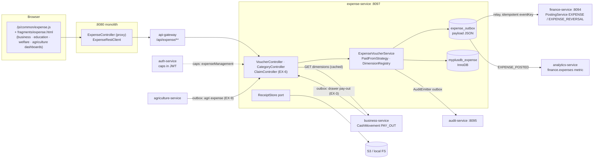
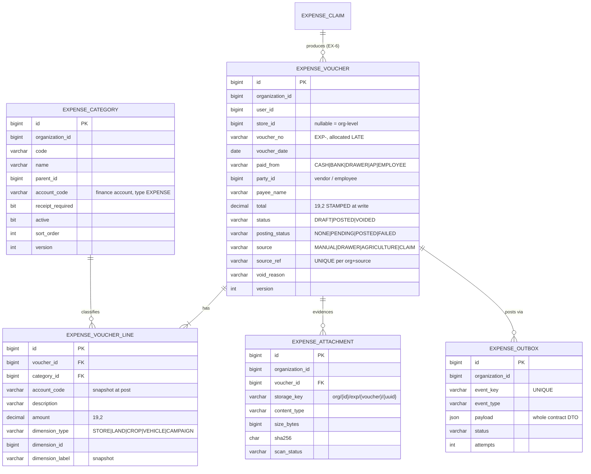
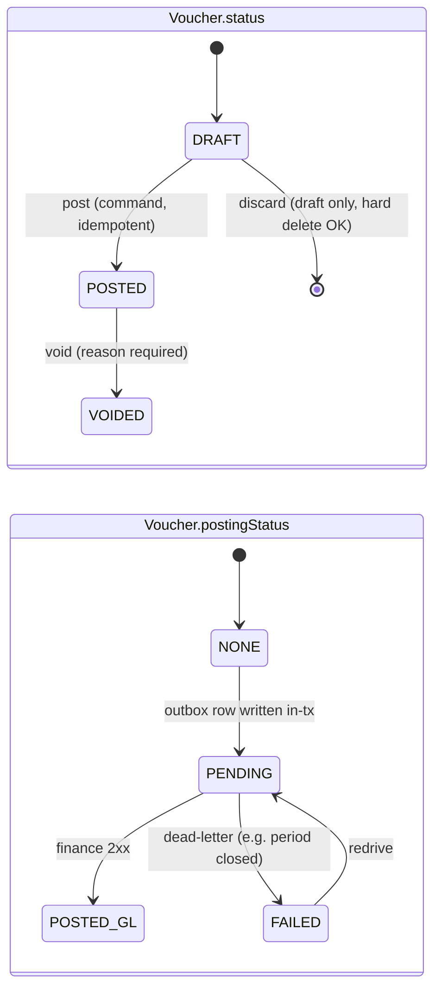
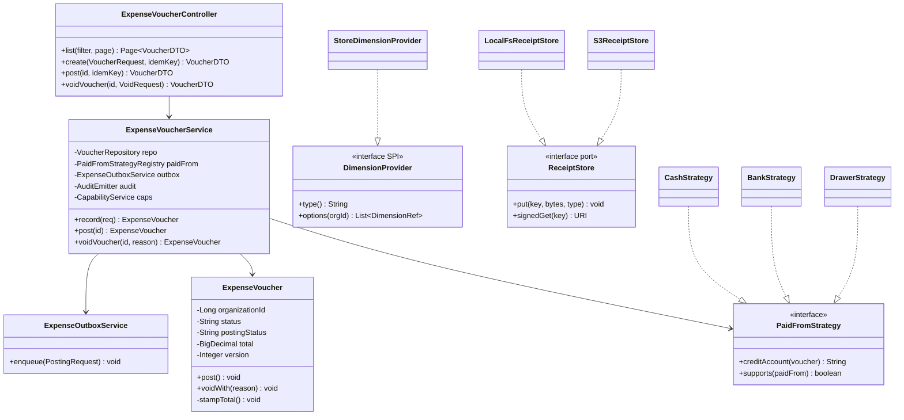

# Expense Management — programme design (`expense-service`)

**Status (2026-10-05):** EX-0a, EX-0b, EX-0c, EX-1, EX-2a, EX-2b, EX-3 and EX-4 (= FP-3) **built and live**, with the
payables programme FP-1…FP-6a around them (`finance-payables-subledger-design.md`). EX-5…EX-9 not started. End-to-end
review of everything built: §11. _(Originally: DESIGN — awaiting the design-gate go-ahead.)_ Each EX-n slice has its
own `slices/ex-n-*.md`.

**Rulings recorded (user, 2026-10-02)**

| # | Question | Ruling |
|---|---|---|
| R1 | Which service owns expenses? | A **separate, standalone microservice** — `expense-service` |
| R2 | `EXPENSE_MANAGEMENT` default | **OFF** |
| R2b | Platform | **Capabilities must support default-OFF** as a general platform mechanism (any capability, not an expense special case) — §6.4, slice EX-0a |
| R3 | Drawer pay-outs + `agriculture_expense` | Expense Management must cover **every module/business type**, plug-and-play — they converge onto it |
| R4 | Direct voucher first? | "As per best practices, docs and standards" → market research (§3) says **yes**: direct voucher → bill → claim |

Input: the external proposal "MaxTheService Expense Management Module" (2026-10-01), reviewed against code the same
day. Its gap list is folded into §4 here. What survives from it: command-style endpoints, outbox + idempotent
posting, tenant-from-identity, audit on every financial action, cache only reference data. What does not: the
14-state machine, the 9 capabilities, Redis L2, departments/projects as if they existed, the Cypress examples.

---

## 1. Document — what and why

**Problem.** A business on MaxTheService cannot record what it costs to run. Rent, electricity, fuel, a rider's
fare, a repair — none of it has a home, so the P&L shows sales and COGS and nothing else, and the "net profit"
on `/gl/pnl` is overstated by every rupee spent. Where money *is* recorded leaving, it never reaches the books:

- a cashier's drawer **pay-out** (`CashMovement PAY_OUT`, "petty expense") is counted at shift close and then
  forgotten by the ledger;
- a farm's `agriculture_expense` row is a standalone list with no ledger posting and a hard delete;
- welfare spending has no record at all.

**User value.** One place, in every module, to record "money went out, for this, from here" — and have it land
in the ledger correctly, once, with the evidence and the trail an accountant or auditor expects.

**Principle (kept from the proposal).** *An expense is not financially final when typed. It becomes a ledger
transaction only through a controlled, idempotent post* — and the UI shows PENDING until the ledger confirms
(STANDARDS §0b).

---

## 2. Standards (§1b table)

| Dimension | Rule this programme is built to |
|---|---|
| **Business / domain** | Expenses ≠ purchases: a purchase brings goods into **inventory** (Dr 1200) and later COGS; an expense is an operating cost (Dr an `EXPENSE`-type account). Three source documents as every ledger product has them (§3): **direct payment voucher** (paid now — Dr expense / Cr cash·bank), **expense bill** (pay later — Cr AP 2000), **employee claim** (paid personally — Cr reimbursement payable). Salaries are **payroll**, not expenses (HRM is planned) — refused as an expense category type. A posted voucher is never edited or deleted, only **voided by a reversing journal**. |
| **SaaS multi-tenancy** | `organization_id` on every row, from the JWT (`CurrentUser.organizationId()`), never from a parameter (operator path = `CurrentUser.organizationIdFor`, ONB rule). `findScoped` reads; foreign id → **404**, not 403 (no existence probe). Store scoping from role × location grants. Receipt keys prefixed `org/{id}/`. Cache keys via `TenantCache`. |
| **Live-modules rule** | Capability **default OFF** (R2): on deploy, no tenant sees anything new. Drawer pay-outs and agriculture keep today's behaviour until the owner switches the capability ON. **No restatement of history** — past pay-outs/agri rows are not back-posted unless an owner runs an explicit, previewed import (COGS-V12 lesson). |
| **Microservice boundaries** | New service justified by the decision rule (owns **data + lifecycle + integration**): its own tables, a voucher/claim lifecycle, and integration with finance, audit, notify, storage, and every module. finance-service stays the **only** writer of journals. Modules never call expense-service on a hot path. |
| **Design patterns** | **Transactional outbox** (posting, audit) · **Idempotent consumer** (finance `processed_event`) · **Command** endpoints (`/post`, `/void`) · **State machine** on the aggregate · **Strategy** for "paid from" (cash/bank/drawer/AP/employee → credit account) · **Ports & Adapters / SPI**: `ReceiptStore` (local FS dev, S3 prod) and `DimensionProvider` (each module supplies its dimensions — land, crop, vehicle, store, campaign) · **Anti-corruption layer** in `commerce-contracts` · **CQRS read model** for analytics · **Policy object** via `common-settings`. |
| **SOLID / DRY** | Reuse, do not re-implement: `common-security`, `common-settings` (org_setting + catalog + Configuration screen), `common-outbox`, `common-audit`, `common-notify`, `common-web` `TenantCache`, `common-import` (CSV later). **One** UI (`/js/common/expense.js` + one Thymeleaf fragment) rendered in all four dashboards. **One** finance event type with lines, not one per category. |
| **Testing standard** | `mvn test`: state machine, Strategy credit-account mapping, money rounding, scoping, Flyway on an empty DB (D2, read the Skipped count — D2a). One headed Cypress gate per slice, **written before the code**, driving the real UI, with the owner/admin/user ladder, a seeded second tenant for isolation, and **the trial balance** as the money assertion (outbox-drop lesson). |

---

## 3. Market research — how the category leaders model it

| Product | Paid now | Pay later | Employee paid personally | Notes |
|---|---|---|---|---|
| **QuickBooks Online** | **Expense / Check** — "records the expense and the payment simultaneously", hits P&L at once | **Bill** → Accounts Payable, paid separately | (via add-ons) | Timing of payment is the deciding axis |
| **Xero** | **Spend Money** — "expenses that do not need a bill" | **Bills** | **Expense claims** — approval then reimbursement | Two separate workflows that both end in the accounts |
| **Odoo 17 Expenses** | "Paid by: **Company**" | via Vendor Bills | "Paid by: **Employee (to reimburse)**" → report → manager approves → accounting posts → reimburse | Report states: To Report → To Submit → Submitted → Approved → Posted → Done |
| **TallyPrime** (the South-Asia leader) | **Payment voucher** (F5): credit Cash/Bank, debit an expense ledger under *Indirect Expenses*; petty cash = the same voucher against a Petty Cash ledger | Purchase/Journal voucher against a party | — | No approval workflow at all; the voucher *is* the record |

**What they converge on, and the decision it drives:**

1. **The paying source decides the document**, not the category. A direct payment is one step and posts at once
   (QBO, Xero, Tally). Approval workflows exist only for money the business has not yet paid (claims).
2. **Small shops live on the voucher.** Tally — the tool our market's accountants already know — has no approval
   step for expenses. Making a corner shop submit-and-approve its electricity bill would be enterprise ceremony.
3. **Claims are a separate, opt-in module** (Xero tiers it; Odoo is a separate app).

→ **EX-1 is the direct payment voucher.** Bills next, claims as an opt-in capability later. One aggregate,
`ExpenseVoucher`, with a `paidFrom` Strategy, covers voucher and bill; the claim is a separate aggregate that
*produces* vouchers when approved (Odoo's shape).

Sources: [QuickBooks — bills, checks, expenses](https://quickbooks.intuit.com/learn-support/en-us/help-article/accounts-payable/learn-difference-bills-checks-expenses-quickbooks/L0ZtL2TYI_US_en_US) ·
[Xero — claim expenses](https://www.xero.com/us/accounting-software/claim-expenses/) ·
[Spend Money vs Bills in Xero](https://vhaccounting.ca/2022/11/30/understanding-the-difference-between-spend-money-and-bills-in-xero/) ·
[Odoo 17 expense reports](https://www.odoo.com/documentation/17.0/applications/finance/expenses/expense_reports.html) ·
[Odoo 17 employee vs company expenses](https://www.cybrosys.com/blog/how-to-manage-employee-expenses-and-company-expenses-in-odoo-17-expense-app) ·
[TallyPrime payments](https://help.tallysolutions.com/tally-prime/accounting/payments-and-receipts-tally/) ·
[TallyPrime petty cash](https://www.asktallyprime.com/how-to-manage-petty-cash-in-tallyprime-ask-soft-tech/)

---

## 4. Current state — verified against the code (2026-10-02)

Legend: ✅ exists and is usable · 🟡 exists, needs change · ⬜ does not exist · ⚠ live defect found by this review.

### 4a. Platform pieces Expense Management depends on

| Piece | State | Evidence |
|---|---|---|
| GL, trial balance, P&L, balance sheet | ✅ | `GlService` |
| Idempotent event posting | ✅ | `PostingService.postEvent` + `processed_event` (`:84-91`) |
| Period lock | ✅ | `PeriodLockService.assertOpen`, called in `GlService.postJournal:145` |
| An event that carries **per-line accounts** | ⬜ | `PostEventRequest` = document totals only; 10 event types in an if-chain, unknown → throws (`PostingService:94-104`) |
| Expense accounts in the default chart | 🟡 | 15 accounts; **one** expense account, `5100 Purchases / Expenses`. No reimbursement payable, employee advance or card payable |
| Dimensions on journal lines (store/project) | ⬜ | `JournalLine` = account, debit, credit, memo. `JournalEntry` has no `storeId` |
| Generic reversal | ⬜ | per-type only (`OPENING_AR_REVERSAL`) |
| Disbursement to a non-vendor | ⚠ | `postPayment("DISBURSEMENT")` **always Dr 2000 AP**, dated `LocalDate.now()` (`PostingService:372-376`); `PartyType` has no `EMPLOYEE` |
| Outbox library | ✅ | `common-outbox` — the payload is the producer's own. ⚠ business/education `GlOutbox` copy fields one by one → the **silent-drop trap** (5 places per new field) |
| Audit | ✅ | `common-audit` `AuditEmitter` → `audit-service` |
| Notifications | ✅ | `notification-service` via `common-notify` |
| Per-org settings + Configuration screen | ✅ | `common-settings` (`SettingsCatalogProvider`, org_setting per service DB) |
| Capability gating across services | ✅ | auth-service is the owner (`app.capabilities.owner: true`), resolves at token mint → JWT `caps` → `CurrentUser.capabilities()` |
| **Capability default OFF** | ⬜ | Every capability defaults ON: `CapabilityCatalog:64` hard-codes `true`, `Shape.GENERAL` = `allOf` (`Shape.java:42`). See §6.4 |
| File / object storage | ⬜ | No S3 client, no signed URL, no scanning in any service. Only `MultipartFile` = CSV import + education alerts |
| Departments / cost centres / projects | ⬜ | none in business, finance or auth |
| Manager / reporting line | ⬜ | no `manager_id` / managed-by in auth-service (searched) |
| Store (branch) | ✅ | `storeId` + role × location grants (multi-location) |
| Per-org document numbers | 🟡 | `DocumentNumberService` exists **twice** (business, finance). Expense would be a third copy — see §9 R-7 |
| Party (vendor) master | ✅ | `party-service` `/upsert` |

### 4b. Live defects found on the way (not caused by this programme, but it touches each)

| # | Finding | Verified | Not verified |
|---|---|---|---|
| ⚠ F1 | **Drawer pay-outs never reach the ledger.** `ShiftService` has no finance/outbox call. Cash paid out of a till still sits in GL `1000 Cash` | code read | the size of the drift in any tenant |
| ⚠ F2 | **Analytics "total expenses" reads a metric nobody writes.** `FinancialAnalyticsService:29` reads `finance.expenses`; it is the only reference in the repo | grep, 1 hit | what the screen shows |
| ⚠ F3 | `agriculture_expense` is **hard-deleted** (`service.deleteById`, controller `:153`), no `@Version`, no ledger | code read | — |
| ⚠ F4 | `Purchase.purchaseExpense` is a **`Float`** (money standard) and no service-layer code writes it | grep | whether the DTO mapping fills it |
| F5 | welfare-service has **no ledger link at all** — no outbox, no finance client. Donations never reach the books | grep | — |
| F6 | = §4a "disbursement" row | code read | — |

### 4c. Per-vertical activity lifecycle — expenses (UI → API → DB)

Industry lifecycle for an operating cost: **capture → classify (category→account, dimension) → evidence (receipt)
→ authorise (only if not already paid by the business) → post (journal) → pay/settle (if not paid at capture)
→ void (reversing journal) → report (P&L, by category/dimension, tax).**

| Vertical (shape + capabilities) | Typical expenses | Natural dimension | Paid from | Today in code | Plug-in needed |
|---|---|---|---|---|---|
| **Retail / mobile shop** (`retail` + serial/installments) | rent, internet, warranty repair, delivery, marketing | store | drawer, cash, bank | ⚠ drawer PAY_OUT only, no GL; ⬜ else | store provider (business) · drawer convergence (EX-3) |
| **Pharmacy / vet / agri-chem** (`pharmacy`) | cold-chain power, licence fees, delivery | store | drawer, bank | same as retail | same |
| **Distribution** (`distribution` + fieldSales/collections) | vehicle fuel, loading, freight-out, rep travel | store, vehicle/route | cash, rep (claim) | ⬜ | route/vehicle provider (later); claims (EX-6) for reps |
| **Restaurant** (`retail` + madeToOrder/orderTypes) | gas, packaging, cleaning, rider fares | store | drawer | ⚠ drawer only | same as retail. ⚠ *kitchen stock* (oil, chicken) is a **purchase**, not an expense |
| **Online store** (`storefront`) | gateway fees, shipping, ads | channel | bank | ⬜ | — |
| **Education** | utilities, stationery, transport fuel, maintenance | school, vehicle (`Vehicle` entity exists) | bank, cash | ⬜ (fees DO post: `GlOutbox FEE_COLLECTION`) | school/vehicle provider. **Salaries excluded** (payroll) |
| **Welfare / NGO** | distribution costs, admin, events | **fund / campaign** (restricted donations) | bank, cash | ⬜, and no GL at all (F5) | campaign provider. ⚠ P&L will show spending with no income until donations post (§9 R-5) |
| **Agriculture** | seed, fertiliser, labour, diesel | **land, crop** | cash | 🟡 `agriculture_expense` list, no GL, hard delete (F3) | land/crop provider + convergence (EX-9) |
| **Appointment / clinic** | consumables, rent | — | cash, bank | ⬜ | none (ORG-level only) |
| **HRM (planned)** | — | department | — | ⬜ | department provider arrives with HRM; claims routing by reporting line (G8) |

**Reading it:** the core lifecycle is identical across all ten; what differs is the **dimension** and the **paying
source**. Both are therefore pluggable (SPI + Strategy), and nothing in the core names a vertical — the capability
rule (*"capabilities describe behaviour, never verticals"*) applied to expenses.

---

## 5. Architecture

### 5.1 Placement and data stores

| Concern | Choice | Why (and the alternative rejected) |
|---|---|---|
| Service | `expense-service`, port **8097**, DB `myplusdb_expense`, pkg `com.myplus.expense`, scaffold mirrors `party-service`/`audit-service` | R1. 8081–8096 are taken (`start-all.ps1`) |
| Transactional store | **MySQL 8, InnoDB**, Flyway-owned, `ddl-auto=validate` | ACID money records; same ops as the other 15 services. ⚠ InnoDB stated explicitly (purchase/customer_history MyISAM incident) |
| Receipts (EX-5) | **Object storage** behind `ReceiptStore` port: local filesystem adapter in dev, **S3** in prod (private bucket, pre-signed GET ≤ 5 min) | Blobs do not belong in MySQL; the port keeps start-all runnable without AWS |
| Reference cache | Caffeine via `common-web` `TenantCache` (categories, account list) | §1d K3/K5/K7. **No Redis** (proposal's L2 rejected: one replica, K7) |
| Reporting | OLTP queries on scoped indexes for lists; **analytics-service read model** fed by an outbox event for trends | CQRS; also produces the dead `finance.expenses` metric (F2) |
| Ledger | finance-service, unchanged ownership | single writer of journals |

### 5.2 Architecture diagram



### 5.3 Domain model (ER)



Key choices:
- **`total` is stamped at write** from the lines in the same transaction (stamp-at-write rule); the only writer is
  the aggregate. No `approved_amount`/`reimbursable_amount` derived columns until a slice needs them (RULE 0 #3).
- **`account_code` and `dimension_label` are snapshots** on the line at post time, so re-mapping a category or
  renaming a land never rewrites what was posted.
- **`(organization_id, source, source_ref)` UNIQUE** — a drawer movement or agri row converts exactly once
  (DUP-1: the index carries it, not a pre-check).
- **`expense_outbox.payload` is JSON of the contract DTO** — closes the silent-drop trap for this producer:
  a new contract field needs no new column.
- Indexes (D3/D3b): `(organization_id, voucher_date)`, `(organization_id, status, voucher_date)`,
  `(organization_id, store_id, voucher_date)`, `(organization_id, user_id)`; line `(voucher_id)`,
  `(category_id)`.

### 5.4 Lifecycle (state machines)

Status is **three separate axes**, not one 14-value enum (the `QuoteStatus` lesson: two gates in one field
hide each other):



Claim (EX-6), separate aggregate, Odoo-shaped:
`DRAFT → SUBMITTED → APPROVED | REJECTED | RETURNED (→ DRAFT)`; APPROVED **produces** an `ExpenseVoucher`
with `paidFrom=EMPLOYEE` (Cr reimbursement payable). Payment state lives on the reimbursement, not the claim.

> **As built (EX-6, 2026-10-09) — deviation:** a claim **is** the `ExpenseVoucher` with `paidFrom=EMPLOYEE` and a
> `claim_status` of `SUBMITTED → APPROVED | REJECTED | WITHDRAWN`. It stays DRAFT while it waits, and approval posts it
> through the same `postInTx` every expense uses. A separate aggregate would have duplicated the lines, categories, tags,
> date window, receipts, numbering, posting, outbox and void. RETURNED is not built: a rejected claim carries its
> reason, and the member submits a new one. Payment state still lives on the reimbursement (EX-7).
> `slices/ex-6-claims.md` §1b.

The UI shows **"Posting…"** while `postingStatus = PENDING` and never shows the voucher as in the books until
`POSTED_GL` (§0b). A `FAILED` post is surfaced on the voucher and in the outbox health view, never silent.

### 5.5 Ledger entries — the Strategy table (`PaidFromStrategy`)

| `paidFrom` | Post (EX-n) | Debit | Credit | Settles later |
|---|---|---|---|---|
| `CASH` | EX-1 | each line's category account | 1000 Cash | — |
| `BANK` | EX-1 | ″ | 1010 Bank | — |
| `DRAWER` | EX-3 | ″ | 1000 Cash (store's drawer) | — |
| `AP` (expense bill) | EX-4 | ″ | 2000 Accounts Payable (vendor) | vendor payment (existing AP) |
| `EMPLOYEE` (claim) | EX-6 | ″ | **2300 Employee Reimbursement Payable** (new) | Dr 2300 / Cr cash·bank (EX-7) |
| advance settle | EX-7 | ″ | **1300 Employee Advance** (new, asset) | — |
| void (any) | — | mirror of the original | | `EXPENSE_REVERSAL`, same date rules |

Tax (EX-8): default **tax-inclusive cost** (most SMB tenants cannot reclaim input tax). An org setting
`expense.tax.inputRecoverable` adds Dr 2100 for the tax portion — feeding the existing tax register, which
already nets input against output.

### 5.6 Finance contract change (the only change to finance-service)

New event types `EXPENSE` and `EXPENSE_REVERSAL` on the existing `/gl/post-event`, carrying **lines**:

```json
{ "eventType": "EXPENSE", "eventKey": "EXP-104-8871-POST", "date": "2026-10-01", "ref": "EXP-000042",
  "lines": [ { "accountCode": "6200", "debit": 3000.00, "memo": "Fuel · Store 2" },
             { "accountCode": "1000", "credit": 3000.00, "memo": "Cash" } ] }
```

finance-side rules (server-enforced, the **purchase/expense boundary lives here**):
1. every debit account on an `EXPENSE` event must be type `EXPENSE` (or `1300` advance) — **`1200 Inventory` and
   income accounts are refused**;
2. every credit account must be in the allowed set (1000, 1010, 2000, 2300, 1300);
3. balanced (`GlService.validate`), period open (`assertOpen`), accounts exist **for this org**;
4. idempotent on `eventKey` (existing `processed_event`).

`ensureDefaults()` back-fills `2300` and `1300` and an **Operating Expenses** block (6000-series: Rent, Utilities,
Fuel & Transport, Repairs, Marketing, Bank Charges, Other) — the same path 2200/4200/4300 arrived by. `5100` stays
for purchases; its label is a later cleanup, not in scope.

### 5.7 Class diagram (EX-1 core)



### 5.8 Sequence — record and post a direct voucher (EX-1)

```mermaid
sequenceDiagram
  actor U as Owner / cashier
  participant UI as expense.js
  participant M as Monolith proxy
  participant E as expense-service
  participant DB as myplusdb_expense
  participant F as finance-service
  U->>UI: Save & post (amount, category, paid from, store)
  UI->>UI: disable the PRESSED button only (§0c), label "Posting…"
  UI->>M: POST /expense/vouchers (Idempotency-Key)
  M->>E: POST /api/expense/vouchers?post=true
  alt capability OFF
    E-->>UI: 200 {success:false, "Expense management is not enabled"}
  else no ADD_EXPENSE / store not granted
    E-->>UI: 403
  else replay of same key
    E-->>UI: 200 original response (BLK-5)
  else valid
    E->>DB: BEGIN; insert voucher+lines; stamp total; allocate EXP- no (late); status POSTED, postingStatus PENDING; outbox row; audit row; COMMIT
    E-->>UI: 200 {voucherNo, postingStatus: PENDING}
    Note over E,F: AFTER_COMMIT relay
    E->>F: POST /gl/post-event EXPENSE (eventKey)
    alt period closed / account refused
      F-->>E: 4xx → outbox FAILED, voucher postingStatus FAILED (visible)
    else ok or duplicate key
      F-->>E: 2xx → postingStatus POSTED_GL
    end
  end
  UI->>M: poll GET voucher (bounded) → shows "In the books" only on POSTED_GL
```

---

## 6. Design — contracts

### 6.1 API (`/api/expense/**`, command style)

| Method | Path | Privilege | Notes |
|---|---|---|---|
| GET | `/categories` | VIEW_EXPENSE | cached per tenant |
| POST/PATCH | `/categories[/{id}]` | MANAGE_EXPENSE_SETUP | account must be type EXPENSE (validated against finance account list) |
| GET | `/vouchers?from&to&storeId&categoryId&status&page` | VIEW_EXPENSE (own) / VIEW_ALL_EXPENSES | date bounds inclusive (report-date-bounds lesson); paged |
| GET | `/vouchers/{id}` | as above | foreign/other-user → 404 |
| POST | `/vouchers` (`post=true|false`) | ADD_EXPENSE | `Idempotency-Key` required |
| POST | `/vouchers/{id}/post` | POST_EXPENSE, or ADD_EXPENSE ≤ `expense.voucher.userPostLimit` | |
| POST | `/vouchers/{id}/void` | VOID_EXPENSE | reason required; reversing journal |
| DELETE | `/vouchers/{id}` | ADD_EXPENSE | **DRAFT only**; posted → refused |
| GET | `/dimensions?type=` | VIEW_EXPENSE | merged from providers |
| POST | `/internal/vouchers/from-source` | service-to-service | EX-3/EX-9; idempotent on `(source, sourceRef)` |
| GET/PUT | `/settings` | owner | `common-settings` `SettingsController` |

Refusals that are business rules return **200 + `success:false`** with a message (capability-platform convention);
auth failures are 401/403; cross-tenant is 404.

### 6.2 Per-org configuration (`ExpenseSettingsCatalog`, `common-settings`)

| Key | Type | Default | Meaning |
|---|---|---|---|
| `expense.voucher.userPostLimit` | MONEY | 0 | a USER-tier member may post vouchers up to this; above → admin posts (SalesQuote threshold pattern). 0 = users record drafts only |
| `expense.receipt.requiredAbove` | MONEY | blank = never | receipt mandatory above this (EX-5) |
| `expense.voucher.backdateDays` | INT | 30 | how far back a voucher date may go (finance period lock still wins) |
| `expense.voucher.defaultPaidFrom` | ENUM | CASH | form default. ⚠ verify it REACHES the form (the "saved default tender never reaches New Sale" lesson) |
| `expense.drawer.requireCategory` | BOOL | true | EX-3: when ON, a pay-out must name a category |
| `expense.tax.inputRecoverable` | BOOL | false | EX-8 |

Every key is **registered in the catalog** (the B2B-P4b lesson: a read-but-unregistered key is silently inert).

### 6.3 Privileges (verb-first, the codebase convention) and the tier ladder

| Privilege | owner | admin | user |
|---|---|---|---|
| VIEW_EXPENSE (own) | ✅ | ✅ | ✅ |
| VIEW_ALL_EXPENSES | ✅ | ✅ (managed scope) | — |
| ADD_EXPENSE | ✅ | ✅ | ✅ |
| POST_EXPENSE | ✅ | ✅ | ≤ userPostLimit |
| VOID_EXPENSE | ✅ | ✅ | — |
| MANAGE_EXPENSE_SETUP | ✅ | — | — |
| *EX-6:* SUBMIT_EXPENSE_CLAIM / APPROVE_EXPENSE_CLAIM / PAY_EXPENSE_CLAIM | ✅/✅/✅ | ✅/✅/— | ✅/—/— |

Seeded by auth `SetupDataLoader`, placed on the **COMMON** permission-set axis (expenses are cross-module),
travel in the JWT. Platform operators get **no** posting privilege (operator = support only).

### 6.4 Capabilities and the default-OFF mechanism

Two capabilities, not nine — each switch must describe a behaviour a tenant really toggles:

| Capability | Code | Default | Gates |
|---|---|---|---|
| `EXPENSE_MANAGEMENT` | `expenseManagement` | **OFF** (R2) | vouchers, categories, the menu, drawer convergence |
| `EXPENSE_CLAIMS` | `expenseClaims` | OFF | claims, approval, reimbursement, advances (EX-6/7). Meaningless without the first |

**The platform cannot express "default OFF" today** (§4a). Ruling R2b makes it a **platform feature**: every
capability declares its own default, and a new capability that adds a module or a screen defaults OFF, so a
deploy never puts something new in front of a tenant who did not ask for it. The existing "default ON"
rule in `Capability.java`'s Javadoc becomes "**the default preserves today's behaviour**": ON for capabilities
that describe what tenants already had, OFF for new modules. Change, in `common-settings`:
`Capability` gains `defaultOn` (true for all 15 existing values → unchanged behaviour); `CapabilityCatalog`
uses `c.defaultOn()` instead of `true`; `Shape.GENERAL` preset = the `defaultOn` set instead of `allOf`.

RULE 0 count — every place that enumerates "all capabilities": **8 production sites, 9 test sites.**
`CapabilityCatalog:61` and `Shape:42` change. `Plan.TRIAL/DEMO/PRO:83/92/100` stay `allOf` (they are ceilings —
"may have", not "has"). `CapabilityService:245`, `EntitlementService:75`, `OrganizationAdminService:467` iterate
the enum — **behaviour with a default-OFF value not yet read; must be read before EX-0a is coded.**
⬜ Unverified: whether the Configuration screen that renders capability switches is reachable from the
education/welfare/agriculture dashboards — if not, those owners cannot turn the module on (EX-2 prerequisite).

### 6.5 UI/UX contract

- **One implementation, four dashboards:** `fragments/expense.html` + `/js/common/expense.js` (DRY rule: common →
  `/js/common`), section shown by `[data-capability="expenseManagement"]` + `sec:authorize`.
- Screens (EX-1): **Expenses list** (date-range filter rail, store, category, status chip incl. *Posting… /
  In the books / Failed*), **New expense** (date, category, amount, paid from, store, payee, note; *Save & post* /
  *Save draft*), **Void** via `uiConfirm` with a required reason (never `window.confirm`), **Categories** (owner).
- Standards that bit before and apply here: keyboard-first walk is a **literal chain** — update it when fields move;
  every `<select>` is bootstrap-select (refresh after lazy fill; hide the **wrapper**); date pickers keep the wire
  format; `escHtml` for every rendered string; Urdu text through the proxy must pass a `URI` (double-encoding
  lesson); responsive 767/991/1199, no auto-focus < 992 px; i18n labels under `ui.js.*` in all 6 languages.
- The proxy must forward every field explicitly (OB-1 *silent allowlist drop*) and must log downstream status+body
  (D3d), with timeouts (D3e).

---

## 7. Phased sequence (each is a full vertical slice: UI + API + DB + gate)

| Slice | Scope | Depends on | Gate asserts (the regression) |
|---|---|---|---|
| **EX-0a** | Capability `defaultOn`; add `EXPENSE_MANAGEMENT` (OFF) | — | every existing capability still ON for an unshaped tenant (`capability-shapes.cy.js` green) **and** the new one OFF |
| **EX-0b** | finance `EXPENSE`/`EXPENSE_REVERSAL` events with lines; 2300/1300/6000-series via `ensureDefaults`; boundary rule | — | unit: refuses Dr 1200; idempotent replay; closed period refused |
| **EX-1** | `expense-service` scaffold (Flyway V1, gateway, eureka, start-all, docker-compose), categories (seeded defaults → accounts), **direct voucher** CASH/BANK, post, void, list; UI on the **business** dashboard | 0a, 0b | **trial balance + P&L move by exactly the amount**; void restores them; capability OFF → no menu and API refusal; owner/admin/user ladder; tenant B voucher by id → 404; double-click → one voucher |
| **EX-2** | Same UI on education, welfare, agriculture dashboards; `DimensionProvider` SPI with store (business), school/vehicle (education), campaign (welfare), land/crop (agriculture) | EX-1 | one gate per domain, own tenant |
| **EX-3** | Drawer convergence: when ON, PAY_OUT asks for a category and business-service's outbox creates a `DRAWER` voucher (idempotent on movement id); shift report unchanged | EX-1 | pay-out → GL Cash falls by the amount (closes F1 going forward); shift close figure unchanged; OFF → today's behaviour |
| **EX-4** | Expense **bill** (`AP`): vendor via party-service, appears in AP aging, paid by the existing vendor-payment path | EX-1 | AP balance + aging include the bill; vendor payment clears it |
| **EX-5** | Receipts: `ReceiptStore` (local FS / S3), type+size+sha256, signed GET, download audited, `requiredAbove` | storage ruling (§9 R-3) | other tenant's receipt key → 404; duplicate checksum warns |
| **EX-6** | `EXPENSE_CLAIMS`: claim → submit → approve/reject/return; approver = APPROVE privilege + threshold (no hierarchy yet) | EX-1 | approve produces a voucher with Cr 2300; self-approval refused |
| **EX-7** | Reimbursement + advances; finance `postPayment` chooses the debit by party type (fixes F6); `PartyType.EMPLOYEE` | EX-6 | 2300 clears to zero; AP untouched |
| **EX-8** | Reports (by category/store/dimension/user, trend), CSV via lazy export, analytics `finance.expenses` producer (fixes F2), duplicate warning (same payee+date+amount), tax recoverable | EX-1 | analytics total = P&L expense total for the period |
| **EX-9** | Agriculture convergence: agri expense screen writes through expense-service with land/crop dimensions; opt-in, previewed import of history; replaces hard delete with void (F3) | EX-2 | an imported row posts once; re-run imports nothing |
| later | OCR, card feeds, bank feeds, mobile capture, budgets, HRM departments + reporting-line approvals | HRM | — |

**Thinnest first value** = EX-0a + EX-0b + EX-1: an owner records rent paid in cash and the P&L finally shows it.

---

## 8. Test plan (summary — each slice doc expands it, cases written first)

- **Unit (`mvn test`)**: voucher state machine (illegal transitions throw); `PaidFromStrategy` table §5.5; total
  stamping and 2-dp rounding; boundary rule in finance; outbox payload round-trip (every field survives — the
  regression for the silent-drop trap); `FlywayMigrationTest` on an empty container with `Skipped: 0`.
- **Integration**: scoping (`findScoped`, 404 cross-tenant), idempotency (same key → same voucher; concurrent post
  → one journal via the unique `eventKey`), `@Version` on concurrent void.
- **Cypress (headed, real UI)**: per §7 gate column. Accounts are the tier accounts (`owner.business`, `admin.*`,
  `user.*`, `cashier.a`), not invented ones; tenant isolation **seeds** a tenant-B voucher and requests its id;
  money assertions read **the trial balance**; any spec that switches the capability restores it in `after()`.
- **Test Book**: manual cases added to artifact 84fdaeff… per slice.

---

## 9. Risks and open rulings

| # | Item | Recommendation | Needs ruling? |
|---|---|---|---|
| R-1 | Default OFF needs a `common-settings` change touching every service that resolves capabilities | do it as EX-0a with its own gate; behaviour identical for existing capabilities | no (follows R2) |
| R-2 | `Plan.FREE` — is Expense Management a paid feature? | **in FREE**: without it a shop's P&L is wrong, the same test that put `MADE_TO_ORDER` in FREE | **yes** |
| R-3 | Receipt storage before AWS is live | local-FS adapter for dev/single-host now, S3 adapter when AWS lands; EX-5 waits | **decided 2026-10-09**: server-side, client compresses (§11.3) |
| R-4 | History: back-post past drawer pay-outs / agri rows? | **no automatic restatement**; offer an owner-run, previewed import dated in an open period | **decided 2026-10-09**: yes, with consent; once per source row; matches flagged (§11.3) |
| R-5 | Welfare has no ledger (F5); its P&L would show spending without donations | ship welfare UI in EX-2 but flag; welfare-to-GL is its own slice | **decided 2026-10-09**: NGO fund accounting (§11.3); flag shipped in EX-2c |
| R-6 | Journal lines have no dimensions (G2) | keep dimensions in expense-service for EX-1..8 reports; adding `store_id` to `journal_line` is a finance slice of its own | no |
| R-7 | `DocumentNumberService` would become a third copy | extract to a common library **before** EX-1 (DRY rule), or accept a third copy with a dated TODO | **yes** |
| R-8 | Approvals need a reporting line (G8) | EX-6 uses privilege + amount threshold (SalesQuote pattern); hierarchy waits for HRM | **as built (EX-6):** owner or admin approves any claim, never their own; **no amount threshold yet**. The USER-tier post limit (`userPostLimit`, §6.2) is a separate slice, **EX-6b**, not built |
| R-9 | Port/infra: a 17th service = Eureka, gateway route, start-all, docker-compose, Terraform task | accepted by R1; mirror party-service's wiring list | no |

---

## 10. Implement checklist (programme level — each slice doc carries its own)

- [x] EX-0a capability `defaultOn` + `EXPENSE_MANAGEMENT` · gate
- [x] EX-0b finance `EXPENSE` events + accounts + boundary rule · tests
- [x] EX-1 expense-service + direct voucher + business UI · gate
- [x] EX-2 four dashboards (EX-2a) + tags SPI (EX-2b) · gates
- [x] EX-3 drawer convergence · gate
- [x] EX-4 expense bills (AP) — built as FP-3 · gate
- [x] EX-5 receipts · gate 6/6 (`slices/ex-5-receipts.md`)
- [x] EX-6 claims + approvals · gate 8/8 (`slices/ex-6-claims.md`)
- [ ] EX-7 reimbursement + advances · gate
- [ ] EX-8 reports + analytics + duplicate warning + tax · gate
- [ ] EX-9 agriculture convergence · gate

---

## 11. End-to-end review (2026-10-05)

Everything built was re-run on one freshly seeded stack (all services of the branch, `--profile full`), the code was
read against this design, and the database was queried. Counts, not impressions.

### 11.1 Gates — 14 Cypress specs, 78 cases, plus unit tests

| Result | Specs |
|---|---|
| **Green** (77 cases) | ex-0a 5/5 · ex-1 api 7/7 · ex-1 ui 4/4 · ex-2a 13/13 · ex-2b 4/4 · ex-3 6/6 · fp-3 9/9 · fp-payables-shadow 5/5 · fp-4a 4/4 · fp-4c 5/5 · fp-5a 4/4 · fp-5b 5/5 · fp-6a 6/6 · fp-4b 3/4 |
| **Red, the spec's fault** (1) | fp-4b case 2 — it needs a tenant whose supplier figures *disagree*, and borrows demo.business's historical 100 drift. A fresh database has no drift, and FP-6a now repairs drift automatically, so the case can never be relied on. **Fix:** the gate must make its own disagreement on a reserved tenant (as fp-6a plants its 77), not find one |
| Unit | expense 27/27, finance 78/78, Skipped 0 (Flyway on real MySQL) |

First-run reds that were **environment, not code** (each confirmed, then re-run green): the stack had been started without
`--profile full` (education/welfare/agriculture absent → gateway 503 → monolith 500); the local `.env` operator password
differed from the specs' default (`--env adminPassword`); notification-service's DB was missing (fixed on the branch by
the verification sweep, `init-db.sql`). One **spec defect fixed**: ex-2b assumed owner.education already had a school
(existence is not eligibility) — it now seeds one.

### 11.2 Findings — the product against this design

| # | Finding | Evidence | Severity |
|---|---|---|---|
| E1 | **A failed posting can never be retried.** §5.4 promises FAILED → PENDING (redrive); nothing implements it. The list shows "Not posted" with the reason in a tooltip; the only way out is void and re-record, which the screen does not say. A closed period is the likely cause in practice | no redrive endpoint/job in expense-service; `expense.js` FAILED chip | **Fixed — EX-1b** (`slices/ex-1b-post-again.md`): a refusal is final at once with the books’ own words; **Post again**; gate 7/7 |
| E2 | **Three dashboards record expenses into books they cannot see.** School, welfare and farm have Expenses but no P&L / trial balance screen (business has `showFinance`; the other three have none) | template grep: 0 finance screens on welfare/agriculture; education only its fee ledger | **Fixed — EX-2c** (`slices/ex-2c-books-on-every-dashboard.md`): one shared Finance fragment + script on all four dashboards; Tax Register only for business; gate 6/6. Found on the way: **S1** — 5 finance read endpoints had no authority check (any member could read the P&L); now owner/admin/super |
| E3 | **Welfare is told "Each expense is posted to your books"** while welfare has no ledger link at all (§4b F5) and R-5's recommended notice was never shipped | `fragments/expense.html`; welfare-service has no outbox/finance client | **Fixed — EX-2c**: `ui.welfareBooksNote` on the Expenses screen and the reports until welfare fund accounting ships; the farm reports carry `ui.farmBooksNote` (its own Income/Expense records never reach the books) until EX-9 |
| E4 | **The expense list silently stops at 200** rows (`size=200`, no paging, no total, no "showing N of M") | `expense.js expenseLoad` | **Fixed — EX-2d** (`slices/ex-2d-list-paging-and-total.md`): 50 a page, "Showing a–b of N", the period total (posted, list scope); gate 5/5. Found on the way: **E16** a typed date never reached any `data-dp-iso` field (9) — fixed in `date-picker.js` |
| E5 | **§6.2 settings were never built** — no expense settings catalog: no `userPostLimit`, `receipt.requiredAbove`, `defaultPaidFrom`; `backdateDays` is a constant **365** in code (design: setting, default 30) | no `SettingsCatalogProvider` in expense-service; `ExpenseVoucherService.BACKDATE_DAYS` | **Fixed — EX-2f** (`slices/ex-2f-expense-settings.md`): `backdateDays` (default 30, was 365) and `defaultPaidFrom`, Till → Expenses → Settings; gate 4/4. `userPostLimit` → **EX-6b (not built; EX-6 shipped claims without it)**, receipt rule → EX-5, tax → EX-8 |
| E6 | **No category management screen.** Owners get the 8 seeded categories only; the API can add/edit (POST/PATCH) but the monolith proxies GET and POST only, and no screen calls POST | `ExpenseController` (monolith) mappings | **Fixed — EX-2e** (`slices/ex-2e-category-screen.md`): Till → Expenses → Categories; gate 5/5. Found on the way: a till pay-out whose category was switched off before delivery was refused for good — the drawer receiver now keeps the cashier's choice |
| E7 | **Drafts are unreachable from the screen**: the API keeps DRAFT/post/delete; the proxy exposes none of `/post` or DELETE, and the form always posts. Harmless now, dead weight until a slice uses it | proxy mappings; `expense.js` posts `?post=true` | Low |
| E8 | **`storeId` is accepted unvalidated** from the request (and the proxy forwards the whole body): any store id, even another tenant's, can be stamped. No reader uses it yet — **must be validated before EX-8 reports by store** | `ExpenseVoucherService.build`: `v.setStoreId(r.storeId())` | Low now, High at EX-8 |
| E9 | **One line per voucher on screen** (the API takes up to 50); a split bill (rent + service charge) needs two expenses | `expense.js` builds one `line` | Low |
| E10 | Paid bill cannot be voided — no payment reversal (FP-3 known limit, still open) | FP-3 §3 | **Fixed — FP-3b** (`slices/fp-3b-payment-reversal.md`): mirror payment + opposite journal in finance, bill re-opened; gate 7/7 |
| E11 | FP-6a's daily check trusts expense-bill documents as reported; no expense-side parity yet | FP-6 §4 "Open" | **Fixed — FP-6b-parity** (`slices/fp-6b-expense-bill-parity.md`): bills compared with expense-service and re-sent; a bill owes in the ledger only once in the books; gate 3/3 |
| E12 | Still open from §4b: F2 analytics `finance.expenses` has no producer; F3 `agriculture_expense` hard delete, now a second farm expense screen beside Expenses (SUPER only) until EX-9; F4 `Purchase.purchaseExpense` is `Float` | grep | Low (tracked) |
| E13 | A concurrent duplicate save answers "already being saved" rather than the winning voucher the comment promises | `ExpenseVoucherService.record` catch | Low (UI retries with the same key and then gets the replay) |
| E14 | **Seeded admin/user accounts held no permissions on a freshly built environment.** V14 placed every member that existed on a permission set; the demo-tier accounts are created by `SetupDataLoader` after the migrations, so they had none and were minted nothing (deny by default): admin.business got 403 `settings.edit` on Configuration, which failed guide case 0a-3 | `PermissionInterceptor perm.refused … needs=settings.edit`; `user_permission_set` empty for every seeded member | **Fixed** — `SetupDataLoader.placeOnDefaultSet` (same `defaultSetFor` + `assign` as the Team screen; only a member with no set; never an owner). Verified: Administrator / Standard / Principal / Teacher placed, token carries `settings.edit`; user-tier refusals still hold (EX-0a, EX-1, EX-2a 29/29). booker.marketplace stays on role privileges (no marketplace catalogue) |
| E15 | **Trial balance and balance sheet said “Balanced ✓”**, P&L “Period: … → …” — double-encoded characters in four on-screen strings | `business.js` 1701, 5565, 5588, 5597 | **Fixed** (the comments with the same bytes are untouched) |

**What holds (verified, not assumed):** posting is outbox-only and idempotent (unique `event_key`, finance
`processed_event`); EXP- numbers allocated late inside the transaction (a refused post rolls the counter back); every read
scoped by org and, for a USER, by author; foreign id → 404; drawer vouchers idempotent on `(org, source, source_ref)` and
not voidable; a bill with a pending or recorded payment cannot be voided; the module stays OFF for every tenant until
switched on.

### 11.3 What is left (in order)

1. ~~**E1 redrive**~~ — done, EX-1b.
2. ~~**E2** the books on the education, welfare and farm dashboards, **E3** the welfare notice~~ — done, EX-2c.
3. ~~**E4** list paging/total~~ — done, EX-2d. ~~**E6** a category screen~~ — done, EX-2e. ~~**E5** the expense settings~~ — done, EX-2f.
4. ~~A payment reversal~~ — done, FP-3b. ~~Expense-bill parity in the daily check (E11)~~ — done.
5. fp-4b case 2 made self-sufficient (11.1).
6. Programme slices: ~~EX-5 receipts~~ — done (`slices/ex-5-receipts.md`). ~~EX-6 claims~~ — done (`slices/ex-6-claims.md`). EX-7 reimbursement and advances, EX-6b the user-tier post limit
   (`userPostLimit`, §6.2; today a user posts any amount directly), EX-8 reports (validate `storeId` first — E8),
   EX-9 farm convergence + back-posting (R-4), welfare fund accounting (R-5), FP-6b/6c after 28 clean days.
7. Rulings — **decided by the owner 2026-10-09**:
   - **R-3** receipts are kept **on the server**, not only on the client machine (audit, several devices, a lost laptop).
     The browser captures and compresses the photo or scan before upload; the server stores it behind the
     `ReceiptStore` port on a local disk volume now, S3 when AWS lands.
   - **R-4** past till pay-outs and farm expenses **are back-posted, with the owner's consent**: an owner-run, previewed
     import; each source row posts once, keyed by its source id; a row that matches an expense already recorded is
     flagged for the owner, never posted twice.
   - **R-5** welfare's books are **NGO fund accounting**: donations post as income, restricted or unrestricted; spending
     is tagged to a fund; welfare gets its own statements. Until then the EX-2c notice stands.
   FREE-plan inclusion "applied, confirm" is still open.

