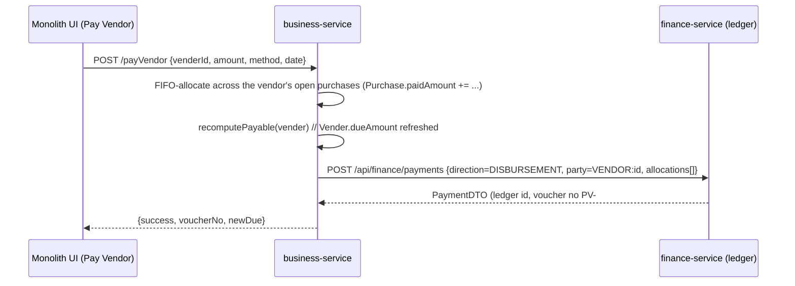
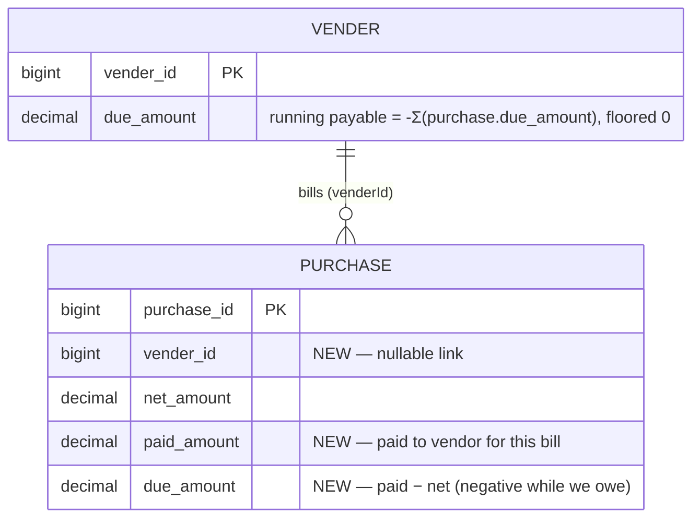

# finance — Phase 2: AP subledger (Vendor Payments) — Design

**Status:** F1 DONE ✅ (headed-Cypress green — `pay-vendor.cy.js` + `receive-payment.cy.js` regression, after rebuilding the finance-service jar so the `PV-` numbering shipped).** Includes the shared `SubledgerService` refactor + full Pay Vendor UI.

**Branch:** `feature/finance-ledger` · **Slice:** F1 (AP / Pay Vendor) · **Roadmap:** AR ✅ → **AP ✅** → F2 statements/aging → General Ledger
**Companion:** `finance-service-design.md` (AR / Phase 1). This mirrors AR faithfully on the payables side.

## 0. Decisions (locked with the user)
1. **Per-purchase FIFO** (mirror AR): payables tracked per `Purchase`; a vendor payment allocates FIFO oldest-first across the vendor's open purchase bills. `Vender.dueAmount` = Σ owed.
2. **History seeded as settled**: existing purchases get `paid_amount = net_amount, due_amount = 0`; `Vender.due_amount = 0`. Payables accrue only on new/edited on-credit purchases. (This also sidesteps historical purchases having **no vendor** — they never surface as payables.)

## 1. Blocking prerequisite discovered — purchases have no vendor link
`Purchase.venderId` and `PurchaseDTO.venderId` are **commented out**; the purchase form has **no vendor selector**. Vendors are only a standalone registry. AP-by-vendor is impossible without this link, so **F1 also establishes it**:
- add `Purchase.venderId` (nullable) + DTO field + a **Vendor** select on the purchase form,
- capture an **Amount Paid** on the purchase form so a purchase can be recorded **on credit** (paid < net → a payable).

**Rule:** vendor is required only for an **on-credit** purchase (one with a due). Cash / fully-paid purchases need neither a vendor nor a payable. Historical rows (no vendor, seeded settled) are unaffected.

## 2. Ownership seam (mirrors AR)
`business-service` **owns purchases + the vendor AP balance** (`Purchase`, `Vender.dueAmount` via `recomputePayable`). `finance-service` **owns the payment ledger** — the AP entry is a `DISBURSEMENT` (money out), module-agnostic and GL-ready.

business-service does the allocation (it owns purchases) and calls finance-service to **record** the ledger entry (best-effort — a ledger hiccup never blocks paying the vendor; reconcile later), exactly like `receivePayment`.

## 3. Data model

### business-service (`myplusdb`) — Flyway **V14**

`V14__ap_vendor_payables.sql`:
- `ALTER TABLE vender ADD COLUMN due_amount DECIMAL(19,2) NULL;`
- `ALTER TABLE purchase ADD COLUMN vender_id BIGINT NULL, ADD COLUMN paid_amount DECIMAL(19,2) NULL, ADD COLUMN due_amount DECIMAL(19,2) NULL;`
- **Seed history settled:** `UPDATE purchase SET paid_amount = COALESCE(net_amount,0), due_amount = 0 WHERE paid_amount IS NULL;`
- `UPDATE vender SET due_amount = 0 WHERE due_amount IS NULL;`
- Idempotent by the `IS NULL` guards.

Sign convention **mirrors AR** (`CustomerHistory.dueAmount = paid − bill`): `Purchase.dueAmount = paidAmount − netAmount`, negative while owing; `recomputePayable` = `−Σ(due)` floored at 0.

### finance-service (`myplusdb_finance`) — **no schema change**
`PartyType.VENDOR` and `PaymentDirection.DISBURSEMENT` already exist; `payments` already has `direction`. Only the **receipt numbering becomes direction-aware**:
- RECEIPT → `RCPT-######` (unchanged), DISBURSEMENT → `PV-######` (payment voucher).
- `nextReceiptNo` counts **by direction** within the tenant → new `PaymentRepository.countByDirectionScoped`.

## 4. business-service changes
- **Vender**: `+ BigDecimal dueAmount` (col `due_amount`).
- **Purchase**: `+ Long venderId`, `+ BigDecimal paidAmount`, `+ BigDecimal dueAmount`.
- **PurchaseDTO**: un-comment `venderId` (+ `venderName`); add `paidAmount`.
- **PurchaseService.add/update**: set `venderId`; `paidAmount = dto.paidAmount` (default = full bill → cash); **the vendor bill = `totalAmount` (qty × purchase rate = what we owe); NOTE `netAmount` is the sell-vs-cost PROFIT, not the payable**; `dueAmount = paid − totalAmount`; after save → `venderService.recomputePayable(vender)` (both old & new vendor on edit).
- **VenderService**:
  - `recomputePayable(Vender v)`: `owed = −Σ(open purchase due for v)` floored 0 → `v.setDueAmount(owed)`.
  - `payVendor(venderId, amount, method, paidOn, reference)`: FIFO across `PurchaseRepo.findOpenPurchasesByVendor` (bump `paidAmount`, move `dueAmount` toward 0) → `recomputePayable` → `financeClient.recordPayment(direction="DISBURSEMENT", partyType="VENDOR", partyId, partyName, amount, method, allocations[docType="PURCHASE", docId=purchaseId, docNo=purchaseInvoiceNo])` (best-effort). Returns `{success, voucherNo, allocated, onAccountAdvance, newDue}`.
- **PurchaseRepo**: `findOpenPurchasesByVendor(venderId)` (due<0, oldest first), `sumDueByVendor(venderId)`.
- **VenderController**: `POST /payVendor`. `financeClient` bean already wired in `TradeClientsConfig` (shared).

## 5. monolith changes (mirror Receive Payment)
- **Purchase form**: add a **Vendor** `<select>` (loads `getUserVender`) + an **Amount Paid** input (defaults to net = fully paid/cash). Submit sends `venderId` + `paidAmount`.
- **Vendor table**: a **Due** column + a **Pay** button (`.pay-vendor-btn`, stopPropagation vs row-edit) → `#PayVendorModal` (clone of `#ReceivePaymentModal`) → `business.js` `openPayVendor` / `submitPayVendor` → `POST /payVendor`.
- **Proxy**: monolith `/payVendor` → business-service (passthrough, like `/receivePayment`).

## 6. API
| Method | Path (business-service) | Purpose |
|---|---|---|
| POST | `/payVendor` | Pay a vendor: FIFO-allocate across open purchases, recompute payable, record DISBURSEMENT. |
| (reuse) | `/getUserVender` | now returns `dueAmount` per vendor for the Due column. |

## 7. Standards checklist
- Multi-tenancy: `venderId`/purchase reads org+user scoped (existing `findScoped`); anti-IDOR on `payVendor` (vendor must be in tenant).
- Money `BigDecimal(19,2)`; DTOs at the boundary; best-effort ledger call (settlement never blocked).
- Flyway-owned (`V14`), idempotent seed; `ddl-auto: validate`-safe.
- finance ledger call via the existing shared `FinanceClient` (no contracts change).

## 8. Test plan
- **Unit:** `recomputePayable` (owed = −Σ due, floored); FIFO allocation across purchases.
- **Cypress `pay-vendor.cy.js`:** create vendor → on-credit purchase (paid < net) → vendor shows a Due → `/payVendor` half → due halves → pay rest → due 0; voucher matches `PV-######`. Mirror of `receive-payment.cy.js`.
- **Regression:** `purchase.cy.js` (new vendor/paid fields don't break existing purchase create), `receive-payment.cy.js` (AR numbering still `RCPT-`).

## 9. Rebuild order
1. **finance-service** (direction-aware voucher numbering) — schema unchanged.
2. **business-service** (entities + V14 + PurchaseService/VenderService + controller).
3. **monolith** (purchase form vendor/paid fields + Pay Vendor UI + proxy).
`commerce-contracts` unchanged. Flyway V14 runs on business-service start (fresh + prod safe).

## 10. Cadence
Document → **Design (this)** → Implement (finance numbering → business domain/API → monolith UI) → Test (`mvn` unit + Testcontainers) → headed Cypress `pay-vendor.cy.js` GREEN → next (Phase F2 statements, then GL).
