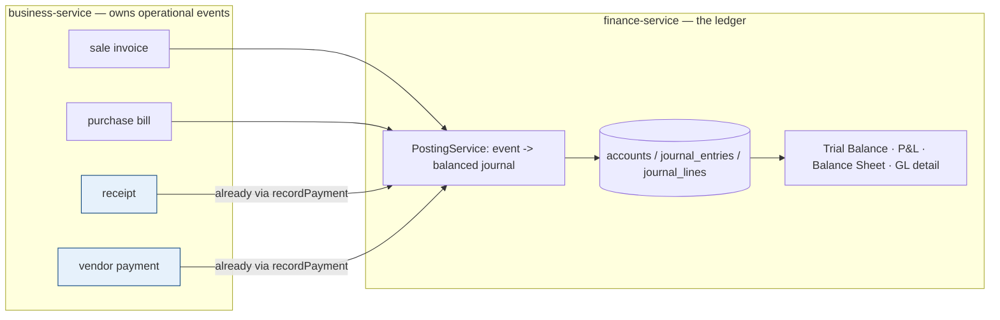
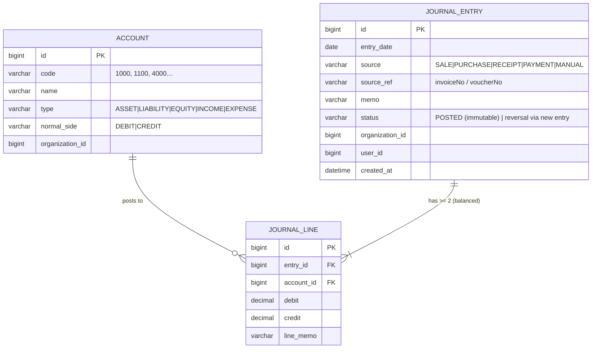

# finance — Phase F3: General Ledger (double-entry) — Design

**Branch:** `feature/finance-ledger` · **Slice:** F3 (GL) · **Roadmap:** AR ✅ → AP ✅ → F2 statements/aging ✅ → **F3 GL (this)**
**Companions:** `finance-service-design.md`, `finance-ap-vendor-payments-design.md`, `finance-f2-statements-aging-design.md`.

## 0. Why F3 now — and what it is
The subledgers (AR/AP) track *who owes what*. The **General Ledger** is the double-entry backbone underneath: every economic event becomes a **balanced journal** (Σdebits = Σcredits) posted to a **chart of accounts**, from which the standard financials fall out — **Trial Balance, P&L, Balance Sheet**. This is the **ERP** offering's core (svcMarquee "ERP"). The groundwork is already laid: finance-service is the party-agnostic money spine and `Payment` already carries GL-ready `debit_account`/`credit_account` slots.

## 1. Where it lives — finance-service
The GL belongs in **finance-service** (it *is* the ledger). New bounded-context content, additive to the existing payment ledger. **business-service pushes journals** for the events it owns (sales, purchases) the same way it already calls `recordPayment` — finance-service owns posting + reports; business-service never computes accounting.

## 2. Data model (finance-service `myplusdb_finance`, Flyway V2)

**Invariant (enforced on post):** every `JOURNAL_ENTRY` has ≥2 lines and `Σdebit == Σcredit`. Entries are **immutable** once POSTED; corrections are a new reversing entry (audit-grade, standard).

## 3. Chart of Accounts — seeded default (per org, editable later)
| Code | Account | Type | Normal |
|---|---|---|---|
| 1000 | Cash | ASSET | DEBIT |
| 1010 | Bank | ASSET | DEBIT |
| 1100 | Accounts Receivable | ASSET | DEBIT |
| 1200 | Inventory | ASSET | DEBIT |
| 2000 | Accounts Payable | LIABILITY | CREDIT |
| 2100 | Tax Payable | LIABILITY | CREDIT |
| 3000 | Owner's Equity | EQUITY | CREDIT |
| 3100 | Retained Earnings | EQUITY | CREDIT |
| 4000 | Sales | INCOME | CREDIT |
| 5000 | Cost of Goods Sold | EXPENSE | DEBIT |
| 5100 | Purchases / Expenses | EXPENSE | DEBIT |
Seeded per org by finance-service on first use (Flyway seeds a template; org copy created on demand).

## 4. Posting rules (accrual basis — the standard)
| Event | Debit | Credit |
|---|---|---|
| **Credit sale** (invoice) | AR (grand) | Sales (subtotal) + Tax Payable (tax) |
| ‑ COGS side (if line cost known — we have `Sell.costPrice`) | COGS (Σcost) | Inventory (Σcost) |
| **Cash sale** | Cash/Bank (grand) | Sales + Tax Payable |
| **Receipt** (AR) | Cash/Bank | AR |
| **Credit purchase** (bill) | Inventory (net) + Tax Payable? | AP (grand) |
| **Cash purchase** | Inventory | Cash/Bank |
| **Vendor payment** (AP) | AP | Cash/Bank |
Payments already reach finance (`recordPayment`) → posting hooks straight in. Sales/purchases post via a new `postJournal` push from business-service.

## 5. Reports
- **Trial Balance** — every account's Σdebit / Σcredit as-of a date; **totals must equal** (the GL's self-check).
- **General Ledger detail** — per-account journal lines with a running balance.
- **Profit & Loss** — Σincome − Σexpense over a period.
- **Balance Sheet** — assets = liabilities + equity as-of a date (P&L net → retained earnings).

## 6. API (finance-service `/api/finance/gl`)
| Method | Path | Purpose |
|---|---|---|
| GET/POST | `/gl/accounts` | list / add chart-of-accounts (org-scoped) |
| POST | `/gl/journal` | post a balanced manual journal (validates Σdr=Σcr) |
| POST | `/gl/post` | post a journal from an event (SALE/PURCHASE/…) via posting rules — called by business-service |
| GET | `/gl/trial-balance?asOf=` | trial balance |
| GET | `/gl/account/{id}/ledger` | GL detail for one account |
| GET | `/gl/pnl?from=&to=` · `/gl/balance-sheet?asOf=` | financial statements |

**commerce-contracts:** `FinanceClient.postJournal(JournalPostRequest)` (event + amounts) so business-service posts sale/purchase journals (best-effort, like payments). Monolith proxies the read reports for the UI.

## 7. Standards
- **Multi-tenancy:** accounts + entries org-scoped; posting stamps org/user.
- **Double-entry invariant** enforced at post; **immutability** (no edit/delete of POSTED entries — reverse instead) = audit-grade.
- **Performance:** trial balance / statements are SQL aggregations (`SUM(debit)/SUM(credit) GROUP BY account`), indexed on `(organization_id, account_id)` and `journal_entry(entry_date)`; posting is one insert per event, off the hot path (best-effort from business-service like the ledger call).
- **Reuse:** posting is party-agnostic; the same `PostingService` serves every vertical (education fees, welfare donations post their own journals later).

## 8. Phasing (GL is big — ship in gated slices, each headed-Cypress green)
- **F3a — double-entry core: DONE ✅ (headed-Cypress green `gl.cy.js` + `GlValidateTest`).** finance-service: `Account`/`JournalEntry`/`JournalLine` (+ `AccountType`/`NormalSide`), `GlService` (seeded default CoA per org via `ensureDefaults`; pure `validate` = ≥2 lines/no-negatives/Σdr=Σcr; `postJournal`; `trialBalance` netted + self-check; `accountLedger` running balance), `GlController` `/api/finance/gl/*`, **Flyway V2**, `GlValidateTest` (7 pure unit tests). monolith: `FinanceRestClient` + `GlController` proxy (`/gl/ensureDefaults`,`/gl/accounts`,`/gl/journal`,`/gl/trialBalance`,`/gl/accountLedger`). Cypress `gl.cy.js`. *Proves the engine.*
- **F3b — auto-posting: DONE ✅ (headed-Cypress green `gl-posting.cy.js`).** finance-service `PostingService` (posting rules by account code via GlService: SALE Dr Cash(paid)+AR(rest)/Cr Sales+Tax [+COGS Dr/Inventory Cr]; PURCHASE Dr Inventory/Cr Cash+AP; RECEIPT Dr Cash/Cr AR; PAYMENT Dr AP/Cr Cash) + `PostEventRequest` + `/gl/post-event` endpoint + **`PaymentService.record` hook** (auto-posts receipts/payments, best-effort). commerce-contracts: `PostingEventRequest` + `FinanceClient.postEvent`. business-service: `SagaSellService` posts SALE (COGS from `SagaLine.costPrice`), `PurchaseService` posts PURCHASE (best-effort, new sale/purchase only — edits deferred). Cypress `gl-posting.cy.js`. Historical backfill deferred.
- **F3c — financial statements: IMPLEMENTED (awaiting build+Cypress).** finance-service `GlService.profitAndLoss(from,to)` (income − expense = net profit) + `balanceSheet(asOf)` (Assets = Liabilities + Equity + current net income; `balanced` self-check) + `JournalLineRepository.sumByAccountInRange`; `GlController` `/gl/pnl` + `/gl/balance-sheet`. monolith proxies `/gl/pnl` + `/gl/balanceSheet`; business.js `openTrialBalance`/`openPnl`/`openBalanceSheet` dialogs + Trial Balance/P&L/Balance Sheet toolbar buttons. Cypress `finance-statements.cy.js`. **Period lock/close DEFERRED** (follow-up). Build: finance-service + monolith (contracts/business unchanged).

## 9. Decisions to confirm (gate before F3a)
1. **Accounting basis** — **accrual** (recommended, standard: invoice posts AR+Sales immediately) vs cash (post only on payment).
2. **Auto-post source** — **business-service pushes `postJournal`** for sales/purchases (recommended, mirrors `recordPayment`) vs finance derives what it can from payments only (insufficient).
3. **COGS at sale** — post COGS/Inventory using `Sell.costPrice` (recommended — we already capture it) vs periodic/deferred.
4. **Phasing** — **F3a → F3b → F3c** as above (recommended), or all-in-one.

## 10. Cadence
Document → **Design (this)** → confirm decisions → **F3a** (schema V2 + CoA + manual journal + trial balance → Cypress) → F3b (auto-post) → F3c (statements). Each slice: `mvn` unit (posting balances, trial-balance equality) + headed Cypress green before the next.
