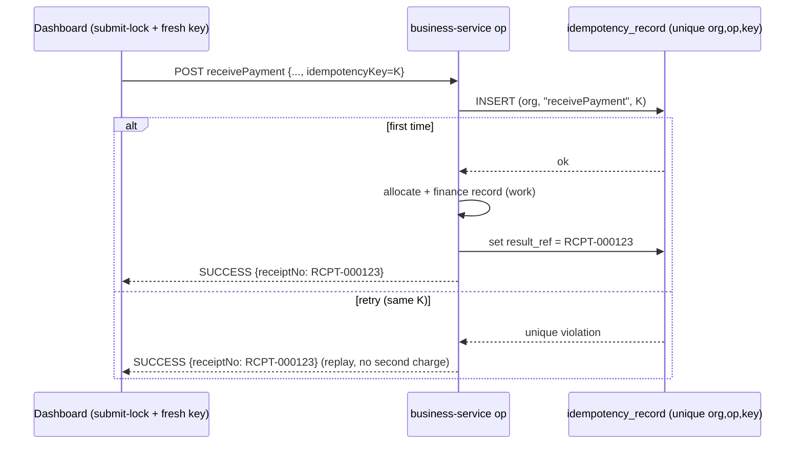

# Audit #5 — Idempotency on money operations

Companion to `pos-retail-standards-audit.md` (#5). Extends the SF-3 sale-idempotency pattern to the remaining money
ops so a double-click / retry / network-replay can't double-charge, double-stock, or double-post. Cadence:
Document → **Design** → Implement → headed Cypress → next.

## 1. Problem
Only the **sale** is idempotent today (SF-3: `CustomerHistory.idempotency_key` + unique `(org, key)` + insert-first
race-catch). These money ops are **not**, so a retry runs them twice:

| Op | Double-submit effect today |
|---|---|
| `addPurchase` | two stock-ins + two vendor payables + two GL PURCHASE journals |
| `receivePayment` (AR) | allocates the receipt twice → customer over-credited, two ledger receipts |
| `payVendor` (AP) | pays the vendor twice → two disbursements, payable double-cut |
| `postEvent` (GL) | the #4 outbox may deliver the same event twice → duplicate journal (we *accepted* this in #4, to close here) |

## 2. Design — one shared guard, reused (DRY/SOLID)
The sale embeds its key in its own row. The payment ops span **business allocation + a finance call**, so dedup must
guard the *whole operation*, not a single row. So introduce a shared, operation-agnostic guard in business-service
(mirrors how `SubledgerService` / `PostingService` centralize their concerns):

- **`idempotency_record`** table (business-service, Flyway **V18**): `id, organization_id, operation, idem_key,
  result_ref, created_at`, unique `(organization_id, operation, idem_key)`.
- **`IdempotencyService`** — `find` (pre-check) + `record` (insert the row **with** its result_ref in the caller's tx):
  ```
  op(..., key):
     1. if key present: prior = find(org, op, key); if prior present → REPLAY(prior)   // committed earlier
     2. run the work  (inside the caller's @Transactional) → resultRef
     3. record(org, op, key, resultRef)   // ATOMIC with the work (same tx)
  ```
  When the caller passes **no key** (legacy client), the work runs directly — no behavior change.

  > **Why NOT insert-first / claim-then-complete (the trap):** a separate-tx (`REQUIRES_NEW`) claim is invisible to
  > the caller's snapshot under MySQL **REPEATABLE READ** (the snapshot is fixed at the tx's first read, before the
  > claim commits), so a same-tx `complete()` can't find the row to stamp `result_ref` → replays return null. Instead
  > insert the row **with** the ref in the op's own tx. Sequential double-submits are caught by the pre-check (a fresh
  > request = fresh snapshot, sees the committed row); a concurrent race hits the unique index at commit → that op
  > rolls back (no double-apply) → its retry then replays.

Each op wraps its body in `once(...)`; on REPLAY it returns `SUCCESS` with the stored ref (idempotent replay — the
client sees success, never a second charge), exactly like SF-3 returning the same invoice number.



### 2.1 Client side (end-to-end, like SF-3)
The dashboard generates **one fresh key per submit** (`crypto.randomUUID()`) and **locks the button** until the
response returns, then sends it as `idempotencyKey`. Touch points: Receive-Payment modal, Pay-Vendor modal, Purchase
form (`business.js`). Same idea `main.js` already does for checkout.

### 2.2 GL postEvent dedup (closes the #4 debt)
The #4 outbox row gets a stable **`event_key`** (UUID, generated at enqueue). finance-service dedups on it: a unique
`(organization_id, event_key)` on `journal_entries` (finance Flyway) + a pre-check in `postJournal`; a duplicate
delivery is a no-op (returns the existing entry). This makes outbox re-delivery safe — the last open item from #4.
Legitimate re-posts (edit → SALE_RETURN+SALE for the same invoice) each carry their **own** `event_key`, so they are
never falsely deduped.

## 3. Decisions (defaults chosen; confirm the two forks)
| # | Decision | Default (recommended) | Alternative |
|---|---|---|---|
| D1 | Where the guard lives | **Shared `idempotency_record` + `IdempotencyService`** (reused by all ops + future services) | Per-table `idempotency_key` columns |
| D2 | Key source | **Client-generated per submit + submit-lock** (true end-to-end dedup, matches SF-3) | Server-generated (no protection against client double-fire) |
| D3 | Include GL `postEvent` dedup this slice | **Yes** — closes the #4 accepted-duplicate debt (outbox `event_key` + finance unique) | Defer GL dedup to its own slice |
| D4 | Replay response | **SUCCESS + stored ref** (client sees success, no double charge) | Distinct 409/"duplicate" status |

## 4. Test plan (headed Cypress — `idempotency.cy.js`)
1. **receivePayment** twice with the SAME `idempotencyKey` → one allocation; customer due drops once; both calls
   return SUCCESS with the same `receiptNo`.
2. **payVendor** twice, same key → vendor paid once; one PV- voucher; payable cut once.
3. **addPurchase** twice, same key → one stock-in + one payable + one PURCHASE journal (trial balance moves once).
4. **Different keys** → processed independently (control: not over-deduping).
5. **GL replay** → posting the same outbox `event_key` twice yields one journal; trial balance balanced.

## 5. Build surface
business-service (V18 + `IdempotencyRecord`/repo/`IdempotencyService` + key param on the 3 ops + outbox `event_key`) ·
commerce-contracts (`PostingEventRequest.eventKey`) · finance-service (journal `event_key` unique + dedup in
`postJournal`, Flyway) · monolith (pass `idempotencyKey` through the 3 proxies) · `business.js` (keys + submit-lock).
