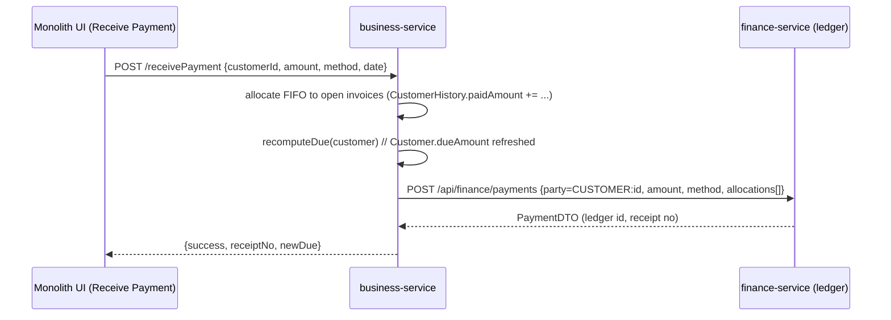
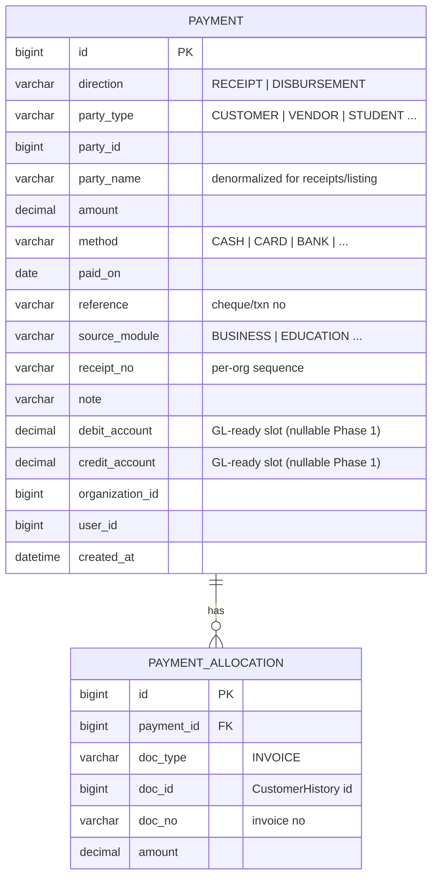

# finance-service — Payment Ledger (AR subledger) — Design

**Branch:** `feature/finance-ledger` · **Slice:** Receive Payment (Phase 1) · **Roadmap:** AR subledger → AP subledger → General Ledger

## 1. Why a separate shared service

Receiving/allocating money against a party (customer today; vendor, student, donor later) is a **cross-cutting capability** every vertical needs. Per the compose-don't-duplicate standard it lives in **one shared `finance-service`**, not inside business-service. Every module records receipts through the same ledger, so the future General Ledger (Task #3) posts from a single, consistent source.

**Decision:** build the **subledger first**, GL-ready. A payment is stored as a journal-friendly entry (date, amount, method, party, source doc, and debit/credit account slots) so the GL later *consumes* these rows with no rework.

## 2. Scope (Phase 1)

- Record a **receipt** against a party (`CUSTOMER`), with method/date/reference/note.
- **Allocate** the receipt to the party's open source documents (invoices) — **FIFO oldest-first by default**, with optional explicit allocations; any excess is **on-account credit** (unallocated).
- Expose **payment history** and **total received** per party.
- Multi-tenant scoped (org + user NULL-fallback), method-secured, Flyway-owned schema.
- **Not** in Phase 1: vendor/AP (Phase 2), double-entry posting/trial balance (Phase 3), refunds/reversals UI (recorded as negative entries later).

## 3. Ownership seam (important)

`business-service` **owns invoices + the customer AR balance** (`CustomerHistory`, `Customer.dueAmount` via `recomputeDue`). `finance-service` **owns the payment ledger** (the audit record of money in, GL-ready, reusable).

business-service does the invoice allocation (it owns invoices) and calls finance-service to **record** the ledger entry. finance-service stays module-agnostic: it records what it's told (party + amount + allocations), so education/pharma/ecommerce reuse it identically.

## 4. Data model (finance-service, `myplusdb_finance`)

`direction=RECEIPT` (AR) in Phase 1; `DISBURSEMENT` reserved for AP (Phase 2). `debit_account`/`credit_account` are nullable placeholders now, populated when the GL lands.

## 5. API (finance-service, `/api/finance`)

| Method | Path | Purpose |
|---|---|---|
| POST | `/api/finance/payments` | Record a payment (+ allocations). Returns PaymentDTO. |
| GET  | `/api/finance/payments?partyType=&partyId=` | Payment history for a party (scoped). |
| GET  | `/api/finance/payments/summary?partyType=&partyId=` | Total received (scoped). |

## 6. business-service integration

- `FinanceClient` (`@HttpExchange` → `lb://finance-service`, JWT/org headers propagated) — `recordPayment(PaymentRecordDTO)`.
- `POST /receivePayment` (business-service): allocate FIFO to the customer's open `CustomerHistory` invoices (bump `paidAmount`), `recomputeDue`, then `financeClient.recordPayment(...)` (best-effort — a ledger hiccup never blocks the settlement; reconcile later). Returns receipt + new due.
- **Related fix (same branch):** `CustomerController.addCustomer` must stop mapping the whole DTO over the entity on edit — preserve derived `dueAmount`/`dueDate`, update only editable profile fields.

## 7. Standards checklist

- Multi-tenancy: `organization_id` + `user_id` NULL-fallback scoping on all reads/writes (findScoped), anti-IDOR on lookups.
- DB URL: `connectionTimeZone=%2B05:00&forceConnectionTimeZoneToSession=true` (timezone standard).
- Flyway-owned schema (`V1__baseline.sql`), `open-in-view:false`, method security via `common-security` `HeaderAuthFilter`.
- Registered: root pom module, `service-parent`, gateway route `/api/finance/**` (CircuitBreaker + JwtAuthenticationFilter), `config-server/configs/finance-service.yml`, `start-all.ps1`.
- Tests: pure-logic unit (FIFO allocation) always-run + Testcontainers repo/scoping (disabledWithoutDocker); Cypress for the Receive Payment UI.

## 8. Cadence

Document (this) → scaffold finance-service → domain + API → business-service integration + clobber fix → monolith proxy + Receive Payment UI → Cypress + docs.
