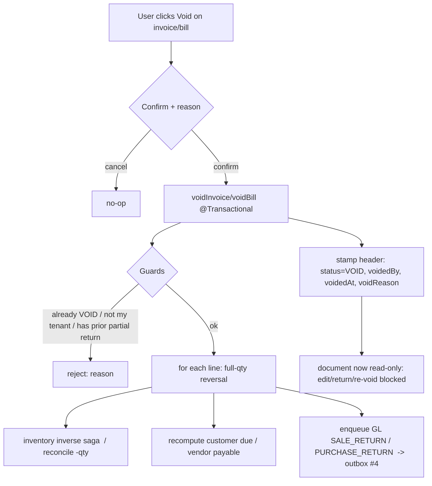

# Audit #3 — Void / Cancel (first-class, audited, books-safe)

Companion to `pos-retail-standards-audit.md` (remediation #3). Builds on #1 (purchase return), #2 (shared reversal
posting), #4 (GL outbox). Cadence: Document → **Design** → Implement → headed Cypress → next.

## 1. Problem
`deleteSell` / `deletePurchase` are **hard row-deletes**. They bypass everything that keeps the books and stock
true: no inventory restore, no AR/AP recompute, no GL reversal, no audit trail. A deleted invoice silently drifts
on-hand stock, the customer's due, and the General Ledger — the single most dangerous "will bite later" gap, and one
every vertical (pharmacy, e-com, education) inherits through the shared core.

## 2. Goal
Replace destructive delete with a **first-class, audited Void** that reverses the *entire* document exactly the way
a full return does, marks it `VOID` (soft — the record and its audit trail survive), and blocks any further mutation.

## 3. Design — reuse, don't reinvent
Void is **a full-document return + a status flag**. The reversal machinery already exists per line in `saleReturn`
(inventory inverse saga → AR recompute → GL `SALE_RETURN` → `SaleReturn` audit row) and in `PurchaseService.purchaseReturn`
(reconcile −qty → AP recompute → GL `PURCHASE_RETURN`). Void iterates every line of the document at full quantity
through that same path, then stamps the header.



### 3.1 What changes
- **New header state** on `CustomerHistory` (sales) and `Purchase` (bills): `status` = `ACTIVE | VOID` (default
  `ACTIVE`), plus `voided_by`, `voided_at`, `void_reason`. Flyway forward migration (business-service **V17**).
- **`voidInvoice(customerHistoryId, reason)`** on the sale side, **`voidBill(purchaseId, reason)`** on the purchase
  side — both `@Transactional`, both delegating to the existing reversal per line at full quantity, then stamping the
  header. GL reversal goes through the **#4 outbox** (`glOutboxService.enqueue`), so a void posts reliably like any
  other event.
- **Endpoints:** `POST /voidSell` (`customerHistoryId`, `reason`), `POST /voidPurchase` (`purchaseId`, `reason`) in
  business-service; monolith proxies mirror them.
- **`deleteSell` / `deletePurchase` retired to void:** the dashboard's delete action calls void instead of the
  hard-delete route (destructive delete is no longer reachable from the UI). The old routes stay only as
  SUPER-only/no-op stubs so nothing 404s.
- **Read-only enforcement:** `updateSell` / `saleReturn` / `updatePurchase` / `purchaseReturn` reject a document whose
  `status == VOID` ("This document is voided.").
- **Audit:** who/when/why on the header now; the append-only cross-event audit log is #6 (this slice stamps the
  header fields, #6 will add the immutable journal).

### 3.2 Guards (decisions baked in — see §4)
- Anti-IDOR: only a document in the caller's tenant can be voided.
- Idempotent: voiding an already-`VOID` document is a friendly no-op reject (not a double reversal).
- **Partial-return conflict:** a document that already has a *partial* return is **rejected** ("Return already
  recorded; void not allowed") — voiding it would double-reverse the already-returned quantity. (Full history stays
  auditable; the operator reconciles manually.) This keeps the reversal arithmetic exact without a per-line
  net-of-returns computation in this slice.

## 4. Decisions (defaults chosen; confirm before code)
| # | Decision | Default (recommended) | Alternative |
|---|---|---|---|
| D1 | Delete vs Void | **Void replaces delete** in the UI; hard-delete unreachable | Keep delete for SUPER only |
| D2 | Scope this slice | **Sales + purchases** (mirror the two return paths) | Sales only, purchases next |
| D3 | Payments (Receive/Pay) void | **Deferred** — separate slice (needs allocation unwind) | Include now |
| D4 | Already-returned invoice | **Reject void** (see §3.2) | Compute net-of-returns and void the remainder |
| D5 | Permission | **Deferred** — void inherits the same protection the retired delete had (LOGIN_PRIVILEGE + tenant scoping); a dedicated `VOID_INVOICE` privilege lands with the audit-log slice (#6) to avoid an auth-service change mid-slice | New privilege now |

**Implementation note (line handling):** like a *full* return, `voidSell` removes the invoice's Sell lines and
`voidBill` zeroes the bill quantity. The **header survives** (`CustomerHistory` / `Purchase`) stamped `VOID` with
zeroed totals, so the trace lives on in the customer/vendor statement + the reversing GL journal; the line-level
sale/purchase report simply drops the voided document (same as a delete, but books-correct and auditable).

## 5. Test plan (headed Cypress — `void-cancel.cy.js`)
1. **Sale void reverses everything:** seed product+stock → credit sale → record on-hand + customer due + trial
   balance → `POST /voidSell` → assert on-hand restored, customer due back to prior, GL balanced with a
   `SALE_RETURN` reversing entry (outbox row `POSTED`), invoice `status==VOID`.
2. **Void is read-only after:** a second `/voidSell` on the same invoice → friendly reject; `/updateSell` on it →
   reject; `/saleReturn` on it → reject.
3. **Purchase void:** purchase → `/voidPurchase` → on-hand reduced, vendor payable cut, GL `PURCHASE_RETURN`, bill
   `status==VOID`.
4. **Partial-return guard:** sale → partial `saleReturn` → `/voidSell` rejected with the guard message.

## 6. Build surface
business-service (entities + V17 + void services/endpoints + read-only guards + `VOID_INVOICE` seed) + monolith
(proxies + dashboard Void wiring). Contracts unchanged (reuses `PostingEventRequest`). finance unchanged.
```
