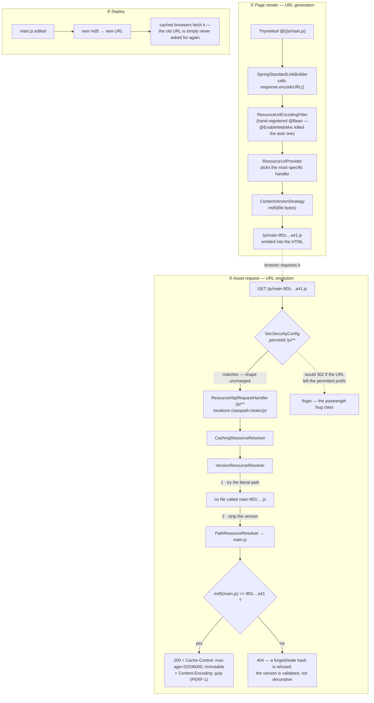

# Front-end performance audit — slow-connection delivery

**Date:** 2026-08-13
**Scope:** monolith UI delivery (Thymeleaf templates + `src/main/resources/static`), measured against `businessDashboard.html`
**Status:** **PARTLY SHIPPED.** PERF-1 / PERF-3 / PERF-3b shipped; PERF-8 (lean cached product picker,
618KB → 77KB) shipped; the **responsiveness fix is shipped and green** (see the section at the end —
`responsive.cy.js` 53 passing). **PERF-4 ✅ gated and green** — `perf-lazy-export.cy.js` 9/9 (the ~903KB pdfmake payload no longer loads on
any dashboard). ⚠ Still open: `@EnableWebMvc` makes `cache.period` inert (PERF-2), plus PERF-5/6/7.

*(The audit body below is the original review, kept as written. Findings are tracked to closure in the
sections appended at the end, not by editing the findings in place.)*

---

## 1. Headline

A single business-dashboard page load transfers **~4.3 MB across ~80 requests, uncompressed, and re-transfers most of it on every navigation.**

| | Measured |
|---|---|
| JS payload | **4,148,826 B (4.05 MB)** across **52 files** |
| HTML payload | **189,640 B (190 KB)** — uncompressed |
| CSS files | 20 `<link>` tags |
| Compression | **none, anywhere in the stack** |
| Static caching | **effectively none** (see F1) |

On a 1 Mbit/s effective link that is roughly **35 seconds of pure transfer** before the first AJAX call fires. Three of the findings below are configuration-level and would cut that by ~85% without touching application logic.

The causes are independent and stack multiplicatively: bytes are never compressed (F2), they are never cached (F1), and there are far more of them than the page needs (F3–F5).

---

## 2. Findings, ranked by impact

### F1 — `@EnableWebMvc` silently voids the static-resource caching config ⚠️ ROOT CAUSE

`src/main/java/com/spring/MvcConfig.java:29` carries `@EnableWebMvc`.

That annotation **disables `WebMvcAutoConfiguration` wholesale.** Two consequences, both invisible in config review:

1. `spring.web.resources.cache.period=3600` in `application-prod.properties:10` **never takes effect.** The property is read by the auto-configuration that `@EnableWebMvc` just turned off. The prod profile looks like it enables caching; it does not.
2. The hand-rolled handler that replaces it —

```java
// MvcConfig.java:116
@Override
public void addResourceHandlers(ResourceHandlerRegistry registry) {
    if (!registry.hasMappingForPattern("/**")) {
        registry.addResourceHandler("/**")
                .addResourceLocations(CLASSPATH_RESOURCE_LOCATIONS);
    }
}
```

— registers `/**` with **no `.setCachePeriod()` and no `.resourceChain()`**. Resources go out with no `Cache-Control`, so the browser falls back to conditional revalidation.

**Effect on a slow link:** the byte cost of a repeat page load may drop, but the browser still issues **~80 conditional GETs, serialised over ~6 connections**. At 300 ms RTT that is several seconds of dead time on *every* navigation, and this app navigates by full page load. This is the finding most likely to match "slow when the internet is slow" — high latency hurts here even more than low bandwidth.

This one finding also explains why the prod-hardening work (P3) did not produce the expected improvement: the setting it added was inert.

### F2 — No HTTP compression anywhere in the stack

`server.compression.enabled` appears in **zero** files across the monolith, all 12 microservices, the api-gateway, and the deployment configs. There is no nginx config in the repo either, so nothing upstream compensates.

Measured gzip ratios on the actual assets:

| Asset | Raw | gzip -9 | Saved |
|---|---|---|---|
| `businessDashboard.html` | 189,640 | 40,760 | **78%** |
| `business.js` | 212,974 | 61,571 | **71%** |
| `jquery-3.3.1.js` | 282,115 | 80,902 | **71%** |
| `chart.umd.min.js` | 205,242 | 69,392 | **66%** |
| `pdfmake.min.js` | 1,093,430 | 452,589 | **58%** |

Text assets compress 58–78%. **~4.2 MB → ~1.3 MB from one config block.** This is the single highest-value change in the audit relative to its risk.

Note: compression is a servlet-container concern (`ServletWebServerFactoryAutoConfiguration`), which `@EnableWebMvc` does *not* disable — so `server.compression.*` will work even before F1 is fixed.

### F3 — 2.4 MB of PDF/export libraries load eagerly on every page

Loaded unconditionally in `templates/fragments/header.html` and `businessDashboard.html:2795`:

| Library | Size | Purpose |
|---|---|---|
| `jQExp/pdfmake.min.js` | 1,093,430 | DataTables PDF export button |
| `jQExp/vfs_fonts.js` | 926,233 | pdfmake's embedded font blob |
| `js/jspdf.min.js` | 234,558 | receipt/invoice printing |
| `js/jspdf.plugin.autotable.js` | 69,794 | ditto |
| `jQExp/jszip.min.js` | 101,953 | Excel export button |
| **Total** | **2,425,968 (2.31 MB)** | |

**This is 58% of the page's JS**, and it exists to service export buttons and the print path — actions the large majority of sessions never invoke. Every cashier ringing up a sale pays 2.3 MB for a PDF button they don't press.

These are the textbook candidates for dynamic `import()` / on-demand injection: load on first click of an export/print button, not at page load.

### F4 — Two jQuery versions load, and the larger one is a non-minified dev build

`templates/fragments/header.html:57-58`:

```html
<script th:src="@{/js/jquery.min.js}"></script>      <!-- jQuery 1.11.2  —  95,931 B -->
<script th:src="@{/js/jquery-3.3.1.js}"></script>    <!-- jQuery 3.3.1  — 282,115 B -->
```

Two distinct problems:

- **jQuery 1.11.2 is loaded and then immediately overwritten** by 3.3.1. It is 96 KB of pure waste — unless something between the two tags depends on 1.x, which nothing does here (they are adjacent lines).
- **The 3.3.1 tag points at the unminified development build.** `js/jquery-3.3.1.min.js` (86,929 B) sits in the same directory, unused. That is 195 KB of comments and whitespace shipped to production.

Fixing both: **378 KB → 87 KB**, one-line change, no behavioural difference.

### F5 — Render-blocking third-party font request

`templates/fragments/header.html:8-9` fetches Inter (7 weights) from `fonts.googleapis.com`. On a slow or congested link this costs a **DNS lookup + TLS handshake + CSS fetch + font fetches to a second origin**, all before text paints. `preconnect` is present, which helps the handshake but not the round-trip count.

For a POS/business app — often on constrained or captive networks, sometimes behind filtering that blocks Google origins entirely — self-hosting the two or three weights actually used is both faster and more reliable. Seven weights are declared; the app almost certainly uses three.

### F6 — 20 CSS `<link>` tags, unbundled

`templates/fragments/header.html` emits 20 stylesheets. Individually small, but each is a request, and under HTTP/1.1 the browser parallelises only ~6 per origin. Combined with the 52 JS files this is where the ~80-request figure comes from. Bundling matters far less than F1–F3 but is the natural companion to fixing them.

### F7 — Full-catalog fetches on the hot path

`business.js:502` and `business.js:1883` both issue:

```js
$.get(serverContext + "catalogProducts?size=2000", ...)
```

The entire product catalogue (up to 2000 rows) is pulled into the browser to populate a `<select>`, on every sell/purchase screen open **and again on every line edit** (line 502 is inside the edit-line path, deliberately re-fetching to dodge a population race). For a tenant with a real catalogue this is a multi-hundred-KB JSON on a hot, repeated path.

The barcode-lookup endpoint (`lookupProduct`, `business.js:322`) already demonstrates the better pattern. A server-side typeahead against `searchable-selects.js` would remove the bulk fetch entirely. This is application work, not config — larger slice, lower urgency than F1–F4.

### F8 — Dead weight in the served directory

`static/` is 25 MB. Two items stand out:

- `static/b.jpg` — **3.4 MB**, referenced by no template or stylesheet (grepped).
- `static/jsPDF-1.3.2/` — **5.7 MB** of vendored library *examples* (`examples/js/editor.js`, bundled jQuery 1.7.1, sample PNGs). The app loads `js/jspdf.min.js`, not this tree.

Also `js/business/` duplicates `jQExp/` wholesale (`pdfmake.min.js`, `vfs_fonts.js`, `jquery-3.3.1.js`, `jquery.dataTables.min.js` are each stored twice, ~2.2 MB duplicated).

None of this is *served* on the dashboard path, so it does not slow users down — but it inflates the jar and the Docker image, which slows every deploy. Cleanup is safe and cheap.

---

## 3. Projected effect

Business dashboard, first load, 1 Mbit/s link:

| Stage | Transfer | Est. time |
|---|---|---|
| Today | ~4.3 MB | ~35 s |
| + F2 compression | ~1.35 MB | ~11 s |
| + F4 jQuery fix | ~1.26 MB | ~10 s |
| + F3 lazy PDF libs | **~0.5 MB** | **~4 s** |
| + F1 caching (repeat loads) | **~0 MB, ~0 requests** | **near-instant** |

**F1 + F2 + F4 are configuration and one-line template edits.** They are ~90% of the benefit and carry close to zero behavioural risk. F3 is a contained JS change. F5–F8 are follow-ups.

---

## 4. Proposed slice plan

Each slice is independently shippable and gated by a headed Cypress run, per the standing cadence.

| Slice | Change | Risk | Files |
|---|---|---|---|
| **PERF-1** | Enable `server.compression` (monolith) — **✅ DONE, 6/6 green** | Very low | `application.properties` |
| **PERF-2** | Fix F1: set an explicit cache period + `resourceChain` with `VersionResourceResolver` on the `/**` handler, so assets can be cached **immutably** and still bust on deploy. Re-evaluate whether `@EnableWebMvc` is needed at all | Low–medium | `MvcConfig.java`, `application*.properties` |
| **PERF-3** | Drop jQuery 1.11.2; point at `jquery-3.3.1.min.js` — **✅ DONE, 6/6 green** | Low | `fragments/header.html`, `login.html` |
| **PERF-4** | Lazy-load pdfmake/vfs_fonts/jszip + delete dead jsPDF — **✅ DONE, 9/9 green**. Split into 4a (dead jsPDF, 88KB gz) + 4b (lazy pdfmake, 903KB gz). Design: `perf4-lazy-export-design.md` | Medium | `fragments/header.html`, `business/education/agriculture.js`, **new** `common/lazy-export.js` |
| **PERF-5** | Self-host the 3 Inter weights actually used; drop the Google Fonts hop | Low | `fragments/header.html`, `static/fonts/` |
| **PERF-6** | Delete `b.jpg`, `jsPDF-1.3.2/`, and the `js/business/` ↔ `jQExp/` duplicates | Low | `static/` |
| **PERF-7** | Replace `catalogProducts?size=2000` with a server-side typeahead | Medium–high | `business.js`, `searchable-selects.js`, catalog-service |

### A caution on PERF-2

`@EnableWebMvc` has been on `MvcConfig` since early in the project's life, and removing it re-enables a large amount of Boot auto-configuration at once — message converters, content negotiation, static-path defaults. It is the *correct* long-term fix, but it is not a one-liner and should not ride along with a caching change. **PERF-2 should first add explicit `.setCachePeriod()` + `.resourceChain()` to the existing hand-rolled handler**, which fixes the caching regardless of the annotation. Removing `@EnableWebMvc` is a separate, later decision with its own gate.

### A caution on PERF-2 versioning

Turning on long-lived caching **without** content-hash versioning would mean a deploy cannot reach browsers that already cached the old asset. `VersionResourceResolver` (content-hash URLs) must land in the *same* slice as the long cache period — never after it.

---

## 4b. PERF-1 — implemented, awaiting gate

**Changed:** `src/main/resources/application.properties` only.

```properties
server.compression.enabled=true
server.compression.min-response-size=1024
server.compression.mime-types=text/html,text/plain,text/xml,text/css,text/javascript,application/javascript,application/json,application/xml,image/svg+xml
```

The same file's `spring.web.resources.cache.*` block also gained a comment recording that those two
properties are inert under `@EnableWebMvc` (F1), so the next reader does not try to fix prod caching there.

**Scope narrowed from the original plan, deliberately.** PERF-1 was written as "monolith + api-gateway".
Checking before implementing showed **the browser never calls the gateway directly** — there is no
reference to `:8765` in any application JS or template; all AJAX targets `serverContext` (the monolith),
which proxies onward server-side via `GatewayClient`. Gateway compression would therefore only compress a
**server-to-server** hop (localhost in dev, same VPC in prod), costing CPU on both ends for no benefit to
a user on a slow link. **Not done, and not needed unless the monolith and gateway are deployed to
separate hosts across a constrained network** — say so and it is a two-line follow-up.

**Why this is safe to enable:**

- No SSE/streaming endpoints exist (`SseEmitter`, `StreamingResponseBody`, `text/event-stream` return
  nothing across `src/main/java`) — those are the responses gzip buffering would break.
- `text/csv` is excluded, so the report exports in `SellController:104` and
  `FinanceReportController:78` stream unchanged.
- Compression is applied by `ServletWebServerFactoryAutoConfiguration` (a servlet-container concern),
  which `@EnableWebMvc` does **not** disable — so unlike F1's caching properties, this one is live.

**Measured live after rebuild+restart** (`curl`, ten largest assets, raw vs `Accept-Encoding: gzip`):

| Asset | Raw | gzip | Saved |
|---|---|---|---|
| `pdfmake.min.js` | 1,093,430 | 452,255 | 58% |
| `vfs_fonts.js` | 926,233 | 451,096 | 51% |
| `jquery-3.3.1.js` | 282,115 | 81,620 | 71% |
| `jspdf.min.js` | 234,558 | 73,445 | 68% |
| `business.js` | 212,974 | 61,902 | 70% |
| `chart.umd.min.js` | 205,242 | 69,659 | 66% |
| `moment.js` | 138,945 | 29,737 | 78% |
| `bootstrap-datetimepicker.js` | 106,518 | 16,067 | 84% |
| `jquery.dataTables.min.js` | 82,577 | 28,195 | 65% |
| `main.js` | 62,845 | 21,055 | 66% |
| **Total** | **3,345,437** | **1,285,031** | **61%** |

Responses carry `Content-Encoding: gzip` with `Content-Length` absent (chunked) — the predicted signature.

One correction to the pre-implementation reasoning: Tomcat labels `business.js` as **`text/javascript`**, not
`application/javascript`, so it is the `text/javascript` entry that actually carries JS here.
`application/javascript` remains listed (other containers and hand-set Content-Types use it), but the
audit's claim that Boot's default list omitting `application/javascript` was the live risk did not hold —
`text/javascript` is in Boot's default list. **The measured win is real either way; the stated reason was
half wrong.** Listing both is still correct.

**Gate: ✅ 6/6 GREEN** (headless Electron, Cypress 13.17.0 — a headed confirmation run is still the
convention's gate). `cypress/e2e/ui/perf-compression.cy.js`.

The first run was 5/6. The red was **the test, not the product** — the intactness case asserted the body
contained `'businessDashboard'`, which is the *template's filename* and never appears in rendered output.
`</html>` passed in the same assertion block, so content was never actually corrupt. Two fixes:

- Markers corrected to `</html>` (truncation guard — it is the last thing in the document) plus
  `tableSellReport` (proves it is genuinely the dashboard, not the login page a lapsed session would
  serve instead — the original pair would have passed against the login page too).
- Assertions moved onto a **boolean** rather than the body. `expect(body).to.include(x)` dumps the whole
  190KB payload into the failure message; the first red produced a **108k-token log** that had to be
  grepped to find one line of signal. A gate whose failure is unreadable is a gate that will be ignored. Asserts the *property* (bytes arrive
gzip-encoded, arrive intact, and binaries are not re-compressed), never the artefact. Every case fails on
the pre-PERF-1 build.

**Ground truth, independent of Cypress** (Cypress decompresses transparently, so the body proves nothing
and only headers discriminate):

```bash
curl -sI -H "Accept-Encoding: gzip" http://localhost:8080/js/business/business.js | grep -i "content-encoding\|content-length"
# expect: content-encoding: gzip
```

---

## 4c. PERF-3 — implemented, awaiting rebuild + gate

**Changed:** `templates/fragments/header.html` (all dashboards) and `templates/login.html`.

| | Raw | gzip |
|---|---|---|
| Before — `jquery.min.js` (1.11.2) + `jquery-3.3.1.js` (unminified) | 378,046 | 114,035 |
| After — `jquery-3.3.1.min.js` | 86,929 | 30,176 |
| **Saved** | **291,117 (77%)** | **83,859 (73%)** |

**This is not a jQuery upgrade.** 1.11.2 loaded and was overwritten by 3.3.1 on the very next line with no
code in between to observe it, so the app has always in fact run on 3.3.1; every plugin loads after that
line and already bound to 3.3.1. Dropping the 1.x tag is behaviourally a no-op. Verified there is no
application-level `$.noConflict` that could have captured the 1.x instance — the only `noConflict` hits
are plugin-internal (`$.fn.selectpicker.noConflict`, Bootstrap's per-component API), which is a different
thing entirely.

**`login.html` was a second, separate fix.** It does not use `fragments/header` and carried its own
unminified tag. It matters more than anywhere else: it is the first page a user loads, with a cold cache.

**`/js/jquery.min.js` stays on disk** — `appointment.html:85` loads it directly. Only the tag in the
shared header was removed. (Deleting the file belongs to PERF-6, and would have to fix that page first.)

**Gate: ✅ 6/6 GREEN** (headless Electron; PERF-1 re-run alongside it, also 6/6 — 12/12 total, Cypress
exit 0). Verified live: `/login` serves exactly one jQuery tag, `jquery-3.3.1.min.js`, gzipped.

`cypress/e2e/ui/perf-jquery.cy.js` — 6 cases. Asserts the version in play is still 3.3.1,
exactly one jQuery core tag is loaded and it is the minified build, both removed tags are gone by name,
**every plugin still bound** (`DataTable`, `selectpicker`, `datetimepicker`, `timepicker`, `modal`), and a
real DataTable is genuinely driving the DOM. A missing plugin is the actual failure mode here — it would
leave register screens blank while the page still returned 200, which a status-code test sails past.

## 4d. PERF-3b — CDN jQuery removed (correctness fix) — ✅ DONE, 10/10 green

Promoted ahead of PERF-4 because it is a **live defect on account-management screens**, not a byte count.

**Changed:** eight templates, one line each — `appointment2.html`, `badUser.html`, `changePassword.html`,
`console.html`, `forgetPassword.html`, `updatePassword.html` (were `http://`), plus `registration.html`
and `registrationCaptcha.html` (were `https://`). All now load the local `/js/jquery.min.js`.

**Kept at version 1.11.2 deliberately.** These pages load `pwstrength.js`, a jQuery-1-era plugin that
leans on `$.isFunction` (deprecated in 3.x) and Bootstrap-2 popover APIs. The defect was the *transport*,
not the version. Bundling an upgrade into a mixed-content fix would put unrelated regression risk on a
password form. Moving them to 3.3.1 is a separate, optional slice.

`/js/jquery.min.js` is jQuery 1.11.2 byte-for-byte the same library the CDN was serving, so this is a
transport change with no behavioural delta.

**Result — the whole class of bug is gone:** a sweep for `src="http://` / `href="http://` across every
template now returns **zero** hits (excluding the dead `jsPDF-1.3.2/` example tree and `www.w3.org` XML
namespaces). These eight were the entire mixed-content surface.

**Gate: ✅ 10/10 GREEN** (headless Electron; all three perf specs re-run together — **22/22**, Cypress
exit 0). Verified live: `/js/pwstrength.js` 200, the old `/pwstrength.js` still 302, and the rendered tag
on `registration.html` is `<script src="/js/pwstrength.js">`.

`cypress/e2e/ui/perf-cdn-jquery.cy.js` — 10 cases.

**Coverage stated honestly:** only three of the eight pages are reachable unauthenticated (verified by
probe): `registration.html`, `registrationCaptcha.html`, `forgetPassword.html` — all 200. The rest 302 to
login (`badUser`, `console`, `appointment2`) or need a valid one-time reset token (`changePassword`,
`updatePassword`, which returns 400 without one) and are **not gated**. The edit was identical and
mechanical across all eight; the gate claims only what it proves. The mixed-content assertion is
generalised past jQuery to *any* `http://` subresource, so it fails on the next one anyone adds.

### 4d-i. Live defect found BY the PERF-3b gate — password-strength meter never ran

The PERF-3b gate came back 9/10. The red was **not the slice** — it surfaced a pre-existing bug the audit
had not looked for, because the assertion was on the PROPERTY (did the plugin bind?) rather than the
artefact (is the script tag present?). The tag was always present. The file never arrived.

**Cause.** `SecSecurityConfig.java:94-97` permits these static paths:

```
/css/**, /js/**, /images/**, /webjars/**, /static/**, /bootstrap/**, /jQExp/**,
/main.css, /*.png, /*.ico, /*.jpeg
```

`pwstrength.js` sat at the **web root**. Root-level `*.png` / `*.ico` / `*.jpeg` are permitted; root-level
`*.js` is not, and `/js/**` does not match a file above `/js/`. So Spring Security answered
`GET /pwstrength.js` with a **302 to /login** for any anonymous visitor.

**Impact.** `registration.html` and `registrationCaptcha.html` are anonymous pages, and
`updatePassword.html` is reached anonymously via a reset token — on all three the password-strength meter
silently did nothing, on the forms where password quality actually matters. Only `changePassword.html`
(authenticated) ever received the file. `$.fn.pwstrength` was simply `undefined`.

**Fix.** `git mv static/pwstrength.js static/js/pwstrength.js` (history preserved) and the four
`th:src` references updated to `@{/js/pwstrength.js}`. Chosen over adding `/pwstrength.js` to
`permitAll` — widening the security config for one misplaced file is worse than putting the file where
every other script already lives.

**⚠️ This is a visible behaviour change**, not a silent one: the strength meter now appears on signup
where it previously did not.

**Swept for the same bug class:** every other root-level static file that fails the permit patterns
(13 `.jpg` files) is referenced by **no template at all**, so `pwstrength.js` was the only live case.
Those unreferenced images are PERF-6 dead weight, including `b.jpg` at 3.4MB.

### Still outstanding — third-party CDNs (perf, not correctness)

Now that mixed content is gone, the remaining external round trips are `fonts.googleapis.com` (F5/PERF-5,
20 refs), `maxcdn.bootstrapcdn.com` (13), `cdnjs.cloudflare.com` (5), `use.fontawesome.com` (2),
`stackpath.bootstrapcdn.com` (2). These are https, so nothing breaks — but each is a DNS + TLS + fetch to
another origin on exactly the slow links this audit targets, and none carry SRI hashes.

### Out of scope, found while sizing PERF-3

Eight templates load **jQuery 1.11.2 from the Google CDN**, six of them over **plain `http://`**:
`appointment2.html:8`, `badUser.html:18`, `changePassword.html:11`, `console.html:60`,
`forgetPassword.html:34`, `updatePassword.html:11` (http), plus `registration.html:190` and
`registrationCaptcha.html:196` (https). Three problems: browsers block mixed content, so on an HTTPS
deployment those pages get **no jQuery at all**; it is a third-party round trip on exactly the
slow/captive links this audit is about; and it is a supply-chain dependency on a CDN with no SRI hash.
`changePassword`, `updatePassword` and `forgetPassword` are live account-management screens.
**Not touched here** — it is a correctness/security issue, not a byte-count one, and deserves its own
slice rather than riding along inside PERF-3.

---

## 4e. PERF-2 — static caching + content-hash versioning (design)

**Date:** 2026-08-15 · **Fixes:** F1 · **Status:** IMPLEMENTED — awaiting rebuild + gate.

### 4e-0. First: the §5 open question is now answered

§5 asked what sits in front of the app before deciding where caching belongs. Answer, from the repo:

| Deployment | Front door | Does it compress? | Does it cache? |
|---|---|---|---|
| Hostinger VPS (live) | nginx, `DEPLOY-POS-RETAIL.md` §4.8 | **No.** Two bare `proxy_pass` blocks. nginx's packaged default is `gzip on` but `gzip_types` defaults to `text/html` only and `gzip_proxied` defaults to `off`, so **proxied responses are not gzipped at all**. | **No.** There is no `expires` / `add_header Cache-Control` block; nginx relays upstream headers verbatim. |
| AWS (`infrastructure/terraform/`) | ALB (`alb.tf`) | No — an ALB does not compress. | No — an ALB does not cache. |
| Any | CloudFront / Cloudflare | **Not present.** `grep -rn cloudfront infrastructure/` returns zero. | — |

So **nothing upstream compensates**, in either deployment. Both PERF-1 (done) and PERF-2 belong in Spring,
and PERF-2's headers will pass through nginx and the ALB untouched. This is the confirmation the audit
asked for before implementing; no proxy change is required.

### 4e-1. Why the obvious fix does not work — restating F1 precisely

`spring.web.resources.cache.period=3600` in `application-prod.properties:10` is read by
`WebMvcAutoConfiguration`, which `@EnableWebMvc` (`MvcConfig.java:29`) switches off wholesale. The property
is **inert**. Editing it — in any profile — changes nothing on the wire. The cache period has to be set
**imperatively on the hand-rolled handler** in `MvcConfig.addResourceHandlers()`.

**`@EnableWebMvc` is NOT removed in this slice**, per the standing caution: it would re-enable message
converters, content negotiation and static-path defaults all at once. It gets its own slice and its own
gate.

`@EnableWebMvc` also disables two things this slice needs, which must therefore be supplied by hand:

| Normally auto-configured | Supplied here |
|---|---|
| `ResourceUrlEncodingFilter` (Boot registers it under `@ConditionalOnEnabledResourceChain`) | explicit `@Bean` in `MvcConfig` |
| `spring.web.resources.chain.*` → resolver chain | explicit `.resourceChain(…).addResolver(…)` |

`ResourceUrlProvider` and `ResourceUrlProviderExposingInterceptor` are defined by
`WebMvcConfigurationSupport` itself, so those **are** present under `@EnableWebMvc` — nothing to add.

### 4e-2. The two halves must ship together

A long cache without content-hash URLs means a deploy can never reach a browser that already cached the
old file. So the slice sets **both**:

- `Cache-Control: max-age=31536000, public, immutable` (one year)
- `VersionResourceResolver` + `ContentVersionStrategy` → `/js/main-9f2c…a41.js`

The URL *is* the cache key. A changed file gets a new hash, hence a new URL, hence a guaranteed fetch.
Nothing is ever stale, and nothing is ever revalidated.

### 4e-3. Request / cache / versioning path



### 4e-4. Blast radius of content-hash URLs across the templates — measured, not estimated

The concern was that hashed URLs force every template to resolve assets through the resolver instead of
hardcoding paths, i.e. a 40-file edit. **Measured, the template blast radius is zero.**

| Probe (88 templates) | Count |
|---|---|
| `th:src="@{…}"` | 118 |
| `th:href="@{…}"` | 110 |
| Raw `src="/…{js,css,png,…}"` — would NOT be rewritten | **1** — `maxtheservice_dashboard.html:271` `/favicon.png`, root-level, deliberately unversioned anyway |
| Raw `href="/….css"` | **0** |
| Relative `src="js/…"` / `href="css/…"` | 0 in live templates (13 hits, all inside the dead `fragments/jsPDF-1.3.2/` example tree — PERF-6) |
| `th:src` with a non-`@{}` expression | 1 — `qrcode.html:18`, a request parameter, not an asset |

Because Thymeleaf's `@{…}` link builder routes through `HttpServletResponse.encodeURL()`, and
`ResourceUrlEncodingFilter` wraps that call, **every one of those 228 links becomes versioned with no
template edit at all.** The whole template cost of this slice is the single `<script>` block described
below.

Asset URLs built in **JavaScript** are the real hole, because no filter can reach them. Swept:

| Probe (all app JS, vendor bundles excluded) | Result |
|---|---|
| `'/js/…'`, `'/css/…'`, `'/images/…'`, `'/bootstrap/…'`, `'/jQExp/…'` literals | **3**, all in `js/common/lazy-export.js:35-36` (the PERF-4 pdfmake/vfs/jszip URLs) |
| `serverContext + "js/…"` style concatenation | 0 |
| `createElement('script')` in app code | 1 — `lazy-export.js`, the same three |

So exactly one file. Fixed by having `fragments/header.html` publish a tiny `window.__ASSETS` map built
from `@{…}` — the resolver does the work, `lazy-export.js` just reads it, and the hardcoded literals stay
as a fallback. No new mechanism, no duplicated logic.

CSS `url(…)` references are handled automatically: `ResourceChainRegistration` inserts a
`CssLinkResourceTransformer` whenever a version resolver is present. Of the 18 non-`data:` `url()`s in
`static/css/`, 5 point at `/images/*.png` (rewritten, still under the permitted `/css/**` → `/images/**`
prefixes), 2 are external `fonts.googleapis.com` (skipped — they carry a scheme), and the remaining 11
(`../fonts/glyphicons-*`, `DataTables-1.10.18/images/*`, `resources/c.jpg`) point at files that **do not
exist** — `static/fonts/` is absent — so the transformer cannot resolve them and leaves them verbatim.
No change, and no new breakage.

**Verdict: no phasing needed.** The blast radius is 1 JS file + 1 template block, not 40 templates.

### 4e-5. Design

Pattern: **Chain of Responsibility** (`ResourceResolverChain`: caching → version → path) with a **Strategy**
for the version format (`ContentVersionStrategy` = content md5). Both are Spring's own vocabulary, which is
the point — this is configuration of an existing extension point, not a hand-rolled cache-buster.

```
addResourceHandlers(registry):

  for each of /js /css /images /img /bootstrap /jQExp /webjars      ← the VERSIONED tier
      addResourceHandler("/<dir>/**")
        .addResourceLocations(<each classpath location> + "<dir>/")   ⚠ see 4e-6
        .setCacheControl(1 year, public, immutable)
        .resourceChain(cacheChain)
        .addResolver(new VersionResourceResolver().addContentVersionStrategy("/**"))

  registry.addResourceHandler("/**")                                 ← the CATCH-ALL tier, unchanged shape
        .addResourceLocations(CLASSPATH_RESOURCE_LOCATIONS)
        .setCacheControl(1 hour, public, must-revalidate)
```

**Why two tiers rather than one `/**` handler carrying the version strategy.** `setCachePeriod` /
`setCacheControl` is per *handler*, not per *URL*. A single handler would have to give root-level
`/main.css`, `/favicon.png` and the 20 loose `*.jpg` the same one-year immutable header — and those are
precisely the files that are **not** versioned, so a year of immutability would strand them permanently.
Splitting lets "immutable" mean exactly "hashed".

**Why these seven directories.** They are all the app's `@{…}` asset prefixes
(`/js/` ×99, `/css/` ×36, `/bootstrap/` ×12, `/img/` ×8, `/jQExp/` ×4), plus `/images/` (reached from CSS)
and `/webjars/`. Every one of them is a **directory prefix**, so a hashed URL keeps the same shape as the
`permitAll` patterns in `SecSecurityConfig:94-97` (`/css/**`, `/js/**`, `/images/**`, `/webjars/**`,
`/bootstrap/**`, `/jQExp/**`). Root-level assets are deliberately excluded: `/main.css`, `/*.png`, `/*.ico`,
`/*.jpeg` are permitted by *exact, single-segment* patterns, so versioning `/main.css` into
`/main-9f2c….css` would still match `/*.css`… except there is no `/*.css` rule — it would fall through to
`anyRequest().hasAuthority("LOGIN_PRIVILEGE")` and **302 anonymous visitors to /login**. That is the
pwstrength bug (§4d-i) exactly. Leaving root-level files unversioned avoids re-inventing it, and the gate
asserts it as anonymous.

**Why unversioned URLs keep working.** `VersionResourceResolver` tries the literal request path *first* and
only falls back to version-stripping. So `/js/business/business.js` still returns 200 — which is why the
PERF-1 compression gate, which requests unversioned paths directly, is unaffected.

**Live, not inert.** The two knobs are new app-owned properties read by `MvcConfig` itself:

| Property | Default | Meaning |
|---|---|---|
| `app.static.versioned-cache-seconds` | `31536000` | max-age for the hashed tier |
| `app.static.plain-cache-seconds` | `3600` | max-age for the catch-all tier |
| `app.static.chain-cache` | `true` | cache resolved resources + hashes in memory |

They are named `app.*` on purpose: a reader must not confuse them with the `spring.web.resources.*` pair,
which stays in the file **only as a documented tombstone** for F1.

`chain-cache=true` in dev is correct here rather than sloppy: the app serves from `target/classes` and every
static change already requires a rebuild + restart (standing rule), which drops the cache. With it off,
every `@{…}` render would md5 the target file on every request.

### 4e-6. The trap in the two-tier design, recorded so nobody re-introduces it

`ResourceHttpRequestHandler` resolves the path *within the handler mapping* against the configured
locations. For a handler mapped at `/**` with location `classpath:/static/`, `/js/business/business.js`
becomes `js/business/business.js` → `classpath:/static/js/business/business.js`. ✔

For a handler mapped at **`/js/**`** with the same location, the path within the mapping is
`business/business.js` → `classpath:/static/business/business.js` → **404 for every script on the site.**

So each versioned handler must be given locations **suffixed with its own directory**
(`classpath:/static/js/`, …). This is the single most likely way to get PERF-2 wrong, and it fails
loudly and totally — which is why the gate's first job is a positive control that the dashboard still boots.

### 4e-7. Files changed

| File | Change |
|---|---|
| `com/spring/MvcConfig.java` | versioned + catch-all resource tiers; `ResourceUrlEncodingFilter` bean |
| `application.properties` | three live `app.static.*` properties; F1 tombstone comment updated |
| `application-prod.properties` | inert `spring.web.resources.cache.period` replaced by the live property |
| `templates/fragments/header.html` | `window.__ASSETS` — three resolver-built URLs for lazy-export |
| `static/js/common/lazy-export.js` | reads `__ASSETS`, falls back to the literal path |
| `cypress/e2e/ui/perf-jquery.cy.js`, `perf-cdn-jquery.cy.js` | filename regexes made hash-tolerant |
| `cypress/e2e/ui/perf-cache-versioning.cy.js` | **NEW** — the gate |

### 4e-8. Expected effect

Repeat navigation, which is how this app is used all day (every action is a full page load):

| | Requests | Bytes |
|---|---|---|
| Today | ~80, every one a conditional GET with no `Cache-Control` | ~0 body, but ~80 RTTs — several seconds at 300 ms RTT |
| After PERF-2 | **0** for every hashed asset — the browser does not even revalidate `immutable` | **0** |

The first load is unchanged (same bytes, same count). PERF-2 is entirely a *second-and-subsequent* load
win, and on a high-latency link that is the larger of the two problems.

---

## 5. Open question for the user — ANSWERED (see §4e-0)

nginx (VPS) and the ALB (AWS) are both pass-through: neither compresses nor caches, and there is no CDN in
the repo. Compression and caching therefore both belong in Spring, which is where PERF-1 and PERF-2 put
them. No proxy configuration is required for either slice.

---

## 6. Defects found while sizing PERF-2 — NOT fixed here

Both are the **same class as the pwstrength bug** (§4d-i): a URL whose shape falls outside
`SecSecurityConfig:94-97`, so Spring Security 302s it to `/login` for anonymous visitors. Neither is caused
by PERF-2 and neither is changed by it — versioning preserves the path prefix in both cases. Recording them
so they are not lost.

1. **`/img/**` is not in the `permitAll` list.** `services.html` is a `permitAll` page (`/services`) and
   loads seven images from `@{/img/…}`. `/*.png` only matches root-level single-segment paths, so
   `/img/Finance2.png` falls through to `anyRequest().hasAuthority("LOGIN_PRIVILEGE")`. **A logged-out
   visitor to the public services page sees seven broken images.** One-line fix: add `"/img/**"` beside
   `"/images/**"`. Needs consent — `SecSecurityConfig` is outside this slice.
2. **`islamicChannels.html:260`** uses `src="@{/img/ic-logo.gif}"` — a plain `src`, not `th:src`, so the
   literal string `@{/img/ic-logo.gif}` is emitted as the URL and the logo can never load.

---

## Responsiveness — controls off the LEFT edge on 360px phones (✅ FIXED)

**Symptom.** On the sale screen at 360px (Infinix Hot 40, Vivo Y400 — the phones these shops actually carry),
fifteen controls rendered at `left:-5px`: `sellScan`, `sellItems`, `sellItemDesc`, `sellBonus`, the item
picker. Five pixels outside the viewport and unreachable.

**Cause**, read off the live DOM rather than inferred:

```
#content      padding-left  10px
.form-group   margin-left  -15px   ← Bootstrap's gutter margin
.col-*        padding-left    0    ← no gutter for it to cancel
                            = -5px
```

A `.form-group` acts as a `.row`, and a row's negative margins exist to cancel the 15px gutter padding on its
columns. These columns have none, so the margin cancels nothing and drags the row outward. `#content`'s 10px
absorbs two thirds of it; the rest leaves the screen.

**Fix** — `responsive.css` §4 (≤767px only): zero the row's horizontal margins inside `.formDiv` /
`.crud-body`. Chosen over widening `#content`'s padding to 15px, which would spend usable width on a 360px
screen to compensate for a margin that should not apply. Safe in both directions: a row whose columns kept
their gutter simply indents by 15px — ordinary padding on a stacked phone form — rather than breaking.

### ⚠ Why the suite was 49/49 green while this was broken

`assertNoHorizontalOverflow` compares `scrollWidth` to `clientWidth`, and **that only ever detects overflow to
the RIGHT**. Content pushed off the LEFT is clipped and contributes nothing to `scrollWidth`. The check was
not weak — it was measuring a different thing than the one that was wrong. The suite also never opened
`#sellDiv` at all: the densest layout in the product and the one a shop uses all day.

> Assert the property the operator experiences — *every control is inside the screen* — not a proxy that
> happens to correlate with it.

### The gate

`responsive.cy.js` now opens the sale screen at 360 / 390 / 412 and asserts every visible control's rect lies
within the viewport, plus a separate internal-overflow check so a failure says which edge broke. **53 passing**
(49 existing + 4 new).

It also asserts it **inspected more than ten controls**. Without that, an empty list reads exactly like a clean
one: a renamed `#sellDiv`, a screen that failed to open or a selector that stopped matching would all pass
while testing nothing.

---

## Sale screen — customer first (task #13, ✅ green)

**What moved.** The customer block moved from below the cart to above `<form id="Sell">`, and
`sellCustomerDD` / `sellCN` / `sellCC` moved from the head of `CHECKOUT` to the head of `CHAIN`. The cursor now
lands on the customer when a new sale opens.

**Why, in the product owner's words and not mine.** A sale is priced by WHO is buying — contract and tier
prices, credit limit, store credit. Ringing lines first prices against a customer the system does not know it
has, and then re-prices. Starting there makes the first price the right price.

> I argued the opposite: that most sales are walk-ins and starting on the customer adds a stop to every one.
> That was overruled, and the ruling was right — the pricing argument outranks the keystroke. The gate's
> assertions were **inverted rather than deleted**, so the file records that the entry point is a decision.

**It costs a walk-in nothing** because the picker is in `PICKERS`: a blank one is skipped with the same double
Enter a cashier already uses on the item picker. One familiar keystroke, not a new rule.

**The block stayed OUTSIDE the line form.** That form is serialised field-by-field to build a cart LINE, and a
customer is not a line — moving the controls inside would have put them in that payload and in the line's own
Enter chain.

### ⚠ The regression this introduced, and the shape of it

`skipAhead('sellItemDD')` already routed an empty item picker to `goToCheckout()`. But `goToCheckout()` refuses
an empty cart and fell back to `focusEntryPoint()` — which had just become the customer:

```
customer → skip → item → skip → customer → …    (no way out)
```

The cause is worth naming: **one function had two callers who wanted different answers.** `goToCheckout`'s own
comment said the fallback meant "leave them where the items are typed", and that quietly stopped being true
when the entry point moved underneath it. Split into `focusEntryPoint()` (a new sale → the customer) and
`focusGoodsEntry()` (the empty-cart fallback → the goods).

### Gate — `cypress/e2e/business/sale-customer-first.cy.js` (7/7)

Document order (not pixels — a CSS reorder would look right and leave the tab order wrong) · outside the line
form · chain order · cursor on the customer · type-to-search with a populated list · empty picker → payment ·
**empty cart → goods, explicitly not the customer**.

Three of my own assertions failed against a correct product before this went green, all the same species —
**asserting the artefact instead of the property**: `activeElement.id` on a widget that focuses a button with
no id; `options.length` read once when the 837 customers arrive seconds later; and a `.bootstrap-select`
wrapper that does not exist until the list populates. The fix each time was to assert what the operator
experiences, and for the focused-picker case to reuse the app's own idiom
(`closest('.bootstrap-select').prev('select')`) rather than invent a second definition of "which picker is
this".

---

## Sale screen — tier 1b: the lists load in the background (task #12, ✅ green 5/5)

Raised from the counter, not from a profiler: *"on the sale form it takes time to load the products/stock, and
the customer waiting in the row will not have patience."*

### What was wrong

jQuery raises the global overlay on the **first** request and drops it only when the **last** one finishes, so
the sale screen was frozen for the slowest call in its load wave. Two reads were still in that wave:

| Read | Cost | Why it was in the wave |
|---|---|---|
| `catalogProductPicker` | ~850 ms, paginated | `product-picker.js` used plain `$.get` |
| `customerOptions` | ~800 rows | `loadSellCustomers` used plain `$.get` |

Neither is work the operator asked for. A blocking spinner belongs on an action a user *started* — saving a
sale, running a report — not on the background population of a screen.

### The fix

Both now use `global: false` (`bgJson`, and a local `get()` wrapper in `product-picker.js`), which excludes
them from the ajaxStart/ajaxStop lifecycle entirely.

### ⚠ The trap, and why it is the important half of this slice

**`global: false` excludes a request from *every* global jQuery AJAX handler — not just the overlay's.**

`searchable-selects.js` keeps AJAX-filled pickers in sync with a single `ajaxComplete` hook, and several
populate helpers rely on it rather than refreshing themselves. So making a picker's loader non-blocking
**silently stops its widget from redrawing**: ~800 `<option>` elements land in the DOM and the cashier looks at
an empty "Select Customer" that will never fill. A DOM assertion (`option` count) passes the whole time.

Two rules follow, and they are general — they apply to the next loader anyone makes non-blocking:

1. **A background loader must refresh its own picker**, through the new `refreshSearchableSelect()` exported
   from `searchable-selects.js`. That function carries the busy-guard (never refresh a picker the operator has
   open), and the `ajaxComplete` hook now calls the same function — one rule, not two definitions that drift.
2. **Gate the widget, not the DOM.** The spec asserts `.bootstrap-select .filter-option` — the text the cashier
   actually reads — because only that proves a repaint happened.

### ⚠ A loading picker must stay ENABLED

The tempting way to show a loading state is to disable the control. `EnterChain.usable()` treats a disabled
control as skippable, so disabling `sellCustomerDD` would send the new-sale cursor straight past the customer
to `#sellCN` — silently undoing the entry point ruled on in task #13, **and only on slow connections**, which
is precisely where nobody is watching. Placeholder text instead: `ui.js.loadingCustomers`, in all six locales.
(`LocaleInterceptor` ships the whole `ui.js.*` prefix, so there is no whitelist to update.)

An empty picker also had to stop reading as "this shop has no customers" when the truth is "not here yet" —
that is a worse lie than the spinner it replaced.

### Gate — `cypress/e2e/business/sale-nonblocking-load.cy.js` (5/5)

Every list response is **deliberately delayed** by the spec via `cy.intercept` + `res.setDelay()`. On localhost
these calls return in milliseconds, so a spec that merely opened the screen would pass with or without the fix
— it would be measuring the developer's machine rather than the change.

Item box typeable mid-load · loading placeholder · **widget really redraws** · item dropdown fills · cursor
still lands on the customer while the list loads.

### Two corrections to earlier claims in this programme

- The spec blast radius was **10 files / 14 occurrences** of `#appAjaxOverlay`, not the ~100 first estimated,
  and none asserted the placeholder text. The inflated figure would have justified a far more cautious plan.
- **The pickers were never the ceiling.** Both are called from inside the DataTables success handler for
  `getUserSell?q=-1`, which loads the tenant's **entire sales history** and still blocks. Tier 1b stopped the
  pickers *extending* the overlay past that grid load; the grid itself is now the limit.

### NEXT — tier 1c, and it is a bigger win than 1b

`getUserSell?q=-1` is the remaining blocking read on Sell open. It is the same species as **F7** above
(full-catalog fetches on the hot path): the whole table pulled into the browser so DataTables can paginate and
search locally. The counter does not need the shop's entire sales history to ring up the next sale.

---

## Sale screen — tier 1c: the pickers stop queueing behind the record list (task #12) — ⏳ IMPLEMENTED, **AWAITING GATE**

> **Status is deliberate.** Nothing here is proven until `cypress/e2e/business/sale-picker-chain.cy.js` has
> actually run against a rebuilt monolith. PERF-4 in this same programme sat as "implemented" with a spec
> that had never been executed — implemented code with an unrun gate is untested code that looks tested.

### The finding tier-1b exposed

Tier-1b made the picker reads non-blocking, and that bought less than it looked like it did. The pickers were
called from **inside the grid's AJAX success handler**, so on the sale screen `loadSellCustomers()` could not
even be *issued* until `getUserSell?q=-1` had come back. A non-blocking request that has not been sent yet is
just a request that has not happened.

And the thing it waited for has no ceiling:

- `q=-1` is **uncapped** — every branch of the server's `visibleSells()` returns the full scoped list.
- `Sell` rows are **per line, not per invoice**. A shop at 100 sales/day × 5 lines accumulates ~180k rows a year.

So the counter froze behind the shop's entire trading history in order to ring up the next sale, and it got
worse every day the tenant used the product.

### The change (client-only, ruled by the user)

1. **`preloadSectionPickers()`** — the dropdown preload moved out of the grid's success handler and into
   `loadDataTable()`. The pickers belong to the SECTION, so they start with the section, in parallel with the
   grid.
2. **The grid takes `global: false`.** This is what makes (1) worth anything: the overlay covers the whole
   viewport, so pickers that are loaded and ready are still unreachable while it is up. Breaking the chain
   without this would have changed nothing a cashier could feel.
3. **`pickerPreloadPending` deleted** (uses + the `main.js` declaration).

### ⚠ A deleted guard has to be re-proven, not argued

That flag existed for a real defect: the grid's success handler *also* runs on every `datatable.ajax.reload()`,
and P6 rapid entry reloads after **every saved line** with the form still open — so the pickers were rebuilt
underneath the operator mid-entry, wiping the selection they were using.

The flag is safe to delete only because the preload now runs from `loadDataTable()` (which is what "a section
was opened" means) and never from the reload path. That is a claim about behaviour, so the gate asserts it
directly: **a grid reload must produce zero new picker requests.**

### ⚠ Blast radius — the overlay was doing unadvertised work

**12 specs use `#appAjaxOverlay` / `.ao-box` clearing as a proxy for "the data has arrived."** For grid loads
that wait now passes immediately.

Nothing breaks outright — Cypress satisfies `not.be.visible` for an absent element, and most grid-row
assertions retry — but a spec that raced ahead would fail *intermittently*, which is the worst way to find
out. The business suite must be run before this is committed. Most exposed:
`purchase-rapid-entry.cy.js` (the P6 path the deleted flag protected), `pos-checkout-chain.cy.js`,
`pos-keyboard.cy.js`, `sell.cy.js`.

This is a general lesson about the overlay, not a one-off: a global blocking spinner doubles as accidental
test synchronisation, so every slice that removes blocking also removes a wait somebody was relying on.

### Gate — `cypress/e2e/business/sale-picker-chain.cy.js`

Ordering is asserted **directly** (which request was issued before which response landed), not inferred from a
stopwatch — a timing version would pass or fail on machine speed and prove nothing about the chain.

Picker requested before the grid responds · till typeable during a 6s grid delay · grid still fills ·
**reload does not rebuild the pickers**.

### Still true after tier-1c

The full history is still downloaded, just no longer in the operator's way. Removing that download is
server-side paging — `getUserSell` already accepts `page`+`size` (slice 24) and the client never uses it,
but the server only pages when `pagedWholeOrg` holds (owner/super with no store constraint), so store-scoped
users would still get everything. Widening that gate means re-reasoning role×location scoping, which is why
it was split out rather than bundled here.

---

## `/productStock` — the per-item-selection call on the till's hot path (#22)

**Status:** two fixes IMPLEMENTED, awaiting gate. A third is DESIGNED and deliberately **not** built — see §3.

Raised from the counter: *"calling `productStock?productId=2980` takes time and we cannot make a sale per
second."*

### 1. What it actually does

`StockController.productStock` makes **three CHAINED cross-service calls**, one after another:

| # | Call | Service |
|---|---|---|
| 1 | `inventoryClient.getStockLevel(productId)` | inventory-service |
| 2 | `catalogClient.getProduct(productId)` | catalog-service |
| 3 | `inventoryClient.getBatches(productId)` | inventory-service |

…behind browser → monolith proxy → gateway → business-service. And the client called it with a plain
`$.get`, so **the global blocking overlay covered the till on every line a cashier rang**.

### 2. Fixed

**(a) Non-blocking on the client.** Both call sites now use `bgJson`. Safe because the rate the cashier needs
is already on screen before the request is sent — it is filled from the picker's own `data-price`. What
arrives late is on-hand and batch detail, which refine the line rather than gate typing it.

**(b) The FEFO batch call is skipped for tenants that track neither batches nor expiry.** That third round
trip returned data a mobile shop or general POS screen cannot use. Gated on the CAPABILITY
(`BATCH_TRACKING` / `EXPIRY_TRACKING`), not on a client flag, so the tenant's configuration decides and a
caller cannot switch it on. Pharmacy and distribution are unaffected. Correctness is untouched either way:
**FEFO allocation happens server-side at submit** — this is the screen's pre-fill hint, not the rule deciding
which batch leaves the shelf.

### 3. ⚠ NOT done: parallelising the three calls — and why

Calls 2 and 3 do not depend on 1, so the obvious fix is to run them concurrently. **Do not do this naively.**

`CurrentUser` reads `SecurityContextHolder` and `RequestContextHolder`, both **ThreadLocal-backed**. A
`CompletableFuture.supplyAsync` would run on a pool thread with neither, so the downstream clients would lose
the org/actor headers — the calls would be refused, or worse, run unscoped. **A tenancy leak is not worth a
few hundred milliseconds.**

Doing it safely means propagating context deliberately (`DelegatingSecurityContextExecutor` plus
`RequestContextHolder.setRequestAttributes` on the worker, cleared in a `finally`), with a gate that asserts a
second tenant's data can never come back. That is its own slice.

The better fix may not be parallelism at all: **one inventory endpoint returning level + batches together**
removes a round trip outright rather than overlapping it. Note that on-hand and sellable are genuinely
different numbers (expired and quarantined stock inflate on-hand), so the two values cannot simply be derived
from one another — the endpoint has to return both.

---

## #23 — stock checking at item selection becomes a setting, OFF by default

**Status:** IMPLEMENTED, awaiting gate — `cypress/e2e/business/stock-check-setting.cy.js`.

Raised by the user: *"a counter sale occurs only when items are collected on the counter and the cashier then
starts entry — why do we validate stock on item selection?"*

### The review agreed, and found it worse than described

Selecting one item cost **two chained browser requests and ~4 service calls**: `/productStock` (three chained
cross-service calls) and then `/productSellable`. Both blocked the till, and **three separate sites** refused
on `≤ 0` — each showing an error and calling `resetBSDD('sellItemDD')`, which **discards the cashier's
selection** with a customer standing there.

It also fires wrongly by construction. Sellable EXCLUDES expired and quarantined batches, so a product with
16 on hand can read 0 sellable while the customer is holding one (a real case, recorded in
`stock: sellable vs on-hand`).

**Refusing does not prevent the sale — it prevents RECORDING it.** The goods leave the shop either way, so the
outcome is unbooked revenue on top of stock that is still wrong.

### ⚠ FOUR guards, and the fourth is the one that matters

Three fire on item SELECTION. The fourth lives in `calculateNetSell()`, runs on every keystroke in the
quantity box, and `return false`s **before the line math** — so the line stops pricing itself. That is the one
a cashier meets ("Quantity exceeds available stock…") when the customer is holding four of something the
system thinks it has one of, and it was missed on the first pass because the other three are clustered
together in the selection handler.

**Audit method that found the complete set** (all four, no others on the counter path):

```bash
grep -nE "batchStock *[<>]|sellable *<=|stock *<" src/main/resources/static/js/business/business.js
grep -rniE "exceeds available|no stock|insufficient stock|not sellable|out of stock" src/main/resources/static/js/
```

The remaining hits are informational badges, order-booking (B2B pre-sales, where refusing IS correct — the
shop is promising future delivery) and catalog stock adjustment.

### The setting

`pos.stock.validateOnSelect` — **default FALSE**, category "Sale entry", self-rendered by the Configuration
screen like every other business setting.

⚠ **The default direction is inverted from its neighbours, deliberately.** `pos.keyboard.*` fail CLOSED
because a config hiccup must not arm behaviour a till was not trained for. Here a config hiccup must not
BLOCK a sale, so the safe direction is the opposite: absent ⇒ the till keeps selling.

ON suits a shop selling against a stock position it is promising to fulfil later — B2B orders, pre-sales.
OFF suits a counter, where stock is a description of what has already been picked up.

### What did NOT change, and why the gate asserts it

**The submit-time FEFO reservation is untouched.** `SagaSellService` still reserves and rejects OUT_OF_STOCK
("nothing held, nothing written"). This slice governs the pre-fill guard, not the rule that allocates stock,
and the gate asserts that so "the till stopped nagging" is never mistaken for "stock control was removed".

⚠ **Server-side overselling was considered and NOT built.** The reservation is not merely a check: it returns
the `reservationId` and the `picks` (which batches were taken) that `writePending` and the confirm step both
depend on. Letting a sale proceed without one is an inventory-service change — reserve-what-you-can, allow the
remainder negative, still return a reservation — not a flag flip. If a till should be able to complete a sale
that takes stock negative, that is its own slice, with its own decision about how negative stock reaches
valuation and the GL.

### Also fixed here

- `/productSellable` is now a background read (it only fills an informational badge).
- Two hardcoded English strings on the sale screen ("All stock for this item is expired…", "No sellable
  stock…") became `ui.js.*` keys in all six locales.
