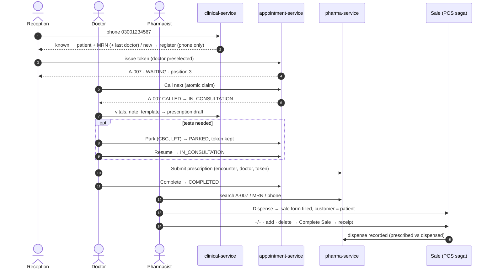
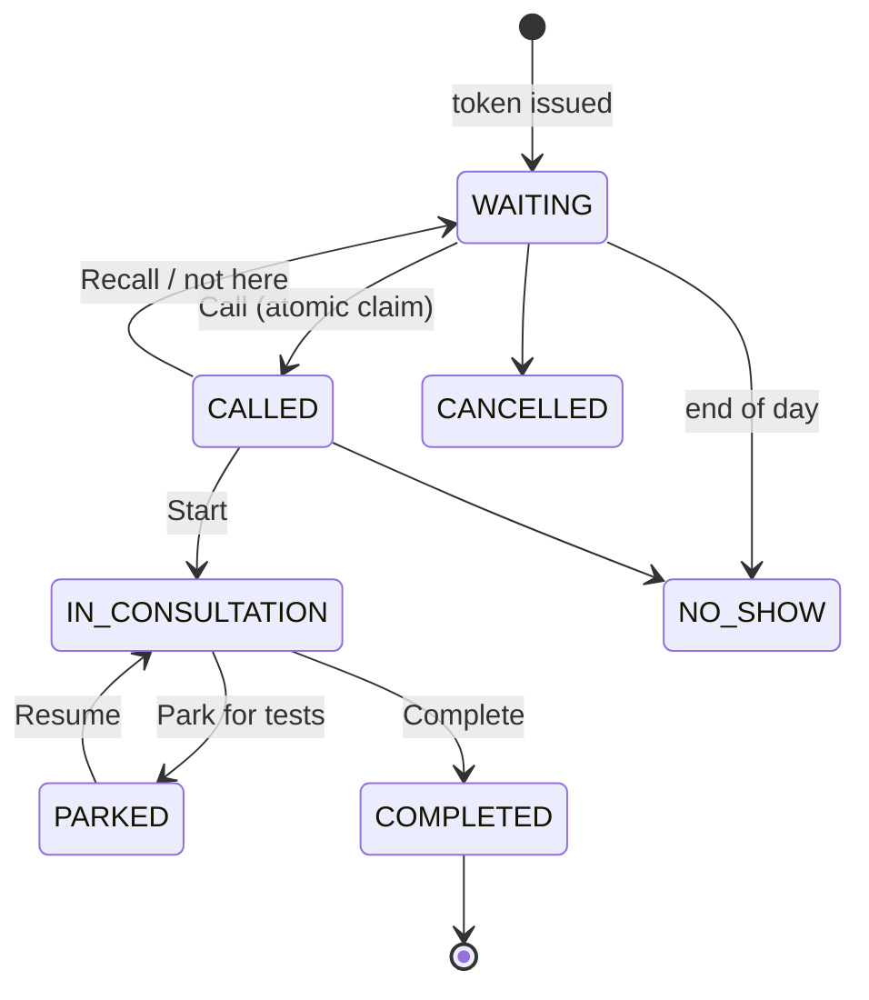

# HMS Phase 1 — design: reception → token → doctor → pharmacy sale

**Status:** DESIGN. No code. Built on `hms-clinic-programme.md` (D-1…D-6) and the client's answers of
2026-10-09 to the 27 test cases in `cypress/e2e/hms/`. Implementation waits for consent per slice.

Test page (steps, expected, cleanup, recorded run): https://claude.ai/artifact/RTCGToYCyqJHVsR7VVnfAm

---

## 1. The client's decisions (2026-10-09) and how each lands

| Case | Client said | Design decision |
|---|---|---|
| M-01 | Only the phone is mandatory | Registration needs **phone** only. Name defaults to the phone until typed; CNIC, DOB, sex, photo optional. A setting `clinic.patient.cnicRequired` (default OFF) exists because KP government hospitals now require CNIC + mobile at OPD. |
| M-01b | An invalid phone is refused | Pakistani mobile `03XXXXXXXXX` / `+923XXXXXXXXX`, normalised to `923XXXXXXXXX` before storing and matching. Landlines refused unless `clinic.patient.allowLandline`. |
| B-02, M-02 | One patient per phone; the same phone again is refused and points at the existing MRN | **Default rule: one patient per phone per clinic** — enforced by a UNIQUE index `(org_id, phone_normalised, family_seq)` with `family_seq = 0`, not by a pre-check (DUP-1 lesson). Typing a known phone opens that patient (name + MRN). Setting `clinic.patient.familyOnOnePhone` (default OFF) turns on an explicit **"Add family member on this number"** action (`family_seq` 1, 2…), which is how MocDoc / OpenMRS-based systems handle shared family phones. It is never silent. |
| B-07 | — | Today's booking files a *different name* on a known phone under the old name (`AppointmentService:149`). Under the client's rule that booking must be **refused with the existing patient named**, never merged. Fixed by S1. |
| B-03 | Daily cap configurable | Already per doctor (`appointmentOfferType` count / minutes, `Provider`). Phase 1 adds "no limit" and a **per-day override** (leave / extra session) on the doctor's schedule. |
| 02 | Token for Dr Ahmed today; one doctor ⇒ preselected; a known phone ⇒ previous doctor preselected | Doctor picker defaults: (1) the only active doctor today, else (2) the patient's last doctor, else (3) empty. Always changeable. |
| 02b | Second token, same patient + doctor + day, refused | UNIQUE `(org_id, provider_id, visit_date, patient_id)` on the queue booking; the refusal names the existing token. |
| 04c | Configurable; a patient may see several doctors in a day, in sequence, one token each | Setting `clinic.queue.multiDoctorPerDay` (default ON). A patient may hold tokens with several doctors, but only **one** may be `CALLED`/`IN_CONSULTATION` at a time; the other doctor's call is refused with "with Dr X now". Two doctors can never claim the same token (atomic claim, below). |
| 06b | Not clear | **Explained:** while the patient is PARKED for tests the prescription is still a draft, so the pharmacy does not see it. It appears only when the doctor submits. Kept. |
| B-01, 07 | Doctor submits → listed in Prescriptions → pharmacist searches by token → Dispense opens the **sale form 100% filled**, patient preset as the customer → pharmacist may +/−, add, delete, but does not key the sale | Doctor's **Submit** is the moment the prescription is created in pharma-service (authored by the doctor, `encounter_id`, `provider_id`, token). The pharmacy list gets **search by token / MRN / phone** and paging. **Dispense** already fills the cart with what is owed and offers + / − per line (RX-FILL-1, verified in `pharma.js`); Phase 1 adds the **customer = patient** preset, which is missing today. |
| B-01 (2) | The patient should be registered as a customer at reception | **Yes, at registration — as ONE person with two roles, not two records.** Reception's Save creates one party-service `Party` with role links `PATIENT` + `CUSTOMER` (`PartyRoleLink`, the same dual-role pattern as customer↔supplier DR-1..5), the clinical `patient` row (MRN) and the POS `customer` row stamped with that `party_id` (bridge column exists, business V27) — in one idempotent step. A name or phone corrected at reception reaches the till through the party, so the two never drift. The pharmacy's sale form then selects that customer by `party_id`, never by name. *Rejected alternative:* a separate customer typed again at the pharmacy — that is the duplicate this design exists to prevent. |
| 07c | "Signed prescription means sale complete?" | **No.** *Submitted* (signed) = the doctor finished it and sent it; from then on the doctor cannot edit it in place — a change is a new version, and only while nothing has been dispensed. *Dispensed* = the sale is complete. The pharmacist's +/− changes the **sale**, never the doctor's prescription; the difference is kept (prescribed vs dispensed, already shown by the dispense banner). |
| SEC-007 | Professional UI to read it | An **Access log** screen for the clinic owner: filter by patient / staff / date / action, newest first, paged, CSV export. Not a raw JSON dump. |
| others | Yes | As written in the test page. |

**Q-1 assumed answered by B-01:** pharmacy and clinic are **one organisation** (the patient registered at reception is
the pharmacy's customer). To be confirmed — if they are two organisations the hand-off becomes a cross-tenant
data-sharing agreement and this design changes.

---

## 2. The flow

### Token state machine

Any other transition is refused (07b). **Atomic claim:** `UPDATE booking SET status='CALLED', provider_user_id=?, version=version+1
WHERE id=? AND status='WAITING' AND version=?` — one row updated or the call is refused (04c, APT-007). "Call next"
picks the lowest `queue_position` WAITING row with the same statement, retried once on a lost race.

---

## 3. Where things live (unchanged from the programme, D-1/D-2/D-3)

| Concern | Owner | Note |
|---|---|---|
| Person: name, phone, roles PATIENT + CUSTOMER | **party-service** `party` + `party_role_link` | one row per person; the source of name/phone |
| Clinical identity: MRN, DOB, sex, consent | **clinical-service** `patient` (`party_id`) | MRN from `org_document_seq`, allocated late |
| Pharmacy customer (credit, ledger, receipts) | **business-service** `customer` (`party_id`, V27) | created at registration, not at the till |
| Token, queue, status, timestamps | **appointment-service** `booking` (queue mode) | new columns: `queue_number`, `status`, `visit_date DATE`, `called_at`… `version` |
| Encounter, vitals, note, park reason | **clinical-service** `encounter`, `clinical_note` (append-only) | |
| Templates | **clinical-service** `rx_template` | per doctor, shareable |
| Prescription | **pharma-service** `prescription` (existing) | + `encounter_id`, `provider_id`, `token_no`, `submitted_at`, `version`; source `DOCTOR` vs `COUNTER` |
| Sale, stock, receipt, GL | existing POS saga | untouched; customer = the patient's party |
| Access log | **audit-service** | new read screen |
| Settings | `common-settings` | the `clinic.*` keys above |

---

## 4. Slices — each one usable end to end, each with its Cypress gate

| Slice | Delivers | Gate cases |
|---|---|---|
| **S1 Patient desk** | clinical-service bootstrap; phone-first register / find; MRN; one-per-phone + optional family; booking stops merging names (B-07) | M-01, M-01b, M-02, B-07 |
| **S2 Token & queue** | queue booking with status + state machine; doctor default / last doctor; 02b refusal; multi-doctor setting; daily cap "no limit" + override; reception queue board, live refresh (poll 5 s, SSE later) | 02, 02b, 03, M-04, 07b, B-03 |
| **S3 Doctor workspace** | My Queue, Call next (atomic), identity banner, history, vitals (range-checked), note, templates, prescription writer, Park/Resume, Submit, Complete | 04, 04b, 04c, 05, 06, 07, 07c, M-15 |
| **S4 Pharmacy hand-off** | doctor's prescription lands in Prescriptions; search by token/MRN/phone + paging; Dispense presets the customer; receipt | B-01 (rewritten), 06b, 08, B-04 |
| **S5 Access log** | owner screen over audit-service reads | SEC-007, M-14 |

**Recommended order: S1 → S2 → S4-lite → S3 → S4 → S5.** "S4-lite" is the customer preset + search on today's
Prescriptions screen; it helps the pharmacy immediately and does not need the doctor's screen.

Each slice: Flyway migration, `org_id` scoping + anti-IDOR, method authz, `mvn test`, a headed Cypress gate whose
first case drives the real UI, Test Book cases, and the ladder (owner / reception / doctor / pharmacist) plus a
cross-tenant case.

---

## 4b. S2 design — token & queue (2026-10-09)

### D-3 revised: the token lives in clinical-service, not in appointment-service's booking

D-3 (programme doc) put the queue on appointment-service's `booking`. S1 changed the ground under it: the
patient is now clinical-service's `patient` (MRN, one per phone), while `booking` points at appointment-service's
own phone-keyed `attendee`. A queue on `booking` would join two patient tables across two services on every
queue read and every "call next" — the hot path of a clinic morning. The blueprint research agrees the concepts
differ: *appointment = planned time*, *token = place in today's line*, *encounter = the consultation*.

| Concept | Owner | Why |
|---|---|---|
| Doctor (provider), venue, daily cap | appointment-service (unchanged) | it schedules time; education uses it too |
| **Token / queue** (today's line) | **clinical-service `queue_token`** | same database as the patient and (S3) the encounter: the atomic claim, the state machine and the board are one transaction, no cross-service join |
| Public online booking | appointment-service `booking` (unchanged) | joins the queue in Phase 4 (patient portal); until then online bookings do **not** consume the token cap — stated, not hidden |

clinical-service reads the doctor list from appointment-service (`/api/appointment/doctors`, identity forwarded) —
once per screen load, never per token — and snapshots the doctor's name on each token.

### Numbering and labels

- `token_no` per **doctor per day** from `org_document_seq` (doc type `Q<yyMMdd>-<providerId>`), allocated late.
- Label `<prefix>-<nnn>`, e.g. **A-007**. Each doctor gets a letter (`clinic_provider.token_prefix`): A for the
  clinic's first doctor, B for the next… so a token is unique across doctors for the day — the pharmacist searches
  "A-007" and finds one patient (S4).

### Rules (each enforced by the database where it can be)

| Rule | Mechanism |
|---|---|
| One live token per patient per doctor per day (02b) | UNIQUE `(org, provider, visit_date, live_patient_id)` — a STORED generated column that is NULL once CANCELLED / NO_SHOW, so a cancelled token can be re-issued |
| Several doctors a day, seen one at a time (04c) | `clinic.queue.multiDoctorPerDay` (default ON); OFF = one live token per patient per day. "With Dr X now" refusal at call time (S3) |
| Daily cap (B-03) | the doctor's own cap (appointment-service; blank/0 = **no limit**), overridden for one day by `provider_day.cap` (or `closed`) |
| State machine (07b) | WAITING → CALLED → IN_CONSULTATION ⇄ PARKED → COMPLETED; WAITING/CALLED → CANCELLED / NO_SHOW. Every transition is ONE conditional UPDATE (`… WHERE id=? AND status IN (allowed)`): 0 rows = refused. Two doctors cannot both call one token |
| Doctor preselected (02, 02c) | the phone lookup returns `lastProviderId` (the patient's latest token) and the screen preselects it; with one doctor it is that doctor |

### S2 delivers (reception), S3 adds (doctor)

S2: Doctors section (list, add with "patients per day" or **No limit**, today's limit override / closed), issue a
token from the patient card with the doctor preselected, the token slip on screen, the **queue board** (today, every
doctor, refreshed every 5 s), cancel and no-show. The transition API (call / start / park / resume / complete) is
built and unit-tested in S2; the doctor's screen that drives it — and the role that limits it — is S3.

## 5. Still open

| # | Question | Blocks |
|---|---|---|
| Q-1 | Pharmacy + clinic one organisation? (assumed **yes** from B-01) | S4 |
| Q-3 | MRN format — proposed `MRN-<clinic code>-<yy>-<6 digits>` per organisation | S1 |
| Q-7 | Doctors and rooms; does any doctor share a queue? | S2 |
| new | `familyOnOnePhone` default — the client's rule says OFF; market practice says ON | S1 |

## Progress log

| Date | Entry |
|---|---|
| 2026-10-09 | Design written from the client's answers. RX-FILL-1 (fill + / −) confirmed already built; customer preset confirmed missing (`startDispense` sets no customer). |
| 2026-10-09 | **S1 Patient desk built.** clinical-service :8098 (patient, MRN via org_document_seq, one-per-phone UNIQUE index, family seat, settings, audit outbox), business `/internal/customers/for-party`, `Capability.CLINIC` (opt-in), monolith `/clinicDashboard` + `/clinic/**` proxy, B-07 fixed in appointment-service. Unit: clinical 24, appointment 15, business 514, common-settings 71, auth 73 — all green. Gate `hms-s1-patient-desk.cy.js`: 8/9 headless; S1-08 found a real defect (a 404 surfaced as "clinic not reachable" — GatewayClient's DownstreamNotFoundException uncaught) → fixed in ClinicController, **awaiting the user's monolith redeploy**. Headed runs flaked on a hidden Chrome window (0.2 s fade never ran; login stalled) — hypothesis, supported by a clean headless run, not proven. B-07 green and now a default regression case. |
| 2026-10-09 | **S1 gate 9/9** after the user redeployed the monolith (S1-08 fix live). Recorded headless with video; page v3 published. S1 is DONE except: not committed, and Urdu/other translations of the new screen fall back to English. NEXT: S2 Token & queue — needs consent. |
| 2026-10-09 | **S2 Token & queue built, not yet built/tested/deployed** (awaiting the user per §0d). clinical-service V2 (`queue_token` with generated `live_patient_id` + UNIQUE, `clinic_provider` letters, `provider_day` overrides), QueueService/TokenWriter/QueueController, setting `clinic.queue.multiDoctorPerDay`; lookup returns `lastProviderId`; monolith proxy + Doctors / Queue / token panel UI; appointment-service **venue IDOR fixed** (DoctorService.create now checks the venue is the caller org). Gate `hms-s2-token-queue.cy.js` (11 cases). Design §4b records D-3 revised. |
| 2026-10-10 | **S2 gate run 2: 9/11.** S2-06 = spec defect (asserted the row lost the text "Not today" while the button of that name returns) → fixed. S2-11 = the venue-IDOR fix is NOT running: appointment-service up since 21:44:09, jar built 21:47 (stale image, same as clinical-service before) → needs a rebuild; the run created one test doctor "Intruder <run>" in owner.business pointing at an owner.appointment venue (visible to no one — every list is org-filtered — but must be deleted). after() fresh sign-in stalled again after a failed case (3rd time, cause unknown) → after() now reuses the cached session. ⚠ NEW GAP (not fixed): `AppointmentService.bookPublicAttempt` loads the doctor by id without checking it belongs to the venue / org. |
| 2026-10-10 | **No manual SQL (user).** appointment-service V6 `provider_quarantine` + `ProviderIntegrityRepair` (ApplicationReadyEvent, idempotent): a doctor attached to another org's venue is copied to quarantine then removed; one with bookings/slots is only reported. S2 gate after() now also clears live tokens of any gate patient. appointment-service unit 18/18. Awaiting the user's rebuild of appointment-service. |
