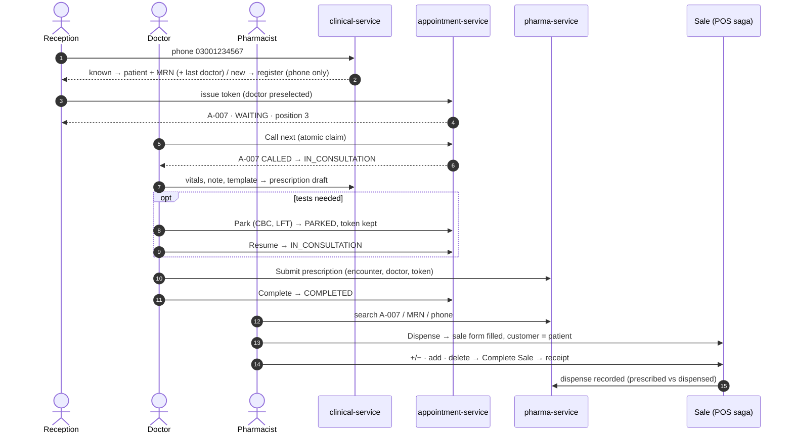
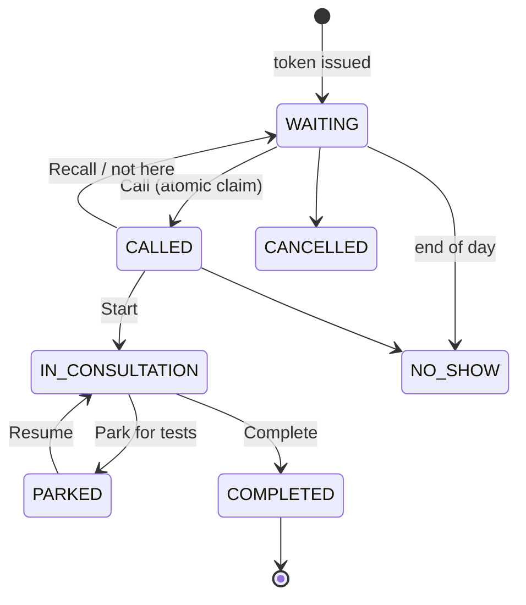
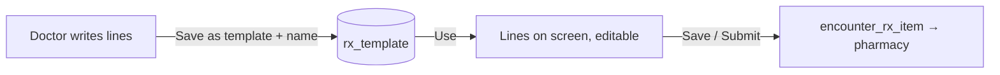
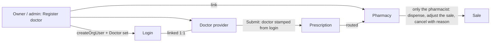
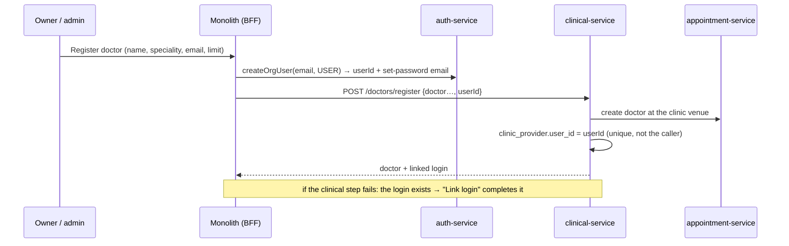

# HMS Phase 1 — design: reception → token → doctor → pharmacy sale

**Status:** DESIGN. No code. Built on `hms-clinic-programme.md` (D-1…D-6) and the client's answers of
2026-10-09 to the 27 test cases in `cypress/e2e/hms/`. Implementation waits for consent per slice.

Test page (steps, expected, cleanup, recorded run): https://claude.ai/artifact/RTCGToYCyqJHVsR7VVnfAm

---

## 1. The client's decisions (2026-10-09) and how each lands

| Case | Client said | Design decision |
|---|---|---|
| M-01 | Only the phone is mandatory | Registration needs **phone** only. Name defaults to the phone until typed; CNIC, DOB, sex, photo optional. A setting `clinic.patient.cnicRequired` (default OFF) exists because KP government hospitals now require CNIC + mobile at OPD. |
| M-01b | An invalid phone is refused | Pakistani mobile `03XXXXXXXXX` / `+923XXXXXXXXX`, normalised to `923XXXXXXXXX` before storing and matching. Landlines refused unless `clinic.patient.allowLandline`. |
| B-02, M-02 | One patient per phone; the same phone again is refused and points at the existing MRN | **Default rule: one patient per phone per clinic** — enforced by a UNIQUE index `(org_id, phone_normalised, family_seq)` with `family_seq = 0`, not by a pre-check (DUP-1 lesson). Typing a known phone opens that patient (name + MRN). Setting `clinic.patient.familyOnOnePhone` (default OFF) turns on an explicit **"Add family member on this number"** action (`family_seq` 1, 2…), which is how MocDoc / OpenMRS-based systems handle shared family phones. It is never silent. |
| B-07 | — | Today's booking files a *different name* on a known phone under the old name (`AppointmentService:149`). Under the client's rule that booking must be **refused with the existing patient named**, never merged. Fixed by S1. |
| B-03 | Daily cap configurable | Already per doctor (`appointmentOfferType` count / minutes, `Provider`). Phase 1 adds "no limit" and a **per-day override** (leave / extra session) on the doctor's schedule. |
| 02 | Token for Dr Ahmed today; one doctor ⇒ preselected; a known phone ⇒ previous doctor preselected | Doctor picker defaults: (1) the only active doctor today, else (2) the patient's last doctor, else (3) empty. Always changeable. |
| 02b | Second token, same patient + doctor + day, refused | UNIQUE `(org_id, provider_id, visit_date, patient_id)` on the queue booking; the refusal names the existing token. |
| 04c | Configurable; a patient may see several doctors in a day, in sequence, one token each | Setting `clinic.queue.multiDoctorPerDay` (default ON). A patient may hold tokens with several doctors, but only **one** may be `CALLED`/`IN_CONSULTATION` at a time; the other doctor's call is refused with "with Dr X now". Two doctors can never claim the same token (atomic claim, below). |
| 06b | Not clear | **Explained:** while the patient is PARKED for tests the prescription is still a draft, so the pharmacy does not see it. It appears only when the doctor submits. Kept. |
| B-01, 07 | Doctor submits → listed in Prescriptions → pharmacist searches by token → Dispense opens the **sale form 100% filled**, patient preset as the customer → pharmacist may +/−, add, delete, but does not key the sale | Doctor's **Submit** is the moment the prescription is created in pharma-service (authored by the doctor, `encounter_id`, `provider_id`, token). The pharmacy list gets **search by token / MRN / phone** and paging. **Dispense** already fills the cart with what is owed and offers + / − per line (RX-FILL-1, verified in `pharma.js`); Phase 1 adds the **customer = patient** preset, which is missing today. |
| B-01 (2) | The patient should be registered as a customer at reception | **Yes, at registration — as ONE person with two roles, not two records.** Reception's Save creates one party-service `Party` with role links `PATIENT` + `CUSTOMER` (`PartyRoleLink`, the same dual-role pattern as customer↔supplier DR-1..5), the clinical `patient` row (MRN) and the POS `customer` row stamped with that `party_id` (bridge column exists, business V27) — in one idempotent step. A name or phone corrected at reception reaches the till through the party, so the two never drift. The pharmacy's sale form then selects that customer by `party_id`, never by name. *Rejected alternative:* a separate customer typed again at the pharmacy — that is the duplicate this design exists to prevent. |
| 07c | "Signed prescription means sale complete?" | **No.** *Submitted* (signed) = the doctor finished it and sent it; from then on the doctor cannot edit it in place — a change is a new version, and only while nothing has been dispensed. *Dispensed* = the sale is complete. The pharmacist's +/− changes the **sale**, never the doctor's prescription; the difference is kept (prescribed vs dispensed, already shown by the dispense banner). |
| SEC-007 | Professional UI to read it | An **Access log** screen for the clinic owner: filter by patient / staff / date / action, newest first, paged, CSV export. Not a raw JSON dump. |
| others | Yes | As written in the test page. |

**Q-1 assumed answered by B-01:** pharmacy and clinic are **one organisation** (the patient registered at reception is
the pharmacy's customer). To be confirmed — if they are two organisations the hand-off becomes a cross-tenant
data-sharing agreement and this design changes.

---

## 2. The flow

### Token state machine

Any other transition is refused (07b). **Atomic claim:** `UPDATE booking SET status='CALLED', provider_user_id=?, version=version+1
WHERE id=? AND status='WAITING' AND version=?` — one row updated or the call is refused (04c, APT-007). "Call next"
picks the lowest `queue_position` WAITING row with the same statement, retried once on a lost race.

---

## 3. Where things live (unchanged from the programme, D-1/D-2/D-3)

| Concern | Owner | Note |
|---|---|---|
| Person: name, phone, roles PATIENT + CUSTOMER | **party-service** `party` + `party_role_link` | one row per person; the source of name/phone |
| Clinical identity: MRN, DOB, sex, consent | **clinical-service** `patient` (`party_id`) | MRN from `org_document_seq`, allocated late |
| Pharmacy customer (credit, ledger, receipts) | **business-service** `customer` (`party_id`, V27) | created at registration, not at the till |
| Token, queue, status, timestamps | **appointment-service** `booking` (queue mode) | new columns: `queue_number`, `status`, `visit_date DATE`, `called_at`… `version` |
| Encounter, vitals, note, park reason | **clinical-service** `encounter`, `clinical_note` (append-only) | |
| Templates | **clinical-service** `rx_template` | per doctor, shareable |
| Prescription | **pharma-service** `prescription` (existing) | + `encounter_id`, `provider_id`, `token_no`, `submitted_at`, `version`; source `DOCTOR` vs `COUNTER` |
| Sale, stock, receipt, GL | existing POS saga | untouched; customer = the patient's party |
| Access log | **audit-service** | new read screen |
| Settings | `common-settings` | the `clinic.*` keys above |

---

## 4. Slices — each one usable end to end, each with its Cypress gate

| Slice | Delivers | Gate cases |
|---|---|---|
| **S1 Patient desk** | clinical-service bootstrap; phone-first register / find; MRN; one-per-phone + optional family; booking stops merging names (B-07) | M-01, M-01b, M-02, B-07 |
| **S2 Token & queue** | queue booking with status + state machine; doctor default / last doctor; 02b refusal; multi-doctor setting; daily cap "no limit" + override; reception queue board, live refresh (poll 5 s, SSE later) | 02, 02b, 03, M-04, 07b, B-03 |
| **S3 Doctor workspace** | My Queue, Call next (atomic), identity banner, history, vitals (range-checked), note, templates, prescription writer, Park/Resume, Submit, Complete | 04, 04b, 04c, 05, 06, 07, 07c, M-15 |
| **S4 Pharmacy hand-off** | doctor's prescription lands in Prescriptions; search by token/MRN/phone + paging; Dispense presets the customer; receipt | B-01 (rewritten), 06b, 08, B-04 |
| **S5 Access log** | owner screen over audit-service reads | SEC-007, M-14 |

**Recommended order: S1 → S2 → S4-lite → S3 → S4 → S5.** "S4-lite" is the customer preset + search on today's
Prescriptions screen; it helps the pharmacy immediately and does not need the doctor's screen.

Each slice: Flyway migration, `org_id` scoping + anti-IDOR, method authz, `mvn test`, a headed Cypress gate whose
first case drives the real UI, Test Book cases, and the ladder (owner / reception / doctor / pharmacist) plus a
cross-tenant case.

---

## 4b. S2 design — token & queue (2026-10-09)

### D-3 revised: the token lives in clinical-service, not in appointment-service's booking

D-3 (programme doc) put the queue on appointment-service's `booking`. S1 changed the ground under it: the
patient is now clinical-service's `patient` (MRN, one per phone), while `booking` points at appointment-service's
own phone-keyed `attendee`. A queue on `booking` would join two patient tables across two services on every
queue read and every "call next" — the hot path of a clinic morning. The blueprint research agrees the concepts
differ: *appointment = planned time*, *token = place in today's line*, *encounter = the consultation*.

| Concept | Owner | Why |
|---|---|---|
| Doctor (provider), venue, daily cap | appointment-service (unchanged) | it schedules time; education uses it too |
| **Token / queue** (today's line) | **clinical-service `queue_token`** | same database as the patient and (S3) the encounter: the atomic claim, the state machine and the board are one transaction, no cross-service join |
| Public online booking | appointment-service `booking` (unchanged) | joins the queue in Phase 4 (patient portal); until then online bookings do **not** consume the token cap — stated, not hidden |

clinical-service reads the doctor list from appointment-service (`/api/appointment/doctors`, identity forwarded) —
once per screen load, never per token — and snapshots the doctor's name on each token.

### Numbering and labels

- `token_no` per **doctor per day** from `org_document_seq` (doc type `Q<yyMMdd>-<providerId>`), allocated late.
- Label `<prefix>-<nnn>`, e.g. **A-007**. Each doctor gets a letter (`clinic_provider.token_prefix`): A for the
  clinic's first doctor, B for the next… so a token is unique across doctors for the day — the pharmacist searches
  "A-007" and finds one patient (S4).

### Rules (each enforced by the database where it can be)

| Rule | Mechanism |
|---|---|
| One live token per patient per doctor per day (02b) | UNIQUE `(org, provider, visit_date, live_patient_id)` — a STORED generated column that is NULL once CANCELLED / NO_SHOW, so a cancelled token can be re-issued |
| Several doctors a day, seen one at a time (04c) | `clinic.queue.multiDoctorPerDay` (default ON); OFF = one live token per patient per day. "With Dr X now" refusal at call time (S3) |
| Daily cap (B-03) | the doctor's own cap (appointment-service; blank/0 = **no limit**), overridden for one day by `provider_day.cap` (or `closed`) |
| State machine (07b) | WAITING → CALLED → IN_CONSULTATION ⇄ PARKED → COMPLETED; WAITING/CALLED → CANCELLED / NO_SHOW. Every transition is ONE conditional UPDATE (`… WHERE id=? AND status IN (allowed)`): 0 rows = refused. Two doctors cannot both call one token |
| Doctor preselected (02, 02c) | the phone lookup returns `lastProviderId` (the patient's latest token) and the screen preselects it; with one doctor it is that doctor |

### S2 delivers (reception), S3 adds (doctor)

S2: Doctors section (list, add with "patients per day" or **No limit**, today's limit override / closed), issue a
token from the patient card with the doctor preselected, the token slip on screen, the **queue board** (today, every
doctor, refreshed every 5 s), cancel and no-show. The transition API (call / start / park / resume / complete) is
built and unit-tested in S2; the doctor's screen that drives it — and the role that limits it — is S3.

## 4c. S3a design — the doctor's workspace, part 1 (2026-10-10)

**What a person can do after it:** the doctor opens **My Queue**, calls the next patient, sees **name + MRN + date
of birth** before anything clinical, records the complaint and vitals (range-checked), writes notes (append-only),
and completes the visit — and sees the patient's earlier visits. Reception can no longer read any of it (M-15).
S3b adds templates, the prescription writer, park/resume on screen and Submit to the pharmacy.

### Who may consult — a permission, granted by the owner, placed on nobody

| Piece | Where | Rule |
|---|---|---|
| `clinic.consult` ("See and write clinical records") | auth-service V20, module BUSINESS (a pharmacy's catalogue) | rides the existing `privileges` claim; the OWNER holds it (every code of the module); Administrator does NOT (its items were fixed in V12) |
| Built-in set **Doctor** | V20, `organization_id NULL`, `is_builtin` | items: `clinic.consult` only — a doctor does not sell; **assigned to nobody** (V12/V16 lesson: place by what someone does, never by organisation) |
| clinical-service | `@PreAuthorize("hasAuthority('clinic.consult')")` | on every encounter read/write AND on the doctor's token moves (call, recall, start, park, resume, complete); reception keeps issue, cancel, not-here |

### Data (clinical-service V3) — typed, range-checked, append-only

| Table | Columns that matter | Rule |
|---|---|---|
| `encounter` | `token_id` UNIQUE, patient, provider, doctor user, status OPEN/COMPLETED, chief_complaint, `bp_systolic`, `bp_diastolic`, `pulse`, `temperature_f`, `spo2`, `weight_kg`, `height_cm`, started/completed | one consultation per token (UNIQUE — a double "Start" is the same encounter); vitals refused outside human ranges (a temperature of 986 is a typo); edits while OPEN only, with `version` |
| `clinical_note` | encounter, patient, author, `body VARCHAR(4000)`, `amends_note_id` | **never updated or deleted**; a correction is a new row pointing at the one it corrects |

Temperature is in °F, as Pakistani clinics record it (90–110 accepted).

### Known limits (stated)
- Any user with `clinic.consult` may work any doctor's queue in the clinic (the screen remembers which doctor you are
  on this device). Linking a login to one doctor is a later slice.
- The code and the "Doctor" set sit in the BUSINESS catalogue, so a plain shop's Team screen also lists them. Harmless
  (without the clinic switched on, clinical-service refuses everything), but visible; hiding them per capability is
  its own change.

## 4d. S3b-1 design — the doctor's prescription reaches the pharmacy (2026-10-10)

**What a person can do after it:** in the consultation the doctor adds medicines from the pharmacy's own catalogue
(quantity, dose, frequency, days), and presses **Submit**. The prescription then appears in the pharmacy's
Prescriptions list — findable by the token — marked as written by the doctor, with the doctor's name and the
complaint; Dispense works on it exactly as on a counter prescription. Park / Resume for tests are on screen.

| Piece | Where | Rule |
|---|---|---|
| Draft lines | clinical-service V5 `encounter_rx_item` | the doctor's working list; replaced as a whole on Save; **frozen once submitted** (07c: a submitted prescription is never edited in place) |
| Submit | clinical → pharma-service `POST /api/pharma/prescriptions` (doctor's identity forwarded) | one prescription per visit: `external_ref = "enc-<id>"` is UNIQUE per organisation (pharma V9), so a retried Submit returns the SAME prescription |
| What the pharmacy sees | pharma V9: `source` (DOCTOR / COUNTER), `token_label`, `encounter_id` | `party_id` is set at once from the patient (not left to the best-effort bridge), so the token / MRN / phone search finds it immediately |
| Parked = invisible (06b) | by construction | nothing exists in pharma-service until Submit |

Not in S3b-1: templates (S3b-2), drug-interaction checks at submit (the pharmacy's existing safety check still runs
at Dispense).

## 4e. S3b-2 design — prescription templates (2026-10-10)

**What a person can do after it:** the doctor saves the prescription on screen as a template ("Fever + Flu"); on
the next patient they choose it, press **Use**, and the lines fill in. Each line stays editable (quantity, dose,
frequency, duration) before Save / Submit, e.g. dose "1+0+1". The same idea as OpenMRS *order sets* and the
"favourite prescriptions" of clinic software: a starting point, never a prescription by itself.

| Piece | Where | Rule |
|---|---|---|
| Template | clinical V6 `rx_template` + `rx_template_item` | per clinic (shared by its doctors); name unique per clinic, case-insensitive (`name_key`); at most 200 active; retired, never deleted |
| Use | the screen | merges into the lines on screen: a medicine already there is skipped; a medicine no longer in the pharmacy's list is skipped **and named**; nothing is saved until Save / Submit |
| Who | `clinic.consult` | the front desk cannot read or write templates (M-15) |

## 4f. Phase 1b — the client's rulings of 2026-10-10 and the build order

| # | Client's ruling | How mature systems do it | Design here |
|---|---|---|---|
| L-1 | **Product check: yes** | e-prescribing (NHS EPS, Surescripts) prescribes from a coded catalogue; an unknown item is refused at source | pharma refuses a doctor's line whose product is not an active product of that pharmacy, at Submit, in words naming the line |
| L-2 | **Doctor registration by the clinic owner / admin, linked to a login** | OpenMRS *Provider* ↔ *User*; Epic provider (SER) ↔ user (EMP); Odoo `hr.employee.user_id`: the clinical identity is its own record, linked 1:1 to the login, both created by the admin with an invite email | one **Register doctor** form (name, speciality, mobile, email, daily limit): creates the login through auth's existing `createOrgUser` (set-password email), puts it on the **Doctor** set, creates the doctor, and links `clinic_provider.user_id`. An existing member can be linked instead. A linked doctor's My Queue opens on **their own** queue; the doctor picker is gone for them |
| L-3 | **The doctor is attached to the prescription automatically; only the pharmacist modifies / dispenses / cancels it** | NHS EPS: the prescription is immutable once signed; the pharmacy records what it dispensed and why (partial, substituted, not dispensed) | the doctor (name + registration) is stamped from the **linked login** at Submit, never typed; after Submit the doctor and reception cannot change or cancel it; the pharmacist adjusts the SALE (RX-FILL) and cancels with a **reason the doctor sees**. The "Doctor" set is shown only where the clinic is switched on |
| L-4 | **The owner / admin links doctors to a pharmacy; a doctor's prescription lands there automatically** | nominated / preferred pharmacy (NHS EPS nomination; eClinicalWorks / Practo preferred pharmacy) | a doctor ↔ pharmacy link set by the owner/admin; Submit routes to it; the pharmacy's list shows only prescriptions routed to it *(scope of "pharmacy" — see the question below)* |
| L-5 | **Translations: all languages** | — | every clinic key in en / fr / es / hi / ar / ur (ar and ur right-to-left, already supported by the platform) |
| L-6 | **Times: the client's / browser's zone** — already documented and partly built | Shopify / Xero: business documents in the shop's zone; Gmail / Slack: activity in the viewer's zone | finish and switch on **TZ-1 P1** (edge translation in the monolith, written but OFF). Clinic times then convert with every other screen; nothing clinic-only |

### Build order (each a vertical slice with its gate; tests and deploys asked for each time)

| Slice | What | Size |
|---|---|---|
| **H1** | L-1 product check + the S2 gap `bookPublicAttempt` (doctor not checked against venue / org) | small |
| **H2** | L-2 Register doctor + login link; My Queue on the doctor's own queue | medium |
| **H3** | L-3 doctor stamped from the login; post-Submit lock; pharmacist-only cancel with reason; Doctor set only where the clinic is on | medium |
| **H4** | L-4 doctor ↔ pharmacy routing | medium (depends on the answer below) |
| **H5** | L-5 translations of every clinic key | small |
| **H6** | L-6 TZ-1 P1 switched on (platform; every screen) | large — own gate across modules |
| then | S3c (03, M-04, 04c) and S5 (access log, SEC-007, M-14) | as planned |

**Answers (2026-10-10):** L-4 — the pharmacy is **a branch (store) of this business**; routing is doctor → store.
L-3 — the pharmacist may edit **the prescription itself** (not only the sale). Departure from NHS EPS immutability,
so the doctor's ORIGINAL lines are never overwritten: every pharmacist change is an **amendment** row (who, when, why,
before → after), the current lines are derived from original + amendments, and the doctor sees both.

## 4g. H2 design — Register doctor, linked to a login (2026-10-10)

**What a person can do after it:** the owner or an admin opens Clinic → Doctors → **Register doctor**, enters the
doctor's name, speciality, mobile, **email** and daily limit, and saves. The doctor gets a set-password email; when they
sign in, **My queue** opens on their own queue with no doctor to choose. An existing team member can be linked to an
existing doctor instead (**Link login**).

| Decision | Why |
|---|---|
| **The link grants clinical access** (a login linked to a doctor of this clinic may consult), in addition to the Doctor set | the ruling says owner OR admin registers; permission sets are OWNER-only (PERM-1 ruling) — so the clinical identity itself carries the access, as OpenMRS (Provider ↔ User) and Epic (SER ↔ EMP) do |
| A **linked** doctor works only **their own** queue and visits; the owner and Doctor-set members without a link work all (cover) | ruling L-2 "linking will be to that login"; closes the S3a known limit |
| Register / Link / Add doctor: **owner or admin only** (`ROLE_OWNER` or `ADMIN_ROLE`, the team-management rule) | RULE 0 found `POST /api/clinic/doctors` open to every clinic user (front desk could add doctors) — closed |
| One login ↔ one doctor per clinic (`uq_provider_user`); **no self-link**; every link/unlink audited | an admin must not make themselves a doctor; the trail says who credentialed whom |
| Orchestration in the monolith BFF: auth `createOrgUser` (it needs the caller's bearer) → clinical `register` | the login is auth's; if linking fails after the login exists, the screen says so and **Link login** finishes it (never a second login) |

## 5. Still open

| # | Question | Blocks |
|---|---|---|
| Q-1 | Pharmacy + clinic one organisation? (assumed **yes** from B-01) | S4 |
| Q-3 | MRN format — proposed `MRN-<clinic code>-<yy>-<6 digits>` per organisation | S1 |
| Q-7 | Doctors and rooms; does any doctor share a queue? | S2 |
| new | `familyOnOnePhone` default — the client's rule says OFF; market practice says ON | S1 |

## Progress log

| Date | Entry |
|---|---|
| 2026-10-09 | Design written from the client's answers. RX-FILL-1 (fill + / −) confirmed already built; customer preset confirmed missing (`startDispense` sets no customer). |
| 2026-10-09 | **S1 Patient desk built.** clinical-service :8098 (patient, MRN via org_document_seq, one-per-phone UNIQUE index, family seat, settings, audit outbox), business `/internal/customers/for-party`, `Capability.CLINIC` (opt-in), monolith `/clinicDashboard` + `/clinic/**` proxy, B-07 fixed in appointment-service. Unit: clinical 24, appointment 15, business 514, common-settings 71, auth 73 — all green. Gate `hms-s1-patient-desk.cy.js`: 8/9 headless; S1-08 found a real defect (a 404 surfaced as "clinic not reachable" — GatewayClient's DownstreamNotFoundException uncaught) → fixed in ClinicController, **awaiting the user's monolith redeploy**. Headed runs flaked on a hidden Chrome window (0.2 s fade never ran; login stalled) — hypothesis, supported by a clean headless run, not proven. B-07 green and now a default regression case. |
| 2026-10-09 | **S1 gate 9/9** after the user redeployed the monolith (S1-08 fix live). Recorded headless with video; page v3 published. S1 is DONE except: not committed, and Urdu/other translations of the new screen fall back to English. NEXT: S2 Token & queue — needs consent. |
| 2026-10-09 | **S2 Token & queue built, not yet built/tested/deployed** (awaiting the user per §0d). clinical-service V2 (`queue_token` with generated `live_patient_id` + UNIQUE, `clinic_provider` letters, `provider_day` overrides), QueueService/TokenWriter/QueueController, setting `clinic.queue.multiDoctorPerDay`; lookup returns `lastProviderId`; monolith proxy + Doctors / Queue / token panel UI; appointment-service **venue IDOR fixed** (DoctorService.create now checks the venue is the caller org). Gate `hms-s2-token-queue.cy.js` (11 cases). Design §4b records D-3 revised. |
| 2026-10-10 | **S2 gate run 2: 9/11.** S2-06 = spec defect (asserted the row lost the text "Not today" while the button of that name returns) → fixed. S2-11 = the venue-IDOR fix is NOT running: appointment-service up since 21:44:09, jar built 21:47 (stale image, same as clinical-service before) → needs a rebuild; the run created one test doctor "Intruder <run>" in owner.business pointing at an owner.appointment venue (visible to no one — every list is org-filtered — but must be deleted). after() fresh sign-in stalled again after a failed case (3rd time, cause unknown) → after() now reuses the cached session. ⚠ NEW GAP (not fixed): `AppointmentService.bookPublicAttempt` loads the doctor by id without checking it belongs to the venue / org. |
| 2026-10-10 | **No manual SQL (user).** appointment-service V6 `provider_quarantine` + `ProviderIntegrityRepair` (ApplicationReadyEvent, idempotent): a doctor attached to another org's venue is copied to quarantine then removed; one with bookings/slots is only reported. S2 gate after() now also clears live tokens of any gate patient. appointment-service unit 18/18. Awaiting the user's rebuild of appointment-service. |
| 2026-10-10 | **S2 gate 11/11 (three runs in a row)**, baseline 7/7, appointment 2/2. S2-11 "failing" was the ASSERTION: /registerDoctor puts "RegisterFailed" in `message`, `error` is always null — 5 assertions across 3 specs fixed (they could never fail). Start-up repair confirmed live (earlier intruders gone from venues 44/45). UX fix: board showed the old park reason on Done tokens → only while PARKED (JS; S2-08 asserts it — needs a monolith redeploy). Page v4 published. Cases 03 / M-04 move to S3 (doctor screen). |
| 2026-10-10 | **S4-lite built (awaiting tests + deploy).** Pharmacy search: `/searchPrescriptions` (monolith) → clinic `/patients/resolve` (token of today / MRN / phone → person) → pharma `/prescriptions/search` (by party, else text; paged, hasMore) + pharma V8 index (org, party_id, created_at); text fallback when the person search is empty. Dispense presets the PATIENT as customer: business `/customerForParty` (org-wide), selected in the list or sent by id (`window.dispensingCustomerId`) so a pharmacist who cannot see reception's customer never creates a duplicate. ⚠ SECURITY FIX: `CustomerService.saveUpdateCustomer` loaded a sale's customerId tenant-blind and stamped the caller's org on it (cross-tenant customer move) → now `findByIdScoped`, refusal "Customer not found". Gate `hms-s4lite-pharmacy.cy.js` (5 cases). |
| 2026-10-10 | **S4-lite gate 5/5** after the user rebuilt business+clinical (deploy.ps1). Fixed during the gate: (1) clinical — appointment-service doctor list timed out (4 s, cold) → bare 500; now one retry + 8 s timeout + every transport failure said in words (unit 40/40). (2) business — SagaSaleWriter wrapped the "Customer not found" refusal → "An unexpected error occurred"; now passes through (stock hold still released by the saga). (3) UI — "Load more"/"Clear" could not be hidden: **theme.css forces `.btn { display:inline-flex !important }`**, so `.hide()`/`.toggle()`/inline display:none never hide a button (computed inline-flex, proven by probe). S4-lite now hides WRAPPERS; the global rule is a FINDING, not changed (other screens may depend on it). Needs a monolith rebuild for (3). |
| 2026-10-10 | **S4-lite ✅ 5/5 (twice) + S2 11/11** after the monolith rebuild (Load more / Clear now hide via wrappers). Screenshots + video saved locally (scratchpad shots-s4l). Test page NOT updated: it belongs to the other account (this one is not a writer). Nothing committed. NEXT: publish page from the owning account → S3 doctor workspace. |
| 2026-10-10 | **S3a built (awaiting tests + deploy).** auth-service V20: permission `clinic.consult` (BUSINESS) + built-in set "Doctor" (only that code), placed on NOBODY. clinical-service V3 `encounter` (one per token, typed vitals) + `clinical_note` (append-only, `amends_note_id`); ConsultService/ConsultController `/api/clinic/consult`; doctor token moves (call/recall/start/park/resume/complete) now need clinic.consult, reception keeps issue/cancel/not-here; 403 keeps its sentence (ClinicalAccessAdvice). Monolith: proxy + My Queue (sec:authorize clinic.consult) + consultation panel. Gate `hms-s3a-doctor.cy.js` (5 cases; admin.pharma → Doctor set in before, restored in after). |
| 2026-10-10 | **S3a gate run 1: 3/5** (D-01 real screen, D-04 M-15, D-05 tenancy green; S2 11/11). Two real defects: (1) `ConsultService.open` was `readOnly` but writes the PHI-view audit → "Connection is read-only" 500 on GET a visit → read-write now; (2) V2 `live_patient_id` counted COMPLETED as live while QueueService.LIVE does not → a same-day second visit with the same doctor hit uq_token_live as a raw 500 → **V4** makes COMPLETED free the day; the race fallback now answers in words. Awaiting clinical-service redeploy. |
| 2026-10-10 | **S3a ✅ 5/5** after the clinical-service redeploy (V4 live). Page (account B) v2 published with S3a. Polish noted for the next monolith deploy: the consultation banner shows the raw status code (IN_CONSULTATION) instead of the board's words ("With doctor"). NEXT: S3b — templates, prescription writer, park/resume on screen, Submit to the pharmacy (doctor-authored Rx with the token). Nothing committed (user: not yet). |
| 2026-10-10 | **S3b-1 built (awaiting tests + deploy).** pharma V9 (`source`, `token_label`, `encounter_id`, `external_ref` UNIQUE per org) + idempotent create (same `enc-<id>` → same prescription); a visit reference needs `clinic.consult` (the counter form relays its body as is — it could otherwise post a script as the doctor's). clinical V5 `encounter_rx_item` + `encounter.rx_id`; PUT `/encounters/{id}/rx` (whole list, frozen once sent), POST `/rx/submit`; Start on a PARKED token resumes it. Monolith: prescription card (datalist over ProductPicker's cached list), Park with a reason, status words in the banner, "From the doctor · A-040" in the pharmacy list. Gate `hms-s3b1-prescription.cy.js` (7 cases). Both HMS specs now COMPLETE the visits they leave with the doctor (cancel only applies to waiting/called). Known limit: a doctor-submitted script with a party id set skips the pharma party bridge, so Contact-360 lacks its pharma PATIENT role link. |
| 2026-10-10 | **S3b-1 ✅ 7/7** (S3a 5/5 again). R-07 first checked only "not accepted"; pharma answers EVERY 403 with "Access denied", so a pharmacist who may not record prescriptions at all would have passed it — a control case (same body without the claim → accepted, COUNTER) now proves the refusal is the visit-reference rule. ⚠ OPEN defect seen in the screenshots: the "Sent to the pharmacy" time and the pharmacy list Date show the server UTC clock (08:07 for 13:07 PKT) — `LocalDateTime.now()` in clinical `submitRx` and pharma `prePersist`; belongs to TZ-2 (TenantClock / X-Client-Tz). Page v3 published. NEXT: S3b-2 templates. |
| 2026-10-10 | **S3b-2 built (awaiting tests + deploy).** clinical V6 `rx_template` (+ `name_key` unique per clinic, NULL when retired) + `rx_template_item`; RxTemplateService (doctor-only; same line rules as a visit; max 200; retire frees the name); `/api/clinic/consult/templates` GET/POST + `/{id}/retire`. Screen: template bar (Use / Remove / Save as template) and EDITABLE lines (qty, dose, frequency, duration) until sent. Use skips a medicine already on screen and NAMES one the pharmacy no longer has. Gate `hms-s3b2-templates.cy.js` (6 cases). Known limit (S3b-1 too): the server checks a line has a product id, not that the product exists in the pharmacy — the screen only offers the pharmacy list; Dispense would fail on an unknown id. |
| 2026-10-10 | **S3b-2 gate run 1: 1/6** — ONE real defect: `itemsOf` (returns RxTemplateItem) was declared on RxTemplateRepo; Spring Data read the foreign return type as a DTO projection and rewrote it to `SELECT new RxTemplateItem(*)` → every template list read was a 500 (T-01/T-04/T-06; T-02/T-03 cascaded from T-01). Mocked unit tests could not see it. Moved to RxTemplateItemRepo; scanned every clinical repo for a foreign return type — none. Cleanup hooks ran clean. Awaiting clinical-service redeploy. S3b-1 7/7 in the same run. |
| 2026-10-10 | **S3b-2 ✅ 6/6** after the clinical-service redeploy (itemsOf on RxTemplateItemRepo). Page v4 published. ⚠ UX finding (open): `#clinMsg` sits at the top of the clinic page — a message from the prescription area (e.g. "Not in the pharmacy's list any more") shows out of view while the doctor works lower down; T-03's screenshot does not show it. Open defects now: (1) times shown in UTC, (2) messages out of view. NEXT per plan: S4 (dispense adjustments, case 08) / S5 (access log, SEC-007, M-14). |
| 2026-10-10 | **S4 designed + gated (no dispense code).** Case 08 is already built by RX-FILL (another session, 2026-10-09, deployed, NOT committed): fill on Dispense, +/− while dispensing, "N left for another day", PARTIALLY_DISPENSED, Park keeps the link. S4 adds the gate `hms-s4-dispense-adjust.cy.js` (3 cases: the DOCTOR's script → − → partial; another day fills only what is owed → full; the doctor's lines never change). Open defect 2 FIXED in the monolith: `#clinMsg` is a fixed, dismissable notice (S3b-2 T-03 now asserts it is INSIDE the viewport). Open defect 1 (UTC times) handed to TZ-1 P1/P3 with the clinic sites listed — not patched clinic-only. ⚠ S4 depends on RX-FILL, which is uncommitted: committing HMS without it would ship a gate that cannot pass. |
| 2026-10-10 | **S4 ✅ 3/3** (no dispense code; RX-FILL proven on the DOCTOR's script over two days). Two SPEC defects found by the run, not product: (1) `confirmSale({optional:true})` looks once and races "Complete this sale?" — new shared command `cy.clickAndConfirmSale()` waits for the dialog OR the sale request (S3b-1 7/7, S4-lite 5/5, S4 on it); (2) the Rx list redraws between the recent list and the search result — wait for each `@search` before touching a row. Screenshots go to a private folder (`CYPRESS_screenshotsFolder`): another session wiped the shared one mid-run again. S3b-2 6/6 with the in-viewport message check (fix live). Page v5. Pending: 03, M-04, 04c (doctor queue behaviours) + S5 (M-14 access log, SEC-007). |
| 2026-10-10 | **Client rulings L-1..L-6 recorded (§4f) + answers** (pharmacy = a branch of this business; the pharmacist may edit the prescription itself → amendment history). **H1 built (awaiting tests + deploy):** (1) pharma `PrescribedProductCheck` — a doctor's Submit names only products of THIS pharmacy's catalogue (`CatalogClient.getProductsFresh`, live, scoped by headers; refusal names the line; unreachable catalogue → "Press Submit again"); counter prescriptions unchanged. (2) appointment `bookPublicAttempt` loads the doctor with `findByIdAndOrganizationId(venue org)` + same venue — refused like a missing id. RULE 0: 1 remaining unscoped `findById` in appointment-service = the venue of a PUBLIC booking (the org is derived from it) — deliberate. Inactive products are still accepted (ProductRef carries no active flag; changing the shared contract is its own step). Gate `hms-h1-hardening.cy.js` (3 cases, H1-02 with a control). |
| 2026-10-10 | **H1 ✅ 3/3** (pharma + appointment redeployed by the user). ⚠ **NEW DEFECT, pre-existing, NOT fixed (needs consent): online booking is unusable for the public on the Docker deploy.** `/appointment` lists NO hospital to an anonymous visitor: `AppointmentRestClient.getMap` → GatewayClient falls back to the DIRECT url `appointment.service.url` (default `http://localhost:8091`) when there is no login token; inside the monolith container that is not appointment-service → `ResourceAccessException ... localhost:8091/hospitals` (log-proven), swallowed → empty list. `/loadDoctorsByHospital` (anonymous) is the same path. Signed in, both go through the gateway and work — which is why S2-11 never saw it. Booking SUBMIT (`postPublic`) uses the gateway open route and works. Fix direction: public read routes on appointment-service under the already-open `/api/appointment/public/**` (venues; a venue's doctors — public fields only) and the monolith calling them through the gateway like postPublic. |
| 2026-10-10 | **P-BOOK-1 built (awaiting tests + deploy).** appointment `PublicDirectoryService` + 3 open GETs under `/api/appointment/public/` (venues; a venue's doctors — its own org only; a doctor) with PUBLIC fields only (venue: id,name,city; doctor: id,name,speciality,days,times — never email/phone/mobile/fee/org). Monolith `AppointmentRestClient.getPublic` (gateway open route, like postPublic); `/appointment`, `/loadDoctorsByHospital`, `/loadDoctorDetails` use it; DoctorController ESCAPES every tenant-typed value it puts into the public HTML (was raw concatenation = stored XSS on a public page). RULE 0 — 5 monolith readers of venues/doctors: 3 public (fixed), 2 signed-in own-org (`/addDoctor`, `/loadHospitals`, unaffected). Finding, NOT changed: `/registerHospital*` is permitAll and anonymous would hit the same direct-URL fallback — but an anonymous venue belongs to no business. Gate `cypress/e2e/appointment/public-booking-page.cy.js` (3 cases, no login). |
| 2026-10-10 | **P-BOOK-1 ✅ 3/3** (appointment + monolith redeployed by the user). The anonymous page now renders the venues (60 options vs 4 before); a visitor books and gets a number. First run 0/3 was the SPEC (`[...$opts]` — a jQuery collection is not spreadable; `.toArray()`). Page (new link GUajsFnxz68…) updated. Observation for later (product decision, not changed): the public list shows EVERY business's venues including test venues ("S2 Venue …"); a per-venue "accept online bookings" opt-in is the SaaS norm. NEXT: H2 Register doctor. |
| 2026-10-10 | **H2 built (awaiting tests + deploy).** clinical V7 `clinic_provider.user_id` (+ linked_at/by, `uq_provider_user`). ClinicAccess: consult = Doctor permission OR a LINKED login (admins can register doctors; sets stay owner-only); `assertMayWorkProvider` — a linked doctor works only their own queue/visits (QueueService doctor moves + Call next; ConsultService `scoped` + Start); `assertClinicAdmin` (ROLE_OWNER / ADMIN_ROLE) on add/register/link/unlink. **RULE 0 fix:** `POST /api/clinic/doctors` was open to every clinic user. Rules: no self-link for an admin (the owner may: the one doctor of a small clinic); one login = one doctor; link checked BEFORE the doctor is created; audit CLINIC_DOCTOR_LINK/UNLINK. Monolith BFF `POST /clinic/doctors/register` = auth createOrgUser (bearer) → clinical register; failure after the login exists says "Link login". Screen: Register a doctor (email + "Create their login", default on), Login column with Link/Unlink (owner/admin), My queue revealed by `/clinic/doctors/me` and opening on the linked doctor without a picker. S2 + S3a specs adjusted. Gate `hms-h2-register-doctor.cy.js` (6 cases). ⚠ GAP (not built, product decision): **there is no way to remove or disable a team member** (auth has no route; the monolith has none) — each H2 run leaves one login (`h2.<run>@test.myplus.com`); staff who leave cannot be switched off. Dev mail does not reach Mailpit (0 messages) — a new login cannot be signed in by a gate. |
| 2026-10-10 | **H2 gate ✅ 6/6** (S3a 5/5, S3b-1 7/7 in the same run). **S2-09 red = a real rule flaw:** owner.pharma (user 82) had linked THEIR OWN login to Dr Ahmed (gate) at 17:16 (not a gate — by hand, before this run; allowed: only an owner may self-link), and the own-queue rule then limited the OWNER → "This is Dr Sana (gate)'s patient". Fixed: `assertMayWorkProvider` returns at once for ROLE_OWNER — for an owner the link only chooses which doctor My queue opens on (unit 71/71, new case). That self-link is the user's data and is LEFT in place. The other linked row (user 283 → provider 69) is H2-01's registered login — expected residue; admin.pharma was unlinked by after() as designed. Awaiting clinical-service redeploy, then S2 + H2 again. |
| 2026-10-10 | **H2 ✅ 6/6 + S2 11/11** after the clinical redeploy (owner never limited). Page v3 at GUajsFnxz68… (14.9 MB — near the 16 MB cap: compress screenshots before the next publish). UX finding for the next monolith deploy: the Doctors table (new Login column) is wider than 1280 px; day tools cut off. Open gaps: no remove/disable team member; dev mail not in Mailpit. NEXT: H3 (doctor stamped from the login; pharmacist-only edit/cancel with amendment history; Doctor set only where the clinic is on). |
