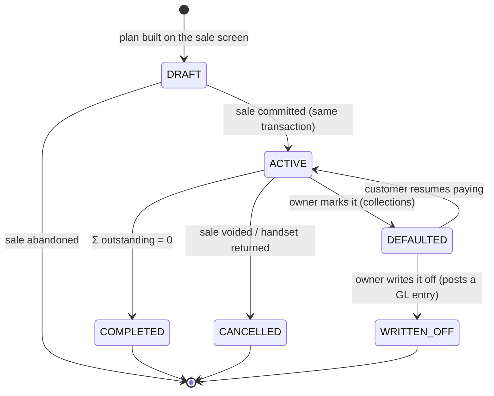
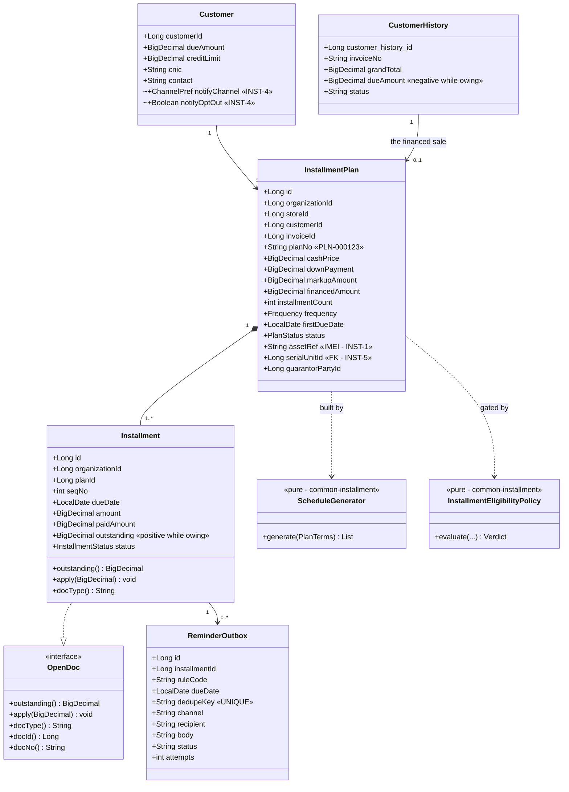
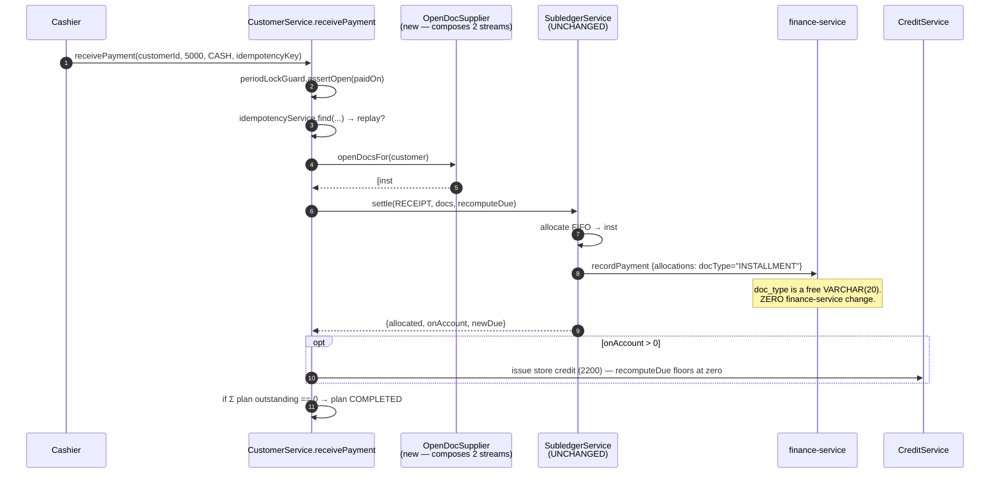

# Selling on installment — dues, balances & payment reminders

**Status:** IN IMPLEMENTATION for **Shahzad Mobile Shop** (started 2026-08-21). See §13 for progress.
**Requested by:** a customer running a **mobile shop** — sells accessories over the counter, sells handsets
**on installment**, and wants dues + remaining balances tracked and the customer reminded when a payment falls due.
**Scope of this doc:** an end-to-end review of what the platform already does, what it does not, and a design that
serves this shop *and* the next four verticals that will ask for the same thing.
**Governing standards:** [`SAAS-BUILD-STANDARDS.md`](SAAS-BUILD-STANDARDS.md) · [`ARCHITECTURE-MULTITENANCY.md`](ARCHITECTURE-MULTITENANCY.md)
**Related:** [`customer-requirements-plan.md`](customer-requirements-plan.md) · [`finance-f2-statements-aging-design.md`](finance-f2-statements-aging-design.md) · [`edu-N1-notification-outbox.md`](slices/edu-N1-notification-outbox.md) · [`store-credit-design.md`](store-credit-design.md)

**Spelling:** the codebase will use **`installment`** (one `l`) in every identifier, column, setting key, i18n key
and message. Fixed here on purpose — D9b's homonym incident says a concept that ships under two spellings can
never be swept cleanly afterwards.

---

## 1. Document — what the shop actually does

A mobile shop runs **two businesses under one till**:

| | What it is | What the platform does today |
|---|---|---|
| **Accessories** | cases, chargers, cables, glass protectors — low value, cash/card, walk-in | ✅ **Fully served.** POS sale screen, barcode-first scan, multi-rate tax, tenders, day-close, returns, receipts, stock, purchase, reports. Nothing to build. |
| **Handsets on installment** | one high-value item, a down payment, then N dated payments over months, against a named customer | 🔴 **Not served at all.** |

**The first finding worth stating loudly: only half of this request is new work.** The accessories half is a shop
the platform already runs. Everything below is about the financed handset — and about not breaking the half that
works while adding it.

### What the customer is really asking for

Decomposed into capabilities, because "installments with reminders" is four different things:

| # | Capability | Plain statement |
|---|---|---|
| **R1** | **Sell on a plan** | at the counter, turn one sale into a down payment plus a dated schedule |
| **R2** | **Know the dues** | per customer, per plan: financed, paid, **remaining balance**, next due, how overdue |
| **R3** | **Collect against the plan** | take a payment and have it land on the right installments, in the books, on the receipt |
| **R4** | **Remind, on time, reliably** | tell the customer before/on/after the due date, through a channel they read, once — not twice, not never |

R4 is where this will be won or lost. R1–R3 are bookkeeping the platform is already very good at. R4 is a
**time-triggered** capability, and the platform today has **none**.

### The unstated fifth requirement

A shop that finances handsets and cannot say *which handset* — **the IMEI** — cannot repossess, cannot honour a
warranty, cannot answer the police, and cannot tell two identical phones apart on two different plans. The customer
did not ask for it. They will, on the first default. Treated below as **R5**, phased, not smuggled into phase 1.

---

## 2. Review — end to end, against the code

### 2a. What already exists and is directly reusable

Verified by reading the code, not assumed. This is the reason the estimate is *M*, not *L*.

| Existing asset | Where | What it gives R1–R5 |
|---|---|---|
| **`OpenDoc` + `SubledgerService`** | `common-subledger` | **The single most important find.** A domain-free port for *"a thing that is still owed"*, plus FIFO allocation, ledger recording and balance recomputation. `allocate()` is already **public and separate from `settle()`** — its javadoc says so, because education needed to apply money without recording a receipt. An installment is exactly an `OpenDoc`. |
| **`AgingCalculator`** | `common-subledger` | Buckets rows of `{outstanding, ageDate}`. **It needs no change** — installment aging is a different row *supplier*, not different arithmetic. Evidence the library was factored at the right seam. |
| **`StatementBuilder`** | `common-subledger` | statement of account per party |
| **`CreditLimitPolicy`** | `common-credit` | pure, no I/O, `evaluate()` + `decide()` → `PROCEED / CONFIRM / REFUSE`, with `off/warn/block` per tenant. Shared-pool aware. An installment sale's exposure is already measured correctly by it. |
| **`CreditService` + `CreditStore` SPI** | `common-credit` | **the precedent to copy**: rules in a library, data in the owning service. `common-installment` is the same shape. |
| **finance-service ledger** | `:8094` | `Payment` + `PaymentAllocation`. **`doc_type` is a free-form `VARCHAR(20)` defaulting to `"INVOICE"`** — an `"INSTALLMENT"` allocation records with **zero finance-service change**. |
| **`PostingService` + chart of accounts** | finance-service | `1000/1010` Cash/Bank · `1100` AR · `2100` Tax · `2200` Store credit · `4000` Sales · `4200` Sales discount · `4300` Delivery · `5000` COGS. Idempotent posting via `ProcessedEvent`. |
| **`PeriodLock` / `PeriodLockGuard`** | finance + business | a receipt dated into a closed period is already refused |
| **`IdempotencyService`** | business-service | `receivePayment` already dedupes a double-click |
| **`common-outbox`** (`OutboxEntry` / `OutboxDelivery` / `OutboxRelay`) | library | the reliable-delivery state machine, **proven three times** (gl_outbox, audit_outbox, notify_outbox). `MAX_ATTEMPTS 20`, dead-letters to `FAILED`. |
| **notification-service** | `:809x` | `notification_broadcast` + `notification_delivery` (per-recipient), a `@Scheduled` `DeliveryDispatcher` that retries and gives up visibly. |
| **`common-settings`** | library | per-tenant setting catalog + a **self-rendering Configuration screen**. New keys cost ~zero UI. |
| **`Customer`** | business-service | `dueAmount`, `creditLimit`, `paymentTermsDays`, `creditBalance`, **`cnic`**, `city`, `partyId`, `creditAccountCustomerId`. The KYC field an installment agreement needs is *already there* (added for B2B licence printing). |
| **`CustomerHistory`** | business-service | `dueDate`, `paidAmount`, `dueAmount`, `balanceAfter`, `issuedTotal`, `status ACTIVE/VOID`, `storeId`, invoice series |
| **party-service** | `:8096` | shared party master + roles + hierarchy → **a guarantor is a Party with a role**, not a new entity |
| **`common-import`** | library | CSV import engine — migrating a shop's existing paper/Excel plans |
| **document designer / `document-pdf.js`** | monolith | the printed **installment agreement + schedule** is a template, not new rendering code |
| **inventory-service** | `:80xx` | `StockEntry` with `batchNo` + `expiryDate`, reservations, FEFO, the sell↔stock saga |

### 2b. The gaps — what genuinely does not exist

| # | Gap | Evidence | Severity |
|---|---|---|---|
| **G1** | **No schedule-of-obligations concept anywhere.** One invoice = one debt with **one** `due_date`. `findOpenInvoicesByCustomer` orders by `invoice_seq`; aging ages the *whole* invoice from *one* date. | `grep -i installment\|instalment\|layaway\|hire.purchase` over the whole repo → **zero hits** outside vendored `jsPDF`. | 🔴 core |
| **G2** | **Aging will lie the moment a plan exists.** An 8-month plan taken today would appear as one balance ageing from one date; by month 4 the *entire* remaining balance sits in `90+` even though only one installment is late. | `CustomerHistoryRepo.findOpenInvoicesScoped` + `FinanceReportService.customerAging` | 🔴 silent-wrong |
| **G3** | **No time-triggered notification of any kind.** Every notification in the platform is *event*-triggered (a thing happened → tell someone). Nothing scans a calendar. | `@Scheduled` exists 19× — all are **outbox relays and sweepers**, none is a due-date scan. | 🔴 core to R4 |
| **G3b** | **`Campaign.scheduledAt` is stored and never fires.** campaign-service has **no `@Scheduled` at all**. | `grep -rn "@Scheduled" campaign-service` → nothing | ⚠ trap — looks like scheduling exists |
| **G4** | **No SMS channel.** `Channel { EMAIL, SMS }` — and `Channel.java`'s own javadoc says SMS is *"deliberately NOT implemented… a delivery row carrying SMS today would simply never be dispatched."* | `notification-service/entity/Channel.java` | 🔴 R4 is worthless on email for this customer |
| **G5** | **No transactional message templating.** `campaign_templates` exists but is marketing-scoped (audiences, opens, clicks, budget). Education composes subject/body in Java strings. | campaign-service · `EduNotifyService` | 🟠 |
| **G6** | **No serial/per-unit identity.** Stock is tracked by **batch**, quantity-based. No IMEI, no per-unit status, no "which customer holds unit X". | `StockEntry.batchNo` only | 🟠 R5 |
| **G7** | **No financing arithmetic** — tenor, frequency, down payment, markup, late fee, rounding residual. | — | 🔴 core |
| **G8** | **No customer contact preference / opt-out / quiet hours.** `Customer` has `contact` and `email` and no channel policy. | `Customer.java` | 🟠 legal + goodwill |
| **G9** | **No per-tenant notification quota.** Email is free-ish; **SMS costs money per message** and a runaway loop is a bill. | notification-service | 🟠 |
| **G10** | **No org timezone setting.** The JDBC connection is pinned to `+05:00`; "what is today" for a scan is the *server's* answer, not the tenant's. | `project_db_timezone_standard` | 🟠 will bite on the first non-PK tenant |

### 2c. Two quirks the implementation must respect

1. **`CustomerHistory.dueAmount` is signed the other way round.** It stores `paid − bill`, so it is **negative
   while the customer owes**, and `findOpenInvoicesByCustomer` filters `dueAmount < 0`. `CustomerService`'s
   `OpenDoc` adapter negates it. The installment entity will store a **plain positive `outstanding`** — but the
   two must never be added together without normalising, and `recomputeDue` must stay the one writer of
   `Customer.dueAmount`.
2. **`recomputeDue` floors the balance at zero** — *"this app keeps no credit"*. Overpayment on a plan must go to
   **store credit (`2200`)** via the existing `CreditService`, not into a negative due. That path already exists.

---

## 3. Design

### D1 — An installment IS an `OpenDoc`. Do not build a second settlement path.

The whole of R3 is already written. `SubledgerService.allocate()` takes `List<? extends OpenDoc>` and applies money
FIFO; `settle()` records it in the shared ledger and recomputes the party balance. Adapting `Installment` to
`OpenDoc` (**Adapter** pattern, exactly as `CustomerService` and `VenderService` already do inline) makes
`receivePayment` work on plans **without touching the allocator, finance-service, the GL, or the receipt path**.

`docType()` returns `"INSTALLMENT"`, `docId()` the installment id, `docNo()` `"INV-000123/3"` — and because
`payment_allocations.doc_type` is a free 20-char string, the ledger records it as-is.

> **Why not a separate "installment payment" endpoint?** Because then two code paths would decide what a receipt
> means, and the codebase already has the scar tissue from that: `SubledgerService` exists *because* AR and AP had
> drifted into two copies of allocate-and-record. A second one would be the third.

### D2 — Ordered composition, not a second allocator

A customer can owe **both** — accessories on a normal invoice and a handset on a plan. One receipt must clear both,
in a defensible order. The allocator already walks whatever list it is handed, so the only new logic is **which
list**:

```
openDocsFor(customer) =
     installments  WHERE status IN (SCHEDULED, PARTIAL) ORDER BY due_date ASC, id ASC     ← oldest obligation first
  ++ invoices      WHERE dueAmount < 0 AND NOT part of a plan ORDER BY invoice_seq ASC
```

**Composite** over two suppliers, one ordered stream. Default order is configurable
(`pos.installment.allocationOrder = installmentsFirst | byDueDate | invoicesFirst`) because a shop that is chasing
a plan wants the money on the plan, and a shop closing its month wants the oldest paper cleared. `byDueDate` merges
both streams on date and is the accountant's answer.

**The invoice that carries a plan is excluded from the invoice stream** — otherwise the same debt is offered to the
allocator twice and a receipt would over-clear. See D5.

### D3 — Schedule generation is a pure function in a shared library

New library **`common-installment`** — rules only, no entity, no repository, no tenant logic. Identical shape to
`common-credit` (`CreditLimitPolicy` is pure; `CreditService` uses a `CreditStore` SPI so the data stays in the
owning service).

```java
public record PlanTerms(BigDecimal cashPrice, BigDecimal downPayment, int count,
                        Frequency frequency, LocalDate firstDueDate,
                        BigDecimal markupAmount, MarkupMode markupMode) {}

public final class ScheduleGenerator {
    public static List<ScheduledAmount> generate(PlanTerms terms);   // pure. no clock, no Spring.
}
```

Three rules that a second implementation always gets wrong, so they live here once:

1. **Σ(installments) == financed amount, to the cent.** The rounding residual goes on the **last** installment,
   never spread. `10,000 / 3` is `3,333.33 · 3,333.33 · 3,333.34`, and the shop's ledger must not be out by `0.01`.
2. **`BigDecimal(19,2)`, `HALF_UP`, everywhere** (governing standard §1.5).
3. **Frequency arithmetic is calendar-aware.** `MONTHLY` from the 31st lands on the 30th, then the 28th — using
   `plusMonths`, never `plusDays(30)`. `WEEKLY` / `FORTNIGHTLY` / `MONTHLY` in phase 1.

Also pure, also here: **`InstallmentEligibilityPolicy`** — may this customer take a plan? (identified, CNIC present
if required, no installment more than *N* days overdue, open plans under the cap, down payment ≥ minimum, and the
financed amount passed through the existing `CreditLimitPolicy`). Pure means it runs in `mvn test` on every build
with no Testcontainers — which matters, because D2a says a skipped container test is indistinguishable from a
passing one.

### D4 — Plan data stays in business-service

`common-installment` owns **arithmetic and eligibility**. The **tables live in the service that owns the sale**.
Education's fee installments will live in education-service; welfare pledges in welfare-service. Same rule the
`CreditStore` SPI settled: *shared rules, local ledger*.

> Applying the microservice standard honestly: an installment plan has no independent lifecycle away from the sale
> that created it, no integration surface of its own, and no consumer that is not already a consumer of the invoice.
> **It is not a service.** It is a library plus a table in the service that owns the receivable. A `finance-service`
> home was considered and rejected — the plan must be written in the **same transaction** as the sale, and
> finance-service is deliberately reached through a best-effort client that *"a ledger hiccup never blocks"*.

### D5 — The plan is a *structure over* the existing receivable, not a new one

**This is the decision that keeps the books safe.**

An installment sale is a credit sale. It posts **exactly what a credit sale posts today**:

```
Dr Cash/Bank  (down payment)
Dr 1100 AR    (financed)          =   Cr 4000 Sales (sub)  +  Cr 2100 Tax
```

and every receipt posts `Dr Cash = Cr 1100 AR`, unchanged. **No new GL event type. No new field on
`PostingEventRequest`. No change to `gl_outbox`.**

That last sentence is the point. `gl_outbox` is a *persisted table copied field by field*: a new
`PostingEventRequest` field needs **five** places or it silently vanishes — and `4200 Sales Discount` was empty in
every tenant for months while three specs stayed green. A design that adds no field cannot reproduce that defect.

Consequences, stated so nobody "improves" them later:

- **`installment_plan` does not hold money the GL does not already know about.** Σ(open installments) must always
  equal the plan invoice's outstanding. That equality is an **invariant, and it is the INST-1 gate.**
- **The plan invoice is excluded from the ordinary open-invoice stream** (D2), because the plan represents it.
- **A separate `1150 Installment Receivable` account was considered and deferred.** It is defensible on a balance
  sheet, and it means every receipt must decide which bucket it clears and every void must unwind two. Not worth it
  until a customer asks to see it separately.

### D6 — `OVERDUE` is derived, never stored

`Installment.status ∈ { SCHEDULED, PARTIAL, PAID, WAIVED }`. **There is no `OVERDUE` value.**

Overdue is `due_date < today AND outstanding > 0`. Storing it would need a nightly job to flip rows, and the day
that job does not run — a restart, a deploy, a Sunday — every screen quietly shows stale truth. A derived predicate
cannot go stale. The scanner in D8 uses the same predicate, so the reminder and the screen can never disagree.

Plan status **is** stored, because its transitions are decisions a person makes:



`DEFAULTED → ACTIVE` exists because customers do come back, and a one-way door would force the shop to build a
second plan for the same handset.

### D7 — Domain model



### D8 — Reminders: a due-date **scanner** feeding the existing outbox

**Polling Publisher → transactional outbox → notification-service.** The fourth use of `common-outbox`; no new
delivery state machine, no new retry logic, no new dead-letter policy.

```mermaid
sequenceDiagram
    autonumber
    participant S as ReminderScanner<br/>(@Scheduled, business-service)
    participant DB as installment
    participant OB as installment_reminder_outbox
    participant R as OutboxRelay<br/>(common-outbox)
    participant N as notification-service
    participant D as notification_delivery
    participant C as Customer

    S->>DB: due_date BETWEEN today-catchup AND today+maxOffset<br/>AND status IN (SCHEDULED, PARTIAL)
    DB-->>S: candidate installments
    loop each installment × each configured offset rule
        S->>S: dedupeKey = "INST-REM:{id}:{rule}:{dueDate}"
        S->>OB: INSERT ... ON DUPLICATE KEY IGNORE
        Note over OB: UNIQUE(dedupe_key) is the ONLY thing<br/>standing between one reminder and five
    end
    OB-->>R: PENDING rows
    R->>N: POST /api/notifications/send {channel, to, subject, body, dedupeKey}
    N->>D: one delivery row per recipient
    N-->>C: EMAIL (today) / SMS (INST-4)
    D-->>N: SENT | FAILED + lastError
    Note over R,D: two layers of retry, each owning its own failure —<br/>the REQUEST survives a business-service restart;<br/>the DELIVERY is retried per recipient by DeliveryDispatcher
```

Six decisions inside that diagram:

1. **The dedupe key is the whole design.** `UNIQUE(organization_id, dedupe_key)` with an insert-ignore. A rescan, a
   restart, a second instance, a clock jump — all become no-ops. **`dueDate` is part of the key on purpose**: if
   the owner reschedules an installment, that is a genuinely new obligation and the customer should be told again.
2. **Scan a WINDOW, not "today".** `today − catchupDays` to `today + maxOffset`. If the service is down on the 3rd,
   the 3rd's reminders go out on the 4th instead of never. The dedupe key makes the overlap free.
3. **business-service owns the calendar; notification-service stays domain-free.** SCHED-1's D-9 records what
   happens when a shared service learns a domain's vocabulary — appointment-service became a clinic's and education
   could not use it. A due date **is** business-service's data. notification-service delivers and nothing else.
4. **The body is rendered by the caller** from a per-tenant template setting, exactly as education composes its own
   subject and body. notification-service gains a channel and a schedule-free `send`, not a template engine.
5. **Never remind on a `PAID` installment**, and stop reminding a `DEFAULTED` or `WRITTEN_OFF` plan — after
   `pos.installment.reminder.maxOverdue` overdue notices, the plan goes on the collections list and stops texting.
   A system that texts a defaulted customer forever is how a shop loses a neighbourhood.
6. **Quiet hours + a send hour.** The scanner enqueues; the relay only *hands over* between
   `pos.installment.reminder.sendHour` and `quietFrom`. Nobody's phone buzzes at 03:00 because a relay woke up.

### D9 — SMS: a port and an adapter, not a vendor

notification-service grows:

```java
public interface SmsGateway {                       // the port
    SendResult send(String to, String text);
}
```

with `LoggingSmsGateway` (default — dev, and it makes `Channel.SMS` stop being a lie), and one real adapter chosen
by `notify.sms.provider`. **Strategy**, selected by config, resolved at startup. `DeliveryDispatcher` gains one
branch on `broadcast.channel`; everything else — the delivery row, the attempt counter, the give-up, the per-tenant
read endpoint — is already written and channel-agnostic.

Per-tenant **quota and cost ceiling** ship *with* SMS, not after it (G9): an unbounded loop on email is noise, on
SMS it is an invoice.

### D10 — Aging and statements must learn about plans, or they will lie

`AgingCalculator` is unchanged. The **row supplier** changes:

```
for each open invoice of the tenant:
    if the invoice carries a plan  -> emit one AgingRow per OPEN INSTALLMENT  {outstanding, dueDate}
    else                           -> emit one AgingRow for the invoice        {outstanding, dueDate ?: dated}   (today's behaviour)
```

A 6-month plan taken today then shows **only the late installments** as overdue and the rest as current — which is
what the money actually is. Today it would show the entire remaining balance in `90+` by month four.

> This is G2 and it is the **quietest** risk in the whole design: nothing errors, no test fails, the number is just
> wrong. It is why INST-2 has its own gate rather than riding along with INST-1.

The **statement** gains a schedule block under the plan invoice: each installment, its due date, what was paid
against it, and the running remaining balance.

### D11 — Configuration: per tenant, off by default

New keys in `BusinessSettingsCatalog`, rendered by the existing self-rendering Configuration screen (no UI work):

| Key | Type | Default | Notes |
|---|---|---|---|
| `pos.installment.enabled` | bool | **`false`** | *A default is not a decision* — an existing shop sees no change |
| `pos.installment.defaultCount` | int | `6` | |
| `pos.installment.frequency` | select | `MONTHLY` | `WEEKLY / FORTNIGHTLY / MONTHLY` |
| `pos.installment.minDownPaymentPct` | int | `0` | |
| `pos.installment.maxOpenPlansPerCustomer` | int | `1` | |
| `pos.installment.blockIfOverdueDays` | int | `0` (off) | refuse a new plan while one is *n* days late |
| `pos.installment.requireCnic` | bool | `false` | `Customer.cnic` already exists |
| `pos.installment.requireGuarantor` | bool | `false` | a Party with a role |
| `pos.installment.allocationOrder` | select | `byDueDate` | D2 |
| `pos.installment.markupEnabled` | bool | **`false`** | INST-6 — see D12 |
| `pos.installment.lateFee.policy` | select | `off` | `off / flat / percent` — INST-6 |
| `pos.installment.reminder.enabled` | bool | `false` | |
| `pos.installment.reminder.offsets` | text | `-3,-1,0,3,7` | days relative to due date; negative = before |
| `pos.installment.reminder.maxOverdue` | int | `3` | then stop and escalate to collections |
| `pos.installment.reminder.channel` | select | `EMAIL` | `EMAIL / SMS / BOTH` |
| `pos.installment.reminder.sendHour` | int | `10` | tenant-local |
| `pos.installment.reminder.quietFrom` | int | `21` | |
| `pos.installment.reminder.catchupDays` | int | `3` | D8 rule 2 |
| `pos.installment.template.upcoming` | text | seeded | tokens below |
| `pos.installment.template.dueToday` | text | seeded | |
| `pos.installment.template.overdue` | text | seeded | |

Template tokens: `{customer} {shop} {amount} {dueDate} {installmentNo} {of} {balance} {planNo} {invoiceNo}`.
Rendered through the existing XSS-safe helpers; **unknown tokens render literally rather than blank**, so a typo in
a template is visible to the owner instead of silently sending "Dear ,".

### D12 — Markup / interest: the trap, and the decision

If the shop charges more for the installment price than the cash price, that difference is **finance income**, not
goods revenue, and it is usually **not taxable as a supply of goods**.

| Option | Treatment | Verdict |
|---|---|---|
| **A1** — fold the markup into the invoice value | posts to `4000 Sales`, sits inside the tax base | ❌ **The trap.** Overstates goods revenue, and puts tax on financing. Looks like the least work and corrupts two reports at once. |
| **A2** — `4400 Finance Income`, credited outside `subTotal` and outside the tax base | correct; needs `PostingEventRequest` + the five `gl_outbox` copy points + a `PostingService` branch | ✅ correct, **and it is exactly the change shape that lost `4200` for months** |
| **A0** — **phase 1 ships zero-markup plans only** | the sticker price already contains the shop's margin; the plan just dates it | ✅ **recommended for INST-1** |

**Decision: A0 now, A2 at INST-6, A1 never.** Most "easy installments" mobile shops price the markup into the
handset already, which makes A0 not a limitation but a description. `pos.installment.markupEnabled` stays `false`
until INST-6 lands **with a trial-balance gate** — not an invoice gate. *Gate the trial balance, not the invoice*
is written in blood in this repo.

Late fee: `4500 Late Fee Income`, posted **when charged**, never accrued. An accrued fee the shop later waives is a
reversal nobody asked for.

### D13 — Void, return and repossession: the sharpest edges

| Event | What must happen |
|---|---|
| **Void the plan invoice** | plan → `CANCELLED`, all `SCHEDULED` installments → `WAIVED`, receipts already taken become **store credit** (`2200`, existing path), GL reverses through the existing void journal |
| **Handset returned mid-plan** | plan `CANCELLED` + credit note (`CRN-` series exists); **the plan must not survive its invoice** |
| **Partial return / accessory returned** | plan untouched — only the plan invoice matters |
| **Repossession (INST-5)** | serial unit → `REPOSSESSED`, plan → `WRITTEN_OFF` or re-based, stock optionally restored |
| **Reschedule an installment** | new due date → new dedupe key → the customer is re-notified (D8 rule 1) |
| **Period lock** | receipts already guarded by `PeriodLockGuard`; **plan creation is not money movement** and is not guarded — the sale that carries it is |

The POS/Retail standards audit already records that *GL auto-posts only NEW sales, so returns/edits/voids drift the
books*. Installments make that drift **bigger and slower to notice**, because the money arrives over months. Every
row above needs a gate.

### D14 — Serial / IMEI (R5), phased honestly

- **INST-1:** `InstallmentPlan.assetRef` — a free-text IMEI on the plan. Cheap, immediately useful, honest about
  what it is: a *label*, not a register.
- **INST-5:** `serial_unit` in **inventory-service** — `(organization_id, product_id, serial_no UNIQUE per org,
  status IN_STOCK/SOLD/RETURNED/REPOSSESSED/LOST, store_id, purchase_ref, sale_ref)`, picked on the sale saga, with
  `InstallmentPlan.serial_unit_id` replacing `assetRef`.

> **Rejected: reuse `batchNo` with quantity 1.** It is the tempting shortcut and it buys nothing — no uniqueness
> constraint, no per-unit status, no "which customer holds this IMEI", and it silently corrupts FEFO, which reads
> batches as fungible lots. A `serial_unit` table is honest; an abused `batchNo` is a lie the inventory service
> will eventually act on.

### D15 — How the next vertical gets this for free

The point of doing it this way rather than bolting a `mobile_installments` table onto business-service:

| Future ask | What it costs, given this design |
|---|---|
| **Education** — school fee in installments | `FeeCollection` already has `due_day_of_month`. An `OpenDoc` adapter + `ScheduleGenerator` + the same reminder scanner. **No new arithmetic, no new delivery machinery.** |
| **Pharmacy** — equipment on terms | same library, same shape |
| **Welfare** — pledged donations by instalment | same |
| **Agriculture** — input credit repaid at harvest | `IRREGULAR` frequency = a hand-entered schedule; the generator gains one mode |
| **Marketplace** — BNPL at storefront checkout | the plan is created by the same service that writes the sale |
| **Anything with a due date** — fee reminders, appointment reminders, licence expiry, cheque maturity | **`common-reminder`**: extract `DueScanner<T>` + offset rules + dedupe key + outbox enqueue once there is a **second** consumer, not before. Two consumers make an abstraction; one makes a guess. |

The generalisation ladder is the one this codebase already climbed: `CsvWriter` moved to `common-import` when
catalog needed it, `SubledgerService` was extracted when AP repeated AR. **Build it in business-service with the
pure parts already in `common-installment`; extract `common-reminder` at the second caller.**

### D16 — Does a mobile shop need its own user type? **No.**

`userType` stays **`BUSINESS`**. No `MOBILE` role, no new dashboard, no new route.

**What PHARMA and MARKETPLACE actually earned their vertical id with** — the honest test, read off the code:

| | Own bounded-context service | Genuinely different vocabulary | Features the others must not see |
|---|---|---|---|
| **PHARMA** | ✅ pharma-service — prescriptions, Rx enforcement, controlled register | ✅ Customer→**Patient**, Item→**Medicine**, Sale→**Dispense** | ✅ `data-feature="rx"`, batch/expiry |
| **MARKETPLACE** | ✅ marketplace-service — storefront, orders, shipments | ✅ Customer→**Buyer**, Sale→**Order** | ✅ `orders`, `storefront` |
| **A mobile shop** | ❌ nothing pharma-service-shaped exists to build | ❌ customer, item, sale, invoice, supplier — **POS words, unchanged** | ❌ nothing another retailer must be denied |

Zero of three. **A vertical id is for a different DOMAIN; a setting is for a different DEAL.** Financing a handset
is a different deal.

#### The four levers, and which one each concern belongs to

| Concern | Lever | Why this one |
|---|---|---|
| Is the capability available to this shop? | **tenant setting** `pos.installment.enabled` | already how ~35 settings compose the sale screen; a grocery on the same `BUSINESS` type simply leaves it off |
| Who may use it? | **privilege** (`@PreAuthorize`) | reschedule / waive / write-off are owner decisions, not counter ones |
| What words does the screen use? | `module-theme.js` `labels` | only when the vocabulary genuinely differs — here it does not |
| Which dashboard does a login land on? | **`activeOrgType`** (JWT → `ModuleRouter`) | already routes; a mobile shop is commerce |

#### What a new user type would actually cost

Not free, and it buys nothing when every screen is identical: `AuthService.moduleFor` / `moduleForOrg` mapping ·
`CommerceDashboardController.COMMERCE_MODULES` · `ModuleRouter.DASHBOARD_BY_TYPE` + `COMMERCE_TYPES` ·
`module-theme.js` `VERTICALS` · `SetupDataLoader` role seeding (`ROLE_MOBILE_USER`, …) · **i18n keys × 6
languages** · Cypress fixtures. Then the same request arrives for electronics, furniture and bike dealerships —
**four vertical ids that render identically.**

> **Two corrections to an earlier draft of this section, kept because they change the sums:**
> **(a)** the gateway demo write-cap costs **nothing** — `JwtAuthenticationFilter.moduleOf(path)` derives the
> module from the **URL path segment** (`/api/<module>/…`), not from the org or user type.
> **(b)** privileges cost **nothing either** — there is no `role_privileges_pharma.properties` or
> `_marketplace.properties`. **PHARMA and MARKETPLACE reuse BUSINESS privileges**, which is the strongest
> in-repo evidence that a new commerce vertical needs no new role set.

#### The wrinkle this question exposes

The two mechanisms disagree today:

```
ModuleRouter.dashboardFor(...)              → prefers the ACTIVE ORG's module   (B2B P0.5, the newer rule)
CommerceDashboardController.resolveModule() → reads user.getUserType()          (slice 36, the older rule)
```

A `BUSINESS`-typed user working inside a `PHARMA` org is **routed** to the commerce dashboard and then **skinned**
as POS. `User.activeOrgType` **already exists in the monolith** and `ModuleRouter.moduleOf(user)` **already
implements the correct precedence** — `CommerceDashboardController` simply does not call it. That is a
**one-method defect fix with an existing `ModuleRouterTest` to extend**, and it is a prerequisite for anything
below.

#### DECISION — the "Mobile Shop" identity lives on the ORG, not the person

Accepted. `Organization.type = 'MOBILE'`:

- the column is **free-text `String`** (`/** SCHOOL | COLLEGE | ... */`) and
  `OrganizationService.createTenant(owner, name, **type**, plan)` writes it **with no validation, no enum and no
  allow-list** — so the *column* needs no migration;
- it is **already in the JWT** as `activeOrgType`, already surfaced as `User.activeOrgType`, already preferred by
  `ModuleRouter.moduleOf`;
- `AuthService.moduleFor()` maps everything non-`EDUCATION` to `BUSINESS` for location grants, so a `MOBILE` org
  gets **store** grants automatically — nothing to change.

##### ⚠ But free-text at the COLUMN is not free-text at the ROUTER — and this would break login

`ModuleRouter.DASHBOARD_BY_TYPE` is a fixed **7-entry `Map.of`**, and `dashboardForModule` returns
**`LANDING` ("/")** for anything not in it — deliberately, so an unknown module never guesses a URL that would
404. The consequence is exact and severe:

> **Setting `Organization.type = 'MOBILE'` today sends every user in that tenant to the public landing page at
> login.** Not a 404, not an error — a silent bounce, on every sign-in, for the whole org.

So the change is **three registrations, not one**:

| Place | Add | Without it |
|---|---|---|
| `ModuleRouter.DASHBOARD_BY_TYPE` | `"MOBILE" → "/businessDashboard"` | every login lands on `/` |
| `ModuleRouter.COMMERCE_TYPES` | `"MOBILE"` | `isCommerce()` false → commerce-only behaviour skipped |
| `CommerceDashboardController.COMMERCE_MODULES` | `"MOBILE"` | routed correctly, then **skinned as POS** |

Three hardcoded sets, in two classes, that must be edited together for every new business type. **That is the
real finding here**, and it is bigger than this slice — see
[`vertical-profile-any-business-design.md`](vertical-profile-any-business-design.md), which proposes replacing all
three with a tenant **profile** so the next domain needs no Java edit at all.

##### Sequencing

**INST-1 → INST-3 need none of this.** Ship on `userType = BUSINESS` + `pos.installment.enabled`. The `MOBILE`
org profile is **INST-8**, a cosmetic slice, and it is gated behind the `CommerceDashboardController` fix
(**INST-0b**) because branding a vertical on a router that ignores org type would make the inconsistency worse,
not better.

---

## 4. Sequences

### 4a. Selling on a plan

```mermaid
sequenceDiagram
    autonumber
    participant U as Cashier
    participant JS as installment.js
    participant SC as SellController
    participant EL as InstallmentEligibilityPolicy<br/>(pure)
    participant SG as ScheduleGenerator<br/>(pure)
    participant SS as SagaSellService
    participant IS as InstallmentPlanService
    participant INV as inventory-service
    participant GL as gl_outbox → finance

    U->>JS: cart + customer + "Sell on installment"
    JS->>SC: GET /installment/preview {cashPrice, down, count, freq, firstDue}
    SC->>SG: generate(terms)
    SG-->>SC: 6 dated amounts, Σ == financed EXACTLY
    SC-->>JS: schedule preview (shown before commit)
    U->>JS: confirm sale
    JS->>SC: POST /addSell {..., installmentPlan:{...}, assetRef}
    SC->>EL: evaluate(customer, terms, settings)
    alt not eligible
        EL-->>SC: REFUSE / CONFIRM
        SC-->>JS: uiConfirm(reason) or refusal
    else eligible
        SC->>SS: assertCreditPolicy(unpaid = financed)
        Note over SS: unchanged — an installment sale's<br/>exposure is already measured correctly
        SS->>INV: reserve + confirm (existing saga)
        SC->>IS: createPlan(invoice, terms)
        Note over IS: SAME transaction as the invoice.<br/>A plan without its invoice is a phantom debt;<br/>an invoice without its plan is an unreminded one.
        SC->>GL: SALE event — IDENTICAL to a plain credit sale
    end
```

### 4b. Receiving a payment against a plan



---

## 5. Data model & migrations

**business-service — next free version is `V42`** (V41 is the current head).

```sql
-- V42__installment_plan.sql
CREATE TABLE IF NOT EXISTS installment_plan (
  id                 BIGINT AUTO_INCREMENT PRIMARY KEY,
  organization_id    BIGINT,
  store_id           BIGINT,
  user_id            BIGINT,
  customer_id        BIGINT       NOT NULL,
  invoice_id         BIGINT       NOT NULL,
  plan_no            VARCHAR(32),
  cash_price         DECIMAL(19,2) NOT NULL,
  down_payment       DECIMAL(19,2) NOT NULL DEFAULT 0.00,
  markup_amount      DECIMAL(19,2) NOT NULL DEFAULT 0.00,
  financed_amount    DECIMAL(19,2) NOT NULL,
  installment_count  INT           NOT NULL,
  frequency          VARCHAR(16)   NOT NULL,
  first_due_date     DATE          NOT NULL,
  status             VARCHAR(16)   NOT NULL,
  asset_ref          VARCHAR(64),          -- IMEI (INST-1); superseded by serial_unit_id at INST-5
  guarantor_party_id BIGINT,
  created_at         DATETIME, updated_at DATETIME,
  UNIQUE KEY uq_plan_org_no      (organization_id, plan_no),
  UNIQUE KEY uq_plan_invoice     (invoice_id),        -- one plan per invoice; the D5 invariant, enforced
  KEY idx_plan_org_customer      (organization_id, customer_id),
  KEY idx_plan_org_status        (organization_id, status)
);

CREATE TABLE IF NOT EXISTS installment (
  id               BIGINT AUTO_INCREMENT PRIMARY KEY,
  organization_id  BIGINT,
  plan_id          BIGINT        NOT NULL,
  seq_no           INT           NOT NULL,
  due_date         DATE          NOT NULL,
  amount           DECIMAL(19,2) NOT NULL,
  paid_amount      DECIMAL(19,2) NOT NULL DEFAULT 0.00,
  outstanding      DECIMAL(19,2) NOT NULL,     -- POSITIVE while owing (unlike customer_history.due_amount)
  status           VARCHAR(16)   NOT NULL,     -- SCHEDULED | PARTIAL | PAID | WAIVED   (never OVERDUE — D6)
  updated_at       DATETIME,
  UNIQUE KEY uq_inst_plan_seq  (plan_id, seq_no),
  KEY idx_inst_scan            (organization_id, status, due_date),   -- THE scanner index (D3b: index the predicate)
  KEY idx_inst_plan            (organization_id, plan_id)
);

-- V43__installment_reminder_outbox.sql
CREATE TABLE IF NOT EXISTS installment_reminder_outbox (
  id               BIGINT AUTO_INCREMENT PRIMARY KEY,
  organization_id  BIGINT,
  installment_id   BIGINT       NOT NULL,
  rule_code        VARCHAR(16)  NOT NULL,       -- "-3" | "-1" | "0" | "+3" | "+7"
  due_date         DATE         NOT NULL,
  dedupe_key       VARCHAR(191) NOT NULL,       -- 191 so the utf8mb4 unique index fits (uq_ch_org_idempotency precedent)
  channel          VARCHAR(16)  NOT NULL,
  recipient        VARCHAR(191) NOT NULL,
  subject          VARCHAR(255),
  body             VARCHAR(1000),
  status           VARCHAR(16)  NOT NULL,       -- PENDING | POSTED | FAILED  (common-outbox owns these)
  attempts         INT DEFAULT 0,
  last_error       VARCHAR(500),
  created_at       DATETIME, updated_at DATETIME,
  UNIQUE KEY uq_reminder_dedupe (organization_id, dedupe_key),   -- the one constraint the whole of R4 rests on
  KEY idx_reminder_pending      (status, id)
);
```

Every statement `IF NOT EXISTS`-guarded per **D7 (idempotent, re-runnable)**; every scoped column indexed per
**D3**; the scanner's composite index matches the predicate it actually runs per **D3b**.

Later: `V44` customer notify preference + opt-out (INST-4) · notification-service `V2` channel/quota (INST-4) ·
inventory-service `V8` `serial_unit` (INST-5).

---

## 6. API surface

business-service (monolith-facing, `GenericResponse` envelope — its established convention):

| Method | Path | Purpose |
|---|---|---|
| `GET` | `/installment/preview` | generate a schedule without saving — the counter preview |
| `POST` | `/addSell` | **existing**, extended with an optional `installmentPlan` block |
| `GET` | `/installmentPlans` | tenant list + filters `status / overdue / dueBetween / customerId / storeId` |
| `GET` | `/installmentPlan?planId=` | plan + schedule + payments + reminder history |
| `POST` | `/receivePayment` | **existing, unchanged signature** — allocation now includes installments |
| `POST` | `/installmentPlan/reschedule` | move an installment's due date (privileged) |
| `POST` | `/installmentPlan/waive` | waive an installment (privileged, audited) |
| `POST` | `/installmentPlan/status` | `DEFAULTED` / `WRITTEN_OFF` / back to `ACTIVE` (privileged, audited) |
| `GET` | `/installmentDues` | the **collections worklist**: due today, overdue, by days-late |
| `GET` | `/customerAging` | **existing**, row supplier changed (D10) |
| `GET` | `/customerStatement` | **existing**, gains a schedule block |

Every read `findScoped` with NULL-fallback; every plan id checked against the caller's tenant and **404 rather than
403** on a foreign id, per the established anti-IDOR refusal shape. `reschedule` / `waive` / `status` are
`@PreAuthorize`-gated — they move money in the customer's favour and belong to the owner, not the counter.

---

## 7. UI/UX

Reuse-first, keyboard-first, per the P1–P7 programme and the responsive/date-picker/confirm-dialog contracts.

**Sale screen** — behind `pos.installment.enabled`, a *Sell on installment* toggle opens a panel: down payment,
count, frequency, first due date, IMEI, and a **live schedule preview** the cashier reads to the customer before
committing. Keyboard chain and `data-kbd-submit` like every other modal; `uiConfirm`, never `window.confirm`;
`escHtml` before injection; calendars bound only in `/js/common/date-picker.js`.

> **`FormData` keeps `display:none` fields but drops `disabled` ones** — the P7 lesson. The installment panel is
> hidden, never disabled, or the plan silently vanishes on submit.

**New Installments section** — plans table (customer, IMEI, financed, paid, **remaining balance**, next due, days
late, status), quick filters *Due today · Overdue · Active · Completed*, row actions Receive / Print schedule /
Reminders / Status. Wrapped by `responsive-tables.js`.

**Receive Payment modal** (existing) — gains an allocation preview: *"₨5,000 → Inst 1 (₨2,000) · Inst 2 (₨2,000) ·
Inst 3 (₨1,000 of ₨2,000)"*. A genuine improvement to a screen that today asks for a number and shows nothing.

**Print** — the installment agreement + schedule as a document template through the existing document
designer/`document-pdf.js`. New JS in `js/business/installment.js`; anything shared goes to `main.js`, nothing
duplicated (DRY standard).

---

## 8. Delivery plan

Slice cadence: **Document → Design (Mermaid) → Implement (UI → service → DB) → `mvn test` → headed Cypress GREEN →
next.** No slice is done until its gate passes, and `-DskipTests` does not satisfy the `mvn` step.

| Slice | Scope | Cypress gate — asserts the **property**, not the artefact |
|---|---|---|
| **INST-0** | this document | — |
| **INST-0a** | **prerequisites** — the seven fixes in §12 that cost minutes now and hours later | the existing `receive-payment.cy.js` and `gl-posting.cy.js` stay green (regression only) |
| **INST-0b** | `CommerceDashboardController.resolveModule()` → `ModuleRouter.moduleOf(user)` | a `BUSINESS`-typed user in a `PHARMA` org is skinned **as Pharmacy**, not POS; extend the existing `ModuleRouterTest` |
| **INST-1** | `common-installment` (pure) · plan + schedule tables (V42) · `OpenDoc` adapter · composed supplier · settings · sale-screen panel · zero markup | 6-installment plan: **Σ == financed to the cent**; a receipt of 2.5 installments leaves `#1 PAID, #2 PAID, #3 PARTIAL` with the exact residual; `Customer.dueAmount` unchanged in total; **the trial balance is byte-identical to the same sale sold on plain credit** |
| **INST-2** | aging row supplier · statement schedule block · Installments screen · collections worklist | month-4 plan with one late installment shows **only that installment** past due — not the whole balance in `90+` |
| **INST-3** | reminder outbox (V43) · scanner · relay · email · templates · delivery visibility | scan creates **N > 0** rows; **an immediate second scan creates exactly 0**; the delivery row reaches **`SENT`**, not merely exists; a `PAID` installment produces **zero** rows |
| **INST-4** | `SmsGateway` port + adapter · channel preference · opt-out · quiet hours · per-tenant quota | an `SMS` broadcast is **dispatched**, not stranded `PENDING`; an opted-out customer gets nothing; quota exhaustion refuses without losing the row |
| **INST-5** | `serial_unit` in inventory (V8) · IMEI on the saga · plan FK · repossession | selling the same IMEI twice is refused; repossession moves the unit and the plan together |
| **INST-6** | markup → `4400` · late fee → `4500` · unearned finance income if term-recognised | **trial balance** after a marked-up plan + a charged late fee — not the invoice |
| **INST-7** | extract `common-reminder`; education fee installments as the **second consumer that proves it** | education's fee reminder green with **no new arithmetic and no new delivery code** |
| **INST-8** | *(optional, cosmetic)* `Organization.type = 'MOBILE'` profile — brand, IMEI field, Installments menu. **Requires the three registrations in D16.** | a `MOBILE` tenant lands on `/businessDashboard` (**not `/`**) and is skinned Mobile; a `BUSINESS` tenant is unchanged |

INST-1 → INST-3 is the customer's actual request. INST-4 is what makes R4 useful in this market. INST-5 is what
makes the shop safe. INST-6 only if the answer to §10 Q1 is yes.

---

## 9. Risks

| # | Risk | Why it is dangerous | Mitigation |
|---|---|---|---|
| **1** | **Aging lies** (G2) | nothing errors; the number is just wrong, and it is the number the owner makes credit decisions on | D10, gated separately at INST-2 |
| **2** | **Duplicate reminders** | the fastest way to make a shop switch off notifications forever | `UNIQUE(org, dedupe_key)` + insert-ignore; the gate asserts the **second** scan writes zero |
| **3** | **Missed reminders after downtime** | silent; nobody reports a message they never got | scan a **window**, not a day (`catchupDays`) |
| **4** | **Plan and invoice disagree** | Σ(open installments) ≠ invoice outstanding = a phantom or a hidden debt | written in **one transaction**; `UNIQUE(invoice_id)`; the invariant **is** the INST-1 gate |
| **5** | **GL drift on void/return mid-plan** | the audit already records that returns/edits/voids drift the books; installments make it slower to notice | D13, every row gated |
| **6** | **`gl_outbox` silently drops a new field** | `4200` was empty in every tenant for months while three specs were green | D5 adds **no field**; INST-6 gates the **trial balance** |
| **7** | **Timezone** (G10) | "today" is the server's, not the tenant's; a reminder fires on the wrong date | INST-3 uses the server zone and **says so**; an `org.timezone` setting is the fix, raised as an open item |
| **8** | **SMS cost runaway** (G9) | an unbounded loop on email is noise; on SMS it is an invoice | quota + ceiling ship **with** INST-4 |
| **9** | **Testcontainers silently skip** | 13 business-service container tests skipped while reporting BUILD SUCCESS | `api.version=1.41`; **read the Skipped count**, do not trust the summary |
| **10** | **The real risk is not software** | a customer defaults and the shop cannot identify the handset | INST-5; and `assetRef` from day one so even phase 1 records *something* |

---

## 10. Open questions for the customer

Answers change scope, so they are worth asking before INST-1 rather than discovering during it.

1. **Is the installment price higher than the cash price?** If no → INST-6 is never built (recommended). If yes →
   is the markup already inside the sticker price, or added at the counter?
2. **Down payment** — a fixed policy (e.g. 30%), or negotiated per deal?
3. **Frequency** — monthly only, or weekly/fortnightly too?
4. **Late fee** — charged? Flat or percentage? Waived in practice?
5. **Guarantor / CNIC** — required on every plan, or above a value?
6. **Repossession** — does the shop actually take handsets back? (This alone decides whether INST-5 is urgent.)
7. **Channel** — SMS or WhatsApp? Which local aggregator do they already pay for?
8. **Should the customer see their own plan** (a link, a portal), or is this staff-only?
9. **Accessories on installment too**, or handsets only?
10. **One plan per handset, or can several items sit on one plan?**
11. **Does the shop want overdue plans on a collections list with promise-to-pay**, or is a filtered table enough?

---

## 11. Summary of the recommendation

Build **R1–R4 as three slices** on machinery that already exists:

- an installment is an **`OpenDoc`** → the entire settlement, ledger and receipt path is reused untouched;
- the schedule is a **pure function in a shared library** → correct rounding, testable on every build, and free for
  education/pharmacy/welfare later;
- the plan is a **structure over the existing receivable**, adding **no GL event and no `PostingEventRequest`
  field** → the books cannot drift the way they drifted before;
- reminders are a **due-date scanner feeding the existing transactional outbox**, with a **unique dedupe key** as
  the single guarantee of exactly-once, and **business-service owning the calendar** so notification-service stays
  domain-free.

Net new code: two tables, one outbox table, one pure library, one scanner, one screen, one settings block — and an
SMS adapter behind a port. Everything else is composition.

---

## 12. Pre-implementation review — fix these first

A second pass over the code with implementation in mind. Each item below costs minutes now and hours later; three
of them are defects this document would otherwise have shipped.

### F1 — `getChoice` LOWER-CASES, so every choice value it reads must be lowercase ⚠ *would have shipped broken*

```java
public String getChoice(String key, Set<String> allowed, String fallback) {
    String norm = v.trim().toLowerCase(Locale.ROOT);
    return (allowed != null && allowed.contains(norm)) ? norm : fallback;   // ← anything else silently falls back
}
```

The catalog has **two conventions and they are not interchangeable**: `pos.sale.creditLimitPolicy` uses
`off/warn/block` (lowercase, read via `getChoice` — works), while `pos.entry.preset` and `pos.tender.default` use
`CUSTOM`/`CASH` (uppercase, read in JS via `posSettingText`, never through `getChoice`).

§D11's first draft wrote `MONTHLY`, `EMAIL`, `byDueDate`. Every one of those would have **silently fallen back to
the default forever** — the owner changes the setting, saves it, and nothing happens. No error, no log.

**Corrected values** (and they belong on the pure policy class as constants, exactly as `CreditLimitPolicy.OFF /
WARN / BLOCK` does, so the catalog and the reader cannot drift):

| Key | Values |
|---|---|
| `pos.installment.frequency` | `monthly` · `fortnightly` · `weekly` |
| `pos.installment.reminder.channel` | `email` · `sms` · `both` |
| `pos.installment.allocationOrder` | `by-due-date` · `installments-first` · `invoices-first` |
| `pos.installment.lateFee.policy` | `off` · `flat` · `percent` *(already correct)* |

### F2 — the monolith has its OWN `CustomerHistoryDTO`; a field missing there is dropped at the proxy

`com.web.dto.business.CustomerHistoryDTO` is bound by the monolith's `SellController.addSell` and **re-serialised**
to business-service (`client.postJson("/addSell", dto)`). A nested `installmentPlan` block added only to
business-service's DTO is **silently discarded in transit** — the sale succeeds, the invoice is correct, and the
plan simply never exists. Add the field to **both** DTOs in the same commit.

### F3 — money at that boundary is inconsistent; follow `tradeDiscount`, never `paidAmount`

That same monolith DTO carries `Float paidAmount` and `Float dueAmount` alongside `BigDecimal tradeDiscount`. The
`Float` fields are pre-existing debt. **Every new installment money field is `BigDecimal`** — the governing
standard, and the newer field already obeys it.

### F4 — `VARCHAR`, never a MySQL `ENUM`, for `frequency` / `status`

Adding a value to a MySQL `ENUM` column needs `ALTER … MODIFY` and fails as *"Data truncated"* until it runs.
`Customer.customerType` is VARCHAR-backed with that reason written on it. The §5 DDL is already `VARCHAR(16)`;
recorded so a later "tidy-up" does not convert it.

### F5 — `@EnableScheduling` is present ✅

Verified on `BusinessServiceApplication`. Checked because education once shipped an outbox whose relay never ran
for want of exactly this annotation. Nothing to do — recorded so nobody re-checks.

### F6 — reuse the gate helpers that already exist

- `gl-posting.cy.js` already defines `const tb = () => cy.request('/gl/trialBalance').then(...)` — the INST-1
  trial-balance assertion is an **extension of that file**, not a new harness.
- `receive-payment.cy.js` already drives the allocation path end to end.
- `commands.js` already has `loginAsOwner`, `visitSaleScreen`, `seedProduct`, `ensureCompany`.

### F7 — do not build a second "dues" screen

`businessDashboard.html:392` already renders **Top Customers with Outstanding Dues**, and the customer grid already
has a `dueAmount` column and a Receive action. The Installments screen adds the **schedule** dimension only; it
links to those rather than restating them (DRY).

### F8 — still undecided: the tenant's timezone (G10)

There is no `org.timezone` setting. `LocaleSettingsCatalog` is the precedent for an `org.*` catalog entry in the
shared library, so adding one is small — but it is a **platform** decision, not this slice's, and INST-3 ships on
the server zone with the limitation stated. Raised in
[`vertical-profile-any-business-design.md`](vertical-profile-any-business-design.md).

---

## 13. Implementation log — Shahzad Mobile Shop

### 13.0 Two doc claims corrected against the code before starting

Per §8 (*evidence, not inference*), the prerequisites were re-read rather than trusted. Two had moved:

| Doc claim | Actual state (2026-08-21) | Consequence |
|---|---|---|
| **INST-0b** — `CommerceDashboardController.resolveModule()` reads `userType`; a one-method defect fix | **Already done.** It calls `ModuleRouter.moduleOf(user)` then `ModuleRouter.isCommerce(module)` | INST-0b is closed. No work |
| **D16** — "three registrations" needed for a new business type | **Two.** `CommerceDashboardController.COMMERCE_MODULES` no longer exists — grep returns zero hits | INST-8 is smaller than documented |

Still true, verified directly: `OpenDoc` is `outstanding/apply/docType/docId/docNo`; `SubledgerService.allocate(List<? extends OpenDoc>, BigDecimal)` is public; **`getChoice` does lower-case before matching** (F1 is a real trap, not a theoretical one); `@EnableScheduling` is on `BusinessServiceApplication` (F5); the monolith's own `CustomerHistoryDTO` exists and mixes `Float paidAmount` with `BigDecimal tradeDiscount` (F2 + F3 both real).

`ModuleRouter` still has `COMMERCE_TYPES = {BUSINESS, PHARMA, MARKETPLACE}` and a 7-entry `DASHBOARD_BY_TYPE` with no `MOBILE` — so INST-8's warning stands: setting `Organization.type = 'MOBILE'` today would bounce every login to `/`.

### 13.1 INST-1 step 1 — `common-installment`, the pure library ✅ 16/16

New Maven module, registered in the parent pom. **No `spring-context` dependency at all** — every class is a
pure function, so the whole library runs in `mvn test` with no container. That is deliberate under D2a: a
skipped Testcontainers test is indistinguishable from a passing one, and this is the arithmetic the shop's
ledger depends on.

| Type | Purpose |
|---|---|
| `Frequency` | `WEEKLY / FORTNIGHTLY / MONTHLY`, each owning its own calendar step. Carries the **lowercase** setting values as constants (F1) so the catalog and the reader cannot drift |
| `PlanTerms` | the agreed deal; `financedAmount()` and `validate()` |
| `ScheduledAmount` | one dated obligation — its own file because the counter, the service and the printed agreement all name it |
| `ScheduleGenerator` | pure; `generate` / `total` / `finalDueDate` |

**The rule the gate turns on — Σ(installments) == financed, exactly** — is proven not by one worked example but
by a loop over **5 prices × 23 installment counts (115 combinations)**, each asserting the sum reconciles. A
single example proves the happy case; the loop proves the rule.

#### The split must round DOWN, and HALF_UP has a concrete failure

Splitting one amount into many is not the same operation as scaling one amount, and using `HALF_UP` for it has
a worked counter-example: **17.70 over 60 installments** gives `0.30` each under HALF_UP, and 59 × 0.30 is
already the whole 17.70 — so the final installment computes as **0.00**. A schedule ending in a zero payment,
and a reminder that would text a customer asking for nothing.

Rounding **DOWN** makes each installment a floor, so the remainder is always at least as large as the others
and can never vanish: `0.29` each and `0.59` last. `SPLIT_ROUNDING` is named separately from `ROUNDING` in the
code so the distinction survives the next reader.

#### Dates are measured from the ANCHOR, never stepped

Monthly from the 31st: stepping date-to-date gives 31 Jan → 28 Feb → **28 Mar** → **28 Apr**, walking every
later payment three days earlier than the customer agreed. Measuring each date from `firstDueDate` gives
31 Jan → 28 Feb → **31 Mar** → **30 Apr**, which is what a person means by "the same date each month". Gated.

#### Markup is REFUSED, not ignored

`PlanTerms.validate()` rejects a non-zero markup with *"Markup is not supported yet"*. Accepting the number
and dropping it would let a shop believe it was financing at a margin it is not earning. D12's A0 decision,
made visible at the boundary rather than in a comment.

### 13.2 INST-1 step 2 — tables, entities, the OpenDoc adapter, settings ✅ 17/17

`mvn -pl business-service test` → **144 run, 0 failures** (was 134 — the 10 new ones all execute; the 13 skips
are the known Testcontainers/Docker-API issue, unchanged by this work).

| Artefact | Note |
|---|---|
| **V42** | `installment_plan` + `installment`. **InnoDB**, unlike the MyISAM baseline tables around them |
| `InstallmentPlan` | `@Version` from day one — two staff committing one cart would otherwise bill the handset twice |
| `Installment` | **implements `OpenDoc` directly** |
| `InstallmentPlanRepo` | every read org-scoped; per-org `MAX+1` numbering behind `UNIQUE(organization_id, plan_seq)` |
| `InstallmentPlanService` | plan creation, the composed open-doc supplier (D2), void cancellation |
| `BusinessSettingsCatalog` | 9 keys, **off by default**, all select values lowercase (F1) |

#### `Installment` implements `OpenDoc` on the entity, not as an inline adapter

`CustomerService` and `VenderService` adapt invoices with an anonymous inner class. An installment does not
fit that shape: a payment can leave it **`PARTIAL`**, a state an invoice adapter never has to express, and the
status transition belongs beside the numbers it depends on. So the interface is implemented on the entity and
tested directly — 17 cases covering part payment, over-payment flooring, waiver, and the overdue predicate.

Two rules that would be easy to get wrong and are now gated:

* **A `WAIVED` installment reports `outstanding() == 0` while keeping its stored balance.** The allocator must
  never put money on a debt the owner forgave; the stored figure survives as the record of what was waived.
  Money applied to a waived row also **cannot silently un-waive it**.
* **An installment due TODAY is not yet overdue.** Off-by-one at that boundary is exactly how a shop texts a
  customer on the morning the money is due.

#### The sign convention is inverted, deliberately, and it is written down twice

`customer_history.due_amount` stores `paid − bill` and is **negative** while owing. `installment.outstanding`
is **positive** while owing. The two must never be summed without normalising — the note is on the migration
and in the entity javadoc, because a future reader adding a "total dues" query is the person who will hit it.

#### What was NOT built, on purpose

No GL account, no posting event, no `gl_outbox` column, no finance-service change. An installment sale posts
what a credit sale posts; a receipt posts what a receipt posts. `payment_allocations.doc_type` is a free
`VARCHAR(20)`, so `"INSTALLMENT"` records as-is. **A design that adds no field cannot reproduce the `4200`
defect.**

`markupAmount` exists on the entity and in the table but `PlanTerms.validate()` refuses a non-zero value —
the shape is ready for INST-6 without pretending the accounting is.

### 13.3 INST-1 step 3 — the sale path and the receipt path ✅ 144/144

`mvn -pl business-service test` → **144 run, 0 failures** (13 skips are the known Testcontainers/Docker-API
issue, unchanged). Nothing is deployed yet.

| Artefact | Note |
|---|---|
| `InstallmentPlanDTO` **×2** | one in business-service, one in the monolith — **written in the same commit**, per F2 |
| `CustomerHistoryDTO` **×2** | `installmentPlan` block added to both |
| `SellController.addSell` | creates the plan after the sale commits |
| `CustomerService.doReceivePayment` | composes the two open-doc streams; excludes the plan invoice |

#### F2 verified, not assumed — and the mechanism is worse than "two DTOs"

The monolith's `SellController.addSell` binds `@RequestBody CustomerHistoryDTO` and then **re-serialises the
bound object** onward (`client.postJson("/addSell", dto)`). So the monolith's copy is not a passive relay —
**it decides what survives the hop.** A field business-service declares and the monolith does not is dropped
silently: the sale succeeds, the invoice is correct, and the plan never exists. No error, no failing test.

Both twins carry a javadoc pointing at the other.

#### The plan is written AFTER the sale, and that is a decision

`SagaSaleWriter.writePending` is `@Transactional(REQUIRES_NEW)`, so **the invoice is already committed** when
`addSell` returns an invoice number. The plan is therefore written against a durable receivable rather than
inside a transaction that could still roll back beneath it.

The consequence is that a plan can fail after a successful sale — so **a refused plan does not fail the
sale**. By then the money has moved, stock is decremented and the customer has the handset; throwing would
roll back nothing that matters while reporting a completed sale as an error. Instead the refusal is appended
to the response: *"Sale recorded… Installment plan NOT created: a plan needs a named customer."* Same rule
`PosOrderRecorder` already follows for work that follows a committed sale.

#### The plan invoice is excluded from the invoice stream — the over-clearing guard

A customer can owe accessories on an ordinary invoice **and** a handset on a plan, and one receipt must clear
both. But the plan and its own invoice describe **one** debt. Without the exclusion the allocator would be
offered the same money twice and a single payment would over-clear the balance.

The allocator itself is **untouched**. It already applies money FIFO across whatever `OpenDoc`s it is handed,
so the only new logic is which list and in what order — no second allocator, no second settlement path. A
third copy of allocate-and-record is precisely what `SubledgerService` was extracted to prevent.

#### Three collaborators injected `required = false`

`installmentPlanService`, `installmentPlanRepo` and `settingsService` are all optional on `CustomerService`.
Every existing hand-built test of that class reflection-injects only the fields it knew about, and a class
that silently leaves a new field null is this repo's recurring trap — three times on `SagaSellService` alone.
Optional means the installment path degrades to today's behaviour (invoices only) rather than an NPE inside a
receipt.

### 13.4 INST-1 step 4 — deployed, read endpoints, and the gate WRITTEN

**V42 verified against the live database**, not assumed: `flyway_schema_history` shows `version 42,
success 1`, and both tables are InnoDB with every named index and both unique constraints exactly as the
migration declares. All **9 settings** are live on the Configuration screen with their lowercase defaults
(`frequency = monthly`), which is F1 proven end to end rather than argued.

> ⚠ A first check of Flyway looked like V42 had **not** applied — the top two rows by `installed_rank` were
> V41 and V40. It had: `repairThenMigrate` reorders ranks, so V42 sat below them. Querying by description
> rather than by rank settled it. *Ordering is not recency.*

| Artefact | Note |
|---|---|
| `InstallmentController` | `GET /installmentPlans?customerId=` · `GET /installmentPlansOpen` |
| `InstallmentPlanViewDTO` | read DTO — never the entity, which would ship `organizationId` and the row id |
| monolith `SellController` | both proxies, **in the same commit** |
| `installment-plan.cy.js` | 7 cases, written and not yet run |

#### The read endpoints shipped WITH the slice, deliberately

An endpoint with no proxy is unreachable from the only UI this platform has — review finding **R7**, hit three
times in the OMS programme, each a capability built, tested, and reachable by nobody. Both proxies land in
this commit.

`customerId` arrives **from the query string**, so the read is org-scoped in the repository: *whether a read
needs scoping depends on where the id came from, not on which method reads it* — the rule the D2
credit-standing leak established.

#### The gate's headline case sells the SAME basket twice

Not "an invoice exists" and not "the GL balanced" — both are true of a design that quietly books financing to
the wrong account. The case sells one basket on **plain credit**, records the AR and Sales movements, sells
the identical basket on a **plan**, and asserts the two journals are **equal**. It also asserts `4400` is
untouched, because a zero-markup plan must not reach an account INST-6 has not built yet.

That shape exists because `4200 Sales Discount` sat empty in every tenant for months while three specs stayed
green — all of them checking the invoice.

The other six: the schedule sums to the financed amount through the database round trip; a receipt of 2.5
installments leaves `PAID / PAID / PARTIAL` with the exact residual; a receipt does **not** over-clear when
the plan invoice is also open; and three refusals — markup, no named customer, and the setting off — each
asserting the **sale still succeeds** while the plan is refused and the reason is reported.

### 13.5 GATE RUN 1 — 3/7, and it found a defect that would have shipped

**One cause, four failures.** Every plan for a NEW customer was silently refused while the sale reported
success.

```
Sale recorded successfully. Invoice INV-000024  Installment plan NOT created: a plan needs a named customer.
```

#### The defect: I read the customer from the REQUEST, not from the committed invoice

`createInstallmentPlan` took `dto.getCustomer().getCustomerId()`. For a walk-in that field is **null** — the
request carries a name and a contact, and `SagaSaleWriter` **creates** the customer during the sale via
`saveUpdateCustomer`, stamping the resolved row on the invoice.

So the id exists only *after* the sale, on the `CustomerHistory`. Reading it from the request refused a plan
for exactly the case a mobile shop cares about most: **a new buyer financing their first handset.**

Fixed by reading `inv.getCustomer().getCustomerId()` from the committed invoice, falling back to the
request's id. The invoice is the authoritative source anyway — it is the receivable the plan is a structure
over.

#### Why this passed every unit test

`InstallmentPlanService.create` takes a `customerId` **parameter**, so all 17 unit cases hand it one and
prove the plan is built correctly. The defect lives in the *caller* — in which of two sources it reads — and
that is a wiring question no test of the service could see. The same shape as OMS D1's worst defect: two
files each correct alone, wrong in combination.

**The gate earned its place here.** A green unit suite and a successful sale response were both true while
the feature did not work.

#### What the three passes prove, and one that proves more than it looks

* *a receipt does NOT over-clear* — **passed**, so plans created against an existing customer work end to end
  and the plan-invoice exclusion is real.
* *markup refused* and *setting off* — the refusal paths behave.

⚠ *a plan needs a named customer* was **red for the wrong reason**: it asserted the refusal and got it, but
from a bug rather than from the rule. After the fix it must still pass, and now it will be testing what it
says it tests. Worth watching on run 2.

#### A comment I wrote and then corrected

I noted that `InstallmentController` had to choose the `Collection` overload of `GenericResponse` to land the
list in `collection` rather than `object`. **There was no choice** — a `List` binds the `Collection` overload
automatically, and the live endpoint already returned `{"status":"SUCCESS","collection":[]}`. The comment
described a decision that never existed; corrected to state the verified fact instead.

### 13.6 GATE RUN 2 — 2/7, a SECOND defect, and the log named it exactly

The customer fix worked; a different failure was waiting behind it. Every case came back:

```
{"status":"ERROR","message":"Transaction silently rolled back because it has been marked as rollback-only"}
```

That message is a **symptom, not a cause** — and it is one this codebase already has a note about: an
exception thrown inside a nested `@Transactional` marks the *caller's* transaction rollback-only, so the tidy
refusal the caller intended is replaced by this. My best-effort `catch` around plan creation could not help,
because the damage is done before the catch runs.

**The service log named the cause in one line:**

```
SQL Error: 1048 — Column 'markup_amount' cannot be null
```

#### The defect: absent money travelled as null into a NOT NULL column

A client that sells on a plan sends no `markupAmount` — there is no markup in INST-1, so the key is simply
absent from the JSON. That deserialises to `null`, `PlanTerms` stored it verbatim, and the INSERT hit a
`NOT NULL` column. The plan died **after the sale had already committed**.

Fixed in two places, deliberately:

1. **`PlanTerms` compact constructor** normalises `cashPrice`, `downPayment` and `markupAmount` to zero. One
   place this can be wrong instead of one per caller.
2. **`InstallmentPlanService.create`** still applies `nz()` on the way to the entity. The `NOT NULL` columns
   are that method's responsibility, and a future caller building terms another way must not be able to
   reproduce this.

`validate()` is unchanged: absent and zero mean the same thing, and neither is "financing at a margin".

#### Why 53 unit tests missed it — the transferable part

Every case in `ScheduleGeneratorTest` constructed terms with **explicit `BigDecimal`s**. Not one exercised
what a real client sends: JSON with the key missing. The arithmetic was proven over 115 combinations while the
shape a browser actually posts was never tried.

> **A test that only ever builds objects the way its author would is testing the author.**

Now covered by a nested `AbsentMoney` class — absent money becomes zero, and a *missing price* is still
refused by name rather than silently zeroed. **53 tests green.**

#### Two process notes

* **`docker ps` said `health: starting` when run 2 began.** It was not the cause here, but starting a gate
  against a service that has not finished booting is how a real failure gets attributed to the wrong thing.
  Worth waiting for `(healthy)`.
* **The log was the diagnosis, not the assertion message.** The Cypress output said "rollback-only" seven
  times and would have supported several wrong theories. One `docker logs | grep` gave the column name.
  *Read the artefact before theorising* — the same lesson O7 D3 recorded when a screenshot solved what four
  passes of reading had not.

### 13.7 GATE RUN 3 — 2/7. A THIRD defect, and the pattern behind all three

`markup_amount` was fixed; the next `NOT NULL` column failed instead.

```
SQL Error: 1048 — Column 'plan_id' cannot be null
insert into installment (amount,...,plan_id,seq_no,status,updated) values (...)
```

#### The defect: a unidirectional `@OneToMany @JoinColumn` inserts children with a NULL FK

`InstallmentPlan` mapped its schedule as a unidirectional `@OneToMany @JoinColumn(name = "plan_id")` — copied
from `Order`/`OrderItem`, which is the shape most of this codebase uses. Hibernate implements that by
inserting the child **with a null foreign key** and then issuing an `UPDATE` to set it.

That works for `order_items.order_id` **because that column is nullable**. `installment.plan_id` is
`NOT NULL`, so the insert died.

**This is verbatim the trap OMS O5b hit with `shipment_line`**, and its entity javadoc already records the
lesson in one line:

> *A copied pattern can be a working example that only works because of a nullable column.*

Fixed the same way O5b fixed it: **bidirectional, child owns the FK** (`@ManyToOne`, `mappedBy` on the
parent), plus an `addInstallment` helper that sets both sides — because with the child owning the key,
`getInstallments().add(x)` alone leaves `plan_id` null.

#### The pattern behind all three defects

| Run | Defect | What every unit test did instead |
|---|---|---|
| 1 | customer id read from the request, not the committed invoice | passed a `customerId` **parameter** |
| 2 | absent `markupAmount` travelled as null into a `NOT NULL` column | built terms with **explicit `BigDecimal`s** |
| 3 | unidirectional mapping leaves `plan_id` null on insert | built the object graph **in memory, never persisted** |

70 unit tests, all green, none able to see any of it. Not because they are weak — they prove the arithmetic
over 115 combinations — but because **all three defects live at a boundary the unit tests do not cross**: the
HTTP request, the JSON wire shape, and the database.

That is not an argument for more unit tests. It is the argument for this gate existing, and for running it
before believing a feature works.

`InstallmentOpenDocTest` now builds its graph with `addInstallment` rather than `getInstallments().add`, so
the in-memory shape at least matches production. Stated plainly: **that still cannot catch a mapping fault**,
because nothing persists there. Only the gate can.

### 13.8 GATE RUN 4 — 5/7. **The headline case PASSED.**

> **An installment sale posts the same journal as the same sale on plain credit.** AR moves identically,
> Sales moves identically, the GL stays balanced, and `4400 Finance Income` is untouched.

That is the claim the entire design rests on — D5's *"a plan is a structure over the existing receivable, not
a second one"* — and it is now proven rather than argued. The schedule case and the 2.5-installment receipt
case passed with it.

#### The 4th defect, and it is the most consequential of the four

*"a receipt does NOT over-clear"* failed with **due 30,000, expected 20,000** — the customer paid 10,000 and
their balance **did not move at all**.

`CustomerService.recomputeDue` computes the running balance from **invoice headers**
(`sumDueByCustomer`). The allocator had reduced the **installments** and nothing told the invoice. So D5's
invariant — Σ(open installments) == the plan invoice's outstanding — is true at creation and **false the
moment a receipt lands**.

The consequence is not cosmetic: a shopkeeper takes 10,000 against a plan and the customer's outstanding
balance, statement and aging all still show the full 30,000.

**Fixed with `syncInvoiceFromPlan`**, called inside the settle callback immediately before `recomputeDue`.
The invoice is **restated from the plan's rows**, not decremented by what was just applied — a lossy in-place
accumulation drifts, and the rows are the record. It is also the one place the two sign conventions meet:
`installment.outstanding` is positive while owing, `CustomerHistory.dueAmount` is negative, and the negation
lives there with a comment saying so.

**The invariant does not maintain itself.** Writing it in a design doc creates an obligation, not a guarantee.

#### The 7th case was removed, not fixed — it tested something unreachable

*"a plan needs a named customer"* failed because the SALE returned ERROR: `addSell` with no `customer` block
NPEs inside `CustomerService.saveUpdateCustomer:252`, which dereferences `dto.getCustomer()` with no null
check. **Pre-existing**, and unreachable in practice — every real client sends the block, because `main.js`
assembles `customerHistory{customer, sales, tenders}`.

The guard in `createInstallmentPlan` is correct and stays. The gate case is gone, because a case asserting a
refusal it cannot legitimately trigger would be **testing the NPE, not the rule**. The reason is written where
the case used to be.

⬜ **Recorded as a separate finding:** `saveUpdateCustomer` should refuse a null customer with a message
rather than an NPE. Not fixed here — it is pre-existing, unrelated to installments, and changing the sale
path's null handling mid-slice is scope this gate does not cover.

### 13.9 INST-1 SERVER SIDE COMPLETE — gate GREEN 6/6, 2026-08-21

| | |
|---|---|
| `installment-plan.cy.js` | **6/6** |
| `mvn -pl business-service test` | **144**, 0 failures (13 skips = the known Docker-API issue) |
| `mvn -pl common-installment test` | **53**, 0 skips — pure, no container |
| `receive-payment` / `gl-posting` | 2/2 / 2/2 — the shared receipt path is intact |

**What is proven rather than asserted:** an installment sale posts the same journal as a plain credit sale;
the schedule sums to the financed amount through a database round trip; a receipt of 2.5 installments leaves
`PAID / PAID / PARTIAL` with the exact residual; a payment reduces the customer's balance by exactly what was
paid; and a markup, or the setting being off, refuses the plan **without failing the sale**.

#### Four defects, four runs, one thing in common

| Run | Defect | Boundary it lived at |
|---|---|---|
| 1 | customer read from the request, not the committed invoice | HTTP |
| 2 | absent `markupAmount` travelled as null into a NOT NULL column | the JSON wire shape |
| 3 | unidirectional `@OneToMany` inserts children with a null FK | the JPA mapping |
| 4 | money on installments never reached the invoice, so the balance never moved | allocator to plan to invoice |

**70 unit tests were green throughout**, and not one could see any of it — every defect lived at a boundary
those tests do not cross. That is not an argument for more unit tests; it is why this gate exists, and why
"the unit suite is green" is never a statement about whether a feature works.

Two of the four (#2 and #4) would have shipped as **silent** wrongness: a plan that quietly failed to exist,
and a customer whose balance quietly never moved.

### 13.10 Next

**The sale-screen panel** (`installment.js`): a schedule preview before commit, so a cashier reads the dates
and amounts to the customer *before* the sale is taken. Everything behind it now works.

Then **INST-2**, which this document calls the quietest risk in the feature: `AgingCalculator` is unchanged
but its **row supplier** must learn about plans, or a 6-month plan taken today shows its entire remaining
balance in `90+` by month four. Nothing errors, no test fails, the number is just wrong — which is why it has
its own gate rather than riding along here.

---

## 14. INST-2 step 1 — the aging row supplier. BUILT, not yet gated.

`mvn -pl business-service test` → **144, 0 failures**. Nothing deployed.

### 14.1 What changed, and what deliberately did not

**`AgingCalculator` is untouched.** Its arithmetic was already right — including the rule that a future-dated
row counts as current — which is evidence the library was factored at the correct seam back in F2. Only
`FinanceReportService.customerAging()` changes:

```
for each open invoice:
    if it carries a plan  ->  one AgingRow per OPEN INSTALLMENT   {outstanding, its own dueDate}
    else                  ->  one AgingRow for the invoice        (today's behaviour, untouched)
```

**Plans are read in ONE query** (`findOpenScoped`, keyed by invoice number) rather than looked up per invoice.
A per-invoice lookup is the O(n²) shape that makes a report slower every month a shop trades — the same
mistake `addCustomer`'s in-memory duplicate scan already makes.

`installmentPlanRepo` is injected `required = false`, matching `financeClient` beside it: a slim context that
wires neither still produces an aging report, and it is exactly today's report.

### 14.2 The gate asserts the SPREAD, not exact buckets — and that was a correction

The first draft asserted an exact distribution. Working the fixture's arithmetic out properly showed why that
would have been a trap:

| Installment | Due | Age today | Bucket |
|---|---|---|---|
| #1 | −4 months | ~122 d | 90+ |
| #2 | −3 months | **~92 d** | 90+ — **but ~89 d in a shorter month** |
| #3 | −2 months | **~61 d** | 61–90 — **borderline** |
| #4 | −1 month | **~31 d** | 31–60 — **borderline** |
| #5 | today | 0 d | 0–30 |
| #6 | +1 month | future | 0–30 |

Three of the six sit within a day or two of a bucket edge, so an exact assertion would fail on a **calendar**
rather than on a defect — green in August, red in February, for no reason anyone could act on.

What is date-robust is the property that actually distinguishes the two behaviours:

> Under the old supplier the entire balance sat in **exactly one** bucket. Aged by schedule it lands in
> **more than one**.

So the gate asserts: the total is unchanged (60,000), **more than one bucket is non-zero**, at least 20,000 is
current (the two not-yet-due installments always are), and 90+ is less than the whole balance.

It also caught a factual error in my own fixture comment — it claimed three installments were late when four
are. **Working the arithmetic out beat reading the comment I had just written.**

### 14.3 Two supporting cases

* **An ordinary credit invoice ages exactly as before** — the negative control. A slice that changes
  behaviour it was not asked to change is the harder kind of regression to find later.
* **A settled installment leaves the report entirely** — `outstanding()` is half the overdue predicate, and a
  shop chasing money it has already received is the failure that costs goodwill rather than cash.

### 14.4 GREEN 2026-08-21 — first run, no defects

| | |
|---|---|
| `installment-aging.cy.js` | **3/3** |
| `mvn -pl business-service test` | **144**, 0 failures |
| `finance-reports` / `finance-statements` / `statement-credit-notes` | 2/2 / 1/1 / 6/6 — the shared aging path is intact |

**First green run of this programme so far**, and worth asking why, because the contrast with INST-1 is
instructive rather than lucky:

| | INST-1 | INST-2 |
|---|---|---|
| Crossed the HTTP boundary | ✅ a new request shape | ❌ reused the existing sale |
| Crossed the JSON wire | ✅ a new nested DTO, twinned | ❌ none |
| Crossed the JPA mapping | ✅ two new tables + an association | ❌ read-only |
| Changed a write path | ✅ the sale and the receipt | ❌ a report |

INST-1's four defects were all at boundaries. INST-2 crosses none of them — it changes which rows a pure
function is handed, and the pure function was already correct. **The defect rate tracked the number of
boundaries crossed, not the number of lines written.**

That is the useful reading of both slices: risk lives at seams, not in volume.

### 14.5 Next

INST-2's remaining parts — the statement's schedule block, the Installments screen and the collections
worklist. None can report a wrong number, which is why the supplier went first. Then INST-1's sale-screen
panel, and INST-3 (the due-date scanner and reminders), which is where requirement R4 is won or lost.

---

## 15. INST-1 step 5 — the sale-screen panel. BUILT, not yet gated.

Taken next because the standards say a slice is not done until it is reachable end to end: INST-1's server
side was complete and gated, and a shopkeeper still could not sell on terms — only an API client could. That
is review finding **R7** in a different costume.

| Artefact | Note |
|---|---|
| `GET /installmentPreview` + proxy | the schedule, computed but not committed |
| `#sellInstallmentWrap` panel | hidden unless the tenant switched the feature on |
| `js/business/installment.js` | its own file, like `order-booking.js` |
| `business.js` | sets `window.posInstallment*` from the settings call that already runs |
| `main.js` | contributes the `installmentPlan` block to the sale payload |
| i18n | 13 keys × 6 bundles, aligned at **1982** |

### 15.1 The preview is a SERVER call, and that is the point of the endpoint

The obvious implementation is to compute the schedule in JavaScript — it is only division. It is not:

* the parts must sum to the financed amount **exactly**, residual on the last row;
* the split rounds **DOWN**, not HALF_UP (17.70 over 60 under HALF_UP makes the final payment **0.00**);
* monthly dates are measured **from the anchor**, never stepped.

A browser reimplementation would give the customer one set of numbers and store another, and the difference
would surface months later on a receipt, in front of them. So the preview calls the **same
`ScheduleGenerator`** the commit calls, from the same `PlanTerms`. What is read aloud and what is stored
cannot differ.

### 15.2 Three assumptions I wrote and then checked — all three were wrong

Worth recording, because the checking took a minute and the alternative was three defects in a gate run:

| I assumed | Reality |
|---|---|
| `posSettingBool(key)` exists | it does **not** — there is `posSettingInt`/`posSettingText(res, key, dflt)`, and booleans are read as `byKey['x'] === true` |
| the cart total is `#sellGrandTotal` | it is **`#sellTotal`** |
| a `sell:recalculated` event exists | **I invented it.** The preview now hooks `#sellTotal` directly |

Every one would have compiled, shipped, and failed silently — a panel that never appears, a plan financing
zero, a preview that never refreshes. **Writing against a remembered API rather than the actual one is the
same class of mistake as the four INST-1 defects: a boundary assumed instead of read.**

### 15.3 One settings read, one answer

`installment.js` reads `window.posInstallmentEnabled` rather than fetching settings itself. A second read is a
second opinion, and the sale screen would then be able to disagree with itself about whether the feature
exists. `business.js` sets it in the same block that already populates every other `pos.*` flag.

### 15.4 UI GATE RUN 1 — 2/5, and the SCREENSHOT found a real defect

The two panel-visibility cases passed, so the settings wiring is right. All three cart cases failed on the
same thing: `#instScheduleTable` never rendered.

**The endpoint was fine** — probed directly it returns six rows summing to 60,000. So the fault was in the
browser, and the failure text (*"never found it"*) supported half a dozen theories.

**The screenshot settled it in one look.** The date field read:

```
PAYMENT DUE:  20-26-092
```

My typed `2026-09-21`, mangled.

#### The defect: I read the DISPLAY value and posted it as an ISO date

`date-picker.js` binds every `data-dp` box and shows **dd-MM-yyyy**. Its own header says so in capitals —
*"THE WIRE FORMAT IS A CONTRACT"* — and it provides the mechanism: `data-dp-iso="#hidden"` mirrors each pick
into a companion field as `yyyy-MM-dd`. `#dueDateTemp`/`#dueDate` already work exactly that way.

I used `data-dp` alone and sent `.val()` to a server that does `LocalDate.parse`. Every preview would have
failed for a real cashier, not just for Cypress.

**Fixed with the pattern already in the codebase:** a visible `#instFirstDueDateText` carrying
`data-dp-iso="#instFirstDueDate"`, and a hidden ISO field that is what the code reads and sends. The default
seeds both, so the cashier is never looking at an empty calendar while a date is silently in flight.

#### Why the API gate could not have caught this

`installment-plan.cy.js` posts `firstDueDate: '2026-09-21'` directly — a correct ISO string, because a test
author writes what the server wants. Only a spec that **types into the form** meets the date picker at all.

That is the fourth time in this slice that the defect lived on the path a person takes rather than the path an
API client takes. It is the argument for the UI gate existing, and the reason INST-1 was not "done" when its
server side went green.

⚠ **Also worth noting:** a `data-dp` field with no `data-dp-iso` companion is a silent trap for the next
feature too. Any new screen that posts a date needs the pair, or it sends the display format to a parser that
cannot read it.

### 15.5 UI GATE RUN 2 — the date fix held; a SECOND wrong assumption underneath it

The date field now reads `21-09-2026`, so the wire-format fix worked. The same three cases still failed, and
the screenshot again gave the answer — this time from what was **absent**.

**The XHR log showed no `/installmentPreview` call at all.** Not a failed one: none. So the function was
returning before it asked, and the only early exit is the price guard.

#### The defect: `#sellTotal` is a `<th>`, not an input

`cartTotal()` called `.val()` on it, which returns `undefined` → price 0 → early return → the panel silently
did nothing. No error, no request, no message.

`calculateChange()` — the app's own reader of that same figure — does:

```js
var sellTotal = ($("#sellTotal")[0] ? $("#sellTotal")[0].innerHTML * ONE : 0) || 0;
```

It is the cart grid's **TOTAL-column footer**, and the codebase already carries a bugfix note about that cell
totalling zero on a scan-only cart. Now read the same way, so there is one definition of what the cart totals.

#### Four assumed selectors, four wrong — the pattern is the point

| Assumed | Actual |
|---|---|
| `posSettingBool(key)` | does not exist — booleans are `byKey['x'] === true` |
| `#sellGrandTotal` | it is `#sellTotal` |
| a `sell:recalculated` event | invented |
| `#sellTotal` is an input | it is a `<th>`; read `.innerHTML` |
| `#addSellItem` | `#addInviceItem` (the app's id carries a typo) |

Every one compiles. Every one fails silently. **Writing against a remembered API rather than the actual one
is the same class of error as this slice's four server defects: a boundary assumed instead of read** — and
the browser has no compiler to catch it, which is why the UI gate is finding what unit tests structurally
cannot.

The honest process note: I checked three of these before running and still shipped two more. **Grepping the
selector I am about to use costs ten seconds and has now been worth it five times.**

### 15.6 GREEN 5/5 — INST-1 is COMPLETE END TO END

| | |
|---|---|
| `installment-screen.cy.js` | **5/5** — the cashier's path |
| `installment-plan.cy.js` | 6/6 — the API path |
| `installment-aging.cy.js` | 3/3 |
| `sell.cy.js` | **31/31** — the panel did not disturb the till |

**A shopkeeper can now sell a handset on terms**, see the schedule before committing, and have the plan
created by the act of ringing up the sale. That is the slice actually finished, rather than its server half.

#### What the last case proves that no API test could

`a sale rung up through the FORM creates the plan` asserts on the **intercepted request body**: the browser
put `installmentPlan` on the wire, with the right count and the right IMEI, and the server answered `PLN-`.

An API spec cannot make that assertion, because it *is* the client. Every defect in this slice's UI half —
the mangled date and the silent no-op — lived precisely there, and both were invisible from the server side.

#### The five UI failures, and what they had in common

| Assumed | Actual |
|---|---|
| `posSettingBool(key)` | does not exist |
| `#sellGrandTotal` | `#sellTotal` |
| `sell:recalculated` event | invented |
| `#sellTotal` is an input | a `<th>` — read `.innerHTML` |
| `#addSellItem` | `#addInviceItem` |

Plus the date picker's display-vs-wire format. **Every one compiles and fails silently**, which is the
defining property of browser code: there is no compiler and no type system between a wrong selector and a
feature that quietly does nothing.

**Both diagnoses came from the SCREENSHOT, not the failure text.** Once from what it showed (`20-26-092`),
once from what it did not (no `/installmentPreview` request in the XHR log). *"Expected to find element"*
would have supported half a dozen theories on both occasions.

### 15.7 INST-1 — DONE

Server, UI and gates. What remains of the customer's original request:

* **INST-2** — the aging supplier is green; the statement schedule block, the Installments screen and the
  collections worklist remain.
* **INST-3** — reminders. The largest genuinely-new piece: the platform has **no time-triggered notification
  of any kind** today, and requirement **R4** is where this feature is won or lost for the shop that asked
  for it.

---

## 16. INST-2 step 2 — the Installments screen. BUILT, not yet gated.

Requirement **R2**, *"know the dues"*, which is what the customer asked for in their own words. After INST-1
the plan data and both read endpoints existed and **a shopkeeper could reach none of it** — review finding
R7, worn for the fourth time in this programme.

| Artefact | Note |
|---|---|
| `#InstallmentDiv` + sidebar entry | under **Sale**, because a plan IS a sale document — it structures the receivable one created |
| `showInstallments()` in `installment.js` | same shape as `showQuotes()`; no new file, no second surface |
| `InstallmentPlanViewDTO.customerName` | resolved in the controller |
| i18n | 9 keys × 6 bundles, aligned at **1991** |

### 16.1 Read-only, and that is the design

Money moves through the **Receive Payment** action the counter already has. This screen shows what is owed and
links to that, rather than offering a second way to collect — two collection paths are two places for the
truth to diverge, and it is the same DRY call F7 makes about not building a second dues screen when the
customer grid already carries `dueAmount` and a Receive action.

### 16.2 Two decisions inside the rendering

**`customerName` is resolved, not denormalised.** `CustomerHistory.bookedByName` is *stamped* at write time
so an issued document never changes after the fact. A worklist is the opposite: it should show who the
customer **is today**, not who they were when the plan was written. A document is a record; a worklist is a
view.

**Names are fetched in ONE query** (`findAllById` over the plans' customer ids). A lookup per plan is 200
queries for a 200-plan worklist — the O(n²) shape `addCustomer`'s in-memory duplicate scan already has, and
which this codebase has now paid for twice.

**`overdueCount` comes from the server**, not recomputed in the browser. It is the same predicate the INST-3
reminder scanner will use, so a row flagged late on this screen and a reminder actually sent for it cannot
disagree. Recomputing in JS would be a second opinion about what "late" means.

### 16.3 The gate

`installment-worklist.cy.js`, 5 cases. Two are about the screen telling the truth after something happened
elsewhere — a payment taken through Receive Payment, and a settled plan dropping off the list — because a
read-only screen's whole job is to be right about facts it did not create.

The overdue case carries its **negative control** in the same test: a current plan must show nothing, or
"flagged" would be satisfied by a screen that flags everything.

### 16.4 GATE GREEN 5/5 — and the REGRESSION caught what the new gate could not

`installment-worklist.cy.js` passed **5/5 on the first run**. `installment-plan` 6/6. But
`installment-screen.cy.js`, green 5/5 an hour earlier and untouched since, came back **3/5** — and it
reproduced in isolation, so it was a real regression, not cross-spec state.

#### The defect: two functions named `render` in one module

Adding the worklist to `installment.js` introduced a second `function render(plans)` beside the preview's
existing `function render(rows, financed)`.

**JavaScript does not warn.** A duplicate declaration in one scope is a silent overwrite, and hoisting means
the LAST one wins regardless of call order. So `previewInstallmentSchedule()` called the *worklist's*
renderer, which emptied `#installmentBody` and wrote nothing into `#instSchedulePreview` — no error, no
console message, nothing on the screen.

Both are now named for what they render: `renderPreview` and `renderWorklist`.

#### Why 3 of 5 cases stayed green — and why the new spec could not have caught it

The refusal case writes its error message directly and never calls the renderer, so it passed while the
feature was broken. The two panel-visibility cases never get that far either.

And **`installment-worklist.cy.js` was 5/5 throughout**: the collision broke the *preview*, and the new
spec's own path used the surviving function. A new feature's gate tests the new feature; only re-running the
**old** one found what the new work broke.

> That is the argument for the regression set being wider than the slice. This programme has recorded the
> reverse lesson twice — specs left red because a slice's regression set was too narrow — and this is the
> first time a wide one paid for itself immediately.

#### The transferable rule

**Adding a second surface to an existing module means checking the names already in it.** `grep -n "function "`
on the file before writing costs seconds; here it would have cost none, because the collision was visible in
the file I was editing.

### 16.5 GREEN — the collision was the whole story

`installment-screen` back to **5/5**, `installment-worklist` **5/5**.

### 16.6 Where the customer's four requirements stand

| | Requirement | State |
|---|---|---|
| **R1** | Sell on a plan | ✅ server + sale screen, gated |
| **R2** | Know the dues | ✅ aging by schedule + the Installments screen, gated |
| **R3** | Collect against the plan | ✅ one receipt clears plan and invoices, gated |
| **R4** | **Remind, on time, reliably** | ⬜ **not started** |

Three of four are done and reachable by a shopkeeper. **R4 is the one the design says this feature is won or
lost on**, and it is the only one needing capability the platform does not have: there is no time-triggered
notification of any kind today (`@Scheduled` appears 19 times and every one is an outbox relay or a sweeper),
and `Channel.java`'s own javadoc says SMS is *deliberately not implemented* — which matters, because email is
close to worthless for this customer's buyers.

Remaining INST-2 tail: the statement's schedule block. Smaller than R4 and lower risk — a read-only addition
to a document that already renders.

---

## 17. INST-2 step 3 — the statement schedule block. BUILT, not yet gated.

Closes INST-2. D10 asked for "a schedule block under the plan invoice: each installment, its due date, what
was paid against it, and the running remaining balance."

### The design changed on contact with the code, and the reason is worth keeping

D10's one-line sketch does not survive being written. `StatementBuilder.build()` does two things that make
"a block under the invoice" the wrong shape:

1. **It sums debits into a running balance.** The `BILL` line already carries the plan invoice's *whole*
   financed amount. An installment is a breakdown of that same debt — D5's "a structure over the receivable,
   not a second one" — so a schedule line with a debit counts the handset **twice**, silently, on the one
   document whose entire purpose is to be believed.
2. **It sorts by date.** A future installment cannot sit "under the invoice" in a date-ordered ledger, and a
   statement is a record of what has *happened*. A future obligation has not happened.

Giving the lines null amounts would have dodged (1) and left (2), and would have shown the customer a block of
rows with **no figures at all** — a date, a doc number, and three empty cells.

**What was built instead:** the ledger is built and balanced FIRST, and the schedule is appended AFTERWARDS.
Nothing in the schedule can reach the running balance — not because the code avoids it, but because the
balance is already computed before the schedule exists. That is a stronger guarantee than a rule anyone has
to remember, and it is the property the gate asserts.

On these rows `debit` is what is still owed on that installment and `balance` is what would remain after
paying it, so the block reads *"pay this by this date, and you will owe that"* — counting **down** to zero
rather than repeating the closing balance six times.

### Consequences that had to be handled

| Thing | Why it needed touching |
|---|---|
| `openStatement()` footer | It read `lines[lines.length-1].balance`. The last row is now a schedule row whose balance counts down to **0.00** — it would have printed a closing balance of zero for a customer who owes the lot. It now reads the last **ledger** line. |
| `STATEMENT_TYPE_KEYS` | An unmapped type falls through to the raw token, so the column would have shouted `SCHEDULE` at a customer. Added to all **six** bundles with the block caption. |
| `statementCsv` | **No change needed** — a straight dump with no footer, and `SCHEDULE` in the Type column keeps the file self-describing. |

Settled installments are omitted: the payment that cleared them is already on the ledger as a `PAYMENT` line,
and listing both shows the same money twice in two different ways.

Plans are read through `findCollectableByCustomer` — **the same supplier the settlement path uses** (D2), so
what the statement promises and what a receipt would actually settle cannot drift apart.

### Gate — `cypress/e2e/business/installment-statement.cy.js` (4 cases)

The carrying case sells the **same item twice**, once on terms and once on plain credit, and asserts the two
customers' closing balances are **equal** and equal to the price. Double-counting shows 120,000 against one of
them. A positive control asserts the six schedule rows exist first, or "the balance did not move" would be
satisfied by a feature that was never added.

**Requirements: R1 sell ✅ · R2 know dues ✅ · R3 collect ✅ · R4 remind ⬜ — INST-2 CLOSED, INST-3 next.**
