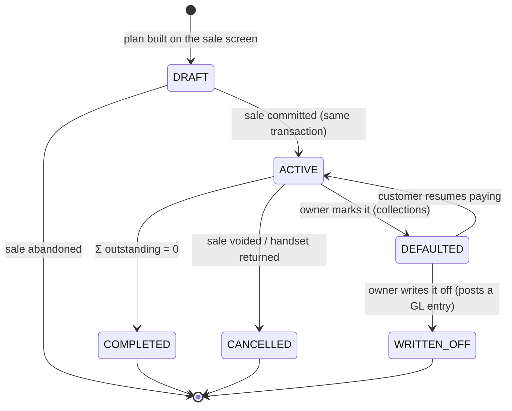
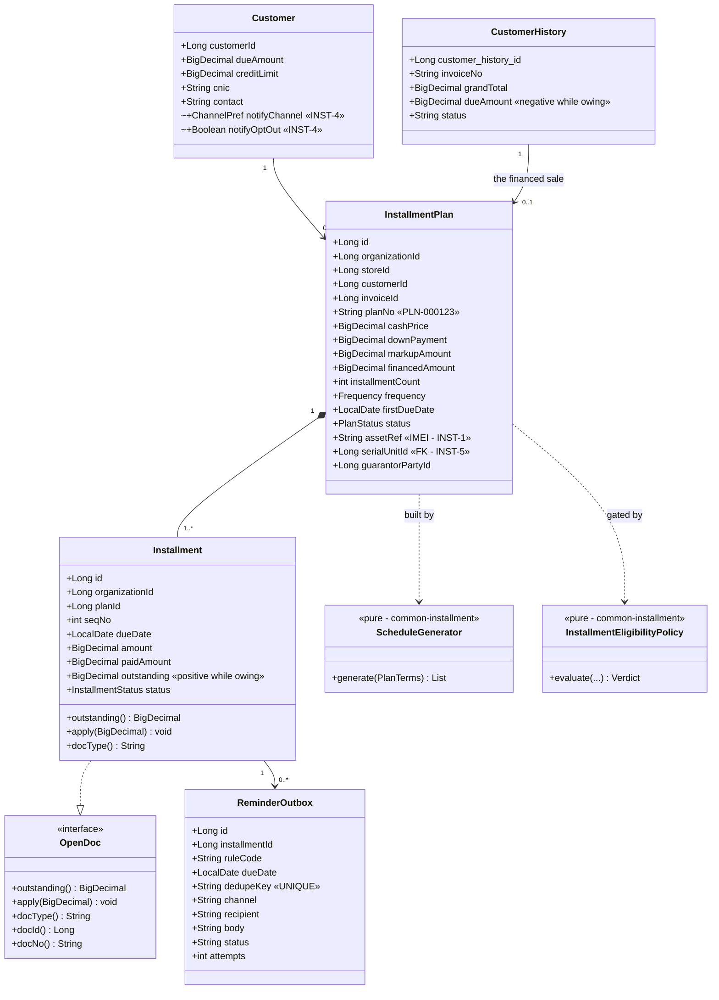
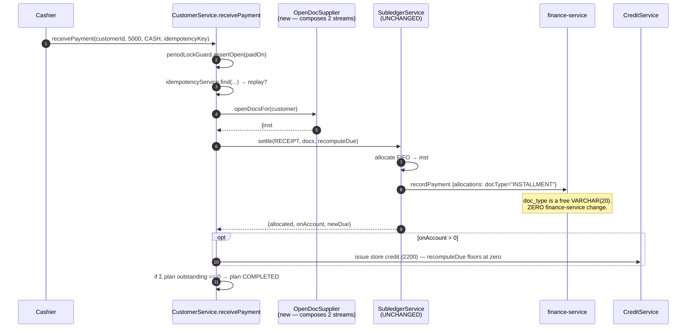

# Selling on installment — dues, balances & payment reminders

**Status:** ANALYSIS + DESIGN — no code written. Awaiting consent before INST-1.
**Requested by:** a customer running a **mobile shop** — sells accessories over the counter, sells handsets
**on installment**, and wants dues + remaining balances tracked and the customer reminded when a payment falls due.
**Scope of this doc:** an end-to-end review of what the platform already does, what it does not, and a design that
serves this shop *and* the next four verticals that will ask for the same thing.
**Governing standards:** [`SAAS-BUILD-STANDARDS.md`](SAAS-BUILD-STANDARDS.md) · [`ARCHITECTURE-MULTITENANCY.md`](ARCHITECTURE-MULTITENANCY.md)
**Related:** [`customer-requirements-plan.md`](customer-requirements-plan.md) · [`finance-f2-statements-aging-design.md`](finance-f2-statements-aging-design.md) · [`edu-N1-notification-outbox.md`](slices/edu-N1-notification-outbox.md) · [`store-credit-design.md`](store-credit-design.md)

**Spelling:** the codebase will use **`installment`** (one `l`) in every identifier, column, setting key, i18n key
and message. Fixed here on purpose — D9b's homonym incident says a concept that ships under two spellings can
never be swept cleanly afterwards.

---

## 1. Document — what the shop actually does

A mobile shop runs **two businesses under one till**:

| | What it is | What the platform does today |
|---|---|---|
| **Accessories** | cases, chargers, cables, glass protectors — low value, cash/card, walk-in | ✅ **Fully served.** POS sale screen, barcode-first scan, multi-rate tax, tenders, day-close, returns, receipts, stock, purchase, reports. Nothing to build. |
| **Handsets on installment** | one high-value item, a down payment, then N dated payments over months, against a named customer | 🔴 **Not served at all.** |

**The first finding worth stating loudly: only half of this request is new work.** The accessories half is a shop
the platform already runs. Everything below is about the financed handset — and about not breaking the half that
works while adding it.

### What the customer is really asking for

Decomposed into capabilities, because "installments with reminders" is four different things:

| # | Capability | Plain statement |
|---|---|---|
| **R1** | **Sell on a plan** | at the counter, turn one sale into a down payment plus a dated schedule |
| **R2** | **Know the dues** | per customer, per plan: financed, paid, **remaining balance**, next due, how overdue |
| **R3** | **Collect against the plan** | take a payment and have it land on the right installments, in the books, on the receipt |
| **R4** | **Remind, on time, reliably** | tell the customer before/on/after the due date, through a channel they read, once — not twice, not never |

R4 is where this will be won or lost. R1–R3 are bookkeeping the platform is already very good at. R4 is a
**time-triggered** capability, and the platform today has **none**.

### The unstated fifth requirement

A shop that finances handsets and cannot say *which handset* — **the IMEI** — cannot repossess, cannot honour a
warranty, cannot answer the police, and cannot tell two identical phones apart on two different plans. The customer
did not ask for it. They will, on the first default. Treated below as **R5**, phased, not smuggled into phase 1.

---

## 2. Review — end to end, against the code

### 2a. What already exists and is directly reusable

Verified by reading the code, not assumed. This is the reason the estimate is *M*, not *L*.

| Existing asset | Where | What it gives R1–R5 |
|---|---|---|
| **`OpenDoc` + `SubledgerService`** | `common-subledger` | **The single most important find.** A domain-free port for *"a thing that is still owed"*, plus FIFO allocation, ledger recording and balance recomputation. `allocate()` is already **public and separate from `settle()`** — its javadoc says so, because education needed to apply money without recording a receipt. An installment is exactly an `OpenDoc`. |
| **`AgingCalculator`** | `common-subledger` | Buckets rows of `{outstanding, ageDate}`. **It needs no change** — installment aging is a different row *supplier*, not different arithmetic. Evidence the library was factored at the right seam. |
| **`StatementBuilder`** | `common-subledger` | statement of account per party |
| **`CreditLimitPolicy`** | `common-credit` | pure, no I/O, `evaluate()` + `decide()` → `PROCEED / CONFIRM / REFUSE`, with `off/warn/block` per tenant. Shared-pool aware. An installment sale's exposure is already measured correctly by it. |
| **`CreditService` + `CreditStore` SPI** | `common-credit` | **the precedent to copy**: rules in a library, data in the owning service. `common-installment` is the same shape. |
| **finance-service ledger** | `:8094` | `Payment` + `PaymentAllocation`. **`doc_type` is a free-form `VARCHAR(20)` defaulting to `"INVOICE"`** — an `"INSTALLMENT"` allocation records with **zero finance-service change**. |
| **`PostingService` + chart of accounts** | finance-service | `1000/1010` Cash/Bank · `1100` AR · `2100` Tax · `2200` Store credit · `4000` Sales · `4200` Sales discount · `4300` Delivery · `5000` COGS. Idempotent posting via `ProcessedEvent`. |
| **`PeriodLock` / `PeriodLockGuard`** | finance + business | a receipt dated into a closed period is already refused |
| **`IdempotencyService`** | business-service | `receivePayment` already dedupes a double-click |
| **`common-outbox`** (`OutboxEntry` / `OutboxDelivery` / `OutboxRelay`) | library | the reliable-delivery state machine, **proven three times** (gl_outbox, audit_outbox, notify_outbox). `MAX_ATTEMPTS 20`, dead-letters to `FAILED`. |
| **notification-service** | `:809x` | `notification_broadcast` + `notification_delivery` (per-recipient), a `@Scheduled` `DeliveryDispatcher` that retries and gives up visibly. |
| **`common-settings`** | library | per-tenant setting catalog + a **self-rendering Configuration screen**. New keys cost ~zero UI. |
| **`Customer`** | business-service | `dueAmount`, `creditLimit`, `paymentTermsDays`, `creditBalance`, **`cnic`**, `city`, `partyId`, `creditAccountCustomerId`. The KYC field an installment agreement needs is *already there* (added for B2B licence printing). |
| **`CustomerHistory`** | business-service | `dueDate`, `paidAmount`, `dueAmount`, `balanceAfter`, `issuedTotal`, `status ACTIVE/VOID`, `storeId`, invoice series |
| **party-service** | `:8096` | shared party master + roles + hierarchy → **a guarantor is a Party with a role**, not a new entity |
| **`common-import`** | library | CSV import engine — migrating a shop's existing paper/Excel plans |
| **document designer / `document-pdf.js`** | monolith | the printed **installment agreement + schedule** is a template, not new rendering code |
| **inventory-service** | `:80xx` | `StockEntry` with `batchNo` + `expiryDate`, reservations, FEFO, the sell↔stock saga |

### 2b. The gaps — what genuinely does not exist

| # | Gap | Evidence | Severity |
|---|---|---|---|
| **G1** | **No schedule-of-obligations concept anywhere.** One invoice = one debt with **one** `due_date`. `findOpenInvoicesByCustomer` orders by `invoice_seq`; aging ages the *whole* invoice from *one* date. | `grep -i installment\|instalment\|layaway\|hire.purchase` over the whole repo → **zero hits** outside vendored `jsPDF`. | 🔴 core |
| **G2** | **Aging will lie the moment a plan exists.** An 8-month plan taken today would appear as one balance ageing from one date; by month 4 the *entire* remaining balance sits in `90+` even though only one installment is late. | `CustomerHistoryRepo.findOpenInvoicesScoped` + `FinanceReportService.customerAging` | 🔴 silent-wrong |
| **G3** | **No time-triggered notification of any kind.** Every notification in the platform is *event*-triggered (a thing happened → tell someone). Nothing scans a calendar. | `@Scheduled` exists 19× — all are **outbox relays and sweepers**, none is a due-date scan. | 🔴 core to R4 |
| **G3b** | **`Campaign.scheduledAt` is stored and never fires.** campaign-service has **no `@Scheduled` at all**. | `grep -rn "@Scheduled" campaign-service` → nothing | ⚠ trap — looks like scheduling exists |
| **G4** | **No SMS channel.** `Channel { EMAIL, SMS }` — and `Channel.java`'s own javadoc says SMS is *"deliberately NOT implemented… a delivery row carrying SMS today would simply never be dispatched."* | `notification-service/entity/Channel.java` | 🔴 R4 is worthless on email for this customer |
| **G5** | **No transactional message templating.** `campaign_templates` exists but is marketing-scoped (audiences, opens, clicks, budget). Education composes subject/body in Java strings. | campaign-service · `EduNotifyService` | 🟠 |
| **G6** | **No serial/per-unit identity.** Stock is tracked by **batch**, quantity-based. No IMEI, no per-unit status, no "which customer holds unit X". | `StockEntry.batchNo` only | 🟠 R5 |
| **G7** | **No financing arithmetic** — tenor, frequency, down payment, markup, late fee, rounding residual. | — | 🔴 core |
| **G8** | **No customer contact preference / opt-out / quiet hours.** `Customer` has `contact` and `email` and no channel policy. | `Customer.java` | 🟠 legal + goodwill |
| **G9** | **No per-tenant notification quota.** Email is free-ish; **SMS costs money per message** and a runaway loop is a bill. | notification-service | 🟠 |
| **G10** | **No org timezone setting.** The JDBC connection is pinned to `+05:00`; "what is today" for a scan is the *server's* answer, not the tenant's. | `project_db_timezone_standard` | 🟠 will bite on the first non-PK tenant |

### 2c. Two quirks the implementation must respect

1. **`CustomerHistory.dueAmount` is signed the other way round.** It stores `paid − bill`, so it is **negative
   while the customer owes**, and `findOpenInvoicesByCustomer` filters `dueAmount < 0`. `CustomerService`'s
   `OpenDoc` adapter negates it. The installment entity will store a **plain positive `outstanding`** — but the
   two must never be added together without normalising, and `recomputeDue` must stay the one writer of
   `Customer.dueAmount`.
2. **`recomputeDue` floors the balance at zero** — *"this app keeps no credit"*. Overpayment on a plan must go to
   **store credit (`2200`)** via the existing `CreditService`, not into a negative due. That path already exists.

---

## 3. Design

### D1 — An installment IS an `OpenDoc`. Do not build a second settlement path.

The whole of R3 is already written. `SubledgerService.allocate()` takes `List<? extends OpenDoc>` and applies money
FIFO; `settle()` records it in the shared ledger and recomputes the party balance. Adapting `Installment` to
`OpenDoc` (**Adapter** pattern, exactly as `CustomerService` and `VenderService` already do inline) makes
`receivePayment` work on plans **without touching the allocator, finance-service, the GL, or the receipt path**.

`docType()` returns `"INSTALLMENT"`, `docId()` the installment id, `docNo()` `"INV-000123/3"` — and because
`payment_allocations.doc_type` is a free 20-char string, the ledger records it as-is.

> **Why not a separate "installment payment" endpoint?** Because then two code paths would decide what a receipt
> means, and the codebase already has the scar tissue from that: `SubledgerService` exists *because* AR and AP had
> drifted into two copies of allocate-and-record. A second one would be the third.

### D2 — Ordered composition, not a second allocator

A customer can owe **both** — accessories on a normal invoice and a handset on a plan. One receipt must clear both,
in a defensible order. The allocator already walks whatever list it is handed, so the only new logic is **which
list**:

```
openDocsFor(customer) =
     installments  WHERE status IN (SCHEDULED, PARTIAL) ORDER BY due_date ASC, id ASC     ← oldest obligation first
  ++ invoices      WHERE dueAmount < 0 AND NOT part of a plan ORDER BY invoice_seq ASC
```

**Composite** over two suppliers, one ordered stream. Default order is configurable
(`pos.installment.allocationOrder = installmentsFirst | byDueDate | invoicesFirst`) because a shop that is chasing
a plan wants the money on the plan, and a shop closing its month wants the oldest paper cleared. `byDueDate` merges
both streams on date and is the accountant's answer.

**The invoice that carries a plan is excluded from the invoice stream** — otherwise the same debt is offered to the
allocator twice and a receipt would over-clear. See D5.

### D3 — Schedule generation is a pure function in a shared library

New library **`common-installment`** — rules only, no entity, no repository, no tenant logic. Identical shape to
`common-credit` (`CreditLimitPolicy` is pure; `CreditService` uses a `CreditStore` SPI so the data stays in the
owning service).

```java
public record PlanTerms(BigDecimal cashPrice, BigDecimal downPayment, int count,
                        Frequency frequency, LocalDate firstDueDate,
                        BigDecimal markupAmount, MarkupMode markupMode) {}

public final class ScheduleGenerator {
    public static List<ScheduledAmount> generate(PlanTerms terms);   // pure. no clock, no Spring.
}
```

Three rules that a second implementation always gets wrong, so they live here once:

1. **Σ(installments) == financed amount, to the cent.** The rounding residual goes on the **last** installment,
   never spread. `10,000 / 3` is `3,333.33 · 3,333.33 · 3,333.34`, and the shop's ledger must not be out by `0.01`.
2. **`BigDecimal(19,2)`, `HALF_UP`, everywhere** (governing standard §1.5).
3. **Frequency arithmetic is calendar-aware.** `MONTHLY` from the 31st lands on the 30th, then the 28th — using
   `plusMonths`, never `plusDays(30)`. `WEEKLY` / `FORTNIGHTLY` / `MONTHLY` in phase 1.

Also pure, also here: **`InstallmentEligibilityPolicy`** — may this customer take a plan? (identified, CNIC present
if required, no installment more than *N* days overdue, open plans under the cap, down payment ≥ minimum, and the
financed amount passed through the existing `CreditLimitPolicy`). Pure means it runs in `mvn test` on every build
with no Testcontainers — which matters, because D2a says a skipped container test is indistinguishable from a
passing one.

### D4 — Plan data stays in business-service

`common-installment` owns **arithmetic and eligibility**. The **tables live in the service that owns the sale**.
Education's fee installments will live in education-service; welfare pledges in welfare-service. Same rule the
`CreditStore` SPI settled: *shared rules, local ledger*.

> Applying the microservice standard honestly: an installment plan has no independent lifecycle away from the sale
> that created it, no integration surface of its own, and no consumer that is not already a consumer of the invoice.
> **It is not a service.** It is a library plus a table in the service that owns the receivable. A `finance-service`
> home was considered and rejected — the plan must be written in the **same transaction** as the sale, and
> finance-service is deliberately reached through a best-effort client that *"a ledger hiccup never blocks"*.

### D5 — The plan is a *structure over* the existing receivable, not a new one

**This is the decision that keeps the books safe.**

An installment sale is a credit sale. It posts **exactly what a credit sale posts today**:

```
Dr Cash/Bank  (down payment)
Dr 1100 AR    (financed)          =   Cr 4000 Sales (sub)  +  Cr 2100 Tax
```

and every receipt posts `Dr Cash = Cr 1100 AR`, unchanged. **No new GL event type. No new field on
`PostingEventRequest`. No change to `gl_outbox`.**

That last sentence is the point. `gl_outbox` is a *persisted table copied field by field*: a new
`PostingEventRequest` field needs **five** places or it silently vanishes — and `4200 Sales Discount` was empty in
every tenant for months while three specs stayed green. A design that adds no field cannot reproduce that defect.

Consequences, stated so nobody "improves" them later:

- **`installment_plan` does not hold money the GL does not already know about.** Σ(open installments) must always
  equal the plan invoice's outstanding. That equality is an **invariant, and it is the INST-1 gate.**
- **The plan invoice is excluded from the ordinary open-invoice stream** (D2), because the plan represents it.
- **A separate `1150 Installment Receivable` account was considered and deferred.** It is defensible on a balance
  sheet, and it means every receipt must decide which bucket it clears and every void must unwind two. Not worth it
  until a customer asks to see it separately.

### D6 — `OVERDUE` is derived, never stored

`Installment.status ∈ { SCHEDULED, PARTIAL, PAID, WAIVED }`. **There is no `OVERDUE` value.**

Overdue is `due_date < today AND outstanding > 0`. Storing it would need a nightly job to flip rows, and the day
that job does not run — a restart, a deploy, a Sunday — every screen quietly shows stale truth. A derived predicate
cannot go stale. The scanner in D8 uses the same predicate, so the reminder and the screen can never disagree.

Plan status **is** stored, because its transitions are decisions a person makes:



`DEFAULTED → ACTIVE` exists because customers do come back, and a one-way door would force the shop to build a
second plan for the same handset.

### D7 — Domain model



### D8 — Reminders: a due-date **scanner** feeding the existing outbox

**Polling Publisher → transactional outbox → notification-service.** The fourth use of `common-outbox`; no new
delivery state machine, no new retry logic, no new dead-letter policy.

```mermaid
sequenceDiagram
    autonumber
    participant S as ReminderScanner<br/>(@Scheduled, business-service)
    participant DB as installment
    participant OB as installment_reminder_outbox
    participant R as OutboxRelay<br/>(common-outbox)
    participant N as notification-service
    participant D as notification_delivery
    participant C as Customer

    S->>DB: due_date BETWEEN today-catchup AND today+maxOffset<br/>AND status IN (SCHEDULED, PARTIAL)
    DB-->>S: candidate installments
    loop each installment × each configured offset rule
        S->>S: dedupeKey = "INST-REM:{id}:{rule}:{dueDate}"
        S->>OB: INSERT ... ON DUPLICATE KEY IGNORE
        Note over OB: UNIQUE(dedupe_key) is the ONLY thing<br/>standing between one reminder and five
    end
    OB-->>R: PENDING rows
    R->>N: POST /api/notifications/send {channel, to, subject, body, dedupeKey}
    N->>D: one delivery row per recipient
    N-->>C: EMAIL (today) / SMS (INST-4)
    D-->>N: SENT | FAILED + lastError
    Note over R,D: two layers of retry, each owning its own failure —<br/>the REQUEST survives a business-service restart;<br/>the DELIVERY is retried per recipient by DeliveryDispatcher
```

Six decisions inside that diagram:

1. **The dedupe key is the whole design.** `UNIQUE(organization_id, dedupe_key)` with an insert-ignore. A rescan, a
   restart, a second instance, a clock jump — all become no-ops. **`dueDate` is part of the key on purpose**: if
   the owner reschedules an installment, that is a genuinely new obligation and the customer should be told again.
2. **Scan a WINDOW, not "today".** `today − catchupDays` to `today + maxOffset`. If the service is down on the 3rd,
   the 3rd's reminders go out on the 4th instead of never. The dedupe key makes the overlap free.
3. **business-service owns the calendar; notification-service stays domain-free.** SCHED-1's D-9 records what
   happens when a shared service learns a domain's vocabulary — appointment-service became a clinic's and education
   could not use it. A due date **is** business-service's data. notification-service delivers and nothing else.
4. **The body is rendered by the caller** from a per-tenant template setting, exactly as education composes its own
   subject and body. notification-service gains a channel and a schedule-free `send`, not a template engine.
5. **Never remind on a `PAID` installment**, and stop reminding a `DEFAULTED` or `WRITTEN_OFF` plan — after
   `pos.installment.reminder.maxOverdue` overdue notices, the plan goes on the collections list and stops texting.
   A system that texts a defaulted customer forever is how a shop loses a neighbourhood.
6. **Quiet hours + a send hour.** The scanner enqueues; the relay only *hands over* between
   `pos.installment.reminder.sendHour` and `quietFrom`. Nobody's phone buzzes at 03:00 because a relay woke up.

### D9 — SMS: a port and an adapter, not a vendor

notification-service grows:

```java
public interface SmsGateway {                       // the port
    SendResult send(String to, String text);
}
```

with `LoggingSmsGateway` (default — dev, and it makes `Channel.SMS` stop being a lie), and one real adapter chosen
by `notify.sms.provider`. **Strategy**, selected by config, resolved at startup. `DeliveryDispatcher` gains one
branch on `broadcast.channel`; everything else — the delivery row, the attempt counter, the give-up, the per-tenant
read endpoint — is already written and channel-agnostic.

Per-tenant **quota and cost ceiling** ship *with* SMS, not after it (G9): an unbounded loop on email is noise, on
SMS it is an invoice.

### D10 — Aging and statements must learn about plans, or they will lie

`AgingCalculator` is unchanged. The **row supplier** changes:

```
for each open invoice of the tenant:
    if the invoice carries a plan  -> emit one AgingRow per OPEN INSTALLMENT  {outstanding, dueDate}
    else                           -> emit one AgingRow for the invoice        {outstanding, dueDate ?: dated}   (today's behaviour)
```

A 6-month plan taken today then shows **only the late installments** as overdue and the rest as current — which is
what the money actually is. Today it would show the entire remaining balance in `90+` by month four.

> This is G2 and it is the **quietest** risk in the whole design: nothing errors, no test fails, the number is just
> wrong. It is why INST-2 has its own gate rather than riding along with INST-1.

The **statement** gains a schedule block under the plan invoice: each installment, its due date, what was paid
against it, and the running remaining balance.

### D11 — Configuration: per tenant, off by default

New keys in `BusinessSettingsCatalog`, rendered by the existing self-rendering Configuration screen (no UI work):

| Key | Type | Default | Notes |
|---|---|---|---|
| `pos.installment.enabled` | bool | **`false`** | *A default is not a decision* — an existing shop sees no change |
| `pos.installment.defaultCount` | int | `6` | |
| `pos.installment.frequency` | select | `MONTHLY` | `WEEKLY / FORTNIGHTLY / MONTHLY` |
| `pos.installment.minDownPaymentPct` | int | `0` | |
| `pos.installment.maxOpenPlansPerCustomer` | int | `1` | |
| `pos.installment.blockIfOverdueDays` | int | `0` (off) | refuse a new plan while one is *n* days late |
| `pos.installment.requireCnic` | bool | `false` | `Customer.cnic` already exists |
| `pos.installment.requireGuarantor` | bool | `false` | a Party with a role |
| `pos.installment.allocationOrder` | select | `byDueDate` | D2 |
| `pos.installment.markupEnabled` | bool | **`false`** | INST-6 — see D12 |
| `pos.installment.lateFee.policy` | select | `off` | `off / flat / percent` — INST-6 |
| `pos.installment.reminder.enabled` | bool | `false` | |
| `pos.installment.reminder.offsets` | text | `-3,-1,0,3,7` | days relative to due date; negative = before |
| `pos.installment.reminder.maxOverdue` | int | `3` | then stop and escalate to collections |
| `pos.installment.reminder.channel` | select | `EMAIL` | `EMAIL / SMS / BOTH` |
| `pos.installment.reminder.sendHour` | int | `10` | tenant-local |
| `pos.installment.reminder.quietFrom` | int | `21` | |
| `pos.installment.reminder.catchupDays` | int | `3` | D8 rule 2 |
| `pos.installment.template.upcoming` | text | seeded | tokens below |
| `pos.installment.template.dueToday` | text | seeded | |
| `pos.installment.template.overdue` | text | seeded | |

Template tokens: `{customer} {shop} {amount} {dueDate} {installmentNo} {of} {balance} {planNo} {invoiceNo}`.
Rendered through the existing XSS-safe helpers; **unknown tokens render literally rather than blank**, so a typo in
a template is visible to the owner instead of silently sending "Dear ,".

### D12 — Markup / interest: the trap, and the decision

If the shop charges more for the installment price than the cash price, that difference is **finance income**, not
goods revenue, and it is usually **not taxable as a supply of goods**.

| Option | Treatment | Verdict |
|---|---|---|
| **A1** — fold the markup into the invoice value | posts to `4000 Sales`, sits inside the tax base | ❌ **The trap.** Overstates goods revenue, and puts tax on financing. Looks like the least work and corrupts two reports at once. |
| **A2** — `4400 Finance Income`, credited outside `subTotal` and outside the tax base | correct; needs `PostingEventRequest` + the five `gl_outbox` copy points + a `PostingService` branch | ✅ correct, **and it is exactly the change shape that lost `4200` for months** |
| **A0** — **phase 1 ships zero-markup plans only** | the sticker price already contains the shop's margin; the plan just dates it | ✅ **recommended for INST-1** |

**Decision: A0 now, A2 at INST-6, A1 never.** Most "easy installments" mobile shops price the markup into the
handset already, which makes A0 not a limitation but a description. `pos.installment.markupEnabled` stays `false`
until INST-6 lands **with a trial-balance gate** — not an invoice gate. *Gate the trial balance, not the invoice*
is written in blood in this repo.

Late fee: `4500 Late Fee Income`, posted **when charged**, never accrued. An accrued fee the shop later waives is a
reversal nobody asked for.

### D13 — Void, return and repossession: the sharpest edges

| Event | What must happen |
|---|---|
| **Void the plan invoice** | plan → `CANCELLED`, all `SCHEDULED` installments → `WAIVED`, receipts already taken become **store credit** (`2200`, existing path), GL reverses through the existing void journal |
| **Handset returned mid-plan** | plan `CANCELLED` + credit note (`CRN-` series exists); **the plan must not survive its invoice** |
| **Partial return / accessory returned** | plan untouched — only the plan invoice matters |
| **Repossession (INST-5)** | serial unit → `REPOSSESSED`, plan → `WRITTEN_OFF` or re-based, stock optionally restored |
| **Reschedule an installment** | new due date → new dedupe key → the customer is re-notified (D8 rule 1) |
| **Period lock** | receipts already guarded by `PeriodLockGuard`; **plan creation is not money movement** and is not guarded — the sale that carries it is |

The POS/Retail standards audit already records that *GL auto-posts only NEW sales, so returns/edits/voids drift the
books*. Installments make that drift **bigger and slower to notice**, because the money arrives over months. Every
row above needs a gate.

### D14 — Serial / IMEI (R5), phased honestly

- **INST-1:** `InstallmentPlan.assetRef` — a free-text IMEI on the plan. Cheap, immediately useful, honest about
  what it is: a *label*, not a register.
- **INST-5:** `serial_unit` in **inventory-service** — `(organization_id, product_id, serial_no UNIQUE per org,
  status IN_STOCK/SOLD/RETURNED/REPOSSESSED/LOST, store_id, purchase_ref, sale_ref)`, picked on the sale saga, with
  `InstallmentPlan.serial_unit_id` replacing `assetRef`.

> **Rejected: reuse `batchNo` with quantity 1.** It is the tempting shortcut and it buys nothing — no uniqueness
> constraint, no per-unit status, no "which customer holds this IMEI", and it silently corrupts FEFO, which reads
> batches as fungible lots. A `serial_unit` table is honest; an abused `batchNo` is a lie the inventory service
> will eventually act on.

### D15 — How the next vertical gets this for free

The point of doing it this way rather than bolting a `mobile_installments` table onto business-service:

| Future ask | What it costs, given this design |
|---|---|
| **Education** — school fee in installments | `FeeCollection` already has `due_day_of_month`. An `OpenDoc` adapter + `ScheduleGenerator` + the same reminder scanner. **No new arithmetic, no new delivery machinery.** |
| **Pharmacy** — equipment on terms | same library, same shape |
| **Welfare** — pledged donations by instalment | same |
| **Agriculture** — input credit repaid at harvest | `IRREGULAR` frequency = a hand-entered schedule; the generator gains one mode |
| **Marketplace** — BNPL at storefront checkout | the plan is created by the same service that writes the sale |
| **Anything with a due date** — fee reminders, appointment reminders, licence expiry, cheque maturity | **`common-reminder`**: extract `DueScanner<T>` + offset rules + dedupe key + outbox enqueue once there is a **second** consumer, not before. Two consumers make an abstraction; one makes a guess. |

The generalisation ladder is the one this codebase already climbed: `CsvWriter` moved to `common-import` when
catalog needed it, `SubledgerService` was extracted when AP repeated AR. **Build it in business-service with the
pure parts already in `common-installment`; extract `common-reminder` at the second caller.**

### D16 — Does a mobile shop need its own user type? **No.**

`userType` stays **`BUSINESS`**. No `MOBILE` role, no new dashboard, no new route.

**What PHARMA and MARKETPLACE actually earned their vertical id with** — the honest test, read off the code:

| | Own bounded-context service | Genuinely different vocabulary | Features the others must not see |
|---|---|---|---|
| **PHARMA** | ✅ pharma-service — prescriptions, Rx enforcement, controlled register | ✅ Customer→**Patient**, Item→**Medicine**, Sale→**Dispense** | ✅ `data-feature="rx"`, batch/expiry |
| **MARKETPLACE** | ✅ marketplace-service — storefront, orders, shipments | ✅ Customer→**Buyer**, Sale→**Order** | ✅ `orders`, `storefront` |
| **A mobile shop** | ❌ nothing pharma-service-shaped exists to build | ❌ customer, item, sale, invoice, supplier — **POS words, unchanged** | ❌ nothing another retailer must be denied |

Zero of three. **A vertical id is for a different DOMAIN; a setting is for a different DEAL.** Financing a handset
is a different deal.

#### The four levers, and which one each concern belongs to

| Concern | Lever | Why this one |
|---|---|---|
| Is the capability available to this shop? | **tenant setting** `pos.installment.enabled` | already how ~35 settings compose the sale screen; a grocery on the same `BUSINESS` type simply leaves it off |
| Who may use it? | **privilege** (`@PreAuthorize`) | reschedule / waive / write-off are owner decisions, not counter ones |
| What words does the screen use? | `module-theme.js` `labels` | only when the vocabulary genuinely differs — here it does not |
| Which dashboard does a login land on? | **`activeOrgType`** (JWT → `ModuleRouter`) | already routes; a mobile shop is commerce |

#### What a new user type would actually cost

Not free, and it buys nothing when every screen is identical: `AuthService.moduleFor` / `moduleForOrg` mapping ·
`CommerceDashboardController.COMMERCE_MODULES` · `ModuleRouter.DASHBOARD_BY_TYPE` + `COMMERCE_TYPES` ·
`module-theme.js` `VERTICALS` · `SetupDataLoader` role seeding (`ROLE_MOBILE_USER`, …) · **i18n keys × 6
languages** · Cypress fixtures. Then the same request arrives for electronics, furniture and bike dealerships —
**four vertical ids that render identically.**

> **Two corrections to an earlier draft of this section, kept because they change the sums:**
> **(a)** the gateway demo write-cap costs **nothing** — `JwtAuthenticationFilter.moduleOf(path)` derives the
> module from the **URL path segment** (`/api/<module>/…`), not from the org or user type.
> **(b)** privileges cost **nothing either** — there is no `role_privileges_pharma.properties` or
> `_marketplace.properties`. **PHARMA and MARKETPLACE reuse BUSINESS privileges**, which is the strongest
> in-repo evidence that a new commerce vertical needs no new role set.

#### The wrinkle this question exposes

The two mechanisms disagree today:

```
ModuleRouter.dashboardFor(...)              → prefers the ACTIVE ORG's module   (B2B P0.5, the newer rule)
CommerceDashboardController.resolveModule() → reads user.getUserType()          (slice 36, the older rule)
```

A `BUSINESS`-typed user working inside a `PHARMA` org is **routed** to the commerce dashboard and then **skinned**
as POS. `User.activeOrgType` **already exists in the monolith** and `ModuleRouter.moduleOf(user)` **already
implements the correct precedence** — `CommerceDashboardController` simply does not call it. That is a
**one-method defect fix with an existing `ModuleRouterTest` to extend**, and it is a prerequisite for anything
below.

#### DECISION — the "Mobile Shop" identity lives on the ORG, not the person

Accepted. `Organization.type = 'MOBILE'`:

- the column is **free-text `String`** (`/** SCHOOL | COLLEGE | ... */`) and
  `OrganizationService.createTenant(owner, name, **type**, plan)` writes it **with no validation, no enum and no
  allow-list** — so the *column* needs no migration;
- it is **already in the JWT** as `activeOrgType`, already surfaced as `User.activeOrgType`, already preferred by
  `ModuleRouter.moduleOf`;
- `AuthService.moduleFor()` maps everything non-`EDUCATION` to `BUSINESS` for location grants, so a `MOBILE` org
  gets **store** grants automatically — nothing to change.

##### ⚠ But free-text at the COLUMN is not free-text at the ROUTER — and this would break login

`ModuleRouter.DASHBOARD_BY_TYPE` is a fixed **7-entry `Map.of`**, and `dashboardForModule` returns
**`LANDING` ("/")** for anything not in it — deliberately, so an unknown module never guesses a URL that would
404. The consequence is exact and severe:

> **Setting `Organization.type = 'MOBILE'` today sends every user in that tenant to the public landing page at
> login.** Not a 404, not an error — a silent bounce, on every sign-in, for the whole org.

So the change is **three registrations, not one**:

| Place | Add | Without it |
|---|---|---|
| `ModuleRouter.DASHBOARD_BY_TYPE` | `"MOBILE" → "/businessDashboard"` | every login lands on `/` |
| `ModuleRouter.COMMERCE_TYPES` | `"MOBILE"` | `isCommerce()` false → commerce-only behaviour skipped |
| `CommerceDashboardController.COMMERCE_MODULES` | `"MOBILE"` | routed correctly, then **skinned as POS** |

Three hardcoded sets, in two classes, that must be edited together for every new business type. **That is the
real finding here**, and it is bigger than this slice — see
[`vertical-profile-any-business-design.md`](vertical-profile-any-business-design.md), which proposes replacing all
three with a tenant **profile** so the next domain needs no Java edit at all.

##### Sequencing

**INST-1 → INST-3 need none of this.** Ship on `userType = BUSINESS` + `pos.installment.enabled`. The `MOBILE`
org profile is **INST-8**, a cosmetic slice, and it is gated behind the `CommerceDashboardController` fix
(**INST-0b**) because branding a vertical on a router that ignores org type would make the inconsistency worse,
not better.

---

## 4. Sequences

### 4a. Selling on a plan

```mermaid
sequenceDiagram
    autonumber
    participant U as Cashier
    participant JS as installment.js
    participant SC as SellController
    participant EL as InstallmentEligibilityPolicy<br/>(pure)
    participant SG as ScheduleGenerator<br/>(pure)
    participant SS as SagaSellService
    participant IS as InstallmentPlanService
    participant INV as inventory-service
    participant GL as gl_outbox → finance

    U->>JS: cart + customer + "Sell on installment"
    JS->>SC: GET /installment/preview {cashPrice, down, count, freq, firstDue}
    SC->>SG: generate(terms)
    SG-->>SC: 6 dated amounts, Σ == financed EXACTLY
    SC-->>JS: schedule preview (shown before commit)
    U->>JS: confirm sale
    JS->>SC: POST /addSell {..., installmentPlan:{...}, assetRef}
    SC->>EL: evaluate(customer, terms, settings)
    alt not eligible
        EL-->>SC: REFUSE / CONFIRM
        SC-->>JS: uiConfirm(reason) or refusal
    else eligible
        SC->>SS: assertCreditPolicy(unpaid = financed)
        Note over SS: unchanged — an installment sale's<br/>exposure is already measured correctly
        SS->>INV: reserve + confirm (existing saga)
        SC->>IS: createPlan(invoice, terms)
        Note over IS: SAME transaction as the invoice.<br/>A plan without its invoice is a phantom debt;<br/>an invoice without its plan is an unreminded one.
        SC->>GL: SALE event — IDENTICAL to a plain credit sale
    end
```

### 4b. Receiving a payment against a plan



---

## 5. Data model & migrations

**business-service — next free version is `V42`** (V41 is the current head).

```sql
-- V42__installment_plan.sql
CREATE TABLE IF NOT EXISTS installment_plan (
  id                 BIGINT AUTO_INCREMENT PRIMARY KEY,
  organization_id    BIGINT,
  store_id           BIGINT,
  user_id            BIGINT,
  customer_id        BIGINT       NOT NULL,
  invoice_id         BIGINT       NOT NULL,
  plan_no            VARCHAR(32),
  cash_price         DECIMAL(19,2) NOT NULL,
  down_payment       DECIMAL(19,2) NOT NULL DEFAULT 0.00,
  markup_amount      DECIMAL(19,2) NOT NULL DEFAULT 0.00,
  financed_amount    DECIMAL(19,2) NOT NULL,
  installment_count  INT           NOT NULL,
  frequency          VARCHAR(16)   NOT NULL,
  first_due_date     DATE          NOT NULL,
  status             VARCHAR(16)   NOT NULL,
  asset_ref          VARCHAR(64),          -- IMEI (INST-1); superseded by serial_unit_id at INST-5
  guarantor_party_id BIGINT,
  created_at         DATETIME, updated_at DATETIME,
  UNIQUE KEY uq_plan_org_no      (organization_id, plan_no),
  UNIQUE KEY uq_plan_invoice     (invoice_id),        -- one plan per invoice; the D5 invariant, enforced
  KEY idx_plan_org_customer      (organization_id, customer_id),
  KEY idx_plan_org_status        (organization_id, status)
);

CREATE TABLE IF NOT EXISTS installment (
  id               BIGINT AUTO_INCREMENT PRIMARY KEY,
  organization_id  BIGINT,
  plan_id          BIGINT        NOT NULL,
  seq_no           INT           NOT NULL,
  due_date         DATE          NOT NULL,
  amount           DECIMAL(19,2) NOT NULL,
  paid_amount      DECIMAL(19,2) NOT NULL DEFAULT 0.00,
  outstanding      DECIMAL(19,2) NOT NULL,     -- POSITIVE while owing (unlike customer_history.due_amount)
  status           VARCHAR(16)   NOT NULL,     -- SCHEDULED | PARTIAL | PAID | WAIVED   (never OVERDUE — D6)
  updated_at       DATETIME,
  UNIQUE KEY uq_inst_plan_seq  (plan_id, seq_no),
  KEY idx_inst_scan            (organization_id, status, due_date),   -- THE scanner index (D3b: index the predicate)
  KEY idx_inst_plan            (organization_id, plan_id)
);

-- V43__installment_reminder_outbox.sql
CREATE TABLE IF NOT EXISTS installment_reminder_outbox (
  id               BIGINT AUTO_INCREMENT PRIMARY KEY,
  organization_id  BIGINT,
  installment_id   BIGINT       NOT NULL,
  rule_code        VARCHAR(16)  NOT NULL,       -- "-3" | "-1" | "0" | "+3" | "+7"
  due_date         DATE         NOT NULL,
  dedupe_key       VARCHAR(191) NOT NULL,       -- 191 so the utf8mb4 unique index fits (uq_ch_org_idempotency precedent)
  channel          VARCHAR(16)  NOT NULL,
  recipient        VARCHAR(191) NOT NULL,
  subject          VARCHAR(255),
  body             VARCHAR(1000),
  status           VARCHAR(16)  NOT NULL,       -- PENDING | POSTED | FAILED  (common-outbox owns these)
  attempts         INT DEFAULT 0,
  last_error       VARCHAR(500),
  created_at       DATETIME, updated_at DATETIME,
  UNIQUE KEY uq_reminder_dedupe (organization_id, dedupe_key),   -- the one constraint the whole of R4 rests on
  KEY idx_reminder_pending      (status, id)
);
```

Every statement `IF NOT EXISTS`-guarded per **D7 (idempotent, re-runnable)**; every scoped column indexed per
**D3**; the scanner's composite index matches the predicate it actually runs per **D3b**.

Later: `V44` customer notify preference + opt-out (INST-4) · notification-service `V2` channel/quota (INST-4) ·
inventory-service `V8` `serial_unit` (INST-5).

---

## 6. API surface

business-service (monolith-facing, `GenericResponse` envelope — its established convention):

| Method | Path | Purpose |
|---|---|---|
| `GET` | `/installment/preview` | generate a schedule without saving — the counter preview |
| `POST` | `/addSell` | **existing**, extended with an optional `installmentPlan` block |
| `GET` | `/installmentPlans` | tenant list + filters `status / overdue / dueBetween / customerId / storeId` |
| `GET` | `/installmentPlan?planId=` | plan + schedule + payments + reminder history |
| `POST` | `/receivePayment` | **existing, unchanged signature** — allocation now includes installments |
| `POST` | `/installmentPlan/reschedule` | move an installment's due date (privileged) |
| `POST` | `/installmentPlan/waive` | waive an installment (privileged, audited) |
| `POST` | `/installmentPlan/status` | `DEFAULTED` / `WRITTEN_OFF` / back to `ACTIVE` (privileged, audited) |
| `GET` | `/installmentDues` | the **collections worklist**: due today, overdue, by days-late |
| `GET` | `/customerAging` | **existing**, row supplier changed (D10) |
| `GET` | `/customerStatement` | **existing**, gains a schedule block |

Every read `findScoped` with NULL-fallback; every plan id checked against the caller's tenant and **404 rather than
403** on a foreign id, per the established anti-IDOR refusal shape. `reschedule` / `waive` / `status` are
`@PreAuthorize`-gated — they move money in the customer's favour and belong to the owner, not the counter.

---

## 7. UI/UX

Reuse-first, keyboard-first, per the P1–P7 programme and the responsive/date-picker/confirm-dialog contracts.

**Sale screen** — behind `pos.installment.enabled`, a *Sell on installment* toggle opens a panel: down payment,
count, frequency, first due date, IMEI, and a **live schedule preview** the cashier reads to the customer before
committing. Keyboard chain and `data-kbd-submit` like every other modal; `uiConfirm`, never `window.confirm`;
`escHtml` before injection; calendars bound only in `/js/common/date-picker.js`.

> **`FormData` keeps `display:none` fields but drops `disabled` ones** — the P7 lesson. The installment panel is
> hidden, never disabled, or the plan silently vanishes on submit.

**New Installments section** — plans table (customer, IMEI, financed, paid, **remaining balance**, next due, days
late, status), quick filters *Due today · Overdue · Active · Completed*, row actions Receive / Print schedule /
Reminders / Status. Wrapped by `responsive-tables.js`.

**Receive Payment modal** (existing) — gains an allocation preview: *"₨5,000 → Inst 1 (₨2,000) · Inst 2 (₨2,000) ·
Inst 3 (₨1,000 of ₨2,000)"*. A genuine improvement to a screen that today asks for a number and shows nothing.

**Print** — the installment agreement + schedule as a document template through the existing document
designer/`document-pdf.js`. New JS in `js/business/installment.js`; anything shared goes to `main.js`, nothing
duplicated (DRY standard).

---

## 8. Delivery plan

Slice cadence: **Document → Design (Mermaid) → Implement (UI → service → DB) → `mvn test` → headed Cypress GREEN →
next.** No slice is done until its gate passes, and `-DskipTests` does not satisfy the `mvn` step.

| Slice | Scope | Cypress gate — asserts the **property**, not the artefact |
|---|---|---|
| **INST-0** | this document | — |
| **INST-0a** | **prerequisites** — the seven fixes in §12 that cost minutes now and hours later | the existing `receive-payment.cy.js` and `gl-posting.cy.js` stay green (regression only) |
| **INST-0b** | `CommerceDashboardController.resolveModule()` → `ModuleRouter.moduleOf(user)` | a `BUSINESS`-typed user in a `PHARMA` org is skinned **as Pharmacy**, not POS; extend the existing `ModuleRouterTest` |
| **INST-1** | `common-installment` (pure) · plan + schedule tables (V42) · `OpenDoc` adapter · composed supplier · settings · sale-screen panel · zero markup | 6-installment plan: **Σ == financed to the cent**; a receipt of 2.5 installments leaves `#1 PAID, #2 PAID, #3 PARTIAL` with the exact residual; `Customer.dueAmount` unchanged in total; **the trial balance is byte-identical to the same sale sold on plain credit** |
| **INST-2** | aging row supplier · statement schedule block · Installments screen · collections worklist | month-4 plan with one late installment shows **only that installment** past due — not the whole balance in `90+` |
| **INST-3** | reminder outbox (V43) · scanner · relay · email · templates · delivery visibility | scan creates **N > 0** rows; **an immediate second scan creates exactly 0**; the delivery row reaches **`SENT`**, not merely exists; a `PAID` installment produces **zero** rows |
| **INST-4** | `SmsGateway` port + adapter · channel preference · opt-out · quiet hours · per-tenant quota | an `SMS` broadcast is **dispatched**, not stranded `PENDING`; an opted-out customer gets nothing; quota exhaustion refuses without losing the row |
| **INST-5** | `serial_unit` in inventory (V8) · IMEI on the saga · plan FK · repossession | selling the same IMEI twice is refused; repossession moves the unit and the plan together |
| **INST-6** | markup → `4400` · late fee → `4500` · unearned finance income if term-recognised | **trial balance** after a marked-up plan + a charged late fee — not the invoice |
| **INST-7** | extract `common-reminder`; education fee installments as the **second consumer that proves it** | education's fee reminder green with **no new arithmetic and no new delivery code** |
| **INST-8** | *(optional, cosmetic)* `Organization.type = 'MOBILE'` profile — brand, IMEI field, Installments menu. **Requires the three registrations in D16.** | a `MOBILE` tenant lands on `/businessDashboard` (**not `/`**) and is skinned Mobile; a `BUSINESS` tenant is unchanged |

INST-1 → INST-3 is the customer's actual request. INST-4 is what makes R4 useful in this market. INST-5 is what
makes the shop safe. INST-6 only if the answer to §10 Q1 is yes.

---

## 9. Risks

| # | Risk | Why it is dangerous | Mitigation |
|---|---|---|---|
| **1** | **Aging lies** (G2) | nothing errors; the number is just wrong, and it is the number the owner makes credit decisions on | D10, gated separately at INST-2 |
| **2** | **Duplicate reminders** | the fastest way to make a shop switch off notifications forever | `UNIQUE(org, dedupe_key)` + insert-ignore; the gate asserts the **second** scan writes zero |
| **3** | **Missed reminders after downtime** | silent; nobody reports a message they never got | scan a **window**, not a day (`catchupDays`) |
| **4** | **Plan and invoice disagree** | Σ(open installments) ≠ invoice outstanding = a phantom or a hidden debt | written in **one transaction**; `UNIQUE(invoice_id)`; the invariant **is** the INST-1 gate |
| **5** | **GL drift on void/return mid-plan** | the audit already records that returns/edits/voids drift the books; installments make it slower to notice | D13, every row gated |
| **6** | **`gl_outbox` silently drops a new field** | `4200` was empty in every tenant for months while three specs were green | D5 adds **no field**; INST-6 gates the **trial balance** |
| **7** | **Timezone** (G10) | "today" is the server's, not the tenant's; a reminder fires on the wrong date | INST-3 uses the server zone and **says so**; an `org.timezone` setting is the fix, raised as an open item |
| **8** | **SMS cost runaway** (G9) | an unbounded loop on email is noise; on SMS it is an invoice | quota + ceiling ship **with** INST-4 |
| **9** | **Testcontainers silently skip** | 13 business-service container tests skipped while reporting BUILD SUCCESS | `api.version=1.41`; **read the Skipped count**, do not trust the summary |
| **10** | **The real risk is not software** | a customer defaults and the shop cannot identify the handset | INST-5; and `assetRef` from day one so even phase 1 records *something* |

---

## 10. Open questions for the customer

Answers change scope, so they are worth asking before INST-1 rather than discovering during it.

1. **Is the installment price higher than the cash price?** If no → INST-6 is never built (recommended). If yes →
   is the markup already inside the sticker price, or added at the counter?
2. **Down payment** — a fixed policy (e.g. 30%), or negotiated per deal?
3. **Frequency** — monthly only, or weekly/fortnightly too?
4. **Late fee** — charged? Flat or percentage? Waived in practice?
5. **Guarantor / CNIC** — required on every plan, or above a value?
6. **Repossession** — does the shop actually take handsets back? (This alone decides whether INST-5 is urgent.)
7. **Channel** — SMS or WhatsApp? Which local aggregator do they already pay for?
8. **Should the customer see their own plan** (a link, a portal), or is this staff-only?
9. **Accessories on installment too**, or handsets only?
10. **One plan per handset, or can several items sit on one plan?**
11. **Does the shop want overdue plans on a collections list with promise-to-pay**, or is a filtered table enough?

---

## 11. Summary of the recommendation

Build **R1–R4 as three slices** on machinery that already exists:

- an installment is an **`OpenDoc`** → the entire settlement, ledger and receipt path is reused untouched;
- the schedule is a **pure function in a shared library** → correct rounding, testable on every build, and free for
  education/pharmacy/welfare later;
- the plan is a **structure over the existing receivable**, adding **no GL event and no `PostingEventRequest`
  field** → the books cannot drift the way they drifted before;
- reminders are a **due-date scanner feeding the existing transactional outbox**, with a **unique dedupe key** as
  the single guarantee of exactly-once, and **business-service owning the calendar** so notification-service stays
  domain-free.

Net new code: two tables, one outbox table, one pure library, one scanner, one screen, one settings block — and an
SMS adapter behind a port. Everything else is composition.

---

## 12. Pre-implementation review — fix these first

A second pass over the code with implementation in mind. Each item below costs minutes now and hours later; three
of them are defects this document would otherwise have shipped.

### F1 — `getChoice` LOWER-CASES, so every choice value it reads must be lowercase ⚠ *would have shipped broken*

```java
public String getChoice(String key, Set<String> allowed, String fallback) {
    String norm = v.trim().toLowerCase(Locale.ROOT);
    return (allowed != null && allowed.contains(norm)) ? norm : fallback;   // ← anything else silently falls back
}
```

The catalog has **two conventions and they are not interchangeable**: `pos.sale.creditLimitPolicy` uses
`off/warn/block` (lowercase, read via `getChoice` — works), while `pos.entry.preset` and `pos.tender.default` use
`CUSTOM`/`CASH` (uppercase, read in JS via `posSettingText`, never through `getChoice`).

§D11's first draft wrote `MONTHLY`, `EMAIL`, `byDueDate`. Every one of those would have **silently fallen back to
the default forever** — the owner changes the setting, saves it, and nothing happens. No error, no log.

**Corrected values** (and they belong on the pure policy class as constants, exactly as `CreditLimitPolicy.OFF /
WARN / BLOCK` does, so the catalog and the reader cannot drift):

| Key | Values |
|---|---|
| `pos.installment.frequency` | `monthly` · `fortnightly` · `weekly` |
| `pos.installment.reminder.channel` | `email` · `sms` · `both` |
| `pos.installment.allocationOrder` | `by-due-date` · `installments-first` · `invoices-first` |
| `pos.installment.lateFee.policy` | `off` · `flat` · `percent` *(already correct)* |

### F2 — the monolith has its OWN `CustomerHistoryDTO`; a field missing there is dropped at the proxy

`com.web.dto.business.CustomerHistoryDTO` is bound by the monolith's `SellController.addSell` and **re-serialised**
to business-service (`client.postJson("/addSell", dto)`). A nested `installmentPlan` block added only to
business-service's DTO is **silently discarded in transit** — the sale succeeds, the invoice is correct, and the
plan simply never exists. Add the field to **both** DTOs in the same commit.

### F3 — money at that boundary is inconsistent; follow `tradeDiscount`, never `paidAmount`

That same monolith DTO carries `Float paidAmount` and `Float dueAmount` alongside `BigDecimal tradeDiscount`. The
`Float` fields are pre-existing debt. **Every new installment money field is `BigDecimal`** — the governing
standard, and the newer field already obeys it.

### F4 — `VARCHAR`, never a MySQL `ENUM`, for `frequency` / `status`

Adding a value to a MySQL `ENUM` column needs `ALTER … MODIFY` and fails as *"Data truncated"* until it runs.
`Customer.customerType` is VARCHAR-backed with that reason written on it. The §5 DDL is already `VARCHAR(16)`;
recorded so a later "tidy-up" does not convert it.

### F5 — `@EnableScheduling` is present ✅

Verified on `BusinessServiceApplication`. Checked because education once shipped an outbox whose relay never ran
for want of exactly this annotation. Nothing to do — recorded so nobody re-checks.

### F6 — reuse the gate helpers that already exist

- `gl-posting.cy.js` already defines `const tb = () => cy.request('/gl/trialBalance').then(...)` — the INST-1
  trial-balance assertion is an **extension of that file**, not a new harness.
- `receive-payment.cy.js` already drives the allocation path end to end.
- `commands.js` already has `loginAsOwner`, `visitSaleScreen`, `seedProduct`, `ensureCompany`.

### F7 — do not build a second "dues" screen

`businessDashboard.html:392` already renders **Top Customers with Outstanding Dues**, and the customer grid already
has a `dueAmount` column and a Receive action. The Installments screen adds the **schedule** dimension only; it
links to those rather than restating them (DRY).

### F8 — still undecided: the tenant's timezone (G10)

There is no `org.timezone` setting. `LocaleSettingsCatalog` is the precedent for an `org.*` catalog entry in the
shared library, so adding one is small — but it is a **platform** decision, not this slice's, and INST-3 ships on
the server zone with the limitation stated. Raised in
[`vertical-profile-any-business-design.md`](vertical-profile-any-business-design.md).
