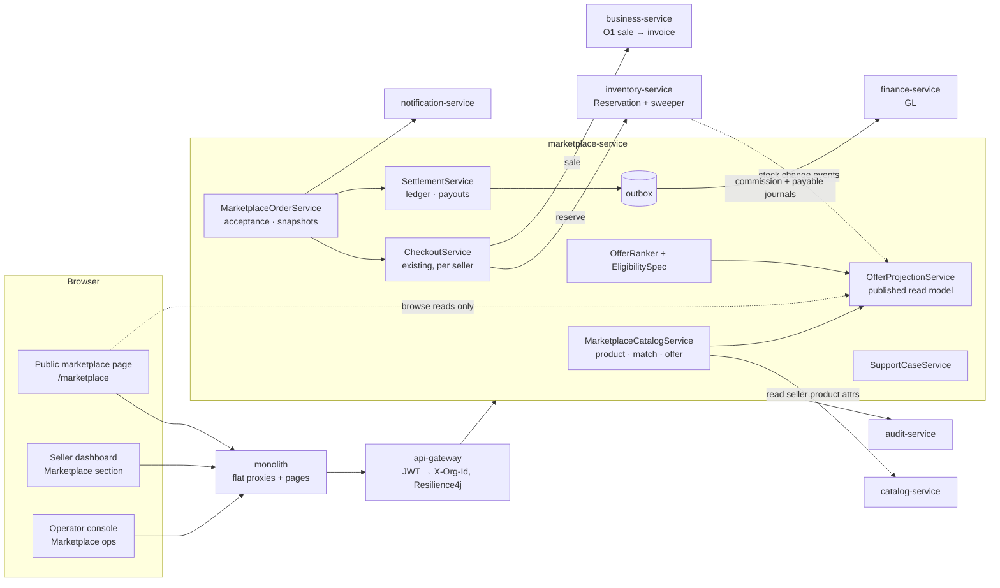
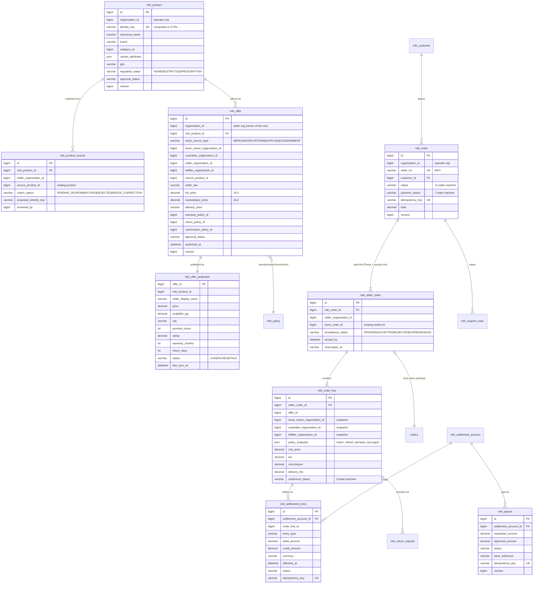
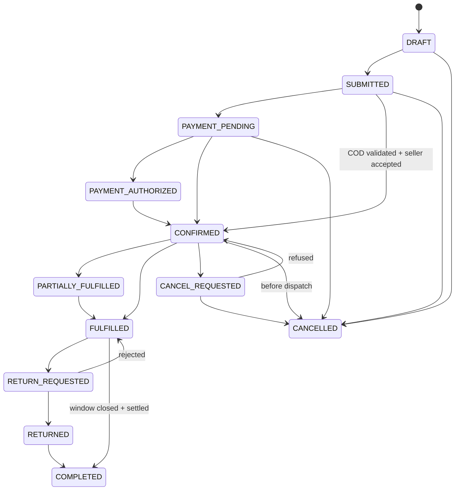
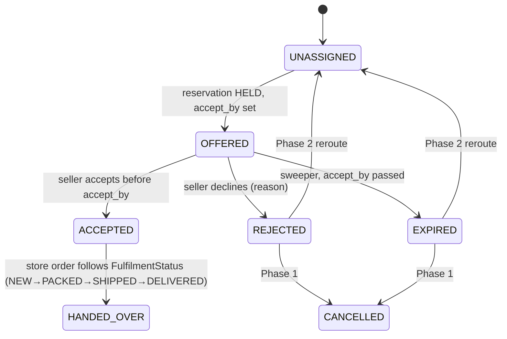
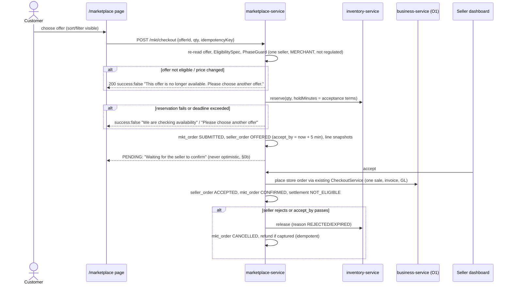

# Multi-seller Marketplace (MKT): programme design

**Status:** IN BUILD. Rulings R-MKT-1…7 accepted 2026-10-03; R-MKT-8, 9 and 11 open. MKT-1a done; MKT-0a, 1b, 1c, 1d and 1e built, unit-green, Cypress gates **48/48 on a live stack** and every manual case walked and recorded ([live verification](marketplace/live-verification-2026-10-03.md)) (§10)
([analysis §6](marketplace-multiseller-analysis.md#6-rulings-needed-before-the-design-gate)). Each slice has its own
doc under `slices/`. Cadence per standards:
Analyze → share → **Document → Standards → Design** (this file) → write the Cypress cases → Implement → Test → manual
cases → commit. Each MKT-n slice gets its own `slices/mkt-*.md` before it is built.

**Rulings recorded (user, 2026-10-03): all seven recommendations accepted.**

| # | Question | Ruling |
|---|---|---|
| R-MKT-1 | Merchant of record in Phase 1 | **The seller.** The sale, invoice and output tax are the seller's, through the O1 sale path unchanged. MaxTheService earns a commission |
| R-MKT-2 | Who collects money | **Platform for online payments, the seller's rider for COD.** The ledger supports both directions from day one |
| R-MKT-3 | Settlement ledger home | **marketplace-service** operational ledger, posting to the finance GL through the outbox. finance stays the only journal writer |
| R-MKT-4 | Availability projection storage | **A DB projection table.** No Redis (caching standards K5/K7) |
| R-MKT-5 | Platform customer | **A new platform-scoped customer**, party-bridged. The per-store `storefront_customer` is untouched |
| R-MKT-6 | Capability + plan | **Opt-in `marketplaceSelling`, not in `Plan.FREE`** |
| R-MKT-7 | Geography in Phase 1 | **A service-area list on the offer.** Distance waits for INV-L |

**Consequence found while implementing R-MKT-6 (MKT-0a trace).** `Plan` is a ceiling that only removes, and
TRIAL/DEMO/PRO are `allOf`, so a PRO owner can switch `marketplaceSelling` on with no operator involvement. The
capability alone therefore cannot carry "MaxTheService vets its sellers". MKT-0a adds a **seller account** in
marketplace-service (`PENDING_APPROVAL → APPROVED ⇄ SUSPENDED`, decided by the platform operator). That is the
source's "Seller onboarding" (MKT-R20.1). Every seller write requires capability ON **and** both agreements accepted
**and** the account APPROVED. The operator entitlement remains the plan-level switch for FREE tenants.

---

## 1. Document: what and why

**Problem.** MaxTheService merchants each run a storefront today, but a customer can only shop **one** merchant at a
time, at a URL that names that merchant's org. Nobody can search "Samsung A32 128GB" and compare the three shops that
stock it. MaxTheService has no customer of its own, earns nothing from the orders it routes, and has no way to pay a
merchant net of a commission.

**User value.**
* **Customer:** one catalogue and one account. Each product shows every seller's offer with price, delivery promise,
  warranty and rating, sorted the way the customer chooses. One place to ask for help.
* **Merchant:** a new sales channel from the stock and screens it already uses, plus a settlement statement it can
  check line by line.
* **MaxTheService:** a commission on routed orders, ownership of the customer relationship, and an auditable
  settlement trail.

**Principle (kept from the source, §23).** *MaxTheService owns the experience and coordinates the order. The
configured stock owner, custodian, fulfiller, carrier and warranty provider remain explicitly accountable.* In code:
each obligation is a **party id snapshotted on the order line**, never inferred from "the seller".

---

## 2. Standards (§1b table)

| Dimension | Rule this programme is built to |
|---|---|
| **Business / domain** | Operator marketplace with canonical product + offers (Amazon/Mirakl model). Merchant of record = the **seller** (R-MKT-1 default): the sale, invoice and output tax are the seller's, through the O1 sale path; MaxTheService earns a **commission**, which is the operator's revenue, invoiced to the seller. Settlement is payable only after delivery + payment confirmed + return window (source §15). Consignment follows SAP "special stock" semantics, Phase 5 only. |
| **SaaS multi-tenancy** | Seller-side rows: `organization_id` = the seller's org from the JWT, `findScoped`, foreign id → 404. Operator-side rows: `organization_id` = the **operator org**, written only by `MKT_OPERATE` holders. The **only** cross-tenant read is the published `mkt_offer_projection`, which holds the source §9.2 fields and nothing else (no cost, no margin, structurally absent). The client never sends a seller/owner org id: a seller's offer takes its org from the token, and an offer id from the browser is re-read and re-validated (source §22). |
| **Live-modules rule** | Capability `marketplaceSelling` is **opt-in, default OFF** (EX-0a mechanism). On deploy no tenant sees anything new; today's per-store storefront, `storefront_customer`, checkout and order screens are unchanged. New tables only; no existing column changes in Phase 1. |
| **Microservice boundaries** | **marketplace-service** owns the marketplace aggregate (canonical product, offers, projection, marketplace order, seller acceptance, settlement ledger, payouts, support cases). It **composes** the core: catalog (seller's product + identity attributes), inventory (reservation authority for MERCHANT), business-service (the sale/invoice via O1), finance (GL posting of commission and settlement via outbox), audit, notify, party. No new service in Phase 1. `order-service` extraction (O6) is unaffected and will carry these aggregates when it happens. |
| **Design patterns** | **Canonical model + Offer** (catalogue) · **Specification** for offer eligibility (source §7.6 guardrails, composable, one place) · **Strategy** for ranking (one comparator per customer sort, Open/Closed) · **Strategy** per stock source for the reservation authority (`ReservationAuthority`: merchant → inventory, platform → warehouse, supplier → portal/API; Phase 1 has one) · **State machine** whitelists per aggregate (the `FulfilmentStatus.ALLOWED` pattern) · **Snapshot** (order-time policy copies, source §13) · **Append-only ledger** with derived balances · **Transactional outbox** + idempotent consumer · **Saga** reused (O1), not re-implemented · **Anti-corruption layer** in `commerce-contracts` for the new client calls. |
| **SOLID / DRY** | Reuse `common-settings` (all terms), `common-outbox`, `common-audit`, `common-notify`, `commerce-domain.Money` (2 dp HALF_UP), `TenantCache` (catalogue reference data only, K5), `ShippingPolicy`, `CheckoutService`, O5a reservation + sweeper, O5b shipments, slice 70/71 refund + return. **One** marketplace JS module (`/js/common/marketplace.js`) on the seller dashboard and **one** public page. |
| **Performance (7c)** | Public catalogue reads only `mkt_offer_projection` (one indexed query per page, `(product_id, status, price)` + `(status, city)`). **Zero** remote calls on the browse path. Checkout adds **one** remote call (the reservation the existing checkout already makes). A tenant with the capability OFF pays nothing: no projection rows, no listener work. |
| **Security (7d)** | Enforced server-side: capability + entitlement (refusal envelope names the action), offer approval, price bounds, regulated-product refusal (C3: defaults ON, fails ON), acceptance deadline, idempotency key on placement/refund/payout, `@Version` on every aggregate two people edit (offer, marketplace order, payout), immutable ledger (no UPDATE path; reversal = new entry). Trusted from the client: the customer's sort/filter choice and the selected offer id, which is re-read. |
| **Testing standard** | `mvn test`: pure domain units (MKT-1a, 100% of rules in source §6, §10, §15, §18, §19) + `FlywayMigrationTest` read for `Skipped: 0` (D2a). One headed Cypress gate per slice, **written before the code**, first case driving the real UI, owner/admin/user ladder, a second seller tenant for isolation, the **trial balance** as the money assertion. Manual cases into the Test Book. |

---

## 3. Market research

Done in the analysis, [§4 Benchmark](marketplace-multiseller-analysis.md#4-benchmark-standard-7a-before-the-decision).
The decisions it changed: no forced Buy Box (customer sort), acceptance window with expiry → release (Mirakl
auto-refuse, built on O5a), a PSP-agnostic ledger (Stripe Connect later as an adapter), and match review before
merge (Odoo/Shopify mapping).

## 4. Current state

Verified in the analysis, [§2](marketplace-multiseller-analysis.md#2-current-state-verified-against-the-code-2026-10-03)
(reuse table 2a, gaps G-1…G-15, corrections 2c).

---

## 5. Architecture

### 5.1 Placement and data stores

| Concern | Home | Store |
|---|---|---|
| Canonical product, match review, offers, projection | marketplace-service | `myplusdb_marketplace` new tables `mkt_*` |
| Seller's own product, barcode, manufacturer, pack size, rx flags | catalog-service (unchanged) | `myplusdb_catalog` |
| MERCHANT stock + reservation + expiry sweeper | inventory-service (unchanged, O5a) | `myplusdb_inventory` |
| The seller's sale, invoice, output tax, AR | business-service via O1 (unchanged) | `myplusdb_business` |
| Store order + shipments + returns | marketplace-service `orders` (unchanged) | existing tables |
| Marketplace order, seller acceptance, snapshots, settlement ledger, payouts, support cases | marketplace-service | `mkt_*` |
| Commission revenue + seller payables journals | finance-service (only journal writer) via outbox | existing GL |
| Audit | audit-service via `common-audit` | existing |

### 5.2 Architecture diagram



### 5.3 Domain model (ER, Phases 1–2)



Every table: `organization_id` + `created_at/updated_at` + `created_by`; indexes `(organization_id, …)` per the
query each one serves (D3/D3b), written into the migration that adds the table.

### 5.4 Lifecycles (four separate machines, source §19)

The marketplace order (parent):



The seller order (child) acceptance lifecycle, which sits **in front of** the existing store `FulfilmentStatus`:



Settlement (per order line): `NOT_ELIGIBLE → PENDING → PENDING_RETURN_WINDOW → ELIGIBLE → APPROVED → PROCESSING →
PAID`, with `ON_HOLD`, `DISPUTED` and `REVERSED` side states. Payment: `UNPAID → AUTHORIZED → CAPTURED →
PARTIALLY_REFUNDED/REFUNDED`, plus `FAILED` and `CHARGEBACK`. All four whitelists are implemented and unit-tested in
MKT-1a (`MarketplaceStateMachines`).

### 5.5 Settlement arithmetic (source §15, worked example as a test)

```
customer amount        5,000.00
commission (10% of items, items = amount − delivery)   480.00   ← rate applies to items, not delivery
delivery retained        200.00
processing fee            50.00
refund reserve           100.00
merchant payable       4,170.00
```

The source's example shows commission as a flat Rs. 500 and payable 4,150. The calculator takes the commission
**amount** from the commission policy (a rate × base, or a fixed fee), so both shapes are expressible. The base is a
policy decision, recorded as open item **R-MKT-8** below. The invariant asserted for every shape is the
reconciliation identity: `customer = payable + commission + delivery + processing + tax + reserve + adjustment`, to
the paisa.

Ledger entries are append-only. A refund after payout is a new `REFUND` debit plus `REVERSAL`, never an edit. The
payable balance is `SUM(credit) − SUM(debit)` over `ELIGIBLE` entries; no stored balance column exists to drift.

### 5.6 Class diagram (MKT-1a, the pure domain core, implemented)

```mermaid
classDiagram
  class StockSourceType { <<enum>> MERCHANT PLATFORM SUPPLIER CONSIGNMENT +launchPhase() }
  class StateMachine~E~ { +canTransition(from,to) bool +transition(from,to) E +allowedFrom(from) Set +isTerminal(s) bool }
  class MarketplaceStateMachines { +ORDER +SELLER_ORDER +PAYMENT +SETTLEMENT +RESERVATION }
  class ProductIdentityKey { +general(...) String +medicine(...) String +preferGtin(gtin,key) String +normalize(s) String }
  class Availability { +available(onHand,reserved,allocated,unavailable) BigDecimal +canReserve(...) bool }
  class AcceptanceTerms { +defaults() +forSource(type) Terms +set(type,terms) }
  class BusinessDayCalendar { +plusBusinessDays(date,n) LocalDate +isBusinessDay(d) bool }
  class SettlementCalculator { +calculate(Inputs) Breakdown }
  class Breakdown { +merchantPayable +reconciles() bool }
  class OfferCandidate { <<record>> }
  class OfferEligibility { +isEligible(c, ctx) bool +refusal(c, ctx) Optional~String~ }
  class OfferRanker { +rank(candidates, sort, ctx) List }
  class PhaseGuard { +checkCheckout(lines) +checkOffer(source, regulated) }
  class ReturnCostPolicy { +bearerFor(reason) Party }
  class SubstitutionPolicy { +requiresCustomerApproval(original,substitute) bool }
  MarketplaceStateMachines --> StateMachine
  SettlementCalculator --> Breakdown
  OfferRanker --> OfferEligibility
  OfferRanker --> OfferCandidate
  PhaseGuard --> StockSourceType
```



### 5.7 Sequence: Phase 1 checkout from a selected offer (MKT-1e)



---

## 6. Design: contracts

### 6.1 API (`/api/marketplace/mkt/**`, command style, `ApiResponse` envelope)

| Method + path | Who | Purpose |
|---|---|---|
| `GET /public/mkt/products?q=&city=&page=` | anonymous | canonical products with offer count + "from" price (projection only) |
| `GET /public/mkt/products/{id}/offers?sort=LOWEST_PRICE&city=` | anonymous | eligible offers, ranked |
| `POST /mkt/products/propose` | seller `MKT_SELL` | propose a canonical product from one of the seller's catalog products (identity key computed server-side) |
| `POST /mkt/matches/{id}/decide` | operator `MKT_OPERATE` | MATCHED · REJECTED · NEEDS_CORRECTION, with corrected key |
| `POST /mkt/offers` · `PUT /mkt/offers/{id}` | seller `MKT_SELL` | create/edit own offer (org from token, `@Version`) |
| `POST /mkt/offers/{id}/submit` · `/approve` · `/reject` · `/suspend` | seller / operator | offer approval lifecycle |
| `POST /public/mkt/checkout` · `GET /public/mkt/orders/{no}?phone=` | customer (anonymous in Phase 1; account in MKT-1e2) | one-seller COD checkout from an offer (idempotency key, CSRF) · tracking by number + phone |
| `GET /mkt/seller-orders` · `POST /mkt/seller-orders/{id}/accept` · `/reject` | seller | the queue; acceptance within the window (IMEIs for serial-tracked items) |
| `POST /mkt/orders/{id}/cancel` · `/returns` | customer | cancel / return request |
| `GET /mkt/settlement/statement?from=&to=` | seller | own ledger entries, paged |
| `POST /mkt/payouts` · `/{id}/approve` · `/{id}/mark-paid` | operator `MKT_SETTLE` | manual payout (idempotency key, bank ref) |
| `POST /mkt/support-cases` · `/{id}/tasks` | customer / operator | complaint intake, internal task to a party |

Each has a monolith flat proxy that relays the downstream message (standard 8a) and one screen calling it (§ "A slice
is not done until something CALLS it").

### 6.2 Per-org configuration (`MarketplaceSellerSettingsCatalog`, `common-settings`)

| Key | Default | Read by |
|---|---|---|
| `mkt.accept.merchantMinutes` | 5 | `AcceptanceTerms` at checkout |
| `mkt.hold.merchantMinutes` | 10 | reservation `holdMinutes` override for marketplace holds |
| `mkt.settlement.trigger` | `DELIVERED_PLUS_RETURN_WINDOW` | settlement eligibility job |
| `mkt.settlement.returnWindowDays` | 7 | same |
| `mkt.settlement.tPlusDays` | 1 | `BusinessDayCalendar` |
| `mkt.ranking.default` | `LOWEST_PRICE` | public offers when no sort given |
| `mkt.projection.staleMinutes` | 30 | ranking drops offers whose `last_sync_at` is older |
| `mkt.phase1.blockRegulated` | **true** (C3: safety flag defaults ON and fails ON) | `PhaseGuard` |

Each key ships with its gate case for **both halves** (C2: in the catalog with the default **and** honoured).

### 6.3 Privileges and the tier ladder

| Privilege | owner | admin | user | operator |
|---|---|---|---|---|
| `MKT_SELL` (propose, offers, accept orders, statement) | ✓ | ✓ | accept/read only | — |
| `MKT_OPERATE` (match review, offer approval, suspend) | — | — | — | ✓ |
| `MKT_SETTLE` (payout approve / mark paid) | — | — | — | ✓ (four-eyes: approver ≠ requester) |
| `MKT_SUPPORT` (cases, internal tasks) | — | — | — | ✓ |

### 6.4 Capability

`Capability.MARKETPLACE_SELLING("marketplaceSelling", "Sell on the MaxTheService marketplace", …, optIn = true)`.
Checked server-side on every seller write. A capability OFF or an entitlement SUSPENDED refuses with a sentence naming
the action. A suspended seller's offers leave the projection on the same transaction (the K2 after-commit event).

### 6.5 UI/UX contract

* **Public page** `/marketplace`: search → product cards ("Available from 2 sellers · From Rs. 51,500") → offer
  table (seller, price, delivery promise, warranty, return days, rating) with a visible sort selector. The chosen
  offer is highlighted and named on the checkout button: "Buy from Shahzad Mobile Shop". Never a silent default.
* **Seller dashboard → Marketplace section** (one fragment, `data-capability="marketplaceSelling"`): Products to
  publish, My offers (status chips), Incoming orders (countdown to `accept_by`, Accept/Reject), Settlement statement.
* **Operator console → Marketplace ops**: match review queue, offer approvals, payouts, support cases.
* Money is never optimistic (§0b): placement, acceptance and payout show PENDING until the server answers. Only the
  clicked control is disabled (§0c).

---

## 7. Phased sequence (each a full vertical slice: UI + API + DB + gate)

| Slice | Scope | Source reqs | Depends on | Gate asserts (the regression) |
|---|---|---|---|---|
| **MKT-0a** | Capability `marketplaceSelling` (opt-in) + operator entitlement; seller agreement + data-sharing agreement **acceptance record** (version, who, when); **seller account** approved by the operator | R9.1, R20.0, R20.1 | rulings 1, 6 | capability OFF for every existing tenant; a FREE tenant cannot switch it on without the operator entitlement; seller writes refused until both agreements are accepted **and** the operator approves the account; refusal envelope readable |
| **MKT-1a** ✅ | Pure domain core: identity key, availability, 5 state machines, acceptance terms, T+n, settlement calculator, eligibility spec, ranking, phase guard, return-cost and substitution policies | R6.2–6.6, R10.3, R10.5, R11.3, R13.1, R15.1, R15.5, R18.4, R19.1, R20.2 | — | `mvn -pl marketplace-service test` (unit) |
| **MKT-1b** | Canonical product + match review (seller proposes from own catalog product; operator decides) | R5.1–5.2, R6.* | 0a, 1a | 64GB and 128GB never merge; operator corrects a match; seller B cannot see seller A's proposal |
| **MKT-1c** | Offers with party roles + policies (warranty, return, commission) + approval; projection write | R3.*, R4.1, R5.3, R7.4–7.5, R9.2–9.3, R14.* | 1b | regulated product refused; price above ceiling refused; projection has no cost/margin column; suspended seller disappears |
| **MKT-1d** | Public catalogue + offer comparison + sort/filters + guardrails | R5.4, R7.1–7.3, R7.6, R18.2, R18.4 | 1c | "Available from 2 sellers · From Rs. …"; sort changes order; cheapest not forced; stale offer hidden |
| **MKT-1e** | One-seller checkout, reservation, seller acceptance window, expiry release, order snapshots, platform customer | R8.1, R10.1–10.4, R13.3, R17.1, R18.5, R19.1, R20.1–20.2, R22.* | 1d, ruling 5 | two sellers in one cart refused; accept in time → invoice in seller's books; expiry → stock back, order CANCELLED; double submit → one order |
| **MKT-1f** | Support case + return request with cost bearer + escalation | R8.2, R13.1–13.4 | 1e | customer files one case; operator tasks the seller; wrong-product return charges the fulfiller |
| **MKT-1g** | Commission + settlement ledger + T+1 eligibility + manual payout + GL posting | R15.*, R16.*, R22.3 | 1e, rulings 2, 3 | worked example reconciles; nothing payable before delivery + window; payout idempotent; trial balance moves by exactly the commission |
| **MKT-2a–f** | Parent/child orders + multi-seller cart · shortage/reroute with customer approval · live routing with timeouts/circuit breakers · COD reconciliation (reuses D5) · merchant performance · settlement reports | R10.6, R11.*, R12.4, R17.2, R18.1, R18.3, R20.3 | Phase 1, INV-L for distance | per slice |
| **MKT-3** | Platform stock (warehouse = an operator-owned org on the existing inventory) | R4.2, R20.4 | Phase 2 | per slice |
| **MKT-4** | Supplier stock via portal/API, SLA, dropship | R4.3–4.4, R20.5, R22.5 | Phase 2 | per slice |
| **MKT-5** | Consignment agreements, consigned stock ledger, counts, shrinkage claims | R2.*, R4.5–4.6, R12.1–12.3, R15.4, R20.5 | Phase 4 | per slice |
| **MKT-6** | Regulated pharmacy (after legal review) | R6.3, R20.6 | legal | per slice |

**Thinnest first value** = MKT-0a + 1b + 1c + 1d: a customer can compare two real shops' offers for the same phone.
**First money** = 1e + 1g.

---

## 8. Test plan (summary)

Full matrix in [`marketplace-multiseller-test-plan.md`](marketplace-multiseller-test-plan.md): every one of the 87
requirement ids maps to at least one unit, Cypress or manual case. Coverage is computed by script, not asserted.

## 9. Risks and open items

| # | Item | Recommendation | Needs ruling? |
|---|---|---|---|
| R-MKT-8 | Commission base: items only, or items + delivery? The source's example is a flat Rs. 500 | Policy carries `basis` (ITEMS / ITEMS_PLUS_DELIVERY / FIXED); default ITEMS | **yes** |
| R-MKT-9 | Who invoices commission (a document for the seller's input tax)? | Operator raises a commission invoice per statement period through business-service | **yes** |
| R-MKT-10 | The marketplace order number series | `MKT-` per operator org, via `common-docnum` | no |
| R-MKT-11 | Pilot city list | from the operator, config only | **yes** |
| K-1…K-6 | see analysis §5 | — | — |

## 10. Implement checklist (programme)

- [x] MKT-0a capability + agreements + operator-approved seller account · unit-green, **gate passed on a live stack, manual walk recorded** ([live verification](marketplace/live-verification-2026-10-03.md)) ([slice](slices/mkt-0a-seller-onboarding.md))
- [x] MKT-1a pure domain core · `mvn test` green
- [x] MKT-1b canonical product + match review · unit-green, **gate passed on a live stack, manual walk recorded** ([live verification](marketplace/live-verification-2026-10-03.md)) ([slice](slices/mkt-1b-product-matching.md))
- [x] MKT-1c offers + policies + approval + projection · unit-green, **gate passed on a live stack, manual walk recorded** ([live verification](marketplace/live-verification-2026-10-03.md)) ([slice](slices/mkt-1c-offers.md))
- [x] MKT-1d public catalogue + compare + sort · unit-green, **gate passed on a live stack, manual walk recorded** ([live verification](marketplace/live-verification-2026-10-03.md)) ([slice](slices/mkt-1d-public-catalogue.md))
- [x] MKT-1e one-seller COD checkout + acceptance window + snapshots · unit-green, **gate passed on a live stack, manual walk recorded** ([live verification](marketplace/live-verification-2026-10-03.md)) ([slice](slices/mkt-1e-checkout-acceptance.md))
- [ ] MKT-1e2 platform customer account + online payment (platform-collected) + customer cancel / My orders · gate
- [ ] MKT-1f support + returns cost attribution · gate
- [ ] MKT-1g commission + settlement ledger + payouts · gate
- [ ] MKT-2…6 per their own slice docs
