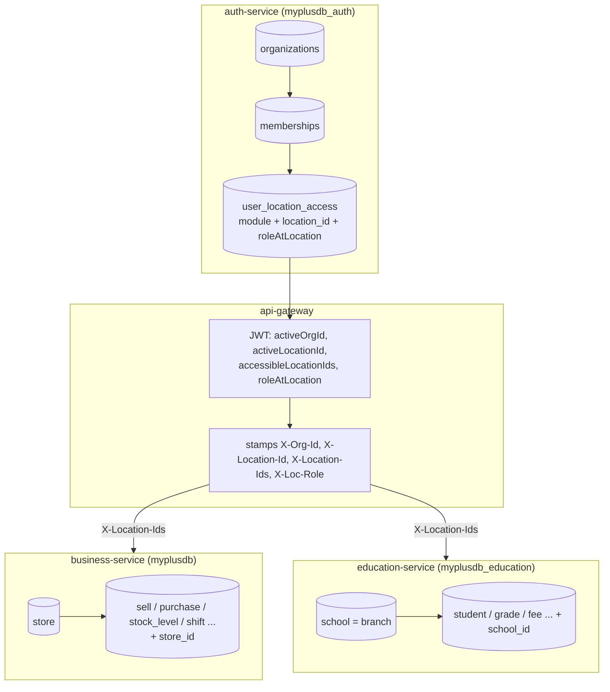
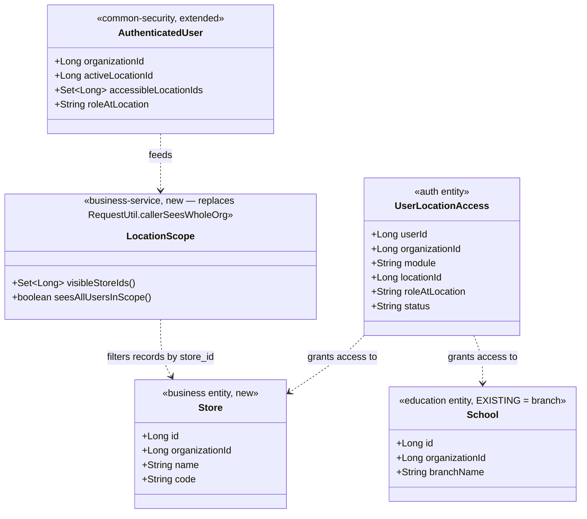
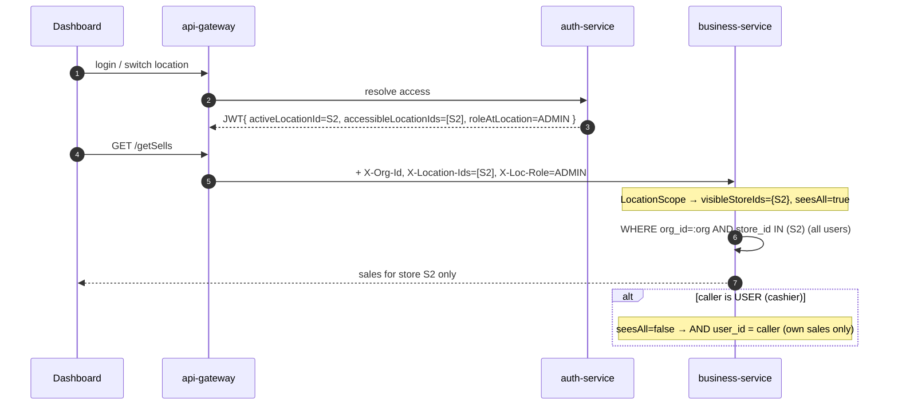

# Multi-Location (Stores / Branches) + Role×Location Visibility — Design

**Status:** **COMPLETE — P1–P6 across every vertical.** Business/POS + pharma/marketplace (`cypress/e2e/business/multi-location.cy.js`) and education (`cypress/e2e/education/multi-branch.cy.js`); the security fix it uncovered is gated by `cypress/e2e/education/delete-idor.cy.js`. Remaining follow-ons are listed under P2c/P4 (branch-less education entities; admin-facing Manage Users). · **Scope:** platform-wide (auth, gateway, common-security, business/POS, education; pharma & marketplace inherit) · **Standard:** Pattern A (role + location scoping — the POS/retail industry standard: Square / Shopify / Lightspeed). Follows [`../../docs/DESIGN-STANDARD.md`](../../docs/DESIGN-STANDARD.md) and builds on [`ARCHITECTURE-MULTITENANCY.md`](ARCHITECTURE-MULTITENANCY.md).

> **No code is written until this doc is approved.** It ends with a *Decisions for sign-off* section.

---

## 1. Document — what & why

### The goal
A tenant (company/institution) can have **multiple locations** — **Stores** for POS/retail/pharma, **Branches** for education — and each user's data visibility is scoped by **role × the locations they can access**. A **single-location tenant is the degenerate case** (one location), so the same code serves both — exactly the user's requirement.

### Target role hierarchy (industry-standard, Pattern A)
| Role | Can create | Sees |
|------|-----------|------|
| **OWNER** | ADMIN, USER | **All locations**, all users' records |
| **ADMIN / Manager** | USER | **Their assigned location(s)**, all users' records **in those locations** |
| **USER / Cashier / Teacher** | — | **Their assigned location(s)**, **their own** records only |

Visibility = **(locations you can access) ∩ (role: own records vs all records)**. Single store ⇒ everyone shares one location ⇒ Owner/Admin see the store; User sees own. (Matches today's behaviour, generalised.)

### Current state (verified)
- **Tenant isolation** exists: every record carries `organization_id`; reads are org-scoped ([`ARCHITECTURE-MULTITENANCY.md`]). ✅ This is the hard security boundary and does **not** change.
- **Education already has the branch dimension:** `School {id, organizationId, userId, branch_name}`; `Grade`/`Student`/`Vehicle` (and more) already carry `schoolId`. So education's "location" = **School**, already in education-service. The gap is *access control by school* + *consistent school scoping*.
- **Business/POS has no location dimension:** `Sell`, `Purchase`, `Customer`, `StockLevel`, `CashierShift`, … carry only `organization_id` + `user_id`. A **Store** dimension must be added.
- **Role visibility is binary today:** `RequestUtil.callerSeesWholeOrg()` (ADMIN_PRIVILEGE|SUPER_PRIVILEGE = whole org, else own). No location awareness. Team creation is **owner-only** (`OrgUserController` `@PreAuthorize ROLE_OWNER`); no admin-creates-user; no manager→location link.
- **JWT already carries `activeOrgId`** → gateway stamps `X-Org-Id` → `AuthenticatedUser.organizationId`. This is the exact pattern we extend for location.

---

## 2. Design

### 2.1 The shared model (federated registry, central access)
Two concerns, deliberately split:

1. **Location registry (federated, per domain service).** Each vertical owns its location rows:
   - business-service: **new `store` table** (`Store` entity, `type=STORE`).
   - education-service: **existing `school` table** *is* the branch (`type=BRANCH`) — **reused, not replaced**.
   - Rationale: don't rip out education's working `School`; avoid a central location micro-service (over-engineering, and the same Item↔Product bridge pain we chose to avoid). Each service already scopes by its own id (`schoolId`; new `storeId`).

2. **Access control (central, in auth-service).** *Which* locations a user may access + their role there is a **tenancy concern**, so it lives with org+membership in auth-service as a generic grant keyed by a **module-qualified location reference** — auth does not need to load domain rows, it only stores/serves grants the owner/admin assign:

```
UserLocationAccess { id, userId, organizationId, module (BUSINESS|EDUCATION|…),
                     locationId (the domain store/school id), roleAtLocation (OWNER|ADMIN|USER), status }
```

The **active location** + the **accessible-location set** ride in the JWT (like `activeOrgId`) → gateway headers → `AuthenticatedUser` → each service filters records by `location_id ∈ accessibleSet` (plus role for own-vs-all).

### 2.2 Data model (per service)

**auth-service (`myplusdb_auth`)** — new table:
```
user_location_access (
  id BIGINT PK,
  user_id BIGINT, organization_id BIGINT,
  module VARCHAR(24),            -- BUSINESS | EDUCATION | PHARMA | …
  location_id BIGINT,            -- FK-by-value to the domain store/school id
  role_at_location VARCHAR(16),  -- OWNER | ADMIN | USER
  status VARCHAR(16) DEFAULT 'ACTIVE',
  UNIQUE(user_id, module, location_id))
```

**business-service (`myplusdb`)** — new `store` + a `store_id` column on location-bearing records:
```
store ( id PK, organization_id, name, code, address, status, created_at )
-- add nullable store_id to: sell, purchase, customer, stock_level, cashier_shift,
--   cash_movement, sale_return, parked_sale, payment  (customers/vendors: see §2.6)
```

**education-service (`myplusdb_education`)** — `School` is the branch; ensure every branch-scoped entity carries `school_id` (most already do). No new table; add `type`/`code` columns to `school` only if needed for the shared contract.

### 2.3 Read-scoping rule (replaces the binary)
`RequestUtil.callerSeesWholeOrg()` → generalised to a **visible-scope resolver**:
```
visibleStoreIds = accessibleLocationIds (from JWT)                    -- role-independent access
seeAllUsersInScope = roleAtActiveLocation ∈ {OWNER, ADMIN}            -- vs own-only for USER
read =  WHERE organization_id = :orgId
        AND store_id IN (:visibleStoreIds)                            -- location filter
        AND ( :seeAllUsersInScope OR user_id = :callerUserId )        -- role filter
```
- OWNER: `visibleStoreIds` = all org stores; `seeAll` = true → whole org.
- ADMIN: `visibleStoreIds` = their assigned stores; `seeAll` = true → those stores, all users.
- USER: `visibleStoreIds` = their store(s); `seeAll` = false → their own records only.
- **Single store:** everyone's `visibleStoreIds` = {the one store} → identical to today.
- **Legacy NULL-fallback preserved:** pre-migration rows (`store_id IS NULL`) remain visible to their `user_id`, draining as they're re-saved (same technique as the org-id migration).

### 2.4 Writes: stamping the active location
Every create stamps `store_id` = the caller's **active location** (JWT `activeLocationId`, like `activeOrgId`). A location switcher (UI) re-issues the JWT with a new `activeLocationId` (reuses the existing org-switch mechanism).

### 2.5 Team management (points 2 & 3 of the requirement)
`OrgUserController` gate `ROLE_OWNER` → **role-aware**:
- **OWNER** creates ADMIN or USER; may assign them to any store(s).
- **ADMIN** creates **USER only**, auto-assigned to the admin's **own** store(s) (cannot grant a store they don't hold; cannot create ADMIN/OWNER).
- Creation writes the `user_location_access` grant(s). Enforced server-side (never trust the client).

### 2.6 Cross-location master data (decision point)
Some data is naturally **org-wide, not per-store**: product/catalog, customers (a customer may shop at any branch), vendors, tax settings, chart-of-accounts. Recommendation: **keep these org-wide** (no `store_id` filter); make **transactions** location-scoped (sales, purchases, stock, shifts, GL postings, returns). This matches Square/Shopify (shared catalog + customers, per-location inventory & sales). Customers/vendors get an **optional** `store_id` stamp for "created-at" attribution only, not as an access filter.

### 2.7 Security
- **Tenant remains the hard wall** (`organization_id`); location is a *within-tenant* refinement — a bug in location logic can never cross tenants.
- Location grants enforced **server-side** in auth (create) and every domain read (scoping); the client cannot widen its own `accessibleLocationIds` (they come from the signed JWT, stamped by the gateway with `INTERNAL_SECRET` trust).
- Anti-IDOR: a mutation on a record whose `store_id` ∉ caller's accessible set is rejected (extends the existing per-record owner check).

---

## 3. Architecture & UML

### 3.1 Architecture (flowchart)


### 3.2 Class diagram (new/changed types)


### 3.3 Sequence — a manager (admin) views sales at their store


---

## 4. Implement (phased checklist — each phase Test-gated, no code until approved)

**P1 — Access model + propagation (foundation, no behaviour change yet)** ✅ IMPLEMENTED (inert until P2 grants exist)
- [x] auth: `user_location_access` table (Flyway `V4`) + `UserLocationAccess` entity + `UserLocationAccessRepository`.
- [x] auth: JWT claims `accessibleLocationIds`, `activeLocationId` (auto when exactly one), `roleAtLocation` — `AuthService.addLocationClaims` (empty with no grants).
- [x] gateway: `JwtAuthenticationFilter` strips + stamps `X-Location-Id`, `X-Location-Ids`, `X-Loc-Role`.
- [x] common-security: `AuthenticatedUser` gains `activeLocationId`/`accessibleLocationIds`/`roleAtLocation` (legacy 4-arg ctor kept); `HeaderAuthFilter` parses them null-safe; `GatewayIdentityForwarding` strips forged copies.
- [ ] (moved to P2) seed each existing org an OWNER grant to a **default store** — happens when the default store is created in P2.

**P2 — business/POS stores**
- [x] **P2a:** `store` table (Flyway `V20`) + `Store` entity + `StoreRepository` + `StoreService` + `StoreController` (CRUD: `/getStores`, `/addStore`, `/updateStore`; create/update owner/admin-gated, anti-IDOR). + `RequestUtil.accessibleStoreIds()` / `activeStoreId()`. Non-breaking (no scoping change yet).
- [x] **P2b:** `store_id` added to `sell` + `purchase` (Flyway `V21`) + entity fields; stamped from `activeStoreId()` on write (`SagaSaleWriter`, `PurchaseService` create; preserved on edit). Store-aware reads `findScopedByStores`/`findOwnScopedByStores` (repo→service→controller) with legacy `store_id IS NULL` fallback; `SellController.visibleSells()` + `PurchaseController.visiblePurchases()` branch on `accessibleStoreIds()` (empty ⇒ current behaviour). Pagination routed through the scope. **Inert until P3 grants exist** (empty accessible set ⇒ unchanged).
  - [x] **P2c:** `store_id` (Flyway `V22`) on `customer_history` (the invoice header), `sale_return`, `cashier_shift`, `cash_movement`, `parked_sale`, `payment` + entity fields, stamped on write (`SagaSaleWriter` header — **new invoices only, an edit keeps the store it was raised at**; `ShiftService` open-shift → cash movements follow the shift's store; `ParkedSaleService`; `PaymentService` tender + refund; `SellController` sale-return follows the sold line's store). (Customer/Vendor stay org-wide per §2.6.)
    - [x] **Store anti-IDOR** (§2.7) — `RequestUtil.canAccessStore(storeId)` is the single policy (owner ⇒ any; no grants ⇒ no constraint; NULL row ⇒ legacy, reachable). Applied per record wherever an id comes from the client: `getSellInvoice`, `getReceipt`, `updateSell`, `voidSell`, `saleReturn`, and — via `PurchaseService.scopeMatches`, which all three paths already funnel through — `updatePurchase`, `purchaseReturn`, `voidBill`.
    - **This closed a real hole:** the list was store-scoped but read-by-id was not, so a **Store-B ADMIN (a whole-org viewer) could open and edit a Store-A invoice by id** even though the list correctly hid it. Now covered by T6b in `multi-location.cy.js`.

**P3 — Team management (points 2 & 3)** ✅ BACKEND done (activates multi-store)
> Two bugs that made P3 non-functional in practice were found by the T1–T8 gate (both fixed; neither was
> visible from the code checklist, because no test had ever authenticated as a created member):
> 1. **The grant endpoint was unreachable.** `OrgUserController` was mapped at `/api/auth/org/users`, so
>    `@PostMapping("/locations/grant")` resolved to `/api/auth/org/users/locations/grant` — while the monolith
>    (and this doc) call `/api/auth/org/locations/grant`. Every grant 500'd and was swallowed by the proxy's
>    `catch`, leaving `user_location_access` empty. Class mapping is now `/api/auth/org`, with `/users` on the
>    two user methods; the public URLs are unchanged.
> 2. **A team member's first login stole them into a new org.** `OrganizationService.getOrCreatePrimaryOrg`
>    resolved the active org from *owned* orgs only, so a member (who holds a membership but owns nothing) got
>    a fresh personal org as their `activeOrgId` — making the company's catalog/customers/sales invisible to
>    them. It now falls back to an ACTIVE membership before creating.
- [x] `OrgUserController` gate → `ROLE_OWNER or ADMIN_ROLE`; `createOrgUser(..., callerIsOwner, storeIds)`: owner creates ADMIN/USER, **admin creates USER only** (server-enforced); writes `user_location_access` grants for the new member (admin may grant only stores they hold — `sanitizeStoreGrants`).
- [x] `POST /api/auth/org/locations/grant` + `AuthService.assignLocations` — assign store access to an existing user (owner: any store; admin: own stores; `userId` omitted = self, so an owner self-assigns to their store to get an active store for write-stamping). Idempotent.
- [x] business: `RequestUtil.isOwnerSuper()` → owner (SUPER) always sees whole org across all stores (grants never narrow an owner); admins ARE store-constrained. Applied in `visibleSells`/`visiblePurchases` (+ paged branch).
- [ ] (P3-UI, in P5) Manage Users store-assignment picker + orchestrate owner self-grant on store creation (monolith calls `/addStore` then `/locations/grant`) so single-store is zero-touch.

**P4 — education branches (reuse School)** ✅ core done
- [x] `School` mapped into the shared access model. auth's grant code was hardcoded to `module="BUSINESS"`; it now derives the module from the user's own vertical (`AuthService.moduleFor`: EDUCATION ⇒ school ids, everything else ⇒ store ids — PHARMA/MARKETPLACE map to BUSINESS deliberately, since they reuse the commerce core). Claims, `myLocations` and the switch check all filter by module: a school id and a store id are both just numbers, so mixing them would hand an education user "access" to a same-numbered store.
- [x] **The policy now lives once** — `common-security/LocationScope` (accessible / active / isOwnerSuper / seesWholeOrg / canAccess). Both `RequestUtil`s delegate to it, so business and education cannot drift apart; pharma inherits it for free.
- [x] Branch scoping on the entities that actually carry the dimension — `Student`, `Grade`, `Vehicle` (`findScopedBySchools`, legacy `school_id IS NULL` visible). Writes stamp the active branch and refuse a branch the caller does not hold; edits and deletes re-check per record.
- [x] Branch switcher: education `GET /getMySchools` (+ monolith proxy) with the ACTIVE branch flagged; `#branchSwitcher` in the education sidebar. It **reuses** the monolith's `/switchStore` rather than cloning it — auth resolves the module from the caller's vertical, so a school id goes through the same door as a store id.
- **Deliberate deviation from the §2.3 rule, please confirm:** an education USER (teacher) sees their **branch's whole roster**, not merely the records they created. A cashier's till is private; a school's roster is shared by its staff — own-only would hide a colleague's students from the teacher who has to teach them. Branch is the boundary. Asserted by T9c.
- [x] **Attendance is branch-level; fee collection is org-wide by default (configurable).** Both records carry no `school_id` but each is *for a student* (by `enrollNo`), so a branch can be derived. Per the owner's stated model, the two concerns differ:
  - **Attendance — always branch-level.** A teacher marks/sees only their own branch. Every student-touching path is branch-scoped: reads `getUserA`/`getAllA`, roster `getClassRoster`, lookup `getUserStudentMap`, and the write `markAttendanceBulk` (which now marks only students in the caller's accessible branches and **skips** any enrollNo outside them — a teacher cannot mark another branch). Owner/super or no-grants ⇒ org-wide. Gated by T9i.
  - **Fee collection — org-wide by default.** A parent may pay at any campus, so a fee is visible/collectible from any branch. Configurable per org via `FeeSetting.feeCollectionBranchScoped` (default `false`, Flyway education **V4**); when the owner turns it ON, `getUserFc`/`getAllFc` restrict each branch's staff to their own branch's fees. Toggle in the Fee Settings screen. Gated by T9h (org-wide default + the branch-scoped mode).
  - [x] **Owner Configuration store (generic, extensible).** Rather than a boolean column per policy, a per-tenant settings store: a code-defined **catalog** (`education/config/SettingsCatalog` — key/label/type/default/group, the source of truth for *what* is configurable) + a generic `org_setting(org, key, value)` override table (education Flyway **V5**) holding only changed values. `SettingsService.getBool(key)` returns override-else-default; the **Configuration** screen renders itself from the catalog and saves each toggle (`/getConfig` + `/saveConfig`, owner-gated, unknown keys refused). Adding a configurable policy = one catalog entry + one read call, **no schema change**. This is the "owner sets up anything like this" home.
    - **Guardian & Discount — done, via the store.** Registered `edu.guardian.branchScoped` / `edu.discount.branchScoped` (default OFF = org-wide). When on, visibility is *derived from students* (Guardian via `Student.guardianId`, Discount via `Student.discountId`) — no new column, and a cross-campus parent correctly stays visible from either branch. Gated by `owner-config.cy.js`.
    - [ ] **Staff & Subject — deferred (need a schema change).** These have no student link, so branch-scoping them requires a new `school_id` column on each + write-stamp + anti-IDOR, not just a read filter. When greenlit, they register in the same catalog as `edu.staff.branchScoped` / `edu.subject.branchScoped`.
    - [ ] The shipped `FeeSetting.feeCollectionBranchScoped` flag can later fold into this store (read `getBool("fee.collection.branchScoped", <FeeSetting fallback>)`) so all owner config lives in one place; left as-is for now (green).
- [x] **Education Manage Users + branch picker.** Education had *no team screen at all* — an owner could not add a teacher through the UI, let alone assign a campus. Rather than clone business.js's copy, the whole screen moved to **`/js/common/team.js`** (one implementation, both dashboards). A dashboard only declares where its locations come from: `window.TEAM_LOCATIONS_URL` (`getStores` vs `getUserSchool`) and `TEAM_LOCATION_NOUN` (store/branch). The endpoints were already vertical-agnostic — auth resolves the `storeIds` grant list as stores or schools from the caller's own userType. Gated by T9g.

> **Cross-tenant IDOR found while doing P4 — ✅ FIXED across all 12 controllers.** Every education `deleteX` endpoint took a raw id and called `deleteById` with **no ownership check at all**, so any authenticated education user could delete another *organization's* rows by guessing ids. (business has always loaded-then-verified; education never did.) All twelve now go through **one** implementation — `education/util/ScopedDeleter.deleteScoped(repo, ids, orgOf, userOf, locationOf)` — which loads each row, keeps only the caller's tenant (legacy org-NULL rows fall back to their creator) and, where the entity carries a branch, only an accessible one. A row the caller may not see is skipped **silently**: answering "forbidden" rather than "not found" would itself confirm the id exists in someone else's tenant. `School` passes `School::getId` as its own location, since the row *is* the branch. Gated by `cypress/e2e/education/delete-idor.cy.js` (org B attacks org A's student; the row survives, and the owner's own delete still works — so a deny-everything "fix" cannot pass).

**P5 — UI** ✅ core done (business/POS)
- [x] Monolith `StoreController` proxy: `/getStores`, `/addStore` (+ **owner zero-touch self-grant** to the new store), `/updateStore`, `/assignStores` → business + auth via the owner's Bearer token. `TeamController` body widened to pass `storeIds`.
- [x] **Stores** screen (`#StoresDiv`, owner-gated, under Settings) — list + create; `showStores`/`loadStores`/`saveStore`.
- [x] **Manage Users store picker** — multi-select `#teamStores`; `addTeamUser` sends `storeIds`; `loadTeamStores` populates it.
- [x] **(P5b) active-store switcher** — `POST /api/auth/org/locations/switch` re-issues the JWT with a chosen `activeLocationId` (grant verified server-side, so a client cannot switch into a store it was never given), the exact twin of `/switch-organization`; `GET /api/auth/org/locations` lists the caller's grants. `addLocationClaims` now honours the chosen store and resolves `roleAtLocation` from the matching grant (it previously only set a role when the user held exactly one). business `GET /getMyStores` returns the caller's workable stores with the ACTIVE one flagged (only the server knows which). Monolith proxies `/getMyStores` + `/switchStore` (**swaps the session token**, like the org switch — otherwise the old token keeps stamping the old store). UI: `#storeSwitcher` in the sidebar, hidden unless the user can work at 2+ stores. Gated by T10.
- [ ] Admin-facing Manage Users (currently owner-gated in the UI; the backend already allows admin→user).

**P6 — pharma / marketplace** ✅ inherit via the shared commerce core — verified, not assumed:
- PHARMA and MARKETPLACE both redirect to `/businessDashboard` (`AppController`), so they load the same template + `business.js` and get the Stores screen, the store switcher and every store-scoped read for free.
- Their grants map to `module=BUSINESS` in auth (`moduleFor`) **by design**: they reuse the commerce core, so their locations *are* business stores. Nothing vertical-specific to build.
- What actually needed proving was the **degenerate case** — a vertical with no stores and no grants must behave exactly as before multi-location existed (empty accessible set ⇒ no filter ⇒ nothing hidden). Asserted by the P6 test in `multi-location.cy.js`.

---

## 5. Test
| # | Case | Expect |
|---|------|--------|
| T1 | Single-store tenant (1 location) | Behaviour identical to today (owner/admin=all, user=own) |
| T2 | Owner, 2 stores | Sees sales from both |
| T3 | Admin assigned Store B | Sees Store B (all cashiers), NOT Store A |
| T4 | Cashier at Store B | Sees only their OWN sales at B |
| T5 | Admin creates a user | New user auto-granted admin's store(s); admin cannot create an ADMIN |
| T6 | Cashier tries to open a Store-A sale (IDOR) | Rejected |
| T7 | Pagination as a USER | Own rows only (no whole-org/other-store leak) |
| T8 | Legacy rows (store_id NULL) | Still visible to their creator; drain on re-save |
| T9 | Education: teacher at Branch 1 | Sees Branch 1 students only |
| T6b | Admin at Store B opens a Store-A sale **by id** (P2c) | Rejected — the list hides it, so read-by-id must too |
| T10 | Owner with 2 stores switches store (P5b) | The next sale is stamped with the switched-to store |
- Unit tests (LocationScope resolver) always-run; Testcontainers for repo scoping; Cypress per vertical (headed) as the slice gate.

**Gate spec: `cypress/e2e/business/multi-location.cy.js`** — covers T1–T8 (T9 waits for P4). Run headed:
`npx cypress run --headed --spec cypress/e2e/business/multi-location.cy.js`

Fixture: the spec creates *CY Store A* / *CY Store B* as the owner and grants them at runtime, because
stores live in business-service. The three members it grants to (`admin.store@`, `cashier.a@`,
`cashier.b@`, password `${app.demo-password}`) are **seeded dev-only** in auth-service `SetupDataLoader`,
inside the owner's org. They have to be seeded: the real onboarding path (`createOrgUser`) sets a random
throwaway password and emails a reset link, so no test can authenticate as a member it creates.
Store grants reach a service only via a freshly-issued JWT, so the spec grants **before** each member's
first login.

---

## 6. Decisions for sign-off (please confirm before P1)
1. **Registry split** — federated location tables per service (business `Store`, reuse education `School`) + central access grants in auth (§2.1). Recommended. Alternative: a standalone location service (more moving parts). **OK?**
2. **Cross-location master data** — keep **catalog, customers, vendors, tax, chart-of-accounts org-wide**; only **transactions** are per-store (§2.6). Recommended (Square/Shopify model). **OK?**
3. **Cashier visibility** — USER sees **own** records within their store (shift/till model). Alternative: USER sees the **whole store**. Recommended: own. **OK?**
4. **Admin creation rights** — ADMIN creates **USER only**, in **own** stores. **OK?**
5. **Terminology** — internal `Location`; UI label **“Store”** (business/pharma/marketplace) and **“Branch”** (education). **OK?**
6. **Sequencing** — do **P1→P3 (business/POS)** first, education (P4) after. **OK?**
