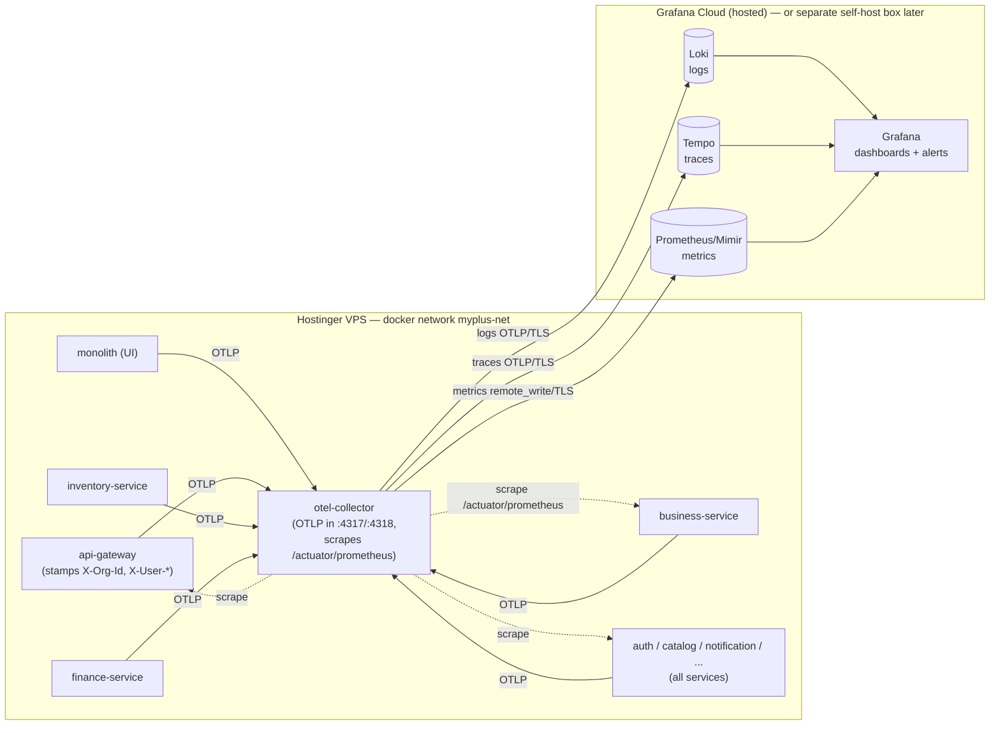
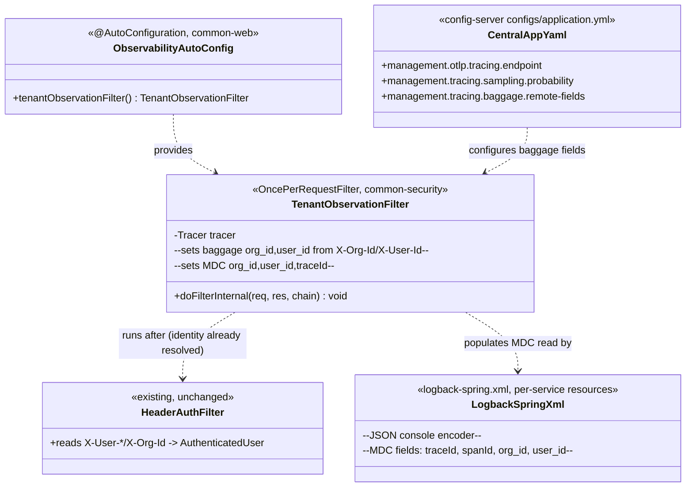
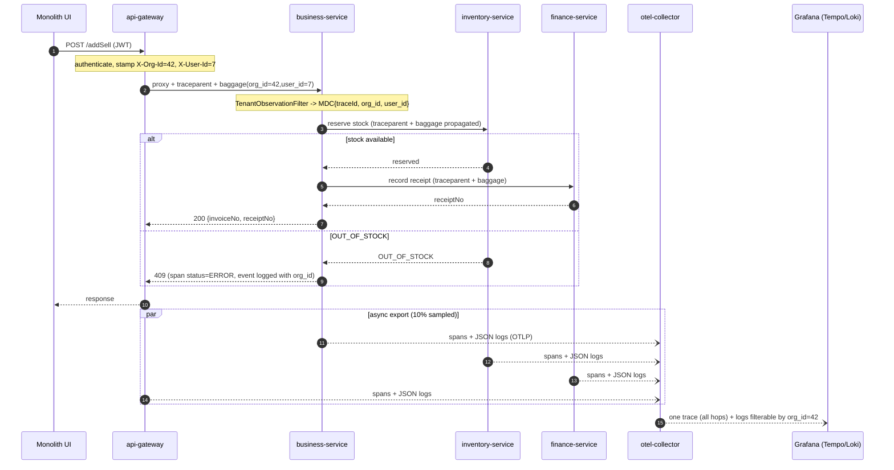

# Observability — OpenTelemetry + Grafana (Loki / Tempo / Prometheus) — Design

**Status:** Design (pre-implementation) · **Branch:** TBD (`feature/observability`) · **Scope:** platform-wide (all microservices + monolith) · **Cadence:** 5 slices, each Document → Design → Implement → Test-gated.

> Cross-cutting standard, so this doc lives in `microservices/docs/` next to
> [`ARCHITECTURE-MULTITENANCY.md`](ARCHITECTURE-MULTITENANCY.md) rather than in `docs/slices/`.
> It follows [`docs/DESIGN-STANDARD.md`](../../docs/DESIGN-STANDARD.md).

---

## 1. Document — what & why

### The problem
Today "log management" is: every container logs plain text to stdout → Docker's `json-file` driver → `docker compose logs -f <service>`. There is **no aggregation, no structured logs, no metrics store, and no distributed tracing**. When a customer's sale fails, it crosses **gateway → business-service → inventory-service → finance-service** (the sell↔stock↔payment saga), and today there is no way to follow that one request across those hops, and no way to slice anything **per tenant**.

### Current state (verified)
- ~18 Spring Boot **3.5.0** services + the monolith, Java 21, deployed as **docker compose on one Hostinger VPS** (full stack ≈16 GB RAM; POS subset ≈9.5 GB).
- `spring-boot-starter-actuator` is on every service classpath.
- The **config-server central config** (`config-server/src/main/resources/configs/application.yml`) already exposes `health, info, metrics, prometheus`.
- ⚠️ **`micrometer-registry-prometheus` is not actually a dependency** → `/actuator/prometheus` does not materialise yet. The exposure config is currently a no-op.
- **No tracing** (no Micrometer Tracing, no OTel, no Zipkin/Brave; Sleuth is EOL and not used).
- **No log aggregation** yet. A lightweight baseline *is* now in place — Docker log rotation capped at
  30 MB/container (`x-logging` anchor in compose) and quiet prod logs (`root: WARN`, SQL echo off) — see
  the runbook [`DEPLOY-POS-RETAIL.md` §6.1](../../DEPLOY-POS-RETAIL.md). This doc covers the *aggregated*
  step on top of that baseline. `microservices/logs/*.log` are only `start-all.ps1` dev stdout redirects.
- Roadmap targets **ECS/Fargate on AWS** later (CI/CD plan).

### The value
- **Per-tenant, per-request** traces and logs across the saga ("show me everything org X did in this failed sale").
- RED metrics (Rate/Errors/Duration) per service + gateway, with dashboards and alerts.
- **Vendor-neutral** wire format (OTLP) → the same instrumentation later points at Grafana Cloud, AWS, or a commercial APM with **zero app changes** — important given the ECS roadmap.

---

## 2. Design

### 2.1 Decisions (and the rejected alternatives)

| # | Decision | Why | Rejected |
|---|----------|-----|----------|
| D1 | **OpenTelemetry (OTLP) as the wire standard** for traces, metrics, logs. | Vendor-neutral; survives the move to AWS/ECS; one Collector config swaps the backend. | Proprietary agents (Datadog/New Relic) — per-host pricing across 18 services + monolith is expensive early, and locks in instrumentation. Keep them as a *future* OTLP target only. |
| D2 | **Instrument Spring-natively**: `micrometer-tracing-bridge-otel` + `opentelemetry-exporter-otlp` + `micrometer-registry-prometheus`. | Boot-3 native, configured **once** in config-server central config, all services inherit. No per-JVM agent memory. | The **OTel Java agent** (`-javaagent`) as the default — adds ~50–100 MB heap + startup **per JVM × 18** on a RAM-tight box. Keep it opt-in for 1–2 services that want deep zero-touch spans. Sleuth — EOL in Boot 3. |
| D3 | **One lightweight OTel Collector** container on the VPS; **backend is hosted (Grafana Cloud free tier)** to start. | Keeps added RAM on the app box to a single small container; no retention/backup ops; free tier covers an early SaaS. | Co-hosting full **LGTM** (Loki+Tempo+Prometheus/Mimir+Grafana) on the app VPS — several GB competing with a ~16 GB app. **ELK/Elastic** — too heavy; Loki (label-indexed) is the right log store. |
| D4 | **Self-host later on a separate box** if volume/cost justifies. | OTLP everywhere → this is a Collector-config change, not re-instrumentation. | — |
| D5 | **Propagate `org_id` + `user_id` as OTel baggage + logback MDC.** | Per-tenant correlation is the whole payoff for a multi-tenant commerce SaaS; the gateway already stamps `X-Org-Id`/`X-User-*`. | Trace-only correlation without tenant fields — loses the per-tenant slice that makes this useful. |
| D6 | **Structured JSON logs to stdout**, shipped by the Collector to Loki. | Uniform, queryable, correlated by `traceId`; monolith already pulls in `logstash-logback-encoder`. | Bespoke text patterns; file-based log shipping. |

### 2.2 Where the config lives (compose-don't-duplicate)
All instrumentation config goes into the **config-server central `application.yml`** (the one already holding `management.endpoints` + JWT + `internal-secret`). Every service inherits it; no per-service duplication. Env-overridable knobs:

```yaml
# config-server central application.yml (additions)
management:
  endpoints:
    web:
      exposure:
        include: health,info,metrics,prometheus   # already present
  otlp:
    tracing:
      endpoint: ${OTLP_ENDPOINT:http://otel-collector:4318/v1/traces}
  tracing:
    sampling:
      probability: ${TRACE_SAMPLE:0.1}             # 10% in prod; 1.0 in dev
    baggage:
      correlation:
        enabled: true
        fields: org_id,user_id                     # baggage -> MDC
      remote-fields: org_id,user_id                # propagate across service hops
otel:
  service:
    name: ${spring.application.name}               # per-service resource attribute
```

`OTLP_ENDPOINT`, `TRACE_SAMPLE` set in `microservices/.env` (like `JWT_SECRET`, `INTERNAL_SECRET`). The **monolith** (which owns no DB and doesn't use config-server) sets the same keys in its own `application.properties` / `application-prod.properties`.

### 2.3 Tenant correlation seam
The gateway already authenticates and stamps `X-User-Id` / `X-Org-Id` (consumed by each service's `HeaderAuthFilter` → `AuthenticatedUser.organizationId`). A tiny **`TenantObservationFilter`** (one shared class in `common-security` or `common-web`) reads those headers and:
1. puts `org_id`/`user_id` into **OTel baggage** (so downstream hops + spans carry them), and
2. puts them into **logback MDC** (so every log line is tenant-tagged).

This is the only meaningful new code; everything else is dependency + config. It reuses the existing header contract — no new plumbing.

### 2.4 Security / anti-abuse
- `/actuator/**` (esp. `prometheus`, `metrics`) must **not** be publicly reachable. It already sits behind the firewall (§4.7 of the deploy runbook blocks 8765/8888/etc.); the Collector scrapes services **inside** `myplus-net`. Keep `health` public-ish for probes; keep `prometheus`/`metrics` internal-only.
- OTLP export from services → Collector stays on the internal Docker network. Only the Collector egresses (TLS) to Grafana Cloud, authenticated with a token in `.env` (git-ignored, like every other secret).
- **No PII in spans/logs**: baggage carries `org_id`/`user_id` (opaque numbers), never names/emails/card data. Sampling at 10% in prod bounds cost/volume.

### 2.5 Deployment shape (RAM-aware)
Add exactly **one** container to compose: `otel-collector` (~128–256 MB). Backend is remote. Net new RAM on the VPS ≈ one small container — deliberately chosen over multi-GB self-hosted LGTM.

---

## 3. Architecture & UML

### 3.1 Architecture (flowchart)



### 3.2 Class diagram (the new/changed types — deliberately small)



New dependencies (added once in `service-parent`/`commerce-domain` BOM, inherited by all):
`micrometer-tracing-bridge-otel`, `opentelemetry-exporter-otlp`, `micrometer-registry-prometheus`, `logstash-logback-encoder`.

### 3.3 Sequence — one sale, traced end-to-end with tenant correlation



---

## 4. Implement (checklist — one slice per group, Test-gated between)

**Slice O1 — Metrics endpoints (quick win)**
- [ ] Add `micrometer-registry-prometheus` to the shared parent/BOM.
- [ ] Confirm `/actuator/prometheus` materialises on every service (was a no-op).
- [ ] Keep `prometheus`/`metrics` internal-only; `health` for probes.

**Slice O2 — OTel Collector + metrics scrape**
- [ ] Add `otel-collector` service to `microservices/docker-compose.yml` (config file, `myplus-net`, mem_limit 256m).
- [ ] Collector scrapes `/actuator/prometheus` for all services; remote_write to backend (Grafana Cloud token in `.env`).
- [ ] One Grafana dashboard: RED per service + gateway.

**Slice O3 — Structured logs → Loki**
- [ ] `logback-spring.xml` JSON console encoder (services + monolith); MDC fields `traceId,spanId,org_id,user_id`.
- [ ] Collector `filelog`/OTLP logs pipeline → Loki.
- [ ] Verify a log line is queryable by `org_id` in Grafana.

**Slice O4 — Tracing + tenant baggage**
- [ ] Add `micrometer-tracing-bridge-otel` + `opentelemetry-exporter-otlp`; OTLP + sampling config in central `application.yml`.
- [ ] `TenantObservationFilter` in `common-security`/`common-web` (baggage + MDC), auto-configured.
- [ ] `remote-fields: org_id,user_id` so baggage crosses hops.
- [ ] Monolith mirrors OTLP config in its own properties.

**Slice O5 — Backend, dashboards, alerts**
- [ ] Grafana Cloud datasources (Loki/Tempo/Prometheus) + trace↔log correlation.
- [ ] Alerts: gateway 5xx rate, saga error rate, service down (Eureka/health).
- [ ] Document the "one separate self-host box" migration path for later.

---

## 5. Test / verification (no Cypress — infra, not user-facing UI)

| # | Case | Expected |
|---|------|----------|
| T1 | `curl` a service `/actuator/prometheus` from inside `myplus-net` | Returns Prometheus exposition text (proves O1). From the public internet → refused (security). |
| T2 | Collector up; open Grafana | Service dashboards populate with request rate/latency/error metrics (O2). |
| T3 | Trigger a successful `/addSell` | **One** Tempo trace spans gateway→business→inventory→finance; each span carries `org_id`/`user_id` attributes (O4). |
| T4 | Trigger an `OUT_OF_STOCK` sale | Trace shows the inventory span `status=ERROR`; a correlated Loki log line at ERROR carries the same `traceId` + `org_id` (O3+O4). |
| T5 | In Grafana, filter logs `org_id="42"` | Only that tenant's lines; click a line → jump to its trace (trace↔log correlation, O5). |
| T6 | Kill one service | Alert fires (service-down) within the configured window (O5). |
| T7 | RAM check on VPS after O2/O5 | Only `otel-collector` (~≤256 MB) added; app footprint unchanged (D3). |

---

## 6. Open questions (confirm before O1)
1. **Backend:** Grafana Cloud free tier to start (recommended, D3) — or do you want self-hosted on a separate droplet from day one?
2. **Sampling:** 10% prod / 100% dev acceptable, or do you want 100% initially while volumes are low?
3. **Monolith:** include it in tracing from the start (it's the UI entry point, so yes recommended) — confirm.
4. **Branch name** `feature/observability` ok?
