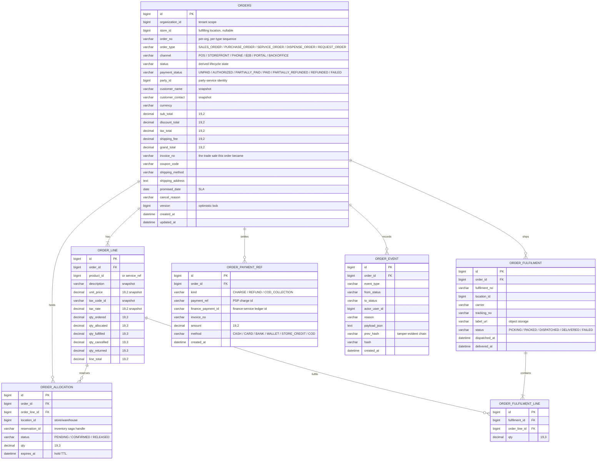
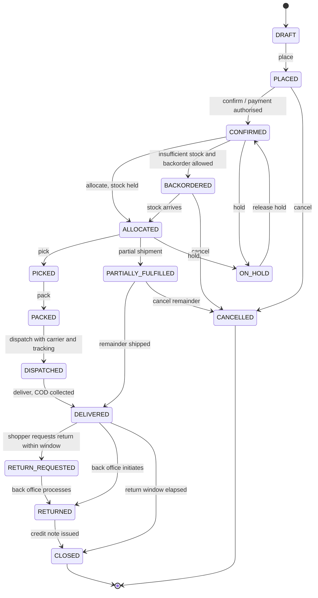
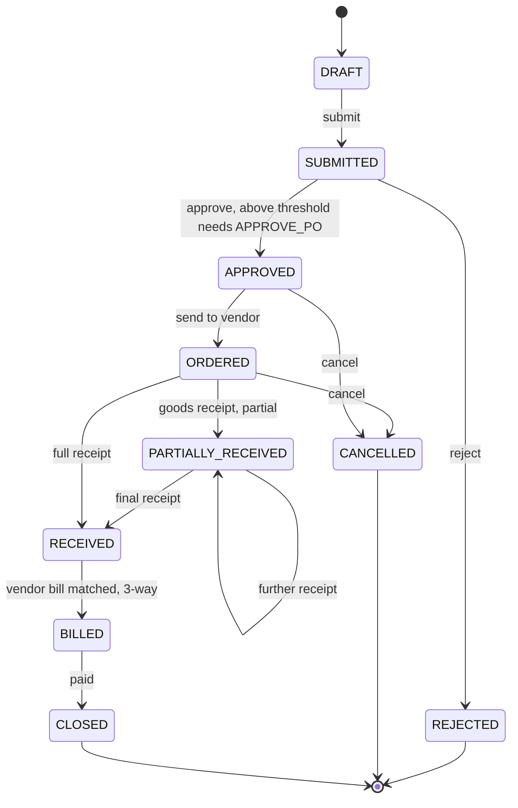
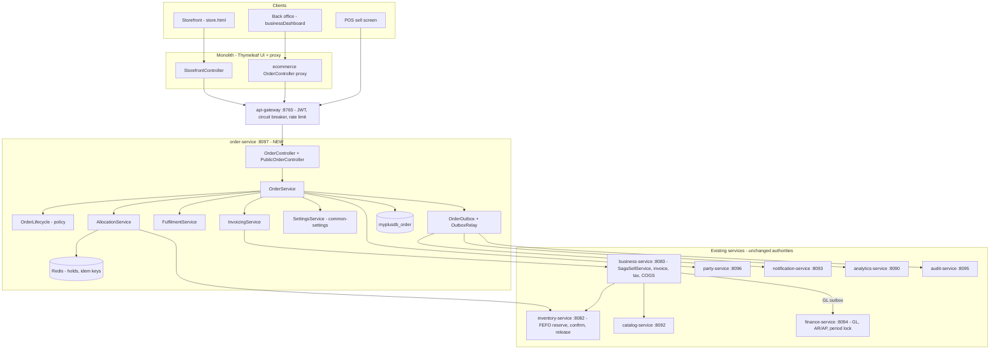
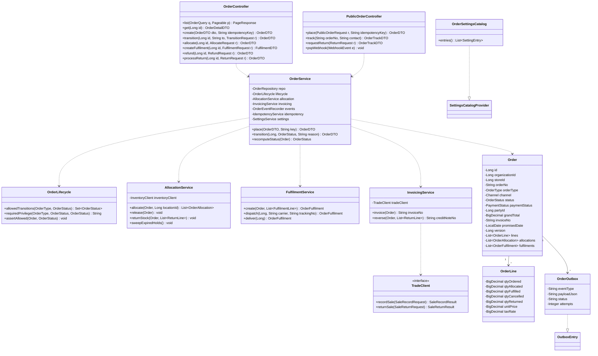
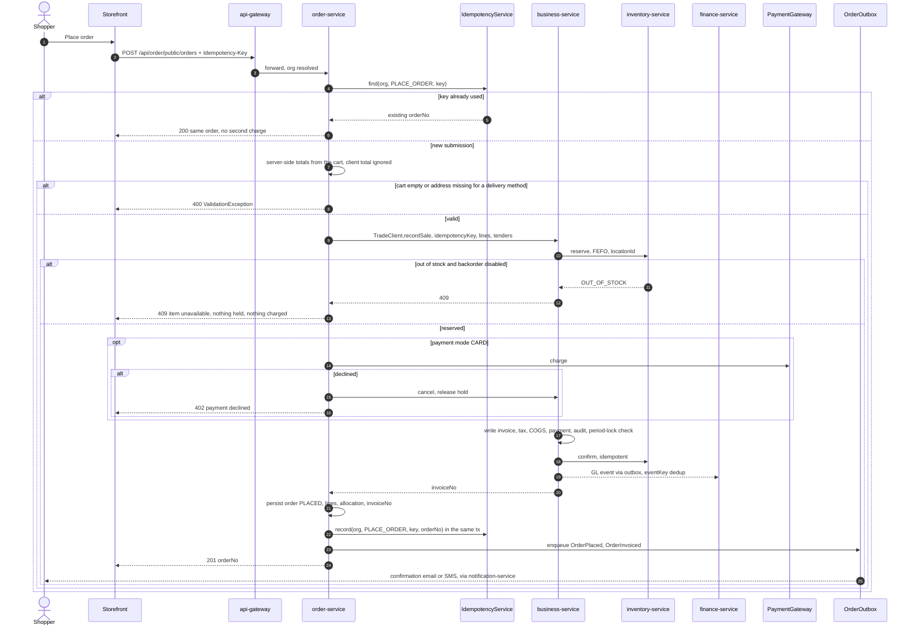
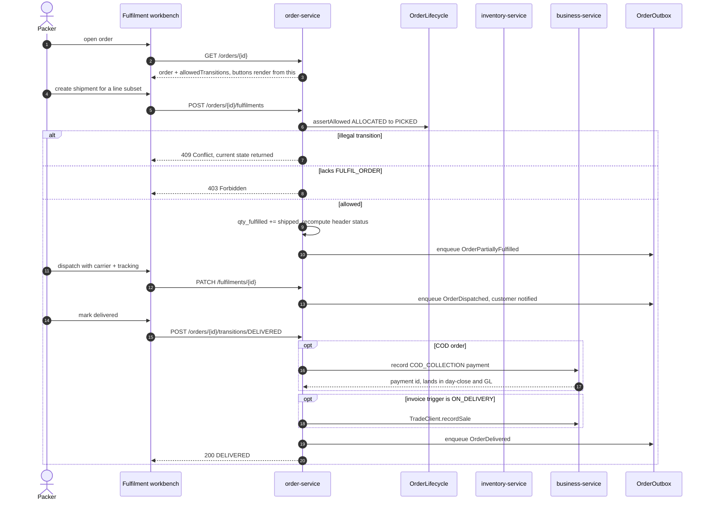
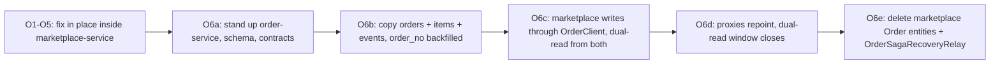

# Order Management System — end-to-end design

**Status:** DESIGN — awaiting approval. No code written.
**Author:** design gate per [`docs/DESIGN-STANDARD.md`](../../docs/DESIGN-STANDARD.md) (Document → Design → Architecture & UML → Implement → Test).
**Scope:** a cross-vertical Order Management System (OMS) for the whole platform — retail/POS, pharmacy,
e-commerce, procurement, education, appointment, welfare, agriculture.
**Companions:** [`domain-lifecycle-audit.md`](domain-lifecycle-audit.md) · [`commerce-verticals-blueprint.md`](commerce-verticals-blueprint.md) ·
[`SAAS-BUILD-STANDARDS.md`](SAAS-BUILD-STANDARDS.md) · [`ARCHITECTURE-MULTITENANCY.md`](ARCHITECTURE-MULTITENANCY.md).

---

# 1. Document

## 1.1 The problem

The platform has **no order domain**. It has one storefront *fulfilment tracker* inside
`marketplace-service`, and six other verticals whose order-shaped use cases are either collapsed into an
invoice or absent entirely.

### 1.1.1 What exists today (verified against the code)

| Vertical | Order-shaped concept | Evidence | State |
|---|---|---|---|
| E-commerce | `Order` + `OrderItem` + `OrderEvent`; `FulfilmentStatus` NEW→PACKED→SHIPPED→DELIVERED + CANCELLED/RETURN_REQUESTED/RETURNED | `marketplace-service/entity/Order.java`, `service/OrderService.java` | 🟡 the only order object in the platform |
| Retail / POS | none — a sale is invoiced instantly (`CustomerHistory` header + `Sell` lines); a completed sale is copied into a marketplace order by the browser afterwards | `static/js/business/ecommerce.js:81` | ⬜ no sales-order / advance / backorder concept |
| Procurement (every vertical) | `Purchase` is a **received vendor bill**, one row per line, no header entity, no PO, no approval, no goods receipt | `business-service/entity/Purchase.java` | ⬜ blueprint C6/R3 still 🟡 |
| Pharmacy | `Prescription` → `Dispensing` | `pharma-service` | 🟡 order in all but name; no partial dispense, substitution or backorder |
| Appointment | `Appointment` has **no status field at all**; `fee` is `String`, `dateTime` is `String` | `appointment-service/entity/Appointment.java` | ⬜ no booking lifecycle |
| Education | fee voucher = invoice | `education-service` | ⬜ no admission application, transport/hostel/book request |
| Welfare / Agriculture | donation / income rows | | ⬜ no pledge→fulfilment, no input PO |

A grep for `StateMachine`, `canTransition`, `allowedTransitions`, `purchase order`, `goods receipt`, `GRN`,
`backorder`, `partial fulfil`, `split ship`, `carrier`, `tracking number`, `pick list`, `packing slip` across
every `.java` file in the microservices tree (30 modules) returns **one hit** — a comment in
`ShippingOption.java` saying carrier/tracking is future work.

### 1.1.2 Defects in what is built

These are correctness bugs, not missing features. They are the reason this work starts with repair, not a rewrite.

| # | Defect | Evidence | Impact |
|---|---|---|---|
| **OMS-1** | **Storefront revenue never reaches the books.** `MarketplaceClientsConfig` wires only inventory/catalog/party clients — no `FinanceClient` bean exists, and no code path calls one. `placePublic()` never sets `invoiceNo` and never creates a trade sale. Stock is decremented and a card is charged, but there is no invoice, no revenue journal, no tax-register line, no AR, no `payment` row, no receipt. | `service/OrderService.java` `placePublic`; `config/MarketplaceClientsConfig.java` | P&L, trial balance, tax register, period close and day-close are **silently wrong** for every online sale. POS-recorded orders *do* carry `invoiceNo`, so the asymmetry hides the error. |
| **OMS-2** | **No state machine.** `updateStatus()` accepts any enum in any direction: NEW→DELIVERED, SHIPPED→NEW, CANCELLED→SHIPPED, RETURNED→PACKED. The gate itself asserts an illegal jump — `ecommerce-orders.cy.js` advances NEW→SHIPPED and expects success. Status change carries **no `@PreAuthorize`** (only `/refund` and `/return` are ADMIN-gated). | `service/OrderService.java` `updateStatus`; `controller/OrderController.java`; `cypress/e2e/business/ecommerce-orders.cy.js` | Unauditable order history; any authenticated user can mark goods delivered. |
| **OMS-3** | **No idempotency on placement.** `reserveOrThrow()` mints `UUID.randomUUID()` per call, so a double-submit produces two orders, two charges, two stock draws. `IdempotencyService` already exists in `business-service` and is not reused. | `service/OrderService.java`; `business-service/service/IdempotencyService.java` | Double-charging shoppers. |
| **OMS-4** | **No optimistic locking.** `Order` has no `@Version`. | `entity/Order.java` | Two packers overwrite each other's status and `refundedAmount`. |
| **OMS-5** | **POS orders are unfulfillable and client-driven.** `record()` never persists `items`, so cancel/return skip stock restoration (guarded by `!o.getItems().isEmpty()`). `recordOrder()` fires from the browser after the sale with a **client-computed total**; close the tab and the order silently never exists. | `service/OrderService.java` `record`; `static/js/business/ecommerce.js:81` | Silent data loss; unreturnable orders. |
| **OMS-6** | **Reservations never expire.** No `expiresAt`/TTL anywhere in `inventory-service`, despite `OrderService` commenting "hold will lapse/cleanup later". | `inventory-service/entity/Reservation.java` | An abandoned checkout whose compensating release fails holds stock permanently. |
| **OMS-7** | **Unbounded reads.** `findScoped()` returns every order for the org, unpaginated and unfiltered; the UI renders all of them. | `repository/OrderRepository.java`; `static/js/business/ecommerce.js` | Breaks at the first real merchant — against the standing performance priority. |
| **OMS-8** | **Order identity.** No human order number; the public tracking reference is the raw auto-increment `id`, and `trackPublic()`/`requestReturn()` use unscoped `findById` (mitigated only by a contact match). `InvoiceNumbers` (per-org sequence) exists in `commerce-domain` and is unused here. | `service/OrderService.java`; `commerce-domain/InvoiceNumbers.java` | Cross-tenant id enumeration; no merchant-usable reference. |

### 1.1.3 Capability gaps versus an industry-standard OMS

| Capability | Today | Gap |
|---|---|---|
| Multi-channel capture | storefront + a POS afterthought | ⬜ no quote, phone, B2B, portal |
| Allocation & sourcing | one org-wide FEFO reserve; `StockReservationRequest` carries **no location** | ⬜ no store/warehouse routing — although multi-store/multi-branch already ships |
| Partial & split fulfilment, backorder | ⬜ | order is all-or-nothing |
| Pick / pack / dispatch | ⬜ | no pick list, packing slip, dispatch document |
| Carrier, tracking, delivery slot, promise date, SLA | ⬜ | no aging or breach view |
| COD reconciliation | COD sits `PENDING` forever | ⬜ nothing marks paid-on-delivery; cash never reaches finance or day-close |
| Payments | sandbox gateway only | ⬜ no PSP webhook, so async confirmation is impossible; refunds bypass GL; store credit is not a storefront tender |
| Returns / RMA | status + stock-back + card refund | 🟡 no line-level RMA, restocking fee, credit note or GL reversal |
| Amendments | ⬜ | only status changes; no add/remove line, address change, requantify |
| Notifications | `NotificationService` logs `"would email …"` | ⬜ `notification-service` exists and is unused; `common-outbox` exists and is unused here |
| Analytics | analytics reads sales only | ⬜ no funnel, fill rate, on-time %, cancel reasons |
| Documents | ⬜ | no confirmation PDF, invoice, packing slip, label |
| **Per-org configuration** | **none** — `marketplace-service` has no `SettingsCatalogProvider`, no `SettingsStore`, no `org_setting` table (Flyway V1–V9 contain none). `ShippingOption` is a Java enum with literal `5.00`/`15.00` fees | 🔒 the one commerce service with zero configurability, against the platform's central standard |

## 1.2 Goals

1. **Correct books first.** Every order, in every channel, produces exactly one invoice through exactly one
   revenue path. (Closes OMS-1.)
2. **One order domain, many channels and verticals.** A single aggregate + a configurable lifecycle serves
   sales orders, purchase orders, service orders, dispense orders and requests.
3. **Reuse, never re-implement.** Stock holds, GL posting, idempotency, outbox delivery, settings, party
   identity, numbering and audit already exist as shared libraries — the OMS consumes them.
4. **Owner-configurable.** Every policy that differs between merchants is a `SettingEntry`, not a code branch.
5. **Fulfilment with substance.** Allocation by location, partial and split shipments, backorders, pick/pack,
   carrier and tracking, promise dates and SLA.
6. **Standards-compliant.** Org-scoped reads, stamped writes, anti-IDOR, `@PreAuthorize` on every mutation,
   BigDecimal money, Flyway schema, paginated reads, Cypress gate per slice.

## 1.3 Non-goals (explicitly deferred)

- Live PSP certification and PCI scope (the `PaymentGateway` seam stays; sandbox remains the default).
- Warehouse management beyond allocation and picking — no bin/zone/wave planning.
- Route optimisation and driver apps; carrier integration is limited to method + tracking number + label URL.
- Demand forecasting and replenishment suggestion.
- Product variants/options (blueprint E2) — an OMS prerequisite for apparel, but its own slice.

## 1.4 Use cases, per vertical

Each row is a lifecycle the OMS must express through configuration, not new code.

| Vertical | Order type | Lifecycle | Today |
|---|---|---|---|
| **Retail / POS** | `SALES_ORDER` | quote/estimate → sales order (advance, layaway, out-of-stock promise) → allocate → pick → invoice → deliver; partial delivery; deposit against the order | ⬜ POS only does instant invoice |
| **Procurement** (all verticals) | `PURCHASE_ORDER` | requisition → PO → approval above a configurable threshold → send to vendor → **partial goods receipts** → vendor bill → 3-way match → payment | ⬜ only the bill exists |
| **Pharmacy** | `DISPENSE_ORDER` | Rx intake → dispense order → substitution / partial dispense / backorder → FEFO dispense → insurance claim + co-pay AR | 🟡 no order layer, no claim AR |
| **E-commerce** | `SALES_ORDER` (channel STOREFRONT) | cart → checkout → payment → allocate → pick/pack → ship + track → deliver → COD settle → RMA / credit note | 🟡 the middle is missing |
| **Education** | `REQUEST_ORDER` | admission application → offer → acceptance → enrolment; transport / hostel / book / uniform request → allocation → fee voucher | ⬜ |
| **Appointment** | `SERVICE_ORDER` | booking request → slot allocation → confirm → deposit → reschedule / cancel / no-show → visit → invoice | ⬜ no status field at all |
| **Welfare** | `REQUEST_ORDER` | pledge → instalment schedule → receipt; in-kind distribution request → allocation → handover | ⬜ |
| **Agriculture** | `PURCHASE_ORDER` / `SALES_ORDER` | input purchase order; harvest sale contract with delivery instalments | ⬜ |

---

# 2. Design

## 2.1 Bounded context and service placement

Orders are a **cross-vertical capability**, not a storefront feature. Per the standing microservice standard
(*a reusable cross-cutting capability gets its own standalone service, exposed through a contract + client, with
callers depending on the interface*), the order aggregate moves out of `marketplace-service` into its own
service, and every channel becomes an adapter.

```
order-service        :8097   myplusdb_order    (new)
order-contracts              OrderClient @HttpExchange + DTOs   (new, sibling of commerce-contracts)
```

**Sequencing decision — repair in place first, extract second.** Slices O1–O5 land inside
`marketplace-service`, because OMS-1 is a live ledger defect and must not wait for a service migration; O6
extracts the (by then correct) aggregate into `order-service` with a dual-read window. Extracting first would
carry all eight defects into a new service and stall the ledger fix behind an infrastructure change. This
matches the standing rule: raise the codebase slice by slice, confirm before big rewrites.

**Conventions the new service follows** (copied from `party-service`, the newest and cleanest):

| Concern | Decision |
|---|---|
| Port / DB | `8097` / `myplusdb_order` (verified free: 8081–8096 in use) |
| Controller mapping | full path `/api/order/...` in the controller, gateway route with **no** `StripPrefix` — the inventory/party convention, not the marketplace one |
| Schema | Flyway `V1__baseline.sql` onward; `ddl-auto: validate` |
| Identity | `HeaderAuthFilter` + `CurrentUser`; internal calls via `GatewayIdentityForwarding.runAs` |
| Envelope | `ApiResponse` from `common-web` (never `GenericResponse`) |
| Timezone | `connectionTimeZone=%2B05:00` in the JDBC URL (platform standard; omitting it crashes startup) |
| Registration | eureka + config-server bootstrap; add to `start-all.ps1` port map and the gateway route list |

## 2.2 Domain model

Two axes that the current code wrongly conflates are separated: **fulfilment state** and **payment state**.
Header status is a *derived projection* of the line quantities — the quantities are the single source of truth,
so a partially shipped order cannot disagree with its lines.



Additional tables: `order_number_sequence (organization_id, order_type, next_val)` and
`org_setting` (the standard `common-settings` override table) and `order_outbox` (an `OutboxEntry`
implementation for event fan-out).

**Money and quantity types.** All money is `BigDecimal(19,2)` per the platform standard. Quantities are
`BigDecimal(19,3)` — not `Integer` as `OrderItem.quantity` is today and not `Float` as `Purchase.quantity` is
— because pharmacy and agriculture sell fractional units.

**Org-scoping.** Every table carries `organization_id`; every repository read uses the standard scoped query
with NULL-fallback; every write stamps the org from `CurrentUser`; every by-id read is anti-IDOR
(`findByIdScoped`) — including the public tracking path, which today is not.

## 2.3 Lifecycle — a configurable state machine

The lifecycle is a **policy object**, not scattered `if` statements: `OrderLifecycle` exposes
`allowedTransitions(orderType, from)` and `requiredPrivilege(orderType, from, to)`. The transition table is
declared per `orderType` in code and selectable per org via `order.flow.<type>`. An illegal transition returns
**409 Conflict**; an unauthorised one returns **403**. The API returns the allowed transitions with every order
so the UI renders buttons from the server's answer rather than a hard-coded map in JavaScript (which is exactly
the bug in `ecommerce.js:10`).

### Sales / dispense flow



### Purchase order flow



### Transition authority (the `@PreAuthorize` matrix that does not exist today)

| Transition | Privilege | Note |
|---|---|---|
| place / confirm | `CREATE_ORDER` | public storefront placement is anonymous by design, rate-limited instead |
| allocate / pick / pack | `FULFIL_ORDER` | the packer role |
| dispatch / deliver | `FULFIL_ORDER` | |
| cancel | `CANCEL_ORDER` | allowed only up to `order.cancel.allowedUntil` |
| refund / process return | `ADMIN_PRIVILEGE` | already gated today — keep |
| approve PO | `APPROVE_PO` | required above `order.approval.requiredAbove` |
| receive goods | `RECEIVE_GOODS` | |
| amend order lines | `AMEND_ORDER` | blocked once any line is fulfilled |

## 2.4 The money path — one invoice, one revenue journal

This is the fix for OMS-1 and the single most important decision in the design.

**Today** the storefront talks to `inventory-service` directly and invents its own reserve→charge→confirm saga,
bypassing everything `business-service` already does at a sale: invoice numbering, tax, COGS snapshot, GL outbox
posting, audit trail, period-lock guard, store-credit redemption, customer AR, payment records.

**The design** is that an order never posts to the ledger itself. When an order becomes revenue — checkout
completes, or a sales order is delivered, depending on `order.invoice.trigger` — the OMS calls
`business-service`'s existing sale path through a new contract, and stores the returned `invoiceNo` on the
order. `business-service` remains the sole author of trade sales; `finance-service` remains the sole author of
journals. The parallel storefront saga and its duplicated relay are then deleted.

```java
// order-contracts (new) — the missing seam. business-service already has everything behind it.
@HttpExchange(accept = "application/json", contentType = "application/json")
public interface TradeClient {
    /** Record a sale for a completed order; returns the invoice number. Idempotent on idempotencyKey. */
    @PostExchange("/internal/sales")
    SaleRecordResult recordSale(@RequestBody SaleRecordRequest request);

    /** Reverse a sale for a return/cancel-after-invoice; returns the credit note reference. */
    @PostExchange("/internal/sales/return")
    SaleReturnResult returnSale(@RequestBody SaleReturnRequest request);
}
```

`business-service` adds `/internal/sales`, a thin controller that maps `SaleRecordRequest` →
`CustomerHistoryDTO` → `SagaSellService.addSell(dto)`. That method **already** takes an `idempotencyKey` and
replays the same invoice for a repeated key, already runs `PeriodLockGuard`, already enqueues the GL outbox
event, already writes the audit row. No new money logic is written anywhere — the design is a wiring change.

Consequences, all of them corrections:

- Online sales appear in P&L, trial balance, tax register and period close.
- Online payments become `payment` rows, so day-close and tender reports are complete.
- COD becomes a real settlement: delivery triggers a `COD_COLLECTION` payment record (`order.payment.codEnabled`).
- Refunds and returns post a reversal through the same path instead of only touching the PSP.
- The storefront stops needing its own reservation saga: `SagaSellService` performs reserve→confirm, so
  `OrderSagaRecoveryRelay` is deleted and `SagaRecoveryRelay` becomes the one relay (a DRY win).

## 2.5 Allocation and fulfilment

**Location-aware holds.** `StockReservationRequest` gains an optional `locationId`; `inventory-service` picks
FEFO within that location, falling back to org-wide when null (backwards compatible — existing POS callers pass
nothing and behave exactly as today). Sourcing strategy comes from `order.fulfilment.sourcingStrategy`
(`FIXED_STORE` | `MOST_STOCK` | `NEAREST`).

**Hold expiry (OMS-6).** `Reservation` gains `expires_at`; a scheduled sweeper releases lapsed holds, and Redis
carries the short-lived checkout hold key. Confirmed reservations are never swept.

**Partial and split.** A fulfilment is a subset of lines × quantities. `qty_fulfilled` accumulates per line;
the header status is recomputed after every change: all lines fulfilled → `DELIVERED`, some → `PARTIALLY_FULFILLED`,
none but allocated → `ALLOCATED`. Backorders are lines with `qty_allocated < qty_ordered` when
`order.fulfilment.allowBackorder` is on.

**Pick / pack / dispatch.** A fulfilment moves `PICKING → PACKED → DISPATCHED → DELIVERED`, carrying carrier,
tracking number and a label URL in object storage. Each transition emits an order event, which is what feeds
notifications and the customer-facing timeline.

## 2.6 Reliability, idempotency, concurrency

| Concern | Mechanism | Reuse |
|---|---|---|
| Double submit (OMS-3) | `Idempotency-Key` header on every placement/mutation; `(org, operation, key)` unique index; replay returns the original order | extract `business-service`'s `IdempotencyService` + `IdempotencyRecord` into **`common-idempotency`** — a second consumer is exactly the trigger the microservice standard names |
| Concurrent edits (OMS-4) | `@Version` on `Order`; a stale write returns 409 with the current state | JPA |
| Event fan-out | `order_outbox` implements `OutboxEntry`; an `OutboxDelivery` channel per target; `OutboxRelay` drives retries and dead-letters after 20 attempts | `common-outbox` — already generic, currently used by GL and audit |
| Cross-service atomicity | the existing reserve → write → confirm saga, now owned by one orchestrator | `InventoryClient` + `SagaSellService` |
| GL exactly-once | `PostingEventRequest.eventKey` — finance already dedups | `commerce-contracts` |
| Tamper-evident history | `order_event.prev_hash`/`hash` chain, verifiable by a `/verify` endpoint | the pattern recommended for `audit-service` in §10 of the lifecycle audit |

**Events published** (topic-per-type once a broker lands; DB-polled relay until then):
`OrderPlaced`, `OrderConfirmed`, `OrderAllocated`, `OrderPartiallyFulfilled`, `OrderDispatched`,
`OrderDelivered`, `OrderCancelled`, `OrderReturned`, `OrderInvoiced`, `PaymentCaptured`, `RefundIssued`.
Consumers: `notification-service` (customer messages), `analytics-service` (read model), `finance-service`
(via the trade path), `campaign-service` (abandoned-cart, win-back).

## 2.7 Per-org configuration (`order.*`)

`order-service` becomes the 5th `common-settings` consumer: one `SettingsCatalogProvider`, one JPA
`SettingsStore` over its own `org_setting` table, one Flyway migration, one Configuration screen rendered by the
shared renderer. Adding a policy later is one `SettingEntry` and no schema change.

| Key | Type | Default | Group | Behaviour it governs |
|---|---|---|---|---|
| `order.number.format` | TEXT | `SO-{yyyy}-{seq:6}` | Numbering | per-org, per-type sequence rendering |
| `order.number.perType` | BOOL | true | Numbering | separate series per order type |
| `order.flow.salesOrder` | SELECT | `ECOM` | Lifecycle | `RETAIL` \| `ECOM` \| `SIMPLE` transition table |
| `order.cancel.allowedUntil` | SELECT | `PACKED` | Cancellation | latest state at which cancel is offered |
| `order.cancel.requiresReason` | BOOL | true | Cancellation | reason mandatory, from the reason master |
| `order.return.windowDays` | INT | 7 | Returns | after which `DELIVERED → CLOSED` |
| `order.return.restockingFeePct` | INT | 0 | Returns | deducted from the credit note |
| `order.payment.codEnabled` | BOOL | true | Payments | offer COD at checkout |
| `order.payment.prepayRequired` | BOOL | false | Payments | block confirmation until paid |
| `order.payment.autoCancelUnpaidHours` | INT | 24 | Payments | sweeper cancels and releases stock |
| `order.invoice.trigger` | SELECT | `ON_PAYMENT` | Invoicing | `ON_PLACEMENT` \| `ON_PAYMENT` \| `ON_DISPATCH` \| `ON_DELIVERY` |
| `order.fulfilment.allowPartial` | BOOL | true | Fulfilment | split shipments permitted |
| `order.fulfilment.allowBackorder` | BOOL | false | Fulfilment | accept orders beyond available stock |
| `order.fulfilment.sourcingStrategy` | SELECT | `FIXED_STORE` | Fulfilment | which location allocates |
| `order.shipping.mode` | SELECT | `FLAT` | Shipping | `FLAT` \| `WEIGHT` \| `ZONE` — replaces the hard-coded enum |
| `order.shipping.freeAbove` | INT | 0 | Shipping | 0 disables |
| `order.slot.enabled` / `.leadTimeHours` / `.promiseDays` | BOOL/INT/INT | false / 24 / 3 | Delivery | slot booking and SLA promise date |
| `order.notify.onStatuses` | TEXT | `PLACED,DISPATCHED,DELIVERED` | Notifications | which transitions message the customer |
| `order.approval.requiredAbove` | INT | 0 | Procurement | PO approval threshold; 0 = always required |
| `order.hold.ttlMinutes` | INT | 30 | Inventory | checkout stock-hold expiry |

## 2.8 Endpoint contract

Back office (`/api/order/orders`, JWT, org-scoped, every mutation `@PreAuthorize`d):

| Method | Path | Auth | Purpose |
|---|---|---|---|
| GET | `/orders` | `LOGIN_PRIVILEGE` | **paginated** list: `page`, `size`, `status`, `channel`, `type`, `storeId`, `paymentStatus`, `from`, `to`, `q` (order no / customer / phone) |
| GET | `/orders/{id}` | `LOGIN_PRIVILEGE` | full order: lines, allocations, fulfilments, payments, timeline, **`allowedTransitions`** |
| POST | `/orders` | `CREATE_ORDER` | create (back office / phone / B2B); `Idempotency-Key` |
| PATCH | `/orders/{id}/lines` | `AMEND_ORDER` | amend before fulfilment |
| POST | `/orders/{id}/transitions/{to}` | per matrix §2.3 | the **only** status mutation; 409 on illegal, 403 on unauthorised |
| POST | `/orders/{id}/allocate` | `FULFIL_ORDER` | reserve stock, optional `locationId` |
| POST | `/orders/{id}/fulfilments` | `FULFIL_ORDER` | create a shipment from a line/qty subset |
| PATCH | `/fulfilments/{id}` | `FULFIL_ORDER` | carrier, tracking, dispatch/deliver |
| POST | `/orders/{id}/invoice` | `CREATE_ORDER` | force invoicing when trigger is manual |
| POST | `/orders/{id}/refund` | `ADMIN_PRIVILEGE` | amount optional = full remaining |
| POST | `/orders/{id}/return` | `ADMIN_PRIVILEGE` | line-level RMA + credit note |
| GET | `/orders/{id}/documents/{kind}` | `LOGIN_PRIVILEGE` | packing slip, invoice, label |
| GET | `/settings` / POST `/settings` | `ADMIN_PRIVILEGE` | shared `SettingsController` |

Public storefront (`/api/order/public/**`, anonymous, rate-limited at the gateway):

| Method | Path | Purpose |
|---|---|---|
| POST | `/public/orders` | place from the server cart; `Idempotency-Key`; org from the request |
| GET | `/public/orders/track?ref=&contact=` | tracking by **order number** + contact match — never the raw id (OMS-8) |
| POST | `/public/orders/return` | request a return within `order.return.windowDays` |
| POST | `/public/webhooks/psp` | PSP callback: signature-verified, idempotent by event id |

Monolith proxies keep the existing `/getOrders`, `/updateOrderStatus`, `/refundOrder`, `/processReturn` names
during O1–O5 so no UI breaks, then gain the paginated and detail routes.

## 2.9 UI/UX contract

Today's back office is 90 lines: six columns, one "Mark next" button, no detail view, no lines, no timeline, no
filters, no pagination — and no refund or return button **even though both endpoints exist and are gated**.

| Screen | Content | Shared components reused |
|---|---|---|
| **Order list** | server-paginated table; filter bar (status, channel, type, store, payment, date range, search); saved views in `localStorage`; SLA/aging colour; bulk mark-packed and print-picks; CSV export | `responsive-tables.js` (`.table-scroll`), `date-picker.js` (dd-MM-yyyy), `dom-safe.js` `escHtml`, existing DataTables setup |
| **Order detail** | header + party; lines with ordered/allocated/fulfilled/returned; allocations by location; shipments with carrier and tracking; payments and refunds; **event timeline**; action buttons rendered from `allowedTransitions` | `crud-modal.js`, `confirm-dialog.js` (`uiConfirm` — never `window.confirm`), `focus-flow.js` |
| **Fulfilment workbench** | pick list → scan to pack → dispatch; barcode-driven | the barcode-first sell pattern already built |
| **Configuration ▸ Orders** | self-rendering from the `order.*` catalog | the shared config renderer — extract `config-screen.js` now that a 5th vertical needs it, closing the duplication flagged in §11 of the lifecycle audit |
| **Storefront** | real order detail with timeline and tracking; return request inside the window; My Orders | existing storefront templates |

All strings go through `t()` / `th:text` against the 6 language bundles (en/fr/es/hi/ar/ur) — the platform is
multilingual and RTL-aware, so no hard-coded English and no split-phrase fragments. New JS lives in
`static/js/business/orders.js`; anything shared goes to `js/common/`, never duplicated (DRY rule).

## 2.10 Security and anti-abuse

- **Tenancy:** scoped reads, stamped writes, `findByIdScoped` on every by-id path — **including public
  tracking**, which today calls unscoped `findById`.
- **Authorization:** every mutation `@PreAuthorize`d per the §2.3 matrix; new privileges (`CREATE_ORDER`,
  `FULFIL_ORDER`, `CANCEL_ORDER`, `AMEND_ORDER`, `APPROVE_PO`, `RECEIVE_GOODS`) seeded in the auth-service
  loader and mapped into the vertical role files.
- **Public surface:** order numbers replace sequential ids; tracking still requires a contact match; gateway
  rate-limits `/public/**`; the PSP webhook verifies signatures and dedups by provider event id.
- **Money:** server computes every total; the client's `total` is ignored — closing the `recordOrder`
  client-total path (OMS-5).
- **PII:** shipping addresses and contacts stay in the order aggregate; `party_id` links identity, so a
  contact change does not rewrite history.

## 2.11 Data-store selection per workload

| Workload | Store | Rationale |
|---|---|---|
| Order aggregate, allocations, fulfilments, payments refs | **MySQL**, DB-per-service, Flyway | ACID coupling of money and stock; matches the platform standard — keep |
| Checkout holds, idempotency keys, slot locks, cart | **Redis** | expiring keys are precisely this; fixes OMS-6 |
| Event fan-out | outbox in MySQL → **broker (Kafka/RabbitMQ)** when it lands | the #1 architectural gap already recorded in §12 of the lifecycle audit; `OutboxRelay` polling is correct at current volume |
| Order analytics: funnel, fill rate, on-time %, aging, cancel reasons | **CQRS read model** — `order_daily_summary` refreshed from events | never `GROUP BY` the live OLTP order table |
| Order search by number / phone / customer | MySQL composite indexes | `(organization_id, status, created_at)`, `(organization_id, order_no)` unique, `(organization_id, party_id)`, `(organization_id, customer_contact)`; a search engine only if storefront catalog search justifies one independently |
| Documents: packing slip, invoice, label PDFs | **object storage + signed URL** | blobs do not belong in MySQL rows |
| Event history | MySQL append-only + **hash chain** | tamper-evident, verifiable |

## 2.12 Performance

Standing priority, designed in rather than retrofitted:

- Every list endpoint is paginated with a hard `size` cap; no unbounded `findScoped` (OMS-7).
- Order detail loads lines/allocations/fulfilments in batched queries — no N+1 across the collections.
- Product names and prices are **snapshotted on the line**, so listing 500 orders makes zero catalog calls.
- Inter-service calls stay off the hot read path: reads never call inventory or finance; only transitions do.
- The status projection is recomputed in-process from already-loaded lines, never by re-querying.
- Indexes as listed in §2.11; `order_no` unique per org.

---

# 3. Architecture & UML

## 3.1 Architecture



## 3.2 Class diagram



> Controller return types are shown unwrapped for readability; on the wire every response is an
> `ApiResponse<T>` from `common-web`, and list endpoints return `PageResponse<OrderDTO>` inside it.

## 3.3 Sequence — storefront checkout, end to end



## 3.4 Sequence — fulfilment and delivery



## 3.5 Migration — marketplace order → order-service (slice O6)



No big-bang cutover: each step is independently revertible, and the Cypress suite from O1–O5 runs green against
both sides during the dual-read window.

---

# 4. Implement

Each slice is Document → Design → Implement → **passing headed Cypress gate** → next. The user runs the gate;
their confirmation is what closes a slice. Nothing here is started without explicit approval.

## O1 — Storefront revenue reaches the books  *(fixes OMS-1, OMS-5; blocking defect)*
- [ ] `commerce-contracts`: `TradeClient` + `SaleRecordRequest` / `SaleRecordResult` / `SaleReturnRequest`
- [ ] `business-service`: `/internal/sales` and `/internal/sales/return` controller mapping to `SagaSellService`
- [ ] `marketplace-service`: `TradeClientConfig`; `placePublic` records the sale instead of reserving directly
- [ ] Persist `invoiceNo` on every order; `record()` persists lines and `storeId`
- [ ] `recordOrder` becomes a server-side post-sale hook, not a browser call with a client total
- [ ] Delete the duplicated storefront reservation path and `OrderSagaRecoveryRelay`
- [ ] Flyway `V10__order_invoice_link.sql`; backfill/flag pre-existing orders as `LEGACY_UNPOSTED`
- [ ] Reconciliation report: orders without an invoice

## O2 — Lifecycle, authority, safety  *(fixes OMS-2, OMS-3, OMS-4, OMS-8)*
- [ ] `OrderLifecycle` policy object + transition tables; `allowedTransitions` in every order response
- [ ] `@PreAuthorize` per the §2.3 matrix; new privileges seeded and mapped into role files
- [ ] `common-idempotency` extracted from `business-service`; `Idempotency-Key` on placement
- [ ] `@Version` on `Order`; 409 on stale write
- [ ] `order_no` per-org sequence; public tracking keyed on it; `findByIdScoped` on public paths
- [ ] `order_event` gains `from_status`, `actor_user_id`, `reason` and the hash chain
- [ ] **Rewrite** the `ecommerce-orders.cy.js` assertion that currently expects NEW→SHIPPED to succeed

## O3 — Per-org configuration
- [ ] `OrderSettingsCatalog` + JPA `SettingsStore` + Flyway `org_setting`
- [ ] `ShippingOption` enum replaced by an org rate table (`FLAT` / `WEIGHT` / `ZONE`) with currency
- [ ] Wire every flag to behaviour — no dead toggles: cancel window, return window, COD, prepay,
      auto-cancel sweeper, invoice trigger, partial/backorder, hold TTL
- [ ] Configuration ▸ Orders screen via the shared renderer; extract `js/common/config-screen.js`

## O4 — Back-office UI/UX  *(fixes OMS-7)*
- [ ] Paginated + filtered list endpoint and table; saved views; CSV export
- [ ] Order detail: lines, allocations, shipments, payments, timeline, server-driven action buttons
- [ ] Surface the already-built refund and return endpoints in the UI
- [ ] 6-language strings; RTL-checked; responsive `.table-scroll`

## O5 — Fulfilment engine  *(fixes OMS-6)*
- [ ] `order_fulfilment` + `order_fulfilment_line`; partial and split shipments; backorders
- [ ] `locationId` on `StockReservationRequest`; location-aware FEFO in `inventory-service`
- [ ] `Reservation.expires_at` + sweeper; Redis checkout hold
- [ ] Carrier, tracking, label URL in object storage; packing slip and pick list documents
- [ ] Promise date and SLA aging on the list

## O6 — Extract `order-service`
- [ ] New module, port 8097, `myplusdb_order`, Flyway baseline, gateway route without `StripPrefix`
- [ ] `order-contracts` + `OrderClient`; `order_outbox` on `common-outbox`
- [ ] Data copy + dual-read window + proxy repoint per §3.5; delete marketplace order entities
- [ ] Add to `start-all.ps1`, docker-compose, observability config

## O7 — Second and third channels
- [ ] **POS sales order**: advance/layaway/backorder; deposit; convert to invoice on delivery
- [ ] **Procurement**: requisition → PO → approval → partial GRN → vendor bill → 3-way match; `Purchase` gains
      a header and links to its PO
- [ ] Quote/estimate → order conversion

## O8 — Vertical adapters and analytics
- [ ] Pharmacy dispense order: substitution, partial dispense, backorder, insurer claim AR
- [ ] Appointment: `SERVICE_ORDER` — a real status field, slot allocation, reschedule/cancel/no-show, deposit
- [ ] Education: admission application and transport/hostel/book requests
- [ ] Welfare pledges; agriculture input POs and harvest contracts
- [ ] `order_daily_summary` CQRS read model fed by events; funnel, fill rate, on-time %, cancel reasons

---

# 5. Test

## 5.1 Java tests (run on `mvn test`)

Pure-logic, always-run:
- `OrderLifecycleTest` — every legal transition per type; every illegal one throws; privilege mapping.
- `StatusProjectionTest` — header status derived from line quantities across partial/backorder/cancel mixes.
- `TotalsTest` — subtotal, discount, exclusive tax, shipping, rounding; client totals ignored.
- `AllocationTest` — location strategies, partial allocation, backorder, expiry sweep.
- `OrderNumberTest` — per-org, per-type sequence and format rendering.
- `EventChainTest` — hash chain verifies; a mutated row fails verification.

Testcontainers (`@DisabledIfSystemProperty` without Docker), per the platform testing standard:
- `OrderRepositoryIT` — org-scoping and NULL-fallback; anti-IDOR by-id; pagination and index use.
- `IdempotencyIT` — sequential replay returns the same order; concurrent race leaves exactly one.
- `OutboxIT` — retry, dead-letter after 20 attempts, no duplicate delivery.

## 5.2 Cypress gates (headed; **you** run them, your pass closes the slice)

| Slice | Spec | Must prove |
|---|---|---|
| O1 | `business/order-to-ledger.cy.js` | place a storefront order → an invoice exists → a GL journal exists → the tax register shows the line → P&L revenue moves by the order total → the order carries `invoiceNo` |
| O2 | `business/order-lifecycle.cy.js` | legal path NEW→…→DELIVERED succeeds; **NEW→SHIPPED returns 409**; a non-admin refund returns 403; a double-submitted placement yields one order and one charge; a stale update returns 409 |
| O3 | `business/order-config.cy.js` | flip `order.cancel.allowedUntil`, `order.payment.codEnabled`, `order.return.windowDays`, `order.shipping.mode` → behaviour changes; a second org is unaffected |
| O4 | `business/order-back-office.cy.js` | list paginates and filters; detail shows lines, timeline and shipments; refund and return buttons work; buttons match `allowedTransitions` |
| O5 | `business/order-fulfilment.cy.js` | split shipment leaves the order `PARTIALLY_FULFILLED`; tracking is visible to the shopper; an expired hold releases stock |
| O6 | all prior specs, unchanged | green against `order-service` — the extraction is behaviour-neutral |
| O7 | `business/sales-order.cy.js`, `business/purchase-order-grn.cy.js` | advance order → deliver → invoice; PO → approval → two partial GRNs → bill → 3-way match |
| O8 | per vertical | pharmacy partial dispense; appointment reschedule/no-show; education admission |

## 5.3 Explicit edge cases the gates must cover

- Out of stock at checkout with backorder off → nothing held, nothing charged, clear message.
- Card declined after a successful hold → hold released, no order, no orphan reservation.
- Confirm fails after the charge → order recorded, relay re-drives, stock ends consistent, no double decrement.
- Cancel after dispatch → refused per `order.cancel.allowedUntil`.
- Return outside `order.return.windowDays` → refused.
- COD delivered → payment recorded, day-close and GL include it.
- Period locked → an order dated in a closed period is refused by `PeriodLockGuard`.
- Cross-tenant: org B cannot read, transition, refund or track org A's order by id or number.

---

## Appendix A — reuse map (what this design does *not* rebuild)

| Concern | Existing asset | Location |
|---|---|---|
| Stock hold / FEFO / release | reserve–confirm–release saga + `InventoryClient` | `inventory-service`, `commerce-contracts` |
| Sale, invoice number, tax, COGS, audit, period lock, store credit | `SagaSellService.addSell` | `business-service` |
| GL posting, AR/AP, statements, tax register, period close | `FinanceClient`, `PostingEventRequest` | `finance-service` |
| Reliable delivery | `OutboxEntry` / `OutboxDelivery` / `OutboxRelay` | `common-outbox` |
| Idempotency | `IdempotencyService` + `IdempotencyRecord` (to be extracted) | `business-service` → `common-idempotency` |
| Per-org settings | `SettingEntry` / `SettingsStore` / `SettingsService` / `SettingsController` | `common-settings` |
| Customer identity | `PartyClient`, `PartyRef` | `party-service` |
| Number formatting | `InvoiceNumbers` | `commerce-domain` |
| Identity forwarding for background and anonymous work | `GatewayIdentityForwarding.runAs` | `common-security` |
| Response envelope, exceptions, pagination | `ApiResponse`, `ValidationException`, `PageResponse` | `common-web` |
| UI primitives | `confirm-dialog.js`, `date-picker.js`, `responsive-tables.js`, `dom-safe.js`, `focus-flow.js`, `crud-modal.js` | monolith `js/common` |

## Appendix B — open decisions for you

1. **Scope of the first cut** — commerce only (O1–O5), or the full cross-vertical platform (O1–O8)?
2. **Extraction timing** — this design says O6, after correctness and before the second channel. Confirm.
3. **Invoice trigger default** — `ON_PAYMENT` is proposed for e-commerce; retail sales orders more often invoice
   `ON_DELIVERY`. Both are configurable; confirm the shipped defaults.
4. **Legacy storefront orders** — mark them `LEGACY_UNPOSTED` and leave the books untouched, or back-post them
   into the ledger at their original dates (which touches closed periods)?
