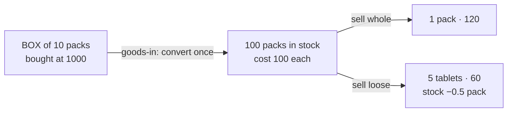
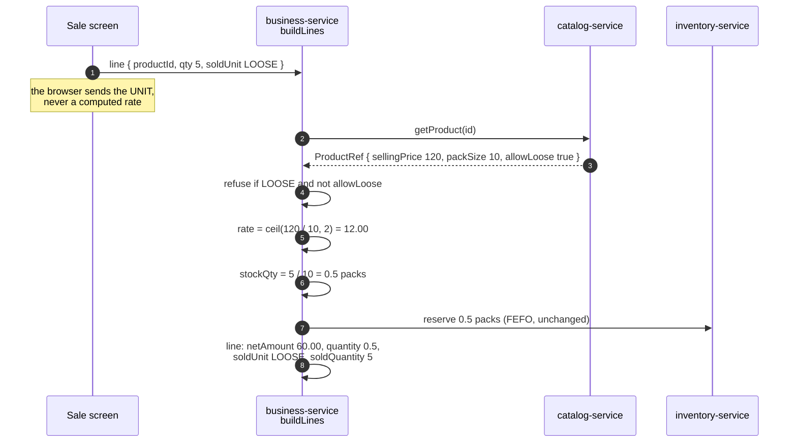

# Selling by the pack and by the piece

**Status: DESIGN — awaiting confirmation. No code written.**
**Scope:** every vertical on the commerce core — retail/POS, supermarket, pharmacy, hardware, distribution.
**Standards:** `SAAS-BUILD-STANDARDS.md` · `ARCHITECTURE-MULTITENANCY.md` · slice cadence (design → consent →
implement → gate).

---

## 1. The problem

> *A pack of Panadol has 10 tablets and a box has 10 packs. We buy by the box at 100. A customer asks for 5
> tablets. Working the price out at the counter is slow.*

The cashier is doing arithmetic a computer should do, **with a queue watching**. Two things fail together: the
sale is slow, and the price is whatever that cashier calculated — so the same five tablets cost different
amounts on different shifts, and nobody can audit it afterwards.

**It is not a pharmacy problem.** It appears wherever goods are bought in a larger unit than they are sold in:

| Trade | Bought as | Sold as | Ratio |
|---|---|---|---|
| Pharmacy | box of 10 packs | pack, or loose tablets | 1 : 10 : 100 |
| Supermarket | crate of 24 bottles | single bottle | 1 : 24 |
| Hardware | box of 100 screws | by the piece | 1 : 100 |
| Fabric, cable, rope | roll of 50 m | by the metre | 1 : 50 |
| Poultry | tray of 30 eggs | dozen, or single | 1 : 30 |
| Stationery | ream of 500 sheets | by the sheet | 1 : 500 |
| Cigarettes | carton of 10 | single pack | 1 : 10 |

Every row is **one number**: how many sellable pieces are in the unit the shop prices. That is the entire
model, and §4 explains why resisting anything larger is the design rather than a shortcut.

## 2. What exists today — verified, not assumed

| Fact | State | Consequence |
|---|---|---|
| `Product.unit` | **free text** — "pcs", "box" | nothing computes with it; a shop can type "box" and no code knows it means ten |
| pack size anywhere | **none** in any service | the feature has no foundation to build on, and no legacy to unpick |
| `StockEntry.quantity` | **`Float`** | fractional stock is already representable |
| `Sell.quantity` | **`Float`** | so is a fractional sale line |
| `Purchase.quantity` | **`Float`** | and a fractional receipt |
| `Product.sellingPrice` | one price per product | one price is all this design needs |
| `Product.lastPurchaseRate` | stamped at purchase (slice 107) | cost per selling unit already exists |
| `ProductRef` (contract) | carries `unit`, `sellingPrice`, `taxRate`, `rxRequired` | the seam the sale already prices from |
| **`SagaSellService.buildLines`** | **prices SERVER-SIDE** from `ProductRef`; a browser rate is an *override*, margin-checked | ⚠ the loose rate must be derived here, not in JavaScript |

| `Sell.sellRate/netAmount/totalAmount/costPrice` | **already `BigDecimal`** | money is not `Float`; only *quantity* is |
| `sellLineMath` (browser + server) | **`total = quantity × rate`** | ⚠ an invariant this design must not break — see §6 |
| `ReservationService` FEFO | **already splits one line across batches** (`remaining` loop, one `ReservationPick` per batch, `EPS` guard) | fractional lines spanning batches need no new mechanism |
| `assertMarginPolicy` | compares **money**: `Σ netAmount` vs `Σ costPrice × quantity` | it does **not** compare rates |

**The last row is the load-bearing one.** The browser may propose a rate, but the server prices the line and
`assertMarginPolicy` judges it. If the loose rate were computed in JavaScript and posted as an override, every
loose sale would arrive looking like a cashier discounting below catalog — tripping the margin guard on the
shop's most ordinary transaction. The division belongs where the price already comes from.

## 3. The model

### 3.1 Three fields on the product, one of them optional

```
Product
  unit        "pack"     what a PRICE refers to — unchanged in meaning
  packSize    10         NEW · pieces in one unit. null or 1 = not divisible
  looseUnit       "tablet"   NEW · what one piece is called, singular
  looseUnitPlural "tablets"  NEW · and plural — see below
  allowLoose  true       NEW · may this be broken open at all?
  defaultSellUnit PACK   NEW · which unit the line starts in — see §3.3(4)
```

⚠ **Two words, not one, because "5 tablet" is wrong in every language this platform ships in.** The receipt
reads `soldQuantity + " " + (soldQuantity == 1 ? looseUnit : looseUnitPlural)`. These are **tenant data, not
i18n keys** — a shop names its own units, and Urdu, Arabic and Hindi tenants all pluralise differently. The
platform's 6 bundles translate the *labels* around them ("Loose", "per pack"); the unit itself is the shop's
word.

⚠ **`allowLoose` and `packSize` are pricing controls and must be audited.** Who widened a pack, who allowed a
sealed course to be split, and when — the standards require it of anything that changes what a customer is
charged, and `AuditService` already records this class of change for deletes, voids and configuration.

`allowLoose` is separate from `packSize` on purpose: a pharmacy knows an antibiotic course has 10 tablets
(`packSize = 10`, useful for reporting and stock counts) and must still refuse to split it (`allowLoose =
false`). One field could not say both.

### 3.2 The box is a purchase concern, not a selling one

The customer's example has three levels — box → pack → tablet — and **only two matter at the counter.** Once a
box is opened the shop has ten packs; nobody sells "a box" as such.



At purchase the buyer enters *10 boxes @ 1000* and picks the unit bought in; stock rises by **100 packs** and
`lastPurchaseRate` records **100**. Modelling the box as a third *sellable* level would add a conversion
nobody performs at a till, and every extra level is another place for the arithmetic to disagree with itself.

### 3.3 The counter — one field, three ways in

**The design decision is that `soldUnit` is a property of the LINE, and how it gets set is a matter of which
hand the cashier has free.** A till is used three ways — keyboard, touch, scanner — and a single control
optimised for one of them is slow in the other two. So there is one model and three inputs, each costing
nothing to the others.

#### The line, as the cashier sees it

```
  Panadol 500mg          [ 5 t ]  ( pack │ tablet )      12.00        60.00
                            ▲
  ┌──────────────────────────────────────────────────┐
  │  5 tablets · 12.00 each · uses 0.5 of a pack     │   ← live, before committing
  └──────────────────────────────────────────────────┘
```

**The hint line is the feature.** The cashier never computes and always sees exactly what they are about to
commit — quantity, unit price, and what it costs the shelf. Everything below is just a fast way to reach it.

#### 1 · Keyboard — a suffix, zero clicks

The till is keyboard-first (`pos-keyboard.js`, Enter chain: item → qty → price → discount → commit), and the
cashier is **already in the quantity box** when the unit question arises. So the box takes the answer:

| Typed | Means |
|---|---|
| `5` | 5 packs — today's behaviour, unchanged |
| `5L` | 5 **loose** — one constant marker, whatever the unit is called |

**⚠ `L` is a constant, NOT the first letter of `looseUnit`.** An earlier draft used the unit's own initial
(`5t` for tablets), which breaks three ways: a shop with both *tablet* and *teaspoon* has two `t`; a tenant
running in Urdu or Arabic has no Latin initial at all; and a product code beginning with the same letter makes
`5t*CODE` ambiguous. One reserved key has none of those problems, and the screen still says **tablets** —
what the cashier types and what they read are allowed to differ, and here they must.

**Cost: one keystroke, no mouse, nothing per-product to learn.** Enter still commits, so the line stays a
single unbroken run of typing. This is the path a busy counter actually uses.

#### 2 · Touch — a segmented toggle

Always visible on a line whose product allows loose, never present otherwise. **One tap.** This is the
discoverable path — it is how a cashier learns the feature exists, after which they use the suffix.

#### 3 · Scanner — the grammar that already exists

The scan box already parses `12*CODE` as "twelve of this". The same grammar extends without inventing a
second one:

| Scanned / typed | Means |
|---|---|
| `CODE` | 1 pack |
| `12*CODE` | 12 packs — unchanged |
| `5L*CODE` | 5 loose pieces |

⚠ **A scanned manufacturer barcode always means the PACK.** A GTIN/EAN is printed on the pack by whoever made
it and cannot mean "one tablet" — treating a scan as loose because the shop happens to sell loose would
mis-price the commonest transaction there is.

A shop that wants a one-scan loose sale prints **its own sticker**, and those are resolved by a small mapping
rather than by guessing:

```
product_barcode
  barcode      "LP-4471"     the sticker the shop prints
  product_id   88
  sold_unit    LOOSE         what this code MEANS
  quantity     1             and how many
```

One table, no grammar, and it also gives shops a place to record the manufacturer codes they already scan.
**Deferred to U3** — the typed form works from day one.

#### 4 · The keystroke that disappears — `defaultSellUnit`

A pharmacy that sells Panadol loose nine times out of ten should not type `t` nine times out of ten.
`Product.defaultSellUnit` (`PACK` | `LOOSE`, default `PACK`) makes the common case free, and the toggle then
switches to the *exception*.

**This is the single biggest time saving in the design**, and it costs one column. It is per product rather
than per tenant because the same shop sells strips loose and sealed bottles whole.

⚠ **A default this powerful must never be invisible.** A cashier used to typing `5` for five packs would
otherwise sell half a pack without noticing anything change. So **whenever the line is not in `PACK`, the
quantity box carries the unit inside it**:

```
   [ 5 tablets ]        not        [ 5 ]
```

The chip is not decoration — it is the whole safeguard. A silent default that changes what a familiar keystroke
means is worse than no default at all, and the same reasoning already governs `pos.installment.enabled` and
the rest: *a default is not a decision, and a decision must be visible.*

### 3.4 Three alternatives considered and rejected

| Alternative | Why not |
|---|---|
| **Two picker rows** — "Panadol (pack)" and "Panadol (tablet)" as separate entries | Zero clicks, and genuinely tempting. But it **doubles the picker** for every splittable product, and two near-identical rows one line apart is a mis-pick waiting to happen — on a screen where picking the wrong row means the wrong price *and* the wrong stock movement. The picker is also the shared cached projection (PERF-8); doubling it taxes every other screen that reads it. |
| **A separate "loose quantity" column** on every line | Zero extra actions, but permanently widens the line-entry row for a case most shops never use, and puts two quantity boxes where one is right — the sort of ambiguity that produces the wrong number under pressure. |
| **Infer from the number** — a fractional quantity means loose | Silent and ambiguous. `0.5` could mean half a pack *or* five tablets, and the system would guess. A till must never guess about money. |

## 4. Why one level, forever

The obvious "complete" answer is a unit-of-measure engine: a `uom` table, conversion factors, arbitrary
nesting, grams → kilograms → tonnes. **That is the wrong system for this problem, and it does not become right
later.**

| One number (this design) | A UoM engine |
|---|---|
| `packSize = 10` | a conversion graph per product |
| price ÷ packSize | a resolver walking the graph |
| stock in one unit | stock in a unit that must be normalised on every read |
| every row in §1's table | every row in §1's table, plus units nobody sells in |

Every row in §1 fits one level. A UoM engine buys generality no shop in these verticals has asked for, and
charges for it on **every read of every product**, forever. When one is genuinely needed — a business selling
by weight where the *stock itself* is continuous, not a count of pieces — that is a different capability with a
different data model, and it should be built as one rather than grown by accident from this.

**The escape hatch is deliberate and small:** because `packSize` is a plain number on the product, a later
weight-based design can ignore it entirely rather than having to unpick a graph. *A design that adds no
abstraction cannot trap a later one.*

## 5. The pricing path



**The browser sends the unit, not the price.** That single choice keeps the margin policy, tax, COGS and the
GL working exactly as they do today, and makes a tampered client unable to invent a loose rate.

## 6. What reaches the database

### ⚠ 6.1 The line arithmetic must still hold — the correction that matters most

An earlier draft of this design stored `quantity = 0.5` **with** `sellRate = 12.00`. That is wrong, and the
code proves it: `sellLineMath` computes `total = quantity × rate`, so the line would have totalled

```
0.5 × 12.00 = 6.00        ← not 60.00
```

**A tenfold accounting variance in every report, invoice, tax return and audit export that sums
`quantity × rate`** — which is all of them, because that identity is what a line *means*. The design must obey
the invariant rather than introduce a second convention beside it.

### 6.2 The corrected line

| Column | "5 tablets" | Kind | Why |
|---|---|---|---|
| `Sell.quantity` | **0.5** | stock | selling units — what leaves the shelf |
| `Sell.sellRate` | **120.00** | money | **per SELLING unit.** `0.5 × 120 = 60.00` ✓ |
| `Sell.netAmount` | **60.00** | money | unchanged in kind |
| `Sell.soldUnit` | `LOOSE` | record | NEW · what the customer bought |
| `Sell.soldQuantity` | **5** | record | NEW · so the receipt says "5 tablets" |
| `Sell.soldRate` | **12.00** | display | NEW · per loose piece, for the receipt |
| `Sell.packSizeSnapshot` | **10** | record | NEW · see §6.3 |

**`soldQuantity`, `soldRate` and `packSizeSnapshot` are a faithful record of the transaction as the customer
experienced it. `quantity` and `sellRate` are the money and stock, and they keep the identity every other
part of the system relies on.** Neither is derived from the other at read time; both are written once.

### 6.3 ⚠ `packSize` must be FROZEN on the line

Storing `quantity = 0.5` and `soldQuantity = 5` only agree while `packSize = 10`. Edit the product to 12
tomorrow and that historical 0.5 silently becomes *six* tablets — the receipt, the return and every report
re-interpreting a completed sale.

`packSizeSnapshot` is stamped at write, joining the fields this codebase already snapshots for exactly this
reason: `Sell.costPrice`, `order_items.product_name`, `CustomerHistory.issuedTotal`. **Stamp at write, never
derive on read.**

### 6.4 The margin guard needs no special case — because of 6.2

`assertMarginPolicy` compares **money against money**: `Σ netAmount` versus `Σ costPrice × quantity`. With the
corrected line that is `60.00` against `100.00 × 0.5 = 50.00` — a margin of +10, correct and requiring no
normalisation.

*A review of this design predicted the guard would compare `12` against `100` and refuse every loose sale.
That would have been true of the earlier draft's schema; it is not true of the code, which never compares
rates. **Fixing the invariant in 6.2 fixes the margin guard for free** — the two are the same mistake seen
from two ends.*

### 6.5 Fractional stock and float drift

`StockEntry.quantity` is `Float`, and repeated fractional movements can leave a residue like
`0.00000004 packs` that no stock count will ever reconcile to zero.

Already mitigated where it matters most: the FEFO loop compares `remaining <= EPS` rather than `== 0`, so
allocation terminates cleanly. Two rules make the rest safe:

* **All derivation is `BigDecimal`**, scale 4 for quantity and 2 for money. `Float` is what the column stores,
  never what the arithmetic uses.
* **Stock guards compare with a tolerance**, never `==`. A shop is out of stock at `< EPS`, not at exactly 0.

**Stock always moves in the selling unit.** A shop counting its shelf counts packs, and an on-hand column
mixing packs with tablets would be unreadable. Selling 5 tablets decrements **0.5 packs** — representable
today, no migration to `StockEntry` or `Reservation`.

⚠ **Nothing downstream learns a new concept.** Tax, COGS, GL, credit, aging, statements and installment plans
see a line with a quantity and a rate, as now. **No new `PostingEventRequest` field — and a design that adds no
field cannot reproduce the 4200 defect**, where a new posting field needed five copy points and silently
vanished from every tenant's books for months.

## 7. The loose rate

```
looseRate = ceilToCents( sellingPrice × (1 + looseMarkupPct/100) ÷ packSize )
```

computed in **`BigDecimal`**, never `Float` — `120/3` in binary floating point is `39.999999…`, and a `ceil`
applied to that is a defect waiting for the right price.

### 7.1 The markup is day one, not an open question

Every trade in §1 prices loose **above** the pack rate, because breaking a pack destroys the ability to sell it
sealed. A first release without it is a feature shops decline to switch on — so `looseMarkupPct` ships in U2
with a **default of 0**, which leaves behaviour identical for anyone who does not want it. One term in one
expression.

### 7.2 Which base — stated, because it is guessable three ways

The loose rate derives from the **pre-tax, pre-discount `sellingPrice`**. Tax and discount then apply to the
line exactly as they do today.

That ordering is the only one that keeps a mixed basket coherent: 1 pack + 5 loose of the same product under a
10% line discount must discount both by 10% of their own line, and a rate derived *after* discount would
discount the loose part twice. If `sellingPrice` is tax-inclusive for a tenant, the division happens on the
same inclusive figure the pack uses — so the effective tax rate is identical for pack and loose, which is what
an auditor will check.

**Derived, never stored.** A second stored price is a second thing to maintain, and the day it drifts the shop
sells tablets at last year's rate while the pack is current. The screen shows the derived figure *before* the
line is added, so it is visible rather than hidden.

**Rounded UP, and it must be.** 100 ÷ 3 = 33.33; three sold at that rate return 99.99 for goods priced 100.
Rounding down loses money on **every broken pack**, invisibly, on the fastest-moving items in the shop.

⚠ **This is the INST-5a lesson in a new costume.** There, a total derived by rounding a proportion left a
customer two paisa in credit *while the trial balance balanced*. Here the whole genuinely **cannot** be
reconstructed from the parts — breaking a pack destroys value — so the rounding is resolved in the shop's
favour and stated openly, rather than pretending the arithmetic is exact. The rate stays editable on the line,
so a shop that wants to absorb the paisa can.

## 8. Refusals and edges

| Situation | Behaviour | Why |
|---|---|---|
| `allowLoose = false` | no toggle; a LOOSE line is refused server-side | sealed goods; the UI is convenience, the server is the control |
| `packSize` null or 1 | no toggle | the overwhelming majority of products, untouched |
| loose qty ≥ packSize | accepted, and **suggests the pack** ("10 tablets = 1 pack") | a cashier ringing 10 loose should be told, not corrected silently |
| more loose than stock | refused by the existing check, in packs | 5 tablets against 0.3 packs is short |
| return of loose | credit note for the loose value; **0.5 packs back** | the existing return path, in selling units |
| the opened pack | stays as **0.5 of a pack** in stock | see below |

**The remainder, stated plainly:** the system knows half a pack of *value* remains. It does **not** track the
opened pack as a physical object. If the shop discards the remainder that is wastage, recorded through the
stock-adjustment tool that already exists. Pretending otherwise would be inventing a fact nobody observed —
the same reason a short delivery is recorded where it is discovered rather than assumed at dispatch.

### 8.1 ⚠ But the stock COUNT screen must speak the counter's language

The decision above is right and its presentation is not. A shelf holding ten sealed packs and one opened strip
of five reads on screen as **10.5 packs**. The person counting writes **10**, and the system reports a variance
that is not a variance — every count, on every splittable line, until they stop trusting the report.

So the count and adjustment screens render the same number in both units:

```
    On hand:  10.5 packs        →        10 packs + 5 tablets
    Count:    [ 10 ] packs  +  [ 5 ] tablets     → 10.5
```

**No new concept and no new column** — it is the `Float` that is already there, shown the way a human counts
and accepted the way a human counts. Entering `10` and `5` removes the mental arithmetic from the audit, which
is where a miscount is most expensive.

### 8.2 A loose return goes back to the batch it came from

Returning 2 tablets restores **0.2 packs to the batch the sale drew them from**, not to whatever batch is
newest. The sale already records its `ReservationPick` rows, so the batch is known — and returning short-dated
goods into a long-dated batch would quietly reset an expiry date that the goods do not have.

## 9. Configuration

| Key | Default | Meaning |
|---|---|---|
| `pos.sale.looseSellingEnabled` | `false` | show the unit toggle at all — off means every screen is unchanged |
| `pos.sale.looseRounding` | `UP` | `UP` \| `NEAREST`; `UP` never loses the shop money |
| `pos.sale.looseMarkupPct` | `0` | uplift for breaking a pack. **Ships in U2** — 0 leaves behaviour identical, and every trade in §1 prices loose above the pack rate |

Per product, `allowLoose` decides whether *that item* may be broken. A default is not a decision: the feature
is off until a shop asks for it.

## 10. What this touches

| Layer | Change | Risk |
|---|---|---|
| `catalog-service` | 4 columns + Flyway; product form; `ProductRef` gains them | low — additive |
| `commerce-contracts` | `packSize`, `looseUnit`, `allowLoose`, `defaultSellUnit` on `ProductRef` | low — additive, but **rebuild dependents** |
| `business-service` | `soldUnit`/`soldQuantity` on `Sell` + Flyway; conversion in `buildLines` | **the money path — highest** |
| Purchase | unit choice on the line (box → packs at goods-in) | medium |
| Sale screen | toggle, derived-rate preview, receipt wording | medium |
| Settings | 3 keys | low |
| **Untouched** | inventory-service, finance-service, GL contract, saga, credit, installments, aging | — |

## 11. Phasing — each gated before the next

| Slice | Scope | Gate |
|---|---|---|
| **U1** | catalog fields + contract + product form | a product stores `packSize 10`, `looseUnit "tablet"`; `ProductRef` carries them |
| **U2** | `buildLines` conversion + `Sell` columns + server refusals | ⭐ 5 tablets of a 120/10 pack = **60.00** and **0.5** stock; `allowLoose=false` refused |
| **U3** | the counter toggle + derived-rate preview | the cashier types 5, taps tablet, sees 12.00 before committing |
| **U4** | receipt + reports read `soldUnit` | the receipt says "5 tablets"; the stock ledger says 0.5 packs |
| **U5** | purchase in boxes | 10 boxes @ 1000 → 100 packs, cost 100 |

U1–U4 deliver the counter. **U5 is separable** and answers open question 1.

### ⚠ Should U5 come FIRST?

A review argued yes: if a buyer receives *10 boxes @ 1000* and keys it as *10 @ 1000*, `lastPurchaseRate`
records 1000 per pack instead of 100 — a tenfold cost error, and COGS and the margin guard both read that
figure.

**That risk is real and it is not new.** It exists today, for every product, with no loose selling anywhere
near it — a buyer has always had to convert in their head. This design does not create it and U5 does not gate
U2.

But it does make it *matter more*: a tenfold cost error is invisible while the margin is large, and loose
selling puts thin per-piece margins next to it where it starts refusing sales. **Recommendation: U1 → U2 → U5
→ U3 → U4** — take the counter's arithmetic first because that is the customer's actual complaint, then fix
receiving before the screen is put in front of cashiers. If U5 slips, U2 must be gated on products whose
`packSize` and cost were entered by hand and verified.

## 12. The gate

Carrying cases, in the order they matter:

1. ⭐ **the arithmetic** — a 120 pack of 10 sold as 5 loose prices at **60.00** and decrements **0.5 packs**;
2. ⭐ **rounding up is proved** — a 100 pack of 3 sold as 3 loose totals **100.02**, never 99.99, so a broken
   pack never costs the shop money;
3. **one sale, two true statements** — the receipt says "5 tablets", the stock ledger says 0.5 packs;
4. **the refusal** — `allowLoose = false` refuses a LOOSE line **server-side**, with a positive control that a
   product with it set succeeds (an absence assertion is not evidence until the mechanism is shown live);
5. **short stock** — 5 loose against 0.3 packs is refused;
6. **the negative control** — a product with no `packSize` shows no toggle and behaves exactly as today;
7. **the books** — the **trial balance balances** after a mixed sale of packs and loose from one product, and
   the customer owes the sum of the lines. *Gate the trial balance, not the invoice.*
8. ⭐ **the line identity** — for every case above, `netAmount == quantity × sellRate` to the cent. This is the
   invariant an earlier draft broke, and it is the one every report, tax return and audit export depends on;
9. ⭐ **history does not move** — sell 5 tablets at `packSize 10`, then **edit the product to 12**. The old
   line must still read *5 tablets · 0.5 packs · 60.00*, never 0.41 packs. This is what `packSizeSnapshot`
   exists for, and nothing else proves it;
10. **the margin guard passes** — a loose line at a healthy margin does **not** trip `assertMarginPolicy`, with
    a positive control that a genuinely loss-making loose line still does;
11. **FEFO across batches** — 5 tablets against 0.3 packs in a short-dated batch and 0.7 in another draws from
    the **short-dated one first** and splits the remainder, leaving no unsellable residue;
12. **the return** — 2 tablets back restores **0.2 packs to the batch they came from**, not to the newest;
13. **the discount** — a mixed cart of 1 pack + 5 loose under a 10% line discount discounts each line by 10% of
    its own value, and the loose part is not discounted twice;
14. **the count screen** — 10.5 packs on hand renders as **10 packs + 5 tablets**, and entering those two
    numbers produces 10.5;
15. **the visible default** — a product with `defaultSellUnit = LOOSE` shows the unit **inside the quantity
    box**, so a cashier typing 5 out of habit cannot sell half a pack unawares.

---

## 12b. ⚠ Measured against how the major systems do this — and one thing this design got wrong

Asked whether this is "best forever", the honest answer is **no design earns that**, and the useful answer is
to say where this one agrees with established practice, where it deliberately departs, and where it departed
by accident.

### What every major system does

SAP (base UoM + `MARM` conversions), Odoo (`uom.uom` with a reference unit per category), Dynamics 365 BC
(`Quantity`, `Quantity (Base)` and `Qty. per Unit of Measure` on the line) and NetSuite all share **two**
patterns:

| Pattern | This design |
|---|---|
| The conversion factor is **snapshotted on the transaction line** — BC calls it `Qty. per Unit of Measure` | ✅ **converged independently** — that is `packSizeSnapshot` (§6.3), arrived at from the "stamp at write" rule rather than by copying |
| Stock is held in a **BASE (smallest) unit**, and every other unit converts upward | ❌ **this design holds stock in the SELLING unit and uses fractions** |

The first is reassuring: two routes to the same answer usually means the answer is right.
**The second is a genuine divergence from every one of them, and it deserved more than the paragraph it got.**

### Why the industry keeps stock in the smallest unit

Because **fractions of a pack do not divide cleanly, and pieces always do.**

```
pack of 3, sell 1 loose
   selling-unit storage:  0.3333… packs   ← never terminates, in Float OR Decimal
   base-unit storage:     2 pieces        ← exact, forever
```

A pack of 10 is kind to decimals. A pack of **3, 6, 7, 12 or 24** is not — and §1's own table has crates of
24, trays of 30 and boxes of 100. Sell the remaining two pieces of that pack and the stock column holds
`0.0001` rather than zero: **stock that never reconciles**, exactly the failure the second review predicted,
and §6.5's `EPS` tolerance only hides it rather than removing it.

Base units make the whole class of problem vanish. No float drift, no epsilon comparisons, no ghost residue,
and a count screen renders `95` as *9 packs + 5 tablets* by division rather than by presentation trickery
(§8.1 becomes unnecessary rather than merely handled).

### The three honest options

| | Stock held in | Precision | Blast radius | Verdict |
|---|---|---|---|---|
| **A** | `Float` packs — *as drafted* | drifts on any pack size that is not 2ⁿ·5ᵐ | none | **withdrawn** — it was the cheap answer, not the right one |
| **B** | `BigDecimal(19,4)` packs | exact for /2, /5, /10; **still drifts for /3, /6, /7** | one column type + arithmetic; ~25 call sites | pragmatic, and still wrong for a third of §1's table |
| **C** | **integer base units** (pieces) — *what SAP, Odoo, BC and NetSuite do* | **exact, always** | `stock_entries`, `stock_levels`, thresholds, the saga, purchase, every stock read | correct, and the largest |

### The measurement that decides it

```
stock_entries              2,559 rows
stock_levels               2,075 rows
non-integer quantities         0        ← nothing fractional exists yet
```

**There is no fractional stock anywhere in the system today**, so C's migration is
`quantity × packSize` where `packSize > 1`, and an identity for everything else — which is currently *every*
product, because the column does not exist yet. **This is the cheapest moment this change will ever have**, and
it gets more expensive with every loose sale made under A or B.

### Recommendation

**Take C, and take it in U1 before anything sells loose.** Not because the standard says so, but because the
arithmetic is exact and stays exact, and because the alternative is a residue that grows quietly in the one
number a shopkeeper checks by hand.

⚠ **It is a bigger slice than this document was scoped for** — it changes inventory-service's fundamental
unit, and every consumer of a stock quantity has to be re-read rather than assumed. That is a scope decision,
not a technical one, and it belongs to the owner. If the answer is B, this design still works and §6.5's
tolerance rules become load-bearing rather than belt-and-braces.

*Recorded rather than quietly rewritten: the draft above is A, and knowing which option was chosen and why
matters more than a document that looks like it was right from the start.*

## 13. Open questions

Two of the original four are now **closed by review** and recorded here rather than deleted, so the reasoning
survives:

| # | Question | Resolution |
|---|---|---|
| 1 | Purchase in boxes (U5) | **Build it, sequenced U2 → U5 → U3.** The cost error it prevents is not new, but loose selling puts thin margins beside it. See §11. |
| 2 | Should loose carry a markup? | **Yes, in U2, defaulting to 0.** Every trade in §1 prices loose higher; without it shops decline the feature. |
| 3 | `NEAREST` rounding | **`UP` only at first.** It is the option that never costs the shop money; `NEAREST` can follow if a tenant asks. |
| 4 | Loose in the ORDER path | **Out of scope**, but `soldUnit` on the contract must be **optional and defaulted**, so order pipelines that never send it keep working unchanged. |

### Still open — for the shop, not for me

5. **Is `looseMarkupPct` per tenant, or per product?** §9 makes it per tenant. A pharmacy may want 10% on
   tablets and nothing on syrup, which would need it per product. One column either way; the question is
   whether any shop actually prices that finely.
6. **Should an opened pack expire sooner?** A broken blister may have a shorter practical life than its printed
   date. The system tracks value, not the physical strip (§8), so it cannot answer this today — and inventing
   a date nobody printed would be worse than not having one.
