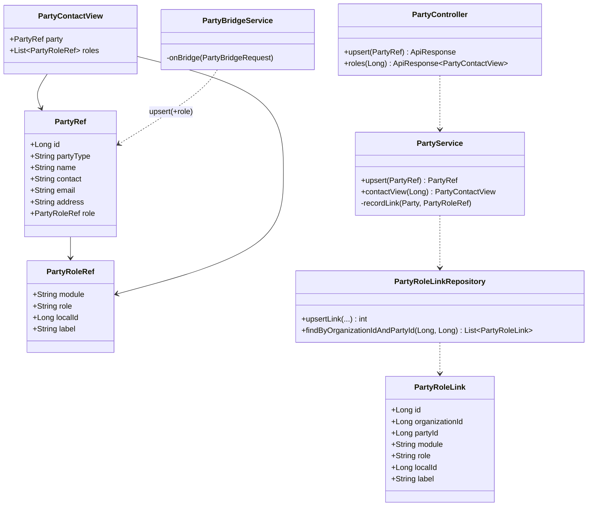

# Cross-module contact view (party roles) — design

**Status:** DESIGN — awaiting sign-off. Follows P3 (**all FIVE module bridges are now live** — business
Customer/Vender, education Student, welfare Donator, pharmacy Rx-patient and marketplace shopper; this line
said "four" before the marketplace bridge landed). This is **P4**, the
payoff slice of [`party-contact-master-design.md`](party-contact-master-design.md): the bridges made one person ONE
`partyId`; this makes that visible.

---

## 1. Document — what and why

Today a party is deduped but **invisible**: `Customer 758`, `Student 41`, `Donator 9` and `Prescription 22` may all
carry `party_id = 1001`, and nothing in the product ever says so. The owner value is the question every multi-module
tenant asks — *"who is this person to us, across everything we run?"* — answered in one screen:

> **Firdos · 03001234567** — POS customer (AR ₨4,500 outstanding) · pharmacy patient (3 prescriptions) · welfare donor.

**Non-goals (explicit).** The view shows **which modules know this party and their local id/label** — it does NOT
become a cross-module data aggregator. Balances, fees, clinical detail stay owned by their module; a role row may carry
a short display `label` only. Modules still do not READ identity from party-service (Phase N, deferred, YAGNI).

**Architecture decision (signed off this session): denormalized role index in party-service**, written by the bridge
that already runs — *not* a synchronous fan-out across four services (per [`SAAS-BUILD-STANDARDS.md`](SAAS-BUILD-STANDARDS.md)
and the microservice standard: no read-time fan-out on a user-facing path).

| | Chosen: role index | Rejected: live fan-out |
|---|---|---|
| Read cost | 1 query, 1 service | 4 HTTP calls, latency = slowest module |
| Failure modes | none at read time | 4 (partial results / timeouts) |
| New endpoints | 1 read + 1 backfill | 4 `byPartyId` endpoints |
| Write cost | **zero extra calls** — 4 nullable fields on the existing `upsert` | none |
| Trade-off | eventually consistent; pre-P4 parties need a one-time backfill | always fresh |

**Coverage note:** the contact view applies to the four **party-bearing** modules — business (CUSTOMER + VENDOR),
education (STUDENT), welfare (DONOR), pharmacy (PATIENT). **Agriculture has no party-bearing entity at all** (income/
expense reference a *land*, not a person), so it is out of scope here rather than "pending" — it would first need a
land-owner/labour party, which is not a registered requirement.

---

## 2. Design

### 2.1 Data model — `party_role_link` (party-service, Flyway **V2**)

One row per *(local record, role)*. Owned by party-service; holds no domain data.

| Column | Type | Notes |
|---|---|---|
| `id` | BIGINT PK AI | |
| `organization_id` | BIGINT NOT NULL | tenancy; every read is org-scoped |
| `party_id` | BIGINT NOT NULL | FK-by-convention to `party.id` (no hard FK — matches existing style) |
| `module` | VARCHAR(24) NOT NULL | `business` \| `education` \| `welfare` \| `pharma` |
| `role` | VARCHAR(20) NOT NULL | `CUSTOMER` \| `VENDOR` \| `STUDENT` \| `DONOR` \| `PATIENT` |
| `local_id` | BIGINT NOT NULL | the module's own primary key |
| `label` | VARCHAR(160) NULL | display hint only (e.g. `"Firdos"`, `"Class 5-B"`) — never a money/clinical field |
| `created_at` / `updated_at` | DATETIME | |

- `UNIQUE KEY uq_role_link (party_id, module, role, local_id)` — makes the write **idempotent**, which the bridge
  needs: it is retried by design (welfare's `modelMapper` edit path re-stamps, breaker cooldowns re-fire).
- `KEY idx_role_link_org_party (organization_id, party_id)` — the read path ([[performance]] standing priority: the
  view is one index hit).

### 2.2 Write path — piggyback the existing bridge (no new call)

`PartyRef` (commerce-contracts) gains **one optional nested field**; `null` = identity-only upsert, so the P0
`party/party-master.cy.js` spec and any other caller are unaffected:

```java
// commerce-contracts
public class PartyRoleRef { String module; String role; Long localId; String label; }
public class PartyRef { ... existing identity fields ...; PartyRoleRef role; }   // NEW, nullable
```

`PartyService.upsert` records the link **in the same transaction** as the party when `role != null`. Each module's
`PartyBridgeService.onBridge` (already `AFTER_COMMIT` + `REQUIRES_NEW` + 2s timeout + circuit breaker) fills it in:

| Module | `module` | `role` | `localId` | `label` |
|---|---|---|---|---|
| business | `business` | `CUSTOMER` / `VENDOR` | customerId / venderId | name |
| education | `education` | `STUDENT` | studentId | name |
| welfare | `welfare` | `DONOR` | donatorId | name |
| pharma | `pharma` | `PATIENT` | prescriptionId | patientName |

The `partyId != null` skip-guard stays: the link is written exactly once per local record, on its first bridge. **The
sale/registration hot path still pays zero.** Party-service remains a soft dependency — a failed link degrades the
view, never the domain write.

### 2.3 Backfill (why it's required, not optional)

Every record bridged before P4 already has `party_id`, so the guard means it will **never bridge again** → no link.
One owner-gated, idempotent, batched endpoint per module:

`POST /api/<module>/party-links/backfill?limit=200&afterId=<cursor>` → `{ scanned, linked, lastId, remaining }`

Scans local rows `WHERE party_id IS NOT NULL` after the cursor, sends them as **ONE bulk call** (`POST
/api/party/parties/roles/bulk`) — a per-row call would make backfilling a large customer table N round trips — and
returns `lastId` + `remaining` so it can be called until 0. Idempotent (unique key absorbs repeats), off the hot path.

Two implementation constraints worth knowing:
- **Batch cap 200** (`MAX_BATCH`). The backfill reuses the hot-path party client, which carries the 2s read timeout
  added in P3 hardening; a batch must finish well inside it. Resume with the cursor rather than raising the cap.
- **Business takes two cursors** (`afterCustomerId`, `afterVenderId`) — customers and vendors have independent id
  spaces, so one shared cursor would silently skip rows in whichever table has the higher ids.

### 2.4 Read contract (party-service)

```
GET  /api/party/parties/{id}/roles       → PartyContactViewDTO { party, roles[] }   (200 / 404 / 403)
POST /api/party/parties/{id}/roles       → record one link      (idempotent, 404 for a foreign party)
POST /api/party/parties/roles/bulk       → int linked           (the backfill path; each item carries its partyId)
```

Raw DTOs, not `ApiResponse` — party-service's existing endpoints return bare DTOs and the P0 spec asserts on that
shape; wrapping only this one would be an inconsistency for no gain.

- **Org-scoped + anti-IDOR:** the party must belong to `CurrentUser.organizationId()`; otherwise **404** (not 403 — do
  not confirm existence across tenants).
- **Privilege-gated:** `ADMIN_PRIVILEGE` or `SUPER_PRIVILEGE`. Deliberate: *the mere existence of a pharmacy PATIENT
  role is sensitive* — a POS cashier must not learn that a customer is a patient. This is why role rows carry a label
  and nothing more.
- Roles sorted by `module, role` for a stable UI.

Monolith proxy (P4b): `GET /getPartyContact?partyId=` via `BusinessRestClient` → gateway → party-service.

### 2.5 UI contract (P4b, business/POS first)

A **Contact drawer**, not a new page: the customer list gains a "Contact" row action → `#PartyContactDiv` renders
`party` (name/contact/email) + role chips grouped by module, each showing role + label + local id, deep-linking where a
screen exists (customer → customer detail, student/donor → n/a cross-vertical). Empty state: *"Known only in POS."*
Nav/action gated `SUPER_PRIVILEGE` to match the endpoint. New JS lives in `business.js`
(`showPartyContact/loadPartyContact`); if a 3rd consumer appears, extract `party-contact.js` per the DRY rule — not now.

---

## 3. Architecture & UML

### Architecture (flowchart)

```mermaid
flowchart TD
    subgraph Browser
      CL[Customer list<br/>Contact action] --> DR[#PartyContactDiv drawer]
    end
    DR -->|GET /getPartyContact| MON[monolith PartyContactController]
    MON -->|BusinessRestClient| GW[gateway :8765]
    GW -->|/api/party/**| PS[party-service :8096]
    PS --> PSVC[PartyService.contactView]
    PSVC --> PR[(party)]
    PSVC --> PRL[(party_role_link)]

    subgraph Write path — existing AFTER_COMMIT bridges
      BS[business-service] -->|upsert + role| PS
      ES[education-service] -->|upsert + role| PS
      WS[welfare-service] -->|upsert + role| PS
      PH[pharma-service] -->|upsert + role| PS
    end

    BF[["POST /party-links/backfill<br/>(owner, batched, idempotent)"]] --> BS & ES & WS & PH

    classDef db fill:#e8eef7,stroke:#4a6fa5
    class PR,PRL db
```

### Class diagram



### Sequence — write (link recorded) then read (drawer)

```mermaid
sequenceDiagram
    autonumber
    participant U as Owner/Cashier
    participant M as module-service
    participant DB as module DB
    participant P as party-service
    participant PDB as party DB

    U->>M: save Customer / Student / Donator / Rx
    M->>DB: INSERT (domain tx)
    Note over M,DB: tx COMMITS — connection released
    M->>M: AFTER_COMMIT onBridge
    alt already bridged (party_id != null)
      M-->>M: skip (hot path pays zero)
    else circuit open or timeout (>2s)
      M-->>M: skip; link deferred to backfill
    else
      M->>P: POST /upsert {identity, role{module,role,localId,label}}
      P->>PDB: find-or-create party
      P->>PDB: INSERT .. ON DUPLICATE KEY UPDATE party_role_link
      P-->>M: PartyRef{id}
      M->>DB: UPDATE ..SET party_id (targeted)
    end

    U->>P: GET /parties/{id}/roles
    alt party org != caller org
      P-->>U: 404 (no cross-tenant existence leak)
    else lacks ADMIN/SUPER privilege
      P-->>U: 403
    else
      P->>PDB: 1 indexed query (org, party)
      P-->>U: PartyContactView{party, roles[]}
    end
```

---

## 4. Implement

**P4a — index + API + backfill (no UI)** — CODE-COMPLETE 2026-07-26, awaiting the Cypress gate.
- [x] contracts: `PartyRoleRef` (+ `partyId`, used only by the bulk payload); `PartyRef.role` (nullable);
      `PartyClient.link` + `PartyClient.linkBulk`. *(No `PartyClient.roles(id)` — nothing consumes it: modules do not
      read identity from party, and the P4b UI reads through the monolith proxy. Added when a caller exists.)*
- [x] party-service: Flyway **V2** `party_role_link` (unique + index); `PartyRoleLink` entity + repository
      (native `ON DUPLICATE KEY` upsert); `PartyService.recordLink` inside the upsert tx; `contactView` (org-scoped,
      null → 404); `linkBulk` (ONE scoped query per batch, foreign ids skipped); `PartyController`
      `GET /{id}/roles` + both link writes gated `ROLE_OWNER|ADMIN_PRIVILEGE|SUPER_PRIVILEGE`
- [x] 4 bridges: fill `role` on the existing upsert (business ×2 roles, education, welfare, pharma) — no new call,
      hot path unchanged
- [x] 4 backfill endpoints (owner-gated, cursor + `limit`, one bulk call per batch, returns `remaining`)
- [x] Gate written: `cypress/e2e/party/contact-view.cy.js` (6 cases)

**P4b — business/POS panel** — DONE (concurrent session, `522b5265`/`b665eccf`).
- [x] monolith proxy `GET /partyRoles?id=` (`com.web.controller.business.PartyController`), owner/admin-gated on
      top of party-service's own gate (defence in depth); a 404 degrades to "no contact view", not an error
- [x] customer-row "360" action + panel, gated by `window.canViewContact360`
- [x] Gate: `cypress/e2e/business/contact-360.cy.js` (owner sees the role; cashier denied)

**P4c — the other verticals** — CODE-COMPLETE 2026-07-26, awaiting the Cypress gate.
- [x] **Extracted the panel to `/js/common/party-contact.js`** and deleted business.js's copy — four verticals now
      use it, so it lives in one file (DRY). Exposes `openContact360(partyId)` + `contact360Button(partyId)`;
      the button helper holds the gate AND the "only when bridged" rule, so no call site repeats them. Built with
      DOM APIs/`textContent` (no escaping burden, no `escHtml` dependency) and styled like the shared confirm
      dialog. The name is no longer passed in — the panel shows the party's own name, so nothing has to be escaped
      into an `onclick`.
- [x] Loaded globally from `fragments/header :: header-js`; no new proxy needed — `/partyRoles` is monolith-wide,
      not module-scoped (unlike the config screens, which collided on `/getConfig`).
- [x] Row actions: education students, welfare donors, pharmacy prescriptions (all ride in the existing name/
      patient cell, so no dashboard table gains a column). Pharmacy reuses the trade dashboard, which already sets
      the flag; education + welfare templates set `window.canViewContact360` under the same authority expression.
- [x] **Marketplace backfill** — the 5th bridge (P3d, concurrent session) already records its role link, but was
      the only module without a `PartyLinkController`, so pre-index shoppers could never be indexed. Added
      (org-only scope: a storefront account has no owning user).
- [x] Gate: `cypress/e2e/education/contact-360.cy.js` (role indexed → dashboard loads the shared component → panel
      renders identity + Education chip).

Agriculture stays out of scope: no party-bearing entity (§1).

---

## 5. Test

`cypress/e2e/party/contact-view.cy.js` (gateway-direct Bearer, mirroring `party-master.cy.js`):

| # | Case | Expect |
|---|---|---|
| 1 | Create customer + prescription with the SAME phone (one org) | both stamped, same `partyId` |
| 2 | `GET /parties/{id}/roles` | `roles` contains `business/CUSTOMER` **and** `pharma/PATIENT` with correct `localId`s |
| 3 | Re-save the same customer (edit) | still **one** `business/CUSTOMER` row — idempotency holds |
| 4 | Identity-only upsert (no `role`) | succeeds, no link row — back-compat with P0 |
| 5 | Roles of a party in another org | **404** |
| 6 | Roles as a non-admin (cashier) | **403** — the privacy gate |
| 7 | Backfill (cursor placed at our row), run twice | `linked > 0`; still exactly one link after the second run |

The spec creates the POS customer **and** the prescription as `demo.business` — each `demo.*` account provisions its
own org, so cross-module dedup only shows up when ONE tenant exercises two modules (DEMO_ROLE carries full privileges,
so it can). Test 6 uses `cashier.a@myplus.com` (ROLE_BUSINESS_USER).

**Manual check (not automated):** stop party-service → a customer save still succeeds with `party_id` null and the
drawer shows the identity with an empty role list.
