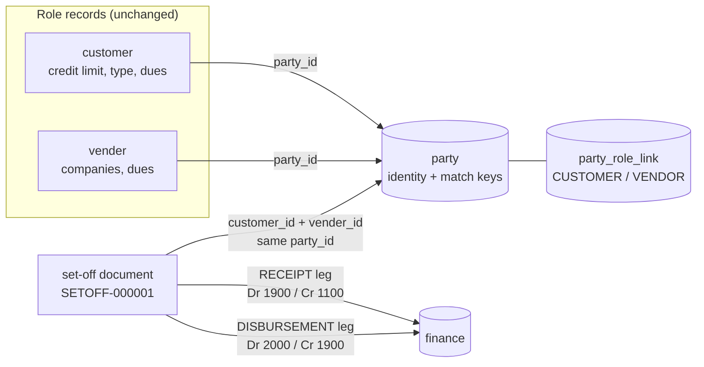

# DR — One business partner, two roles (customer and supplier)

Status: **D1–D7 confirmed (user, 2026-10-02: "go ahead with your recommendations"). DR-1 CODED — awaiting build,
deploy and gate. DR-2…DR-5 designed.**

### DR-1 build record (2026-10-02)
| Part | Where |
|---|---|
| One normaliser (phone last-10 / CNIC-NTN digits / email) | `common-web …/PartyKeys.java` + `PartyKeysTest`; `PlanGuarantorService.normalisePhone` now delegates |
| Match keys on party, backfilled; indexes; raw UNIQUE kept | party-service `V4__party_match_keys.sql`; `Party.contactKey` derived in `@PrePersist/@PreUpdate` (every writer) |
| Match order tax → phone → raw → email (email never against a stronger key) | `PartyMatcher` + `PartyMatcherTest` (8 cases); `PartyService.upsert` |
| Role link MOVES on re-link | `PartyRoleLinkRepository.deleteLinksOnOtherParties`, called in `recordLink` |
| Possible duplicates (owner/admin) | `GET /api/party/parties/duplicates` → monolith `GET /partyDuplicates` → `openPartyDuplicates()` in `party-contact.js`, button `#partyDuplicatesBtn` on Customers |
| Supplier CNIC / NTN (D5) | business-service `V69__vender_cnic_ntn.sql`, `Vender.cnicNtn`, `VenderDTO.cnicNtn`, form field `#venderCnicNtn`, hidden carrier in the grid row for Edit |
| Supplier matched on mobile, else phone; tax id sent | `PartyBridgeService.rebridgeVender` |
| Edit keeps party_id; re-link only when a match key changed | `CustomerController`, `VenderController`, `PartyBridgeService.identityChanged` + `PartyIdentityChangeTest` |
| party-service's first test (D2) | `party-service/src/test/…/FlywayMigrationTest` |
| Gate | `party-dual-role.cy.js` DR1-1 … DR1-7 (+ DR1-5b), two of them through the real UI |

Found while tracing: an edit of a customer or supplier SAVED `party_id` AS NULL (the forms do not carry it) and
relied on the after-commit bridge to restore it — a party-service hiccup at that moment lost the link. Fixed above.
Affects all 5 module bridges' matching (education, welfare, pharmacy, marketplace go through the same upsert):
formats now match everywhere; email no longer merges conflicting phones; tax id only from business.

Manual test page: https://claude.ai/artifact/MjaDaSkytudR2pGwXTDQn3 ("Dual-Role Partner Tests" — cases marked *Runs today* or *After DR-n*).
Cypress: `cypress/e2e/business/party-dual-role.cy.js` (today's behaviour runs now; each slice's cases are
`it.skip` until that slice ships, then enabled as its gate).

## 1. The requirement

Customers and suppliers are registered separately and both work. Any supplier may also buy from us, and any
customer may also sell to us. The system must treat them as one business partner with two roles, without
breaking the separate receivable and payable accounting.

## 2. What exists today — traced in code

| Area | What the code does | Where |
|---|---|---|
| Two role records | `customer` and `vender` are separate tables: own ids, dues, credit limits, profile fields | `entity/Customer.java`, `entity/Vender.java` |
| Shared identity | Both carry `party_id`. After save, `PartyBridgeService` upserts a party in party-service and stamps it | `PartyBridgeService.java:64-96` |
| Roles | party-service keeps role links (`business/CUSTOMER`, `business/VENDOR`, education, welfare, pharmacy, marketplace) — one party can hold several | `party_role_link` |
| Matching | same org and **identical contact text** → same party; else **identical email** → same party; else new | `PartyService.upsert:76-93`; `UNIQUE (organization_id, contact)` on raw text |
| Customer sends | `contact`, `email` (not `cnic`) | `PartyBridgeService.java:66` |
| Supplier sends | `mobile` only (not `phone`), `email` | `PartyBridgeService.java:73` |
| Bridge call sites | 4 — customer add/edit `CustomerController:311`, customer CSV import `CustomerImportSpec:192`, sale-path customer save `CustomerService:317`, supplier add/edit `VenderController:202` | |
| Accepted mobile formats | `03…`, `+923…`, `00923…`, with or without a dash — so one number has 3+ spellings | `MobileNumberValidator:15` |
| A phone normaliser already exists | last 10 digits — used only for guarantors | `PlanGuarantorService.normalisePhone:331` |
| 360 contact view | owner/admin; roles only, no balances; button on **customer** rows, not supplier rows | `party-contact.js`, `business.js:2107` |
| Money | finance `payments` keyed by `(party_type, local id)`; AR 1100 and AP 2000 separate; every payment posts to Cash 1000 or Bank 1010 | `Payment.java`, `PostingService.java:363-375` |
| Statements, aging | separate customer and supplier statements and agings | `FinanceReportService` |
| Credit limit | gross — what the customer owes us, pooled over its account group | `SagaSellService.assertCreditPolicy:640` |
| Supplier save | duplicate check by **name only**; at least one company/distributor required | `VenderController:160-190` |

**Conclusion:** the "one identity, separate roles" model the research recommends is **already the shape of this
system** — party = business partner, `party_role_link` = roles, `customer`/`vender` = role profiles. What is weak is
how parties are matched, what the screens show, and that there is no way to settle one side against the other.

## 3. Gaps

| # | Gap | Severity |
|---|---|---|
| G1 | **No set-off.** The only workaround is a fake cash receipt and a fake cash payment: the GL nets, but the cash book, till and shift reports show cash that never moved. | **High — money** |
| G2 | No combined position (owes us / we owe / net). | High |
| G3 | Phone match is exact text — `0300-1234567`, `03001234567`, `+923001234567` are three parties. | Medium |
| G4 | Email fallback can merge two different people whose phones differ. | Medium — must be fixed before G1 builds on links |
| G5 | Supplier matched on `mobile` only. | Low–medium |
| G6 | Editing a customer's phone never re-links it. | Low–medium |
| G7 | Name/address held twice and drift. | Low |
| G8 | No "also add as supplier/customer"; supplier needs a company. | Low (UX) |
| G9 | No 360 button and no role badge on supplier rows. | Low (UX) |
| G10 | Credit limit gross. Conservative; a policy choice. | Policy |

## 4. The two research notes, checked against the code

| Recommendation | Source | Verdict | Why |
|---|---|---|---|
| One master identity, roles for customer/supplier, role-specific profiles | Meta, Perplexity | **Already built** | party + `party_role_link` + `customer`/`vender`. Keep it. |
| New `business_partners` table replacing both | Meta B | **Rejected** | Rebuilds what party-service already is, plus a data migration of every customer and supplier. |
| `partner_links(customer_id, supplier_id)` table | Meta A | **Not needed** | A shared `party_id` is that link, and already works for 5 modules. |
| One `transactions` ledger with SALE/PURCHASE/PAYMENT and a net balance | Meta B | **Rejected** | Sales live in `customer_history`, purchases in `purchase`, money in finance with AR 1100 / AP 2000 as separate GL controls. Every statement, aging, credit check, tax report and opening balance reads them separately. A single net ledger hides both balances — which Perplexity and normal accounting both forbid. |
| `getNetBalance()` = sales − purchases − payments, net shown as the balance | Meta B | **Rejected as a balance**, kept as a **view** | Net is shown only as "net *if* set-off is agreed", next to both real balances. |
| "Payment auto-suggests set-off" | Meta | **Partly** | A hint on the payment screen is fine (later). Applying it automatically is not. |
| One "Add Party" form with Customer / Supplier ticks | Meta, Perplexity | **Deferred** | Both existing forms keep working; DR-2 adds "Add as supplier/customer" with the details copied. A unified form is a later UI project. |
| Phone unique per tenant | Meta | **Not as stated** | Uniqueness is on a *normalised* phone key, and only at the party level, never on the role records. |
| Matching order: tax id → normalised phone → normalised email → bank → name+address → manual review; never by name alone | Perplexity | **Adopted** (no bank — no bank field exists) | DR-1. |
| Transactions keep a role context; don't key documents on a bare party id | Perplexity | **Already true** | Sales point at `customer_id`, purchases at `vender_id` — role-specific ids. Moving documents to party ids (their Phase 3) is **not needed** and stays out. |
| No automatic netting; netting is an approved document with permission, reason, reference, journal and audit | Perplexity | **Adopted** | DR-4. |
| Separate balances always shown; combined view only adds a net line | Perplexity | **Adopted** | DR-3. |
| Org-scoped identity; no global partner; org-scoped cache keys | Perplexity | **Already true** | party-service and every finder are org-scoped. |
| Role status (active/inactive) | Perplexity | **Deferred** | Neither role record has an active flag today; not needed for this requirement. |
| Verify totals after migration (counts, AR, AP, statements, trial balance) | Perplexity | **Adopted** for DR-1's re-link backfill and DR-4 | No table migration is planned; the gates assert the trial balance. |

## 5. Design — five slices



### DR-1 — Matching that finds the same partner, and never merges two

- party gets `contact_key` (last 10 digits — the existing `normalisePhone`, moved to a shared library so there is
  one copy) and `tax_key` (CNIC/NTN digits). Flyway adds both, backfills them, and indexes `(organization_id, contact_key)`
  and `(organization_id, tax_key)`. The raw `UNIQUE (organization_id, contact)` stays until a duplicate report is clean.
- Match order: **tax_key → contact_key → email**. Email is used **only when neither side has a phone key**; when both
  have phone keys that differ, it is a different partner even if the email matches (fixes G4).
- Customer sends `cnic` as the tax key. Supplier sends `mobile`, else `phone` (G5). Supplier gets an optional
  **CNIC / NTN** field (decision D5).
- Re-link when a matching field changes (contact, mobile, phone, email, cnic) — not only when `party_id` is empty (G6).
- **Possible duplicates** list (owner/admin): parties in the org with the same `contact_key` or `tax_key`. Read-only;
  merging stays a manual action (DR-2 link/unlink). Never merge on name alone.

### DR-2 — The second role from the screen

- Customer row: **Add as supplier** — opens the supplier form with name, mobile, email and address filled from the
  customer. Supplier row: **Add as customer** — the reverse. On save, DR-1 matching puts both on one party.
- Both grids show a **Customer** / **Supplier** badge on rows whose partner holds the other role, worked out in
  business-service from local `party_id`s in one query (no call to party-service on the grid read).
- 360 button on supplier rows (G9).
- **Link** (owner/admin): link this customer to an existing supplier (or the reverse) when matching could not —
  sets both to one party and records the role link. **Unlink**: gives the record a new party of its own. Both are
  audited. Refused when either record has set-off documents.

### DR-3 — Partner position (read-only)

Shown in the 360 popup and from a **Position** action on both grids (owner/admin):

| Line | Source |
|---|---|
| They owe us (receivable) | sum of the partner's customer records' `due_amount` |
| We owe them (payable) | sum of the partner's supplier records' `due_amount` |
| Store credit we hold for them | customer `credit_balance` |
| Net if set off | receivable − payable, labelled "only if both sides agree to set off" |

Each line links to its statement. Nothing is netted or posted. (The sign conventions of the two `due_amount`
columns are to be verified against their writers during implementation — not assumed.)

### DR-4 — Set-off document

- Owner/admin only. Form on the position panel: amount, reason (required), reference (the partner's agreement —
  optional), and a required tick **"I confirm this customer and this supplier are the same business"**.
- Allowed only when the customer and the supplier share one `party_id`, the amount is > 0 and ≤ both the open
  receivable and the open payable, the date's period is open, and an idempotency key is present (BLK standard).
- Numbered `SETOFF-000001` (per-org series, allocated late).
- Recorded as two finance payments with method **SETOFF**: a RECEIPT from the customer and a DISBURSEMENT to the
  supplier, allocated against open invoices and bills like any receipt and payment.
- Posted through a new **1900 Set-off clearing** account: receipt leg Dr 1900 / Cr 1100, disbursement leg
  Dr 2000 / Cr 1900. Each leg balances on its own; together they are Dr 2000 / Cr 1100. If one leg ever fails, 1900
  shows the difference, so a half-done set-off cannot hide.
- Dated the day it is recorded. Shows on both statements as "Set-off SETOFF-…".
- **Never** in the cash book, till, shift X/Z or bank figures — every reader of payments by method must be listed
  and classified during implementation (Rule 0).
- Reversal: owner/admin, reason required, reverses both legs.

### DR-5 — Payment-screen hint (optional, last)

When receiving from a customer who is also an open supplier (or paying a supplier who also owes us), the screen
says "This partner also owes / is owed X — set off instead?" with a link to DR-4. It never applies anything itself.

### Not in scope

A new partner table; a unified transaction ledger; moving sales/purchases to party ids; one combined Add Party form;
automatic netting; changing the credit check (stays gross — D6); role active/inactive.

## 6. Decisions (defaults proposed — please confirm)

| # | Decision | Proposed |
|---|---|---|
| D1 | Slice order | DR-1 → DR-2 → DR-3 → DR-4 → DR-5, each gated before the next |
| D2 | Set-off needs the owner to tick "same business" on every document | Yes |
| D3 | Set-off date | Day recorded; refused in a closed period |
| D4 | Who may set off / link / unlink | Owner and admin only |
| D5 | Add an optional CNIC/NTN field to suppliers | Yes |
| D6 | Credit limit | Stays gross |
| D7 | "Add as supplier" still requires a company | Yes for now — the supplier form's rule stays one rule |

## 7. Data check before DR-1 (read-only — for the user to run)

```sql
-- parties that already hold both business roles
SELECT organization_id, party_id
FROM myplusdb_party.party_role_link
WHERE module = 'business'
GROUP BY organization_id, party_id
HAVING COUNT(DISTINCT role) = 2;

-- same last-10 digits, different party (format split / supplier phone-only)
SELECT c.organization_id, c.customer_id, c.contact, v.vender_id, v.mobile, v.phone, c.party_id, v.party_id
FROM myplusdb.customer c
JOIN myplusdb.vender v ON v.organization_id = c.organization_id
 AND RIGHT(REGEXP_REPLACE(c.contact,'[^0-9]',''),10) IN
     (RIGHT(REGEXP_REPLACE(v.mobile,'[^0-9]',''),10), RIGHT(REGEXP_REPLACE(v.phone,'[^0-9]',''),10))
WHERE COALESCE(c.party_id,0) <> COALESCE(v.party_id,-1);
```
