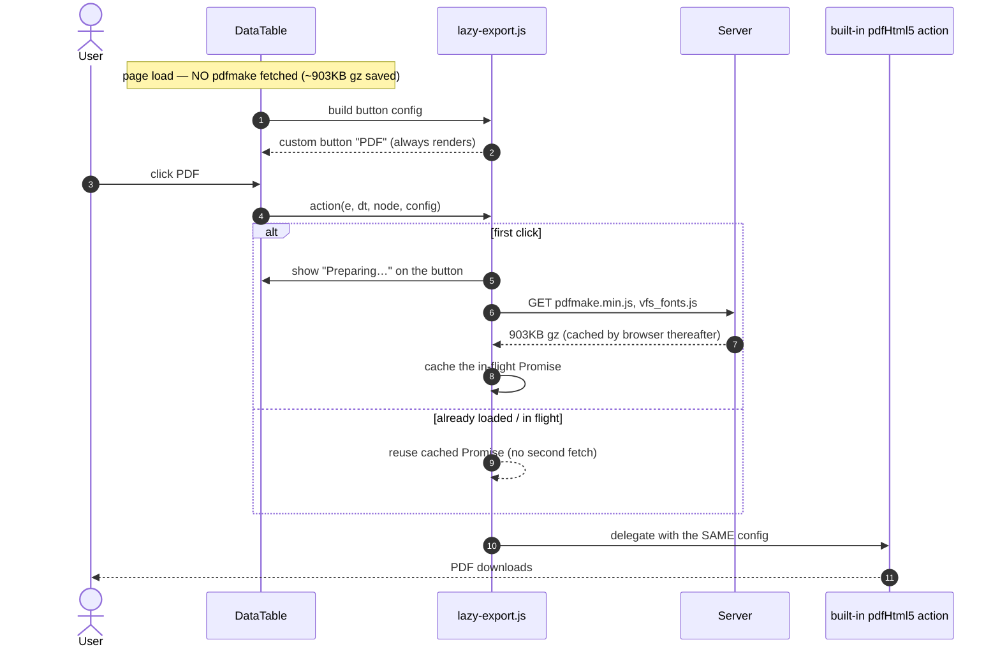

# PERF-4 — lazy-loaded export libraries (design)

**Date:** 2026-08-14
**Parent:** `frontend-performance-audit.md` finding F3
**Status:** IMPLEMENTED (4a + 4b) — awaiting rebuild + gate.

**Files changed**

| File | Change |
|---|---|
| `templates/businessDashboard.html` | 4a — dropped both jsPDF tags |
| `templates/agricultureDashboard.html` | 4a — dropped both jsPDF tags |
| `templates/fragments/header.html` | 4b — dropped jszip/pdfmake/vfs_fonts; added `lazy-export.js` after `main.js` |
| `static/js/common/lazy-export.js` | **NEW** — the whole mechanism, one definition |
| `static/js/business/business.js` | 4b — 2 tables converted (4 buttons) |
| `static/js/education/education.js` | 4b — 2 tables converted (4 buttons) |
| `static/js/agriculture/agriculture.js` | 4b — 1 table converted (2 buttons) |
| `cypress/e2e/ui/perf-lazy-export.cy.js` | **NEW** — 8 cases |

`educationDashboard.html` deliberately keeps its jsPDF tags (`education.js:1062` uses them).
Verified after the edits: zero remaining eager `pdfmake|vfs_fonts|jszip` script tags, zero remaining
built-in `pdfHtml5`/`excelHtml5` configs, all 10 call sites converted.

---

## 1. What the investigation actually found

The audit said "2.3 MB of PDF libs load eagerly". Reading the call sites splits that into **two unrelated
problems with very different risk**, and one hard constraint that dictates the design.

### 1a. jsPDF is DEAD on two of the three dashboards that load it

| App file | uses `new jsPDF` / `autoTable`? |
|---|---|
| `education/education.js:1062` | **YES** — genuinely builds PDFs |
| `business/business.js` (+ every other business/* and common/* file) | **no** |
| `agriculture/agriculture.js` | **no** |

Yet all three dashboards load it:

| Template | Line | Status |
|---|---|---|
| `educationDashboard.html` | 3333-3334 | legitimately used |
| `businessDashboard.html` | 2850-2851 | **dead — 304,352 B raw / 88,471 B gz** |
| `agricultureDashboard.html` | 540-541 | **dead — same 304 KB** |

`receipt.js` prints through a hidden **iframe + `window.print()`** (`receipt.js:603`), not jsPDF, so the
business dashboard has no jsPDF caller at all. The last one was deleted in B2B-P3g-5 (the comment at
`businessDashboard.html:2869` records removing `businessInvoicePrint.js`) — **the script tags were left
behind.**

Removing two tag pairs is a pure deletion with no behavioural surface. That is **PERF-4a**.

### 1b. pdfmake is real, but serves exactly one button

| Library | Raw | gzip | Needed by |
|---|---|---|---|
| `pdfmake.min.js` | 1,093,430 | 452,589 | `pdfHtml5` button only |
| `vfs_fonts.js` | 926,233 | 450,134 | pdfmake's font blob |
| `jszip.min.js` | 101,953 | 29,904 | `excelHtml5` button only |
| **Total** | **2,121,616** | **932,627** | |

`csvHtml5`, `copyHtml5` and `print` need **no library at all** (only `Blob`/`FileReader`). So **903 KB
gzipped buys the single "PDF" button**, on every dashboard load, for every user, forever.

Button counts: `business.js` pdf:2 excel:2 · `education.js` pdf:2 excel:2 · `agriculture.js` pdf:1 excel:1.
Ten call sites across three modules — so the fix must be **one shared helper**, not three copies
(standing rule: common → `js/common/`, never the same function in two files).

### 1c. ⚠️ The constraint that shapes everything

DataTables Buttons gates each export button on an `available()` probe, read from `buttons.html5.min.js`:

```js
available: function(){ return g.FileReader !== w && (t || g.pdfMake) }              // pdfHtml5
available: function(){ return g.FileReader !== w && (z || g.JSZip) !== w && ... }   // excelHtml5
```

**`available()` runs when the DataTable initialises.** If `window.pdfMake` is undefined at that moment,
DataTables does not render a disabled button — it **omits the button entirely**.

So the obvious implementation — *drop the script tags, load pdfmake on click* — **cannot work**: there
would be no button left to click. Any design that does not address this ships a dashboard with the PDF and
Excel buttons silently missing. This is the single most likely way to get PERF-4 wrong.

---

## 2. Proposed design

Replace each built-in `extend: 'pdfHtml5'` with a **custom button that always renders** and fetches the
library on first click, then delegates to the built-in action. Custom buttons have no `available()` gate,
so the UI is unchanged; the cost moves from page load to first use.

Pattern: **lazy proxy** (a stand-in with the real object's interface that materialises it on demand).



### Module shape

```
js/common/lazy-export.js          NEW — the only place this logic exists
  loadScriptOnce(url)             → Promise, memoised per URL
  ensurePdfMake()                 → Promise (pdfmake + vfs_fonts, in order)
  ensureJsZip()                   → Promise (jszip)
  lazyPdfButton(config)           → DataTables button config
  lazyExcelButton(config)         → DataTables button config
```

Call sites change from `{ extend: 'pdfHtml5', orientation: 'landscape', ... }` to
`lazyPdfButton({ orientation: 'landscape', ... })` — same options object, passed straight through to the
built-in action, so per-table settings (orientation, pageSize, title, footer) keep working untouched.

### Design decisions, and why

| Decision | Rationale |
|---|---|
| Custom button, not `available()` patching | Monkey-patching a vendor lib's availability probe is fragile and invisible; a custom button is explicit and local. |
| Memoise the **Promise**, not a boolean | Double-clicking must not start two 903 KB downloads. A boolean flips only after load and would let a second click through. |
| Load `vfs_fonts` **after** `pdfmake` | `vfs_fonts` assigns into `pdfMake.vfs` — reversed, the font blob is lost and PDFs render with no glyphs. Order is a correctness requirement, not a preference. |
| Feedback on the button while loading | On a slow link this is a multi-second wait after a click. Silence reads as a broken button and invites repeat clicks. |
| Keep `csv` / `copy` / `print` untouched | They need no library; touching them would add risk for zero bytes. |
| Shared helper in `js/common/` | Ten call sites across three modules — one definition, per the DRY rule. |
| Surface load failure | If the fetch fails (offline, blocked), say so via the shared `uiAlert`. Doing nothing on click is the worst outcome. |

---

## 3. Effect

Per dashboard load, on top of PERF-1's compression:

| Dashboard | Saved (gz) | Made of |
|---|---|---|
| Business | **991,194 B (~968 KB)** | 902,723 lazy + 88,471 dead jsPDF |
| Agriculture | **991,194 B** | same |
| Education | **902,723 B** | lazy only — jsPDF genuinely used |

The business dashboard's compressed payload drops by roughly **two thirds**. Users who do click Export
pay the 903 KB once, then it is browser-cached.

---

## 4. Risk, honestly

| Risk | Severity | Mitigation |
|---|---|---|
| PDF/Excel buttons vanish (the §1c trap) | **High** | Gate asserts the buttons are VISIBLE, by label, before any click. |
| PDF exports blank/garbled (vfs order) | Medium | Gate asserts a real download with non-trivial byte length. |
| Double-click double-download | Low | Promise memoisation; gate asserts one network call across two clicks. |
| Slow-link wait feels broken | Low | Button shows progress text. |
| jsPDF removal breaks an unseen caller | Low | Exhaustive grep found only `education.js`; education keeps its tags. Gate covers agriculture. |

**PERF-4a (dead jsPDF) and PERF-4b (lazy pdfmake) are independent.** 4a is a two-template deletion worth
88 KB gz with essentially no risk; 4b is real JS across four files with the §1c trap in it.

---

## 5. Gate plan

`cypress/e2e/ui/perf-lazy-export.cy.js`:

1. **pdfmake is NOT fetched on page load** — `cy.intercept` asserting zero calls (the actual saving).
2. **PDF + Excel buttons are visible** on the sale-detail table — the §1c regression, caught before any click.
3. **Clicking PDF fetches pdfmake, then downloads a PDF** with a plausible size — proves the delegation and
   the vfs ordering, not merely that a request happened.
4. **Second click does not refetch** — memoisation.
5. **CSV still works with no library fetched** — proves the untouched paths stayed untouched.
6. **jsPDF is absent from business/agriculture, present on education** — PERF-4a, both directions.

Cypress cannot observe a browser download trivially; assertion is on the intercepted request plus
`cy.readFile` of the download, with `downloadsFolder` from `cypress.config.js`.

---

## 6. Decision needed

1. **Both 4a and 4b**, 4a first as its own commit? *(recommended — banks a zero-risk 88 KB immediately)*
2. **4a only** — take the free win, defer the lazy loading.
3. **4b only** — go straight for the 903 KB.
