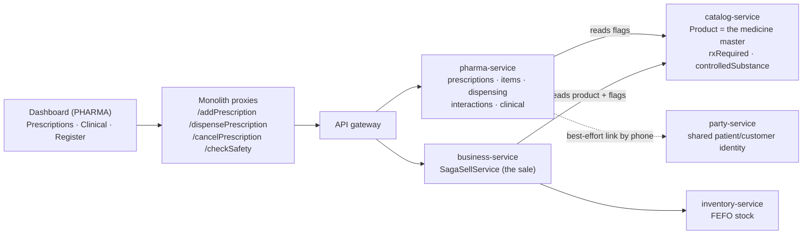
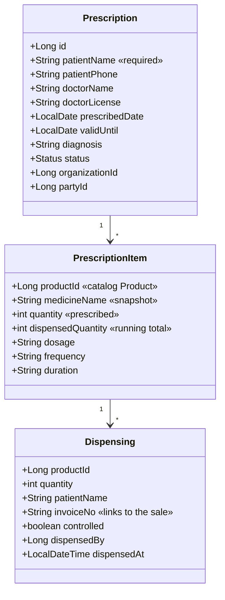

# Prescriptions — what it is, how to use it, how it works

**Status:** REFERENCE - user/operator documentation for the prescriptions module, not a plan. Update it when the module behaviour changes.

Audience: pharmacy owners/pharmacists evaluating or operating the module, and developers changing it.
Status: **live** (slices 41 / 43 / 44, pharmacy review B1–B4). Known gaps are listed in §8.

---

## 1. What it is

A **prescription** (a "script") is the clinical record of what a doctor told a patient to take. In this system it is
a first-class record that sits *beside* the ordinary POS sale, not instead of it:

> The **prescription** answers *"what is this patient entitled to receive, and until when?"*
> The **sale** answers *"what left the shelf, at what price, paid how?"*

Dispensing is where the two meet. Recording a prescription does **not** move stock, take money or produce a receipt —
a normal sale still does all of that. What the prescription adds is the clinical layer around it: who prescribed it,
how much is still outstanding, whether the script is still valid, and an auditable trail of what was handed over.

**Why keep them separate.** A pharmacy is a shop that also has clinical obligations. Merging the two would mean either
a POS that is cluttered with clinical fields for every retail sale, or a clinical system that has to reimplement
stock, tax, tenders, returns and accounting. Keeping them separate means the pharmacy uses the *same* battle-tested
sale path as retail — FEFO batch picking, tax, store credit, GL posting, receipts — and the prescription simply
records what that sale satisfied.

---

## 2. When you would use it

| Situation | What you do |
|---|---|
| Patient brings a doctor's script | Record it under **Prescriptions**, then dispense against it |
| Patient collects only part of it (can't afford all, stock short) | Dispense what they take; the script stays **PARTIALLY_DISPENSED** with the remainder outstanding |
| Patient returns later for the rest | Dispense again from the same script — it tracks what's left |
| Selling a prescription-only medicine | The sale is **refused** unless it was started from a prescription (§6) |
| Script withdrawn, or entered by mistake | **Cancel** it — no further dispensing, but what was already dispensed stays on record |
| Regulator asks what controlled substances you dispensed | **Alerts & Register** → controlled-substance register |

For plain over-the-counter retail you don't touch this module at all — sell as normal.

---

## 3. How to use it

The screens are on the commerce dashboard and appear **only for PHARMA-type users** (`data-vertical-only="PHARMA"`),
under the **Pharmacy** group in the sidebar.

### 3.1 Record a prescription — *Pharmacy → Prescriptions*

1. **Patient** — name (required) and phone. The phone is what links this patient to their POS customer record via the
   shared party master, so the same person isn't three different records across the system.
2. **Doctor** — prescriber name and licence number.
3. **Diagnosis** and **Valid until** — the expiry date matters: past it, the script can no longer be dispensed.
4. **Add each prescribed item** — pick the medicine (a catalog **Product**), then quantity, dosage, frequency,
   duration. Repeat per line.
5. **Save Prescription.**

It is saved as **PENDING** and appears in *Recent prescriptions*.

> **Quantity must be greater than zero.** This is enforced, and not for tidiness: a zero-quantity line would read as
> "already satisfied" the first time anything was dispensed, and would silently flip the whole script to
> FULLY_DISPENSED.

### 3.2 Dispense it

1. In *Recent prescriptions*, press **Dispense** on the script.
2. The screen switches to **Sell**, with a banner showing which prescription you are dispensing.
3. Before you start, the system checks the prescribed items and warns you about **controlled substances** and **drug
   interactions**. A **SEVERE** interaction raises a confirm dialog you must actively acknowledge — it is not a
   message you can scroll past. Declining it cancels the dispense. (Owner-configurable — see §7.)
4. Build the sale exactly as any other sale: quantities, price, discount, customer, tender.
5. **Complete Sale.** The sale posts normally (stock, tax, payment, receipt, ledger), and immediately afterwards the
   dispense is recorded against the prescription and linked to that sale's invoice number.

The script's status recomputes automatically: **PARTIALLY_DISPENSED** if anything is still outstanding,
**FULLY_DISPENSED** when every line is complete.

### 3.3 Read the warnings

The dispense records only what the prescription can account for, and it **tells you when it recorded less than you
sold**. You will see a warning when:

- you sold **more** than was still outstanding → only the outstanding amount is recorded;
- you sold an item **not on the script** → not recorded against it at all;
- the line was **already fully dispensed** → nothing recorded;
- the same sale was **submitted twice** (a retry) → ignored, so nothing is double-counted.

These are deliberately loud. The medicine has already left the counter by this point, so anything the clinical record
cannot account for has to be said out loud rather than silently dropped.

### 3.4 Cancel

**Cancel** on a pending script stops any further dispensing. Anything already dispensed stays on the record — cancelling
is about the future, not a rewrite of history. A fully dispensed script cannot be cancelled.

### 3.5 Clinical flags — *Pharmacy → Clinical & Safety*

Per medicine, set:
- **Prescription required** — enforces §6 at the till.
- **Controlled substance** — puts every dispense of it on the controlled register.

Also define **drug interactions**: pick two medicines, a severity (MILD / MODERATE / SEVERE) and a note.

### 3.6 Registers — *Pharmacy → Alerts & Register*

- **Stock alerts** — near-expiry and low stock.
- **Controlled-substance register** — every controlled dispense: date, medicine, quantity, patient, invoice.

---

## 4. How it works

### 4.1 The pieces



**A medicine is a catalog Product.** There is no separate medicine table. The same product master serves retail POS,
pharmacy and e-commerce, so a dispense reuses the ordinary sell path with no translation layer.

### 4.2 Data model



`medicineName` is stored on the item and on the dispense as a **snapshot**: renaming a product later must not rewrite
what a historical script said.

### 4.3 The dispense sequence

```mermaid
sequenceDiagram
  participant P as Pharmacist
  participant UI as Dashboard
  participant BUS as business-service
  participant CAT as catalog-service
  participant PH as pharma-service

  P->>UI: Dispense (Rx #42)
  UI->>PH: checkSafety(productIds)
  PH->>CAT: batch product refs (flags)
  PH-->>UI: controlled? interactions?
  UI-->>P: warn; SEVERE needs acknowledgement

  P->>UI: build cart, Complete Sale
  UI->>BUS: addSell (+ prescriptionId)
  BUS->>CAT: product ref per line
  Note over BUS: refuses an rx-required line<br/>if no prescriptionId
  BUS-->>UI: invoiceNo

  UI->>PH: dispensePrescription(rxId, invoiceNo, items)
  Note over PH: already dispensed for this invoice? → ignore
  PH->>PH: cap each line, write Dispensing, recompute status
  PH-->>UI: status + warnings
```

The sale is the source of truth for *what left the shelf*. The dispense is recorded **after** it succeeds and is keyed
to its invoice number — which is also what makes the operation safe to repeat.

### 4.4 Status

| Status | Meaning |
|---|---|
| `PENDING` | Recorded, nothing dispensed |
| `PARTIALLY_DISPENSED` | Some quantity dispensed, some outstanding |
| `FULLY_DISPENSED` | Every line complete — terminal |
| `EXPIRED` | Past `validUntil` — **derived**, see below |
| `CANCELLED` | Withdrawn — terminal, no further dispensing |

**Expiry is derived from `validUntil`, never stored.** A date comparison is always true the moment it becomes true; a
stored flag needs a nightly job that can silently stop running and leave expired scripts dispensable. A terminal stored
state still wins — a filled script does not become "expired" the next day.

---

## 5. What the dispense guarantees

| Guarantee | Why it matters |
|---|---|
| **Capped** — never records more than was prescribed | A cashier selling 30 against a script for 20 records 20, and is told |
| **Idempotent** — a repeat post for the same invoice is ignored | The sell flow retries under an idempotency key and gets the same invoice back; without this the quantity would double and the controlled register would list it twice |
| **Nothing silently dropped** — every discrepancy is a warning | The stock has already gone; a silent `continue` would leave the clinical record quietly wrong |
| **Attribution only on real work** | A call that records nothing must not rewrite who last dispensed the script |
| **Tenant-scoped** | Every read and write is scoped by organization |

---

## 6. The prescription-only rule

With **Require a prescription for prescription-only medicines** ON (the default), a sale containing a medicine flagged
`rxRequired` is **refused** unless the sale declares a prescription:

> *"Amoxicillin is prescription-only — start this sale from the prescription (Dispense), or record the prescription first."*

Three properties are deliberate:

1. **Server-side.** The UI also warns the cashier early, but the UI is a courtesy; the gate is in the sale service.
2. **Privilege-independent.** This is a clinical/legal rule, not a permission — it binds an owner and a super-user
   exactly as it binds a cashier.
3. **Free.** The flag rides on the product reference the sell loop already fetches, so enforcement costs no extra
   call at checkout. This is why `rxRequired` and `controlledSubstance` live on the **catalog product** rather than in
   pharma-service: the sell path must never depend on pharma-service being up.

---

## 7. Configuration — *Configuration → Pharmacy*

| Setting | Default | Effect |
|---|---|---|
| `pharmacy.rx.requirePrescription` | **On** | Enforces §6. Off = the flag is advisory only |
| `pharmacy.interaction.blockSevere` | **On** | Off = severe interactions are shown as warnings instead of a dialog |

Both default ON because both are safety steps: the state you get by doing nothing should be the safe one. For
`blockSevere` that extends to failure — an absent key or a failed config read is treated as ON, so a
configuration hiccup can never quietly remove the acknowledgement.

Both are inert for a non-pharmacy tenant: no product of theirs carries the flags, so the checks never fire.

---

## 8. What it deliberately does not do (yet)

Stated plainly so nobody assumes coverage that isn't there:

- **No partial-dispense entry screen.** You dispense by building the sale; you cannot type "give 10 of the 30" directly
  against the script. The cart quantity *is* the dispensed quantity.
- **No prescription editing.** A script is recorded as presented. Wrong → cancel and re-record.
- **No repeat/refill cycles.** Each script is dispensed until exhausted; there is no "3 repeats" concept.
- **No prescriber registry.** Doctor name and licence are free text, not validated against any register.
- **The controlled register is thin.** It shows date, medicine, quantity, patient and invoice — but **not** the
  prescriber, the prescription id, or the batch/lot dispensed. Real controlled-drug regulations usually want all
  three. *(Tracked as pharmacy review item E.)*
- **The prescriptions list is bounded, not paged.** Newest 200 by default (max 1000) — a busy pharmacy will eventually
  need real pagination and search. *(Also item E.)*
- **Interactions are only between items on the same dispense**, and only between items **on the script** — the
  check runs on the prescribed items when you press Dispense, not on the cart as you build it. So an interacting
  medicine added to the same sale ad hoc is not compared against the prescribed ones. There is also no patient
  medication history check, so an interaction with something dispensed last week is not detected.
- **The safety check is not re-run at Complete Sale.** It informs the pharmacist up front; it is not a gate on the
  sale the way the prescription-only rule in §6 is.
- **Dosage/frequency/duration are free text**, recorded for the label and the record — not parsed, not checked against
  the quantity.

---

## 9. Try it end to end

1. Sign in as a **PHARMA** user; confirm the **Pharmacy** group appears in the sidebar.
2. *Clinical & Safety* — flag a medicine **Prescription required**; add a **SEVERE** interaction between two medicines.
3. *Sell* — try to sell the flagged medicine directly → **refused** with the message in §6.
4. *Prescriptions* — record a script for that patient with both interacting medicines.
5. Press **Dispense** → the severe-interaction dialog must appear and require acknowledgement.
6. Sell **less** than prescribed → complete → status **PARTIALLY_DISPENSED**.
7. Dispense again for the remainder → **FULLY_DISPENSED**.
8. Try to dispense once more → refused.
9. Set a `validUntil` in the past on another script → dispense → refused as expired.
10. *Alerts & Register* — the controlled dispense appears with its invoice number.

---

## 10. Where the code lives

| Concern | Location |
|---|---|
| Intake, list, cancel, status | `pharma-service` · `PrescriptionService` |
| Dispense recording, capping, idempotency | `pharma-service` · `DispenseService` |
| Flags + interactions | `pharma-service` · `SafetyService` |
| Medicine master + `rxRequired` / `controlledSubstance` | `catalog-service` · `Product` |
| The prescription-only sell gate | `business-service` · `SagaSellService` |
| Screens + dispense hand-off | `/js/business/pharma.js`, `businessDashboard.html` |
| Proxies | `PharmaPrescriptionController`, `PharmaSafetyController` |

Related: `pharmacy-rx-enforcement-design.md` (the B1 design), `commerce-verticals-blueprint.md`.
