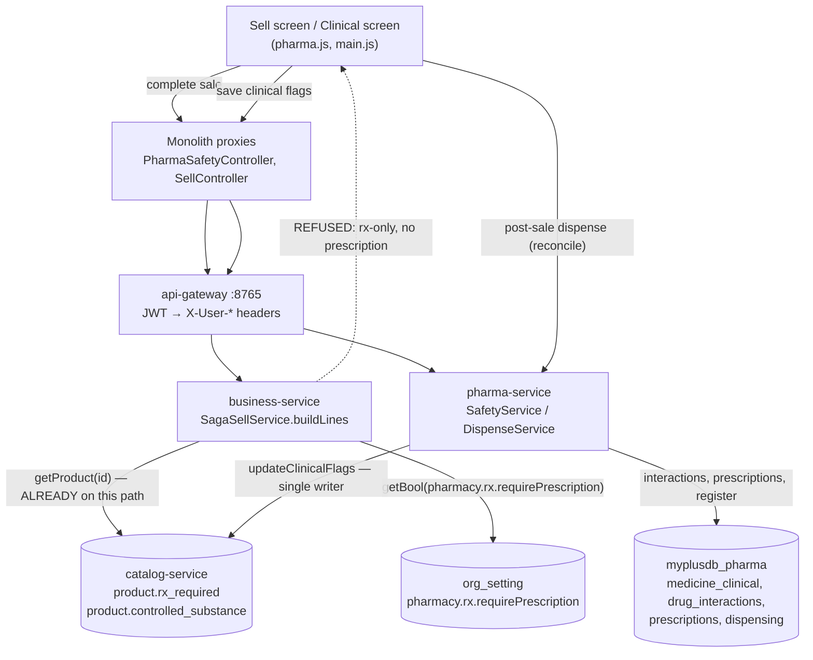
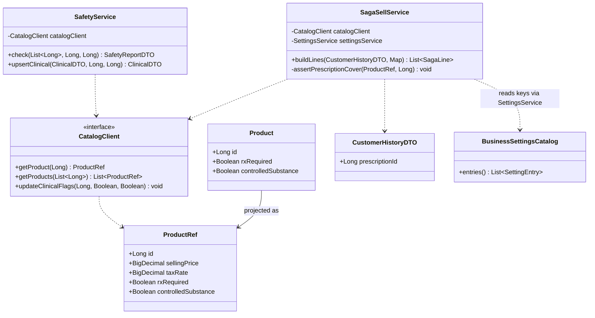
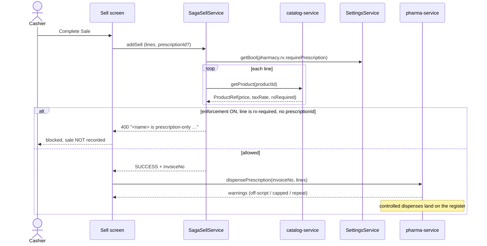

# Pharmacy — prescription-required enforcement (review finding B1)

**Status: IMPLEMENTED (design approved) — awaiting the headed Cypress gate.**
Branch `feature/pharmacy-review`. Follows steps 1–2 of the pharmacy review (privilege gating; dispense guards),
both implemented and Cypress-green.

---

## 1. Document — the problem

A medicine can be flagged **prescription required** (`rxRequired`) and **controlled substance**
(`controlledSubstance`) on the Clinical & Safety screen. Today those flags change **nothing** at the counter:

- `rxRequired` appears nowhere in the sell flow — `grep rxRequired src/main/resources/static/js` returns only the
  Clinical screen that sets it. A prescription-only medicine sells to a walk-in exactly like chewing gum.
- Drug-interaction warnings are advisory text rendered with `showFormError` (`pharma.js`) on one path only — the
  *Dispense from prescription* button. A cashier who starts an ordinary sale never sees them.
- So the flags are decorative, which is worse than absent: the Clinical screen implies a control that does not exist.

**User value.** A pharmacy cannot legally hand out prescription-only medicine without a prescription. This is the
one clinical control the vertical is expected to have, and the review ranked it the headline gap.

**Non-goal.** Verifying that a doctor's licence is real, or that the prescription's *contents* match the basket —
the pharmacist owns that judgement. Reconciliation of what was sold against what was prescribed already exists
(step 2's `PrescriptionDTO.warnings` + the controlled register).

---

## 2. Design

### D1 — hot-path flags live on the **catalog Product**; the clinical layer stays in pharma-service

`rxRequired` / `controlledSubstance` are properties of the **medicine**, not of a prescription — product master
data. They move to `catalog.product` and surface on `ProductRef`.

This is the decisive constraint: **`SagaSellService.buildLines` already calls `catalogClient.getProduct(productId)`
for every sale line** (`business-service/.../SagaSellService.java:182`). Reading a flag off that ref costs **zero**
extra calls, so enforcement adds nothing to the sell hot path. It is exactly the precedent multi-rate tax set —
"tax_code in catalog → `ProductRef.taxRate` so the hot path is unchanged" (`multi-rate-tax-design.md` D1/D2).

The alternative — business-service asking pharma-service "is this rx-only?" per line — puts a cross-service call
on the checkout path and is rejected on the standing performance rule.

pharma-service keeps `medicine_clinical` for the genuinely clinical extras (`drugCategory`) and keeps owning
`drug_interactions` entirely. It **stops** being the source of truth for the two flags.

### D2 — one writer, no dual write

The Clinical & Safety screen writes the flags **to catalog** through a new
`PUT /products/{id}/clinical-flags` (`CatalogClient.updateClinicalFlags`), admin-gated like the rest of the
clinical surface. `SafetyService.check()` — the pre-dispense warning — **reads** flags from catalog with the
existing batch `CatalogClient.getProducts(ids)`; that is the warning path, not the sell path, and it is one call
for the whole basket.

Dual-writing the flags into both databases and syncing them was considered and rejected: two sources of truth for
a regulatory flag drift, and the drifted state is silent.

### D3 — what "enforced" means

A sale line for an rx-required product is refused **unless the sale declares a prescription**.

- The check runs **server-side in `SagaSellService.buildLines`** — the single choke point every sale passes (POS,
  pharmacy, storefront), so it cannot be bypassed by posting to the API directly.
- It is a null-check on `CustomerHistoryDTO.prescriptionId`, data the client already has: the pharmacy dispense
  flow sets `window.dispensingPrescriptionId` before the sale. **No cross-service call.**
- The client-side block on the sell screen is a courtesy that fails fast; the server check is the real gate.

**Deliberately NOT enforced here:** that the declared prescription actually lists these products in these
quantities. That would require pharma-service on the hot path. It is instead reconciled immediately after the sale
by the existing dispense call, which already warns on off-script items and capped quantities (step 2, B4) and
writes the controlled register. A fabricated prescription id fails the scope check at that point and produces a
loud warning against a real invoice.

### D4 — the policy is owner-configurable (existing tenant config store)

Two entries added to `BusinessSettingsCatalog` — no schema change, and they self-render on the Configuration
screen:

| Key | Default | Meaning |
|---|---|---|
| `pharmacy.rx.requirePrescription` | **ON** | Refuse a sale line for an rx-required product when the sale declares no prescription. |
| `pharmacy.interaction.blockSevere` | **OFF** | When on, a SEVERE interaction must be acknowledged before dispensing; when off it is advisory. |

Read with `settingsService.getBool(key)` (org-scoped, override-else-default). A non-pharmacy tenant is unaffected
either way, because no product of theirs carries the flag.

### D5 — data model

```
catalog.product
  + rx_required            BOOLEAN NOT NULL DEFAULT FALSE   -- Flyway V<next>__product_clinical_flags.sql
  + controlled_substance   BOOLEAN NOT NULL DEFAULT FALSE

commerce-contracts ProductRef
  + Boolean rxRequired
  + Boolean controlledSubstance            (back-compat ctor retained — see ProductRef's existing M4d ctor)

pharma.medicine_clinical
  rx_required / controlled_substance  →  RETAINED as columns but no longer read for enforcement
                                          (kept for the one-time backfill + rollback; dropped in a later slice)
```

Org-scoping is unchanged: `product` is already org-scoped in catalog, so the flags inherit tenant isolation.

### D6 — migration of existing flags

`medicine_clinical` lives in `myplusdb_pharma`, `product` in `myplusdb_catalog` — **cross-database, so this cannot
be one Flyway script.** A one-time admin backfill endpoint copies flags across, batched by id cursor and
idempotent, exactly like the party-link backfill already in this service
(`pharma/controller/PartyLinkController.backfill`).

`POST /api/pharma/clinical-flags/backfill?limit=200&afterId=` → `{scanned, pushed, lastId, remaining}`, gated
`ROLE_OWNER or ADMIN_PRIVILEGE or SUPER_PRIVILEGE`. Re-run until `remaining` is 0.

### D7 — UI contract

- **Sell screen**: a line whose product is rx-required shows an "Rx" chip; completing the sale without a linked
  prescription is blocked with *"<name> is prescription-only — start this sale from the prescription (Dispense),
  or record the prescription first."*
- **Interactions**: move from `showFormError` to the shared `uiConfirm` acknowledgement (review finding E3) —
  a SEVERE interaction should not look identical to "pick a medicine". `uiConfirm` per the project standard;
  never `window.confirm`.
- **Clinical & Safety screen**: same two checkboxes, now writing to catalog. Column header "Item ID" → "Product"
  (finding E1).

### D8 — security

Flag writes stay `ADMIN_PRIVILEGE` (step 1). The new catalog endpoint carries the same gate; the backfill is
owner/admin only. The sell-side check is server-side and privilege-independent — it is a clinical rule, not a
permission, so a super-user is bound by it too. Turning it off is a deliberate, audited org setting.

---

## 3. Architecture & UML

### Architecture



### Class diagram



### Sequence — completing a sale that contains a prescription-only medicine



### Lifecycle unchanged

Prescription status (`PENDING → PARTIALLY_DISPENSED → FULLY_DISPENSED`, plus `CANCELLED` and derived `EXPIRED`)
is untouched by this slice — settled in step 2.

---

## 4. Implement — checklist

- [x] `catalog-service`: Flyway `V4__product_clinical_flags.sql` (two BOOLEAN NOT NULL DEFAULT FALSE columns)
- [x] `catalog-service`: `Product.rxRequired/.controlledSubstance`, projected into `toRef` **and** `toDto`;
      `PUT /products/{id}/clinical-flags` (`ADMIN_PRIVILEGE`) + `ProductService.updateClinicalFlags`
- [x] `commerce-contracts`: `ProductRef.rxRequired` / `.controlledSubstance`; `CatalogClient.updateClinicalFlags`
- [x] `business-service`: `CustomerHistoryDTO.prescriptionId`; `SagaSellService.buildLines` guard (policy read
      once per sale, not per line); two `BusinessSettingsCatalog` entries under a new "Pharmacy" group
- [x] `business-service`: `SellController` catches `ValidationException` on **addSell and updateSell** — without
      it the broad handler buries the reason under "An unexpected error occurred" (same precedent as the
      insufficient-stock catch). An edit shares `buildLines`, so it is guarded too.
- [x] `pharma-service`: `SafetyService` reads flags from catalog (batch, tolerant of an outage) and writes them
      there (fail-loud); `ClinicalFlagBackfillService` + `ClinicalFlagController` (owner/admin)
- [x] monolith: `CustomerHistoryDTO.prescriptionId` (the proxy would drop an unmapped field), `main.js` sends it
      from `window.dispensingPrescriptionId`; "Item ID" → "Product" + an empty state on the clinical table
- [x] `pharma.js`: `rxNoticeIfNeeded` early warning (called from BOTH cart paths in `business.js`),
      `uiConfirm` acknowledgement for SEVERE interactions
- [x] tests: `SafetyServiceTest` rewritten against a mocked `CatalogClient` (5 new cases incl. outage +
      fail-loud); `DispenseServiceTest` mocks it too; Cypress `pharmacy/rx-enforcement.cy.js` (6 cases)

**Not built, deliberately:** an "Rx" chip rendered on each cart row. The early warning fires on add instead,
which needed no change to the shared cart-render internals. Revisit if the chip is wanted on the row itself.

## 5. Test

| # | Case | Expected |
|---|---|---|
| 1 | Sell an rx-required product, no prescription, setting ON | refused; message names the product; **no** sale row, **no** stock movement |
| 2 | Same, started from Dispense (prescription linked) | sale completes; dispense recorded; register updated if controlled |
| 3 | Same, setting OFF for the org | sale completes (policy respected) |
| 4 | Sell a normal product | unaffected — no extra catalog call, no behaviour change |
| 5 | Non-pharmacy (POS) tenant, any basket | unaffected |
| 6 | SEVERE interaction, `blockSevere` ON | `uiConfirm` must be acknowledged before dispensing |
| 7 | Flags backfill run twice | idempotent; `remaining` reaches 0; no duplicate writes |
| 8 | A cashier (no ADMIN) sets a clinical flag | 403 (step-1 gate still holds through the new catalog path) |

Cypress gate (headed): `cypress/e2e/pharmacy/rx-enforcement.cy.js`
Regression: `pharmacy/dispense-guards.cy.js`, `pharmacy/alerts.cy.js`, `pharmacy/method-authz.cy.js`,
`business/sell.cy.js` (case 4/5 — the POS path must be untouched).

---

## 6. Risk / blast radius

`SagaSellService.buildLines` and `ProductRef` are shared by **every** vertical — POS, pharmacy, storefront. The
guard is inert unless a product carries the flag, and no non-pharmacy product will, but this is the highest-traffic
code path in the system and the change must be reviewed with that in mind. The `business/sell.cy.js` regression run
is not optional.

The flags stop being read from `medicine_clinical` the moment this ships. Any tenant that set flags before the
backfill runs is **unenforced until it does** — the backfill is part of the deploy, not an afterthought.
