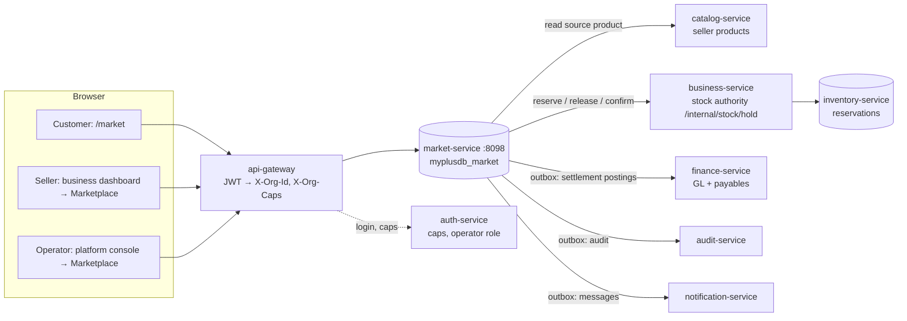
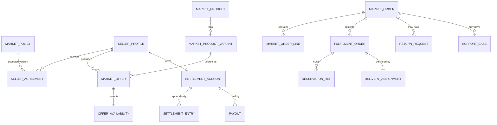
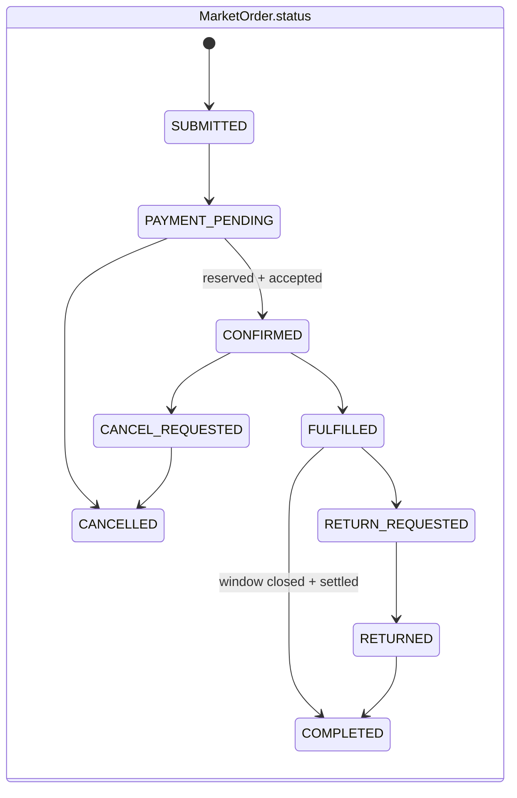
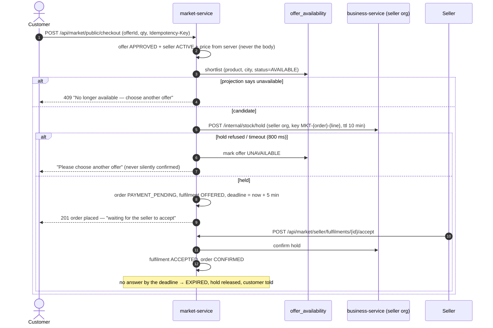

# Platform Marketplace — programme design (`market-service`)

**Status:** DESIGN for review (2026-10-03). MP-0a/MP-0b implemented on `feature/platform-marketplace`, unit-green;
Cypress gate written, waiting for a deploy. Every later slice is design-only until reviewed.
**Source:** "MaxTheService Marketplace — Final Implementation Design" (owner's document, 23 sections), reviewed
end to end against this repository on `feature/expense-management @ 7b87499e`.
**Slices:** [`slices/mp-0-marketplace-foundation.md`](slices/mp-0-marketplace-foundation.md) (first).
**Manual test book:** https://claude.ai/artifact/8cvJSasARGLn7i8rYFwqET (shared Pass/Fail/Blocked per case; private until the owner shares it).

---

## 1. Document — what and why

**Problem.** MaxTheService sells a SaaS to individual shops. Each shop can already run its own web storefront
(`marketplace-service`, `/store?org=N`), but that is *the shop's* store: the shop owns the customer, the cart
belongs to one organisation, and the browser chooses which organisation it is talking to. There is no place
where a customer can find a product once, compare several shops' offers for it, and buy from MaxTheService
with MaxTheService answering for the order.

**User value.**
- *Customer* — one catalogue, one account, one support desk; can choose an offer by price, distance, speed,
  rating, warranty or return terms.
- *Merchant (an existing tenant)* — a new sales channel for stock it already manages in POS, without
  re-keying products, and with paid-out settlements it can reconcile.
- *MaxTheService* — owns the marketplace relationship, earns commission and delivery income, and has the
  records (snapshots, audit, immutable settlement ledger) an operator and an auditor need.

**Core principle (kept from the source document).** *MaxTheService owns the marketplace experience and
coordinates the order, while the configured stock owner, custodian, fulfiller, carrier and warranty provider
remain explicitly accountable for their agreed responsibilities.*

**Launch order (kept).** Merchant stock, one seller per checkout, one city, low-risk products → platform stock
→ supplier drop-ship → consignment → regulated pharmacy.

---

## 2. Review of the source document against the code (RULE 0)

Everything below was read in the file cited; counts are stated so they can be checked.

### 2a. What already exists and is reused

| Need in the source doc | Exists today | Where | Verdict |
|---|---|---|---|
| Seller's product master | Per-tenant `products` (sku, barcode, name, description, category, unit, packSize, manufacturer, sellingPrice, taxRate, single `imageUrl`) | catalog-service `entity/Product.java:14-296` | **Reuse** as the offer's `source_product_id`. No brand/model/variant/colour/storage/condition/GTIN columns, so it cannot be the canonical product. |
| Stock reservation with expiry | `Reservation` RESERVED→CONFIRMED/RELEASED, idempotency key unique per org, `expiresAt`, FEFO picks, sweeper every 300 s | inventory-service `Reservation.java:11-54`, `ReservationController.java:18-73`, `ExpiredReservationSweeper.java:60` | **Reuse** for MERCHANT stock through business-service's single stock authority (`/internal/stock/hold`, `OrderStockHoldService.java:20-120`). |
| `available = on_hand − reserved − …` | Available = Σ(quantity − reservedQuantity) over non-expired batches | `ReservationService.java:124-132` | **Reuse**. `allocated`/`unavailable` do not exist as columns; "allocated" = CONFIRMED reservation, "unavailable" = expired/quarantined batch. |
| Capability / entitlement | `Capability` enum, `org.cap.*` settings, JWT `caps`, gateway strips client header, opt-in default-OFF since EX-0a | common-settings `Capability.java:36-181`, `JwtAuthenticationFilter.java:145-198` | **Reuse**; add `MARKETPLACE_SELLING` (opt-in). |
| Platform operator identity | `ROLE_ADMIN` (never `ADMIN_PRIVILEGE`) | `CurrentUser.isPlatformOperator():98` | **Reuse** for operator endpoints. |
| Tenant from server identity | JWT `activeOrgId` → gateway `X-Org-Id` → `CurrentUser.organizationId()` | `ARCHITECTURE-MULTITENANCY.md:23-35` | **Reuse**; the seller's org is never read from a body. |
| Party master | `Party` CUSTOMER/VENDOR/… with contactKey/taxKey matching | party-service `Party.java:30-87` | **Reuse** for the platform customer's contact record (MP-4). |
| Ledger | finance-service GL, posting events with idempotent `eventKey`, payables subledger `payable_doc` (party-agnostic, UNIQUE(org, source, source_ref)) | `PostingService.java:94-133`, `PayableDoc.java:21-68`, `V9__payable_doc.sql:28` | **Reuse** for the operator's books (MP-7); needs new event types and accounts. |
| Audit trail | `AuditEmitter` + per-service `audit_outbox` → audit-service | common-audit `AuditEmitter.java:54-174` | **Reuse** for every marketplace and support action. |
| Outbox / idempotent consumer | common-outbox relay + health endpoints | `OutboxRelay.java:17-43` | **Reuse**. |
| Notifications | common-notify `NotificationClient` → notification-service `/email` | `NotificationClient.java:13-37` | **Reuse** for order/acceptance/settlement messages. |
| Document numbers | common-docnum per-org allocator | EX-0c | **Reuse** for `MKT-` order and `PAY-` payout numbers. |

### 2b. What exists but must NOT be reused as the marketplace

`marketplace-service` (port 8088, 23 Flyway migrations, 39 endpoints) is a **single-tenant storefront + OMS**:

| Finding | Evidence | Why it blocks a platform marketplace |
|---|---|---|
| Every row is one tenant's; the anonymous browser picks the tenant | `store.html:130` (`?org=` or default org 1); `organizationId` request param/body on all 13 `/public/**` endpoints (`PublicCartController.java:27`, `PublicCheckoutController.java:40,48`) | The platform's customer must not belong to a seller, and the seller must be chosen by the *offer*, server-side. |
| Customer account is per store | `storefront_customer` UNIQUE(org, email) (`StorefrontCustomer.java:14`); tokens never expire (`CustomerAccountService.java:51`) | Source §8: "customer ownership: MaxTheService". |
| One status column for approval + fulfilment + returns | `FulfilmentStatus` 11 values (`FulfilmentStatus.java:32-102`); payment/books are untyped strings | Source §19: separate order / fulfilment / payment / settlement machines. |
| Storefront takes no hold; sale recorded at placement | `CartService.java:27`; `OrderService.placePublic:726-892` | Source §10: reservation with expiry, then seller acceptance. |
| No commission, payout, seller ledger | grep `commission|payout|seller|consign` over `marketplace-service/src` = 0 hits | Source §15-16. |
| Card charge has no idempotency key; card tender not recorded (R6) | `OrderService.java:821`; `oms-program-plan.md:49` | Source §22: payments idempotent. |
| Public return looks an order up by raw id without org | `OrderService.java:1396` | **Security defect in today's storefront** — reported separately (§9, F-1); not fixed in this programme. |

**Ruling R-1 (proposed): a new service, `market-service`, not an extension of `marketplace-service`.**
The tenancy model is the opposite one (operator-owned rows with seller org columns vs. tenant-owned rows), the
lifecycle is different (four state machines vs one), and the external integrations differ (seller acceptance,
carriers, payouts). Extending would mean a second meaning for every existing column and a migration on a live
OMS that tenants use today. `marketplace-service` keeps serving each shop's own storefront unchanged
(live-modules rule). The names are deliberately distinct: **marketplace-service = a shop's own store;
market-service = the MaxTheService marketplace.**

### 2c. Gaps the programme must close (count: 14)

| # | Gap | Closed in |
|---|---|---|
| G1 | No marketplace capability; no way for a tenant to opt in to selling | MP-0a |
| G2 | No service, schema, or operator API for the marketplace | MP-0b |
| G3 | No versioned policies (seller agreement, data-sharing, returns, commission, COD, warranty, terms) | MP-0b |
| G4 | No seller onboarding (apply → agreement accepted → operator approves/suspends) | MP-0b |
| G5 | No canonical product; catalogue has no brand/model/variant/condition/warranty/GTIN | MP-1 |
| G6 | No composite identity key / matching workflow (PENDING_REVIEW, MATCHED, REJECTED, NEEDS_CORRECTION) | MP-1 |
| G7 | No offer linking a seller's own product to a canonical product, with policy checks | MP-2 |
| G8 | No availability projection for fast candidate selection | MP-3 |
| G9 | No platform customer, cart, checkout across sellers' offers | MP-4 |
| G10 | No marketplace order with separate order/fulfilment/payment/settlement states and order-time snapshots | MP-4 |
| G11 | No seller acceptance with deadline, packing, manual delivery assignment | MP-5 |
| G12 | No marketplace return request or support case | MP-6 |
| G13 | No immutable settlement ledger, commission, payout approval | MP-7 |
| G14 | No operator chart-of-accounts lines for seller payables, commission, refund reserve | MP-7 |

### 2d. Corrections to the source document (found by the review)

1. **"`available = on_hand − reserved − allocated − unavailable`"** — the code has no `allocated` or
   `unavailable` column. The equivalent in this system is Σ(batch quantity − reserved) over non-expired
   batches, where a confirmed reservation stays counted as reserved until the sale consumes it. The design uses
   the existing definition rather than adding columns that would need every reader of `stock_entries` traced.
2. **"Stock location / service area"** — inventory has warehouses but **no store id**, and business-service's
   `store` has no warehouse mapping (`oms-program-plan.md` INV-L ⬜). Phase 1 is therefore **one pickup point per
   seller** (the seller profile's address and service radius). Per-branch offers wait for INV-L.
3. **"Redis/search projections"** — there is a per-tenant cache convention (`TenantCache`) but no shared search
   index. Phase 1 uses a MySQL projection table indexed on (product, status, city) — enough for one city — and
   §1d K3 forbids caching stock without a ruling. Redis/search is a Phase 2 decision with load numbers.
4. **"Cash and one online payment option"** — the only gateway is a sandbox (`SandboxPaymentGateway`), with no
   authorize/capture split. Phase 1 = COD + sandbox card; a real PSP is ruling R-6.
5. **"T+1"** — needs a business-day calendar; none exists. MP-7 adds a holiday table owned by the operator.

---

## 3. Standards (§1b)

| Dimension | Rule |
|---|---|
| **Business / domain** | Marketplace operator model: the operator is merchant-of-record for the *customer relationship*, not for stock it does not own. Each line names stock owner, custodian, fulfiller and warranty provider (source §3). Settlement follows the agreed trigger, never order placement (§15). |
| **SaaS multi-tenancy** | Two kinds of row. **Platform rows** (canonical products, policies, orders, ledger) carry `organization_id = platform org` and are written only by the operator or by the service on the operator's behalf. **Seller rows** (seller profile, offers, fulfilment orders) carry `seller_organization_id` taken from `CurrentUser.organizationId()` — never from a body (§22: "browser cannot choose stock owner by changing JSON"). A seller reading another seller's row gets 404. |
| **Live-modules rule** | `MARKETPLACE_SELLING` is opt-in (default OFF, EX-0a mechanism), not in `Plan.FREE`. No existing table is altered; `marketplace-service` is untouched. A tenant that never opts in sees nothing new. |
| **Microservice boundaries** | `market-service` owns marketplace data + lifecycle + external integrations (seller acceptance, carriers, payouts) — the three tests for a new service. Stock stays in inventory (via business-service's stock authority); money stays in finance; products stay in catalog. |
| **Design patterns** | State pattern per lifecycle (four enums with transition tables, the `FulfilmentStatus.ALLOWED` style); Strategy per stock source (`ReservationAuthority`: MERCHANT now, PLATFORM/SUPPLIER/CONSIGNMENT later); Snapshot (order line copies of price/policy/parties); Transactional outbox + idempotent consumer for finance and audit; Append-only ledger for settlement. |
| **SOLID / DRY** | One `MarketAccess` for every permission decision; one `PolicyResolver` for "which policy version applies"; reuse of `common-docnum`, `common-audit`, `common-outbox`, `FinanceClient`, `TradeClient`. |
| **Testing standard** | Per slice: unit tests on `mvn test` (Skipped 0), a Flyway/Testcontainers boot test under `ddl-auto=validate`, one headed Cypress gate with a real-UI case first, a cross-tenant case, an OFF case, and a privilege-ladder case; manual cases in the test book. |

---

## 4. Architecture

### 4.1 Placement

### 4.2 Domain model (target, all phases)

Tables in Phase 1, by slice: `market_policy`, `seller_profile`, `seller_agreement`, `audit_outbox` (MP-0b);
`market_product`, `market_product_variant`, `product_match` (MP-1); `market_offer` (MP-2);
`offer_availability` (MP-3); `market_customer`, `market_cart`, `market_cart_line`, `market_order`,
`market_order_line`, `fulfilment_order`, `reservation_ref`, `market_outbox` (MP-4); `delivery_assignment`,
`fulfilment_event` (MP-5); `return_request`, `support_case`, `support_note` (MP-6); `settlement_account`,
`settlement_entry`, `payout`, `business_holiday` (MP-7).

Every table carries `organization_id` (platform org or seller org as stated per table) and, where the source
document requires it, `stock_owner_organization_id`, `custodian_organization_id`, `seller_organization_id`,
`fulfiller_organization_id`. Money is `DECIMAL(19,2)`; statuses are `VARCHAR` (never MySQL `ENUM` — the
crash-loop lesson in STANDARDS §0).

### 4.3 Four state machines (source §19), kept separate

| Machine | Values (Phase 1) | Added later |
|---|---|---|
| `market_order.status` | DRAFT, SUBMITTED, PAYMENT_PENDING, CONFIRMED, FULFILLED, CANCEL_REQUESTED, CANCELLED, RETURN_REQUESTED, RETURNED, COMPLETED | PAYMENT_AUTHORIZED, PARTIALLY_FULFILLED (MP-8) |
| `fulfilment_order.status` | UNASSIGNED, OFFERED, ACCEPTED, REJECTED, EXPIRED, RESERVED, PACKED, HANDED_TO_CARRIER, IN_TRANSIT, DELIVERED, FAILED, RETURN_REQUESTED, RETURNED | PICKING (Phase 3 warehouse) |
| `market_order.payment_status` | UNPAID, CAPTURED, PARTIALLY_REFUNDED, REFUNDED, FAILED | AUTHORIZED, CHARGEBACK (real PSP) |
| `settlement_entry.status` / line | NOT_ELIGIBLE, PENDING_RETURN_WINDOW, ELIGIBLE, ON_HOLD, APPROVED, PROCESSING, PAID, REVERSED, DISPUTED | — |

An order can be `FULFILLED` with payment `CAPTURED` and settlement `PENDING_RETURN_WINDOW` at once — which is
why these are four columns with four transition tables, never one.

### 4.4 Checkout and reservation (MP-4), the hot path

Timeouts and deadlines are configuration (`MarketSettingsCatalog`), seeded from source §10: merchant acceptance
5 min, merchant hold 10 min; per-call timeout 800 ms; candidates tried ≤ 3; routing deadline 2 s.

### 4.5 Settlement (MP-7)

Settlement entries are **append-only**: a correction is a new REVERSAL entry, never an UPDATE of an amount.
The reconciliation identity from source §15 is asserted by a unit test and by the gate:

`customer amount received = seller payable + platform commission + delivery amount + processing fees + taxes + reserves + adjustments`

Finance postings in the operator's books (new event types, MP-7): `MARKET_SALE` (Dr Cash/Clearing; Cr 2400
Seller Payables, Cr 4400 Commission Income, Cr 4300 Delivery Income, Cr 2100 Tax), `MARKET_REFUND`,
`MARKET_PAYOUT` (Dr 2400; Cr Bank). New accounts **2400 Marketplace Seller Payables, 2410 Refund Reserve,
4400 Marketplace Commission Income, 6950 Payment Processing Fees** join `GlService.DEFAULT_COA` through the
proven `ensureDefaults()` backfill.

---

## 5. API contract (Phase 1)

Base path `/api/market` (gateway route, no StripPrefix). Three audiences, three prefixes, each with its own
security rule — a seller endpoint never accepts an organisation id, an operator endpoint is `ROLE_ADMIN` only.

| Audience | Prefix | Auth | Slice |
|---|---|---|---|
| Operator | `/api/market/admin/**` | `ROLE_ADMIN` (platform operator) | MP-0b+ |
| Seller | `/api/market/seller/**` | tenant JWT, `ROLE_OWNER`/`ADMIN_PRIVILEGE` for writes, capability `marketplaceSelling` fail-closed | MP-0b+ |
| Customer | `/api/market/public/**` (browse) and `/api/market/customer/**` (signed-in) | anonymous / customer session | MP-3, MP-4 |

MP-0b endpoints (implemented):

| Method | Path | Who | Does |
|---|---|---|---|
| GET | `/api/market/admin/policies?type=` | operator | list policy versions |
| POST | `/api/market/admin/policies` | operator | create a DRAFT version (type, title, body, effectiveFrom) |
| POST | `/api/market/admin/policies/{id}/publish` | operator | DRAFT → PUBLISHED; the previous PUBLISHED of that type → SUPERSEDED |
| GET | `/api/market/admin/sellers?status=` | operator | seller applications |
| POST | `/api/market/admin/sellers/{id}/approve` | operator | PENDING_REVIEW → ACTIVE |
| POST | `/api/market/admin/sellers/{id}/reject` | operator | PENDING_REVIEW → REJECTED (reason required) |
| POST | `/api/market/admin/sellers/{id}/suspend` | operator | ACTIVE → SUSPENDED (reason required) |
| POST | `/api/market/admin/sellers/{id}/reinstate` | operator | SUSPENDED → ACTIVE |
| GET | `/api/market/seller/policies/current` | seller | the PUBLISHED version of each policy a seller must accept |
| GET | `/api/market/seller/profile` | seller | own profile (404-free: `null` when none) |
| POST | `/api/market/seller/apply` | seller owner/admin | create or resubmit own application, accepting the current versions |
| POST | `/api/market/seller/withdraw` | seller owner/admin | leave the marketplace / withdraw a pending application (refused while SUSPENDED) |

Seller lifecycle (MP-0b): `PENDING_REVIEW → ACTIVE | REJECTED | WITHDRAWN`, `REJECTED → PENDING_REVIEW`,
`ACTIVE → SUSPENDED | WITHDRAWN`, `SUSPENDED → ACTIVE`, `WITHDRAWN → PENDING_REVIEW` (8 legal moves,
`SellerStatus.ALLOWED`). A suspended seller cannot withdraw, so leaving and re-applying is never a way round a
suspension.

---

## 6. Phased sequence

Each slice is a full vertical slice (UI + API + DB + gate). A slice starts only after the previous one is green
and reviewed. Source-document phases in brackets.

| Slice | Scope | Gate asserts |
|---|---|---|
| **MP-0a** [P0] | `MARKETPLACE_SELLING` opt-in capability (default OFF, not in FREE) | every existing capability unchanged; new one OFF; shape change keeps it |
| **MP-0b** [P0] | `market-service` scaffold (Flyway V1, gateway, compose, scripts, audit outbox); versioned policies; seller onboarding (apply/approve/reject/suspend/reinstate/withdraw) | OFF → apply refused; ON → apply → operator approves → ACTIVE; tenant cannot call admin (403); seller cannot read another seller; publishing v2 supersedes v1; re-apply after reject records the new versions |
| **MP-1** [P1] | Canonical `market_product` + variants; composite identity key; match queue (PENDING_REVIEW/MATCHED/REJECTED/NEEDS_CORRECTION); operator correction | 64GB vs 128GB never merge; pack 10 vs 20 never merge; name-only match refused; operator re-match audited |
| **MP-2** [P1] | Seller offers from own catalog product (server verifies product belongs to seller org); price within policy floor/max-discount; offer approval; stock source = MERCHANT only | offer on another org's product → 404; price below floor refused; suspended seller's offers hidden |
| **MP-3** [P1] | `offer_availability` projection fed from inventory availability; public catalogue `/market` with filters (price, distance, delivery, rating, warranty, returns) and explicit offer choice | filter never shows unapproved/suspended/out-of-stock; sort changes ranking only |
| **MP-4** [P1] | Platform customer account; single-seller cart; checkout with reservation (10 min) via stock authority; COD + sandbox card with idempotency; order-time snapshots; four status columns | double-submit → one order; hold failure → "choose another offer", nothing charged; snapshot unchanged after policy v2 |
| **MP-5** [P1] | Seller acceptance with 5-min deadline (expiry worker), pack, manual delivery assignment by operator, delivery status with proof, cancellation rules | no answer → EXPIRED + hold released; accept after expiry refused; delivered → payable trigger |
| **MP-6** [P1] | Return request per line (policy snapshot decides window and cost bearer); support case + notes, all audited | return outside window refused; cost bearer = snapshot's; operator sees case trail |
| **MP-7** [P1] | Settlement account per seller; append-only ledger; trigger DELIVERED + return window; manual payout approval (idempotent, audited); finance postings + new accounts; business-day calendar | reconciliation identity holds to the paisa; trial balance moves exactly; payout twice → once |
| **MP-8** [P2] | Parent/child orders, multi-seller cart, rerouting on shortage (≤3 candidates, 2 s deadline), COD reconciliation, merchant performance, settlement reports | shortage reassigns or asks the customer; never substitutes variant/strength/pack without approval |
| **MP-9** [P3] | Platform stock (stock source PLATFORM): platform warehouse, pick/pack, transfers, central returns | — |
| **MP-10** [P4] | Supplier stock: supplier portal/API, acceptance SLA (15-20 min), tracking, supplier settlement | circuit breaker per supplier |
| **MP-11** [P5] | Consignment: agreements (all 11 terms from source §4 configurable), consigned-stock ledger, counts, sell-through, shrinkage claims, unsold-stock return | no consignment offer without an agreement with all terms set |
| **MP-12** [P6] | Regulated pharmacy: approved sellers, pharmacist verification, prescriptions (reuses pharma-service RX enforcement), batch/expiry, recall | after legal review only |

**Thinnest first value:** MP-0 → MP-5 is the pilot loop (a customer orders from one merchant, the merchant
accepts and delivers). MP-6 and MP-7 must be green before any real money moves.

**Phase 0 non-code deliverables** (source §20) are recorded as policy types so each has an owner and a version:
`SELLER_AGREEMENT`, `DATA_SHARING`, `CUSTOMER_TERMS`, `RETURNS_REFUNDS`, `COMMISSION`, `COD`, `WARRANTY`,
`COMPLAINTS`, `PRODUCT_APPROVAL`. The *text* of each is the operator's (legal) work; the system only versions it
and records who accepted which version when. Tax/payment/regulatory review is an off-system task.

---

## 7. Security and correctness (source §22), mapped to mechanisms

| Requirement | Mechanism | Slice |
|---|---|---|
| Tenant context from server identity | `MarketAccess.sellerOrg()` = `CurrentUser.organizationId()`; no DTO has an org field | MP-0b |
| Browser cannot choose stock owner | stock owner/custodian/fulfiller copied from the offer row server-side | MP-2, MP-4 |
| Offer approval server-side | `market_offer.approval_status` checked on every read path that customers see | MP-2/3 |
| Price server-authoritative | checkout reads price from the offer row; body price ignored | MP-4 |
| Reservation server-authoritative | stock authority hold; projection is a hint only | MP-4 |
| Payment / refund idempotency | `Idempotency-Key` + UNIQUE(org, key) on order, refund, payout | MP-4/6/7 |
| Settlement immutable | entries INSERT-only; repository exposes no update; reversal entries | MP-7 |
| Snapshots | order line copies price, tax, commission, delivery fee, policy versions, parties | MP-4 |
| Every action audited | `MarketAuditService` (AuditEmitter) in the writing transaction | MP-0b+ |
| External call timeouts + circuit breaker | `ClientsConfig` timeouts (2 s connect / 800 ms read on the hold call) + Resilience4j | MP-4 |
| Retryable, idempotent events | `market_outbox` with whole-JSON payload; consumers keyed by eventKey | MP-4/7 |

---

## 8. Test plan (summary — each slice doc lists its cases first)

- Cypress folder `cypress/e2e/market/`, one spec per slice: `mp-0-foundation.cy.js` (implemented gate),
  `mp-1-catalog.cy.js` … `mp-7-settlement.cy.js` (cases written as pending `it()` until the slice is built).
- Accounts: operator `admin@myplus.com` (`cy.loginAsOperator`); seller A `owner.business@`, seller B
  `owner.mobile@` (two orgs → the cross-tenant case); privilege ladder `admin.business@`/`user.business@`.
- Every gate: real-UI case first; OFF case; cross-tenant case; ladder case; `after()` restores capability.

---

## 9. Risks, findings and open rulings

| # | Item | Proposed |
|---|---|---|
| R-1 | New `market-service` vs extending `marketplace-service` | **New service** (§2b). |
| R-2 | Which organisation is "the platform"? | Configuration `market.platform-org-id` (the operator's own org). Operator writes are `ROLE_ADMIN`, not support-session, because these are the operator's own rows. |
| R-3 | Capability in `Plan.FREE`? | **No.** Selling on the marketplace is a paid channel; grant per tenant with `setEntitlement` during the pilot. |
| R-4 | Platform customer identity | New `market_customer` (global, email unique), sessions with expiry; contact mirrored to party-service under the platform org. |
| R-5 | Store/branch-level offers | Wait for INV-L; Phase 1 = one pickup point per seller. |
| R-6 | Real payment provider | Out of Phase 1; COD + sandbox. Needed before card money is real. |
| R-7 | Commission model | Percentage per category with a minimum, from the published `COMMISSION` policy version, snapshotted per line. |
| F-1 | **Defect in today's storefront**: `POST /public/order/return` looks an order up by raw id without the org (`marketplace-service OrderService.java:1396`), protected only by a contact match | Separate fix, not part of this programme. |
| F-2 | Storefront card orders record no tender (R6 in `oms-program-plan.md:49`) | Existing open item; the marketplace does not inherit it because MP-4 records the tender in its own order. |
