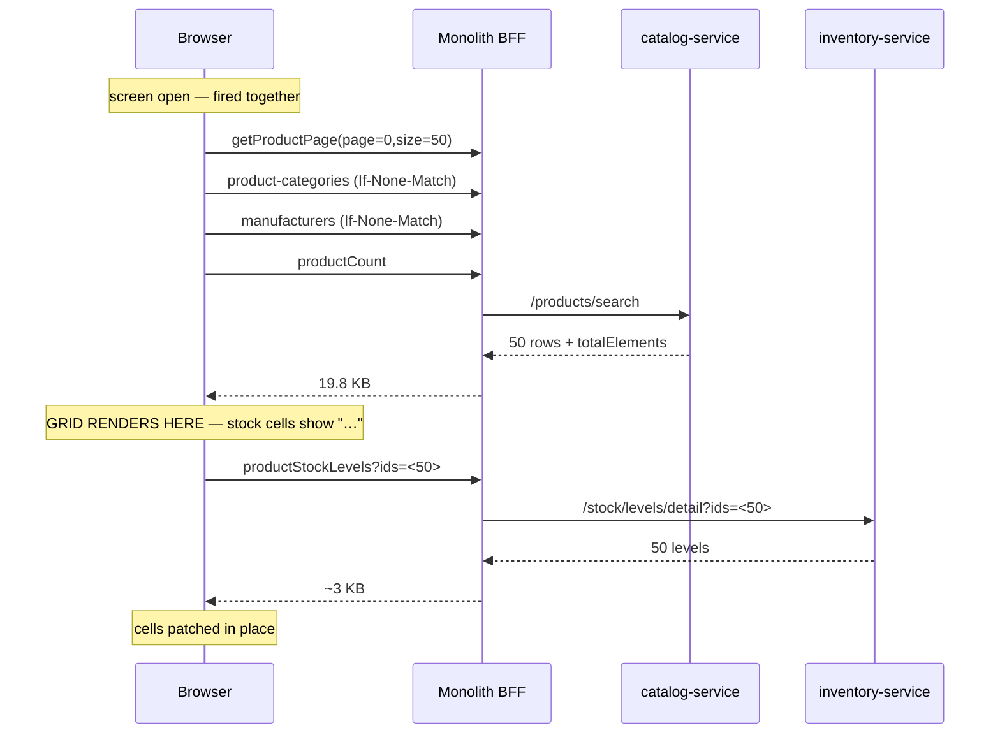

# Product screen — load only what is on screen (PS-1)

**Status:** ✅ SHIPPED + measured + **GATED GREEN 5/5** (2026-09-12) — `cypress/e2e/business/product-screen-payload.cy.js`. PS-1e / PS-1f / PS-2 still open.
**Measured on `owner.business@` (org has 1,632 products) — every number below is from a live run, not an estimate.**

---

## 1. What the screen does today

| Call | Rows | Bytes | Verdict |
|---|---|---|---|
| `getUserCategories` | 18 | 744 B | ✅ small, purpose-built |
| `getProductPage?size=50` | 50 | 19.8 KB | ✅ server-paged **and** server-searched |
| `getUserProduct?includeInactive=true` | **1000** | **384 KB** | ❌ whole catalogue, silently truncated |
| `productStockLevels` | 1112 | 69.5 KB | ❌ whole tenant, no bound at all |

**474 KB to render a 50-row grid that needs 19.8 KB.** 96% of the payload serves two companion features.

### 1.1 The truncation is a correctness defect, not a performance one

`getProductPage` reports `totalElements: 1632`. `getUserProduct` returns **exactly 1000** — the cap in
`CatalogController.getUserProduct` (`size=1000&sort=id,desc`). Verified against live data by taking the five
oldest products by id and looking them up in the index:

```
id=1376 SKU1786857702084  Margin_1786857702051202   in index? NO
id=1377 SKU1786857703129  Margin_1786857703093896   in index? NO
id=1378 SKU1786857704231  Margin_1786857704126729   in index? NO
id=1379 SKU1786857707189  Margin_1786857707131891   in index? NO
id=1380 SKU1786857708837  NoCost_1786857708763392   in index? NO
```

**632 of 1,632 products (39%) are invisible** to everything built on that index.

⚠ `catalog-products.js` already argues, in its own comment, that a *failed* fetch must set
`indexState='failed'` rather than an empty list, because an empty list "renders as *nothing is registered
yet*, which is the opposite of the truth and exactly the reassurance the operator must not be given."
**Truncation produces that same false reassurance and nothing catches it** — the guard covers a failed
fetch, not a partial one.

History: an earlier fix added `sort=id,desc` because the default ascending order meant new products vanished.
That inverted *which* rows disappear — it did not stop them disappearing. Oldest products are the staples a
shop has sold since day one.

### 1.2 The same defect a third time

```js
var ALL_ROWS = 1000;
var size = all ? ALL_ROWS : d.length;
```

The grid's **"All"** option is capped at 1000 while `recordsTotal` comes from the server as 1,632 — so it
renders 1000 rows and labels them "of 1,632". Silent, which is worse than absent. Tracked as PS-1f below.

---

## 2. `getUserProduct` has FOUR consumers on this screen, not one

Counted in `catalog-products.js`, because deleting the call without replacing all four would remove working
features:

| # | Consumer | Line | Replacement | Exists? |
|---|---|---|---|---|
| 1 | `skuIndex` → duplicate-SKU pre-check | 48 | `GET /products/sku-check` | **new** (`existsBySkuScoped` already in repo) |
| 2 | `loadManufacturers` | 463 | `GET /products/manufacturers` | **new** |
| 3 | "already registered" panel | 98 | `getProductPage?q=&size=40&includeInactive=true` | ✅ reuse |
| 4 | "N registered" count badge | 142 | `GET /products/count` → new proxy | ✅ endpoint exists |

⚠ **#4 is wrong on screen today**: the badge renders `productIndex.length`, so this tenant is shown
**"1000 registered" when it has 1,632.**

⚠ **The endpoint `/getUserProduct` is NOT deleted.** Its Javadoc records 7 consumers, 6 of which need the
whole catalogue (`labels.js`, `stock-count.js`, `report-filters.js`, `business.js` ×2). Only the Product
screen stops calling it. **Those other six are still truncated at 1000** — out of scope here, logged as PS-2.

---

## 3. Target flow

**On screen open — parallel, none blocking the render:**
```
GET /getProductPage?page=0&size=50&sort=id,desc    ← renders the grid
GET /product-categories        (ETag → 304, client-cached)
GET /manufacturers             (ETag → 304, client-cached)   ← both skipped on repeat opens
GET /productCount                                            ← the badge, once per open
```

**Chained off the page, non-blocking, patches cells:**
```
GET /productStockLevels?ids=<the 50 drawn>        (chunked at 100)
```

**On demand, debounced:**
```
GET /productNameCheck?name=X&excludeId=          ← already wired (formEpoch guard)
GET /productSkuCheck?sku=X&excludeId=            ← new
GET /getProductPage?q=&size=40&includeInactive=true   ← the "already registered" panel
```



**Net: 474 KB → ~25 KB first open, ~21 KB repeat.** Truncation gone; badge correct.

---

## 4. Decisions, and why

### 4.1 `GET ?ids=` chunked at 100 — not `POST`
A read over POST loses ETag/304, browser caching and retry-safety, and stops being a cacheable route in
metrics. The URL-length worry is real and this codebase has been bitten (PERF-12: 730 ids in one GET →
silent Tomcat 400) — but the fix for that already exists here as **chunking at 100**, shared by three other
callers. 50 ids is one request; "All" is ten parallel ones. Reuse the pattern rather than add a POST-for-read.

### 4.2 Stock stays a SEPARATE call — the BFF does not compose it
Composing products+stock server-side would be one round trip instead of two. Rejected: it couples the grid's
render to inventory-service being healthy, so an inventory hiccup blanks a screen that could have shown
every product with `—` in one column. **Progressive render degrades better than an atomic payload.**
Revisit only if p95 measurement shows RTT genuinely dominating.

### 4.3 The whole catalogue is NOT prefetched into a client cache at login
Considered and rejected. It is the same unbounded fetch moved earlier — 627 KB at login here, ~3.8 MB at
10k products — it goes stale the moment another till adds a product, and it defeats the server-side search
that already works. The lean version of this idea already exists and is correct: **PERF-8's picker
projection (618 KB → 77 KB)** carries ~47 B/row because it needs id+name+price. A grid row is **384 B/row**
across 20 fields. Caching *that* shape is the regression this slice removes.

### 4.4 `sku-check` is added even though `name-check` exists
`name-check` is **advisory** — duplicate names are allowed. **A duplicate SKU is refused**, so SKU is the
field that actually blocks the save. Without a server check the SKU field loses inline validation entirely
when `skuIndex` goes, and the operator learns on submit. `existsBySkuScoped` is already in the repository;
the endpoint mirrors `name-check` exactly.

### 4.5 Absent-after-asking renders `—`, never `0`
`fillProductOnHand` currently does `if (d == null) el.text('0')`. Safe when fetching the whole tenant; once
we ask for 50 specific ids, a failed or partial chunk would silently paint **"out of stock" on real
inventory**. The seeded placeholder is already `…` (correct — keep it). Only "asked and the server said
nothing" may render `0`; a chunk that never answered renders `—`.

---

## 5. Slices

| id | Change | Where | |
|---|---|---|---|
| PS-1a | `/stock/levels/detail?ids=` (optional param; no ids = all, so 5 existing callers are untouched) | inventory-service | ✅ green |
| PS-1b | `/products/manufacturers`, `/products/sku-check` | catalog-service | ✅ green |
| PS-1c | Proxies: `manufacturers`, `productCount`, `productSkuCheck`; `productStockLevels?ids=` | monolith | ✅ green |
| PS-1d | Rewire the screen; delete `productIndex`/`skuIndex`; chunk at 100 | `catalog-products.js` | ✅ green |
| PS-1e | ETag + client cache for categories/manufacturers | both | ⏳ OPEN |
| PS-1f | "All" pages through; the `ALL_ROWS = 1000` ceiling deleted | `catalog-products.js` | ✅ built |
| PS-2 | `/getUserProduct` reads EVERY page; any remaining limit is loud | monolith | ✅ built |

PS-3 (below) is a payload improvement on the three consumers that need only id+name.

---

## 5.1 PS-2 — the cap was never only this screen's problem

`/getUserProduct` was deliberately left alone by PS-1: the Product screen stopped calling it, but **five
other call sites still did, and all five believed a list that stopped at 1,000.**

| Consumer | What the truncation actually produced |
|---|---|
| `labels.js` | a barcode sheet silently missing the products it never mentions |
| `stock-count.js` | a count sheet whose absent rows read as "nothing to count" |
| `report-filters.js` | a product filter missing real products |
| `business.js` ×2 | bonus-scheme trigger/reward pickers, and the report filter, both short |

**Fixed in the proxy, not in the five callers.** One place, every consumer — including any written later,
which is the half a per-caller fix cannot cover. It pages through until the server reports `last`.

⚠ **The remaining ceiling is 20,000 products and it is NOT silent.** Past it the response carries
`truncated: true` and the log carries a WARNING naming the real count. That is the entire difference between
a limit and a lie: a caller can say so on screen. The response also carries `total`, so a screen can render
"showing N of M" instead of implying it holds everything.

⚠ **Cost, stated honestly:** the full catalogue is now genuinely full — ~667 KB at 1,737 products instead
of a truncated 384 KB. These are occasional screens (labels, stock count, filter dropdowns), never a hot
path, and the hops are intra-cluster at ~45ms. **Completeness is the right trade here and payload is the
wrong one to optimise:** a barcode sheet missing a product is not a faster barcode sheet.

*Three of the five (`report-filters.js`, `business.js` ×2) need only `id` + `name` and could move to the
lean picker projection (~47 B/row vs 384 B/row) for a ~90% cut. Logged as **PS-3** — a payload improvement
on top of a correctness fix, deliberately not bundled with it.*

---

## 5.2 PS-1f — "All" meant 1,000, and the EXPORT is why that mattered

```js
var ALL_ROWS = 1000;
var size = all ? ALL_ROWS : d.length;
```

DataTables was handed 1,000 rows and told `recordsTotal` was 1,632, so it printed **"Showing 1 to 1000 of
1,632"** — the count right, the rows not, and nothing on screen naming which 632 were missing.

⭐ **Not cosmetic.** `exportAll()` switches the grid to "All" before handing rows to Excel/PDF/Print
*precisely so a 50-row page does not become a 50-row spreadsheet* — its own comment calls that "the whole
class of defect this codebase keeps paying for". With a 1,000-row ceiling it was still producing exactly
that file, only larger. **A stock-take done from that export would have been short.**

"All" now pages through `PagedFetch` (500 a page, remaining pages in parallel, console warning if its own
ceiling is ever hit). `ALL_ROWS` is deleted rather than raised — there is no number left to quietly become
a limit again.

**Reused, not re-implemented.** `PagedFetch` needed only to learn the monolith's `{collection, page}`
envelope; it understood `PageResponse` alone, so against a proxy it returned an empty list and one page —
it would have paged a complete catalogue into nothing *while appearing to work*.

⚠ **A bug this introduced, caught before shipping:** passing `$.param(params)` (which carries `page` and
`size`) to `PagedFetch`, which appends its own — `?page=0&size=500&page=1&size=500`. A proxy that keeps only
the FIRST value of a repeated parameter re-reads page 0 for every page and returns the same rows N times.
That collapse has bitten this codebase before (the purchase proxy, on `serials`) and **it fails by returning
plausible data.** `page`/`size` are now stripped before the handoff.

## 6. Gate

`cypress/e2e/business/product-screen-payload.cy.js` — asserts, on a tenant with >1000 products:
1. the screen open issues **no** `getUserProduct` and **no** unscoped `productStockLevels`
2. `productStockLevels` carries `ids=` with exactly the drawn row count
3. the count badge equals `totalElements`, **not** 1000 ⭐ (the defect that was live)
4. a SKU belonging to one of the OLDEST products is reported as duplicate ⭐ (the 39% that were invisible)
5. stock cells never show `0` for a chunk that failed — `—` instead

---

## 7. RESULT — measured live after the rebuild (2026-09-12)

Same tenant, same session, `owner.business@` (now 1,737 products).

| Call | Before | After |
|---|---|---|
| `getUserCategories` | 744 B | 822 B |
| `getProductPage?size=50` | 19,837 B | 19,320 B |
| `getUserProduct?includeInactive=true` | **384,789 B** | **gone** |
| `productStockLevels` | **69,581 B** | **2,027 B** (`?ids=<50>`) |
| `productCount` | — | 31 B |
| `manufacturers` | — | 1,927 B |
| **TOTAL** | **474,951 B** | **24,127 B** |

**95% smaller — 19.7×.** Two calls became four, and the four together are a twentieth of the two.

### Scoping proved, not assumed
```
/productStockLevels            (unscoped)  74,761 B     <- still works: 5 other callers rely on it
/productStockLevels?ids=<50>                2,027 B     <- 37x smaller
asked for 50 / returned 32 / outside the ask: 0
18 asked ids own no stock row -> correctly ABSENT -> client renders 0 (asked and answered)
```

### The truncation defect, closed
The oldest product in the tenant (`id=1376`, `SKU1786857702084554`) was **invisible** to the old 1,000-row
index. Now:

```
/productSkuCheck?sku=SKU1786857702084554
  {"exists":true,"id":1376,"name":"Margin_1786857702051202","active":true}     <- FOUND

/productSkuCheck?sku=SKU1786857702084554&excludeId=1376
  {"exists":false}      <- editing it: keeping your own SKU is not a duplicate

/productSkuCheck?sku=NO_SUCH_SKU_12345
  {"exists":false}
```

⚠ **My first run of this check reported `exists:false` and looked like a failure.** It was my own
diagnostic truncating the SKU to 16 characters for display (`[:16]`) and then testing the clipped value.
The endpoint was right; the probe was wrong. *A truncating display in a tool used to prove a truncation bug
is a trap worth naming.*

### Still open
PS-1e (ETag/304), PS-1f (`ALL_ROWS = 1000`), PS-2 (the other 6 `getUserProduct` consumers, still capped),
and the gate spec in §6.


### 7.1 Gate — green 5/5, and what the two red rounds taught

Both failures were in case 4 (the form half), never in the product.

1. **Settling the SCREEN is not settling the MODAL.** `openProductScreen()` ends with `waitForAppReady`,
   then `newProduct()` opens a dialog that fires three fresh requests and animates in while they land —
   *"could not determine the actionability of this element"*.
2. ⭐ **The obvious repair — a second `waitForAppReady()` — was the WRONG TOOL, and its own diagnostic said
   so**: full 30s, *one* request started, *none* in flight. Global quiet is a blunt proxy that is only as
   reliable as everything else on the page. The modal is ready when ITS requests have answered, so the case
   now waits on `@psCount` / `@psMakers` / `@psPanel` by name, then `cy.settled`.
   **Specific beats global, and it fails with a name when it fails.**

⚠ Endpoint timings were checked before blaming the app: productCount / manufacturers / the panel search run
**45–90ms each**. No server-side hang.

⚠ OPEN QUESTION, not a blocker: why `jQuery.active` stayed non-zero for 30s after the modal opened while
only one request started. `waitForAppReady` now reports `activeAtStart`, peak and every counter transition,
so the next occurrence anywhere in the suite names it. Either a request inherited from before the hooks
attached never completed — which would be a real leak on this modal — or something increments the counter
without firing `ajaxSend`.
