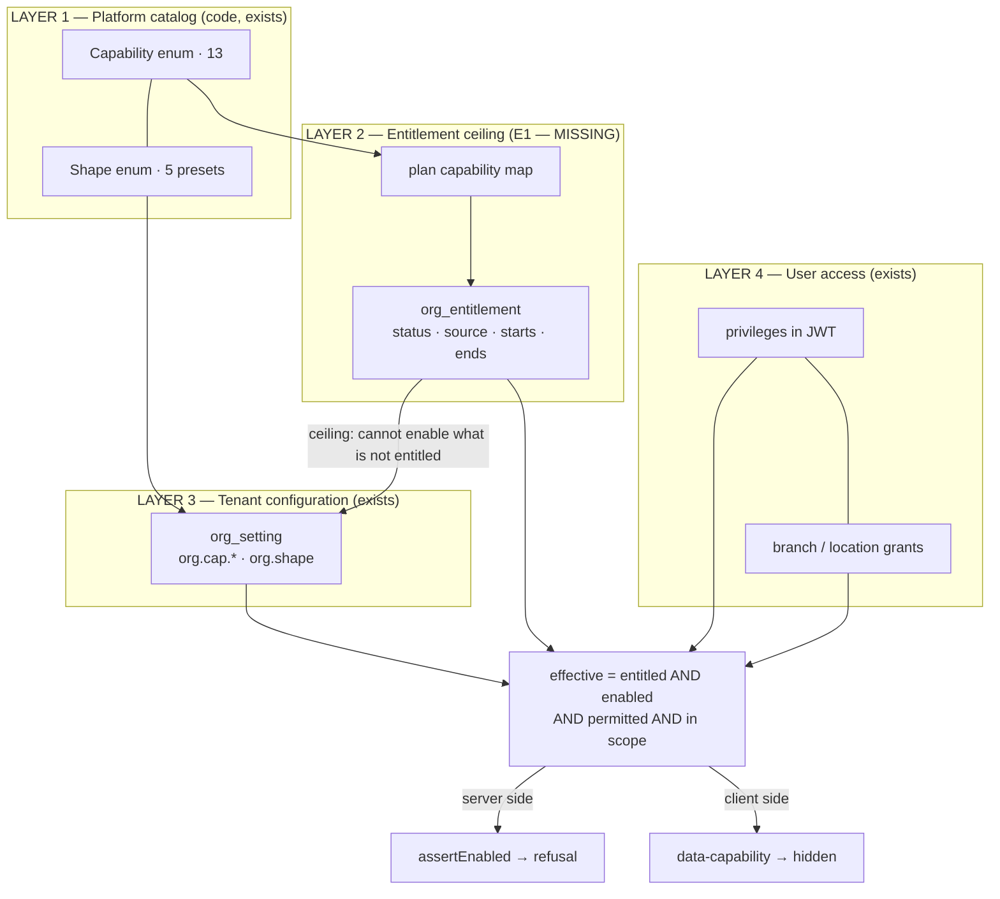

# SaaS control plane — review of the four-layer proposal

**Status:** REVIEWED AND ACCEPTED (owner, 2026-08-31). Rulings D-1..D-4 taken as recommended. **E1, E2 and E3 are ✅ SHIPPED AND GREEN** — see [`slices/e1-entitlement-ceiling.md`](slices/e1-entitlement-ceiling.md).
Raised 2026-08-31 from the proposal
*"platform master admin creates organizations and assigns licensed capabilities; the org owner configures only
what is enabled; a user sees only what their role and branch allow."*

**Read first:** [`vertical-profile-any-business-design.md`](vertical-profile-any-business-design.md) (the two
axes) · [`capability-platform-design.md`](capability-platform-design.md) (C1..C6, shipped) ·
[`SAAS-BUILD-STANDARDS.md`](SAAS-BUILD-STANDARDS.md) · [`ARCHITECTURE-MULTITENANCY.md`](ARCHITECTURE-MULTITENANCY.md)

Every claim below names the artefact it was read from, per the evidence standard in
`vertical-profile-any-business-design.md` §8. Nothing here is recalled.

---

## 1. Verdict

**The proposal is right, and roughly three of its four layers are already shipped and green.** It is not a new
architecture for this platform — it is one missing layer plus two missing operator surfaces.

Two of its corrections were already made here, and made more sharply:

* It proposes `Suite` + `BusinessProfile` + a flat capability list. This repo already separates **shape ×
  capability** (`Shape.java`, `Capability.java`) and the design argues at length (`capability-platform-design.md`
  §4b) why flattening them produces either a fork per business type or a monolith per product.
* It proposes an `OrganizationCapability` table. `org_setting` already is per-tenant configuration with catalog
  defaults, an owner screen that renders itself, and a bounded per-tenant cache (§4a). A second store means two
  answers the day they disagree.

**The one thing it is entirely right about, and that is genuinely missing:**

> An organization owner must not be able to grant themselves a feature they have not purchased.

Today they can. That is finding **F1**, and it is the whole of slice E1.

---

## 2. The four layers, measured against the code

| Proposal layer | Its artefact | What exists here (file / class) | Verdict |
|---|---|---|---|
| **1 Platform Catalog** | `CapabilityDefinition`, `PlatformSuite`, `BusinessProfile` | `common-settings/Capability.java` — **13 values**, code+label+help+`settingKey()`; `common-settings/Shape.java` — **5 shapes**, each with a capability preset | ✅ built. Missing only metadata: maturity, `requires`, `conflicts_with` |
| **2 Tenant Entitlements** | `Plan`, `PlanCapability`, `OrganizationCapability(status, source, starts_at, ends_at)` | `auth/entity/Organization.java` has `plan` (free-text String, default `FREE`), `trialEndsAt`, `entryCap`. **Nothing anywhere maps a plan to a capability** | 🔴 **MISSING — the real gap** |
| **3 Organization Configuration** | `configuration_json` | `org_setting` per service + shared `SettingsController` (`GET/POST /settings`) + self-rendering Configuration screen + `CapabilityService.resolve` (explicit override → shape preset → GENERAL = all) | ✅ built, gated, 23 Cypress tests |
| **4 User Access** | `Role`, `Permission`, `RolePermission`, `UserOrganizationMembership`, `branch_scope` | privilege model seeded in `auth/config/SetupDataLoader.java`, privileges travel in the JWT; `Membership`; role×location grants (multi-location slice) | ✅ built |

### The supporting mechanisms the proposal also asks for

| Asked for | State here | Verdict |
|---|---|---|
| Server-side refusal, not UI hiding | `CapabilityService.assertEnabled` on **6 writes across 4 services** (installments, loose selling, field sales, collections, Rx, dealer pricing) + 2 product-policy writes in catalog | ✅ |
| Platform operator creates tenants | `POST /api/auth/admin/provision-tenant` — `@PreAuthorize("hasAuthority('ROLE_ADMIN')")`, `AuthService.provisionTenant`, plan defaults `PRO`, owner sets own password by reset mail. **API only — no screen anywhere** (grep for `provision-tenant` under `src/` returns zero) | 🟠 half |
| Owner cannot exceed subscription | `SettingsController.save` gates on `ROLE_OWNER or ADMIN_PRIVILEGE`; `SettingsService.set` validates **only** that the key is in the catalog | 🔴 **F1** |
| Assembled dashboard / manifest | `capabilities.js` hides `[data-capability]` (**31 on `businessDashboard.html`**), `dashboard-widgets.js` reorders widgets. But the template is **3,947 lines / 36 `.formDiv` sections**, shipped whole to every tenant | 🟠 partial |
| Field policies | `POS_PRESETS` + `posFieldsFor` (business.js:4339) for POS entry fields; `products.requires_serial` / `tracks_batch` per product | 🟠 two instances, no general mechanism — and that is fine (see §5 R4) |
| Support operator access | grep for `impersonat` across `microservices/**/*.java` hits only unrelated words. **No support-session model exists** | 🔴 **F3** |
| Tenant isolation | `ARCHITECTURE-MULTITENANCY.md` — org_id + `findScoped` + stamped writes + anti-IDOR, enforced across 12 services | ✅ |
| Audit of configuration changes | `audit-service` + `AuditEvent` + outbox exist and are used by business/education/catalog. **`SettingsService.set` writes no audit event** | 🟠 **F5** |

---

## 3. Findings, ordered by cost of leaving them

### F1 🔴 An owner can grant themselves any capability — the entitlement ceiling does not exist

`SettingsService.set(key, value)` refuses a key that is not in the catalog, and nothing else. `org.cap.*` keys
**are** in the catalog — that is how the Configuration screen renders them. So the owner of any tenant can
`POST /settings?key=org.cap.installments&value=true` and hold a paid capability, permanently, at no charge.

This is not a privilege escalation into another tenant — org scoping holds — it is a **licensing** hole, and it
is exactly the rule the proposal puts at its centre. Every other layer is in place to enforce it; the ceiling
itself is what is absent.

### F2 🔴 `Organization.plan` is free text and decides nothing about capability

`plan` is a `String` defaulting to `"FREE"`, compared with `"TRIAL".equals(plan)` and `"DEMO".equals(plan)` in
`OrganizationService.createTenant` for trial dates and entry cap. It never reaches a capability decision. This
is the same **free-text-at-the-column, enumerated-in-code** pattern that
`vertical-profile-any-business-design.md` §2 already flagged for `Organization.type`.

### F3 🔴 No support access model

There is no impersonation, no time-boxed support session, no consent record. In practice, supporting a customer
today means asking for their password — which defeats the audit trail the platform builds everywhere else.

### F4 🟠 Capability staleness becomes a licensing problem once entitlements are real

C3c's documented cost is that capabilities travel in the JWT and go stale **until next login**
(`capability-platform-design.md` §15). That is an acceptable cost for a configuration switch the owner just
flipped. It is not acceptable for a paid boundary: a tenant whose subscription lapsed keeps a valid token
carrying every capability. This needs a ruling before E1 ships — see §6 D-1.

### F5 🟠 Control-plane changes are not audited

A capability toggle, a shape change and (once E1 exists) an entitlement grant are precisely the events an
auditor asks about. `audit-service` is built and already receives events from business, education and catalog
via the outbox pattern; settings writes simply do not emit.

### F6 🟠 Default-ON is the correct migration stance and the wrong entitlement stance

`Capability`'s javadoc: *"Every capability here defaults to enabled… the first slice changes the SOURCE of a
decision, never the decision."* `Shape.GENERAL` presets **everything** on, and every tenant without an
`org.shape` row resolves to GENERAL. That was right for C1. Once a ceiling exists, a capability added **after**
E1 must default to NOT entitled, or the ceiling leaks on every future release. E1 must therefore seed
entitlements from the current effective state — so the deploy is inert for existing tenants — **and** flip the
default for anything new.

### F7 🟢 The operator endpoint has no screen

`provision-tenant` works and is correctly gated on the platform `ROLE_ADMIN`, with a comment explaining why a
privilege gate would have let any owner create tenants. It has no UI, so onboarding a customer today is a curl
command.

---

## 4. What I would build, and in what order

| Slice | Work | Why this order |
|---|---|---|
| **E0** | this review → agree the §5 rejections and the §6 rulings | ✅ accepted 2026-08-31 |
| **E1** | **entitlement ceiling.** Plan→capability map (code-defined, beside `Capability`) + `org_entitlement` table in auth-service (which already owns the capability store per C3c) + `EntitlementService.entitled(org, cap)`. `SettingsService.set` refuses `org.cap.X = true` when not entitled; **switching OFF stays allowed** (the C6 rule: a withdrawn capability must not strand a tenant). Seeded from current state ⇒ inert deploy | ✅ **green** — the only 🔴 with a live licensing cost |
| **E2** | **operator portal screen** — organizations list, provision tenant, change plan, grant/revoke with a required reason. `ROLE_ADMIN` only | ✅ **green** — makes E1 operable; entitlements were curl-only |
| **E3** | ~~freshness~~ → **tenant lifecycle**. The freshness work turned out to be already done (see the E3 analysis §2); the real gap was that `Organization.status` was enforced nowhere, so a customer who never paid kept trading | ✅ **green** |
| **E4** | **audit the control plane** — entitlement grant/revoke, plan change, shape change, capability toggle → `AuditEvent` via the existing outbox | ✅ **green** — [analysis](slices/e4-control-plane-audit-analysis.md) · [design](slices/e4-control-plane-audit-design.md). Closed F5, plus A3 (any user could read the org's trail) and an `INTERNAL_SECRET` gap that would have broken every future background call from auth |
| **E5** | **support session** — reason required, time-boxed, read-only, audited, visible to the tenant | F3. **E4 built its foundations**: `actor_type = PLATFORM_OPERATOR` already distinguishes an outsider's act, and the trail is already stamped against the SUBJECT tenant. E4 also left it §10.4 — a dead-lettered audit event is invisible and unrecoverable, which matters more for access records than for trading ones |
| **E6** | **server-rendered navigation manifest** — replaces shipping 3,947 template lines to every tenant | ties to the front-end perf programme; **not** required by E1..E5 |

Each slice ships a headed Cypress gate per `feedback_cypress_gate_per_slice`, run as the feature's own tenant
**and** across the owner/admin/user ladder per `GATE-RUNBOOK.md`.

### Gates, sketched

| Slice | Spec | The assertions that matter |
|---|---|---|
| E1 | `cypress/e2e/platform/entitlement-ceiling.cy.js` | owner **cannot** switch on an unentitled capability (assert the **envelope**, `success:false` on HTTP 200 — this has bitten three times); owner **can** switch on an entitled one (positive control, or a build refusing every write passes); owner can **always** switch one off; an **expired** entitlement refuses even though the token still carries the capability |
| E2 | `cypress/e2e/platform/operator-portal.cy.js` | operator sees the org list and a **grant control on the screen** — a UI assertion, because an API gate passed for C6 while no shopkeeper could reach the feature; a tenant owner is refused the operator endpoints; a grant is visible on the tenant's own Configuration screen afterwards |
| E4 | `cypress/e2e/platform/control-plane-audit.cy.js` | after a grant and a toggle, `audit-service` holds an event naming actor, org, before and after — assert the **property**, not that a row exists |
| E5 | `cypress/e2e/platform/support-session.cy.js` | support access without a reason is refused; a session expires; every read is audited; the tenant can see the session happened |

---

## 5. What I would NOT build from the proposal, and why

**R1 — no `PlatformSuite` as a routing axis.** `vertical-profile-any-business-design.md` §7 W2 already ruled on
this for "ERP": a suite is a **packaging and positioning** decision — which capabilities a plan bundles and what
navigation calls them — not a thing to build. Routing already keys on shape (C2). A `suite` attribute on
`Capability` for grouping on the operator screen is fine; a suite that decides behaviour is a third axis and
would drift against the other two immediately.

**R2 — no `BusinessProfile` table.** `Shape` plus its preset already *is* the onboarding template, including the
rule the proposal cares about most: **an explicit tenant override beats the preset**, so picking a profile never
destroys a deliberate decision (`CapabilityService.resolve`, and `posFieldsFor` before it).

**R3 — no `OrganizationCapability` table.** Layer 3 stays `org_setting`. What E1 adds is a **different thing**:
`org_entitlement` is the *ceiling* — what was sold, by whom, until when — which genuinely needs the relational
columns the proposal is right about: status, source, dates, history. Ceiling and switch are two questions; one
table answering both is what §4a rejected.

**R4 — no general `FieldPolicy` table yet.** Two field-policy mechanisms exist and both are shipped and gated. A
third, generic one with only two consumers is a framework built ahead of its second use. Revisit when a third
appears.

**R5 — no custom-field builder.** The proposal itself defers this, and its list of forbidden entities (sale line,
payment, stock movement, journal entry, tax posting) matches this repo's hardest-won lesson: *there must never be
two ledgers.*

**R6 — no Healthcare / Talent / Workforce suites.** `vertical-profile-any-business-design.md` §7 measured each
against the code: HRMS is ~40% built **in the wrong service** (education-service owns `Staff`, `LeaveRequest`,
`Substitution`), and W1's standing rule is to extract it domain-free at the *second* consumer, not to launch a
suite. Nothing in this proposal changes that.

---

## 6. Rulings needed before E1 starts

**D-1 — how does a revoked entitlement take effect?** The capability set is a JWT claim (C3c). Options:
(a) accept staleness until next login, as configuration does today; (b) `assertEnabled` re-reads entitlement from
auth-service on the write path — a cross-service call on paths deliberately kept call-free
(`feedback_performance_priority`); (c) a short-TTL cached entitlement read in `common-settings`, refreshed like
the settings cache. **Recommendation: (c)** — the ceiling changes rarely and is read often, which is exactly what
a bounded per-tenant cache is for, and it keeps the hot path off the network.

**D-2 — where does `org_entitlement` live?** auth-service, because C3c already made it the owner of the
capability store and the token minter. Worth confirming, because it puts a commercial concern in the auth
database.

**D-3 — is the plan→capability map code or data?** `FREE` / `TRIAL` / `PRO` / `DEMO` exist as strings today.
**Recommendation: code**, matching `Shape.preset()`, with `org_entitlement` as the per-tenant deviation — the
preset-plus-override pattern the platform has already proven twice. Data means an operator can change what a
plan includes without a deploy, at the cost of a second place where pricing lives.

**D-4 — do `entryCap` and trial expiry fold into entitlements?** They answer the same question — *what has this
tenant bought?* — in two places today.

---

## 7. One practical note

The working tree currently carries **48 changed or untracked files**: the bonus-schemes slice, sale-report-by-
company, the stock-check setting and pack/loose work. E1 touches `common-settings`, `auth-service` and the
Configuration screen. Landing the in-flight work first keeps the entitlement diff readable, and keeps a
control-plane bug from being bisected against unrelated commerce changes.
