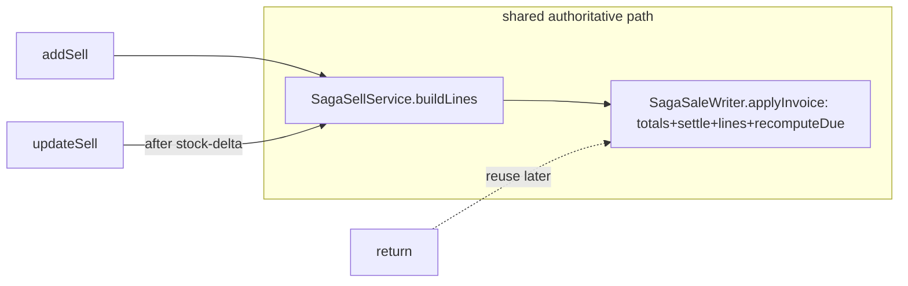
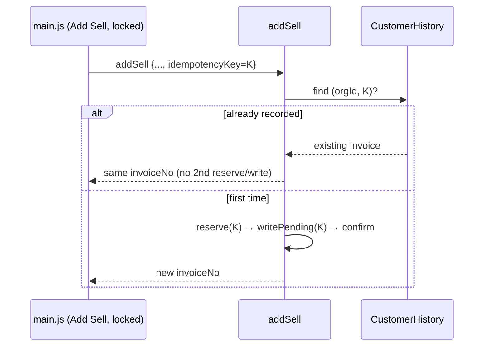

# Sale Flow — Audit, Bugs & Gaps, and Backlog

**Branch:** `feature/finance-ledger` · **Status of this doc:** Document phase only. **Every item below advances only on explicit confirmation** (Document → Design → Implementation → Testing), initiated by either side. Nothing here is implemented yet unless its row says so.

> Workflow rule (also in memory): no design/implementation/testing starts without confirmation. User runs all builds/restarts/Cypress; Flyway for every schema change; Cypress gate per slice.

## 1. Scope audited
End-to-end sale form: **Sale** (`main.js` → `SagaSellService` → `SagaSaleWriter`), **Edit** (`SellController.updateSell`), **Return** (`SellController.saleReturn`), and **Display** (`getSellInvoice`, `getReceipt`, Sale Detail Report). Payments/dues via `recomputeDue` + finance-service (Receive Payment).

## 2. Current flow (as-is)

```mermaid
flowchart TD
    subgraph Sale[Sale · addSell]
      A[main.js cart + tenders] --> B[SagaSellService: price + tax + DISCOUNTED base]
      B --> C[reserve stock FEFO]
      C --> D[SagaSaleWriter.writePending: totals + settle + lines PENDING]
      D --> E[confirm stock -> CONFIRMED]
    end
    subgraph Edit[Edit · updateSell]
      F[loadSellForEdit: clears Received] --> G[stock delta reserve/return]
      G --> H[delete + recreate lines from CLIENT data]
      H --> I[header paid/due from CLIENT only]
    end
    subgraph Return[Return · saleReturn]
      J[return qty guard] --> K[inventory returnStock / import]
      K --> L[refund tender + reduce line pro-rata]
      L --> M[re-settle header totals + recomputeDue]
    end
```

**Divergence:** Sale computes totals+tax+discount **server-side (authoritative)**; Edit **trusts the client** and does **not** recompute totals — this is the root of the High bugs.

## 3. What's already solid
Money in `BigDecimal`; server-side tax service (incl/excl); saga stock (reserve→PENDING→confirm) + recovery relay; **due is derived** (`recomputeDue`); Return restores stock via inverse saga with pro-rata partials + header re-settle; anti-IDOR + role scoping throughout.

## 4. Bugs & gaps (backlog)

Legend — Phase: ⬜ not started · 🟨 in progress · ✅ done. All rows are ⬜ (Document only) unless noted.

### 🔴 High

| ID | Bug / gap | Where | Impact | Doc | Design | Impl | Test |
|----|-----------|-------|--------|-----|--------|------|------|
| SF-1 | `updateSell` never recomputes invoice totals — FIXED via shared `SagaSaleWriter.applyInvoice` (used by add+edit) | `SagaSaleWriter.applyInvoice`, `SellController.updateSell` | Edit now recomputes subTotal/taxTotal/grandTotal; `Σ lines == grandTotal` | ✅ | ✅ | ✅ | ✅ |
| SF-2 | `updateSell` rebuilt lines from client — FIXED via shared `SagaSellService.buildLines` (tax on discounted base + discount + catalogPrice + soldRate) | `SagaSellService.buildLines` | Edit no longer reverts the discount fix; add/edit converge | ✅ | ✅ | ✅ | ✅ |
| SF-3 | Duplicate-invoice on retry/double-submit — FIXED: client key per checkout + submit lock; server dedup on (org,key) + unique index (Flyway V10) | `SagaSellService.addSell`, `CustomerHistory(DTO/entity/repo)`, `main.js`, monolith DTO | Same checkout → one invoice; retry returns same invoiceNo | ✅ | ✅ | ✅ | ✅ |

**SF-1 + SF-2 recommended together:** extract a shared `recomputeInvoice(ch, lines)` (totals + tax + discount + catalog snapshot) used by **add, edit and return** so there is ONE authoritative compute path.

### 🟡 Medium

| ID | Bug / gap | Where | Impact | Doc | Design | Impl | Test |
|----|-----------|-------|--------|-----|--------|------|------|
| SF-4 | Edit clears "Received" — FIXED: edit shows prior **"Already paid"** + preserves it server-side; Received = ADDITIONAL payment; due preview counts prior paid | `business.js` loadSellForEdit/calculateChange, `applyInvoice` | Prior payment no longer forgotten on edit; covered by green `sale-discount.cy.js` "EDIT is authoritative … prior payment preserved" | ✅ | ✅ | ✅ | ✅ |
| SF-5 | Return refund doesn't reduce header `paidAmount`; customer credit floored to 0 (lost) — **FIXED (Model A, cash-refund):** `saleReturn` now reconciles the header — `refund = max(0, paidAmount − newGrandTotal)`, drops `paidAmount` to the retained amount, `due = paid − grandTotal (≤0)`. Paid sale refunds only the overpayment; unpaid credit-sale refunds nothing (over-refund bug also fixed). Header `paidAmount` and the REFUND payment-line ledger now agree. | `SellController.saleReturn` | Credit no longer vanishes; credit sale no longer over-refunds. **Store-credit ledger (Model B) deferred to a finance slice.** | ✅ | ✅ | ✅ | ✅ |
| SF-6 | No-tender sale (received 0, not CREDIT) — **RESOLVED by the SF-1/SF-2 `applyInvoice` refactor:** a new sale with no tenders sets `paidAmount = 0` (never null) and `due = 0 − grandTotal`. | `SagaSaleWriter.applyInvoice` | Unpaid non-credit sales are consistent (paid 0, due = −bill) | ✅ | ✅ | ✅ | ✅ |

### 🟢 Low / standards

| ID | Bug / gap | Where | Impact | Doc | Design | Impl | Test |
|----|-----------|-------|--------|-----|--------|------|------|
| SF-7 | Client-side float money math for cashier change/due preview — **FIXED:** round to 2dp in `calculateChange`/`refreshAccountDuePreview` (display only; server already authoritative) | `business.js` calculateChange | On-screen change/due no longer shows float drift | ✅ | ✅ | ✅ | ✅ (display-only, no spec) |
| SF-8 | Submit guard precedence — FIXED: grouped explicitly + allows editing a fully-paid invoice | `main.js` 389 | No-item owing state no longer slips through; fully-paid edit submittable | ✅ | ✅ | ✅ | ✅ |
| SF-9 | Cart shows discount value but not type (amount vs %) — **FIXED:** cart cell renders "10%" (percent) or "10 (Amt)" (fixed) | `business.js` cart row | Discount type unambiguous in the cart | ✅ | ✅ | ✅ | ✅ (display-only, no spec) |
| SF-10 | No line-level cost ⇒ no true margin/profit — **IMPLEMENTED:** `Sell.cost_price` (Flyway V12) snapshotted at sale time from the product's latest local purchase rate (`buildLines`→`SagaLine`→`applyInvoice`); Sale Detail Report gains a **Margin** column (= net − cost×qty) + total. Cost source (a) = latest purchase rate (self-contained; no inventory/contracts rebuild). Legacy/never-purchased lines show blank. | `Sell`, `SellDTO`, `SagaLine`, `SagaSellService.buildLines`, `PurchaseRepo.findRecentCosts`, `SagaSaleWriter`, report JS/HTML | Reports now show per-line margin | ✅ | ✅ | ✅ | ✅ (`sale-margin.cy.js`) |
| SF-11 | Return has no reason / credit-note document — **IMPLEMENTED:** new `SaleReturn` record (Flyway V13: invoice/line/qty/reason/refund/org/user/date) written on every `saleReturn`; the return dialog's Reason field (already present) is now persisted; `GET /getSaleReturns` audit list (+ monolith proxy). | `SaleReturn`, `SaleReturnRepo`, `SellController.saleReturn`/`getSaleReturns`, monolith proxy | Returns now have an auditable credit-note stub | ✅ | ✅ | ✅ | ✅ (`sale-return-audit.cy.js`) |

## 5. Missing vs. standard POS/commerce backend
- One authoritative compute path for add **and** edit (SF-1/SF-2).
- Idempotent order submission (SF-3).
- Customer credit / overpayment ledger — overpayments + return-credits currently vanish (SF-5); natural home = finance-service.
- Void/cancel as a first-class audited action (distinct from row delete).
- Edit = payment-aware (show paid-to-date, add a payment) — partly served by Receive Payment.

## 6. Related pending todos (project backlog)

| Task | Status | Doc | Design | Impl | Test |
|------|--------|-----|--------|------|------|
| #2 Receive Payment / AR subledger (finance-service) | ✅ DONE (built, green) | ✅ | ✅ | ✅ | ✅ |
| #1 Purchase Return (end-to-end) | Pending — decisions open (stock-only vs vendor payable; UI) | ✅ | ⬜ | ⬜ | ⬜ |
| Finance Phase 2 — AP subledger (vendor payments; pairs with Purchase Return) | Pending | ⬜ | ⬜ | ⬜ | ⬜ |
| #3 Full General Ledger (double-entry) | Pending — after AR+AP | ⬜ | ⬜ | ⬜ | ⬜ |
| Customer-due clobber fix (profile edit) | ✅ DONE (on this branch) | ✅ | ✅ | ✅ | ✅ |
| Sale discount → due fix (addSell) | ✅ DONE (on this branch) | ✅ | ✅ | ✅ | ✅ |
| Write off expired stock (Product screen) | Deferred (flagged) | ⬜ | ⬜ | ⬜ | ⬜ |
| `adjustStock` DECREASE ↔ batch reconcile (product-side) | ✅ DONE (applyStockDelta) | ✅ | ✅ | ✅ | ✅ |

## 6a. DESIGN — SF-1 + SF-2 (make `updateSell` authoritative)  ⟵ awaiting approval to implement

**Goal:** one authoritative compute path so **add, edit (and return)** produce identical totals, tax, discount and catalog snapshots. Today add = saga-authoritative, edit = client-trusted.

**Root cause recap:** `updateSell` recreates lines from client data (no server tax, no discount, no catalogPrice) and never recomputes `grandTotal/subTotal/taxTotal`.

### Refactor (2 extractions + edit rewrite)

1. **`SagaSellService.buildLines(CustomerHistoryDTO dto) : List<SagaLine>`** — extract the existing per-line loop (catalog price + `soldRate` + `resolveDiscount` + tax on the **discounted base** + `catalogPrice` snapshot). `addSell` calls it, then derives its reservation lines from the returned `SagaLine`s (productId + qty). **No behaviour change for add.**

2. **`SagaSaleWriter.applyInvoice(CustomerHistory ch, List<SagaLine> lines, CustomerHistoryDTO dto, AuthenticatedUser user, boolean replaceLines)`** — extract from `writePending`: compute `subTotal/taxTotal/grandTotal`, settle, save header, (optionally) delete existing `Sell` lines, write authoritative `Sell` lines (discount + catalogPrice + tax + soldRate), `recomputeDue`. `writePending` calls it with `replaceLines=false`; `updateSell` with `replaceLines=true`.

3. **`SellController.updateSell`** keeps its edit-only concerns (anti-IDOR, keep `invoiceSeq/invoiceNo`, **stock-delta** reserve/return), then replaces its hand-rolled lines + header block with:
   `List<SagaLine> lines = sagaSellService.buildLines(dto); sagaSaleWriter.applyInvoice(ch, lines, dto, user, true);`

### Key decision — settlement on EDIT (needs your pick)
Edit clears "Received", so no new tender is usually sent. Authoritative model (mirrors the Return path `paid − grandTotal`):
- **Default (recommended):** keep the invoice's **existing `paidAmount`**; if the cashier enters a new payment on edit, **add** that tender; then `due = paid − grandTotal` (server total). Fixes SF-1/SF-2 AND stops the edit from forgetting prior payment (bonus toward SF-4). Behaviour change: the client-sent `dueAmount` is no longer trusted — the server derives it.
- **Alternative (minimal):** keep trusting client `paid/due`, only recompute totals + lines. Smaller change but leaves due/total able to disagree.

### Files
`SagaSellService.java`, `SagaSaleWriter.java`, `SellController.java` (business-service only). No schema change, no contracts/monolith change.

### Test plan (Cypress + logic)
- Edit a discounted sale → `grandTotal` = discounted net, `due` correct (discount NOT reverted on edit) — extends `sale-discount.cy.js`.
- Edit changing qty → `grandTotal/subTotal/taxTotal` recomputed; `Σ lines == grandTotal`; due = paid − grandTotal.
- Edit preserves prior payment (no re-entry needed).
- Regression: `product-crud.cy.js` sold-rate/catalog-snapshot still pass on edited lines.

---

## 6b. DESIGN — SF-3 (idempotent sale submission)  ⟵ awaiting approval to implement

**Goal:** the same "complete sale" applied twice (double-click, network retry) records **one** invoice, reserves stock **once**, charges the due **once**.

**Root cause recap:** `SagaSellService.addSell` mints a **fresh UUID per call**, and `writePending` always inserts a new `CustomerHistory` — so two calls = two invoices. No client submit-lock.

### Design — client-supplied key + server dedup + DB guard + submit lock

1. **Client key per CHECKOUT (not per HTTP call).** `main.js` generates `window.saleIdempotencyKey` once per sale attempt (first cart interaction / form open), sends it in the `customerHistory` payload, and **resets it only after a SUCCESS** — so a retry of the same sale reuses the same key, but the next sale gets a new one. Edits (`updateSell`) are naturally keyed by invoice id and out of this scope.
2. **Submit lock.** Disable the Add Sell trigger during the in-flight request (in `jsonPost`), re-enable on completion — stops the double-click at the source.
3. **DTO carries it.** Add `idempotencyKey` to `CustomerHistoryDTO` (monolith proxy already passes the DTO through unchanged).
4. **Server dedup.** `addSell` uses `dto.getIdempotencyKey()` when present (else generates one, backward-compatible). **Before** reserving/writing, look up an existing invoice for `(orgId, idempotencyKey)`; if found, **return its invoiceNo** — no second reserve, no second write. The same key also drives the inventory reserve (already idempotent per key), so a retry re-holds the same stock.
5. **DB guard (race).** Flyway **unique index** on `customer_history(organization_id, idempotency_key)` so two *concurrent* retries that both pass the pre-check can't both insert — the loser catches the constraint violation and returns the existing invoice. (MySQL allows multiple NULLs, so legacy non-saga rows are unaffected.)

### Files
`CustomerHistoryDTO` (+field), `SagaSellService.addSell` (use+dedup), `CustomerHistoryRepo` (finder), Flyway `V#__ch_idempotency_unique.sql` (unique index), `main.js` (key lifecycle + submit lock). business-service + monolith; **one Flyway migration**; no contracts change.

### Test plan
- Two `addSell` calls with the **same** idempotencyKey → **one** invoice; second returns the same invoiceNo; customer due charged once; stock reserved once.
- Different keys → two invoices (normal).
- (Manual) double-click Add Sell → button disabled, single invoice.

---

## 7. Recommended order (each awaits confirmation)
1. **SF-1 + SF-2** — make edit authoritative (shared `recomputeInvoice`). Highest impact; also protects the discount fix.
2. **SF-3** — idempotent submission.
3. **SF-4 + SF-5** — edit paid prefill + return credit (ties to a customer-credit ledger in finance-service).
4. **SF-6, SF-8** — settle/guard hardening.
5. **SF-7, SF-9, SF-10, SF-11** — polish / standards.
