# Sale Flow — Audit, Bugs & Gaps, and Backlog

**Branch:** `feature/finance-ledger` · **Status of this doc:** Document phase only. **Every item below advances only on explicit confirmation** (Document → Design → Implementation → Testing), initiated by either side. Nothing here is implemented yet unless its row says so.

> Workflow rule (also in memory): no design/implementation/testing starts without confirmation. User runs all builds/restarts/Cypress; Flyway for every schema change; Cypress gate per slice.

## 1. Scope audited
End-to-end sale form: **Sale** (`main.js` → `SagaSellService` → `SagaSaleWriter`), **Edit** (`SellController.updateSell`), **Return** (`SellController.saleReturn`), and **Display** (`getSellInvoice`, `getReceipt`, Sale Detail Report). Payments/dues via `recomputeDue` + finance-service (Receive Payment).

## 2. Current flow (as-is)

```mermaid
flowchart TD
    subgraph Sale[Sale · addSell]
      A[main.js cart + tenders] --> B[SagaSellService: price + tax + DISCOUNTED base]
      B --> C[reserve stock FEFO]
      C --> D[SagaSaleWriter.writePending: totals + settle + lines PENDING]
      D --> E[confirm stock -> CONFIRMED]
    end
    subgraph Edit[Edit · updateSell]
      F[loadSellForEdit: clears Received] --> G[stock delta reserve/return]
      G --> H[delete + recreate lines from CLIENT data]
      H --> I[header paid/due from CLIENT only]
    end
    subgraph Return[Return · saleReturn]
      J[return qty guard] --> K[inventory returnStock / import]
      K --> L[refund tender + reduce line pro-rata]
      L --> M[re-settle header totals + recomputeDue]
    end
```

**Divergence:** Sale computes totals+tax+discount **server-side (authoritative)**; Edit **trusts the client** and does **not** recompute totals — this is the root of the High bugs.

## 3. What's already solid
Money in `BigDecimal`; server-side tax service (incl/excl); saga stock (reserve→PENDING→confirm) + recovery relay; **due is derived** (`recomputeDue`); Return restores stock via inverse saga with pro-rata partials + header re-settle; anti-IDOR + role scoping throughout.

## 4. Bugs & gaps (backlog)

Legend — Phase: ⬜ not started · 🟨 in progress · ✅ done. All rows are ⬜ (Document only) unless noted.

### 🔴 High

| ID | Bug / gap | Where | Impact | Doc | Design | Impl | Test |
|----|-----------|-------|--------|-----|--------|------|------|
| SF-1 | `updateSell` never recomputes invoice totals (`grandTotal`/`subTotal`/`taxTotal`) — sets only paid/due | `SellController` ~586-587 (Return path recomputes at 755-757) | After any edit, receipt/report/tax show stale totals; `grandTotal ≠ Σ lines` | ✅ | ⬜ | ⬜ | ⬜ |
| SF-2 | `updateSell` recreates lines from client data — no server tax recompute; **drops `discount` + `catalogPrice`**; `sellRate=total/qty` | `SellController` 597-615 | Editing a discounted sale **silently reverts the discount fix**; tax = whatever client sent; add/edit diverge | ✅ | ⬜ | ⬜ | ⬜ |
| SF-3 | Duplicate-invoice risk on retry/double-submit — `idempotencyKey` is a fresh UUID per call; `writePending` not deduped; no client submit-lock | `SagaSellService.addSell` + `main.js` | Network retry / double-click can create two invoices | ✅ | ⬜ | ⬜ | ⬜ |

**SF-1 + SF-2 recommended together:** extract a shared `recomputeInvoice(ch, lines)` (totals + tax + discount + catalog snapshot) used by **add, edit and return** so there is ONE authoritative compute path.

### 🟡 Medium

| ID | Bug / gap | Where | Impact | Doc | Design | Impl | Test |
|----|-----------|-------|--------|-----|--------|------|------|
| SF-4 | Edit clears "Received" and never shows amount already paid (prefill commented out) | `business.js` 249/269-270 | Cashier re-keys payment; wrong due if not re-entered | ✅ | ⬜ | ⬜ | ⬜ |
| SF-5 | Return refund doesn't reduce header `paidAmount`; customer credit floored to 0 (lost) | `saleReturn` 758 + `recomputeDue` | Invoice shows paid > grandTotal; return/overpay credit vanishes (no customer-credit concept) | ✅ | ⬜ | ⬜ | ⬜ |
| SF-6 | No-tender sale (received 0, not CREDIT) skips `settle` → `paidAmount` may be null | `main.js` 412 + `SagaSaleWriter` 73-81 | Inconsistent paid/due for unpaid non-credit sales | ✅ | ⬜ | ⬜ | ⬜ |

### 🟢 Low / standards

| ID | Bug / gap | Where | Impact | Doc | Design | Impl | Test |
|----|-----------|-------|--------|-----|--------|------|------|
| SF-7 | Client-side float money math for cashier change/due preview | `business.js` calculateChange/calculateNetSell | On-screen number can drift (persisted data safe — server recomputes) | ✅ | ⬜ | ⬜ | ⬜ |
| SF-8 | Submit guard precedence `A && B && C || D` fragile | `main.js` 389 | Edge-case sales may be blocked/allowed unexpectedly | ✅ | ⬜ | ⬜ | ⬜ |
| SF-9 | Cart shows discount value but not type (amount vs %) | sell cart | Minor UX ambiguity | ✅ | ⬜ | ⬜ | ⬜ |
| SF-10 | No line-level cost ⇒ no true margin/profit anywhere | data model | Reports can't show profit | ✅ | ⬜ | ⬜ | ⬜ |
| SF-11 | Return has no reason / credit-note document | `saleReturn` | Weak audit trail on returns | ✅ | ⬜ | ⬜ | ⬜ |

## 5. Missing vs. standard POS/commerce backend
- One authoritative compute path for add **and** edit (SF-1/SF-2).
- Idempotent order submission (SF-3).
- Customer credit / overpayment ledger — overpayments + return-credits currently vanish (SF-5); natural home = finance-service.
- Void/cancel as a first-class audited action (distinct from row delete).
- Edit = payment-aware (show paid-to-date, add a payment) — partly served by Receive Payment.

## 6. Related pending todos (project backlog)

| Task | Status | Doc | Design | Impl | Test |
|------|--------|-----|--------|------|------|
| #2 Receive Payment / AR subledger (finance-service) | ✅ DONE (built, green) | ✅ | ✅ | ✅ | ✅ |
| #1 Purchase Return (end-to-end) | Pending — decisions open (stock-only vs vendor payable; UI) | ✅ | ⬜ | ⬜ | ⬜ |
| Finance Phase 2 — AP subledger (vendor payments; pairs with Purchase Return) | Pending | ⬜ | ⬜ | ⬜ | ⬜ |
| #3 Full General Ledger (double-entry) | Pending — after AR+AP | ⬜ | ⬜ | ⬜ | ⬜ |
| Customer-due clobber fix (profile edit) | ✅ DONE (on this branch) | ✅ | ✅ | ✅ | ✅ |
| Sale discount → due fix (addSell) | ✅ DONE (on this branch) | ✅ | ✅ | ✅ | ✅ |
| Write off expired stock (Product screen) | Deferred (flagged) | ⬜ | ⬜ | ⬜ | ⬜ |
| `adjustStock` DECREASE ↔ batch reconcile (product-side) | ✅ DONE (applyStockDelta) | ✅ | ✅ | ✅ | ✅ |

## 7. Recommended order (each awaits confirmation)
1. **SF-1 + SF-2** — make edit authoritative (shared `recomputeInvoice`). Highest impact; also protects the discount fix.
2. **SF-3** — idempotent submission.
3. **SF-4 + SF-5** — edit paid prefill + return credit (ties to a customer-credit ledger in finance-service).
4. **SF-6, SF-8** — settle/guard hardening.
5. **SF-7, SF-9, SF-10, SF-11** — polish / standards.
