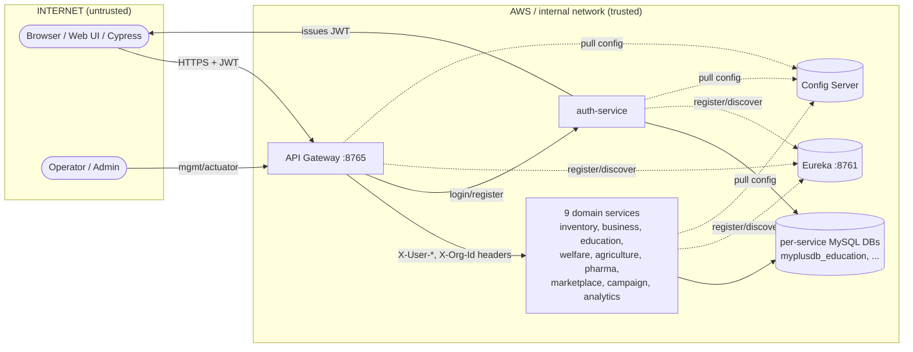
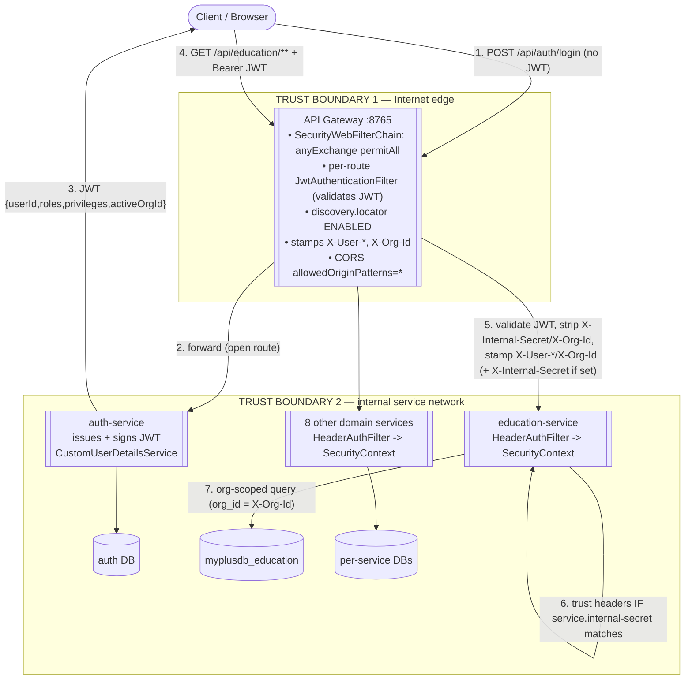

# MyPlus Microservices — Data Flow Diagram & Security Findings

> Pre-AWS review. Built from actual wiring in `api-gateway/src/main/resources/application.yml`,
> `JwtAuthenticationFilter.java`, `HeaderAuthFilter.java`, and per-service `SecurityConfig`.
> **Status: for your review — no remediation applied yet** (except the generated-password fix, F6).

---

## 1. Level-0 Context DFD

---

## 2. Level-1 DFD with trust boundaries

**Data the gateway stamps onto every authenticated request:** `X-User-Id`, `X-User-Email`,
`X-User-Roles`, `X-User-Privileges`, `X-Org-Id`, and (only if configured) `X-Internal-Secret`.
Downstream `HeaderAuthFilter` builds the `AuthenticatedUser` (incl. `organizationId`) from these.

---

## 3. Findings (mapped to the DFD)

| # | Sev | Location | Issue | Recommended fix |
|---|-----|----------|-------|-----------------|
| **F1** | **High** | GW — `application.yml:9-12` `discovery.locator.enabled: true` | Eureka discovery locator auto-creates a catch-all route `/{service-id}/**` to **every** registered service. Those auto-routes do **not** carry the `JwtAuthenticationFilter`, so `GET /education-service/api/education/**` can reach a service **bypassing JWT validation entirely**. | Disable the locator (`enabled: false`) and keep only explicit routes, **or** apply `JwtAuthenticationFilter` as a `default-filter` so it covers every route. |
| **F2** | **High** | GW `JwtAuthenticationFilter.java:36` + `HeaderAuthFilter.java:33` | The internal shared-secret defense (`gateway.internal-secret` / `service.internal-secret`) defaults to **empty = not enforced**. If any service port is reachable on the network, a client can hit it directly and **forge `X-User-*` / `X-Org-Id` headers** → full auth bypass and cross-tenant data access. | On AWS: (a) set a strong `internal-secret` on gateway + all services, and (b) put services in a private subnet / security group so **only the gateway** can reach them. Both layers, not one. |
| **F3** | **Med-High** | GW `JwtAuthenticationFilter.java:101-109` | The filter explicitly removes inbound `X-Internal-Secret` and `X-Org-Id`, but **not** `X-User-Id/Email/Roles/Privileges`, before stamping its own. Depending on builder semantics a client-supplied `X-User-*` may survive as a duplicate header value that `request.getHeader()` reads first. | Explicitly strip **all** `X-User-*` and `X-Org-Id` headers from the inbound request at the top of the filter, then stamp. Removes ambiguity regardless of builder behavior. |
| **F4** | **Med** | GW `application.yml:13-26` | CORS `allowedOriginPatterns: "*"` **combined with** `allowCredentials: true` allows any origin to make credentialed cross-origin calls. | Replace `*` with an explicit allow-list of your real front-end origin(s). |
| **F5** | **Med** | GW `application.yml:104` | JWT signing secret has a **hardcoded base64 default** committed in the repo. If `JWT_SECRET` env var isn't set in prod, tokens are signed with a publicly-known key → **anyone can forge valid JWTs**. | Require `JWT_SECRET` (and the auth-service signing key) via env/secrets manager; fail startup if absent. Rotate the committed value. |
| **F6** | ~~Low~~ Done | `common-security` + gateway app | "Using generated security password" — default Spring user on 9 servlet services + gateway. **Already fixed** (empty `UserDetailsService` in `CommonSecurityAutoConfiguration`; reactive auto-config excluded on gateway). | ✅ Resolved. |
| **F7** | Info | GW `config/SecurityConfig.java:19` | `.anyExchange().permitAll()` means the gateway's security chain enforces nothing; all auth depends on the per-route filter. This is the mechanism behind F1 — anything not routed through `JwtAuthenticationFilter` is open. | Acceptable *if* F1 is fixed and every protected route is filter-covered; otherwise tighten. |

---

## 4. Trust-boundary summary

- **TB1 (Internet → Gateway):** JWT is the only credential. Enforced **per-route**, not globally (F7) → gaps via discovery locator (F1) and the public default secret (F5).
- **TB2 (Gateway → Services):** Services *trust headers* for identity + tenant. The only thing stopping header spoofing is network isolation + the internal secret — **both currently off by default** (F2/F3).

**Net:** the highest-priority items before AWS are **F1, F2, F5** — each is independently an auth-bypass path. F3/F4 are hardening.

---

## 5. Suggested remediation order

1. **F5** — externalize/rotate `JWT_SECRET` (fastest, highest impact).
2. **F1** — disable discovery locator or globally apply the JWT filter.
3. **F2** — set internal secret + private subnet/security group for services.
4. **F3** — strip all inbound identity headers at the gateway.
5. **F4** — lock down CORS origins.

---

## 6. Additional findings — full-stack review (2026-06-07)

Extends §3 across the monolith + data/observability layers (the table above was gateway-scoped).
Remediation designed in [`docs/prod-hardening.md`](../../../docs/prod-hardening.md).

| # | Sev | Location | Issue | Fix (phase) |
|---|-----|----------|-------|-------------|
| **F8** | **Critical** | every `application.yml`, `persistence.properties`, `application.properties`, `docker-compose.yml` | Beyond F5: **real DB password** (`Technology@2025!`), **Gmail app password** (`cablbimiovkcqqxy`) + a second mail password, **reCAPTCHA secret**, and config/eureka basic-auth are all committed defaults — public on GitHub. | Remove from repo, env injection, **rotate all** (P1). |
| **F9** | **High** | all services + monolith (`ddl-auto: update`, `hbm2ddl.auto=update`) | Hibernate manages prod schema → drift/data-loss risk; no migration history. | Flyway + `ddl-auto: validate` in prod (P3/P4). |
| **F10** | **Med-High** | gateway `application.yml:110`, auth `SecurityConfig.java:72`, `configs/application.yml:33` | Actuator over-exposed: gateway `gateway` endpoint (route read/modify), auth `permitAll("/actuator/**")`, `health.show-details: always`. | Prod: `health,info` only, details `never`, mgmt off public (P3). |
| **F11** | **Med** | `configs/application.yml:57-58` | `org.hibernate.orm.jdbc.bind: TRACE` logs **bound parameter values** (PII, credential material during auth) to logs. | Prod logging → `WARN` (P3). |
| **F12** | **High** | monolith `SecSecurityConfig.java:85` `.csrf(disable)` | Session + remember-me cookie + server-rendered forms → CSRF-exposed on state-changing endpoints. (Stateless JWT services are fine without CSRF.) | Re-enable CSRF + token wiring (P5, dedicated). |
| **F13** | **Med** | CSV-import endpoints (education `/impStudents`, `/importCSV`) + monolith | No `spring.servlet.multipart.max-*` limits → unbounded upload DoS. | Set multipart limits (P3). |
| **F14** | **Low** | 69 `printStackTrace()` across 19 files | Noisy/uncontrolled error output; potential info leak. | Replace with logger (deferred cleanup). |
| **F15** | **Med** | auth `SetupDataLoader`, monolith `SetupDataLoader` | Seeded default admin (`admin@myplus.com / Admin@2025!`) + seeded users with trivial passwords (`super/super`, phone numbers). | Seed-flag off in prod; admin pw via env (P3); rotate. |
| **F16** | **Low** | `microservices/logs/*.log` tracked in git | Runtime logs versioned (noise, possible data leak). | gitignore + untrack (P1). |
| **F17** | **Med** | dependencies (Dependabot: 232 alerts) | Known-CVE transitive deps. | CI dependency-scan gate + upgrades. |

**Good (no action):** no SQL injection (JPA parameter binding throughout), BCrypt password hashing,
`open-in-view: false`, gateway correctly strips `X-Internal-Secret`/`X-Org-Id` (F3 extends this to all
identity headers).

### Updated pre-AWS priority
Auth-bypass first — **F5, F1, F2, F3** (gateway/identity) and **F8** (rotate all leaked secrets) — then
**F9, F10, F11, F12** hardening, then **F4, F13, F15, F17**.
