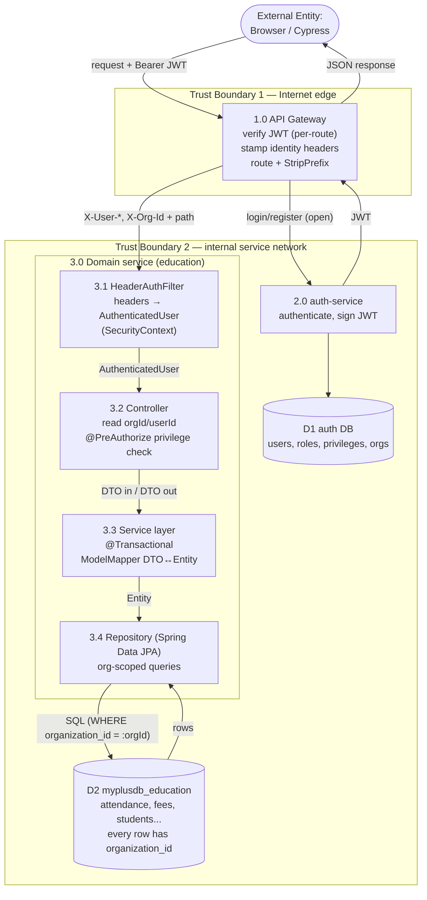

# MyPlus — End-to-End Data Flow Diagram (UI → DB)

> Full request lifecycle, grounded in a real trace:
> `Browser → /api/education/getUserA + Bearer JWT → API Gateway → education-service →
> AttendanceController.getUserA() → AttendanceRepository.findScoped(orgId, userId) → MySQL`.
> Layered pattern per `CLAUDE.md`: Controller → Service → Repository, ModelMapper DTO↔Entity.

---

## 1. End-to-end sequence (login, then an authenticated read)

```mermaid
sequenceDiagram
    autonumber
    actor U as Browser / UI
    participant GW as API Gateway :8765
    participant AU as auth-service
    participant ADB as auth DB
    participant ED as education-service
    participant HF as HeaderAuthFilter
    participant CT as AttendanceController
    participant RP as AttendanceRepository (JPA)
    participant DB as myplusdb_education

    Note over U,ADB: A. Authentication (open route, no JWT)
    U->>GW: POST /api/auth/login {email, pwd}
    GW->>AU: forward (OPEN_API_ENDPOINTS, JWT filter skipped)
    AU->>ADB: load user + roles/privileges + activeOrgId
    ADB-->>AU: user record
    AU-->>U: 200 { JWT(userId, roles, privileges, activeOrgId) }

    Note over U,DB: B. Authenticated data request
    U->>GW: GET /api/education/getUserA  (Authorization: Bearer JWT)
    GW->>GW: JwtAuthenticationFilter: verify signature + expiry
    GW->>GW: strip inbound X-Org-Id/X-Internal-Secret; stamp X-User-*, X-Org-Id
    GW->>ED: GET /getUserA (StripPrefix=2) + identity headers
    ED->>HF: filter chain
    HF->>HF: build AuthenticatedUser{userId, orgId, authorities} into SecurityContext
    HF->>CT: dispatch
    CT->>CT: orgId() / userId() from AuthenticatedUser
    CT->>RP: findScoped(orgId, userId)
    RP->>DB: SELECT ... WHERE organization_id = :orgId OR (org_id IS NULL AND user_id = :userId)
    DB-->>RP: rows (tenant-scoped)
    RP-->>CT: List<Attendance>
    CT->>CT: toDto() map Entity→DTO
    CT-->>ED: GenericResponse(SUCCESS, [AttendanceDTO])
    ED-->>GW: 200 JSON
    GW-->>U: 200 JSON
```

---

## 2. Leveled DFD — processes, data stores, trust boundaries



**DFD notation:** `([ ])` external entity · `[ ]` process · `[( )]` data store · arrows = data flows ·
`subgraph` = trust boundary.

---

## 3. Inside one service — layer-by-layer data transformation

```mermaid
flowchart LR
    H["HTTP request\n/getUserA\n+ identity headers"]
    --> F["HeaderAuthFilter\nheaders → AuthenticatedUser\n(or 'X-Internal-Secret' gate)"]
    --> C["@Controller\nAttendanceController\nextract orgId, userId"]
    --> S["Service / @Transactional\n(ModelMapper DTO↔Entity)"]
    --> R["Repository\nfindScoped(orgId, userId)"]
    --> Q[("MySQL\nmyplusdb_education")]
    Q --> R2["List&lt;Attendance&gt; (entities)"]
    --> M["toDto() / ModelMapper\nEntity → AttendanceDTO"]
    --> G["GenericResponse\n{status, data:[DTO]}"]
    --> J["JSON → gateway → browser"]
```



---

## 4. Data dictionary (what flows on each hop)

| Hop | Flow | Payload / fields |
|-----|------|------------------|
| Browser → Gateway (login) | credentials | `email`, `password` |
| auth-service → Browser | token | JWT claims: `userId`, `sub`(email), `roles`, `privileges`, `activeOrgId`, exp |
| Browser → Gateway (data) | request | path + `Authorization: Bearer <JWT>` |
| Gateway → Service | identity headers | `X-User-Id`, `X-User-Email`, `X-User-Roles`, `X-User-Privileges`, `X-Org-Id` (+`X-Internal-Secret` if set) |
| Filter → Controller | principal | `AuthenticatedUser{userId, email, authorities, organizationId}` |
| Controller → Repository | query params | `orgId`, `userId` |
| Repository → DB | SQL | `WHERE organization_id = :orgId OR (organization_id IS NULL AND user_id = :userId)` |
| DB → Controller | entities | `List<Attendance>` (rows scoped to tenant) |
| Controller → Browser | response | `GenericResponse{status, message, data:[AttendanceDTO]}` |

---

## 5. Where each control lives along the path

| Stage | Control enforced | Reference |
|-------|------------------|-----------|
| Gateway | JWT signature + expiry; reject if missing/invalid | `JwtAuthenticationFilter.java:75-119` |
| Gateway | strip client identity headers, stamp trusted ones | `JwtAuthenticationFilter.java:101-112` |
| Service edge | trust headers only if internal secret matches | `HeaderAuthFilter.java:41-45` |
| Controller/Service | privilege check `@PreAuthorize('...')` | per CLAUDE.md security model |
| Repository | tenant isolation via `organization_id` scoping | `AttendanceRepository.java:21-23` |

---

## 6. ⚠️ Data-flow gaps observed on this path

These are *flow-level* issues visible end-to-end (separate from the gateway findings in
`DFD-and-findings.md` F1–F5):

| # | Sev | Where | Issue |
|---|-----|-------|-------|
| **D1** | **High** | `AttendanceController.java:99-115` `deleteA` | Deletes by raw `id` via `deleteById(Long.valueOf(id))` with **no org/owner check** → IDOR: a user can delete another tenant's attendance rows by guessing IDs. Read path is scoped (`findScoped`) but the delete path is not. Fix: verify the row's `organization_id`/`userId` before delete, or use a scoped `deleteByIdAndOrganizationId`. |
| **D2** | Med | `deleteA` + others | IDs come straight from `req.getParameter("checked")` and are looped into deletes with no `@PreAuthorize` visible on the controller — confirm the delete privilege is enforced. |
| **D3** | Info | `findScoped` | The `OR organization_id IS NULL` clause (legacy un-migrated rows) is a deliberate migration bridge — make sure it's removed once back-fill completes, or it becomes a cross-tenant leak vector. |

---

## 7. One-paragraph summary

A browser authenticates at `auth-service` through the gateway (open route) and receives a JWT
carrying `userId` + `activeOrgId`. Every subsequent call carries that JWT; the **gateway** validates
it and translates it into trusted `X-User-*`/`X-Org-Id` headers. Inside a service, **HeaderAuthFilter**
rebuilds the principal, the **controller** reads `orgId`/`userId`, the **service layer** maps DTO↔Entity
via ModelMapper under `@Transactional`, and the **repository** runs an **org-scoped** SQL query against
that service's own MySQL schema. Tenant isolation is enforced at the repository for reads — but the
**delete path (D1) currently skips it**, which is the one end-to-end gap worth fixing before AWS.
