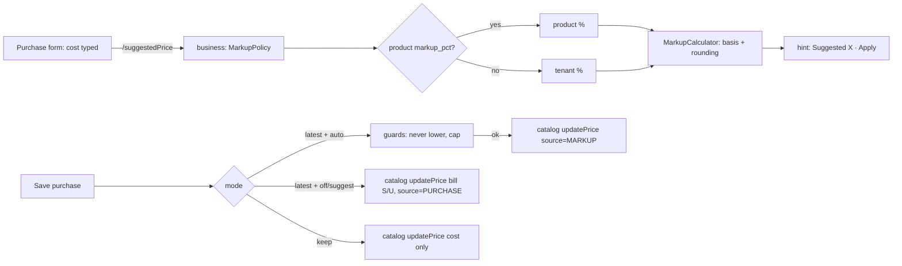

# Selling price per purchase (batch price) and the purchase-based markup rule — analysis

Status: **decisions taken 2026-10-04 (all five as recommended, §6). PR-1 built, awaiting build + gate.**

## 1. The question

> We buy abc-123 at 200, later the same product at 250. Today the system re-prices everything to the latest. Some shops
> want each purchase to sell at its own price (by batch). Make it configurable, and add a purchase-rate-based automatic
> selling price (markup %).

## 2. What happens today — traced, not assumed

| Step | Code | Behaviour |
|---|---|---|
| Purchase saved | `PurchaseService.stampRatesOnProduct` → `catalogClient.updatePrice(productId, sell, cost)` | **Unconditional.** Any purchase carrying a sell rate overwrites the ONE master `Product.sellingPrice` (and stamps `lastSaleRate`, `lastPurchaseRate`, `lastRateAt`). No setting governs it. |
| Stock received | inventory `StockEntry` (batch layer) | Each receipt is its own row with `batchNo`, `expiryDate`, `purchasePrice`, `paidTotal`. **It has no sell price.** |
| Sale priced | `SagaSellService` ~l.880 | `lineRate` = cashier's typed rate → else B2B contract/tier price (`PriceRuleService.quote`) → else catalog `sellingPrice`. Priced **before** stock is reserved. |
| Stock picked | inventory reservation (`ReservationPick`) | FEFO by expiry, per batch, each pick carrying `unitCost` → COGS is already per batch (correct). |
| Who may type a price | setting `pos.entry.priceEditable` | Only governs the cashier's override. |

**So yes:** after the 250 purchase, every unit of abc-123 — including the ones bought at 200 — sells at 250. **Cost**
is already layered correctly per batch; only the **selling price** is single.

Readers of the product price (each must be classified when this is built — Rule 0): `SagaSellService`, `SellService`,
`SellController` (till prefill), `StockController`, `SalesQuoteService`, catalog `ProductService` (picker projection,
cached — PERF-8/CACHE-1), `PublicProductController` + marketplace `CartService` (storefront), `PriceRuleService`
(B2B tiers). Plus the margin guard, returns, receipts/invoices, reports.

## 3. How established systems do it

| System | Batch / lot selling price | Purchase-based price |
|---|---|---|
| **Marg ERP / Busy** (pharmacy & distribution, South Asia) | **Yes — batch-wise Sale Rate and MRP**; at billing the cashier sees each batch with its own rate and picks one (or FEFO picks). | Rate per batch entered at purchase, optionally from a markup. |
| **Tally Prime** | Batch-wise MRP supported; price levels and dated *standard selling price* | Price list update is manual. |
| **Odoo** | Lots carry cost (FIFO/AVCO), **not** a sale price; selling price comes from price lists | Price-list rule *"based on cost + x %"* with rounding. |
| **SAP Business One** | Batches carry no own price | Price lists with a factor on a base (last purchase price) — a markup rule. |

Local reality (Pakistan): medicine packs carry a **printed MRP set by DRAP**, and old stock **must** be sold at its old
printed price. That is exactly batch-wise pricing — the pharmacy shape needs it; a mobile or general retail shop
usually wants "latest price".

## 4. Recommended design

### 4.1 One setting: how a purchase affects the selling price — `pos.pricing.purchaseMode`

| Mode | What a purchase does | Who it suits |
|---|---|---|
| `LATEST` (today, default for existing tenants) | Overwrites the product price, as now | General retail, mobile |
| `KEEP` | Never changes the product price; shows the purchase's rate as a suggestion only | Shops with fixed shelf prices |
| `PER_BATCH` | Stores the sell rate **on that receipt's stock batch**; the product price is the default for batches without one | Pharmacy (MRP), FMCG distribution, anyone with old-price stock |

Overridable per product (a pharmacy might keep `LATEST` for its general items). Precedence: product → category →
tenant → platform default. Business-type presets: Pharmacy → `PER_BATCH`; others → `LATEST`.

### 4.2 `PER_BATCH` — how a sale is priced

- `StockEntry` gains `sell_price` (Flyway, nullable; existing batches stay NULL = use the product price — no backfill
  guessing).
- The purchase passes its `bsellRate` to the batch it creates (already in the payload), instead of to the product.
- **Pricing must follow the pick, not precede it.** Today the line is priced before the reservation chooses batches.
  In `PER_BATCH` the reservation's picks come back with each batch's `sell_price`, and a line that spans two batches
  at different prices is **split into two sale lines** (qty × rate stays exact, receipts and returns stay per line).
- **The cashier can choose the batch.** The item picker drills down: `abc-123 — 7 @ 200 (B-0912, exp 03/27) · 10 @ 250
  (B-1003)`. Default selection follows the shop's pick rule (FEFO = earliest expiry; FIFO = oldest receipt).
- B2B contract/tier prices and the cashier's override still win (they are a price *for this customer/sale*); the batch
  price replaces only the catalog fallback. The margin guard compares against the batch's own cost.
- Storefront / quotes: price from the batch the reservation would pick at that moment, re-checked at checkout (the
  storefront already re-validates stock server-side).

### 4.3 The markup rule — suggested price from the purchase rate

- `price = cost × (1 + markup%)` — **markup on cost**. Offer **margin on selling price** too (`cost ÷ (1 − margin%)`)
  and label the difference plainly: 14.5% markup on 100 = **114.50** (≈ 12.66% margin); 14.5% margin = **116.96**.
- Modes: `OFF` · `SUGGEST` (default — the purchase form shows "Suggested 114.50 · [Keep 110.00] [Apply 114.50]") ·
  `AUTO` (applied only after the purchase commits) · `APPROVAL` (owner approves before customers see it).
  In `PER_BATCH` the result is that batch's price, never the product's.
- Rounding: exact · up to Rs 1 · nearest Rs 5 · nearest Rs 10. "Never lower the price automatically" on by default;
  a cap on automatic increases (e.g. 10%) above which it asks.
- Lives with the existing B2B price rules in catalog-service (`PriceRuleService`): one place answers "what does this
  cost the customer", so the till, quotes and the storefront cannot drift.

### 4.4 Price history — always

`product_price_history`: product, batch (if any), old → new, source (MANUAL / PURCHASE / MARKUP / APPROVAL), the
purchase, the rule and rounding used, who, when. Written in the purchase's own transaction; caches evicted after
commit (CACHE-1 pattern).

### 4.5 What never changes

Historic sale lines, receipts, invoices, COGS, batch cost and tax postings. Selling price and inventory cost stay
separate — the markup result is never used as cost.

## 5. Slices (each: gate first, Cypress + unit, Test Book, step-by-step capture)

| Slice | Scope | Risk |
|---|---|---|
| **PR-1** | The mode setting with `LATEST` / `KEEP` + price history + "suggested price" on the purchase form | Low — today's behaviour stays the default |
| **PR-2** | Markup rule (markup/margin, rounding, SUGGEST/AUTO, product/category/tenant precedence) | Medium — touches the purchase path |
| **PR-3** | `PER_BATCH`: `StockEntry.sell_price`, price-after-pick, line split, batch drill-down picker | **High — money on every sale**; needs the full reader classification of §2 |
| **PR-4** | `APPROVAL` mode + approval queue | Medium |

## 6. Decisions needed

1. **Default for existing tenants:** keep `LATEST` (no surprise), with Pharmacy getting `PER_BATCH` only when chosen? *(recommended)*
2. **A line spanning two batch prices:** split into two lines *(recommended — exact and auditable)* or price the whole line at one batch?
3. **Who may change the mode and approve price changes:** owner/admin *(recommended)*.
4. **Markup default:** `SUGGEST` with no tenant default % until the owner sets one *(recommended)*, or a platform default such as 14.5%?
5. **Order:** PR-1 → PR-2 → PR-3 → PR-4 *(recommended)*.

## 7. PR-1 — as built

| Part | Where | Note |
|---|---|---|
| Setting `pos.pricing.purchaseMode` = `latest` (default) \| `keep`, group Purchasing | `BusinessSettingsCatalog` | Values are **lower-case**: `SettingsService.getChoice` lower-cases the stored value and matches it against the allowed set — an upper-case set never matches and KEEP would silently act as LATEST (pinned by `PurchasePriceModeTest`). Writes are owner/admin (`SettingsController`). |
| KEEP sends only the cost | `PurchaseService.stampRatesOnProduct` (both call sites: receive, edit) | Unknown value or settings outage → `latest` (today's behaviour; a purchase is never blocked by settings). |
| `product_price_history` (V21) | catalog | One row per **actual** change (`compareTo`, so 110 = 110.00), same transaction as the change. |
| Writers recorded — 4 of 4 | `ProductService.create` (MANUAL, old null) · `update` (MANUAL) · `updatePrice` (PURCHASE, ref = bill no.) · `ProductImportSpec.persist` (IMPORT; import has no transaction, so its history commits separately, like its cache eviction) | Found by `setSellingPrice` + every `productRepository.save*`; the import only creates (a taken name is refused). |
| Contract | `CatalogClient.updatePrice(id, price, purchaseRate, ref)`; the 3-arg form is a `default` delegating with `ref = null` | One caller (`PurchaseService`), no implementations. |
| Read | catalog `GET /products/{id}/price-history` (owner/admin/super — it carries the cost), monolith `/productPriceHistory?productId=` | Scoped by `getEntity` (anti-IDOR): another tenant gets not-found. |
| Screen | purchase form `#purchasePriceEffect` (says *change A → B* / *stays A* / *keep*), product form "Price history" link + dialog | `price-history.js`; rendered from `calculateNetPurchase()`, new-bill reset and the next-line clear. |
| "From" price on the hint | the picker's `data-price` | **Verified** (guide P2 a4): a second New Purchase on the same page, after a bill moved the price, prefills and says the NEW price — the picker refreshes on save. |
| Time of a change | catalog sends `changedAt` as an instant with its offset; the dialog shows it in the browser's time | Found in the guide walk: the containers run UTC, so a bare wall-clock "08:00" showed for a 13:00 change in Pakistan. Gate G10 now asserts the shown time is local now. |
| Tests | catalog `ProductPriceHistoryTest` 7/7; business `PurchasePriceModeTest` 6/6; Cypress gate `pricing-purchase-mode.cy.js` G1–G10 **10/10** (2026-10-05); step-by-step guide `cypress/e2e/docs/price-mode-guide.cy.js` P1–P5 **5/5**, page built by `docs/guides/build-price-mode-guide.js` | |

## 8. PR-2 — the markup rule (design, 2026-10-05)

**What the owner sets** (Settings → Configuration → Purchasing, owner/admin):

| Setting | Values | Default |
|---|---|---|
| `pos.pricing.markupMode` | `off` · `suggest` · `auto` | `suggest` |
| `pos.pricing.markupBasis` | `markup` (on cost: 100 → 114.50 at 14.5%) · `margin` (of the price: 100 → 116.96 at 14.5%) | `markup` |
| `pos.pricing.markupPct` | a percentage; **0 = no rule** | `0` (decision 4: no platform default) |
| `pos.pricing.markupRounding` | `exact` · `up1` (up to the next whole rupee) · `near5` · `near10` | `exact` |
| `pos.pricing.markupNeverLower` | Auto never lowers a price | on |
| `pos.pricing.markupMaxRisePct` | Auto does not raise a price by more than this % (0 = no cap); above it the rule only suggests | `0` |

**Per product:** an optional **Markup %** on the product form (`products.markup_pct`, V22). Blank = the business's
percentage. Precedence product > tenant now; **category is PR-2b** — the column and precedence slot are reserved
but there is no category screen to set it on, and a value nobody can set is not a feature.

**One calculator, server-side** (`MarkupCalculator`, business-service, pure): cost → raw (`cost × (1+p)` or
`cost ÷ (1−p)`, half-up to paisa) → rounded. The purchase form asks the server for the suggestion
(`/suggestedPrice?productId&cost`); it never re-implements the arithmetic, so the screen and Auto cannot disagree.
Margin ≥ 100% is refused (division by zero or a negative price).

**How it combines with PR-1's purchase mode:**

| Purchase mode | Markup off | Markup suggest | Markup auto |
|---|---|---|---|
| Latest | the bill's S/U rate becomes the price (as today) | the form shows *Suggested 114.50 · Apply*; Apply fills S/U; the bill's S/U becomes the price | the **rule's** price becomes the product price (history source MARKUP), within the guards; the bill keeps its own S/U as typed |
| Keep | price never moves | suggestion shown for information | suggestion shown; price never moves (Keep wins — "never" means never) |

Auto guards: never lower (on by default) and the rise cap. A guarded-out rule changes nothing and the hint says why.
Approval of a held-back change is PR-4.

Trace (Rule 0): `products.markup_pct` has 4 writers to cover — create, update (`fromDto`), CSV import (not in this
slice: the column stays blank on import, stated on the page), `updatePrice` (never touches it). Readers: `toRef`
(new `ProductRef.markupPct`), the product form, `MarkupPolicy`. `ProductRef` is a contract DTO — adding a nullable
field is backward-compatible for every consumer (Jackson ignores unknown fields; verified on the `ProductRef` mapper
config before shipping).

### 8.1 PR-2 — found in the gate and the walk (2026-10-05)

| Finding | Cause | Status |
|---|---|---|
| **Use 240.45 did nothing** when clicked straight from the P/U box (gate M9 red on the deployed build) | P/U's `onblur` re-rendered the suggestion line between mousedown and mouseup; the browser fires no `click` when the two land on different elements. Traced with a capture-phase event log: mousedown + mouseup on the button, no click. | Fixed: the line is rebuilt only when what it says changes (`data-sig`), and the button has one delegated handler. M9 passed with the fixed file evaluated on the page; **needs a monolith rebuild to ship**. |
| Reopening the Products list while it is still reloading after a save throws `Cannot read properties of undefined (reading 'style')` inside DataTables (`catalog-products.js` `deliver`, l.1663) | A server-side page delivered into a table `showProducts()` has just rebuilt | **Pre-existing, not PR-2.** The grid still renders; console error only. Recorded, not fixed (needs consent). The guide waits for the reload. |

Gate `cypress/e2e/business/pricing-markup.cy.js`: M1–M8, M10, M11 green on the deployed build; M9 green with the fix, pending deploy.
Unit: business 31/31 (MarkupCalculatorTest 5, MarkupPolicyTest 9, PurchasePriceModeTest 11, +6 neighbours), catalog 152/152.
