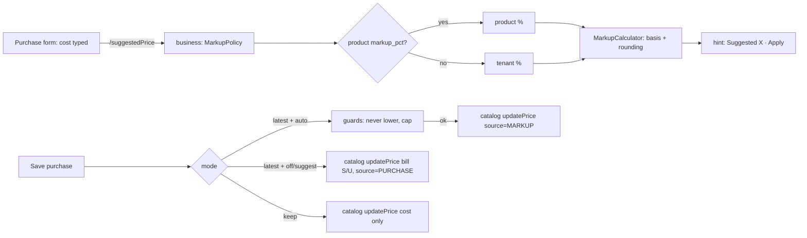
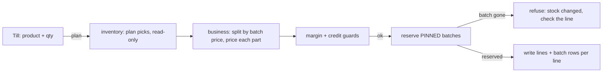
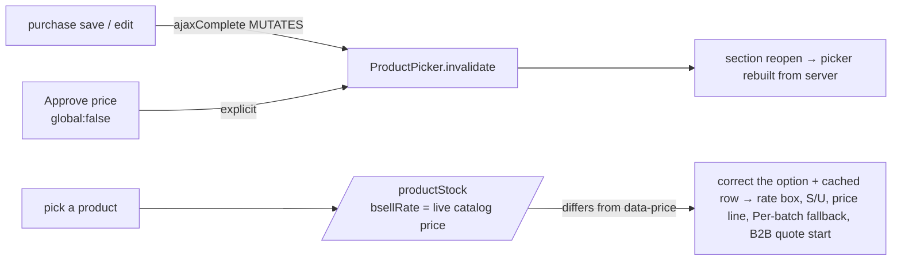
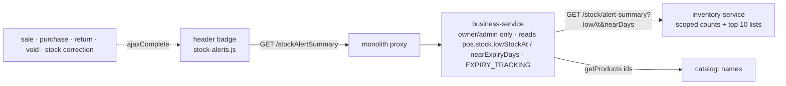
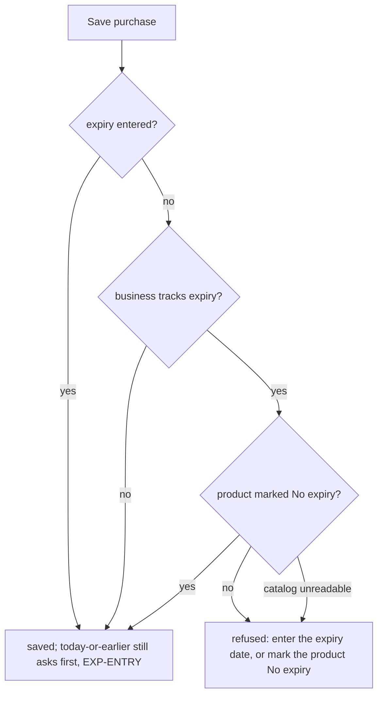

# Selling price per purchase (batch price) and the purchase-based markup rule — analysis

Status: **COMPLETE — PR-1, PR-2, PR-2b, PR-3a, PR-3b, PR-3c, CART-3 (§7–§10.8) and PR-4 (§11) built, committed and verified end to end on the deployed stack (§12, 2026-10-09).** Open items: §12.3 (§8.1 defect and placeholder fixed §12.4).

## 1. The question

> We buy abc-123 at 200, later the same product at 250. Today the system re-prices everything to the latest. Some shops
> want each purchase to sell at its own price (by batch). Make it configurable, and add a purchase-rate-based automatic
> selling price (markup %).

## 2. What happens today — traced, not assumed

| Step | Code | Behaviour |
|---|---|---|
| Purchase saved | `PurchaseService.stampRatesOnProduct` → `catalogClient.updatePrice(productId, sell, cost)` | **Unconditional.** Any purchase carrying a sell rate overwrites the ONE master `Product.sellingPrice` (and stamps `lastSaleRate`, `lastPurchaseRate`, `lastRateAt`). No setting governs it. |
| Stock received | inventory `StockEntry` (batch layer) | Each receipt is its own row with `batchNo`, `expiryDate`, `purchasePrice`, `paidTotal`. **It has no sell price.** |
| Sale priced | `SagaSellService` ~l.880 | `lineRate` = cashier's typed rate → else B2B contract/tier price (`PriceRuleService.quote`) → else catalog `sellingPrice`. Priced **before** stock is reserved. |
| Stock picked | inventory reservation (`ReservationPick`) | FEFO by expiry, per batch, each pick carrying `unitCost` → COGS is already per batch (correct). |
| Who may type a price | setting `pos.entry.priceEditable` | Only governs the cashier's override. |

**So yes:** after the 250 purchase, every unit of abc-123 — including the ones bought at 200 — sells at 250. **Cost**
is already layered correctly per batch; only the **selling price** is single.

Readers of the product price (each must be classified when this is built — Rule 0): `SagaSellService`, `SellService`,
`SellController` (till prefill), `StockController`, `SalesQuoteService`, catalog `ProductService` (picker projection,
cached — PERF-8/CACHE-1), `PublicProductController` + marketplace `CartService` (storefront), `PriceRuleService`
(B2B tiers). Plus the margin guard, returns, receipts/invoices, reports.

## 3. How established systems do it

| System | Batch / lot selling price | Purchase-based price |
|---|---|---|
| **Marg ERP / Busy** (pharmacy & distribution, South Asia) | **Yes — batch-wise Sale Rate and MRP**; at billing the cashier sees each batch with its own rate and picks one (or FEFO picks). | Rate per batch entered at purchase, optionally from a markup. |
| **Tally Prime** | Batch-wise MRP supported; price levels and dated *standard selling price* | Price list update is manual. |
| **Odoo** | Lots carry cost (FIFO/AVCO), **not** a sale price; selling price comes from price lists | Price-list rule *"based on cost + x %"* with rounding. |
| **SAP Business One** | Batches carry no own price | Price lists with a factor on a base (last purchase price) — a markup rule. |

Local reality (Pakistan): medicine packs carry a **printed MRP set by DRAP**, and old stock **must** be sold at its old
printed price. That is exactly batch-wise pricing — the pharmacy shape needs it; a mobile or general retail shop
usually wants "latest price".

## 4. Recommended design

### 4.1 One setting: how a purchase affects the selling price — `pos.pricing.purchaseMode`

| Mode | What a purchase does | Who it suits |
|---|---|---|
| `LATEST` (today, default for existing tenants) | Overwrites the product price, as now | General retail, mobile |
| `KEEP` | Never changes the product price; shows the purchase's rate as a suggestion only | Shops with fixed shelf prices |
| `PER_BATCH` | Stores the sell rate **on that receipt's stock batch**; the product price is the default for batches without one | Pharmacy (MRP), FMCG distribution, anyone with old-price stock |

Overridable per product (a pharmacy might keep `LATEST` for its general items). Precedence: product → category →
tenant → platform default. Business-type presets: Pharmacy → `PER_BATCH`; others → `LATEST`.

### 4.2 `PER_BATCH` — how a sale is priced

- `StockEntry` gains `sell_price` (Flyway, nullable; existing batches stay NULL = use the product price — no backfill
  guessing).
- The purchase passes its `bsellRate` to the batch it creates (already in the payload), instead of to the product.
- **Pricing must follow the pick, not precede it.** Today the line is priced before the reservation chooses batches.
  In `PER_BATCH` the reservation's picks come back with each batch's `sell_price`, and a line that spans two batches
  at different prices is **split into two sale lines** (qty × rate stays exact, receipts and returns stay per line).
- **The cashier can choose the batch.** The item picker drills down: `abc-123 — 7 @ 200 (B-0912, exp 03/27) · 10 @ 250
  (B-1003)`. Default selection follows the shop's pick rule (FEFO = earliest expiry; FIFO = oldest receipt).
- B2B contract/tier prices and the cashier's override still win (they are a price *for this customer/sale*); the batch
  price replaces only the catalog fallback. The margin guard compares against the batch's own cost.
- Storefront / quotes: price from the batch the reservation would pick at that moment, re-checked at checkout (the
  storefront already re-validates stock server-side).

### 4.3 The markup rule — suggested price from the purchase rate

- `price = cost × (1 + markup%)` — **markup on cost**. Offer **margin on selling price** too (`cost ÷ (1 − margin%)`)
  and label the difference plainly: 14.5% markup on 100 = **114.50** (≈ 12.66% margin); 14.5% margin = **116.96**.
- Modes: `OFF` · `SUGGEST` (default — the purchase form shows "Suggested 114.50 · [Keep 110.00] [Apply 114.50]") ·
  `AUTO` (applied only after the purchase commits) · `APPROVAL` (owner approves before customers see it).
  In `PER_BATCH` the result is that batch's price, never the product's.
- Rounding: exact · up to Rs 1 · nearest Rs 5 · nearest Rs 10. "Never lower the price automatically" on by default;
  a cap on automatic increases (e.g. 10%) above which it asks.
- Lives with the existing B2B price rules in catalog-service (`PriceRuleService`): one place answers "what does this
  cost the customer", so the till, quotes and the storefront cannot drift.

### 4.4 Price history — always

`product_price_history`: product, batch (if any), old → new, source (MANUAL / PURCHASE / MARKUP / APPROVAL), the
purchase, the rule and rounding used, who, when. Written in the purchase's own transaction; caches evicted after
commit (CACHE-1 pattern).

### 4.5 What never changes

Historic sale lines, receipts, invoices, COGS, batch cost and tax postings. Selling price and inventory cost stay
separate — the markup result is never used as cost.

## 5. Slices (each: gate first, Cypress + unit, Test Book, step-by-step capture)

| Slice | Scope | Risk | Status (2026-10-09) |
|---|---|---|---|
| **PR-1** | The mode setting with `LATEST` / `KEEP` + price history + "suggested price" on the purchase form | Low — today's behaviour stays the default | ✅ built §7, gate 10/10 |
| **PR-2** | Markup rule (markup/margin, rounding, SUGGEST/AUTO, product/category/tenant precedence) | Medium — touches the purchase path | ✅ built §8 + category PR-2b §9, gate 15/15 |
| **PR-3** | `PER_BATCH`: `StockEntry.sell_price`, price-after-pick, line split, batch drill-down picker | **High — money on every sale**; needs the full reader classification of §2 | ✅ built as PR-3a §10.5, PR-3b §10.6, PR-3c §10.7, CART-3 §10.8; gates 3/3, 6/6, 11/11 |
| **PR-4** | `APPROVAL` mode + approval queue | Medium | ✅ built §11.5, gate 12/12 |

## 6. Decisions — all taken 2026-10-04 as recommended (CART-3 display: one row with batch sub-lines, 2026-10-08)

1. **Default for existing tenants:** keep `LATEST` (no surprise), with Pharmacy getting `PER_BATCH` only when chosen? *(recommended)*
2. **A line spanning two batch prices:** split into two lines *(recommended — exact and auditable)* or price the whole line at one batch?
3. **Who may change the mode and approve price changes:** owner/admin *(recommended)*.
4. **Markup default:** `SUGGEST` with no tenant default % until the owner sets one *(recommended)*, or a platform default such as 14.5%?
5. **Order:** PR-1 → PR-2 → PR-3 → PR-4 *(recommended)*.

## 7. PR-1 — as built

| Part | Where | Note |
|---|---|---|
| Setting `pos.pricing.purchaseMode` = `latest` (default) \| `keep`, group Purchasing | `BusinessSettingsCatalog` | Values are **lower-case**: `SettingsService.getChoice` lower-cases the stored value and matches it against the allowed set — an upper-case set never matches and KEEP would silently act as LATEST (pinned by `PurchasePriceModeTest`). Writes are owner/admin (`SettingsController`). |
| KEEP sends only the cost | `PurchaseService.stampRatesOnProduct` (both call sites: receive, edit) | Unknown value or settings outage → `latest` (today's behaviour; a purchase is never blocked by settings). |
| `product_price_history` (V21) | catalog | One row per **actual** change (`compareTo`, so 110 = 110.00), same transaction as the change. |
| Writers recorded — 4 of 4 | `ProductService.create` (MANUAL, old null) · `update` (MANUAL) · `updatePrice` (PURCHASE, ref = bill no.) · `ProductImportSpec.persist` (IMPORT; import has no transaction, so its history commits separately, like its cache eviction) | Found by `setSellingPrice` + every `productRepository.save*`; the import only creates (a taken name is refused). |
| Contract | `CatalogClient.updatePrice(id, price, purchaseRate, ref)`; the 3-arg form is a `default` delegating with `ref = null` | One caller (`PurchaseService`), no implementations. |
| Read | catalog `GET /products/{id}/price-history` (owner/admin/super — it carries the cost), monolith `/productPriceHistory?productId=` | Scoped by `getEntity` (anti-IDOR): another tenant gets not-found. |
| Screen | purchase form `#purchasePriceEffect` (says *change A → B* / *stays A* / *keep*), product form "Price history" link + dialog | `price-history.js`; rendered from `calculateNetPurchase()`, new-bill reset and the next-line clear. |
| "From" price on the hint | the picker's `data-price` | **Verified** (guide P2 a4): a second New Purchase on the same page, after a bill moved the price, prefills and says the NEW price — the picker refreshes on save. |
| Time of a change | catalog sends `changedAt` as an instant with its offset; the dialog shows it in the browser's time | Found in the guide walk: the containers run UTC, so a bare wall-clock "08:00" showed for a 13:00 change in Pakistan. Gate G10 now asserts the shown time is local now. |
| Tests | catalog `ProductPriceHistoryTest` 7/7; business `PurchasePriceModeTest` 6/6; Cypress gate `pricing-purchase-mode.cy.js` G1–G10 **10/10** (2026-10-05); step-by-step guide `cypress/e2e/docs/price-mode-guide.cy.js` P1–P5 **5/5**, page built by `docs/guides/build-price-mode-guide.js` | |

## 8. PR-2 — the markup rule (design, 2026-10-05)

**What the owner sets** (Settings → Configuration → Purchasing, owner/admin):

| Setting | Values | Default |
|---|---|---|
| `pos.pricing.markupMode` | `off` · `suggest` · `auto` | `suggest` |
| `pos.pricing.markupBasis` | `markup` (on cost: 100 → 114.50 at 14.5%) · `margin` (of the price: 100 → 116.96 at 14.5%) | `markup` |
| `pos.pricing.markupPct` | a percentage; **0 = no rule** | `0` (decision 4: no platform default) |
| `pos.pricing.markupRounding` | `exact` · `up1` (up to the next whole rupee) · `near5` · `near10` | `exact` |
| `pos.pricing.markupNeverLower` | Auto never lowers a price | on |
| `pos.pricing.markupMaxRisePct` | Auto does not raise a price by more than this % (0 = no cap); above it the rule only suggests | `0` |

**Per product:** an optional **Markup %** on the product form (`products.markup_pct`, V22). Blank = the business's
percentage. Precedence product > tenant now; **category is PR-2b** — the column and precedence slot are reserved
but there is no category screen to set it on, and a value nobody can set is not a feature.

**One calculator, server-side** (`MarkupCalculator`, business-service, pure): cost → raw (`cost × (1+p)` or
`cost ÷ (1−p)`, half-up to paisa) → rounded. The purchase form asks the server for the suggestion
(`/suggestedPrice?productId&cost`); it never re-implements the arithmetic, so the screen and Auto cannot disagree.
Margin ≥ 100% is refused (division by zero or a negative price).

**How it combines with PR-1's purchase mode:**

| Purchase mode | Markup off | Markup suggest | Markup auto |
|---|---|---|---|
| Latest | the bill's S/U rate becomes the price (as today) | the form shows *Suggested 114.50 · Apply*; Apply fills S/U; the bill's S/U becomes the price | the **rule's** price becomes the product price (history source MARKUP), within the guards; the bill keeps its own S/U as typed |
| Keep | price never moves | suggestion shown for information | suggestion shown; price never moves (Keep wins — "never" means never) |

Auto guards: never lower (on by default) and the rise cap. A guarded-out rule changes nothing and the hint says why.
Approval of a held-back change is PR-4.

Trace (Rule 0): `products.markup_pct` has 4 writers to cover — create, update (`fromDto`), CSV import (not in this
slice: the column stays blank on import, stated on the page), `updatePrice` (never touches it). Readers: `toRef`
(new `ProductRef.markupPct`), the product form, `MarkupPolicy`. `ProductRef` is a contract DTO — adding a nullable
field is backward-compatible for every consumer (Jackson ignores unknown fields; verified on the `ProductRef` mapper
config before shipping).

### 8.1 PR-2 — found in the gate and the walk (2026-10-05)

| Finding | Cause | Status |
|---|---|---|
| **Use 240.45 did nothing** when clicked straight from the P/U box (gate M9 red on the deployed build) | P/U's `onblur` re-rendered the suggestion line between mousedown and mouseup; the browser fires no `click` when the two land on different elements. Traced with a capture-phase event log: mousedown + mouseup on the button, no click. | Fixed: the line is rebuilt only when what it says changes (`data-sig`), and the button has one delegated handler. M9 passed with the fixed file evaluated on the page; **needs a monolith rebuild to ship**. |
| Reopening the Products list while it is still reloading after a save throws `Cannot read properties of undefined (reading 'style')` inside DataTables (`catalog-products.js` `deliver`, l.1663) | A server-side page delivered into a table `showProducts()` has just rebuilt | **Pre-existing, not PR-2.** The grid still renders; console error only. **Fixed 2026-10-09 (PG-LATE, §12.4).** |

Gate `cypress/e2e/business/pricing-markup.cy.js`: M1–M11 green on the deployed build after the fix (2026-10-05); 15/15 with PR-2b's cases, re-run 2026-10-09.
Unit: business 31/31 (MarkupCalculatorTest 5, MarkupPolicyTest 9, PurchasePriceModeTest 11, +6 neighbours), catalog 152/152.

## 9. PR-2b — markup by category (2026-10-05)

- `categories.markup_pct` (V23). Precedence **product > category > business**; the suggestion's `pctSource` says which
  (PRODUCT / CATEGORY / BUSINESS) and the purchase form names it ("this category's").
- Its own writer, `CategoryService.setMarkup` → `PUT /categories/{id}/markup` (owner/admin/super): the general category
  update rewrites name, description and parent from the DTO, so a markup screen going through it could wipe them.
  Scoped (anti-IDOR), validated 0–1000 like the product's, and it publishes `CatalogCategoriesChanged`, which already
  evicts both the category list and the product refs (the refs carry `categoryMarkupPct`).
- Readers: `toRef` → `ProductRef.categoryMarkupPct` → `MarkupPolicy.suggest(cost, product, category, current)` in both
  callers (`PurchaseService` Auto, `PurchasePricingController` suggestion). The single-product `getRef` the purchase
  path uses is uncached; the batch refs cache is evicted by the category event.
- Screen: **Settings → Markup by category** (owner/admin; not under Price Rules, which only dealer-pricing shops see).
  One row per category, saved when the box is left, with "Saved" or the server's sentence.
- Tests: catalog `CategoryMarkupTest` 5/5; business `MarkupPolicyTest` 10/10 (category precedence added); gate
  `pricing-markup.cy.js` M12–M15 — green on the deployed build after the two §9.1 fixes (15/15, re-run 2026-10-09).

### 9.1 PR-2b — found by gate M13 (2026-10-05)

| Finding | Cause | Status |
|---|---|---|
| **Every save on Markup by category was refused (403)** in the browser, though the same request from a test client succeeded | the save used `global: false` (no blocking overlay on a settings row), which also skips the `ajaxSend` hook that adds the CSRF header — the documented L16 trap in `header.html` | Fixed: `headers: xsrfHeaders()`. Verified with the fixed file evaluated on the deployed page. Needs a monolith rebuild. |
| The screen said **"no markup set"** for a business with 14.5% when opened quickly | it read the page-load flag, which had not arrived yet | Fixed: the screen reads the business's % itself. Same verification. |

## 10. PR-3 — PER_BATCH: each purchase sells at its own price (review, 2026-10-05)

### 10.1 Trace (Rule 0)

**Readers of the selling price — 13 call sites in 9 files** (excluding catalog's own mappers/writers):

| # | Reader | What it does | In PER_BATCH |
|---|---|---|---|
| 1 | `SagaSellService:884` | the sale line's fallback price (after cashier rate and B2B quote) | **WANTS the batch price** — the core change |
| 2–3 | `StockController:59, :115` (`/productStock`, `/getStockByBatch`) | the till / purchase form prefill (`bsellRate`) | **WANTS the batch price** (of the batch the cashier picked, or FEFO's first) |
| 4 | `SellController:470` (`/looseInfo`) | the per-piece hint on a broken pack | **follows** the chosen batch's price |
| 5 | `SalesQuoteService:509` | a quote's line price | keeps the catalog price (a quote prices the product; on conversion its locked rate is the cashier's rate, which wins) |
| 6 | `SellService:260` | quick-pick tile label | keeps catalog (a label, not a charge) |
| 7 | `PriceRuleService:88` | B2B PERCENT rules: % off the catalog price | keeps catalog in PR-3 (decision below) |
| 8 | `PublicProductController:44` | storefront listing | keeps catalog (storefront is out of PR-3) |
| 9 | `marketplace CartService:78` | storefront cart price | keeps catalog |
| 10–11 | `PurchaseService:622`, `PurchasePricingController:44` | markup guards' "current price" | unchanged (in PER_BATCH the rule prices the batch; the guards compare with the product price) |
| — | browser: picker `data-price` | till / purchase prefill | replaced by the batch price once a batch is chosen |

Count: **4 want the batch price, 7 keep the catalog price, 2 unaffected.**

**Order of a sale today:** `buildLines` (prices every line) → margin guard → credit guard → `reserve` (FEFO picks
batches) → write. **The price is fixed before the batches are known** — PER_BATCH needs the batch first.

**Contracts today:** `StockReservationLine {itemId, quantity}` cannot pin a batch; `StockPick {itemId, batchNo, quantity,
expiry, unitCost}` has no sell price and no line reference; `StockImportLine` (purchase → stock) carries cost, no sell
price; `GET /stock/batches/{productId}` exists (the drill-down can use it).

### 10.2 ⚠ Existing defect found by the trace — batch rows doubled when one product is on two lines

`SagaSaleWriter.recordBatches` attaches picks to a line **by product id**. Two lines of the same product each record
**both** lines' picks. Verified in the live data: invoice `customer_history_id 6292`, product 2621 — **2 lines, 2 units
sold, sell_batch rows for 4 units**. `cogsFromPicks` (the sale's own COGS) sums picks once and is right; but
`sell_batch` is what the **edit and return paths** cost from, so they would cost that sale's goods twice. Rare today
(1 invoice); PER_BATCH's line split makes "one product, two lines" the normal case — so this is fixed FIRST (PR-3a).

### 10.3 Recommended design

- **PR-3a — picks belong to a line, not a product.** The reservation line carries its sale-line index; each pick
  echoes it; `recordBatches` matches on it. Gate: one product on two lines → batch rows sum to the units sold; a return
  costs once. (Independent of PER_BATCH — a money fix on its own.)
- **PR-3b — the batch's own price.** `stock_entries.sell_price` (nullable; existing batches stay NULL = the product
  price, no backfill guess). `pos.pricing.purchaseMode` gains `per_batch`: the purchase writes its S/U rate (or the
  markup rule's price) **to its batch**, not to the product. `/stock/batches` returns it.
- **PR-3c — price after the pick, shown before the money.** In PER_BATCH the server first asks inventory for a
  **plan** (the batches FEFO — or the cashier's chosen batch — would take, read-only), splits the line where the
  plan crosses a price, prices each part, runs the guards, then **reserves exactly those batches** (pinned). If a
  pinned batch is gone by then (another till sold it), the sale is refused with "stock changed — check the line",
  never silently re-priced. The till shows the same plan before payment: `abc-123 — 7 @ 200 (B-0912) + 3 @ 250
  (B-1003)`, with a batch drill-down to choose. Precedence unchanged above it: cashier's rate > B2B contract price >
  **batch price** > product price.

### 10.4 Decisions needed before PR-3 is built

1. Fix the doubled batch rows first as **PR-3a** (recommended — a money defect today, and PR-3c depends on it).
2. **Plan, then pinned reserve** (recommended — what the till shows is what is charged; a race refuses instead of
   re-pricing) versus reserve first and price from the picks (simpler, but the cashier sees the split only after
   pressing Complete, and a guard refusal has to release stock).
3. **Scope:** POS till and pharmacy dispense now; quotes, the storefront and B2B percent rules keep the product
   price (recommended — each has its own price contract; stated on the screen and the page).

### 10.5 Decisions taken (2026-10-05) and PR-3a as built

Decisions: PR-3a first; plan then pinned reserve; till + pharmacy dispense (quotes, storefront and B2B percent rules
keep the product price).

**PR-3a — two defects, one slice.** The trace found a second hole beside the doubled batch rows: the reservation's
pass 1 checked each **line** against stock on its own, so two lines of 5 against 7 both passed and pass 2 held 5 + 2
without noticing the shortfall. **Red run on the deployed build:** B1 failed (each line recorded both lines' batches);
B2 recorded `INV-000498` selling 10 against 7 on the shelf (voided afterwards, reason recorded).

| Change | Where |
|---|---|
| `StockReservationLine.lineRef`, `StockPick.lineRef` (optional; old constructors kept, 7 call sites unchanged) | commerce-contracts |
| `reservation_picks.line_ref` (V13); pass 1 sums need **per product across lines**; pass 2 echoes the line on each pick and refuses (rolls back) a line held short | inventory `ReservationService` |
| reservation lines carry their position (both builders, incl. the no-bonus retry); `recordBatches` matches a pick to **its line**, falling back to product for line-less picks | business `SagaSellService`, `SagaSaleWriter` |

Callers without a line (marketplace checkout and order holds) merge per product already and are unchanged.
Tests: inventory `ReservationServiceTest` 16/16 on real MySQL (3 new: summed check, picks name their line, line-less
unchanged); business `SaleBatchByLineTest` 3/3 + sale-path neighbours (27). Gate `cypress/e2e/business/sale-batches-by-line.cy.js`
B1–B3: red on the old build as above; green 3/3 on the deployed build (2026-10-05, re-run 2026-10-09).

### 10.6 PR-3b as built — each batch can carry its own price

| Change | Where |
|---|---|
| `stock_entries.sell_price` (V14), NULL = the product's price; no backfill | inventory |
| `StockImportLine.sellPrice`, `StockImportResult.entryIds`, `StockPurchaseAdjust.{stockEntryId, sellPrice}`, `StockBatch.{stockEntryId, sellPrice}` | commerce-contracts (one positional `StockBatch` call, in inventory, updated) |
| import stores the price and returns the batch ids; `reconcilePurchase` re-prices the purchase's own batch **by id**, scoped to the tenant and product, **before** the delta (a price-only edit has delta 0) | inventory |
| `purchase.stock_entry_id` (V79) — a batch number is optional and often blank, so the purchase keeps the batch's id | business |
| `pos.pricing.purchaseMode` = `per_batch`: the product's price is not moved (cost still stamped); `batchSellPrice` = the bill's S/U, or the markup rule's price on Auto (no guards: a new batch has no price to protect); an edit re-prices its batch even when only S/U changed | business `PurchaseService` |
| `/productStock` returns the batches in Per batch whatever the tenant tracks; `/suggestedPrice` never reports Auto applying to the product in Per batch | business |
| purchase-form line: "This purchase's stock will sell at 250. Earlier stock keeps its own price, and the product's price stays 200." (6 languages) | monolith `price-history.js` |

Found while building: MapStruct is strict, so `stockEntryId` is ignored on input (server-owned, never from the form);
the MS-6 ModelMapper oracle fuzz-matched the new field onto `PurchaseDTO.stock.stockId` — the oracle stands for code
that never had the field, so it is cleared for that comparison. `PurchasePriceModeTest.unknown_value_is_latest` used
`per_batch` as its "unknown" example and now uses one that is not a mode.

Tests: business 57/57 (new `PurchasePerBatchTest` 6), inventory 19/19 on real MySQL (2 new). Gate
`cypress/e2e/business/pricing-per-batch.cy.js` X1–X6 on `owner.pharma@`: 6/6 on the deployed build after the X4 fix (an edit wiped the server-owned `stock_entry_id`; `updatePurchase` now carries it over), re-run 2026-10-09. The SALE still prices from the
product until PR-3c.

### 10.7 PR-3c as built — the sale is priced from the batches it takes (2026-10-05)

**Order of a sale in Per batch** (every other mode is untouched — it never asks for a plan):
`buildLines` → **plan** (inventory, read-only) → **split + re-price** → margin guard → credit guard → **reserve, pinned**
→ write → confirm. The guards judge the prices that will be charged, and nothing is held until they pass.

| Change | Where |
|---|---|
| `POST /reservations/plan` — the batches a reserve would take now, nothing held, status `PLANNED` (never persisted). A line's `stockEntryId` is a **preference** here (the cashier's chosen batch first, the rest FEFO) | inventory `ReservationService.plan`, `ReservationController`, `InventoryClient.plan` |
| One in-memory allocator for plan and reserve, over the batches pass 1 loaded. On a **reserve** `stockEntryId` is a **pin**: only that batch, and a batch that can no longer cover it refuses the whole request with `batch changed: …` — nothing held. Pins are served before FEFO lines (a FEFO line listed first could otherwise eat a pinned batch). A batch id from another tenant or product is simply not among the loaded batches → refused | inventory `ReservationService.allocate` |
| `StockReservationLine.stockEntryId`; `StockPick.{stockEntryId, sellPrice}`; `ReservationStatus.PLANNED` (old constructors kept; every existing call site unchanged) | commerce-contracts |
| `BatchPriceSplit` (pure): paid units first, grouped by the batch's price (NULL = the product's price); the bonus rides on the last part's batches; an amount discount is shared in proportion, to the paisa, the last part taking the remainder; each part's cost is its own batches' (null if any is unknown — never guessed) | business |
| `SagaSellService.priceByBatch`: plan (with the bonus retry of #17 P3 D11 — free goods withheld when only the paid units fit), split, then **re-build through `buildLines`** so discount, tax and cost are worked exactly as for any line; parts carry `priceReason = "Batch …"` and their batches' cost for the margin guard; reservation lines pinned per part | business |
| Precedence: cashier's typed rate > contract/tier price > **batch price** > product price. "Typed" = `sellRate ≠ autoRate` (the till sends the rate it put in the box). Out of PR-3c, priced as before: loose (broken-pack) lines, lines naming serials, made-to-order items, and every EDIT | business `batchPriced` |
| `autoRate`, `stockEntryId` on **both** `SellDTO` twins (the monolith relay drops an unknown field silently); MapStruct `toDto` ignores both | business + monolith |
| `POST /batchPricePreview` — the same plan + split + line build, nothing held or written; `perBatch=false` outside Per batch | business `SellController`, monolith proxy, `PermissionInterceptor` (`sale.create`) |
| Till: a **Batch** list (FEFO default, each batch with its quantity and price), the rate box starts at the first batch's price; Add to Cart previews the line and puts the parts in the cart with a note; **Complete Sale re-checks the whole cart** — if the batches change a price the cart is corrected and shown and nothing is posted until Complete again | monolith `per-batch-till.js`, hooks in `business.js` / `main.js`, `businessDashboard.html`, 6 languages |

**Rule 0 — readers of the selling price (§10.1), as built:** 4 want the batch price — the sale line (#1), the till prefill
(#2–3, via `/productStock` batches) and the per-piece hint (#4, it follows the box); 7 keep the product price (quotes,
quick-pick labels, B2B percent rules, storefront, cart, markup guards ×2); 2 unaffected. The reservation's other callers
(marketplace checkout, order holds) send no `stockEntryId` and get FEFO exactly as before.

**Found while building:**

| Finding | Cause | Status |
|---|---|---|
| The till's batch note never appeared (gate S6 red) | the notice row is collapsed (`pos-notice-empty`) unless `syncSellNoticeRow` opens it, and it decides from `:visible`, which is false for any child of a collapsed row | Fixed in `per-batch-till.js`: the note opens its row itself. A first fix changed `syncSellNoticeRow`'s rule instead — that opened the row for the older FEFO/sellable notices on EVERY shop's till and turned two unrelated gates red (`saga-sell-ui`, `contract-price-charged` — both green on the base build, red with it). Reverted; the rule is unchanged |
| **A typed price was re-priced at Complete** — the cashier typed 230, the cart showed 230, Complete corrected it to the batch's 200 (guide case S2 red on the deployed build) | the Add preview echoed 230 back and the till stored it as its own price (`autoRate = 230`), so the whole-cart re-check read the line as "not typed" and priced it from the batch | Fixed: the preview says per part whether the BATCHES set the price (`batchPriced`); the till marks only those as its own. Gate S8 (typed price survives Complete) and `PerBatchSaleTest.previewMarksATypedPriceAsTheCashiers` |
| Complete Sale's confirm dialog opened late in Per batch | the whole-cart re-check runs first, by design | The gate waits for the re-check; noted in the guide (S1 a3, S3 a2) |

**Tests:** inventory `ReservationServiceTest` **23/23** on real MySQL (7 new: plan names batch + price and holds nothing,
the chosen batch first, plan shortfall wording, pinned reserve holds exactly its batch, a gone batch refuses and holds
nothing, pins before FEFO, another tenant's batch refused); business **502/502** (new `PerBatchSaleTest` 12,
`BatchPriceSplitTest` 7). Gate `cypress/e2e/business/pricing-per-batch-sale.cy.js` S1–S8 **8/8** on the deployed build
(2026-10-05). Step-by-step guide cases R1 (PR-3a), X1 (PR-3b), S1–S3 (PR-3c) in `cypress/e2e/docs/price-mode-guide.cy.js`.

**Not in PR-3c (stated on the page):** loose lines priced per batch; quotes, the storefront and B2B percent rules (decision
3); PR-4 (approval of held-back price changes).

### 10.8 CART-3 — one cart row with batch sub-lines (2026-10-08)

Decided 2026-10-08: when one Add to Cart is priced across two or more batch prices, the cart shows **one row** for the
product with its batches as sub-lines (`B-0912 · 7 × 200.00 = 1400.00`). **Display only** — `data[]`, the cart that is
submitted, parked, totalled and edited, still holds one line per batch price, and the invoice still records them as
separate lines (decision 2).

| Reader of the cart (Rule 0) | Impact |
|---|---|
| `renderCart` / `sellCartRow` | groups consecutive lines sharing a `batchGroup` (2+); every other line drawn by the unchanged `sellCartRow` |
| DataTables footer (QTY, Price, Total sums of the grid's cells) | a grouped row's number cells are `{display, value}`; `value` = the sum of what the lines' own rows gave, so every footer is unchanged (gate S10) |
| `CIT(data)`, `sellLineDiscountTotal`, `sellRefreshPayable`, Change/Due | read `data[]` — untouched |
| `UIT(pid, idx)` (Del, counter to zero) | unchanged for ordinary rows; a grouped row's Del calls `UIG(group)`, removing that Add's lines only (S9) |
| counter `+/-` | not drawn on a grouped row (stepping one batch of a split line would need a re-plan); ordinary rows unchanged |
| last-rate hint (`row[3]`) | a grouped row compares its first batch's rate (`cmp`) |
| park / resume | the cart is sent and returned as untyped JSON, so `batchGroup` survives; resumed basket draws the same row (S11) |
| `beforeComplete` re-check | a line it splits keeps (or starts) a group; one-part lines unchanged |
| submit (`addSell`), edit (`updateSell`) | `batchGroup` is an extra field on lines that already carry `batchNote`; Per batch is off while editing, so no groups there |
| **shops not in Per batch** | lines never carry `batchGroup` → `renderCart` takes the old path for every line; the render rule passes plain values through; no behaviour change |

Gate `pricing-per-batch-sale.cy.js`: S6 now asserts one row + two sub-lines; **S9** Del removes both lines of the Add and
nothing else; **S10** QTY / Price / Total footers equal the sums of the submitted lines; **S11** a parked basket returns as
the same row. Red run on the deployed (pre-CART-3) build: S1–S5, S7, S8 green; S6, S9, S10, S11 red for the expected
reason (no grouped row). Guide step S1 a2 updated.

## 11. PR-4 — the owner approves a price before customers see it (design, 2026-10-05)

Decisions already taken (§6): order PR-1 → PR-4, and **owner/admin approve price changes** (decision 3). This section
fills what §4.3 left open; nothing here changes a shop that does not choose it.

### 11.1 What changes for the owner

* **Settings → Purchasing → Price from the purchase cost** gains a fourth choice, **Approval — every price a purchase
  would set waits for you**. Default stays **Suggest**.
* In **Approval**, a purchase never moves the product's price by itself. The price it *would* set — the markup rule's
  price when a % applies, otherwise the bill's S/U rate when it differs from today's price — becomes a **pending price
  change**. The cost (last purchase rate) is still stamped, as in every mode.
* In **Auto**, a change a guard held back (it would lower the price, or raise it past the cap) is no longer only a
  sentence on the form: it becomes a pending change too, with the guard as its reason. Auto's own changes still apply
  at once.
* **Purchase → Price approvals** (owner/admin; a count badge on the menu) lists pending changes: product, price now,
  proposed price, the change in % (red when it lowers the price), why (the rule and its %, or the guard), the bill, who
  and when. **Approve** sets the price (history source **APPROVAL**, naming the bill); **Reject** records the decision
  and changes nothing.
* The purchase form says it before saving: *"Saving sends 240.45 for approval; the selling price stays 200.00 until an
  owner or admin approves it (Purchase → Price approvals)."*

### 11.2 Rules (each is a gate case)

| Rule | Why |
|---|---|
| One pending change per product; a newer proposal **supersedes** the older (status SUPERSEDED) | two pending prices for one product cannot both be right; the latest cost is the one to judge |
| Approve carries the price the screen showed (`expectedCurrent`); if the product's price is no longer that, **refused**: "The price is now X — it changed since this was proposed. Reload." | an approval decided against a price that has since moved would overwrite someone else's change (the BLK-4 rule, applied here) |
| Approve/Reject are owner/admin; proposing is done by the purchase path for whoever records the purchase | approving your own bill's price is the control this exists for; a cashier recording goods-in must still be able to record it |
| Keep never queues; Per batch prices the **batch** (no queue — a new batch has no price to protect, as in PR-3b) | "never changes the price" means never; Per batch has no shelf price to approve |
| A decided change is final (APPROVED / REJECTED are not re-opened) | the record is the audit trail; a new purchase makes a new proposal |
| Scoped by tenant on every read and write; another tenant's id is not found | anti-IDOR, like every catalog read |

### 11.3 Trace (Rule 0)

* **Readers of `pos.pricing.markupMode` — 5:** `MarkupPolicy.mode()`, `MarkupPolicy.suggest()` (both list the allowed
  values: `approval` must be added to **both** or it silently reads as Suggest — the PR-1 lower-case trap's twin),
  `PurchaseService.stampRatesOnProduct` (product), `PurchaseService.batchSellPrice` (batch — Approval behaves as
  Suggest there), `PurchasePricingController.suggestedPrice` (the form's hint). Plus the settings catalogue entry.
* **Writers of `products.selling_price` — 3:** the product form (`create`/`update`, MANUAL), `updatePrice` (purchase,
  PURCHASE/MARKUP) and the new approval (APPROVAL). The approval goes **through `updatePrice`'s write** so the version
  bump (BLK-4), the cache eviction (CACHE-1) and the history row all happen exactly as for a purchase.
* **The new table** `price_change_requests` (catalog V24) has one writer per transition: propose (business → catalog),
  approve/reject (owner/admin). Readers: the approvals list and its count. Nothing else reads it.

### 11.4 Not in PR-4

Notifications beyond the menu badge (email/WhatsApp); bulk approve; approving a Per-batch batch price; approving a
price typed on the product form (the owner typed it — it is already their decision).

### 11.5 PR-4 as built (2026-10-05)

| Change | Where |
|---|---|
| `price_change_requests` (V24): tenant, product, price at proposal, proposed price, cost, source (MARKUP/PURCHASE), reason (APPROVAL / NEVER_LOWER / MAX_RISE), detail, bill ref, status PENDING/APPROVED/REJECTED/SUPERSEDED, who/when proposed and decided, decision note | catalog `PriceChangeRequest`, `PriceChangeRequestRepository` (every query takes the org) |
| `PriceApprovalService`: **propose** (nothing when equal to the price now; supersedes the product's pending one), **list** (≤200 rows, product name and *live* price joined), **count**, **approve(id, expectedCurrent)** → refused with "The price is now X — it changed since this was proposed. Reload and decide again." when the price moved, else `ProductService.updatePrice(…, ref, APPROVAL)`, **reject(id, note)**; decided rows are final | catalog |
| `/api/catalog/price-proposals`: POST propose (the purchase path); GET list, GET `/count`, POST `/{id}/approve`, `/{id}/reject` — owner/admin/super via `@PreAuthorize` | catalog `PriceApprovalController`; `CatalogClient.proposePrice` |
| `ProductPriceHistory.APPROVAL`; `updatePrice` records the source it is given (MARKUP or APPROVAL) | catalog |
| `MarkupPolicy.APPROVAL` in the ONE allowed-values set both `getChoice` calls use (§11.3's trap closed by construction); `Suggestion.detail()` ("14.5% on cost, the business rate") | business |
| `PurchaseService.stampRatesOnProduct`: Approval → price not sent (cost still stamped), the rule's price proposed (MARKUP) or the bill's S/U (PURCHASE); Auto with a guard → the held price proposed with the guard as reason; Keep / Per batch → nothing proposed; the catalog unreadable → the price stays and nothing is proposed (never the bill's rate). Proposing is best-effort: it never refuses a bill | business |
| Settings option **Approval — each new price waits for you** and its help | business `BusinessSettingsCatalog` |
| **Purchase → Price approvals**: Waiting / Approved / Rejected / All; per row now, new, change % (red when lower), why, bill, when; Approve (confirm names old → new) and Reject (optional reason). Red count on the menu item **and on the closed Purchase button**; it refreshes after every purchase save | monolith `price-approvals.js`, `CatalogController` proxies, `businessDashboard.html` (owner/admin/super only, server-rendered), 35 keys × 6 languages |
| Purchase form: Approval sentence (`data-effect="approval"`; `same` when nothing would change); a held-back sentence adds "It waits for approval in Purchase → Price approvals."; no Use button in Approval | monolith `price-history.js` |

**Found while building:**

| Finding | Cause | Status |
|---|---|---|
| **Typing in a form could be pulled back to its first box mid-number** — the purchase form's P/U got "2" and Invoice # got "10" (gate A12, intermittently red) | `openModal` / `revealSection` focus the first field one animation frame after showing it, and a frame is not a fixed time — a busy or throttled page ran it ~800 ms late (measured: the call stack is `crud-modal.js` → `focusFirstField`), after the user had clicked into P/U | **Fixed for every form** in `focus-flow.js`: auto-focus only places a cursor nobody placed — if focus is already inside the container it stands down. Its two callers (openModal, revealSection) both want this. Before: focus moved to Invoice # 4/4 runs; after: 0/3 (and it still lands on Invoice # when nothing was clicked first). Neighbour gates `business-modal-keyboard` 19/19, `purchase-rapid-entry` 28/28 |
| The Price approvals count stayed hidden after saving the bill that created a proposal (guide T1 red) | the count was read on page load only | Fixed: refreshed after every `addPurchase`/`updatePurchase` (a global `ajaxComplete` hook — `callAjax` stays global for exactly this) |
| The count on the menu item was invisible while the menu was closed | it lived only inside the dropdown | A second badge on the Purchase button (gate A11) |
| Gate `pricing-markup` M1 expected three rule choices | PR-4 added the fourth | Gate updated |

**Tests:** catalog `PriceApprovalServiceTest` **10/10** (catalog total 167/167); business `PurchaseApprovalTest` **7/7** and
the Approval case in `MarkupPolicyTest` (business total 510/510). Gate `cypress/e2e/business/pricing-approval.cy.js`
A1–A12 **12/12**, three runs in a row on the deployed build; neighbour gates `pricing-markup` 15/15,
`pricing-purchase-mode` 10/10, `pricing-per-batch` 6/6, `pricing-per-batch-sale` 8/8. Step-by-step guide cases
**T1–T5** in `cypress/e2e/docs/price-mode-guide.cy.js` (Test Book §27): approve on screen, reject with a reason, the
moved-price refusal, Auto's held change queued, and who may decide.

**Unrelated, seen on this fresh stack (both fail before any focus code runs):** `purchase-inline-product` 8 red —
`#newProductFromPurchase` is not on the page for `demo.business@`; its only condition is `sec:authorize` on
`product.create`, so that user lacks it on this database (why — **unverified**). `education-modal-keyboard` — the
education login probe answers 500 (cause not investigated). notification-service restarts: access denied to
`myplusdb_notification`, which does not exist on this stack — fixed on the branch meanwhile by the verification sweep
(`init-db.sql`). The other two are left to that sweep.

## 12. End-to-end verification and close-out (2026-10-09)

### 12.1 What was checked against the running system

| Check | Evidence |
|---|---|
| Every slice is in `HEAD` | migrations catalog V21–V24, inventory V13–V14, business V79; `PriceApprovalService`, `MarkupCalculator`/`MarkupPolicy`, `BatchPriceSplit`, `previewBatchPricing`, `sellCartGroupRow`/`UIG` — all present |
| Every migration ran | `flyway_schema_history`: catalog 24, inventory 14, business V79 applied (business now at 80 from other work) |
| Gates on the deployed build | purchase mode 10/10 · markup 15/15 · batch lines 3/3 · Per batch 6/6 · Per batch sale (incl. CART-3) 11/11 · approval 12/12 |
| Cart regression (CART-3 touches the cart grid every shop uses) | 24 specs green (plus the 6 pricing gates above: 30 in all): cart-grid-sync, park-claim, park-hold, contract-price-charged, last-sold-rate, saga-sell-ui, sell, sell-edit, bonus-schemes-p3, installment-down-payment, installment-screen, pack-loose-ux-till, pos-cell-layout, pos-checkout-chain, pos-keyboard, pos-shortcuts, receipt-one-discount-row, restaurant-counter, sale-duplicate-guard, sale-trade-discount, sell-loose-receipt, sell-loose-till, serial-till-entry, session-visibility |
| Step-by-step guide | all 21 cases P1–P5, Q1–Q6, R1, X1, S1–S3, T1–T5 re-captured on this build — 21/21 verified, 89 pictures; page https://claude.ai/artifact/XxkS1wMiBXsrgFbZ72YPTQ (v4) |
| Server left as found | no `pos.pricing.*` setting rows, no category markups, every guide bill VOID |

### 12.2 Found by the close-out regression (not CART-3) — fixed and committed (`53c03c85`)

| Finding | Fix |
|---|---|
| ⚠ LR-1 (since 2026-09-08): switching the last-rate setting off left the hints already drawn — `annotate()` returned before its own removal loop | `last-rate.js`: return early only when there is no table |
| `contract-price-charged`: Add clicked before the till filled the quantity (QTY-RACE, the stock read fills it) | the spec waits for the quantity |
| `last-sold-rate` case 5 waited for a hint request that case 7 moved to PICK time | the spec watches the pick's request |
| `pricing-per-batch-sale` S8: `confirmSale({optional:true})` looked once, before the late dialog | the spec waits for the dialog |

### 12.3 Still open — deliberately, or for a later slice

* **Test Book** §27 S1 and the section-1 till summary still describe two cart lines. The merged page (live Test Book +
  the 2026-10-09 §27 + the corrected sentence) is built, but the Test Book artifact belongs to the other account, and a
  publish from this one is refused — it has to be published from the owning account.
* **Out of scope by decision:** loose (broken-pack) lines, quotes, the storefront and B2B percent rules keep the product
  price in Per batch; approval notifications beyond the menu badge, bulk approve, approving a batch price (§11.4).

### 12.4 The two remaining defects, fixed (2026-10-09)

| Defect | Cause | Fix | Gate |
|---|---|---|---|
| **PG-LATE:** rebuilding the Products grid while one of its pages was in flight threw `Cannot read properties of undefined (reading 'style')` inside DataTables (§8.1) | `loadProductTable()` destroys the grid and builds a new one on the same `<table>`; the old build's page reply was still handed to the old build's callback, i.e. into a destroyed table | `catalog-products.js`: the ajax adapter takes DataTables' `settings`; `deliver`/`onFail` drop the reply when that settings object is no longer in `$.fn.dataTable.settings` — `destroy()` removes it (checked in the served 1.10.19 build). One check covers every destroyer: the rebuild, and the shared `loadDataTable()` opening another section | `cypress/e2e/business/product-grid-late-page.cy.js` G1: holds the old build's page 2.5 s, rebuilds, asserts the held reply came after the rebuild and no uncaught error. **Red 4/4 on the deployed build with the exact message; green 3/3 with the fix (`--env EVAL_SRC=1`)** |
| The Markup by category box cut its placeholder ("Blank = the busine") | a sentence in a ~150 px box | the placeholder shows what a blank row inherits — "14.5 (business)" once the business % is read, "Business %" until then / when none is set (`ui.js.cmInherit`, `ui.js.cmBlank` shortened, 6 languages) | `pricing-markup.cy.js` M13 asserts the placeholder — needs the monolith rebuilt (the message comes from the server) |

Found while building the gate: the "already registered" panel also calls `/getProductPage` (debounced, always
`includeInactive=true`). Holding "the next request" sometimes held the panel's, and the case then passed on the broken
build (1 in 3); the gate holds grid requests only. Opening another section while a page is in flight did NOT throw on
the old build (green twice), so it is not a case — the same guard covers it.

### 12.5 Reported on owner.pharma@ (Desora, 2026-10-09 20:15–20:23) — review (fixes: §12.6)

**What happened, from the data.** Settings: purchase mode never chosen (= Latest), markup rule **Auto 14.5%** (set
20:16/20:27). Product 11064 registered at 260. Bill 123 twice: T25791 cost 260 → Auto 297.70; T25792 cost 270 → Auto
309.15 (the typed S/U rates were replaced by the rule, as the form says before saving). Bill line 3106 edited at 20:22
→ price back to 297.70. Batches carry no price of their own (`sell_price` NULL — Latest). Sale line 5823 (20:23):
1 × **260.00**, `catalog_price` 297.70, cost 270 (FEFO took T25792, expiring today) — sold below the price AND the cost.

| # | Finding | Evidence | Kind |
|---|---|---|---|
| TP-1 | **The till offers a stale price after a purchase moves it, until the page is reloaded.** The till fills the rate from the picker option's `data-price`; the picker is a per-page cache (`product-picker.js`) dropped only by product-write URLs (`MUTATES`: addProduct/updateProduct/…). addPurchase, updatePurchase and approvePriceChange (which is also `global:false`) all move the price and none drops it — nor are already-built `<option>`s redrawn | `cypress/e2e/business/till-price-after-purchase.cy.js` F1 on owner.business@ (Latest, no Auto): server price 250, till offers **200** — red | ⚠ MONEY (undercharge) |
| TP-2 | **The guide's P2 step 4 claims "Without reloading" but the capture reloads** (`newPurchase()` → `cy.openPurchaseSection` → `cy.visit`), so the claim was never tested and is false today. Same text in the merged Test Book §27. No gate checks a price in the SAME page after a purchase — every case reaches the till through `cy.visit` | `price-mode-guide.cy.js:207–213` | test defect |
| TP-3 | **A purchase edit that leaves the quantity unchanged never reaches the batch**: `updatePurchase` calls `reconcilePurchase` only when `delta != 0` (or a Per-batch re-price), and `applyStockDelta` returns on delta 0 before expiry/price. An edited expiry, batch no or cost stays old on the batch | bill 3106 expiry **2027-09-09**, its batch 9963 **2027-10-09** (`PurchaseService.java:780`, `StockService.java:311`) | expiry: proven by the data; cost → COGS: ⚠ MONEY, by code reading, not reproduced |
| TP-4 | **Editing an OLDER bill re-prices the product over a newer bill's price** (Latest re-stamps on edit, "Option B"): the 20:22 edit of 3106 moved 309.15 (T25792, newer) back to 297.70 | price history rows 963→964 | ✅ fixed + verified §12.17 |

Not a defect: the typed S/U on both bills was replaced by Auto (the purchase form says so before saving); per-batch
prices need **Per batch** mode, which this business is not in.

### 12.6 TP-1 / TP-2 / TP-3 — fixed (consent 2026-10-09)

**TP-1 — the screens offer the live price.** Writers of a product's price, traced: product create/edit/activate/import
(already dropped the picker cache), **addPurchase, updatePurchase** (Latest / Auto, `stampRatesOnProduct`) and
**approvePriceChange** (PR-4) — 3 missing. Readers of the picker's `data-price`: 4 — the till's rate box and the purchase
form's S/U (`business.js loadStock`), the purchase form's "price stays/changes" line (`price-history.js`, reads the
picked option), order booking (`bkProductChanged`).

* **Layer A** (`product-picker.js`): `MUTATES` += `addPurchase|updatePurchase|approvePriceChange`; `price-approvals.js`
  calls `ProductPicker.invalidate()` on a successful approve (its post is `global:false`, the hook never sees it).
* **Layer B** (`business.js loadStock`): the pick's `/productStock` answer — already made on every pick, a live
  `catalogClient.getProduct` (`/products/{id}`, not the refs cache) — wins over the cached `data-price`: the option, the
  cached row (`ProductPicker.notePrice`) and the value both forms fill from are corrected. Covers a till left open in
  another tab and a section never reopened, at no extra request. Unreadable → the cached price, as before.
  The July preference for the cached price (d193bddc) dates from when `bsellRate` was the old local stock row's rate.
* Known limit: order booking has no per-pick read (by design — a rep on shop wifi); it is current from the next
  screen open (layer A), not within one already open across a price change.
* Gate `till-price-after-purchase.cy.js` F1 (layer B), F2 (layer A, purchase), F3 (layer A, approval):
  **red 3/3 on the deployed build for the stated reason; green 3/3 with the source loaded (`--env EVAL_SRC=1`).**

**TP-2 — the guide's P2 step 4 now really runs without a reload** (`newPurchaseHere()`), and asserts it: a marker set on
the page in step 1 must still be there after step 4.

**TP-3 — a purchase edit reaches its own batch.** Contract `StockPurchaseAdjust` += `newBatchNo`, `paidTotal`.
`PurchaseService.batchAdjustForEdit` (static, unit-tested) decides what an edit sends: as before a quantity delta or a
Per-batch re-price; now also an expiry, batch-number or cost change — **only for a bill that knows its own batch**
(`stockEntryId`, since PR-3b); an older bill sends exactly what it sent before (found by number, the batch can be another
bill's). Old expiry/rate/batch are read BEFORE `save()` (it merges into the instance they came from). The edit also
restamps the bill's own `paid_total` (mapper-ignored → was saved NULL, bill 3106) via `stampPaidTotal`, shared with add.
Inventory `reconcilePurchase` writes the facts to the batch found **by id** (`applyBillFacts`, static, unit-tested) and
applies the quantity delta to that same batch instead of searching by number. Cost: consumption is
`paidTotal ÷ receivedQuantity` (COGS-1), so `paidTotal` is the bill's new figure and `receivedQuantity` moves by the
same delta as the quantity — the bonus stays in the divisor whether or not the edit form re-sent it. Units already sold
keep the cost they sold at; past journals are not restated.
Tests: `PurchaseEditBatchTest` (business, 11), `PurchaseEditBatchFactsTest` (inventory, 7), `StockImportServiceTest`
+1 DB case (two bills, one batch number: only the edited bill's batch changes).

Found while tracing, NOT fixed (no consent asked yet): the edit also nulls `issuedTotal` and `docType` (mapper-ignored,
not carried over — the X4 class); impact not traced. The existing bill 3106 / batch 9963 mismatch is not repaired by
this change (a fix applies from the next edit).

### 12.7 Deployed and verified (2026-10-10)

Deployed: commerce-contracts, inventory-service, business-service, monolith — the jars and the served JS checked for the
new code (`batchAdjustForEdit`, `applyBillFacts`, `newBatchNo`, `notePrice`).

| Check | Result |
|---|---|
| Unit — business-service | 525/525 (4 Testcontainers classes first failed to START a MySQL container under memory pressure; re-run alone: 21/21) |
| Unit — inventory-service | 84/84, incl. the TP-3 MySQL case |
| `till-price-after-purchase.cy.js` (no source loaded) | 3/3, three runs in a row. F2 proven red with the PRE-FIX `product-picker.js` loaded into the page (offers 200 against 250) |
| Guide `price-mode-guide.cy.js` | 22/22 (P6 new; P2 step 4 now really without a reload), 93 pictures → page https://claude.ai/artifact/XxkS1wMiBXsrgFbZ72YPTQ v5 |
| Server left as found | no `pos.pricing.*` row on the guide/spec tenants, no category markup (org 15's own Auto 14.5% untouched) |

Found while gating (fixed 2026-10-10 with consent — §12.8):
* **GRID-LATE (shared grid loader):** `loadDataTable()`'s success handler reads the GLOBAL `getAll` / `datatable` when the
  reply arrives. Switch section while a grid is loading and the reply is drawn by the NEW section's branch: a
  `getUserSell` answered after a switch to Purchase threw `Cannot read properties of null (reading 'bpurchaseRate')` on
  the sale rows (reproduced, order recorded: switch → purchase grid → late sale reply → throw). Same family as PG-LATE
  (§12.4), which fixed only the Products grid. F2 now starts on Purchase so the case tests TP-1, not this race.
* **Products tick lost:** ticking a product while its on-hand fill is still in flight was seen unticked afterwards while
  the bar said "1 SELECTED" — Delete then did nothing. Cause not traced (the fill only writes cells). The guide's P4
  cleanup now ticks after the fill.
* Spec order: Q6 assumed Suggest but ran after Q5's Auto in one run — Q6 now sets Suggest itself.

### 12.8 GRID-LATE and PG-TICK — fixed (consent 2026-10-10)

| Defect | Cause (reproduced) | Fix | Gate |
|---|---|---|---|
| **GRID-LATE** — leave a section while its list loads: the late reply is drawn by the next section's branch (sale rows as purchases threw `reading 'bpurchaseRate'`) | `loadDataTable()`'s success handler reads the globals `getAll`/`datatable` when the reply ARRIVES | a load counter `window.gridLoadGen`: every `loadDataTable()` (bumped BEFORE the Product fork) and `loadProductTable()` takes a number; a reply (success or error) whose number is no longer the latest is dropped. One rule covers a section switch, reopening the same section, a page-length change | `grid-late-section-switch.cy.js` L1 (sale reply held 2.5 s, switch to Purchase): **red on the deployed build with the exact message; green 2/2 with the source loaded.** The other modules' own `loadDataTable` (education, welfare, agriculture) are on other dashboards — not changed, same pattern not checked |
| **PG-TICK** — on Products, a tick was lost when its row was redrawn, while the bar still said "1 selected" (Delete then did nothing) | server-paged grid: a later search page REPLACES the rows (probe: tick at +0 ms, full-term page requested +350 ms, tbody replaced +700 ms); the bar was never recounted on draw | `loadProductTable`: `preDraw` notes what is ticked, `draw` re-ticks the same products if drawn again and recounts the bar. A product no longer shown is not carried — Delete reads the page, so it can never act on a row the operator cannot see | `products-tick-redraw.cy.js` K1 (redraw keeps the tick, bar 1), K2 (search it away → nothing ticked, no bar): **red 2/2 on the deployed build; green 2/2 ×2 with the source loaded**; `product-grid-late-page.cy.js` still green |

**On the rebuilt monolith (2026-10-10):** `grid-late-section-switch` 1/1, `products-tick-redraw` 2/2 (no source loaded).
Regression — `loadDataTable` serves every business section — 28 specs, **331/331**: grid-loading, non-blocking-ui,
save-without-reload, row-actions, company, customer, vender, vendor-multi-company, purchase, purchase-rapid-entry,
purchase-inline-product, busy-controls, sell, sell-edit, sale-duplicate-guard, sale-picker-chain, product-crud,
product-existing-panel, product-picker, product-grid-late-page, product-import, customer-import, business-modal-keyboard,
stock-adjust-guard, dashboard-kpi-drill, dashboard-breakdown-cards, return-documents, till-price-after-purchase.

### 12.9 TP-5 — a bill edit keeps what only the server writes (2026-10-10)

Traced from §12.6's open note. `PurchaseInputMapper` ignores `issuedTotal` and `docType`, and `updatePurchase` rebuilds the
entity from the form (the X4 class):

| Field | Writers | Readers | What an edit did | Reachable? |
|---|---|---|---|---|
| `issuedTotal` (the bill as issued) | the first purchase return (`PurchaseService:914`, if null); V34 back-fill | supplier statement (`FinanceReportService:288`), payables feed (`PayableOutboxService:224`) — both fall back to the current total when null | saved NULL → statement/feed show the REDUCED bill; the next return re-stamps it from the reduced bill | yes — 112 bills with returns are editable from the grid. **Data: 0 lost** (none edited after a return yet) |
| `docType` | OpeningBalanceService (OPENING); entity default SALE | cutover lock anchor (`PurchaseRepo` docType='OPENING'), opening reports | an OPENING bill would be rebuilt as SALE — moving the cutover anchor and the opening AP | not from the screen (the 90 OPENING bills have no product; the grid skips them), only by a direct POST |

Fix (`PurchaseService`): `assertEditable` — VOID refused as before, **OPENING refused** ("correct it under Opening balances");
`carryServerOwned` keeps `issuedTotal` and `docType` from the saved bill, beside `stockEntryId`. Tests
`PurchaseEditBatchTest` +4 (15/15); purchase unit classes 48/48. Not deployed yet (business-service).
Open question, not changed: whether editing a bill that already has returns should be allowed at all.

**⚠ Found by TP-5's own check — a money flaw in TP-3 (§12.6), fixed the same day.** TP-3 sent the BILL's rate × quantity
as the batch's `paidTotal`. A purchase return shrinks the bill (10 → 8) but leaves the batch's `paidTotal` (1000) and
`receivedQuantity` (10) alone, so an edit after a return sent 800 and inventory costed 800 ÷ 10 = **80 a unit for goods
that cost 100** — COGS understated. Gate `purchase-edit-keeps-issued.cy.js` E2 (owner.pharma@: 10 @100 → return 2 → edit
the expiry) is **red on the TP-3 deploy: 800 instead of 1000.** Damage check: every bill edited since the TP-3 deploy
(01:51 UTC) — none mis-costed; the 3 E2 test bills were voided.
Fix: inventory `applyBillFacts` re-derives the cost from the batch's OWN figures — billed units = paidTotal ÷
purchasePrice (untouched by a return; bonus units are in received, not billed); after the edit paidTotal = (billed +
delta) × new rate, received + delta. Business no longer sends `paidTotal` (the contract field is kept, unread).
Tests: `PurchaseEditBatchFactsTest` 8/8 (incl. edit-after-return), `StockImportServiceTest` 4/4 (MySQL),
`PurchaseEditBatchTest` 15/15; with the other purchase/stock classes 51/51. **Needs inventory-service + business-service
deployed together.**

### 12.10 Expiry on the purchase form — EXP-ENTRY (2026-10-10, fixed with consent)

Asked by the owner. The field already shows/hides per business (`data-capability="expiryTracking"`). The defect:
`main.js initDates()` fills EVERY empty `.datePicker` with today, the purchase expiry included — **565 of 579** live
bills with an expiry have expiry = bill date (owner.pharma's T25792 too). With FEFO those batches sell first and count
as expired from the next day. Recommended (awaiting consent): never pre-fill the expiry; refuse-or-confirm a date today
or earlier; optional near-expiry warning window per business; judge "today" by TenantClock (TZ-2); decide what to do
with the 565 existing same-day expiries.

**Cause, traced (probe):** New Purchase opens with the box empty; it is filled when the PRODUCT is picked — every
`.onChangeSelect` (the product picker is one) runs `initDates()`, which fills every empty `.datePicker` with today.
**Fix:** `initDates()` skips `[data-no-default]`, and `#purchaseExpiry` carries it. On save (main.js purchase validation)
an expiry of today or earlier asks first (`uiConfirm`, warning tone, 6 languages: `ui.js.expiryPast*`) — Cancel sends
nothing and returns to the box; "Save anyway" saves (stock can arrive expired, e.g. to return it). The answer covers that
date on that product once. "Today" = the browser's day (the shop's, as TZ-2 sends). Not changed: the 565 existing bills,
and a near-expiry warning window (that belongs to the header-alerts settings, §12.11).
Gate `purchase-expiry-entry.cy.js` X1 (still empty after the product pick), X2/X3 (asks; Cancel sends nothing; Save
anyway saves), X4 (future date, no question): **X1 and X2 red on the deployed build for the stated reasons**; green needs
the monolith rebuilt (template + messages + main.js). An `after()` voids any bill a failed case left.

### 12.11 Header stock alerts — STK-ALERT (asked 2026-10-10; decisions taken the same day)

* Low stock today = per-product `stock_levels.min_stock_level` only — **0 of 5,221** rows have one; no business-wide cap
  setting exists. Expired: **619** batches past expiry still hold stock.
* ⚠ The existing inventory alerts (`AlertService`, `stock_alerts`, `/api/inventory/alerts`, the pharmacy Alerts screen)
  have **no organization column**: the read is not tenant-scoped (cross-tenant if it ever had rows; empty today), and the
  hourly job would insert a duplicate row per low product every hour.

**Decisions (owner, 2026-10-10, all as recommended):** pulse then steady (no motion under "reduce motion"); low-stock cap
= a business default in Configuration, a product's own minimum level overriding it; expiry = expired AND expiring within N
days; owner and admin only.

* **Settings** (business, group "Stock alerts"): `pos.stock.lowStockAt` (default **0 = off**, so no business sees a
  badge it never asked for) and `pos.stock.nearExpiryDays` (default 30; 0 = off).
* **Low** = a product whose on-hand ≤ its own minimum level, or — with no minimum — ≤ the business cap (out of stock
  included, counted separately as "out"). **Expired** = a batch with stock whose expiry is before today; **expiring** =
  today ≤ expiry < today + N. Expiry counts only where the business tracks expiry. "Today" = `TenantClock.today()`.
* **Inventory** answers from tenant-scoped queries (the `SCOPE` org/user fallback every inventory read uses) — never
  from `stock_alerts`, which has no organization column.
* **Header** (`fragments/header.html`, rendered only for owner/admin/super; the script loads only on the business
  dashboard): one red count badge per kind, hidden while all are zero; it pulses 3 times when it first appears or a
  count rises, then stays solid. Click → a panel with the top 10 of each (name, on-hand / batch + expiry). Refreshed on
  page load, after any stock-moving request, and every 5 minutes while the tab is visible.

**Built (2026-10-10):** inventory `StockService.alertSummary` + `GET /api/inventory/stock/alert-summary` (scoped queries
`countLowAtScoped`/`findLowAtScoped`, `countExpiryWindowScoped`/`findExpiryWindowScoped`); contract
`InventoryClient.getAlertSummary`; business `GET /stockAlertSummary` (owner/admin/super, settings + EXPIRY_TRACKING +
names in one catalog call); monolith proxy; header `<li id="stockAlertNav">` + `js/common/stock-alerts.js`; 12 messages ×
6 languages. Tests: `StockAlertSummaryTest` 4/4 on MySQL (cap and own minimum, cap 0, today = expiring not expired, empty
expired batch not counted, expiry not tracked, the other tenant never counted). Gate `header-stock-alerts.cy.js` (H1
owner + cap, H2 user refused, H3 pharmacy expired batch) — needs commerce-contracts INSTALLED, then inventory, business
and monolith deployed. Not changed: the unscoped `AlertService` / `stock_alerts` (empty; nothing reads it but the
pharmacy Alerts screen) — retire or scope it separately.

**Deployed and verified (2026-10-10, 07:45):** `header-stock-alerts.cy.js` 3/3 (H1's first check was the spec's: the
panel lists the 10 EMPTIEST products — owner.business has 293 low at a 999999 cap, the seeded one is not among the first
10; it now checks the panel names what the server lists first). `purchase-expiry-entry.cy.js` 3/3 after `3c8d830e`
(Cancel returns focus to the date: confirm-dialog gives focus back to its opener 160 ms after closing). Regression:
non-blocking-ui, dashboard-kpi-drill 9/9, sell 31/31, purchase, purchase-batch-expiry — green (the first run's hook
failures were a monolith restart mid-batch). No `pos.stock.lowStockAt` / `nearExpiryDays` row left behind.

### 12.12 PB-OLD — stock bought before the switch to Per batch sells at its own bill's rate (2026-10-10)

**Reported:** owner.pharma sold 10 Desora for 3,091.50 and expected 9 × 309.15 + 1 × 297.70 = 3,080.05.
**Findings (data):** the business was in **Latest** (never chosen) — one price for all stock: 309.15, set by bill 3107's
save today (Auto 14.5% on 270). Both batches had no price of their own (`sell_price` NULL), booked in Latest. So 3,091.50
was right for its settings. And FEFO takes T25791 first (same expiry 2027-10-09, then the oldest receipt), so batch
pricing gives 9 × 297.70 + 1 × 309.15 = **2,988.45**, not 3,080.05 (that would need T25792 to expire first).
**Decisions (owner):** Per batch, and stock with no price of its own sells at ITS OWN BILL's sale rate (read, never
written — switching back to Latest restores one price); ties on expiry: oldest delivery first (unchanged).

| Reader of a batch's price | Change |
|---|---|
| Sale pricing — `SagaSellService.priceByBatch` (the sale AND `/batchPricePreview` both go through it) | `fillBillPrices(picks)` before `BatchPriceSplit.split`: a pick with no price gets its bill's `bsell_rate` (`PurchaseRepo.billSellRates`: same org, by `stock_entry_id`, not VOID, rate > 0) |
| The till's Batch list + rate box — `/productStock` (business `StockController`) | the same fill, in Per batch only (`PurchaseService.billSellRates` → one shared `rateMap`) |
| A batch with neither (opening stock, a bill before PR-3b, a void) | the product's price, as before (gate X3 still asserts it) |

Tests: `PerBatchSaleTest` +2 (the Desora sale = 2,988.45; a batch's own price beats its bill's) 14/14, BatchPriceSplit 7,
PurchasePerBatch 6, SaleBatchByLine 3; repositories boot on MySQL (`SellInvoiceMoneyRepoTest` 5/5). Gate
`pricing-per-batch-sale.cy.js` S12 — **red on the deployed build** (`sellPrice: null` on both); S1–S11 11/11 (the spec now
sets the owner's markup rule aside and restores it — Auto 14.5% re-priced its batches). Guide case **S4** added (the Desora
flow on owner.lifecycle) — captured after the deploy. Needs business-service deployed; then owner.pharma switched to Per
batch (the owner's decision).

**Deployed and verified (2026-10-10, business-service 09:03 UTC, deployed by this session with the owner's consent):**
`pricing-per-batch-sale.cy.js` 12/12 (S12 red → green); regression pricing-per-batch, pricing-approval,
sale-batches-by-line, purchase-edit-keeps-issued, header-stock-alerts — 26/26. **owner.pharma switched to Per batch**
(the owner's decision): Desora's batches list T25791 @ 297.70 and T25792 @ 309.15; a preview of 10 = 9 × 297.70 + 1 ×
309.15 = 2,988.45 (no sale recorded). Guide case S4 captured — the page is 23/23, 100 pictures. The original page
(XxkS1wMiBXsrgFbZ72YPTQ) belongs to the other account and refuses this one, so v6 is a NEW artifact:
https://claude.ai/artifact/PiS5HQrZwLu3wucogyjFYK (private until shared). Test Book section rebuilt 23/23 — publish
from the owning account.

### 12.13 CART-TOP — the cart above the item entry (owner's request, 2026-10-10)

The sale's lines (`#sellCartScroll` → `#tablesi` with its Totals) moved from the checkout panel (`#iDiv`) to a new
`#sellCartTop`, after the customer and before the item form; payable, installment and payment stay in `#iDiv` below the
entry row. Decided: capped height (about six lines; 330 px, 240 px on phones), scrolling inside, header and Totals pinned,
the newest line scrolled into view (business.js, by the last `data` line's product — rows sort by item id).
Traced: the keyboard chain is `FocusFlow.fields(#Sell)` — the cart is outside the form, no Enter step changes; the edit
banner was anchored to `#iDiv` → now before `#sellCartTop`; no JS selects the cart through its old parent; the dashboard's
own `#tablesi` rules (sticky header, backgrounds) are kept. The stray literal "Add to Cart" text in the old panel body is
removed. Gate `sale-cart-top.cy.js` (C1 order on screen, C2 eight lines: entry row fixed, cart scrolls, newest line and
Totals visible) — red on the deployed build; green needs the monolith rebuilt.

### 12.14 SALE-SLIM — the notice row and the Batch choice hidden on the till (owner, 2026-10-10)

**Asked:** "div with class col-sm-offset-2 col-sm-10 taking more space and it is not the requirement … hide this and the
other div sellBatchPickRow". **Where they came from:** the row's "In stock" (`#sellSellableInfo`) and "FEFO: Batch" (`#sellBatchInfo`) are slice 54 (Jul–Aug); its "Priced by batch" note (`#sellBatchNote`) and `#sellBatchPickRow` are PR-3c (5 Oct) — the Batch choice was the decision "the cashier may choose the batch", built as a list for guide S2.
**Done:** `#sellNoticeRow` (new id) and `#sellBatchPickRow` are `display:none !important` (businessDashboard style
SALE-SLIM); the JS still fills them (harmless, reversible). Sale behaviour unchanged: earliest expiry first; the rate box
still starts at the first batch's price; the cart's batch sub-lines show the split; the price-change message at Complete
is still on the form's error line (`showFormError`).
**Lost, said to the owner:** the "In stock: 2 + 5 tablets" sellable/expired note (pack/loose words) is no longer shown —
the Stock box shows on-hand only. **Gone from the UI:** choosing a batch (the server still accepts one).
**Tests updated:** `pricing-per-batch-sale` S6 (no Batch choice / notice row; rate 200; sub-lines), S7 (the error line);
guide X1 a4, S1 a1/a2, S2 (now the typed-price case only), S3, S4 a2. Unaffected (read text, not visibility):
`dispense-batch`, `pos-cell-layout`, `pack-loose-ux-labels`. Needs the monolith rebuilt, then the guide re-captured.

### 12.15 MONEY-2 — money on the till always shows two decimals (owner, 2026-10-10)

**Reported:** "sellTotal value is not rounded with 2 decimal places and also check rest of". **Cause:** the cart's
`footerCallback` wrote the Price (col 3) and Total (col 5, `#sellTotal`) sums raw — float addition shows
"2988.4500000000003"; the QTY sum likewise. **Audit of the till's money figures:** raw → cart footer Price/Total/QTY,
cart row Price (`sellCartRow`: the rate as stored, "297.7"), Change (`#sellCh`, rounded but "-108"), the sale list's
Unit Price / Tax / Line Total (server values, "100"); already two decimals → row Total, Disc footer, Payable, Due (this
sale), Due today/On plan, Prev/New total due, credit limit/available, Paid so far, the entry line's Total/Profit/
Receivable (`sellLineMath`), the batch sub-lines.
**Fix:** one shared `money2()` in main.js (two decimals; a value written with MORE decimals — a rate typed 33.333 —
shown as written, never re-rounded on screen; display only). Applied to the five raw figures; QTY footer rounded to 3
places, whole numbers stay whole. Readers of `#sellTotal` and `#sellCh` parse them as numbers (traced: sellPayable,
calculateChange, main.js submit `*ONE`, park.js, server BigDecimal for `dueAmount`) — no figure changes. Specs with
exact strings updated: cart-grid-sync (5), pos-shortcuts (1), sale-trade-discount (2). Needs the monolith rebuilt.

### 12.16 TOTAL-READ, and everything verified on the monolith of 2026-10-10 10:50 / 11:41

**Found:** the owner removed `id="sellTotal"` from the template on purpose; the build carrying it made the till read the
bill as 0 (live probe: footer 246.90, payable/Due/Change 0.00). **Fixed:** `sellGoodsTotal()` reads
`tablesi.column(5).footer()` — the cell `footerCallback` writes — with the id only as a fallback; every other reader
(installment plan, F8, the confirm dialog) goes through `sellPayable()`. Specs read it the same way (`cy.cartTotal()`).
**Live probe after the rebuild:** 2 × 123.45 → footer 246.90, payable 246.90, Received 300 → Change 53.10, Due 0.00;
row Price and Price footer 123.45.
**Regression (all green):** cart-grid-sync, sale-trade-discount, pos-shortcuts, pack-loose-ux-till (40/40);
pricing-per-batch-sale 12/12 (S8: one retrying assertion — the cart can redraw twice after an Add), sale-cart-top,
pos-sale-endtoend, installment-down-payment; pos-keyboard, pos-checkout-chain, sell, pharmacy dispense-batch (70/70).
**Guide:** all 23 cases re-captured on today's till (cart above entry, no notice row / Batch choice, two-decimal money).
X1 step 4 corrected: with no invented expiry (EXP-ENTRY) the stock received first goes first — the old "new batch first
because it carries an expiry" described the bug's own today-date. Published:
https://claude.ai/artifact/PiS5HQrZwLu3wucogyjFYK (v2). Test Book section rebuilt 23/23.

### 12.17 ALERT-RETIRE and TP-4 — reviewed and fixed (owner: "review and fix as per best practices", 2026-10-10)

**ALERT-RETIRE — inventory's stored alerts.** The trace, every reader and writer:
* 1 writer: `AlertService.checkAndCreateAlerts()` ran hourly over `findLowStock()` — a scan of **every tenant** — and
  saved a NEW row for every low item each hour (no dedupe). It never wrote a near-expiry row, though the screen said so.
* 4 endpoints on `/api/inventory/alerts` (list, unread, mark one read, mark all read) — all unscoped: `findByIsReadFalse()`
  returned every tenant's rows to any caller, and `read-all` marked every tenant's alerts read (a cross-tenant WRITE).
* 1 reader of those: monolith `StockAlertController /getStockAlerts` → pharmacy *Alerts & Register* (`loadStockAlerts`),
  which printed the product **id**, not its name. 1 spec (`pharmacy/alerts.cy.js`) checked only that the proxy answered.
* 0 other callers (grep: services, monolith, JS, specs).

**Fixed:** the screen now shows the same live, per-tenant answer as the header badge (STK-ALERT `/stockAlertSummary`):
expired, expiring within the business window, low against the product's minimum or the business cap — by name, with
quantity, date and batch, "…and N more" when the summary is capped. Owner/admin only, as decided for the badge; anyone
else is told so, and still has the controlled register. Removed: `AlertService`, `AlertController`, `StockAlert`,
`StockAlertRepository`, `findLowStock()`, the monolith `StockAlertController`. `@EnableScheduling` stays (the
reservation sweeper uses it).

**The table is NOT dropped** (STANDARDS D5): `stock_alerts` holds 0 rows in the dev container (`myplusdb_inventory`,
counted 2026-10-10); other environments are **not counted** — unverified. Under `ddl-auto=validate` an unmapped table is
harmless; a drop migration (idempotent, D7) waits until it is counted empty everywhere.

**TP-4 — an edit re-prices only from the product's LATEST bill.** Before: `updatePurchase` re-stamped the product on
every edit (Option B), so correcting an older bill put its price back over a newer one (§12.5: 309.15 → 297.70). Now
`stampRatesOnEdit` asks `PurchaseRepo.countNewerPurchases` (same product, same tenant, not VOID, later `dated` or same
`dated` and higher id); any newer bill → the product's price and both last rates are left alone. The edited bill, its
batch price (PR-3b, before the stamp) and the books still take the correction. `dated` never moves on an edit, so
"latest" is the bill's place in history. A receipt is unchanged (always the newest).

**Tests:** unit `PurchaseEditLatestBillTest` 4/4 + PerBatch/PriceMode/Approval 24/24; inventory StockAlertSummary,
StockLevelRepoScoping, SweeperSelection 17/17. Gates written and **red on the deployed build for the right reason**:
`product-last-rates` TP-4 (older edit moved the price to 62, expected 70; 6 others green); `pharmacy/alerts` A2 (old
proxy still 200), A3 (screen never calls the summary), A4 (no owner/admin notice). **Deploy pending:** business-service,
inventory-service, monolith. Not done: bill 3106 (Desora) keeps the price its old edit set — the fix stops it
recurring, it does not restore 309.15; re-saving the latest bill (T25792) does.

**Deployed and verified (2026-10-10 17:41):** business-service + inventory-service via `deploy.ps1` (both healthy; monolith
of 17:26 already carried the screen). `product-last-rates` **7/7** (TP-4 green); `pharmacy/alerts` **5/5** (A2–A4 green);
regression `purchase-edit-keeps-issued` 2/2 + `pricing-per-batch` 6/6. No ALR- bill left standing (counted: 0).

### 12.18 EXP-REQ — expiry is mandatory where the business tracks it, unless the product has none (owner, 2026-10-10)

**Asked:** "purchaseExpiry should be mandatory if Track expiry dates (`expiryTracking`) is on, else it can be blank",
plus — the owner chose it — a **per-product exemption** for the pharmacy's items that never expire (BP monitor,
thermometer, crutches, accessories). Without it the form forces an invented date, and invented dates are how 565 bills
came to carry expiry = bill date (§12.10): good stock counted expired and sold first.

| Business `expiryTracking` | Product | Expiry on a purchase |
|---|---|---|
| OFF (POS, Mobile Shop) | any | hidden, blank allowed (unchanged) |
| ON (Pharmacy) | normal (default) | **required** — refused blank, on the form AND the server |
| ON | **No expiry** ticked | optional |

Same two-level rule as C6 (`requires_serial`, `tracks_batch`): tenant capability AND product policy. The flag is an
EXEMPTION (`products.no_expiry`, default 0), so on deploy every product in an expiry-tracking business requires a date —
exactly the owner's rule — and no data migration guesses which products expire. Market: Odoo ("Expiration Date" per
product) and Tally ("Use expiry dates" per stock item) also decide it per item, beneath a company switch.

**Trace (Rule 0):** places a person enters an expiry for NEW stock: **2** — `PurchaseService.addPurchase`,
`updatePurchase` (both enforced, before anything is written). Not receipts, so not enforced: inventory `/stock/import`
(also returns / void / repossession re-stock EXISTING batches with their own expiry), stock correction (`addStock`,
an adjustment), product CSV (no stock columns), opening balances (supplier AP, no stock) — **4 paths, 0 enforce**.
Readers of the new flag: picker JPQL + `ProductPickerDTO` + `product-picker.js` (`data-no-expiry`), `ProductRef`
(`toRef` ×2), `ProductDTO`; writer: `/tracking-flags` (+ monolith proxy, product form checkbox), capability-gated.

**Catalog unreadable → refused** (only when the date is blank): a batch with no expiry is never counted expired and
keeps selling, so the safe failure is to ask for the date. Opposite of SER-2's fail-open, deliberately. An EDIT of an
older bill with no expiry is held to the same rule (enter the date to save it).

**EXP-REQ built (2026-10-10).** Catalog: `V25__product_no_expiry.sql` (idempotent, applied: `tinyint(1)` default 0),
`Product.noExpiry`, on `ProductRef` (both builders), `ProductDTO`, the picker projection (sent only when TRUE),
`/tracking-flags?noExpiry=` gated on `expiryTracking` + ADMIN. Business: `PurchaseService.requireExpiryUnlessExempt` on
add and edit; `addPurchase` now answers any `BusinessRuleException` as FAILED with its own message (it fell to
"An unexpected error occurred" — found by R1; `updatePurchase` already did). Monolith: product-form checkbox
"No expiry date" (`data-capability="expiryTracking"`), `/setProductTracking` carries it, picker `data-no-expiry`,
the Expiry label marked required on pick, Save stops on a blank box. 6 languages.
**Fixture decision (owner: "as per plan"):** `cy.seedProduct` marks a spec-made product "No expiry" by default
(`noExpiry: false` opts out) — `demo.business` (org 6) has had `expiryTracking` ON since 2026-09-24, so ~27 specs buying
without a date would otherwise be refused. Real products untouched.
**Tests:** unit `PurchaseExpiryRequiredTest` 6/6 (+ ProductPickerCache 7, purchase neighbours 21). Gate
`purchase-expiry-required.cy.js` R1–R7: **6/7 on the 18:28 build; R1 red only on the message** (refused, nothing
recorded — the catch fix is not yet deployed). Regression 69/69: product-last-rates, purchase-paid-autofill,
pricing-per-batch, purchase-edit-keeps-issued, purchase-expiry-entry, pharmacy/alerts, purchase-batch-expiry,
pricing-per-batch-sale, purchase (22). No EXQ- bill left standing.
**Verified on business-service of 19:39 (owner-deployed):** `purchase-expiry-required` **7/7** — R1 now shows the
server's own "Enter the expiry date for …". No EXQ- bill left standing.
