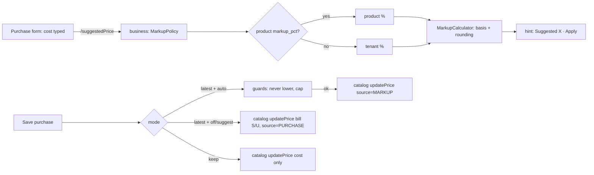
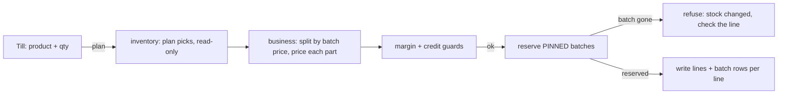

# Selling price per purchase (batch price) and the purchase-based markup rule — analysis

Status: **PR-1, PR-2, PR-2b, PR-3a, PR-3b, PR-3c (§7–§10) and PR-4 — approval (§11) — built.**

## 1. The question

> We buy abc-123 at 200, later the same product at 250. Today the system re-prices everything to the latest. Some shops
> want each purchase to sell at its own price (by batch). Make it configurable, and add a purchase-rate-based automatic
> selling price (markup %).

## 2. What happens today — traced, not assumed

| Step | Code | Behaviour |
|---|---|---|
| Purchase saved | `PurchaseService.stampRatesOnProduct` → `catalogClient.updatePrice(productId, sell, cost)` | **Unconditional.** Any purchase carrying a sell rate overwrites the ONE master `Product.sellingPrice` (and stamps `lastSaleRate`, `lastPurchaseRate`, `lastRateAt`). No setting governs it. |
| Stock received | inventory `StockEntry` (batch layer) | Each receipt is its own row with `batchNo`, `expiryDate`, `purchasePrice`, `paidTotal`. **It has no sell price.** |
| Sale priced | `SagaSellService` ~l.880 | `lineRate` = cashier's typed rate → else B2B contract/tier price (`PriceRuleService.quote`) → else catalog `sellingPrice`. Priced **before** stock is reserved. |
| Stock picked | inventory reservation (`ReservationPick`) | FEFO by expiry, per batch, each pick carrying `unitCost` → COGS is already per batch (correct). |
| Who may type a price | setting `pos.entry.priceEditable` | Only governs the cashier's override. |

**So yes:** after the 250 purchase, every unit of abc-123 — including the ones bought at 200 — sells at 250. **Cost**
is already layered correctly per batch; only the **selling price** is single.

Readers of the product price (each must be classified when this is built — Rule 0): `SagaSellService`, `SellService`,
`SellController` (till prefill), `StockController`, `SalesQuoteService`, catalog `ProductService` (picker projection,
cached — PERF-8/CACHE-1), `PublicProductController` + marketplace `CartService` (storefront), `PriceRuleService`
(B2B tiers). Plus the margin guard, returns, receipts/invoices, reports.

## 3. How established systems do it

| System | Batch / lot selling price | Purchase-based price |
|---|---|---|
| **Marg ERP / Busy** (pharmacy & distribution, South Asia) | **Yes — batch-wise Sale Rate and MRP**; at billing the cashier sees each batch with its own rate and picks one (or FEFO picks). | Rate per batch entered at purchase, optionally from a markup. |
| **Tally Prime** | Batch-wise MRP supported; price levels and dated *standard selling price* | Price list update is manual. |
| **Odoo** | Lots carry cost (FIFO/AVCO), **not** a sale price; selling price comes from price lists | Price-list rule *"based on cost + x %"* with rounding. |
| **SAP Business One** | Batches carry no own price | Price lists with a factor on a base (last purchase price) — a markup rule. |

Local reality (Pakistan): medicine packs carry a **printed MRP set by DRAP**, and old stock **must** be sold at its old
printed price. That is exactly batch-wise pricing — the pharmacy shape needs it; a mobile or general retail shop
usually wants "latest price".

## 4. Recommended design

### 4.1 One setting: how a purchase affects the selling price — `pos.pricing.purchaseMode`

| Mode | What a purchase does | Who it suits |
|---|---|---|
| `LATEST` (today, default for existing tenants) | Overwrites the product price, as now | General retail, mobile |
| `KEEP` | Never changes the product price; shows the purchase's rate as a suggestion only | Shops with fixed shelf prices |
| `PER_BATCH` | Stores the sell rate **on that receipt's stock batch**; the product price is the default for batches without one | Pharmacy (MRP), FMCG distribution, anyone with old-price stock |

Overridable per product (a pharmacy might keep `LATEST` for its general items). Precedence: product → category →
tenant → platform default. Business-type presets: Pharmacy → `PER_BATCH`; others → `LATEST`.

### 4.2 `PER_BATCH` — how a sale is priced

- `StockEntry` gains `sell_price` (Flyway, nullable; existing batches stay NULL = use the product price — no backfill
  guessing).
- The purchase passes its `bsellRate` to the batch it creates (already in the payload), instead of to the product.
- **Pricing must follow the pick, not precede it.** Today the line is priced before the reservation chooses batches.
  In `PER_BATCH` the reservation's picks come back with each batch's `sell_price`, and a line that spans two batches
  at different prices is **split into two sale lines** (qty × rate stays exact, receipts and returns stay per line).
- **The cashier can choose the batch.** The item picker drills down: `abc-123 — 7 @ 200 (B-0912, exp 03/27) · 10 @ 250
  (B-1003)`. Default selection follows the shop's pick rule (FEFO = earliest expiry; FIFO = oldest receipt).
- B2B contract/tier prices and the cashier's override still win (they are a price *for this customer/sale*); the batch
  price replaces only the catalog fallback. The margin guard compares against the batch's own cost.
- Storefront / quotes: price from the batch the reservation would pick at that moment, re-checked at checkout (the
  storefront already re-validates stock server-side).

### 4.3 The markup rule — suggested price from the purchase rate

- `price = cost × (1 + markup%)` — **markup on cost**. Offer **margin on selling price** too (`cost ÷ (1 − margin%)`)
  and label the difference plainly: 14.5% markup on 100 = **114.50** (≈ 12.66% margin); 14.5% margin = **116.96**.
- Modes: `OFF` · `SUGGEST` (default — the purchase form shows "Suggested 114.50 · [Keep 110.00] [Apply 114.50]") ·
  `AUTO` (applied only after the purchase commits) · `APPROVAL` (owner approves before customers see it).
  In `PER_BATCH` the result is that batch's price, never the product's.
- Rounding: exact · up to Rs 1 · nearest Rs 5 · nearest Rs 10. "Never lower the price automatically" on by default;
  a cap on automatic increases (e.g. 10%) above which it asks.
- Lives with the existing B2B price rules in catalog-service (`PriceRuleService`): one place answers "what does this
  cost the customer", so the till, quotes and the storefront cannot drift.

### 4.4 Price history — always

`product_price_history`: product, batch (if any), old → new, source (MANUAL / PURCHASE / MARKUP / APPROVAL), the
purchase, the rule and rounding used, who, when. Written in the purchase's own transaction; caches evicted after
commit (CACHE-1 pattern).

### 4.5 What never changes

Historic sale lines, receipts, invoices, COGS, batch cost and tax postings. Selling price and inventory cost stay
separate — the markup result is never used as cost.

## 5. Slices (each: gate first, Cypress + unit, Test Book, step-by-step capture)

| Slice | Scope | Risk |
|---|---|---|
| **PR-1** | The mode setting with `LATEST` / `KEEP` + price history + "suggested price" on the purchase form | Low — today's behaviour stays the default |
| **PR-2** | Markup rule (markup/margin, rounding, SUGGEST/AUTO, product/category/tenant precedence) | Medium — touches the purchase path |
| **PR-3** | `PER_BATCH`: `StockEntry.sell_price`, price-after-pick, line split, batch drill-down picker | **High — money on every sale**; needs the full reader classification of §2 |
| **PR-4** | `APPROVAL` mode + approval queue | Medium |

## 6. Decisions needed

1. **Default for existing tenants:** keep `LATEST` (no surprise), with Pharmacy getting `PER_BATCH` only when chosen? *(recommended)*
2. **A line spanning two batch prices:** split into two lines *(recommended — exact and auditable)* or price the whole line at one batch?
3. **Who may change the mode and approve price changes:** owner/admin *(recommended)*.
4. **Markup default:** `SUGGEST` with no tenant default % until the owner sets one *(recommended)*, or a platform default such as 14.5%?
5. **Order:** PR-1 → PR-2 → PR-3 → PR-4 *(recommended)*.

## 7. PR-1 — as built

| Part | Where | Note |
|---|---|---|
| Setting `pos.pricing.purchaseMode` = `latest` (default) \| `keep`, group Purchasing | `BusinessSettingsCatalog` | Values are **lower-case**: `SettingsService.getChoice` lower-cases the stored value and matches it against the allowed set — an upper-case set never matches and KEEP would silently act as LATEST (pinned by `PurchasePriceModeTest`). Writes are owner/admin (`SettingsController`). |
| KEEP sends only the cost | `PurchaseService.stampRatesOnProduct` (both call sites: receive, edit) | Unknown value or settings outage → `latest` (today's behaviour; a purchase is never blocked by settings). |
| `product_price_history` (V21) | catalog | One row per **actual** change (`compareTo`, so 110 = 110.00), same transaction as the change. |
| Writers recorded — 4 of 4 | `ProductService.create` (MANUAL, old null) · `update` (MANUAL) · `updatePrice` (PURCHASE, ref = bill no.) · `ProductImportSpec.persist` (IMPORT; import has no transaction, so its history commits separately, like its cache eviction) | Found by `setSellingPrice` + every `productRepository.save*`; the import only creates (a taken name is refused). |
| Contract | `CatalogClient.updatePrice(id, price, purchaseRate, ref)`; the 3-arg form is a `default` delegating with `ref = null` | One caller (`PurchaseService`), no implementations. |
| Read | catalog `GET /products/{id}/price-history` (owner/admin/super — it carries the cost), monolith `/productPriceHistory?productId=` | Scoped by `getEntity` (anti-IDOR): another tenant gets not-found. |
| Screen | purchase form `#purchasePriceEffect` (says *change A → B* / *stays A* / *keep*), product form "Price history" link + dialog | `price-history.js`; rendered from `calculateNetPurchase()`, new-bill reset and the next-line clear. |
| "From" price on the hint | the picker's `data-price` | **Verified** (guide P2 a4): a second New Purchase on the same page, after a bill moved the price, prefills and says the NEW price — the picker refreshes on save. |
| Time of a change | catalog sends `changedAt` as an instant with its offset; the dialog shows it in the browser's time | Found in the guide walk: the containers run UTC, so a bare wall-clock "08:00" showed for a 13:00 change in Pakistan. Gate G10 now asserts the shown time is local now. |
| Tests | catalog `ProductPriceHistoryTest` 7/7; business `PurchasePriceModeTest` 6/6; Cypress gate `pricing-purchase-mode.cy.js` G1–G10 **10/10** (2026-10-05); step-by-step guide `cypress/e2e/docs/price-mode-guide.cy.js` P1–P5 **5/5**, page built by `docs/guides/build-price-mode-guide.js` | |

## 8. PR-2 — the markup rule (design, 2026-10-05)

**What the owner sets** (Settings → Configuration → Purchasing, owner/admin):

| Setting | Values | Default |
|---|---|---|
| `pos.pricing.markupMode` | `off` · `suggest` · `auto` | `suggest` |
| `pos.pricing.markupBasis` | `markup` (on cost: 100 → 114.50 at 14.5%) · `margin` (of the price: 100 → 116.96 at 14.5%) | `markup` |
| `pos.pricing.markupPct` | a percentage; **0 = no rule** | `0` (decision 4: no platform default) |
| `pos.pricing.markupRounding` | `exact` · `up1` (up to the next whole rupee) · `near5` · `near10` | `exact` |
| `pos.pricing.markupNeverLower` | Auto never lowers a price | on |
| `pos.pricing.markupMaxRisePct` | Auto does not raise a price by more than this % (0 = no cap); above it the rule only suggests | `0` |

**Per product:** an optional **Markup %** on the product form (`products.markup_pct`, V22). Blank = the business's
percentage. Precedence product > tenant now; **category is PR-2b** — the column and precedence slot are reserved
but there is no category screen to set it on, and a value nobody can set is not a feature.

**One calculator, server-side** (`MarkupCalculator`, business-service, pure): cost → raw (`cost × (1+p)` or
`cost ÷ (1−p)`, half-up to paisa) → rounded. The purchase form asks the server for the suggestion
(`/suggestedPrice?productId&cost`); it never re-implements the arithmetic, so the screen and Auto cannot disagree.
Margin ≥ 100% is refused (division by zero or a negative price).

**How it combines with PR-1's purchase mode:**

| Purchase mode | Markup off | Markup suggest | Markup auto |
|---|---|---|---|
| Latest | the bill's S/U rate becomes the price (as today) | the form shows *Suggested 114.50 · Apply*; Apply fills S/U; the bill's S/U becomes the price | the **rule's** price becomes the product price (history source MARKUP), within the guards; the bill keeps its own S/U as typed |
| Keep | price never moves | suggestion shown for information | suggestion shown; price never moves (Keep wins — "never" means never) |

Auto guards: never lower (on by default) and the rise cap. A guarded-out rule changes nothing and the hint says why.
Approval of a held-back change is PR-4.

Trace (Rule 0): `products.markup_pct` has 4 writers to cover — create, update (`fromDto`), CSV import (not in this
slice: the column stays blank on import, stated on the page), `updatePrice` (never touches it). Readers: `toRef`
(new `ProductRef.markupPct`), the product form, `MarkupPolicy`. `ProductRef` is a contract DTO — adding a nullable
field is backward-compatible for every consumer (Jackson ignores unknown fields; verified on the `ProductRef` mapper
config before shipping).

### 8.1 PR-2 — found in the gate and the walk (2026-10-05)

| Finding | Cause | Status |
|---|---|---|
| **Use 240.45 did nothing** when clicked straight from the P/U box (gate M9 red on the deployed build) | P/U's `onblur` re-rendered the suggestion line between mousedown and mouseup; the browser fires no `click` when the two land on different elements. Traced with a capture-phase event log: mousedown + mouseup on the button, no click. | Fixed: the line is rebuilt only when what it says changes (`data-sig`), and the button has one delegated handler. M9 passed with the fixed file evaluated on the page; **needs a monolith rebuild to ship**. |
| Reopening the Products list while it is still reloading after a save throws `Cannot read properties of undefined (reading 'style')` inside DataTables (`catalog-products.js` `deliver`, l.1663) | A server-side page delivered into a table `showProducts()` has just rebuilt | **Pre-existing, not PR-2.** The grid still renders; console error only. Recorded, not fixed (needs consent). The guide waits for the reload. |

Gate `cypress/e2e/business/pricing-markup.cy.js`: M1–M8, M10, M11 green on the deployed build; M9 green with the fix, pending deploy.
Unit: business 31/31 (MarkupCalculatorTest 5, MarkupPolicyTest 9, PurchasePriceModeTest 11, +6 neighbours), catalog 152/152.

## 9. PR-2b — markup by category (2026-10-05)

- `categories.markup_pct` (V23). Precedence **product > category > business**; the suggestion's `pctSource` says which
  (PRODUCT / CATEGORY / BUSINESS) and the purchase form names it ("this category's").
- Its own writer, `CategoryService.setMarkup` → `PUT /categories/{id}/markup` (owner/admin/super): the general category
  update rewrites name, description and parent from the DTO, so a markup screen going through it could wipe them.
  Scoped (anti-IDOR), validated 0–1000 like the product's, and it publishes `CatalogCategoriesChanged`, which already
  evicts both the category list and the product refs (the refs carry `categoryMarkupPct`).
- Readers: `toRef` → `ProductRef.categoryMarkupPct` → `MarkupPolicy.suggest(cost, product, category, current)` in both
  callers (`PurchaseService` Auto, `PurchasePricingController` suggestion). The single-product `getRef` the purchase
  path uses is uncached; the batch refs cache is evicted by the category event.
- Screen: **Settings → Markup by category** (owner/admin; not under Price Rules, which only dealer-pricing shops see).
  One row per category, saved when the box is left, with "Saved" or the server's sentence.
- Tests: catalog `CategoryMarkupTest` 5/5; business `MarkupPolicyTest` 10/10 (category precedence added); gate
  `pricing-markup.cy.js` M12–M15 (pending deploy).

### 9.1 PR-2b — found by gate M13 (2026-10-05)

| Finding | Cause | Status |
|---|---|---|
| **Every save on Markup by category was refused (403)** in the browser, though the same request from a test client succeeded | the save used `global: false` (no blocking overlay on a settings row), which also skips the `ajaxSend` hook that adds the CSRF header — the documented L16 trap in `header.html` | Fixed: `headers: xsrfHeaders()`. Verified with the fixed file evaluated on the deployed page. Needs a monolith rebuild. |
| The screen said **"no markup set"** for a business with 14.5% when opened quickly | it read the page-load flag, which had not arrived yet | Fixed: the screen reads the business's % itself. Same verification. |

## 10. PR-3 — PER_BATCH: each purchase sells at its own price (review, 2026-10-05)

### 10.1 Trace (Rule 0)

**Readers of the selling price — 13 call sites in 9 files** (excluding catalog's own mappers/writers):

| # | Reader | What it does | In PER_BATCH |
|---|---|---|---|
| 1 | `SagaSellService:884` | the sale line's fallback price (after cashier rate and B2B quote) | **WANTS the batch price** — the core change |
| 2–3 | `StockController:59, :115` (`/productStock`, `/getStockByBatch`) | the till / purchase form prefill (`bsellRate`) | **WANTS the batch price** (of the batch the cashier picked, or FEFO's first) |
| 4 | `SellController:470` (`/looseInfo`) | the per-piece hint on a broken pack | **follows** the chosen batch's price |
| 5 | `SalesQuoteService:509` | a quote's line price | keeps the catalog price (a quote prices the product; on conversion its locked rate is the cashier's rate, which wins) |
| 6 | `SellService:260` | quick-pick tile label | keeps catalog (a label, not a charge) |
| 7 | `PriceRuleService:88` | B2B PERCENT rules: % off the catalog price | keeps catalog in PR-3 (decision below) |
| 8 | `PublicProductController:44` | storefront listing | keeps catalog (storefront is out of PR-3) |
| 9 | `marketplace CartService:78` | storefront cart price | keeps catalog |
| 10–11 | `PurchaseService:622`, `PurchasePricingController:44` | markup guards' "current price" | unchanged (in PER_BATCH the rule prices the batch; the guards compare with the product price) |
| — | browser: picker `data-price` | till / purchase prefill | replaced by the batch price once a batch is chosen |

Count: **4 want the batch price, 7 keep the catalog price, 2 unaffected.**

**Order of a sale today:** `buildLines` (prices every line) → margin guard → credit guard → `reserve` (FEFO picks
batches) → write. **The price is fixed before the batches are known** — PER_BATCH needs the batch first.

**Contracts today:** `StockReservationLine {itemId, quantity}` cannot pin a batch; `StockPick {itemId, batchNo, quantity,
expiry, unitCost}` has no sell price and no line reference; `StockImportLine` (purchase → stock) carries cost, no sell
price; `GET /stock/batches/{productId}` exists (the drill-down can use it).

### 10.2 ⚠ Existing defect found by the trace — batch rows doubled when one product is on two lines

`SagaSaleWriter.recordBatches` attaches picks to a line **by product id**. Two lines of the same product each record
**both** lines' picks. Verified in the live data: invoice `customer_history_id 6292`, product 2621 — **2 lines, 2 units
sold, sell_batch rows for 4 units**. `cogsFromPicks` (the sale's own COGS) sums picks once and is right; but
`sell_batch` is what the **edit and return paths** cost from, so they would cost that sale's goods twice. Rare today
(1 invoice); PER_BATCH's line split makes "one product, two lines" the normal case — so this is fixed FIRST (PR-3a).

### 10.3 Recommended design

- **PR-3a — picks belong to a line, not a product.** The reservation line carries its sale-line index; each pick
  echoes it; `recordBatches` matches on it. Gate: one product on two lines → batch rows sum to the units sold; a return
  costs once. (Independent of PER_BATCH — a money fix on its own.)
- **PR-3b — the batch's own price.** `stock_entries.sell_price` (nullable; existing batches stay NULL = the product
  price, no backfill guess). `pos.pricing.purchaseMode` gains `per_batch`: the purchase writes its S/U rate (or the
  markup rule's price) **to its batch**, not to the product. `/stock/batches` returns it.
- **PR-3c — price after the pick, shown before the money.** In PER_BATCH the server first asks inventory for a
  **plan** (the batches FEFO — or the cashier's chosen batch — would take, read-only), splits the line where the
  plan crosses a price, prices each part, runs the guards, then **reserves exactly those batches** (pinned). If a
  pinned batch is gone by then (another till sold it), the sale is refused with "stock changed — check the line",
  never silently re-priced. The till shows the same plan before payment: `abc-123 — 7 @ 200 (B-0912) + 3 @ 250
  (B-1003)`, with a batch drill-down to choose. Precedence unchanged above it: cashier's rate > B2B contract price >
  **batch price** > product price.

### 10.4 Decisions needed before PR-3 is built

1. Fix the doubled batch rows first as **PR-3a** (recommended — a money defect today, and PR-3c depends on it).
2. **Plan, then pinned reserve** (recommended — what the till shows is what is charged; a race refuses instead of
   re-pricing) versus reserve first and price from the picks (simpler, but the cashier sees the split only after
   pressing Complete, and a guard refusal has to release stock).
3. **Scope:** POS till and pharmacy dispense now; quotes, the storefront and B2B percent rules keep the product
   price (recommended — each has its own price contract; stated on the screen and the page).

### 10.5 Decisions taken (2026-10-05) and PR-3a as built

Decisions: PR-3a first; plan then pinned reserve; till + pharmacy dispense (quotes, storefront and B2B percent rules
keep the product price).

**PR-3a — two defects, one slice.** The trace found a second hole beside the doubled batch rows: the reservation's
pass 1 checked each **line** against stock on its own, so two lines of 5 against 7 both passed and pass 2 held 5 + 2
without noticing the shortfall. **Red run on the deployed build:** B1 failed (each line recorded both lines' batches);
B2 recorded `INV-000498` selling 10 against 7 on the shelf (voided afterwards, reason recorded).

| Change | Where |
|---|---|
| `StockReservationLine.lineRef`, `StockPick.lineRef` (optional; old constructors kept, 7 call sites unchanged) | commerce-contracts |
| `reservation_picks.line_ref` (V13); pass 1 sums need **per product across lines**; pass 2 echoes the line on each pick and refuses (rolls back) a line held short | inventory `ReservationService` |
| reservation lines carry their position (both builders, incl. the no-bonus retry); `recordBatches` matches a pick to **its line**, falling back to product for line-less picks | business `SagaSellService`, `SagaSaleWriter` |

Callers without a line (marketplace checkout and order holds) merge per product already and are unchanged.
Tests: inventory `ReservationServiceTest` 16/16 on real MySQL (3 new: summed check, picks name their line, line-less
unchanged); business `SaleBatchByLineTest` 3/3 + sale-path neighbours (27). Gate `cypress/e2e/business/sale-batches-by-line.cy.js`
B1–B3: red on the old build as above; green pending deploy.

### 10.6 PR-3b as built — each batch can carry its own price

| Change | Where |
|---|---|
| `stock_entries.sell_price` (V14), NULL = the product's price; no backfill | inventory |
| `StockImportLine.sellPrice`, `StockImportResult.entryIds`, `StockPurchaseAdjust.{stockEntryId, sellPrice}`, `StockBatch.{stockEntryId, sellPrice}` | commerce-contracts (one positional `StockBatch` call, in inventory, updated) |
| import stores the price and returns the batch ids; `reconcilePurchase` re-prices the purchase's own batch **by id**, scoped to the tenant and product, **before** the delta (a price-only edit has delta 0) | inventory |
| `purchase.stock_entry_id` (V79) — a batch number is optional and often blank, so the purchase keeps the batch's id | business |
| `pos.pricing.purchaseMode` = `per_batch`: the product's price is not moved (cost still stamped); `batchSellPrice` = the bill's S/U, or the markup rule's price on Auto (no guards: a new batch has no price to protect); an edit re-prices its batch even when only S/U changed | business `PurchaseService` |
| `/productStock` returns the batches in Per batch whatever the tenant tracks; `/suggestedPrice` never reports Auto applying to the product in Per batch | business |
| purchase-form line: "This purchase's stock will sell at 250. Earlier stock keeps its own price, and the product's price stays 200." (6 languages) | monolith `price-history.js` |

Found while building: MapStruct is strict, so `stockEntryId` is ignored on input (server-owned, never from the form);
the MS-6 ModelMapper oracle fuzz-matched the new field onto `PurchaseDTO.stock.stockId` — the oracle stands for code
that never had the field, so it is cleared for that comparison. `PurchasePriceModeTest.unknown_value_is_latest` used
`per_batch` as its "unknown" example and now uses one that is not a mode.

Tests: business 57/57 (new `PurchasePerBatchTest` 6), inventory 19/19 on real MySQL (2 new). Gate
`cypress/e2e/business/pricing-per-batch.cy.js` X1–X6 on `owner.pharma@`, pending deploy. The SALE still prices from the
product until PR-3c.

### 10.7 PR-3c as built — the sale is priced from the batches it takes (2026-10-05)

**Order of a sale in Per batch** (every other mode is untouched — it never asks for a plan):
`buildLines` → **plan** (inventory, read-only) → **split + re-price** → margin guard → credit guard → **reserve, pinned**
→ write → confirm. The guards judge the prices that will be charged, and nothing is held until they pass.

| Change | Where |
|---|---|
| `POST /reservations/plan` — the batches a reserve would take now, nothing held, status `PLANNED` (never persisted). A line's `stockEntryId` is a **preference** here (the cashier's chosen batch first, the rest FEFO) | inventory `ReservationService.plan`, `ReservationController`, `InventoryClient.plan` |
| One in-memory allocator for plan and reserve, over the batches pass 1 loaded. On a **reserve** `stockEntryId` is a **pin**: only that batch, and a batch that can no longer cover it refuses the whole request with `batch changed: …` — nothing held. Pins are served before FEFO lines (a FEFO line listed first could otherwise eat a pinned batch). A batch id from another tenant or product is simply not among the loaded batches → refused | inventory `ReservationService.allocate` |
| `StockReservationLine.stockEntryId`; `StockPick.{stockEntryId, sellPrice}`; `ReservationStatus.PLANNED` (old constructors kept; every existing call site unchanged) | commerce-contracts |
| `BatchPriceSplit` (pure): paid units first, grouped by the batch's price (NULL = the product's price); the bonus rides on the last part's batches; an amount discount is shared in proportion, to the paisa, the last part taking the remainder; each part's cost is its own batches' (null if any is unknown — never guessed) | business |
| `SagaSellService.priceByBatch`: plan (with the bonus retry of #17 P3 D11 — free goods withheld when only the paid units fit), split, then **re-build through `buildLines`** so discount, tax and cost are worked exactly as for any line; parts carry `priceReason = "Batch …"` and their batches' cost for the margin guard; reservation lines pinned per part | business |
| Precedence: cashier's typed rate > contract/tier price > **batch price** > product price. "Typed" = `sellRate ≠ autoRate` (the till sends the rate it put in the box). Out of PR-3c, priced as before: loose (broken-pack) lines, lines naming serials, made-to-order items, and every EDIT | business `batchPriced` |
| `autoRate`, `stockEntryId` on **both** `SellDTO` twins (the monolith relay drops an unknown field silently); MapStruct `toDto` ignores both | business + monolith |
| `POST /batchPricePreview` — the same plan + split + line build, nothing held or written; `perBatch=false` outside Per batch | business `SellController`, monolith proxy, `PermissionInterceptor` (`sale.create`) |
| Till: a **Batch** list (FEFO default, each batch with its quantity and price), the rate box starts at the first batch's price; Add to Cart previews the line and puts the parts in the cart with a note; **Complete Sale re-checks the whole cart** — if the batches change a price the cart is corrected and shown and nothing is posted until Complete again | monolith `per-batch-till.js`, hooks in `business.js` / `main.js`, `businessDashboard.html`, 6 languages |

**Rule 0 — readers of the selling price (§10.1), as built:** 4 want the batch price — the sale line (#1), the till prefill
(#2–3, via `/productStock` batches) and the per-piece hint (#4, it follows the box); 7 keep the product price (quotes,
quick-pick labels, B2B percent rules, storefront, cart, markup guards ×2); 2 unaffected. The reservation's other callers
(marketplace checkout, order holds) send no `stockEntryId` and get FEFO exactly as before.

**Found while building:**

| Finding | Cause | Status |
|---|---|---|
| The till's batch note never appeared (gate S6 red) | the notice row is collapsed (`pos-notice-empty`) unless `syncSellNoticeRow` opens it, and it decides from `:visible`, which is false for any child of a collapsed row | Fixed in `per-batch-till.js`: the note opens its row itself. A first fix changed `syncSellNoticeRow`'s rule instead — that opened the row for the older FEFO/sellable notices on EVERY shop's till and turned two unrelated gates red (`saga-sell-ui`, `contract-price-charged` — both green on the base build, red with it). Reverted; the rule is unchanged |
| **A typed price was re-priced at Complete** — the cashier typed 230, the cart showed 230, Complete corrected it to the batch's 200 (guide case S2 red on the deployed build) | the Add preview echoed 230 back and the till stored it as its own price (`autoRate = 230`), so the whole-cart re-check read the line as "not typed" and priced it from the batch | Fixed: the preview says per part whether the BATCHES set the price (`batchPriced`); the till marks only those as its own. Gate S8 (typed price survives Complete) and `PerBatchSaleTest.previewMarksATypedPriceAsTheCashiers` |
| Complete Sale's confirm dialog opened late in Per batch | the whole-cart re-check runs first, by design | The gate waits for the re-check; noted in the guide (S1 a3, S3 a2) |

**Tests:** inventory `ReservationServiceTest` **23/23** on real MySQL (7 new: plan names batch + price and holds nothing,
the chosen batch first, plan shortfall wording, pinned reserve holds exactly its batch, a gone batch refuses and holds
nothing, pins before FEFO, another tenant's batch refused); business **502/502** (new `PerBatchSaleTest` 12,
`BatchPriceSplitTest` 7). Gate `cypress/e2e/business/pricing-per-batch-sale.cy.js` S1–S8 **8/8** on the deployed build
(2026-10-05). Step-by-step guide cases R1 (PR-3a), X1 (PR-3b), S1–S3 (PR-3c) in `cypress/e2e/docs/price-mode-guide.cy.js`.

**Not in PR-3c (stated on the page):** loose lines priced per batch; quotes, the storefront and B2B percent rules (decision
3); PR-4 (approval of held-back price changes).

### 10.8 CART-3 — one cart row with batch sub-lines (2026-10-08)

Decided 2026-10-08: when one Add to Cart is priced across two or more batch prices, the cart shows **one row** for the
product with its batches as sub-lines (`B-0912 · 7 × 200.00 = 1400.00`). **Display only** — `data[]`, the cart that is
submitted, parked, totalled and edited, still holds one line per batch price, and the invoice still records them as
separate lines (decision 2).

| Reader of the cart (Rule 0) | Impact |
|---|---|
| `renderCart` / `sellCartRow` | groups consecutive lines sharing a `batchGroup` (2+); every other line drawn by the unchanged `sellCartRow` |
| DataTables footer (QTY, Price, Total sums of the grid's cells) | a grouped row's number cells are `{display, value}`; `value` = the sum of what the lines' own rows gave, so every footer is unchanged (gate S10) |
| `CIT(data)`, `sellLineDiscountTotal`, `sellRefreshPayable`, Change/Due | read `data[]` — untouched |
| `UIT(pid, idx)` (Del, counter to zero) | unchanged for ordinary rows; a grouped row's Del calls `UIG(group)`, removing that Add's lines only (S9) |
| counter `+/-` | not drawn on a grouped row (stepping one batch of a split line would need a re-plan); ordinary rows unchanged |
| last-rate hint (`row[3]`) | a grouped row compares its first batch's rate (`cmp`) |
| park / resume | the cart is sent and returned as untyped JSON, so `batchGroup` survives; resumed basket draws the same row (S11) |
| `beforeComplete` re-check | a line it splits keeps (or starts) a group; one-part lines unchanged |
| submit (`addSell`), edit (`updateSell`) | `batchGroup` is an extra field on lines that already carry `batchNote`; Per batch is off while editing, so no groups there |
| **shops not in Per batch** | lines never carry `batchGroup` → `renderCart` takes the old path for every line; the render rule passes plain values through; no behaviour change |

Gate `pricing-per-batch-sale.cy.js`: S6 now asserts one row + two sub-lines; **S9** Del removes both lines of the Add and
nothing else; **S10** QTY / Price / Total footers equal the sums of the submitted lines; **S11** a parked basket returns as
the same row. Red run on the deployed (pre-CART-3) build: S1–S5, S7, S8 green; S6, S9, S10, S11 red for the expected
reason (no grouped row). Guide step S1 a2 updated.

## 11. PR-4 — the owner approves a price before customers see it (design, 2026-10-05)

Decisions already taken (§6): order PR-1 → PR-4, and **owner/admin approve price changes** (decision 3). This section
fills what §4.3 left open; nothing here changes a shop that does not choose it.

### 11.1 What changes for the owner

* **Settings → Purchasing → Price from the purchase cost** gains a fourth choice, **Approval — every price a purchase
  would set waits for you**. Default stays **Suggest**.
* In **Approval**, a purchase never moves the product's price by itself. The price it *would* set — the markup rule's
  price when a % applies, otherwise the bill's S/U rate when it differs from today's price — becomes a **pending price
  change**. The cost (last purchase rate) is still stamped, as in every mode.
* In **Auto**, a change a guard held back (it would lower the price, or raise it past the cap) is no longer only a
  sentence on the form: it becomes a pending change too, with the guard as its reason. Auto's own changes still apply
  at once.
* **Purchase → Price approvals** (owner/admin; a count badge on the menu) lists pending changes: product, price now,
  proposed price, the change in % (red when it lowers the price), why (the rule and its %, or the guard), the bill, who
  and when. **Approve** sets the price (history source **APPROVAL**, naming the bill); **Reject** records the decision
  and changes nothing.
* The purchase form says it before saving: *"Saving sends 240.45 for approval; the selling price stays 200.00 until an
  owner or admin approves it (Purchase → Price approvals)."*

### 11.2 Rules (each is a gate case)

| Rule | Why |
|---|---|
| One pending change per product; a newer proposal **supersedes** the older (status SUPERSEDED) | two pending prices for one product cannot both be right; the latest cost is the one to judge |
| Approve carries the price the screen showed (`expectedCurrent`); if the product's price is no longer that, **refused**: "The price is now X — it changed since this was proposed. Reload." | an approval decided against a price that has since moved would overwrite someone else's change (the BLK-4 rule, applied here) |
| Approve/Reject are owner/admin; proposing is done by the purchase path for whoever records the purchase | approving your own bill's price is the control this exists for; a cashier recording goods-in must still be able to record it |
| Keep never queues; Per batch prices the **batch** (no queue — a new batch has no price to protect, as in PR-3b) | "never changes the price" means never; Per batch has no shelf price to approve |
| A decided change is final (APPROVED / REJECTED are not re-opened) | the record is the audit trail; a new purchase makes a new proposal |
| Scoped by tenant on every read and write; another tenant's id is not found | anti-IDOR, like every catalog read |

### 11.3 Trace (Rule 0)

* **Readers of `pos.pricing.markupMode` — 5:** `MarkupPolicy.mode()`, `MarkupPolicy.suggest()` (both list the allowed
  values: `approval` must be added to **both** or it silently reads as Suggest — the PR-1 lower-case trap's twin),
  `PurchaseService.stampRatesOnProduct` (product), `PurchaseService.batchSellPrice` (batch — Approval behaves as
  Suggest there), `PurchasePricingController.suggestedPrice` (the form's hint). Plus the settings catalogue entry.
* **Writers of `products.selling_price` — 3:** the product form (`create`/`update`, MANUAL), `updatePrice` (purchase,
  PURCHASE/MARKUP) and the new approval (APPROVAL). The approval goes **through `updatePrice`'s write** so the version
  bump (BLK-4), the cache eviction (CACHE-1) and the history row all happen exactly as for a purchase.
* **The new table** `price_change_requests` (catalog V24) has one writer per transition: propose (business → catalog),
  approve/reject (owner/admin). Readers: the approvals list and its count. Nothing else reads it.

### 11.4 Not in PR-4

Notifications beyond the menu badge (email/WhatsApp); bulk approve; approving a Per-batch batch price; approving a
price typed on the product form (the owner typed it — it is already their decision).

### 11.5 PR-4 as built (2026-10-05)

| Change | Where |
|---|---|
| `price_change_requests` (V24): tenant, product, price at proposal, proposed price, cost, source (MARKUP/PURCHASE), reason (APPROVAL / NEVER_LOWER / MAX_RISE), detail, bill ref, status PENDING/APPROVED/REJECTED/SUPERSEDED, who/when proposed and decided, decision note | catalog `PriceChangeRequest`, `PriceChangeRequestRepository` (every query takes the org) |
| `PriceApprovalService`: **propose** (nothing when equal to the price now; supersedes the product's pending one), **list** (≤200 rows, product name and *live* price joined), **count**, **approve(id, expectedCurrent)** → refused with "The price is now X — it changed since this was proposed. Reload and decide again." when the price moved, else `ProductService.updatePrice(…, ref, APPROVAL)`, **reject(id, note)**; decided rows are final | catalog |
| `/api/catalog/price-proposals`: POST propose (the purchase path); GET list, GET `/count`, POST `/{id}/approve`, `/{id}/reject` — owner/admin/super via `@PreAuthorize` | catalog `PriceApprovalController`; `CatalogClient.proposePrice` |
| `ProductPriceHistory.APPROVAL`; `updatePrice` records the source it is given (MARKUP or APPROVAL) | catalog |
| `MarkupPolicy.APPROVAL` in the ONE allowed-values set both `getChoice` calls use (§11.3's trap closed by construction); `Suggestion.detail()` ("14.5% on cost, the business rate") | business |
| `PurchaseService.stampRatesOnProduct`: Approval → price not sent (cost still stamped), the rule's price proposed (MARKUP) or the bill's S/U (PURCHASE); Auto with a guard → the held price proposed with the guard as reason; Keep / Per batch → nothing proposed; the catalog unreadable → the price stays and nothing is proposed (never the bill's rate). Proposing is best-effort: it never refuses a bill | business |
| Settings option **Approval — each new price waits for you** and its help | business `BusinessSettingsCatalog` |
| **Purchase → Price approvals**: Waiting / Approved / Rejected / All; per row now, new, change % (red when lower), why, bill, when; Approve (confirm names old → new) and Reject (optional reason). Red count on the menu item **and on the closed Purchase button**; it refreshes after every purchase save | monolith `price-approvals.js`, `CatalogController` proxies, `businessDashboard.html` (owner/admin/super only, server-rendered), 35 keys × 6 languages |
| Purchase form: Approval sentence (`data-effect="approval"`; `same` when nothing would change); a held-back sentence adds "It waits for approval in Purchase → Price approvals."; no Use button in Approval | monolith `price-history.js` |

**Found while building:**

| Finding | Cause | Status |
|---|---|---|
| **Typing in a form could be pulled back to its first box mid-number** — the purchase form's P/U got "2" and Invoice # got "10" (gate A12, intermittently red) | `openModal` / `revealSection` focus the first field one animation frame after showing it, and a frame is not a fixed time — a busy or throttled page ran it ~800 ms late (measured: the call stack is `crud-modal.js` → `focusFirstField`), after the user had clicked into P/U | **Fixed for every form** in `focus-flow.js`: auto-focus only places a cursor nobody placed — if focus is already inside the container it stands down. Its two callers (openModal, revealSection) both want this. Before: focus moved to Invoice # 4/4 runs; after: 0/3 (and it still lands on Invoice # when nothing was clicked first). Neighbour gates `business-modal-keyboard` 19/19, `purchase-rapid-entry` 28/28 |
| The Price approvals count stayed hidden after saving the bill that created a proposal (guide T1 red) | the count was read on page load only | Fixed: refreshed after every `addPurchase`/`updatePurchase` (a global `ajaxComplete` hook — `callAjax` stays global for exactly this) |
| The count on the menu item was invisible while the menu was closed | it lived only inside the dropdown | A second badge on the Purchase button (gate A11) |
| Gate `pricing-markup` M1 expected three rule choices | PR-4 added the fourth | Gate updated |

**Tests:** catalog `PriceApprovalServiceTest` **10/10** (catalog total 167/167); business `PurchaseApprovalTest` **7/7** and
the Approval case in `MarkupPolicyTest` (business total 510/510). Gate `cypress/e2e/business/pricing-approval.cy.js`
A1–A12 **12/12**, three runs in a row on the deployed build; neighbour gates `pricing-markup` 15/15,
`pricing-purchase-mode` 10/10, `pricing-per-batch` 6/6, `pricing-per-batch-sale` 8/8. Step-by-step guide cases
**T1–T5** in `cypress/e2e/docs/price-mode-guide.cy.js` (Test Book §27): approve on screen, reject with a reason, the
moved-price refusal, Auto's held change queued, and who may decide.

**Unrelated, seen on this fresh stack (both fail before any focus code runs):** `purchase-inline-product` 8 red —
`#newProductFromPurchase` is not on the page for `demo.business@`; its only condition is `sec:authorize` on
`product.create`, so that user lacks it on this database (why — **unverified**). `education-modal-keyboard` — the
education login probe answers 500 (cause not investigated). notification-service restarts: access denied to
`myplusdb_notification`, which does not exist on this stack — fixed on the branch meanwhile by the verification sweep
(`init-db.sql`). The other two are left to that sweep.

