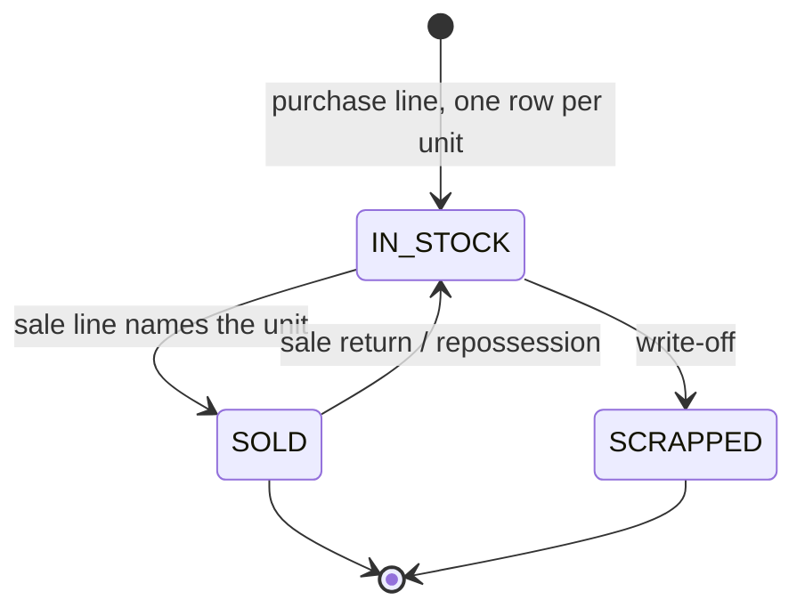
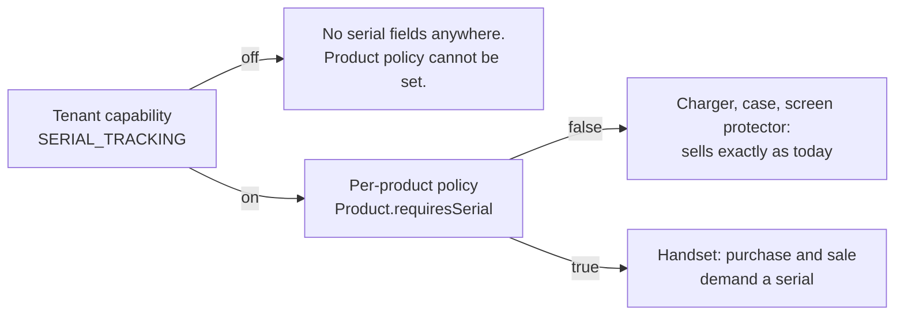
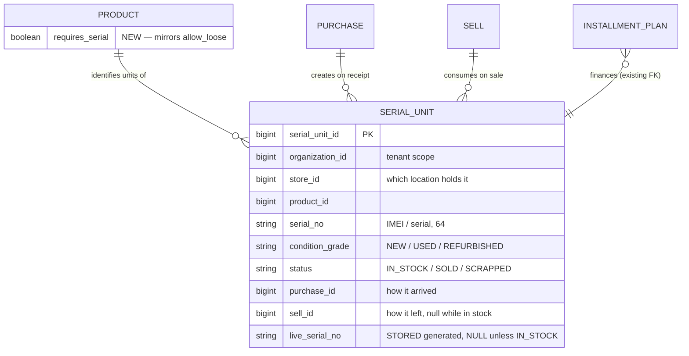

# Serial / IMEI tracking and condition grading — design for review

**Slice family:** SER-1 … SER-4  ·  **Branch:** `feature/UI-UX`  ·  **Status:** DESIGN, awaiting consent
**Capabilities:** `SERIAL_TRACKING`, `CONDITION_GRADING` (both defined in C1, both default ON)
**Raised by:** Shahzad Mobile Shop — *"purchase form: purchase imei/serial number, mobile condition type (used/new); sale form: imei/serial"*

---

## 1. What is true today

Established by reading the code, not by assumption.

| Question | Answer | Evidence |
|---|---|---|
| Is there a serial/unit register anywhere? | **No.** | `serial_unit` appears in exactly 3 files, all of them the *placeholder*: `InstallmentPlan.serialUnitId` and its two migrations. |
| Where does an IMEI live today? | `InstallmentPlan.asset_ref`, free text, 64 chars. | `InstallmentPlan.java:148` — its own javadoc calls it *"a **label**, not a register"*. |
| Is it unique? | Only across **live plans**, via a stored generated column. | `V44__plan_live_asset_unique.sql` |
| Does `StockEntry` carry batch or unit identity? | **No** — `product_id` + `warehouse_id` only. | `StockEntry.java` |
| Does a sale line record which unit went out? | **No** — `Sell` has `product_id` + `quantity`. | `Sell.java` |
| Is there a precedent for "capability + per-product policy"? | **Yes** — `LOOSE_SELLING` × `Product.allowLoose`. | `SagaSellService.java:750`, `SellController.java:360` |

### The gap, stated plainly

**An IMEI is captured only when a handset is financed.** A shop that buys ten handsets and sells three for cash records no IMEI at all — not at purchase, not at sale, nowhere. The shop cannot answer *"who did we sell this handset to?"* for any cash sale, which is the question a warranty claim, a police enquiry and a return all start with.

`InstallmentPlan.assetRef` is not that record. It is a text label on a finance agreement, written by whoever typed the plan, unverified against anything the shop actually bought.

---

## 2. The shape of the solution

A serial-tracked unit is **stock at quantity one, with identity and a lifecycle**. Purchase creates it; sale consumes it; a return or repossession puts it back.

Two orthogonal switches decide whether any of this applies:

This is the `LOOSE_SELLING` × `allowLoose` pattern exactly. A mobile shop sells handsets that are IMEI-tracked **and** chargers that are not — the tenant switch says *may we ask at all*, the product flag says *must we ask for this one*. `Capability.SERIAL_TRACKING`'s own javadoc already states this rule; this slice is the first implementation of it.

---

## 3. The one decision that needs your ruling

**`InstallmentPlan.serialUnitId:151` says the register belongs in inventory-service** — *"FK into inventory-service's per-unit register, once it exists."* That was written as an intention. The evidence gathered above argues against it, and I would rather surface the divergence than take it quietly.

**Recommendation: the register lives in business-service.** Three reasons, in order of weight:

1. **`V44`'s own reasoning forbids the alternative.** Its javadoc is explicit: *"The obvious design is to ask inventory-service whether the serial is already out. That check would fail OPEN the moment inventory-service is slow or down — the sale would go through and the guarantee would be worth nothing precisely when the shop is busiest."* A serial's *"this unit is not already sold"* check is the same check, on the same hot path, with the same failure mode.

2. **Purchase and sale both live in business-service.** `Purchase` and `Sell` are business-service entities. Creation and consumption on one side of a service boundary, with the register on the other, puts a remote call on the sale path — against the standing performance rule (*keep inter-service calls off hot paths*).

3. **inventory-service holds no unit identity to join to.** `StockEntry` is `product_id` + `warehouse_id`. There is no batch there either — `batchNo` lives on `Purchase`, in business-service. A per-unit register in inventory-service would be the *only* identity-bearing row in a service that deliberately deals in quantities.

V44 already drew this exact line and I would keep it: **inventory-service owns quantities; business-service owns which unit.** If you prefer the original inventory-service placement, say so and I will design to it instead — but the sale-path check would then need a local constraint anyway, which is most of the table.

---

## 4. Data model

**Uniqueness follows V44's proven technique.** MySQL has no partial unique index, so `live_serial_no` is a stored generated column that is `NULL` unless `status = 'IN_STOCK'`. NULLs do not collide, therefore:

- many units of the same IMEI across history → all but one are `SOLD`/`SCRAPPED` → `NULL` → no collision;
- two units of the same IMEI **in stock at once** → collision, refused. **That is the safety property.**

A shop that legitimately buys back a handset it sold must be able to take it into stock again — so the rule is *"not in stock twice"*, never *"never twice"*. Being `STORED` and derived from `status`, it re-computes on `UPDATE`: selling a unit frees its IMEI with nothing to remember.

---

## 5. Slices

Each ends with a passing headed Cypress gate before the next starts.

| Slice | Delivers | Gate asserts |
|---|---|---|
| **SER-1** | `serial_unit` table + `Product.requiresSerial` + Configuration switches | A product can be marked serial-tracked; a tenant with the capability off cannot set the flag |
| **SER-2** | **Purchase form**: qty *n* on a serial-tracked product demands *n* serials; each becomes an `IN_STOCK` row | Buying 3 handsets creates 3 rows; a duplicate IMEI **already in stock** is refused; a non-tracked product is unchanged |
| **SER-3** | **Sale form**: scan/pick the IMEI; the named unit flips to `SOLD` and stamps `sell_id` | Selling names a specific unit; selling an IMEI that is not in stock is refused; a sale return puts it back to `IN_STOCK` |
| **SER-4** | **Condition grading** (`NEW`/`USED`/`REFURBISHED`) on purchase, shown on sale | A used handset carries its grade to the sale screen and the receipt |

**SER-2 is where the shop feels it first** — a purchase that records what actually arrived.

### Deferred, deliberately
Bridging `InstallmentPlan.assetRef` → `serialUnitId` is **not** in this family. It is a data migration over live finance agreements and deserves its own slice with its own gate. The placeholder column stays unused until then, exactly as it is now.

---

## 6. Why nothing currently working can break

The standing constraint was *"no break of current implementation of maxtheservice now or in the future."*

| Risk | Why it does not occur |
|---|---|
| A tenant loses a screen | Both capabilities default **ON** (`CapabilityCatalog`), and `requires_serial` defaults **FALSE**. Capability on × policy false = today's behaviour exactly. |
| Existing products change behaviour | `requires_serial` is a new column defaulting `FALSE`. Every product already in every tenant is untracked until an owner says otherwise. |
| Existing purchases/sales break | `serial_unit` is a **new table**. No existing row is read, written or migrated. `Purchase` and `Sell` gain no required column. |
| The sale path slows down | The check is a local indexed lookup in the sale's own transaction — no remote call added. See §3. |
| Installments regress | `V44`'s constraint is untouched and keeps working on `asset_ref`. `serialUnitId` stays null. |
| A serial is demanded where it never was | `requires_serial = FALSE` short-circuits before any prompt, the same shape as `allowLoose` at `SagaSellService:750`. |

**Rollout is therefore inert on deploy.** Every tenant behaves identically the day after as the day before; a mobile shop then turns tracking on for its handsets deliberately, and reversibly.

---

## 7. Open questions

1. **§3's ruling** — business-service (recommended) or the original inventory-service placement?
2. **Does the shop want partial capture?** If 10 handsets arrive and the operator has 8 IMEIs to hand, is the purchase refused, or saved with 2 units flagged `PENDING_SERIAL`? Refusing is cleaner; the shop may find it unworkable at a busy counter.
3. **Condition on purchase or per unit?** A mixed lot — 3 new, 2 used, one price — is one purchase line but two grades. Per unit is correct and slightly more typing.
4. **Should a serial-tracked product be barred from loose selling?** Half a handset is not a thing; the two policies are almost certainly mutually exclusive and could be enforced rather than documented.

---

## 8. Not in scope

Warranty periods, unit-level cost, IMEI validation by checksum (the Luhn check on a 15-digit IMEI is real and cheap — worth its own slice once capture exists), and any bulk import of an existing handset register.
