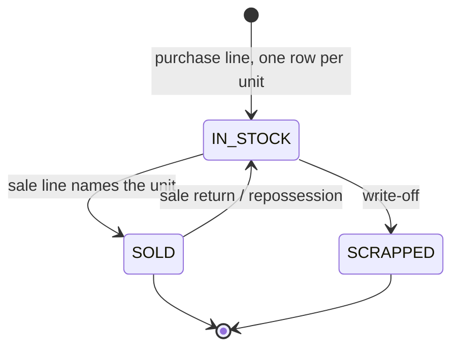
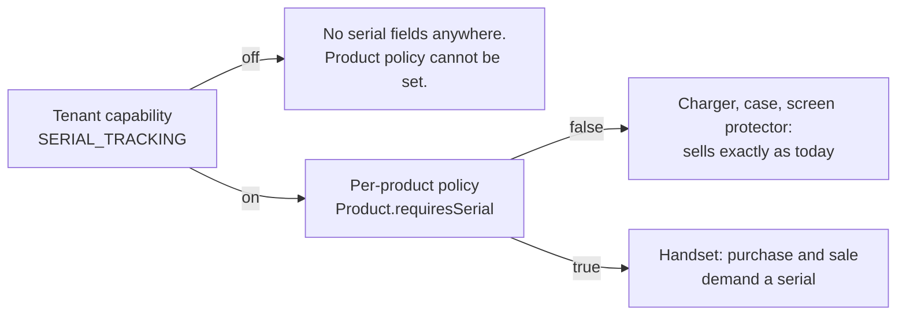
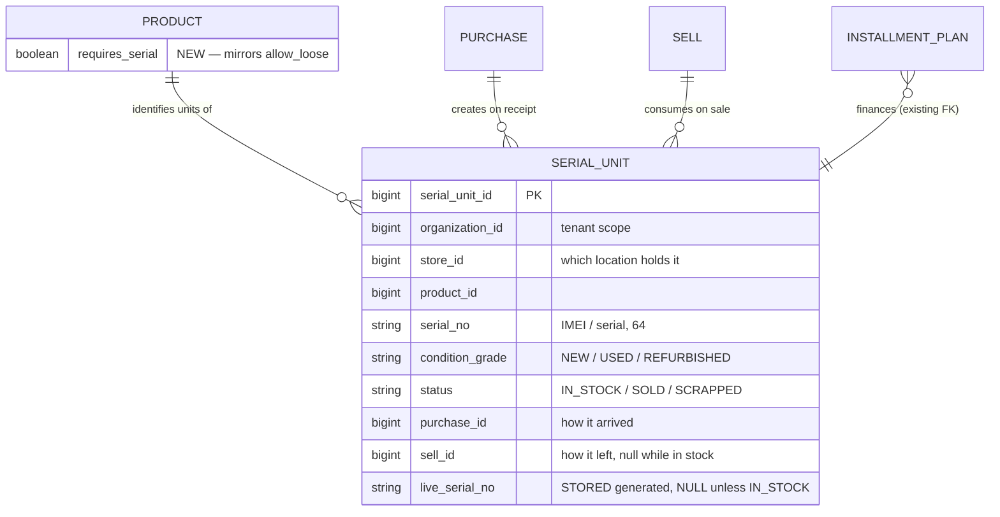

# Serial / IMEI tracking and condition grading — design for review

**Slice family:** SER-1 … SER-4  ·  **Branch:** `feature/UI-UX`

**Status:** **SER-1 ✅ shipped** (as C6 — `products.requires_serial` / `tracks_batch`, catalog V12).
**SER-2 ✅ green** — the register, capture on purchase, read API and UI; `serial-register.cy.js`.
**SER-3 ✅ green** — consumption at the till (V53 `invoice_no`, compare-and-set claim); 15/15 on
`owner.mobile@myplus.com`, plus a cross-tenant case proving a POS shop on the same shape sees no serial fields.
**SER-4 partial** — condition is captured and stored on purchase; it is not yet shown on the sale screen.

**§3's ruling was taken: the register lives in business-service**, not inventory-service as
`InstallmentPlan.serialUnitId`'s comment intended. The reasoning and the user's approval are recorded there and
in the SER-2 delivery log below.

*(Sections 1–5 are the original review and design, kept verbatim as the record of why. The delivery logs at the
end carry what actually shipped and where it diverged.)*
**Capabilities:** `SERIAL_TRACKING`, `CONDITION_GRADING` (both defined in C1, both default ON)
**Raised by:** Shahzad Mobile Shop — *"purchase form: purchase imei/serial number, mobile condition type (used/new); sale form: imei/serial"*

---

## 1. What is true today

Established by reading the code, not by assumption.

| Question | Answer | Evidence |
|---|---|---|
| Is there a serial/unit register anywhere? | **No.** | `serial_unit` appears in exactly 3 files, all of them the *placeholder*: `InstallmentPlan.serialUnitId` and its two migrations. |
| Where does an IMEI live today? | `InstallmentPlan.asset_ref`, free text, 64 chars. | `InstallmentPlan.java:148` — its own javadoc calls it *"a **label**, not a register"*. |
| Is it unique? | Only across **live plans**, via a stored generated column. | `V44__plan_live_asset_unique.sql` |
| Does `StockEntry` carry batch or unit identity? | **No** — `product_id` + `warehouse_id` only. | `StockEntry.java` |
| Does a sale line record which unit went out? | **No** — `Sell` has `product_id` + `quantity`. | `Sell.java` |
| Is there a precedent for "capability + per-product policy"? | **Yes** — `LOOSE_SELLING` × `Product.allowLoose`. | `SagaSellService.java:750`, `SellController.java:360` |

### The gap, stated plainly

**An IMEI is captured only when a handset is financed.** A shop that buys ten handsets and sells three for cash records no IMEI at all — not at purchase, not at sale, nowhere. The shop cannot answer *"who did we sell this handset to?"* for any cash sale, which is the question a warranty claim, a police enquiry and a return all start with.

`InstallmentPlan.assetRef` is not that record. It is a text label on a finance agreement, written by whoever typed the plan, unverified against anything the shop actually bought.

---

## 2. The shape of the solution

A serial-tracked unit is **stock at quantity one, with identity and a lifecycle**. Purchase creates it; sale consumes it; a return or repossession puts it back.



Two orthogonal switches decide whether any of this applies:



This is the `LOOSE_SELLING` × `allowLoose` pattern exactly. A mobile shop sells handsets that are IMEI-tracked **and** chargers that are not — the tenant switch says *may we ask at all*, the product flag says *must we ask for this one*. `Capability.SERIAL_TRACKING`'s own javadoc already states this rule; this slice is the first implementation of it.

---

## 3. The one decision that needs your ruling

**`InstallmentPlan.serialUnitId:151` says the register belongs in inventory-service** — *"FK into inventory-service's per-unit register, once it exists."* That was written as an intention. The evidence gathered above argues against it, and I would rather surface the divergence than take it quietly.

**Recommendation: the register lives in business-service.** Three reasons, in order of weight:

1. **`V44`'s own reasoning forbids the alternative.** Its javadoc is explicit: *"The obvious design is to ask inventory-service whether the serial is already out. That check would fail OPEN the moment inventory-service is slow or down — the sale would go through and the guarantee would be worth nothing precisely when the shop is busiest."* A serial's *"this unit is not already sold"* check is the same check, on the same hot path, with the same failure mode.

2. **Purchase and sale both live in business-service.** `Purchase` and `Sell` are business-service entities. Creation and consumption on one side of a service boundary, with the register on the other, puts a remote call on the sale path — against the standing performance rule (*keep inter-service calls off hot paths*).

3. **inventory-service holds no unit identity to join to.** `StockEntry` is `product_id` + `warehouse_id`. There is no batch there either — `batchNo` lives on `Purchase`, in business-service. A per-unit register in inventory-service would be the *only* identity-bearing row in a service that deliberately deals in quantities.

V44 already drew this exact line and I would keep it: **inventory-service owns quantities; business-service owns which unit.** If you prefer the original inventory-service placement, say so and I will design to it instead — but the sale-path check would then need a local constraint anyway, which is most of the table.

---

## 4. Data model



**Uniqueness follows V44's proven technique.** MySQL has no partial unique index, so `live_serial_no` is a stored generated column that is `NULL` unless `status = 'IN_STOCK'`. NULLs do not collide, therefore:

- many units of the same IMEI across history → all but one are `SOLD`/`SCRAPPED` → `NULL` → no collision;
- two units of the same IMEI **in stock at once** → collision, refused. **That is the safety property.**

A shop that legitimately buys back a handset it sold must be able to take it into stock again — so the rule is *"not in stock twice"*, never *"never twice"*. Being `STORED` and derived from `status`, it re-computes on `UPDATE`: selling a unit frees its IMEI with nothing to remember.

---

## 5. Slices

Each ends with a passing headed Cypress gate before the next starts.

| Slice | Delivers | Gate asserts |
|---|---|---|
| **SER-1** | `serial_unit` table + `Product.requiresSerial` + Configuration switches | A product can be marked serial-tracked; a tenant with the capability off cannot set the flag |
| **SER-2** | **Purchase form**: qty *n* on a serial-tracked product demands *n* serials; each becomes an `IN_STOCK` row | Buying 3 handsets creates 3 rows; a duplicate IMEI **already in stock** is refused; a non-tracked product is unchanged |
| **SER-3** | **Sale form**: scan/pick the IMEI; the named unit flips to `SOLD` and stamps `sell_id` | Selling names a specific unit; selling an IMEI that is not in stock is refused; a sale return puts it back to `IN_STOCK` |
| **SER-4** | **Condition grading** (`NEW`/`USED`/`REFURBISHED`) on purchase, shown on sale | A used handset carries its grade to the sale screen and the receipt |

**SER-2 is where the shop feels it first** — a purchase that records what actually arrived.

### Deferred, deliberately
Bridging `InstallmentPlan.assetRef` → `serialUnitId` is **not** in this family. It is a data migration over live finance agreements and deserves its own slice with its own gate. The placeholder column stays unused until then, exactly as it is now.

---

## 6. Why nothing currently working can break

The standing constraint was *"no break of current implementation of maxtheservice now or in the future."*

| Risk | Why it does not occur |
|---|---|
| A tenant loses a screen | Both capabilities default **ON** (`CapabilityCatalog`), and `requires_serial` defaults **FALSE**. Capability on × policy false = today's behaviour exactly. |
| Existing products change behaviour | `requires_serial` is a new column defaulting `FALSE`. Every product already in every tenant is untracked until an owner says otherwise. |
| Existing purchases/sales break | `serial_unit` is a **new table**. No existing row is read, written or migrated. `Purchase` and `Sell` gain no required column. |
| The sale path slows down | The check is a local indexed lookup in the sale's own transaction — no remote call added. See §3. |
| Installments regress | `V44`'s constraint is untouched and keeps working on `asset_ref`. `serialUnitId` stays null. |
| A serial is demanded where it never was | `requires_serial = FALSE` short-circuits before any prompt, the same shape as `allowLoose` at `SagaSellService:750`. |

**Rollout is therefore inert on deploy.** Every tenant behaves identically the day after as the day before; a mobile shop then turns tracking on for its handsets deliberately, and reversibly.

---

## 7. Open questions

1. **§3's ruling** — business-service (recommended) or the original inventory-service placement?
2. **Does the shop want partial capture?** If 10 handsets arrive and the operator has 8 IMEIs to hand, is the purchase refused, or saved with 2 units flagged `PENDING_SERIAL`? Refusing is cleaner; the shop may find it unworkable at a busy counter.
3. **Condition on purchase or per unit?** A mixed lot — 3 new, 2 used, one price — is one purchase line but two grades. Per unit is correct and slightly more typing.
4. **Should a serial-tracked product be barred from loose selling?** Half a handset is not a thing; the two policies are almost certainly mutually exclusive and could be enforced rather than documented.

---

## 8. Not in scope

Warranty periods, unit-level cost, IMEI validation by checksum (the Luhn check on a 15-digit IMEI is real and cheap — worth its own slice once capture exists), and any bulk import of an existing handset register.

---

## SER-2 — the register (implemented, awaiting build + gate)

**Ruling taken: the register lives in business-service.** `InstallmentPlan.serialUnitId`'s comment intended
inventory-service; the evidence went the other way and the user approved the recommendation:

1. V44 already settled the principle — asking another service mid-sale "would fail OPEN the moment it is slow
   or down, and the guarantee would be worth nothing precisely when the shop is busiest";
2. `Purchase` and `Sell` are both business-service entities, so creation and consumption on one side with the
   register on the other puts a remote call on the sale path;
3. inventory-service holds no unit or batch identity at all — `stock_entries` is `product_id` + `warehouse_id`.

**inventory-service owns quantities; business-service owns which unit.**

### What shipped

| Piece | Where |
|---|---|
| `serial_unit` table + partial-unique emulation | `V52__serial_unit.sql` |
| Entity / repository | `SerialUnit`, `SerialUnitRepo` (every query tenant-scoped) |
| Validation + registration | `SerialUnitService` |
| Capture on purchase | `PurchaseService` — validate BEFORE the write, register after |
| Read API | `SerialUnitController` — in-stock by product, and full HISTORY by serial |
| Monolith proxies | `PurchaseController` — `/serialUnits`, `/serialHistory` |
| Capture UI | purchase form: serials textarea + condition select, capability-gated |
| Parsing tests | `SerialUnitParsingTest` (runs on `mvn test`) |

Uniqueness reuses V44's proven technique: a STORED generated column that is NULL unless `IN_STOCK`, so
`UNIQUE (organization_id, live_serial_no)` means **"not in stock twice"**, never "never twice" — a bought-back
handset returning to the shelf is the whole point of a register. Being STORED and derived from `status`, it
re-computes on UPDATE: selling a unit frees its serial with nothing to remember.

### ⚠ A transport constraint found while wiring the UI

The monolith's purchase proxy collapses repeated parameters:

```java
request.getParameterMap().forEach((k, v) -> params.put(k, v[0]));
```

So `serials=A&serials=B` would have arrived as **A alone** — a shop receiving ten handsets registering one,
silently, with the purchase reporting success. The serials therefore travel as ONE newline-separated parameter
and are split server-side, which keeps the list intact without changing a proxy every purchase field flows
through. `SerialUnitParsingTest` covers the split, including blank lines: a trailing newline is unavoidable in
a textarea, and counting it as a unit would refuse a correct purchase for an invisible reason.

### Deliberate limits

* `productRequiresSerial` **fails OPEN** if catalog-service is unreachable — a shop must not be unable to
  receive stock because a catalogue read is down. Serials that WERE supplied are still validated and
  registered, and the uniqueness guarantee is untouched; only the obligation relaxes.
* **SER-3 (consumption at sale) is not in this slice.** The register records what arrived; marking a unit SOLD
  belongs with the sale path and its own gate.

### Build

business-service (new migration V52, entity, repo, service, controller, purchase wiring) and the monolith
(purchase form, `main.js`, proxies, 6 i18n keys × 6 bundles).

### SER-2 — ✅ GREEN

`serial-register.cy.js` **8/8**, plus `credit-limit.cy.js` 14/14 and `b2b-customer-type.cy.js` 13/13 re-run as
regression: **every purchase in the product now passes through serial validation**, so 27 purchase-heavy tests
staying green is the evidence that ordinary receiving is undisturbed.

#### The guarantee, proved at the database before any test was written

```
1. INSERT IMEI-TEST-1 IN_STOCK                     → OK
2. INSERT IMEI-TEST-1 IN_STOCK again               → Duplicate entry for key 'uq_serial_unit_live'
3. UPDATE → SOLD  (live_serial_no auto-becomes NULL)
   INSERT IMEI-TEST-1 IN_STOCK again               → OK
```

That is "not in stock twice", never "never twice", with the generated column re-computing on UPDATE exactly as
designed — a sold unit frees its serial with nothing to remember. Checking the property directly against MySQL
is stronger than any assertion through the app, and it cost one query.

#### What the gate asserts, and what it deliberately does not

Not "the purchase succeeded" — that was already true while serials were being silently dropped. It asserts the
**register**: that three handsets produce three units each carrying its *own* IMEI (a length check alone would
pass the collapsing-proxy bug, which produced three rows all holding the first serial), that history answers
for a unit that has left, that a duplicate is refused **and leaves nothing behind**, and that a miscount is
refused.

Two cases assert the **screen**, not the API: the serials textarea and condition select are on the purchase
form, and they disappear for a shop without the capability. Every other case drives `cy.request`, which reaches
an endpoint whether a UI exists or not — the precise blind spot that let C6 ship unusable.

---

## SER-3 — the till consumes a unit (implemented, awaiting build + gate)

SER-2 recorded what ARRIVED. This is the half that answers the register's reason to exist: **who did we sell
this handset to?**

| Piece | Where |
|---|---|
| `invoice_no` on the register + index | `V53__serial_unit_invoice.sql` |
| Compare-and-set claim / release | `SerialUnitRepo.markSold` / `markReturned` |
| Sale validation + consumption | `SerialUnitService.validateForSale` / `consumeForSale` |
| Wiring | `SagaSellService` — validate in `buildLines`, consume in `addSell` |
| DTO | `SellDTO.serials` on **both** sides + `CustomerHistoryDTO.serialsClaimed` carrier |
| UI | sale form `#sellSerials` (`name="serials"`), capability-gated; scan path too |

### Three decisions worth keeping

**1. `invoice_no`, not `sell_id`.** V52 provisioned `sell_id` for a per-line link, but the sale path never
exposes one — `SagaSaleWriter` returns the invoice and writes the lines inside it. Storing an invoice id in a
column named `sell_id` would read correctly and mean something else. The invoice NUMBER is also what a warranty
claim actually quotes.

**2. Validation lives in `buildLines`, not the controller.** The `ProductRef` is already in hand there, so
reading `requiresSerial` costs nothing; asking catalog per line would put a remote call on the sale path — the
standing performance rule, and the reason V44 refused a cross-service check mid-sale. It also runs before the
write, so "not in stock" or "belongs to a different product" reaches the cashier with the customer still there.

**3. `markSold` is a COMPARE-AND-SET, and that is the whole race story.** Marking a unit sold is an UPDATE, and
no unique index referees an update the way one referees V52's insert. Two tills selling the same handset would
both read "in stock" and both write "sold". Putting `status = 'IN_STOCK'` in the WHERE makes the database pick
the winner; the loser gets 0 rows and says so.

### The honest limit

Consumption runs AFTER the invoice commits, because `SagaSellService` writes it in its own `REQUIRES_NEW`
transaction — so it cannot throw without abandoning a sale that already happened (the trap
`createInstallmentPlan` fell into). Validation catches every case except a genuine race; a lost race appends a
warning to the sale message rather than failing silently. **A visible discrepancy beats an invisible one.**

`CustomerHistoryDTO.serialsClaimed` is an out-parameter carrying the validated serials from `buildLines` to
`addSell` — the same shape and reason as the `warnings` list directly above it.

### Build

business-service (V53 + register changes) and the monolith (`SellDTO`, sale form, `business.js`, 1 i18n key ×
6 bundles).

### SER-3 — ✅ GREEN, and re-gated on the RIGHT tenant

`serial-register.cy.js` **15/15** (SER-2's 8 + SER-3's 6 + the cross-tenant case), with
`capability-gating` 6/6, `product-policies` 7/7 and `credit-limit` 14/14 as regression — every sale and
purchase in the product now passes through serial validation, so those staying green is the evidence that
ordinary trade is undisturbed.

#### The spec now logs in as `owner.mobile@myplus.com`

It ran as `owner.business@` — the POS tenant — which proved the mechanism and nothing about the business that
needs it. Worse, it **concealed a real fact**: the `retail` shape preset does not grant `serialTracking` or
`conditionGrading`, so a genuine mobile shop has its headline feature switched off until an owner turns it on.
The spec now performs that day-one setup in order — `setShape('retail')`, then the two capabilities the preset
omits — which also proves the design's claim that an explicit override survives a shape that does not include
it.

It adds the assertion a single-account suite could never make: **a POS shop on the SAME shape does not see the
serial fields.** Two shops of the same kind, different tills, decided by what each does rather than what either
is called. See `GATE-RUNBOOK.md`.

#### Two of my own assertions were wrong, both the same way

* `invoiceNo` came back `undefined` — the register was recording it correctly and `SerialUnitController.row()`
  simply never returned it, because the field was added to the entity after the projection was written.
  `status === 'SOLD'` passed happily while the question the register exists to answer did not.
* `have.class('cap-off')` on `#purchaseSerials` failed while the feature worked: the capability attribute is on
  the WRAPPER, so the input never carries the class. Replaced with `not.be.visible`.

Both are the same mistake — **asserting the artefact instead of the property**. The first checked a stored row
instead of the value a caller receives; the second checked a specific node's class instead of whether the
operator can reach the field.
