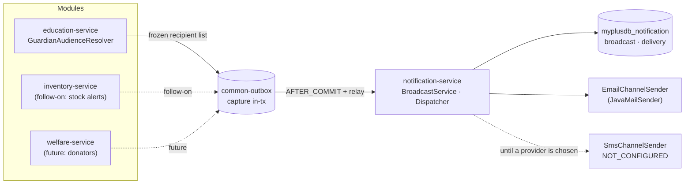
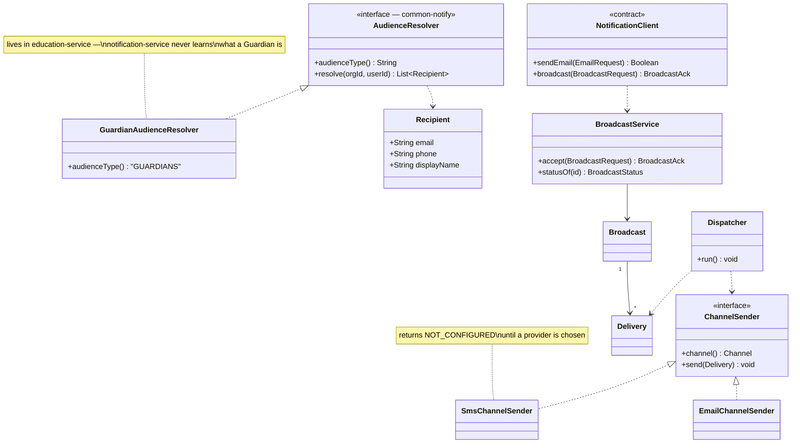

# Slice 105 — notification-service: multi-channel broadcast

**Status: DESIGN — awaiting approval. No code written.**
Standing rule: [[feedback_microservice_standards]] — notification-service is the delivery path for every service.
Sequenced AFTER the education suite fix and slice `edu-1.1`.

---

## 1. Document — what and why

### What is already right

The platform is **not** duplicating email. Verified 2026-07-31:

- `JavaMailSender` appears in exactly one place — `notification-service/service/NotificationService.java`
- auth, campaign and education all send through `common-notify`'s `NotificationClient.sendEmail(...)`
- every other `JavaMailSender` grep hit across the repo is a *comment*, not code
- the monolith no longer sends mail at all

So this slice is **not** a de-duplication exercise. The sender is already centralised and the discipline is holding.

### What is actually missing

The audit turned up four gaps, none of them "duplicated code":

| # | Gap | Evidence |
|---|---|---|
| **G1** | **Email is the only channel.** | notification-service exposes exactly one endpoint, `/email`. Zero SMS code anywhere on the platform (no Twilio, no `sendSms`, no provider config). Yet the education alert audience list is *Students, Guardians, Employees, **Drivers**, **Public**, All* — the last two are not inbox audiences. |
| **G2** | **Scheduled alerts never fire.** | `Alerts` carries `sd`/`ed` (start/end date) and `st` (status). education-service's only `@Scheduled` job is the GL outbox relay. An alert scheduled for next Monday sits at its status until a human clicks Send. The schema promises scheduling the code does not deliver. |
| **G3** | **Delivery is synchronous and unrecorded.** | `AlertController.sendAlerts` (line 150) calls `emailService.send(...)` on the request thread and returns `sent`/`failed` counts. A failed alert to 300 guardians is a log line — no per-recipient record, no retry, nothing to show the school. notification-service **has no database**: no entity, no repository, no Flyway, no datasource. It is a stateless SMTP relay. |
| **G4** | **One module of thirteen can notify.** | business, welfare, agriculture, pharmacy, marketplace: zero outbound notification code. Pharmacy's "alerts" (slice 45) are *on-screen* stock views reusing inventory's `StockAlert`. So **inventory already computes near-expiry and low-stock alerts that nobody is ever told about.** |

### The DRY risk, stated precisely

`consumerEmails(org, uid, consumersCsv)` — audience resolution — is a **private method** at
`AlertController.java:278`. The moment welfare wants "notify my donators" or pharmacy wants "email me when stock
expires", that method gets copy-pasted. The risk is real but **has not fired yet** (G4). Fixing it now is cheap;
fixing it after three copies exist is not.

**What this slice does NOT do:** it does not pick an SMS provider (§6, open decision), does not build an
alerts UI for other modules, and does not change what education's alert screen looks like.

---

## 2. Design

### D1 — The split: notification-service owns DELIVERY, the module owns WHO

This is the load-bearing decision. The temptation is to teach notification-service about audiences — let it
resolve "all Guardians in org 7". That is wrong: it would have to know what a Guardian is, then what a Donator
is, then what a Patient is, and it would need read access to every module's database. The bounded context
collapses.

```
module (education)          notification-service
─────────────────           ────────────────────
knows what a Guardian is    knows how to reach an address
resolves audience → list    channel, template, retry, delivery record
                    │
                    └──── sends a FROZEN recipient list ────►
```

A frozen list is also the more auditable choice: the delivery record shows who the school actually messaged on
the day, not who would match the query if you re-ran it next term.

### D2 — The reusable part is the *pattern*, not the resolution

`common-notify` gains an `AudienceResolver` SPI. Each module implements it **locally** — education resolves
Guardians, welfare resolves Donators — but they all implement the same interface and are driven by the same
orchestration helper. Same shape as `CreditStore` in `common-credit` (slice 0.2b), which is the precedent.

```java
public interface AudienceResolver {
    String  audienceType();                       // "GUARDIANS", "DONATORS", …
    List<Recipient> resolve(Long orgId, Long userId);
}
```

This is what kills the `consumerEmails` copy-paste without moving domain knowledge out of the domain.

### D3 — notification-service gets a database (it has never had one)

G3 cannot be closed without persistence. New `myplusdb_notification`, Flyway `V1`:

```
notification_broadcast   id, org_id, subject, body, channel, scheduled_at, status, dedupe_key, created_at
notification_delivery    id, broadcast_id, recipient, channel, status, attempts, last_error, sent_at
```

Per-recipient rows are the point: "sent to 298, failed 2, here are the 2" is a support answer; "failed 2" is not.

### D4 — Channel is a port; EMAIL ships, SMS is defined but not implemented

```java
public interface ChannelSender {           // one implementation per channel
    Channel channel();
    void send(Delivery d);
}
```

`EmailChannelSender` wraps the existing `JavaMailSender` — no behaviour change. `SMS` and `WHATSAPP` are valid
enum values that resolve to **`NOT_CONFIGURED`**, a first-class delivery status, until a provider is chosen (§6).

Defining the enum value now and refusing it honestly is better than either (a) pretending SMS works or (b)
retrofitting the enum into a live table later. It also means the UI can show *"SMS not configured — ask your
administrator"* rather than silently dropping Drivers and Public from every send.

### D5 — Reliable delivery, both halves

- **Capture** (caller side): education enqueues the broadcast through `common-outbox` in-transaction, so the
  `Alerts` row and the send request cannot diverge. AFTER_COMMIT + `@Scheduled` relay — the pattern already
  proven by `GlOutboxService`.
- **Dispatch** (notification side): the API persists deliveries as `PENDING` and returns **202** immediately. A
  `@Scheduled` dispatcher works the queue with bounded retries. This closes G2 and G3 with one mechanism —
  a scheduled broadcast is just one whose `scheduled_at` is in the future.

### D6 — Existing scheduled alerts must NOT fire on deploy

The dangerous edge. `Alerts` rows already carry `sd` dates, many in the past, that have never been acted on
because no scheduler existed. Switching one on would blast a school's entire guardian list the moment the service
starts.

**Only broadcasts created through the new API are ever dispatched.** Pre-existing `Alerts` rows are untouched and
remain manual-send. This is DB standard **D5 — never act on inference about live data**; the same reasoning that
blocked the term backfill in `edu-1.1`.

### D7 — Idempotency

`dedupe_key` (caller-supplied, unique per org) is checked before deliveries are created. A relay retry after a
timeout must not email 300 guardians twice — that is a real, visible harm, not a hygiene concern.

### D8 — Per-org configurability

Per the standing configurability lens, these go in the common-settings catalog rather than being hardcoded:

| Setting | Default | Why an org would change it |
|---|---|---|
| `notif.channel.emailEnabled` | true | — |
| `notif.channel.smsEnabled` | false | off until a provider is configured |
| `notif.sender.displayName` | org name | schools want to appear as the school |
| `notif.quietHours.start` / `.end` | unset | do not text guardians at 03:00 |
| `notif.rateCap.perHour` | 500 | protects the SMTP reputation of a shared sender |

### D9 — Scope

| In | Out |
|---|---|
| notification-service DB + broadcast/delivery model | picking an SMS provider (§6) |
| `POST /api/notifications/broadcast`, `GET /broadcasts/{id}` | alerts UI for non-education modules |
| `AudienceResolver` SPI in `common-notify` + education's implementation | changing education's alert screen layout |
| scheduled dispatch + retry + idempotency | in-app / push notifications |
| education's `sendAlerts` re-pointed at the new API | inventory stock-alert wiring (follow-on, see §7) |
| the five per-org settings (D8) | back-filling or dispatching pre-existing `Alerts` rows (D6) |

### Layer answers (§5b)

| Layer | Answer |
|---|---|
| **UI/UX** | education's alert screen gains a delivery result (sent / failed / not-configured per channel). No new screen this slice. |
| **Service/API** | `POST /broadcast` → 202 + id; `GET /broadcasts/{id}` → per-recipient status. `ADMIN_PRIVILEGE` — broadcasting to every guardian is the money/policy tier, per D-3. |
| **Database** | MySQL, `myplusdb_notification`. Relational and small; delivery rows are queried by broadcast and by status. Indexed `(status, scheduled_at)` for the dispatcher and `(org_id)` per DB standard D3. |
| **Patterns** | Ports & adapters (`ChannelSender`), SPI (`AudienceResolver`), transactional outbox (capture), scheduled worker (dispatch), idempotency key. |
| **Microservice design** | Delivery is genuinely cross-cutting → stays a standalone service with its own DB and contract. Domain knowledge stays in each module (DIP: modules depend on the contract, notification-service depends on nobody). |
| **Configurability** | Five catalog settings (D8), rendered by the existing self-rendering Configuration screen — no bespoke form. |
| **DRY** | One sender, one dispatcher, one retry policy, one SPI. `consumerEmails` stops being a private method and becomes an implemented interface. |

---

## 3. Architecture & UML

### Architecture



### Class diagram



### Sequence — a school broadcasts to guardians

```mermaid
sequenceDiagram
  actor Clerk
  participant AC as AlertController
  participant AR as GuardianAudienceResolver
  participant OB as common-outbox
  participant NS as notification-service
  participant D as Dispatcher
  participant SMTP

  Clerk->>AC: send alert → Guardians, Public
  AC->>AR: resolve(org)
  AR-->>AC: 300 recipients (frozen)
  AC->>OB: enqueue broadcast (SAME tx as the Alerts row)
  Note over AC,OB: capture is atomic; delivery is not — by design
  OB-->>AC: committed
  AC-->>Clerk: accepted (202)

  OB->>NS: POST /broadcast (AFTER_COMMIT, retried by relay)
  NS->>NS: dedupe_key seen before?
  alt already accepted
    NS-->>OB: 200 same id (no new deliveries)
  else new
    NS->>NS: persist 300 PENDING deliveries
  end

  loop scheduled, bounded retries
    D->>SMTP: send email deliveries
    SMTP-->>D: ok / failure
    D->>D: SENT | RETRY | FAILED(last_error)
  end
  Note over D: "Public" over SMS → NOT_CONFIGURED,<br/>surfaced to the clerk, never silently dropped
```

---

## 4. Implement — checklist

- [ ] `common-notify`: `AudienceResolver` SPI, `Recipient`, `BroadcastRequest`/`BroadcastAck`, `Channel` enum;
      extend `NotificationClient` with `broadcast(...)` (additive — `sendEmail` untouched)
- [ ] notification-service: datasource + Flyway `V1` (`notification_broadcast`, `notification_delivery`,
      indexes on `(status, scheduled_at)` and `(org_id)`)
- [ ] `BroadcastService.accept()` — dedupe on `dedupe_key`, persist PENDING, return 202
- [ ] `ChannelSender` port + `EmailChannelSender` (wraps today's `JavaMailSender`, no behaviour change) +
      `SmsChannelSender` returning `NOT_CONFIGURED`
- [ ] `Dispatcher` — `@Scheduled`, honours `scheduled_at`, bounded retry, records `last_error`
- [ ] `GET /broadcasts/{id}` — per-recipient status, org-scoped + anti-IDOR by-id read
- [ ] education: `GuardianAudienceResolver` replacing the private `consumerEmails`; `sendAlerts` enqueues via
      `common-outbox` instead of sending inline
- [ ] the five `notif.*` settings in the common-settings catalog (D8)
- [ ] `ADMIN_PRIVILEGE` on broadcast endpoints (D-3 tier)
- [ ] i18n keys × 6 bundles for the delivery-result UI
- [ ] register on Eureka / config-server / gateway route

## 5. Test

| # | Case | Expected |
|---|---|---|
| 1 | Broadcast to Guardians | 202 + id; delivery rows = recipient count |
| 2 | Same `dedupe_key` posted twice | same id, **no** second set of deliveries — nobody emailed twice |
| 3 | SMTP fails for 2 of 300 | 298 SENT, 2 FAILED with `last_error`; the 298 are not re-sent on retry |
| 4 | Channel = SMS | `NOT_CONFIGURED`, surfaced in the response, no silent drop |
| 5 | `scheduled_at` in the future | still PENDING immediately after; dispatched once due |
| 6 | **Pre-existing `Alerts` row with a past `sd`** | **never dispatched** (D6) — the deploy-safety case |
| 7 | Another tenant's broadcast id | 404/refused (org-scoped, anti-IDOR) |
| 8 | A teacher (`user.education@`) posts a broadcast | 403 — ADMIN tier |
| 9 | notification-service down when education sends | `Alerts` row still committed; relay delivers on recovery |
| 10 | Existing `sendEmail` callers (auth verification, password reset, campaign lead) | unchanged — regression |

Gate: `cypress/e2e/platform/notification-broadcast.cy.js`
**Regression:** `education/alerts.cy.js`, plus auth signup/reset (they share `NotificationClient`).
Unit: dedupe, retry-bound and the D6 guard are pure logic → always-run tests, per the tests-on-build standard.

## 6. Open decision — SMS provider

Deliberately **not** decided here, because it is a cost and market question rather than a technical one:
Twilio is the default international answer, but a Pakistan-market gateway is typically far cheaper per message
and may be required for local sender-ID registration. Whichever is chosen becomes one `ChannelSender`
implementation — roughly a day's work — because D4 puts the port in now.

**This slice ships without it**, and is worth shipping without it: G2, G3 and the G4 copy-paste risk all close on
the email channel alone.

## 7. Risks

- **Fan-out volume.** 300 guardians is one broadcast but 300 SMTP conversations. The rate cap (D8) and the
  bounded-retry dispatcher exist for this; without them a large school can get the shared sender rate-limited or
  reputation-flagged. Worth watching in the first real send.
- **D6 is the deploy-safety decision.** If it is implemented loosely, turning the dispatcher on emails every
  historical alert a school ever drafted. Test case 6 is the gate and should not be waived.
- **notification-service becoming stateful** changes its ops profile — it now needs a DB, migrations and backup
  like every other service. That is the correct trade for G3, but it is a genuine step up from a stateless relay.
- **Scope creep toward a campaign engine.** Templates, segments and open-tracking are a different product;
  campaign-service already exists. This slice stays at *transactional and operational* notification.

## 8. Follow-on (not this slice)

Once the broadcast API exists, inventory's near-expiry / low-stock `StockAlert` — today computed and only ever
displayed — becomes a scheduled broadcast to the store owner. That is the clearest demonstration that the split
in D1 pays off: inventory supplies *who cares about this stock*, notification-service does the rest.
