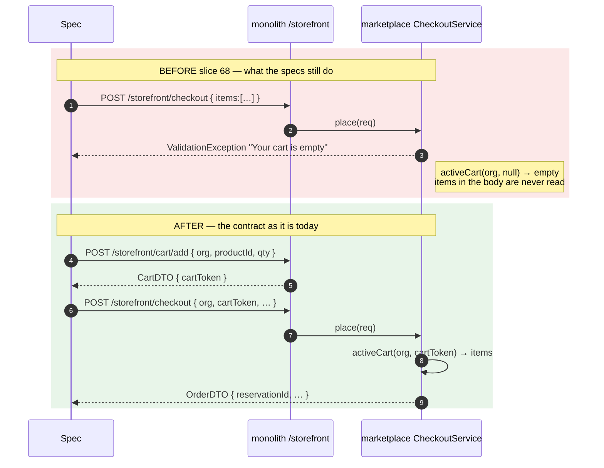
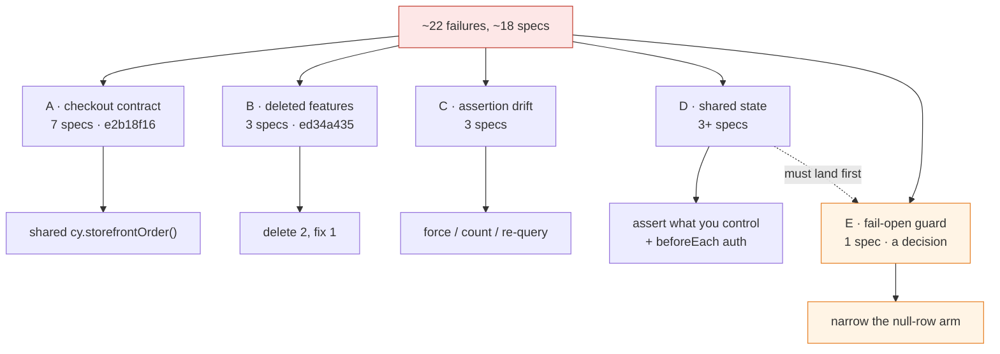

# Slice 106 — Cypress suite health: the suite drifted behind the app

**Status:** 🟡 **A–D BUILT (17 files) — awaiting the suite run. E deliberately NOT built** (it is production
security and is gated on its own decision; see §2e and §8).
Raised by: a full `test:e2e:business` run on 2026-08-04 that produced **~22 failures across ~18 specs**.
Related: [`b2b-P3f-credit-notes-on-statements.md`](b2b-P3f-credit-notes-on-statements.md) (the slice that was
being verified when this surfaced — and which is **not** implicated in any of it).

---

## 1. Document

### What happened

3f shipped green (`mvn test` + a 6/6 gate). A full business-suite run immediately afterwards produced ~22
failures. **None of them are in 3f's blast radius** — verified path by path: the two nearest,
`tax-register.cy.js` and `purchase-return`, call `voidPurchase` (a `PurchaseController` method) and not the
`PurchaseService.purchaseReturn` that 3f edited.

### The real finding

**Every slice gate this month passed as a single `--spec <one file>` run.** That is the house cadence and it
works — but it never exercises the suite *as a suite*. Four kinds of rot accumulated invisibly underneath it:

1. a **contract change** that silently invalidated seven specs,
2. **deleted features** whose specs were never retired,
3. **assertions that drifted** behind the UI,
4. **shared state** that only bites when specs run in sequence.

A green single-spec gate cannot see any of these. That is the gap this slice closes.

### The taxonomy, with evidence

| # | Cause | Specs | Proof |
|---|---|---|---|
| **A** | **Slice 68 changed the checkout contract.** `CheckoutService.place()` reads a server-side cart via `req.getCartToken()`; the specs still POST `items:[…]` inline, so `activeCart(org, null)` is empty and every one fails on `"Your cart is empty"`. | `storefront`, `storefront-saga`, `storefront-timeline`, `storefront-track`, `storefront-payment`, `order-cancel`, `order-saga-relay` (**7 specs, ~14 tests**) | `CheckoutService.java:50-52`; commit `e2b18f16` *"persistent server-side cart (slice 68, E3)"* |
| **B** | **The Item→Product convergence deleted what these assert.** `/backfillProductIds` and `/migrateCatalog` no longer exist (404 `NoResourceFoundException`); `#registrationType` no longer has an `Item` option. | `backfill-productids`, `m3c-prep-backfill` (wholly dead) · `vertical-profile` (two assertions only) | commit `ed34a435`; `businessDashboard.html` `#registrationType` now has 4 options, none `Item` |
| **C** | **Assertions drifted behind the UI.** A `.selectpicker` hides its native `<select>`, so `.trigger()` needs `force` — which the same spec already uses nine times. The Sale Detail Report gained a column. A chip picker re-renders, detaching the subject mid-chain. | `purchase:273`, `sell:293` (13 vs **14** columns), `team-picker:85` | app is **ahead** of the specs — `sell.cy.js` finds *more* columns than it expects |
| **D** | **Shared state bleeds between specs.** An org setting read `off` where the spec wanted the `warn` default; a DEMO session saw the owner-only Team section. | `credit-limit:93`, `team:27`, likely `commerce-gaps` + `multi-location` | `pos.sale.creditLimitPolicy` is org-scoped and mutable by any spec |
| **E** | **A fail-open location guard.** Not a test bug — a design question (see §2e). | `multi-location` T6b | `LocationScope.java:55-60` |

### What is NOT wrong

The app. `sell.cy.js` finding 14 columns where the spec expects 13 is the tell: **the application is ahead of
the suite, not behind it.** An early diagnosis in this session blamed a stale monolith jar and was wrong — the
monolith runs from an IDE launch (`com.Application`, argfile classpath) started *after* the last source edit,
so `target/myplus.jar`'s timestamp is irrelevant. Recorded here because the same wrong turn is easy to repeat.

---

## 1b. Standards this slice is built to

- **[[feedback_cypress_gate_per_slice]]** — the per-slice gate stays. This slice *adds* a suite-level check;
  it does not replace the cadence that has been working.
- **[[feedback_no_duplicate_functions_dry]]** — seven specs need the same cart choreography. It goes in
  `cypress/support/commands.js` **once**, not seven times.
- **[[feedback_test_helpers_must_fail_loudly]]** — the new helper must assert its own responses. A cart helper
  that silently returns `undefined` would convert 14 loud failures into 14 vacuous passes, which is worse than
  today.
- **[[feedback_stop_on_test_failure]]** — each workstream below lands and is verified before the next.

---

## 2. Design — five workstreams, independently landable

Ordered by *failures removed per unit of risk*. A and B are mechanical; C is small; D is a genuine design
change to the specs; E is a decision about the product.

### 2a. Workstream A — migrate seven specs to the cart contract *(≈14 failures)*

The contract slice 68 introduced:

```
POST /storefront/cart/add   { organizationId, cartToken?, productId, quantity }
                            → CartDTO { cartToken, items[], count }     // server mints the token when absent
POST /storefront/checkout   { organizationId, cartToken, customerName, … }
```

**One shared command**, because seven specs need the identical two-step and a copy in each is how they drift
apart again:

```js
// cypress/support/commands.js
Cypress.Commands.add('storefrontOrder', ({ orgId, productId, quantity, ...rest }) => { … })
//  1. POST /storefront/cart/add  → assert success, capture cartToken (fail loudly if absent)
//  2. POST /storefront/checkout  with that cartToken
//  → yields the checkout response, so each spec keeps its own assertions unchanged
```

Each spec's `checkout(qty, name)` local helper is replaced by a call to it. **The assertions themselves do not
change** — they are testing real behaviour that still exists, they simply never reach it. `storefront.cy.js:54`
is the clearest case: it asserts the failure message names a *stock* problem, and gets `"your cart is empty"`.

### 2b. Workstream B — retire what the app deleted *(3 specs)*

- **Delete** `backfill-productids.cy.js` and `m3c-prep-backfill.cy.js`. Both exist solely to drive
  `/backfillProductIds` and `/migrateCatalog`, one-time migration endpoints removed with the Item entity in
  `ed34a435`. There is nothing left to test; keeping them means a permanently red suite, which trains everyone
  to ignore red.
- **Fix, do not delete,** `vertical-profile.cy.js`. Its subject — per-vertical branding via `VERTICAL_PROFILE`
  — is alive and worth testing. Only the two `#registrationType` assertions (`Item` / `Medicine`) are dead.
  They should assert on a *live* relabelled entry, or be dropped if no dropdown entry is relabelled per
  vertical any more.

> Deleting specs needs an explicit yes (§6, Q1) — a deleted test is coverage nobody notices losing.

### 2c. Workstream C — correct the drifted assertions *(3 specs)*

| Spec | Fix |
|---|---|
| `purchase.cy.js:273` | `.trigger('change', { force: true })` — `#purchaseItemDD` is a `.selectpicker`, so the native `<select>` is permanently `display:none`. Its own next three lines already force. |
| `sell.cy.js:293` | Update 13 → 14, **after confirming which column was added and that it belongs**. A count assertion that is edited to match reality without checking is worthless. |
| `team-picker.cy.js:85` | Break the chain per Cypress's own guidance (`.as()` then re-query) — the chip picker re-renders and detaches the subject. |

### 2d. Workstream D — stop specs leaking into each other *(3+ specs)*

Two distinct leaks, and the fix differs:

**Org settings.** `credit-limit.cy.js:93` asserts `pos.sale.creditLimitPolicy` *is* `warn` — a claim about a
**global mutable default** that any other spec can invalidate by changing it. Restoring it in an `afterEach`
would work but stays order-fragile. **Better: the test should assert what it controls.** Its real intent is
"the setting exists, is a SELECT, and offers both policies" — that is schema, and it is stable. A test that
needs a *specific* value should set that value first.

**Auth/session.** `team.cy.js:27` expects a DEMO account not to see `#snavTeam` and finds it — the signature of
a previous test's owner session surviving. Covered by [[feedback_cypress_test_isolation_login]]: log in inside
`beforeEach`, never `before`. Needs an audit of which specs still use `before` for auth.

### 2e. Workstream E — the fail-open location guard *(a decision, not a fix)*

`multi-location` T6b (a store-B admin opening a store-A sale) is **not** a missing check. The check is there:

```java
// SellController.java:319-320
if (!myStore(clicked.getStoreId())) return new GenericResponse("NOT_FOUND", …);  // anti-IDOR (cross-store)
```

It bottoms out in:

```java
// LocationScope.java:55-60
public static boolean canAccess(Long locationId) {
    if (isOwnerSuper()) return true;
    Set<Long> mine = accessible();
    if (mine.isEmpty() || locationId == null) return true;   // ← two fail-open arms
    return mine.contains(locationId);
}
```

**Two arms, and they are not equally defensible:**

| Arm | Why it exists | Risk |
|---|---|---|
| `mine.isEmpty()` — caller has no grants | A single-store tenant has no grants and must keep working | **Legitimate**, but it means a grant-provisioning failure silently removes location isolation everywhere, with no error |
| `locationId == null` — **row** has no store | Legacy rows predate multi-location | **This is the dangerous one.** In a genuinely multi-store org, an unstamped row is visible to *every* store |

**Proposed:** keep arm 1; narrow arm 2 — **when the caller HAS grants (i.e. this is a multi-store org), an
unstamped row is no longer blanket-visible.** Single-store tenants are untouched because they have no grants
and never reach the narrowed branch. This needs the user's decision (§6, Q2), and it needs a check for how many
unstamped rows exist before it can ship — narrowing a guard can hide live data.

Whether T6b's specific failure is *this* or merely broken fixtures is unresolved: with the state bleed in
workstream D, `loginAsStoreAdmin()` may simply have had no grants. **D must land first**, then T6b re-run. If
it goes green, this is a latent design issue rather than a live one — still worth deciding, but not urgent.

---

## 3. Architecture & UML

### The contract that broke seven specs



### Where each failure class comes from



---

## 4. Implement — order and rationale

1. **D (auth/session half)** — first, because state bleed makes every other result untrustworthy, including
   T6b's.
2. **A** — the shared command, then the seven specs. Biggest single reduction.
3. **B** — retire/fix, once approved.
4. **C** — three small edits; `sell.cy.js`'s column needs identifying, not just re-counting.
5. **D (settings half)** — re-shape `credit-limit`'s assertion to schema.
6. **E** — re-run T6b on a clean suite, *then* decide. Ship the guard change only if the user approves it.

Nothing here touches production code except workstream E, which is gated on its own decision.

## 5. Test

**The gate is the suite itself** — that is the point of the slice:

```
npm run test:e2e:business
```

Green, with the two retired specs gone. Two rules follow from what caused this:

- **Run the whole business suite before declaring a slice done**, not only its own spec. The per-slice gate
  stays as the fast inner loop; the suite run is the outer one.
- **A spec that mutates org-wide state must not assert a global default** — it either sets what it asserts or
  asserts the schema.

Both belong in `SAAS-BUILD-STANDARDS.md §1.6` beside the existing "`mvn test` is half the gate" rule, which
came from the same family of mistake: a green signal that could not see what it did not compile or run.

## 6. Open questions — need answers before implementing

1. **Delete `backfill-productids.cy.js` and `m3c-prep-backfill.cy.js`?** They test endpoints that no longer
   exist. My recommendation is yes — but a deleted test is coverage nobody notices losing, so it is your call.
2. **Narrow the `locationId == null` fail-open arm** (§2e), or leave it and document the reliance on grant
   provisioning? Needs a count of unstamped rows first — narrowing a guard can hide live data.
3. **`sell.cy.js` 13 → 14 columns** — which column was added, and does it belong in the Sale Detail Report?
   I will identify it and report before editing the number rather than making the test agree with reality.

## 8. As built (2026-08-04) — four things the design got wrong

**1. Workstream A was 8 specs, not 7.** `storefront-account.cy.js` had the same inline-`items` bug and had
**not yet failed** — the run never reached it. Found by grepping every `/storefront/checkout` call site rather
than working from the failure list; `order-refund`, `order-return`, `storefront-checkout` and
`storefront-coupon` were checked too and already use `cartToken` (they were written after slice 68). The
helper also had to forward `customerToken` onto the cart **add**, not just the checkout, or a signed-in
shopper's order never links to their account and `/storefront/myorders` cannot see it.

**2. `team.cy.js` was assertion drift, not state bleed — the design mis-filed it.** It asserted a DEMO account
cannot see `#snavTeam`. The gate was deliberately widened to
`hasAnyAuthority('ROLE_OWNER','ADMIN_PRIVILEGE')` so admins can manage users in their own stores, and
`DEMO_ROLE` is seeded from `superSet` (super ⊇ admin), so a demo account *does* hold `ADMIN_PRIVILEGE`.
Checking this before "fixing" it mattered: adding a `beforeEach` would have changed nothing and buried a real
finding — **the nav opened to admins but `/team/users` still requires `ROLE_OWNER`**, so an admin can open
Manage Users and be refused on submit. The spec now pins both halves and the mismatch is flagged for a
decision (§9, Q4) rather than silently resolved.

**3. `credit-limit` had a better fix than the design proposed.** Rather than reshaping to a pure schema
assertion, `SettingEntry` turned out to carry its own **`defaultValue`** alongside the mutable `value`. The
test now asserts `defaultValue == 'warn'` — literally what its name claims, immune to what any other spec set
— plus that the options offer all three policies, plus that the *current* value is a legal policy. That keeps
a corrupt-setting check without depending on spec order.

**4. The `sell.cy.js` column was identified, not guessed.** The 14th is **Margin** (per-line profit, from the
Sale Detail Report rebuild). It belongs, so the count moved 13 → 14 **and** `Margin` was added to the
by-name list — a bare count bumped to agree with reality would assert nothing.

**Audit that came back clean:** no spec in the suite uses `before()` for auth, and `cy.session` keys on
`[email, password, validatePath]`, so accounts cannot share a cached session. The auth-bleed hypothesis in
§2d was wrong; the only real shared-state item was the org setting.

**5. A SIXTH cause, found only once workstream A unblocked the specs behind it.** `order-cancel.cy.js`'s UI
test used `cy.on('window:confirm', () => true)`, but `cancelOrder()` migrated to the shared **`uiConfirm`**
dialog. The handler became a no-op: the dialog opened, nothing answered it, and `/updateOrderStatus` never
fired — so `cy.wait('@cancel')` timed out. Fixed with the suite's established pattern,
`cy.get('[data-ui-confirm="ok"]').click()`.

**This is the shape of the whole slice in one example: fixing the top layer reveals the next.** The spec could
not reach this failure while it was still dying at checkout. Expect one or two more like it — a cause that
only becomes visible once the specs in front of it run.

Swept the rest of the suite for the same drift: **`order-cancel.cy.js` was the only genuine case.**
`purchase.cy.js` looked like one but deliberately exercises the *cancel* path via `.uiC-cancel`, which is
correct. No other spec still references `window:confirm`.

## 9. Open questions

1. ~~Delete the two dead specs?~~ **Done** — removed with `git rm`, recoverable from history.
2. **Narrow the `locationId == null` fail-open arm** (§2e)? Still open. Needs a count of unstamped rows first.
3. **`sell.cy.js` column** — resolved (Margin, §8.4).
4. **NEW — the Team nav/API mismatch** (§8.2): should `/team/users` accept `ADMIN_PRIVILEGE` to match the
   template's stated intent, or should the nav re-narrow to `ROLE_OWNER`? A product decision, not a test one.

## 7. What this slice does NOT do

- It does **not** change production behaviour, except potentially workstream E — which is separately gated.
- It does **not** rewrite the specs' assertions. Almost all of them assert real, live behaviour; they simply
  cannot reach it. Rewriting assertions to make a suite green is how a suite stops being worth running.
- It does **not** replace the per-slice gate. That cadence caught real defects all month (3f's own gate caught
  the void trap). The gap was never the gate — it was that nothing ran the suite afterwards.
